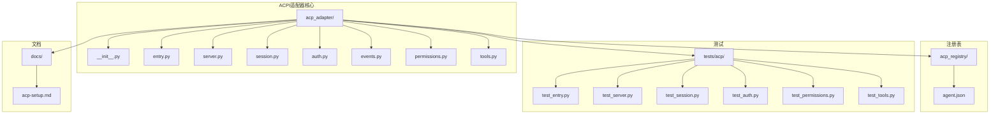
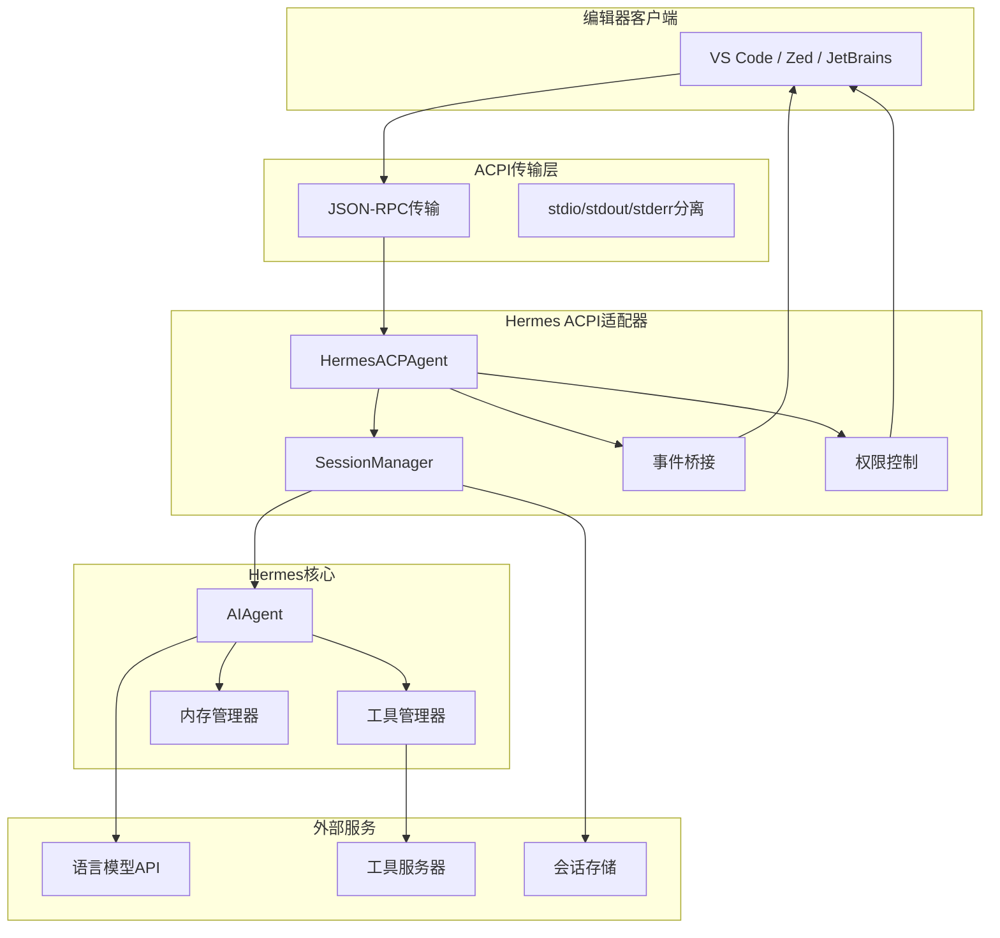
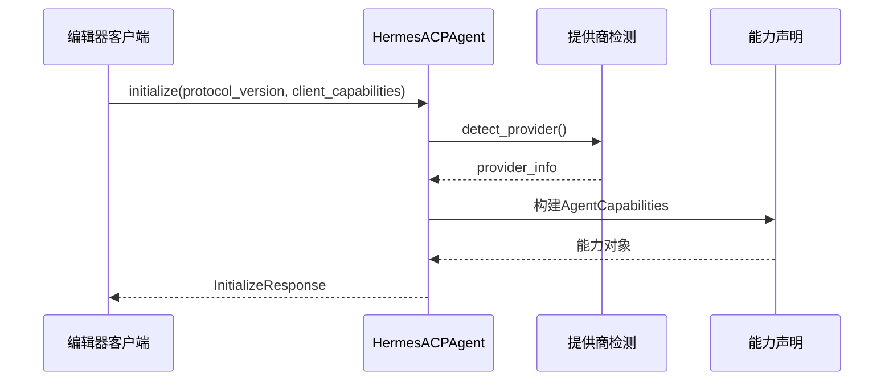
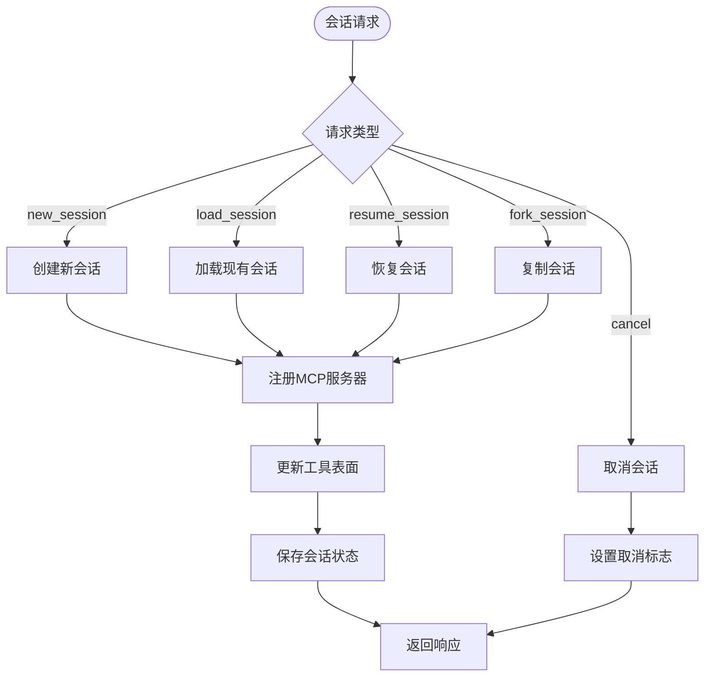
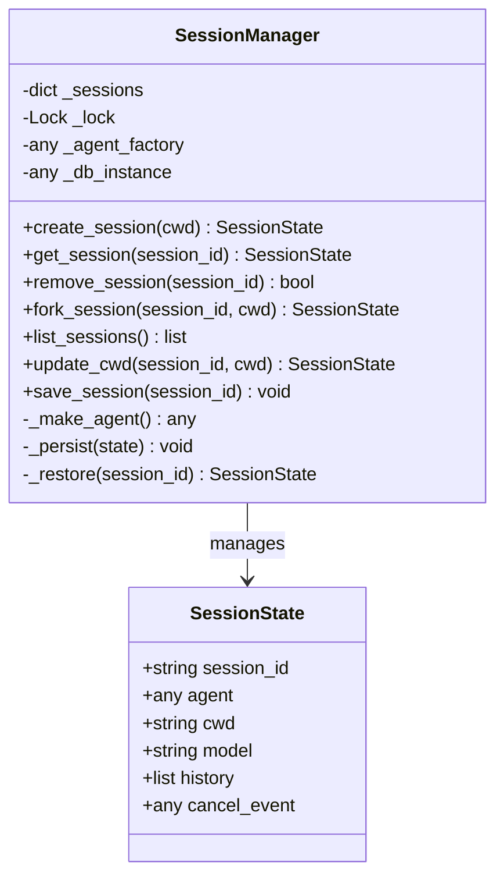
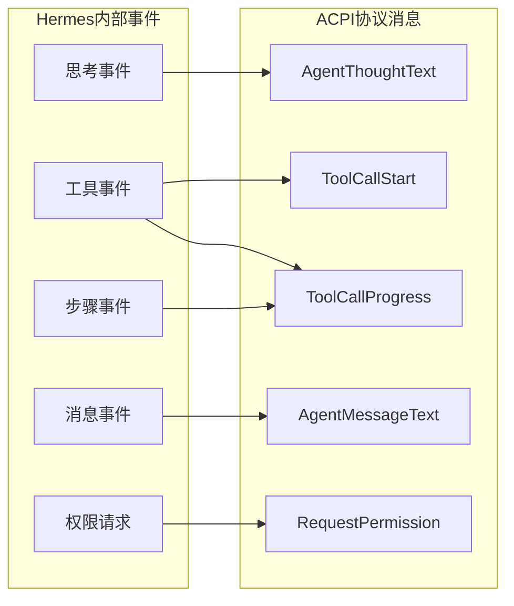
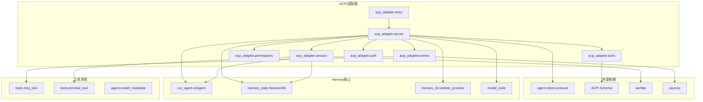

# ACPI协议规范

<cite>
**本文档引用的文件**
- [acp_adapter/__init__.py](file://acp_adapter/__init__.py)
- [acp_adapter/entry.py](file://acp_adapter/entry.py)
- [acp_adapter/server.py](file://acp_adapter/server.py)
- [acp_adapter/session.py](file://acp_adapter/session.py)
- [acp_adapter/auth.py](file://acp_adapter/auth.py)
- [acp_adapter/events.py](file://acp_adapter/events.py)
- [acp_adapter/permissions.py](file://acp_adapter/permissions.py)
- [acp_adapter/tools.py](file://acp_adapter/tools.py)
- [acp_registry/agent.json](file://acp_registry/agent.json)
- [docs/acp-setup.md](file://docs/acp-setup.md)
- [tests/acp/test_entry.py](file://tests/acp/test_entry.py)
- [tests/acp/test_server.py](file://tests/acp/test_server.py)
- [tests/acp/test_session.py](file://tests/acp/test_session.py)
- [tests/acp/test_auth.py](file://tests/acp/test_auth.py)
- [tests/acp/test_permissions.py](file://tests/acp/test_permissions.py)
- [tests/acp/test_tools.py](file://tests/acp/test_tools.py)
</cite>

## 目录
1. [简介](#简介)
2. [项目结构](#项目结构)
3. [核心组件](#核心组件)
4. [架构概览](#架构概览)
5. [详细组件分析](#详细组件分析)
6. [依赖关系分析](#依赖关系分析)
7. [性能考虑](#性能考虑)
8. [故障排除指南](#故障排除指南)
9. [结论](#结论)
10. [附录](#附录)

## 简介

Hermes Agent的ACPI（Agent Client Protocol）集成为Hermes AI代理提供了标准化的协议接口，使其能够在各种编辑器环境中作为智能代理运行。该协议允许编辑器通过标准的JSON-RPC通信机制与Hermes Agent进行交互，支持会话管理、工具调用、权限控制和实时流式响应等功能。

ACPI协议的核心目标是为开发者提供一个统一的接口，使他们能够利用Hermes Agent的强大功能，包括多模型支持、丰富的工具集、持久化记忆和跨平台部署能力。通过ACPI集成，用户可以在熟悉的编辑器界面中进行代码编写、文件操作、终端命令执行和网络搜索等任务。

## 项目结构

Hermes Agent的ACPI集成采用模块化设计，主要包含以下核心目录和文件：



**图表来源**
- [acp_adapter/server.py:1-727](file://acp_adapter/server.py#L1-L727)
- [acp_adapter/session.py:1-476](file://acp_adapter/session.py#L1-L476)

**章节来源**
- [acp_adapter/__init__.py:1-2](file://acp_adapter/__init__.py#L1-L2)
- [acp_adapter/entry.py:1-86](file://acp_adapter/entry.py#L1-L86)

## 核心组件

### ACPI服务器核心

HermesACPAgent类是ACPI协议的主要实现，继承自acp.Agent基类，提供了完整的协议方法实现：

- **initialize**: 协议初始化和能力声明
- **authenticate**: 身份认证处理
- **session管理**: 新建、加载、恢复、取消会话
- **prompt**: 核心对话处理
- **工具调用**: 支持多种工具类型的ACPI映射

### 会话管理器

SessionManager负责管理ACPI会话的生命周期，包括：
- 会话创建和销毁
- 历史记录持久化
- 工作目录绑定
- 多线程安全访问

### 事件桥接系统

事件桥接系统将Hermes Agent内部事件转换为ACPI协议消息：
- 工具进度回调
- 思考过程通知
- 步骤完成通知
- 消息流式传输

**章节来源**
- [acp_adapter/server.py:92-727](file://acp_adapter/server.py#L92-L727)
- [acp_adapter/session.py:70-476](file://acp_adapter/session.py#L70-L476)
- [acp_adapter/events.py:1-176](file://acp_adapter/events.py#L1-L176)

## 架构概览

Hermes Agent的ACPI架构采用分层设计，确保了协议实现的清晰性和可维护性：



**图表来源**
- [acp_adapter/server.py:142-466](file://acp_adapter/server.py#L142-L466)
- [acp_adapter/session.py:78-476](file://acp_adapter/session.py#L78-L476)

## 详细组件分析

### ACPI服务器实现

HermesACPAgent类实现了ACPI协议的所有核心方法，提供了完整的会话管理和对话处理功能。

#### 初始化流程



**图表来源**
- [acp_adapter/server.py:216-254](file://acp_adapter/server.py#L216-L254)
- [acp_adapter/auth.py:8-24](file://acp_adapter/auth.py#L8-L24)

#### 会话管理流程



**图表来源**
- [acp_adapter/server.py:263-333](file://acp_adapter/server.py#L263-L333)
- [acp_adapter/server.py:149-213](file://acp_adapter/server.py#L149-L213)

**章节来源**
- [acp_adapter/server.py:216-466](file://acp_adapter/server.py#L216-L466)

### 会话管理器详解

SessionManager提供了线程安全的会话管理功能，确保在多用户环境下的一致性和可靠性。

#### 会话状态管理



**图表来源**
- [acp_adapter/session.py:58-106](file://acp_adapter/session.py#L58-L106)
- [acp_adapter/session.py:70-163](file://acp_adapter/session.py#L70-L163)

#### 持久化机制

会话管理器使用SQLite数据库进行会话状态的持久化存储，支持以下功能：

- **会话元数据存储**: 包括工作目录、模型配置等
- **消息历史持久化**: 完整的对话历史记录
- **工具调用跟踪**: 记录所有工具调用的详细信息
- **跨进程恢复**: 支持编辑器重启后的会话恢复

**章节来源**
- [acp_adapter/session.py:273-405](file://acp_adapter/session.py#L273-L405)

### 事件桥接系统

事件桥接系统将Hermes Agent内部的事件转换为ACPI协议的消息格式，确保编辑器能够实时接收代理的状态变化。

#### 事件类型映射



**图表来源**
- [acp_adapter/events.py:47-176](file://acp_adapter/events.py#L47-L176)
- [acp_adapter/permissions.py:26-78](file://acp_adapter/permissions.py#L26-L78)

**章节来源**
- [acp_adapter/events.py:1-176](file://acp_adapter/events.py#L1-L176)
- [acp_adapter/permissions.py:1-78](file://acp_adapter/permissions.py#L1-L78)

### 工具调用映射

ACPI协议支持多种工具类型的映射，确保不同类型的工具调用能够正确地在编辑器中显示和处理。

#### 工具类型映射表

| Hermes工具 | ACPI工具类型 | 描述 |
|------------|--------------|------|
| read_file | read | 文件读取 |
| write_file | edit | 文件写入 |
| patch | edit | 代码补丁 |
| search_files | search | 文件搜索 |
| terminal | execute | 终端命令 |
| process | execute | 进程执行 |
| execute_code | execute | 代码执行 |
| web_search | fetch | 网络搜索 |
| web_extract | fetch | 内容提取 |
| browser_* | fetch/execute | 浏览器操作 |
| vision_analyze | read | 图像分析 |
| image_generate | execute | 图像生成 |

**章节来源**
- [acp_adapter/tools.py:17-56](file://acp_adapter/tools.py#L17-L56)

## 依赖关系分析

Hermes Agent的ACPI集成具有清晰的依赖层次结构，确保了模块间的松耦合和高内聚。



**图表来源**
- [acp_adapter/server.py:11-61](file://acp_adapter/server.py#L11-L61)
- [acp_adapter/session.py:11-267](file://acp_adapter/session.py#L11-L267)

**章节来源**
- [acp_adapter/server.py:1-727](file://acp_adapter/server.py#L1-L727)
- [acp_adapter/session.py:1-476](file://acp_adapter/session.py#L1-L476)

## 性能考虑

### 并发处理

Hermes Agent采用线程池模式处理ACPI请求，确保高并发场景下的稳定性：

- **线程池大小**: 默认4个工作线程
- **异步I/O**: 使用asyncio处理网络通信
- **连接复用**: 单一连接对象复用多个会话

### 内存管理

- **会话缓存**: 内存中的会话状态管理
- **历史记录压缩**: 自动上下文压缩以控制内存使用
- **持久化策略**: SQLite数据库用于长期存储

### 网络优化

- **流式响应**: 实时流式传输对话结果
- **增量更新**: 部分更新而非全量刷新
- **连接池**: 复用HTTP连接减少开销

## 故障排除指南

### 常见问题诊断

#### 启动问题

**症状**: ACP服务器启动后立即崩溃
**解决方案**: 
1. 检查环境变量配置
2. 验证API密钥有效性
3. 查看stderr日志输出

#### 会话恢复失败

**症状**: 编辑器重启后无法恢复会话
**解决方案**:
1. 检查SessionDB文件完整性
2. 验证会话元数据格式
3. 确认工作目录可访问性

#### 工具调用超时

**症状**: 工具执行长时间无响应
**解决方案**:
1. 检查网络连接状态
2. 验证工具服务器可用性
3. 调整超时参数配置

**章节来源**
- [tests/acp/test_server.py:172-176](file://tests/acp/test_server.py#L172-L176)
- [tests/acp/test_session.py:129-142](file://tests/acp/test_session.py#L129-L142)

## 结论

Hermes Agent的ACPI集成提供了一个完整、稳定且高性能的协议实现，支持现代开发环境的各种需求。通过模块化的架构设计和完善的错误处理机制，该实现能够满足从个人开发者到企业级应用的各种使用场景。

关键优势包括：
- **标准化协议**: 完全符合ACPI规范
- **多平台支持**: 支持VS Code、Zed、JetBrains等主流编辑器
- **安全性**: 内置权限控制系统和审批流程
- **可扩展性**: 模块化设计便于功能扩展
- **可靠性**: 完善的错误处理和会话恢复机制

## 附录

### ACPI协议方法规范

#### Initialize方法
- **请求参数**: protocol_version, client_capabilities, client_info
- **响应格式**: protocol_version, agent_info, agent_capabilities, auth_methods
- **用途**: 协议协商和能力声明

#### Authenticate方法
- **请求参数**: method_id
- **响应格式**: AuthenticateResponse 或 None
- **用途**: 身份认证验证

#### Session Management方法
- **new_session**: 创建新会话
- **load_session**: 加载现有会话
- **resume_session**: 恢复会话
- **cancel**: 取消会话
- **fork_session**: 复制会话

#### Prompt方法
- **请求参数**: prompt内容块, session_id
- **响应格式**: stop_reason, usage信息
- **用途**: 核心对话处理

### 配置参考

#### 编辑器配置示例

**VS Code配置**:
```json
{
  "acpClient.agents": [
    {
      "name": "hermes-agent",
      "registryDir": "/path/to/hermes-agent/acp_registry"
    }
  ]
}
```

**Zed配置**:
```json
{
  "agent_servers": {
    "hermes-agent": {
      "type": "custom",
      "command": "hermes",
      "args": ["acp"],
    },
  },
}
```

**章节来源**
- [docs/acp-setup.md:16-229](file://docs/acp-setup.md#L16-L229)
- [acp_registry/agent.json:1-13](file://acp_registry/agent.json#L1-L13)