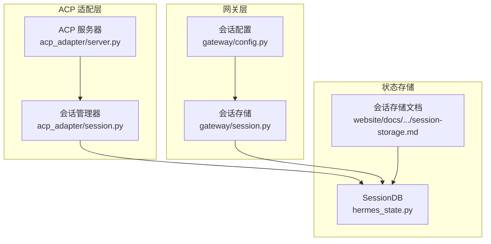
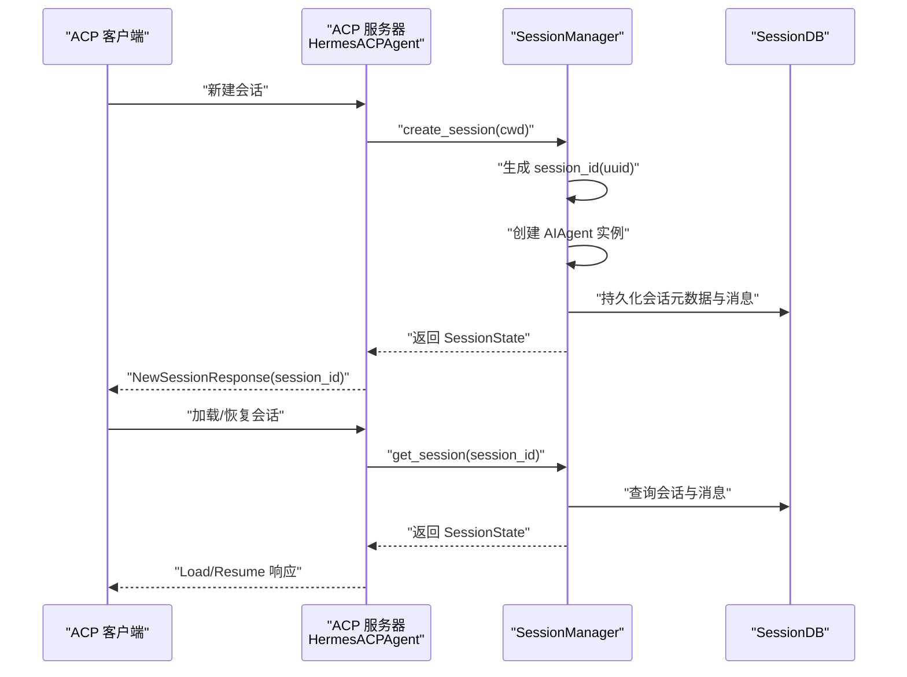
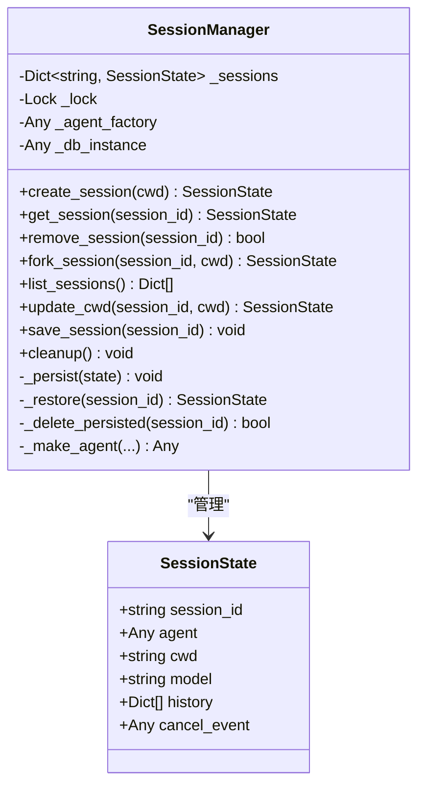
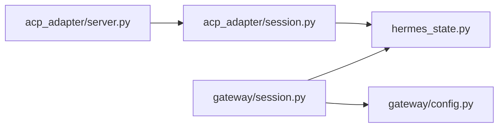

# 会话管理

<cite>
**本文引用的文件**
- [acp_adapter/session.py](file://acp_adapter/session.py)
- [acp_adapter/server.py](file://acp_adapter/server.py)
- [gateway/session.py](file://gateway/session.py)
- [gateway/config.py](file://gateway/config.py)
- [hermes_state.py](file://hermes_state.py)
- [website/docs/developer-guide/session-storage.md](file://website/docs/developer-guide/session-storage.md)
- [tests/acp/test_session.py](file://tests/acp/test_session.py)
- [tests/gateway/test_session_reset_notify.py](file://tests/gateway/test_session_reset_notify.py)
- [tests/test_hermes_state.py](file://tests/test_hermes_state.py)
</cite>

## 目录
1. [简介](#简介)
2. [项目结构](#项目结构)
3. [核心组件](#核心组件)
4. [架构总览](#架构总览)
5. [详细组件分析](#详细组件分析)
6. [依赖关系分析](#依赖关系分析)
7. [性能考量](#性能考量)
8. [故障排查指南](#故障排查指南)
9. [结论](#结论)
10. [附录](#附录)

## 简介
本文件系统性梳理并文档化 ACPI 协议的会话管理能力，覆盖会话创建、维护、复制与销毁的完整生命周期；详解 SessionState 数据结构、状态转换与生命周期管理；解释会话 ID 生成规则、会话存储机制与持久化策略；给出并发控制、资源隔离与内存管理的最佳实践；明确会话配置项、超时与清理策略；并记录会话迁移、故障恢复与数据一致性保障机制。

## 项目结构
围绕 ACPI 会话管理的关键模块与职责如下：
- acp_adapter/session.py：定义 SessionState 与 SessionManager，负责 ACPI 会话在内存与数据库之间的创建、读取、更新、删除与持久化。
- acp_adapter/server.py：ACP 服务端实现，承载会话操作（新建、加载、恢复、模型切换、模式切换、配置项设置）以及与客户端的交互。
- gateway/session.py：网关侧会话管理（会话键生成、过期判断、重置策略、会话存储等），用于多平台消息场景下的会话上下文与历史管理。
- gateway/config.py：会话重置策略等配置项的定义与序列化/反序列化。
- hermes_state.py：统一的状态数据库 SessionDB，提供 SQLite 存储、FTS5 全文检索、写入竞争处理与迁移机制。
- website/docs/developer-guide/session-storage.md：官方文档，阐述 SessionDB 的架构、Schema、迁移、写入竞争处理与常见操作。
- tests/*：测试用例覆盖 ACPI 会话的创建/复制/删除/持久化、网关会话重置策略与通知、数据库并发安全等。

图表来源
- [acp_adapter/server.py](file://acp_adapter/server.py)
- [acp_adapter/session.py](file://acp_adapter/session.py)
- [gateway/session.py](file://gateway/session.py)
- [gateway/config.py](file://gateway/config.py)
- [hermes_state.py](file://hermes_state.py)
- [website/docs/developer-guide/session-storage.md](file://website/docs/developer-guide/session-storage.md)

章节来源
- [acp_adapter/session.py](file://acp_adapter/session.py)
- [acp_adapter/server.py](file://acp_adapter/server.py)
- [gateway/session.py](file://gateway/session.py)
- [gateway/config.py](file://gateway/config.py)
- [hermes_state.py](file://hermes_state.py)
- [website/docs/developer-guide/session-storage.md](file://website/docs/developer-guide/session-storage.md)

## 核心组件
- SessionState：描述单个 ACPI 会话的内存态，包含会话标识、关联的 AIAgent 实例、工作目录、当前模型、对话历史、取消事件等。
- SessionManager：线程安全的 ACPI 会话管理器，负责创建、获取、复制、删除、保存、列出、清理会话，并通过 SessionDB 持久化。
- SessionDB：SQLite 后端的状态数据库，提供会话元数据与消息历史的持久化、全文检索、写入竞争处理与迁移。
- SessionEntry（网关侧）：网关会话索引条目，包含会话键、会话 ID、创建/更新时间、来源、显示名、令牌统计、自动重置标记等。
- SessionStore（网关侧）：网关会话存储，负责会话键生成、过期判断、重置策略评估、会话创建/结束与历史种子化等。
- SessionResetPolicy（网关侧）：会话重置策略，支持按空闲时长或每日边界重置，可配置通知行为与排除平台。

章节来源
- [acp_adapter/session.py](file://acp_adapter/session.py)
- [hermes_state.py](file://hermes_state.py)
- [gateway/session.py](file://gateway/session.py)
- [gateway/config.py](file://gateway/config.py)

## 架构总览
ACP 会话管理采用“内存 + 数据库”的双层结构：内存中以字典持有 SessionState，数据库中以 SessionDB 记录会话元数据与消息历史。两者通过 SessionManager 保持一致，确保进程重启后仍可恢复会话。

图表来源
- [acp_adapter/server.py](file://acp_adapter/server.py)
- [acp_adapter/session.py](file://acp_adapter/session.py)
- [hermes_state.py](file://hermes_state.py)

## 详细组件分析

### ACPI 会话数据结构与生命周期
- SessionState 字段
  - session_id：会话唯一标识（UUID）
  - agent：AIAgent 实例
  - cwd：工作目录
  - model：当前模型名称
  - history：对话历史列表
  - cancel_event：线程事件，用于取消
- 生命周期阶段
  - 创建：生成 session_id，初始化 agent，注册任务工作目录，持久化
  - 维护：运行对话、更新历史、保存到数据库
  - 复制：深拷贝历史到新会话，生成新 session_id
  - 销毁：从内存与数据库移除，清理任务工作目录

图表来源
- [acp_adapter/session.py](file://acp_adapter/session.py)

章节来源
- [acp_adapter/session.py](file://acp_adapter/session.py)

### 会话创建与持久化
- 创建流程
  - 生成 UUID 作为 session_id
  - 通过工厂或运行时解析创建 AIAgent
  - 注册任务工作目录环境变量
  - 写入 SessionDB：创建会话记录、写入 model_config（含 cwd）、清空并写入历史消息
- 持久化策略
  - model_config 中存储 cwd、provider、base_url、api_mode 等元信息
  - 历史消息替换式写入，保证数据库与内存一致
  - 失败时记录警告日志，不中断流程

章节来源
- [acp_adapter/session.py](file://acp_adapter/session.py)
- [hermes_state.py](file://hermes_state.py)
- [website/docs/developer-guide/session-storage.md](file://website/docs/developer-guide/session-storage.md)

### 会话获取、恢复与跨进程存活
- 获取逻辑
  - 先查内存，不存在则尝试从 SessionDB 恢复
  - 恢复时提取 cwd、provider/base_url/api_mode 等元信息，重建 agent 并注入历史
- 跨进程存活
  - 通过 SessionDB 的 WAL 模式与 FTS5 支持，确保多进程共享数据库时的一致性与搜索能力

章节来源
- [acp_adapter/session.py](file://acp_adapter/session.py)
- [hermes_state.py](file://hermes_state.py)

### 会话复制（Fork）
- 行为
  - 基于原会话深拷贝历史，生成新 session_id
  - 使用原会话模型与工作目录创建新 agent
  - 注册新任务工作目录并持久化
- 适用场景
  - 在同一工作目录下开启新的独立会话，保留历史上下文

章节来源
- [acp_adapter/session.py](file://acp_adapter/session.py)

### 会话删除与清理
- 删除
  - 从内存移除并删除数据库记录，清理任务工作目录
- 清理
  - 清空所有会话（内存与数据库），并清理所有任务工作目录
- 测试验证
  - 删除/清理后，数据库中不再存在对应会话记录

章节来源
- [acp_adapter/session.py](file://acp_adapter/session.py)
- [tests/acp/test_session.py](file://tests/acp/test_session.py)

### 会话列表与跨进程可见性
- 列表合并
  - 先返回内存中的会话信息
  - 再从 SessionDB 查询未在内存中的会话，补充 cwd、model、历史长度等
- 用途
  - 支持 session_search 等工具对跨进程会话进行枚举与筛选

章节来源
- [acp_adapter/session.py](file://acp_adapter/session.py)
- [tests/acp/test_session.py](file://tests/acp/test_session.py)

### ACP 服务器会话操作
- 模型切换：更新 SessionState.model 并保存
- 模式切换：保存 mode 到 SessionState 并持久化
- 配置项设置：接受 ACP 配置项更新（暂存于内存，由 SessionManager.save_session 持久化）

章节来源
- [acp_adapter/server.py](file://acp_adapter/server.py)

### 网关侧会话键生成与重置策略
- 会话键生成规则
  - DM：基于 platform、chat_id、thread_id 组合
  - 群组/频道：基于 platform、chat_type、chat_id、thread_id，可按用户隔离或共享线程
- 过期与重置
  - 支持“空闲”“每日”“两者皆是”“从不”四种模式
  - 可配置 at_hour、idle_minutes、是否通知、通知排除平台
  - 有活跃后台进程时不会被判定为过期
- 会话历史种子化
  - 新建线程会话时，若父 DM 会话存在历史，则复制其消息作为种子

章节来源
- [gateway/session.py](file://gateway/session.py)
- [gateway/config.py](file://gateway/config.py)
- [tests/gateway/test_session_reset_notify.py](file://tests/gateway/test_session_reset_notify.py)

### 数据库并发与一致性
- 写入竞争处理
  - 短超时 + 应用层随机抖动重试，避免“车队效应”
  - BEGIN IMMEDIATE 事务，快速暴露锁冲突
  - 定期 WAL checkpoint（PASSIVE）
- 并发安全测试
  - INSERT OR IGNORE 幂等性、ensure_session 创建最小行、并发写入不阻塞读
- 文档化设计
  - WAL 模式、FTS5 触发器、索引、迁移版本等

章节来源
- [hermes_state.py](file://hermes_state.py)
- [website/docs/developer-guide/session-storage.md](file://website/docs/developer-guide/session-storage.md)
- [tests/test_hermes_state.py](file://tests/test_hermes_state.py)

## 依赖关系分析
- SessionManager 依赖 SessionDB 进行持久化
- ACP 服务器通过 SessionManager 提供会话操作接口
- 网关 SessionStore 依赖 SessionDB 与 GatewayConfig
- SessionDB 依赖 SQLite（WAL 模式）与 FTS5

图表来源
- [acp_adapter/server.py](file://acp_adapter/server.py)
- [acp_adapter/session.py](file://acp_adapter/session.py)
- [gateway/session.py](file://gateway/session.py)
- [gateway/config.py](file://gateway/config.py)
- [hermes_state.py](file://hermes_state.py)

章节来源
- [acp_adapter/server.py](file://acp_adapter/server.py)
- [acp_adapter/session.py](file://acp_adapter/session.py)
- [gateway/session.py](file://gateway/session.py)
- [gateway/config.py](file://gateway/config.py)
- [hermes_state.py](file://hermes_state.py)

## 性能考量
- 写入竞争缓解
  - 短 SQLite 超时 + 随机抖动重试，降低锁等待
  - WAL 模式提升并发读取吞吐
- I/O 优化
  - 批量写入后周期性 checkpoint，减少 WAL 文件膨胀
  - 仅在必要时访问数据库，其余操作在内存完成
- 搜索与索引
  - FTS5 全文检索，配合触发器自动同步
- 内存管理
  - 会话历史按需持久化，fork 时深拷贝，注意大历史的内存占用

[本节为通用指导，无需特定文件引用]

## 故障排查指南
- 会话无法恢复
  - 检查 SessionDB 是否可用、会话记录是否存在、source 是否为 "acp"
  - 查看日志中“Failed to query DB”“Failed to load messages”等警告
- 会话删除无效
  - 确认 session_id 正确且已从内存与数据库同时移除
  - 参考测试用例断言数据库中不再存在该会话
- 重置策略未生效
  - 核对 GatewayConfig 的 SessionResetPolicy 配置（mode、at_hour、idle_minutes）
  - 确认会话未处于活跃后台进程状态
- 并发写入失败
  - 关注“database is locked”“busy”类异常，确认应用层重试与随机抖动生效
  - 检查 WAL checkpoint 是否正常执行

章节来源
- [acp_adapter/session.py](file://acp_adapter/session.py)
- [tests/acp/test_session.py](file://tests/acp/test_session.py)
- [tests/gateway/test_session_reset_notify.py](file://tests/gateway/test_session_reset_notify.py)
- [tests/test_hermes_state.py](file://tests/test_hermes_state.py)

## 结论
ACPI 会话管理通过“内存态 + 数据库存态”的双层设计，实现了跨进程存活、可恢复、可复制与可清理的会话生命周期管理。结合 SessionDB 的并发写入缓解与 WAL/FTS5 设计，系统在高并发场景下具备良好的稳定性与可扩展性。网关侧的会话键生成与重置策略进一步增强了多平台消息场景下的上下文隔离与资源管理能力。

[本节为总结，无需特定文件引用]

## 附录

### 会话 ID 生成规则
- ACPI 会话：使用 UUID v4 生成全局唯一标识
- 网关会话：使用“时间戳 + 随机十六进制串”组合，保证时间序与唯一性

章节来源
- [acp_adapter/session.py](file://acp_adapter/session.py)
- [gateway/session.py](file://gateway/session.py)

### 会话存储机制与持久化策略
- ACPI
  - model_config 存储 cwd、provider、base_url、api_mode
  - 历史消息替换式写入，确保一致性
- 网关
  - 会话索引文件 sessions.json 与 SessionDB 双轨存储
  - 重置时结束旧会话并创建新会话记录

章节来源
- [acp_adapter/session.py](file://acp_adapter/session.py)
- [gateway/session.py](file://gateway/session.py)
- [hermes_state.py](file://hermes_state.py)

### 会话配置选项、超时与清理策略
- ACPI
  - 通过 set_config_option 接受配置项更新（由 SessionManager.save_session 持久化）
- 网关
  - SessionResetPolicy：mode、at_hour、idle_minutes、notify、notify_exclude_platforms
  - 支持按平台/类型覆盖默认策略
  - 清理：按天数修剪已结束会话、清空消息但保留会话记录

章节来源
- [acp_adapter/server.py](file://acp_adapter/server.py)
- [gateway/config.py](file://gateway/config.py)
- [website/docs/developer-guide/session-storage.md](file://website/docs/developer-guide/session-storage.md)

### 并发控制、资源隔离与内存管理最佳实践
- 并发控制
  - 使用短超时 + 随机抖动重试，避免锁队列拥堵
  - 使用 WAL 模式与 PASSIVE checkpoint
- 资源隔离
  - ACPI：任务工作目录通过环境变量隔离
  - 网关：按用户/线程/群组维度生成会话键，实现上下文隔离
- 内存管理
  - fork 时深拷贝历史，注意大历史的内存峰值
  - 定期清理无用会话，避免内存泄漏

章节来源
- [acp_adapter/session.py](file://acp_adapter/session.py)
- [gateway/session.py](file://gateway/session.py)
- [tests/test_hermes_state.py](file://tests/test_hermes_state.py)

### 会话迁移、故障恢复与数据一致性保障
- 迁移
  - SessionDB 支持版本迁移，新增列通过 ALTER TABLE ADD COLUMN 并忽略已存在情况
- 故障恢复
  - 通过 SessionDB 的 WAL 与 FTS5 保障跨进程一致性与可搜索性
  - ACPI 会话可通过 get_session 自动从数据库恢复
- 一致性
  - 写入采用 BEGIN IMMEDIATE + 重试，失败时记录日志但不中断流程
  - 网关侧重置前结束旧会话，再创建新会话，避免历史错乱

章节来源
- [hermes_state.py](file://hermes_state.py)
- [website/docs/developer-guide/session-storage.md](file://website/docs/developer-guide/session-storage.md)
- [acp_adapter/session.py](file://acp_adapter/session.py)