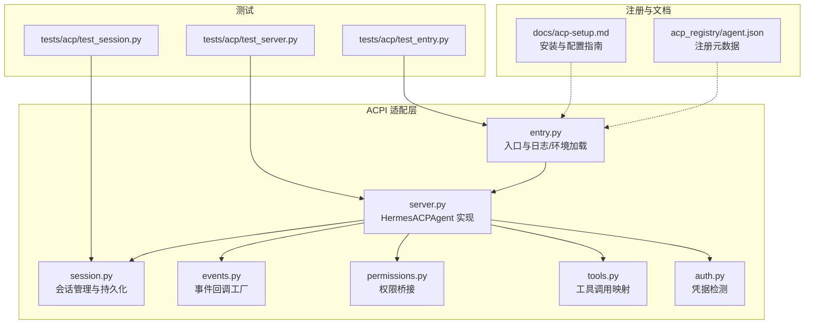
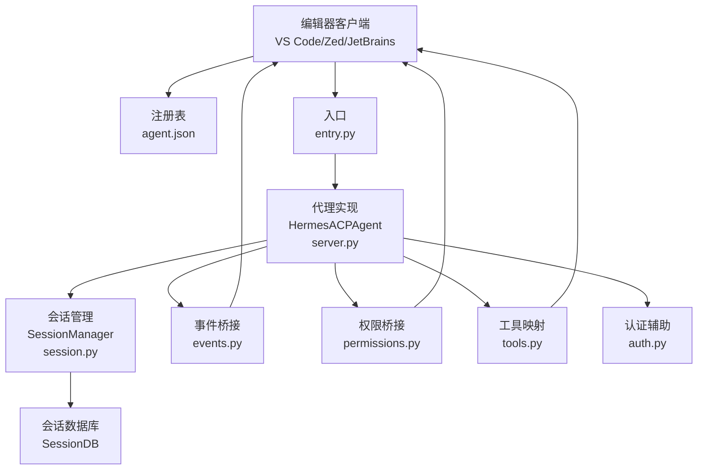
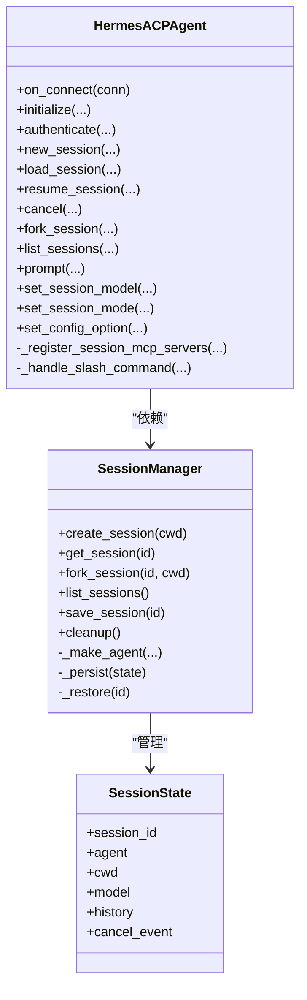
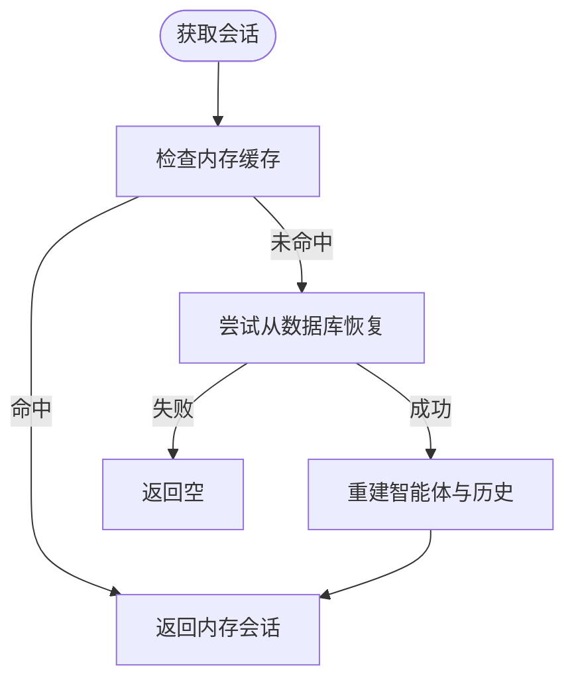
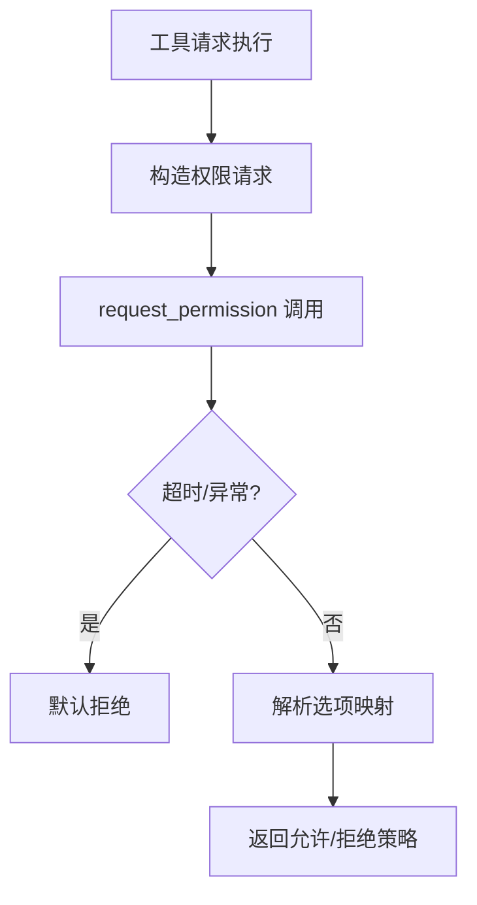
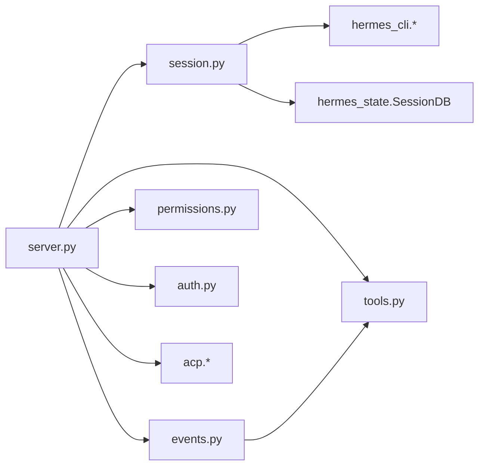

# 协议概述与架构

<cite>
**本文引用的文件**
- [acp_adapter/__init__.py](file://acp_adapter/__init__.py)
- [acp_adapter/entry.py](file://acp_adapter/entry.py)
- [acp_adapter/server.py](file://acp_adapter/server.py)
- [acp_adapter/session.py](file://acp_adapter/session.py)
- [acp_adapter/auth.py](file://acp_adapter/auth.py)
- [acp_adapter/events.py](file://acp_adapter/events.py)
- [acp_adapter/permissions.py](file://acp_adapter/permissions.py)
- [acp_adapter/tools.py](file://acp_adapter/tools.py)
- [acp_registry/agent.json](file://acp_registry/agent.json)
- [docs/acp-setup.md](file://docs/acp-setup.md)
- [tests/acp/test_entry.py](file://tests/acp/test_entry.py)
- [tests/acp/test_server.py](file://tests/acp/test_server.py)
- [tests/acp/test_session.py](file://tests/acp/test_session.py)
</cite>

## 目录
1. [简介](#简介)
2. [项目结构](#项目结构)
3. [核心组件](#核心组件)
4. [架构总览](#架构总览)
5. [详细组件分析](#详细组件分析)
6. [依赖分析](#依赖分析)
7. [性能考量](#性能考量)
8. [故障排查指南](#故障排查指南)
9. [结论](#结论)
10. [附录](#附录)

## 简介
本文件面向“ACPI（Agent Client Protocol）协议”在 Hermes Agent 中的整体设计与实现，系统阐述其核心理念、架构模式、系统边界与运行机制。重点覆盖以下方面：
- 协议版本管理：服务端对协议版本的协商与兼容策略
- 连接生命周期：初始化、认证、会话管理、取消与退出
- 消息传递机制：事件回调桥接、工具调用映射、权限审批流
- 高可用性与并发：线程池执行、异步事件循环、超时与容错
- 错误恢复：会话持久化、进程重启后的状态恢复
- 与系统其他组件的集成：会话管理、权限控制、工具集与 MCP 服务器注册
- 性能与扩展性：批处理与并发、可插拔工具集、跨平台客户端支持
- 安全边界：凭据检测、权限请求与拒绝策略

## 项目结构
ACPI 相关代码集中在 acp_adapter 子模块，并通过注册表与文档支撑编辑器客户端对接。



图表来源
- [acp_adapter/entry.py:58-86](file://acp_adapter/entry.py#L58-L86)
- [acp_adapter/server.py:92-727](file://acp_adapter/server.py#L92-L727)
- [acp_adapter/session.py:70-476](file://acp_adapter/session.py#L70-L476)
- [acp_adapter/events.py:1-176](file://acp_adapter/events.py#L1-L176)
- [acp_adapter/permissions.py:26-78](file://acp_adapter/permissions.py#L26-L78)
- [acp_adapter/tools.py:1-215](file://acp_adapter/tools.py#L1-L215)
- [acp_adapter/auth.py:8-25](file://acp_adapter/auth.py#L8-L25)
- [acp_registry/agent.json:1-13](file://acp_registry/agent.json#L1-L13)
- [docs/acp-setup.md:1-229](file://docs/acp-setup.md#L1-L229)
- [tests/acp/test_entry.py:1-20](file://tests/acp/test_entry.py#L1-L20)
- [tests/acp/test_server.py:1-200](file://tests/acp/test_server.py#L1-L200)
- [tests/acp/test_session.py:1-200](file://tests/acp/test_session.py#L1-L200)

章节来源
- [acp_adapter/entry.py:58-86](file://acp_adapter/entry.py#L58-L86)
- [acp_adapter/server.py:92-727](file://acp_adapter/server.py#L92-L727)
- [acp_adapter/session.py:70-476](file://acp_adapter/session.py#L70-L476)
- [acp_adapter/events.py:1-176](file://acp_adapter/events.py#L1-L176)
- [acp_adapter/permissions.py:26-78](file://acp_adapter/permissions.py#L26-L78)
- [acp_adapter/tools.py:1-215](file://acp_adapter/tools.py#L1-L215)
- [acp_adapter/auth.py:8-25](file://acp_adapter/auth.py#L8-L25)
- [acp_registry/agent.json:1-13](file://acp_registry/agent.json#L1-L13)
- [docs/acp-setup.md:1-229](file://docs/acp-setup.md#L1-L229)
- [tests/acp/test_entry.py:1-20](file://tests/acp/test_entry.py#L1-L20)
- [tests/acp/test_server.py:1-200](file://tests/acp/test_server.py#L1-L200)
- [tests/acp/test_session.py:1-200](file://tests/acp/test_session.py#L1-L200)

## 核心组件
- 入口与运行时
  - 启动入口负责日志输出到标准错误、从用户目录加载环境变量，并以不稳定协议模式启动 ACP 代理
  - 关键点：确保 stdout 专用于 ACP JSON-RPC 传输；启用不稳定协议以支持最新特性
- 代理实现（HermesACPAgent）
  - 实现 ACP 生命周期方法：initialize、authenticate、new_session、load_session、resume_session、cancel、fork_session、list_sessions、prompt、set_session_model、set_session_mode、set_config_option
  - 内置斜杠命令（/help、/model、/tools、/context、/reset、/compact、/version）用于编辑器无头交互
- 会话管理（SessionManager）
  - 维护内存中会话与持久化（SessionDB），支持创建、克隆、列表、清理与按需恢复
  - 将工作目录与工具环境绑定，确保工具调用上下文一致
- 事件桥接（events）
  - 将 AIAgent 的思考、步骤、消息与工具进度事件转换为 ACP 会话更新，并通过线程安全方式推送
- 权限桥接（permissions）
  - 将 ACP 客户端的权限请求映射为 Hermes 的审批回调，支持一次性/总是允许与拒绝，并带超时保护
- 工具映射（tools）
  - 将 Hermes 工具名映射为 ACP ToolKind，构建工具调用标题与内容块，支持位置信息提取
- 认证辅助（auth）
  - 基于当前运行时提供者检测是否具备有效凭据，用于 initialize 返回的 auth_methods

章节来源
- [acp_adapter/entry.py:58-86](file://acp_adapter/entry.py#L58-L86)
- [acp_adapter/server.py:92-727](file://acp_adapter/server.py#L92-L727)
- [acp_adapter/session.py:70-476](file://acp_adapter/session.py#L70-L476)
- [acp_adapter/events.py:1-176](file://acp_adapter/events.py#L1-L176)
- [acp_adapter/permissions.py:26-78](file://acp_adapter/permissions.py#L26-L78)
- [acp_adapter/tools.py:1-215](file://acp_adapter/tools.py#L1-L215)
- [acp_adapter/auth.py:8-25](file://acp_adapter/auth.py#L8-L25)

## 架构总览
下图展示 ACPI 在 Hermes 中的系统边界与交互路径：编辑器客户端通过 ACP 与 Hermes Agent 通信，后者通过会话管理与事件桥接驱动底层智能体执行，并通过权限与工具映射保障操作安全与可视化反馈。



图表来源
- [acp_registry/agent.json:1-13](file://acp_registry/agent.json#L1-L13)
- [acp_adapter/entry.py:58-86](file://acp_adapter/entry.py#L58-L86)
- [acp_adapter/server.py:92-727](file://acp_adapter/server.py#L92-L727)
- [acp_adapter/session.py:70-476](file://acp_adapter/session.py#L70-L476)
- [acp_adapter/events.py:1-176](file://acp_adapter/events.py#L1-L176)
- [acp_adapter/permissions.py:26-78](file://acp_adapter/permissions.py#L26-L78)
- [acp_adapter/tools.py:1-215](file://acp_adapter/tools.py#L1-L215)
- [acp_adapter/auth.py:8-25](file://acp_adapter/auth.py#L8-L25)

## 详细组件分析

### 组件一：代理实现（HermesACPAgent）
- 设计要点
  - 以 acp.Agent 为基础，实现协议所需方法，统一处理协议版本协商、能力声明与会话生命周期
  - 通过 SessionManager 管理会话状态与历史，结合线程池执行同步智能体逻辑，避免阻塞事件循环
  - 内建斜杠命令，无需调用大模型即可在编辑器内完成查询、切换模型、列出工具等操作
- 关键流程
  - 初始化：返回协议版本、代理信息与会话能力；根据运行时提供者返回可用认证方法
  - 会话管理：创建、加载、恢复、取消、克隆与枚举；每次变更均触发可用命令更新通知
  - 提示处理：解析文本内容块，拦截斜杠命令；将智能体回调注入为事件更新；支持使用量统计
  - 模型与模式：支持动态切换会话模型与模式，持久化至会话元数据
- 并发与线程安全
  - 使用线程池执行同步智能体逻辑，事件通过 run_coroutine_threadsafe 推送，避免阻塞主循环
  - 会话状态保存在内存字典中并加锁，同时持久化到 SessionDB



图表来源
- [acp_adapter/server.py:92-727](file://acp_adapter/server.py#L92-L727)
- [acp_adapter/session.py:70-476](file://acp_adapter/session.py#L70-L476)

章节来源
- [acp_adapter/server.py:92-727](file://acp_adapter/server.py#L92-L727)
- [acp_adapter/session.py:70-476](file://acp_adapter/session.py#L70-L476)

### 组件二：会话管理（SessionManager）
- 设计要点
  - 会话持久化：基于 SessionDB 将会话元数据与消息写入本地数据库，支持进程重启后恢复
  - 工作目录绑定：通过工具环境覆盖确保每个任务的 cwd 一致，提升工具调用准确性
  - 线程安全：使用锁保护内存会话表，避免并发冲突
- 关键流程
  - 创建：生成唯一 session_id，创建智能体实例，注册 cwd，持久化
  - 获取：优先内存命中，否则尝试从数据库恢复
  - 克隆：深拷贝历史，保持新会话独立
  - 列表：合并内存与数据库中的会话信息
  - 清理：移除内存与数据库中的所有会话并清理环境覆盖



图表来源
- [acp_adapter/session.py:114-126](file://acp_adapter/session.py#L114-L126)
- [acp_adapter/session.py:333-405](file://acp_adapter/session.py#L333-L405)

章节来源
- [acp_adapter/session.py:70-476](file://acp_adapter/session.py#L70-L476)

### 组件三：事件桥接（events）
- 设计要点
  - 将智能体的思考、步骤、消息与工具进度事件转换为 ACP 会话更新
  - 使用 run_coroutine_threadsafe 在工作线程中向事件循环提交更新，保证线程安全
  - 工具事件采用 FIFO 队列跟踪同名工具的多次调用，确保完成事件与起始 ID 匹配
- 关键流程
  - 工具进度：仅在 tool.started 时发出 ToolCallStart，并分配唯一工具调用 ID
  - 步骤完成：根据前一步工具结果，弹出对应队列中的 ID 并发送 ToolCallProgress.completed
  - 消息流式：将智能体输出文本片段作为 AgentMessageText 更新推送

```mermaid
sequenceDiagram
participant Agent as "智能体"
participant Factory as "事件工厂"
participant Conn as "ACP 客户端"
participant Loop as "事件循环"
Agent->>Factory : 触发工具进度/思考/步骤/消息
Factory->>Loop : run_coroutine_threadsafe(session_update(...))
Loop-->>Conn : 发送会话更新
Conn-->>Agent : 可选：权限请求/命令响应
```

图表来源
- [acp_adapter/events.py:27-41](file://acp_adapter/events.py#L27-L41)
- [acp_adapter/events.py:47-91](file://acp_adapter/events.py#L47-L91)
- [acp_adapter/events.py:117-156](file://acp_adapter/events.py#L117-L156)
- [acp_adapter/events.py:162-176](file://acp_adapter/events.py#L162-L176)

章节来源
- [acp_adapter/events.py:1-176](file://acp_adapter/events.py#L1-L176)

### 组件四：权限桥接（permissions）
- 设计要点
  - 将 ACP 的 request_permission 调用映射为 Hermes 的审批回调，支持一次性/总是允许与拒绝
  - 默认超时 60 秒，超时或异常自动拒绝，避免阻塞
  - 将 ACP 的 PermissionOptionKind 映射为 Hermes 的审批结果字符串
- 关键流程
  - 触发：当工具需要执行潜在危险操作时，发起权限请求
  - 等待：在事件循环中等待客户端响应
  - 结果：根据选项映射返回允许/拒绝策略



图表来源
- [acp_adapter/permissions.py:26-78](file://acp_adapter/permissions.py#L26-L78)

章节来源
- [acp_adapter/permissions.py:26-78](file://acp_adapter/permissions.py#L26-L78)

### 组件五：工具映射（tools）
- 设计要点
  - 将 Hermes 工具名映射为 ACP ToolKind（如 read/edit/execute/fetch 等）
  - 构建工具调用标题与内容块，支持位置信息提取，便于编辑器高亮与导航
  - 对大结果进行截断，避免 UI 卡顿
- 关键流程
  - 工具开始：生成唯一工具调用 ID，构建标题与内容，发送 ToolCallStart
  - 工具完成：截断结果，发送 ToolCallProgress.completed

章节来源
- [acp_adapter/tools.py:1-215](file://acp_adapter/tools.py#L1-L215)

### 组件六：认证辅助（auth）
- 设计要点
  - 通过运行时提供者解析 API Key 与 Provider，判断是否具备认证条件
  - initialize 返回的 auth_methods 由 detect_provider 动态决定

章节来源
- [acp_adapter/auth.py:8-25](file://acp_adapter/auth.py#L8-L25)
- [acp_adapter/server.py:226-236](file://acp_adapter/server.py#L226-L236)

## 依赖分析
- 外部依赖
  - acp：协议实现与运行时（run_agent、PROTOCOL_VERSION、schema 类型）
  - hermes_cli：运行时提供者解析、配置加载、版本号
  - hermes_state：会话数据库（SessionDB）
  - tools：终端工具等外部工具集
- 内部耦合
  - server 依赖 session、events、permissions、tools、auth
  - session 依赖 hermes_state、hermes_cli（运行时提供者）
  - events 依赖 tools
  - permissions 依赖 acp.schema



图表来源
- [acp_adapter/server.py:11-61](file://acp_adapter/server.py#L11-L61)
- [acp_adapter/session.py:11-18](file://acp_adapter/session.py#L11-L18)
- [acp_adapter/events.py:16-22](file://acp_adapter/events.py#L16-L22)
- [acp_adapter/permissions.py:10-13](file://acp_adapter/permissions.py#L10-L13)

章节来源
- [acp_adapter/server.py:11-61](file://acp_adapter/server.py#L11-L61)
- [acp_adapter/session.py:11-18](file://acp_adapter/session.py#L11-L18)
- [acp_adapter/events.py:16-22](file://acp_adapter/events.py#L16-L22)
- [acp_adapter/permissions.py:10-13](file://acp_adapter/permissions.py#L10-L13)

## 性能考量
- 并发与吞吐
  - 使用线程池执行同步智能体逻辑，避免阻塞事件循环，提高并发处理能力
  - 事件推送采用 run_coroutine_threadsafe，降低线程间切换开销
- 流式输出
  - 消息与工具进度事件分片推送，提升交互响应速度
- 资源占用
  - 会话历史与元数据持久化，减少重复计算；工具结果截断避免 UI 卡顿
- 扩展性
  - 支持 MCP 服务器动态注册，按会话维度刷新工具表面
  - 斜杠命令与配置项扩展点，便于编辑器侧功能增强

## 故障排查指南
- 启动与运行
  - 日志输出到 stderr，stdout 保留 ACP 传输；可通过环境变量调整日志级别
  - 不稳定协议模式已启用，确保编辑器客户端支持最新特性
- 会话恢复
  - 若编辑器重连，load/resume 会自动从 SessionDB 恢复历史；确认数据库可用
- 权限问题
  - 若权限请求超时或失败，默认拒绝；检查编辑器客户端设置与网络
- 工具执行
  - 大结果被截断；若需要完整输出，请在编辑器侧查看完整内容
- 常见问题
  - 缺少 ACP 额外依赖：安装 acp extras
  - 注册表路径不正确：核对 agent.json 与编辑器设置

章节来源
- [acp_adapter/entry.py:23-56](file://acp_adapter/entry.py#L23-L56)
- [acp_adapter/server.py:307-332](file://acp_adapter/server.py#L307-L332)
- [acp_adapter/permissions.py:62-64](file://acp_adapter/permissions.py#L62-L64)
- [acp_adapter/tools.py:186-189](file://acp_adapter/tools.py#L186-L189)
- [docs/acp-setup.md:174-229](file://docs/acp-setup.md#L174-L229)

## 结论
ACPI 在 Hermes Agent 中以清晰的职责分离实现了协议适配：入口负责运行时准备，代理实现承载协议语义，会话管理保障状态一致性，事件与权限桥接提供安全可控的交互体验。该架构在保证高可用与并发处理的同时，兼顾了扩展性与安全性，能够稳定支撑多编辑器客户端的多样化需求。

## 附录
- 安装与配置参考：编辑器侧安装 ACP 客户端扩展，配置注册表路径与命令参数
- 版本与协议：initialize 返回的协议版本与 acp.PROTOCOL_VERSION 对齐
- 测试验证：入口、服务器与会话相关测试覆盖关键行为与边界条件

章节来源
- [docs/acp-setup.md:1-229](file://docs/acp-setup.md#L1-L229)
- [tests/acp/test_entry.py:1-20](file://tests/acp/test_entry.py#L1-L20)
- [tests/acp/test_server.py:1-200](file://tests/acp/test_server.py#L1-L200)
- [tests/acp/test_session.py:1-200](file://tests/acp/test_session.py#L1-L200)