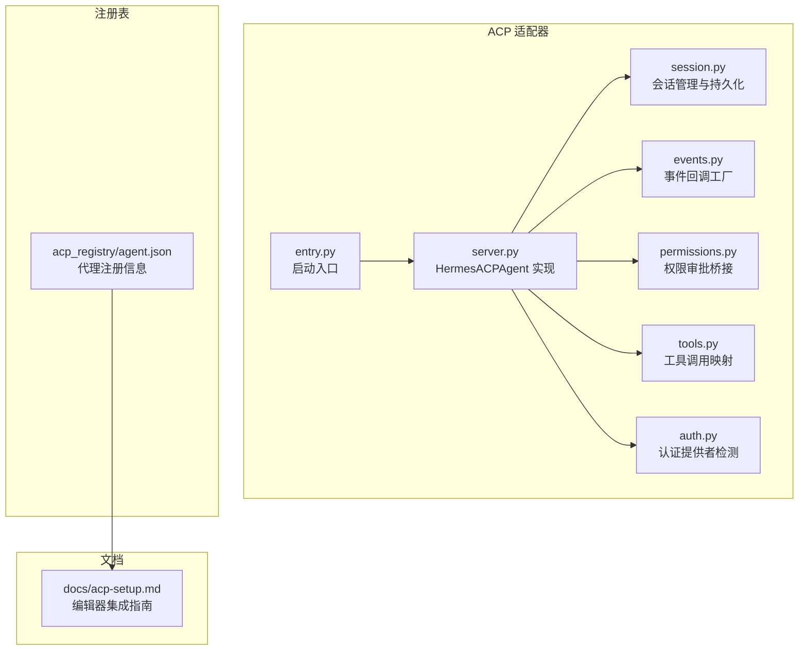
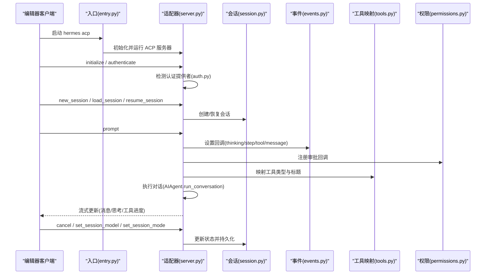
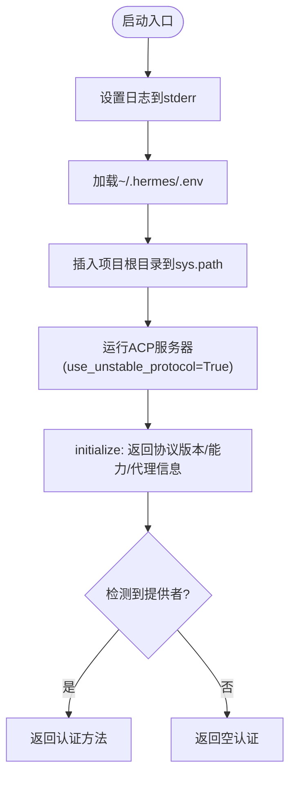
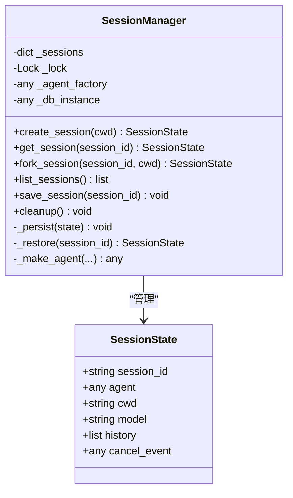
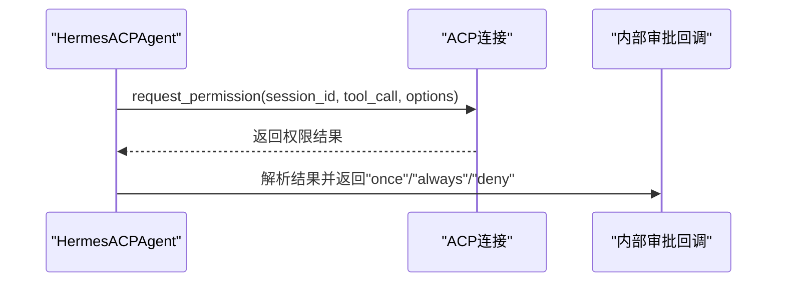
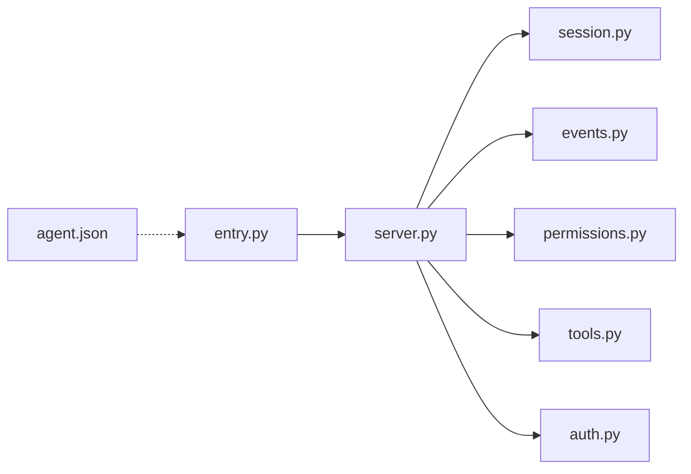
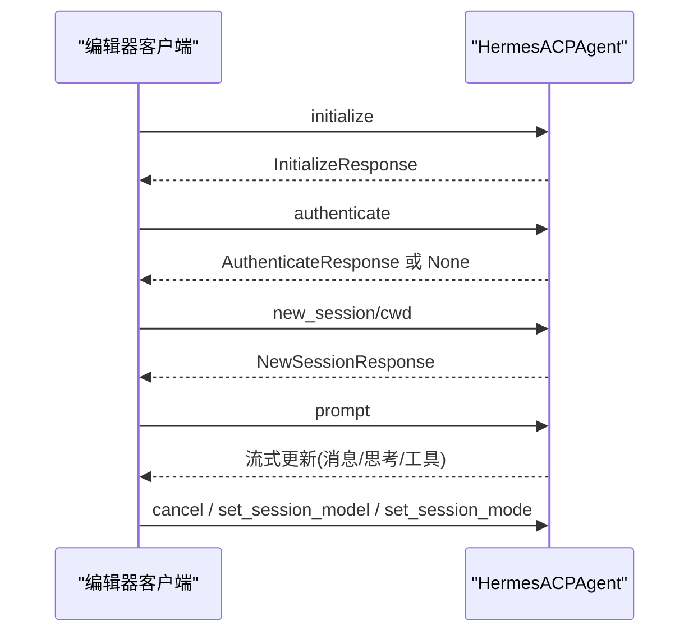

# 客户端集成指南

<cite>
**本文档引用的文件**
- [acp_adapter/__init__.py](file://acp_adapter/__init__.py)
- [acp_adapter/entry.py](file://acp_adapter/entry.py)
- [acp_adapter/server.py](file://acp_adapter/server.py)
- [acp_adapter/session.py](file://acp_adapter/session.py)
- [acp_adapter/events.py](file://acp_adapter/events.py)
- [acp_adapter/auth.py](file://acp_adapter/auth.py)
- [acp_adapter/permissions.py](file://acp_adapter/permissions.py)
- [acp_adapter/tools.py](file://acp_adapter/tools.py)
- [acp_registry/agent.json](file://acp_registry/agent.json)
- [docs/acp-setup.md](file://docs/acp-setup.md)
- [tests/acp/test_server.py](file://tests/acp/test_server.py)
- [tests/acp/test_session.py](file://tests/acp/test_session.py)
- [hermes_cli/main.py](file://hermes_cli/main.py)
</cite>

## 目录
1. [简介](#简介)
2. [项目结构](#项目结构)
3. [核心组件](#核心组件)
4. [架构总览](#架构总览)
5. [详细组件分析](#详细组件分析)
6. [依赖关系分析](#依赖关系分析)
7. [性能考虑](#性能考虑)
8. [故障排除指南](#故障排除指南)
9. [结论](#结论)
10. [附录](#附录)

## 简介
本指南面向需要在编辑器中集成 ACPI（Agent Client Protocol）协议的客户端开发者，提供从安装、配置到运行时行为的完整落地说明。文档基于仓库中的 ACP 适配器实现与配套文档，覆盖以下主题：
- 客户端实现步骤与配置要求
- 不同编辑器（VS Code、Zed、JetBrains）的集成步骤
- 初始化流程、会话管理、事件回调与权限审批桥接
- 心跳与断线重连策略建议
- 调试工具、日志分析与性能优化
- 常见问题与最佳实践
- 部署与注册表配置

## 项目结构
ACPI 客户端集成的核心位于 acp_adapter 子模块，配合注册表文件与用户文档，形成“服务端适配器 + 编辑器客户端”的协作体系。



**图表来源**
- [acp_adapter/entry.py:1-86](file://acp_adapter/entry.py#L1-L86)
- [acp_adapter/server.py:1-727](file://acp_adapter/server.py#L1-L727)
- [acp_adapter/session.py:1-476](file://acp_adapter/session.py#L1-L476)
- [acp_adapter/events.py:1-176](file://acp_adapter/events.py#L1-L176)
- [acp_adapter/permissions.py:1-78](file://acp_adapter/permissions.py#L1-L78)
- [acp_adapter/tools.py:1-215](file://acp_adapter/tools.py#L1-L215)
- [acp_adapter/auth.py:1-25](file://acp_adapter/auth.py#L1-L25)
- [acp_registry/agent.json:1-13](file://acp_registry/agent.json#L1-L13)
- [docs/acp-setup.md:1-229](file://docs/acp-setup.md#L1-L229)

**章节来源**
- [acp_adapter/entry.py:1-86](file://acp_adapter/entry.py#L1-L86)
- [acp_adapter/server.py:1-727](file://acp_adapter/server.py#L1-L727)
- [acp_adapter/session.py:1-476](file://acp_adapter/session.py#L1-L476)
- [acp_adapter/events.py:1-176](file://acp_adapter/events.py#L1-L176)
- [acp_adapter/permissions.py:1-78](file://acp_adapter/permissions.py#L1-L78)
- [acp_adapter/tools.py:1-215](file://acp_adapter/tools.py#L1-L215)
- [acp_adapter/auth.py:1-25](file://acp_adapter/auth.py#L1-L25)
- [acp_registry/agent.json:1-13](file://acp_registry/agent.json#L1-L13)
- [docs/acp-setup.md:1-229](file://docs/acp-setup.md#L1-L229)

## 核心组件
- 启动入口：负责加载环境变量、设置日志输出到 stderr、启动 ACP 服务器。
- 适配器实现：HermesACPAgent 将编辑器请求映射为内部对话执行，并通过回调推送事件更新。
- 会话管理：SessionManager 维护会话生命周期、工作目录、历史消息与持久化。
- 事件桥接：将内部思考、步骤、工具进度与消息流转换为 ACP 更新。
- 权限审批：将 ACP 的权限请求桥接到内部审批回调。
- 工具映射：将 Hermes 工具名称映射为 ACP 工具类型并生成可读标题与内容。
- 认证检测：根据当前运行时提供者决定是否支持认证方法。

**章节来源**
- [acp_adapter/entry.py:58-86](file://acp_adapter/entry.py#L58-L86)
- [acp_adapter/server.py:92-727](file://acp_adapter/server.py#L92-L727)
- [acp_adapter/session.py:70-476](file://acp_adapter/session.py#L70-L476)
- [acp_adapter/events.py:27-176](file://acp_adapter/events.py#L27-L176)
- [acp_adapter/permissions.py:26-78](file://acp_adapter/permissions.py#L26-L78)
- [acp_adapter/tools.py:20-215](file://acp_adapter/tools.py#L20-L215)
- [acp_adapter/auth.py:8-25](file://acp_adapter/auth.py#L8-L25)

## 架构总览
下图展示编辑器客户端与 ACP 适配器之间的交互路径，以及适配器内部如何组织会话、事件与工具调用。



**图表来源**
- [acp_adapter/entry.py:58-86](file://acp_adapter/entry.py#L58-L86)
- [acp_adapter/server.py:216-727](file://acp_adapter/server.py#L216-L727)
- [acp_adapter/session.py:94-476](file://acp_adapter/session.py#L94-L476)
- [acp_adapter/events.py:47-176](file://acp_adapter/events.py#L47-L176)
- [acp_adapter/permissions.py:26-78](file://acp_adapter/permissions.py#L26-L78)
- [acp_adapter/tools.py:53-215](file://acp_adapter/tools.py#L53-L215)
- [acp_adapter/auth.py:8-25](file://acp_adapter/auth.py#L8-L25)

## 详细组件分析

### 启动与初始化流程
- 入口负责：
  - 将日志输出重定向至 stderr，确保 stdout 专用于 ACP JSON-RPC。
  - 从用户主目录加载 .env 环境变量。
  - 插入项目根目录到 sys.path，以便导入 run_agent。
  - 启动 ACP 服务器并启用不稳定协议标志。
- 初始化阶段：
  - 返回协议版本、代理信息与能力声明。
  - 若检测到可用提供者，则暴露认证方法供客户端选择。



**图表来源**
- [acp_adapter/entry.py:23-86](file://acp_adapter/entry.py#L23-L86)
- [acp_adapter/server.py:216-254](file://acp_adapter/server.py#L216-L254)
- [acp_adapter/auth.py:8-25](file://acp_adapter/auth.py#L8-L25)

**章节来源**
- [acp_adapter/entry.py:23-86](file://acp_adapter/entry.py#L23-L86)
- [acp_adapter/server.py:216-254](file://acp_adapter/server.py#L216-L254)
- [acp_adapter/auth.py:8-25](file://acp_adapter/auth.py#L8-L25)

### 会话管理与持久化
- SessionManager 提供：
  - 创建新会话、派生会话（fork）、列出会话、清理会话。
  - 将会话元数据与消息持久化到共享数据库，支持进程重启后恢复。
  - 绑定任务工作目录到工具环境覆盖，确保命令在正确路径执行。
- 关键点：
  - 会话 ID 唯一生成；历史深拷贝避免并发污染。
  - 数据库存储模型配置（含 cwd），并在恢复时重建 AIAgent。



**图表来源**
- [acp_adapter/session.py:58-476](file://acp_adapter/session.py#L58-L476)

**章节来源**
- [acp_adapter/session.py:70-476](file://acp_adapter/session.py#L70-L476)

### 事件回调与工具调用映射
- 事件桥接：
  - 思考回调：推送“思考中”文本。
  - 步骤回调：将已完成工具映射为 ACP 工具完成事件。
  - 工具进度回调：为每个工具调用生成唯一 ID 并发送开始事件。
  - 消息回调：流式推送最终响应文本。
- 工具映射：
  - 将 Hermes 工具名映射为 ACP 工具类型（read/edit/search/execute/fetch/think 等）。
  - 生成人类可读标题与内容块，必要时截断过长结果。

```mermaid
flowchart TD
A["AIAgent事件"] --> B{"事件类型"}
B --> |thinking| C["发送思考文本"]
B --> |step| D["完成工具调用映射"]
B --> |tool_progress(start)| E["生成工具调用ID并发送开始"]
B --> |message| F["发送消息文本"]
D --> G["构建工具完成事件"]
E --> H["构建工具开始事件"]
F --> I["流式更新"]
```

**图表来源**
- [acp_adapter/events.py:47-176](file://acp_adapter/events.py#L47-L176)
- [acp_adapter/tools.py:53-215](file://acp_adapter/tools.py#L53-L215)

**章节来源**
- [acp_adapter/events.py:27-176](file://acp_adapter/events.py#L27-L176)
- [acp_adapter/tools.py:1-215](file://acp_adapter/tools.py#L1-L215)

### 权限审批桥接
- 将 ACP 的 request_permission 请求桥接为内部审批回调，支持“允许一次/总是”、“拒绝一次/总是”等选项。
- 默认超时时间内未响应则自动拒绝，保障安全性。



**图表来源**
- [acp_adapter/permissions.py:26-78](file://acp_adapter/permissions.py#L26-L78)

**章节来源**
- [acp_adapter/permissions.py:1-78](file://acp_adapter/permissions.py#L1-L78)

### 认证与提供者检测
- 根据当前运行时提供者（如 OpenRouter）决定是否暴露认证方法。
- 仅当提供者与密钥均有效时才启用认证。

**章节来源**
- [acp_adapter/auth.py:8-25](file://acp_adapter/auth.py#L8-L25)
- [acp_adapter/server.py:256-259](file://acp_adapter/server.py#L256-L259)

## 依赖关系分析
- 入口依赖 ACP 运行时与项目根路径注入。
- 适配器依赖会话管理、事件桥接、权限与工具映射模块。
- 会话管理依赖共享数据库以实现跨进程恢复。
- 注册表文件定义代理名称、显示名、图标与启动方式，供编辑器发现。



**图表来源**
- [acp_adapter/entry.py:71-72](file://acp_adapter/entry.py#L71-L72)
- [acp_adapter/server.py:51-59](file://acp_adapter/server.py#L51-L59)
- [acp_adapter/session.py:1-22](file://acp_adapter/session.py#L1-L22)
- [acp_adapter/events.py:1-24](file://acp_adapter/events.py#L1-L24)
- [acp_adapter/permissions.py:1-15](file://acp_adapter/permissions.py#L1-L15)
- [acp_adapter/tools.py:1-14](file://acp_adapter/tools.py#L1-L14)
- [acp_adapter/auth.py:1-18](file://acp_adapter/auth.py#L1-L18)
- [acp_registry/agent.json:1-13](file://acp_registry/agent.json#L1-L13)

**章节来源**
- [acp_adapter/entry.py:71-72](file://acp_adapter/entry.py#L71-L72)
- [acp_adapter/server.py:51-59](file://acp_adapter/server.py#L51-L59)
- [acp_adapter/session.py:1-22](file://acp_adapter/session.py#L1-L22)
- [acp_adapter/events.py:1-24](file://acp_adapter/events.py#L1-L24)
- [acp_adapter/permissions.py:1-15](file://acp_adapter/permissions.py#L1-L15)
- [acp_adapter/tools.py:1-14](file://acp_adapter/tools.py#L1-L14)
- [acp_adapter/auth.py:1-18](file://acp_adapter/auth.py#L1-L18)
- [acp_registry/agent.json:1-13](file://acp_registry/agent.json#L1-L13)

## 性能考虑
- 事件流式推送：通过回调将思考、步骤与消息增量推送到编辑器，减少等待时间。
- 工具结果截断：对过长输出进行截断，避免 UI 卡顿与传输负担。
- 线程池执行：将同步的 AIAgent 执行放入线程池，避免阻塞事件循环。
- 会话持久化：将历史与元数据写入数据库，减少重复计算与上下文重建成本。
- 日志级别控制：默认降低第三方库噪声，便于定位问题。

**章节来源**
- [acp_adapter/events.py:186-197](file://acp_adapter/events.py#L186-L197)
- [acp_adapter/server.py:68-69](file://acp_adapter/server.py#L68-L69)
- [acp_adapter/session.py:273-331](file://acp_adapter/session.py#L273-L331)
- [acp_adapter/entry.py:23-41](file://acp_adapter/entry.py#L23-L41)

## 故障排除指南
- 代理未出现在编辑器中
  - 检查注册表路径是否正确且包含 agent.json。
  - 确认 hermes 命令在 PATH 中。
  - 更改设置后重启编辑器。
- 启动后立即报错
  - 使用诊断命令检查配置与依赖。
  - 确认 API 密钥有效。
  - 直接在终端运行 hermes acp 查看错误输出。
- “模块未找到”
  - 安装 ACP 可选依赖：pip install -e ".[acp]"
- 响应缓慢
  - 检查网络与提供商状态。
  - 某些提供商有速率限制，尝试切换模型或提供商。
- 终端命令被拒绝
  - 在编辑器扩展设置中调整自动批准或手动批准偏好。
- 日志查看
  - ACP 模式下日志写入 stderr，可在编辑器输出面板或事件日志中查看。
  - 可通过环境变量提高日志级别以获得更详细信息。

**章节来源**
- [docs/acp-setup.md:174-229](file://docs/acp-setup.md#L174-L229)

## 结论
通过本指南，您可以在主流编辑器中无缝集成 Hermes Agent 的 ACPI 客户端，享受原生的聊天界面、文件差异与终端命令执行体验。适配器提供了完善的会话管理、事件桥接与权限审批机制，结合注册表与用户文档，能够快速完成部署与调试。

## 附录

### 编辑器集成步骤（VS Code）
- 安装 ACP Client 扩展。
- 在 settings.json 中配置 agents 数组，指向 acp_registry 目录。
- 重启 VS Code，代理应出现在聊天/代理面板中。

**章节来源**
- [docs/acp-setup.md:24-64](file://docs/acp-setup.md#L24-L64)

### 编辑器集成步骤（Zed）
- 在 settings.json 中添加 agent_servers 配置，指定 hermes 命令与参数。
- 重启 Zed，代理将出现在代理面板。

**章节来源**
- [docs/acp-setup.md:68-91](file://docs/acp-setup.md#L68-L91)

### 编辑器集成步骤（JetBrains）
- 安装 ACP 插件。
- 在 ACP Agents 设置中添加新代理，设置注册表目录为 acp_registry。
- 在右侧工具栏打开 ACP 面板并选择 Hermes Agent。

**章节来源**
- [docs/acp-setup.md:95-114](file://docs/acp-setup.md#L95-L114)

### 配置文件格式与位置
- 注册表文件：acp_registry/agent.json，定义代理名称、显示名、图标与启动命令。
- 用户环境：~/.hermes/.env，存放 API 密钥与运行时配置。
- 代理配置：~/.hermes/config.yaml，包含模型与工具集等。
- 技能与会话：~/.hermes/skills/ 与 ~/.hermes/state.db。

**章节来源**
- [acp_registry/agent.json:1-13](file://acp_registry/agent.json#L1-L13)
- [docs/acp-setup.md:146-171](file://docs/acp-setup.md#L146-L171)

### 部署指南
- 安装 ACP 可选依赖：pip install -e ".[acp]"
- 完成 hermes setup 或手动配置 ~/.hermes/.env。
- 在编辑器中按上述步骤完成代理注册与启动。

**章节来源**
- [docs/acp-setup.md:16-21](file://docs/acp-setup.md#L16-L21)
- [docs/acp-setup.md:146-156](file://docs/acp-setup.md#L146-L156)

### API 封装与客户端模板（概念性）
- 初始化与认证：initialize / authenticate，返回协议版本与能力声明。
- 会话管理：new_session / load_session / resume_session / list_sessions / cancel / fork_session。
- 对话处理：prompt，返回流式更新与用量统计。
- 模型与模式：set_session_model / set_session_mode。
- 配置项：set_config_option。



**图表来源**
- [acp_adapter/server.py:216-727](file://acp_adapter/server.py#L216-L727)