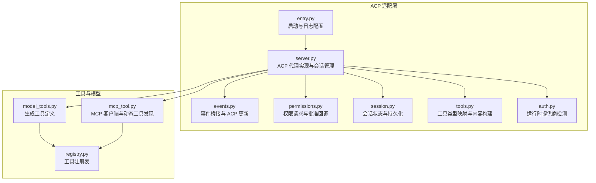
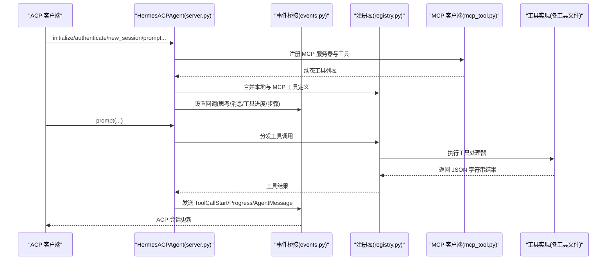
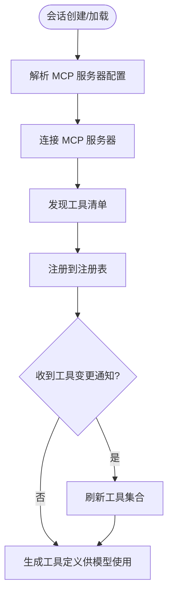
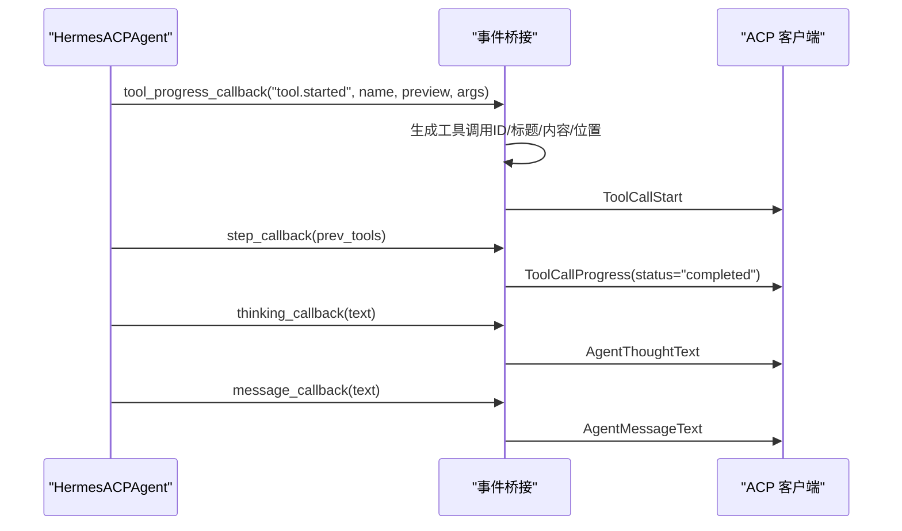
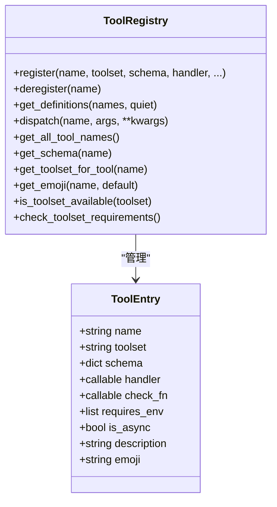
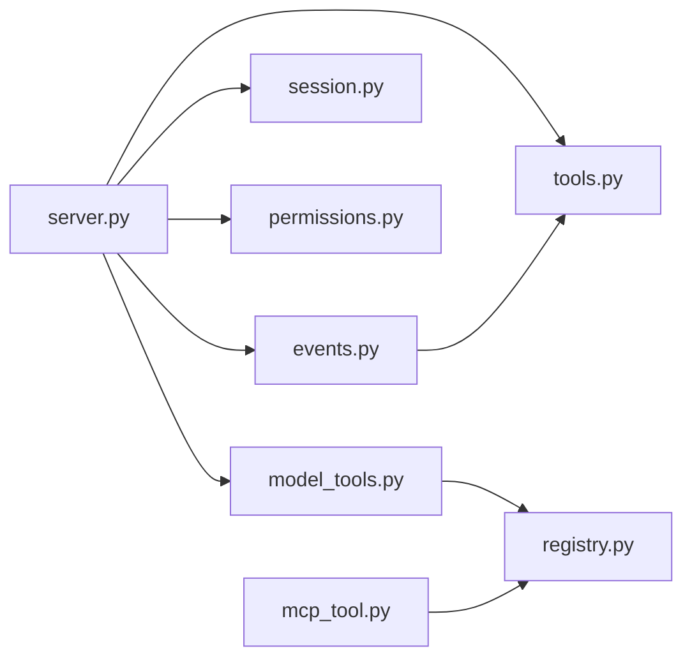

# 工具集成

<cite>
**本文引用的文件**
- [acp_adapter/tools.py](file://acp_adapter/tools.py)
- [acp_adapter/events.py](file://acp_adapter/events.py)
- [acp_adapter/server.py](file://acp_adapter/server.py)
- [acp_adapter/permissions.py](file://acp_adapter/permissions.py)
- [acp_adapter/session.py](file://acp_adapter/session.py)
- [acp_adapter/auth.py](file://acp_adapter/auth.py)
- [acp_adapter/entry.py](file://acp_adapter/entry.py)
- [tools/mcp_tool.py](file://tools/mcp_tool.py)
- [tools/registry.py](file://tools/registry.py)
- [model_tools.py](file://model_tools.py)
</cite>

## 目录
1. [简介](#简介)
2. [项目结构](#项目结构)
3. [核心组件](#核心组件)
4. [架构总览](#架构总览)
5. [详细组件分析](#详细组件分析)
6. [依赖分析](#依赖分析)
7. [性能考虑](#性能考虑)
8. [故障排查指南](#故障排查指南)
9. [结论](#结论)
10. [附录](#附录)

## 简介
本文件面向“ACPI 协议的工具集成功能”，系统化阐述以下主题：
- 工具发现机制：如何从本地工具与 MCP 服务器动态发现工具，并统一纳入 Hermes 的工具表面。
- 工具注册流程：工具定义格式、注册入口、可用性检查与动态刷新。
- 工具调用协议：从 ACP 会话到工具执行，再到事件回传的完整链路。
- 工具定义格式、参数传递与结果返回标准：OpenAI 风格工具定义、参数校验与结果序列化。
- 权限管理、资源限制与执行上下文：请求批准、超时、环境隔离与工作目录绑定。
- 工具扩展机制、自定义工具开发与第三方工具集成指南：基于注册表与 MCP 的扩展路径。
- 调试方法、性能监控与错误处理策略：日志、错误标准化与采样回调。
- 版本管理、兼容性检查与升级策略：工具集版本、向后兼容与平滑迁移。

## 项目结构
围绕 ACPI 工具集成的关键模块如下：
- ACP 适配层：负责与 ACP 客户端交互、会话管理、事件桥接、权限请求与工具表面刷新。
- 工具注册与分发：集中注册表统一管理工具定义、可用性检查与调度。
- MCP 客户端：连接外部 MCP 服务器，动态发现与注册工具，支持采样与通知。
- 模型工具接口：生成 OpenAI 风格工具定义，驱动模型选择工具。

**图表来源**
- [acp_adapter/entry.py:1-86](file://acp_adapter/entry.py#L1-L86)
- [acp_adapter/server.py:1-727](file://acp_adapter/server.py#L1-L727)
- [acp_adapter/events.py:1-176](file://acp_adapter/events.py#L1-L176)
- [acp_adapter/permissions.py:1-78](file://acp_adapter/permissions.py#L1-L78)
- [acp_adapter/session.py:1-476](file://acp_adapter/session.py#L1-L476)
- [acp_adapter/tools.py:1-215](file://acp_adapter/tools.py#L1-L215)
- [acp_adapter/auth.py:1-25](file://acp_adapter/auth.py#L1-L25)
- [tools/registry.py:1-321](file://tools/registry.py#L1-L321)
- [model_tools.py](file://model_tools.py)
- [tools/mcp_tool.py:1-800](file://tools/mcp_tool.py#L1-L800)

**章节来源**
- [acp_adapter/entry.py:1-86](file://acp_adapter/entry.py#L1-L86)
- [acp_adapter/server.py:1-727](file://acp_adapter/server.py#L1-L727)
- [tools/registry.py:1-321](file://tools/registry.py#L1-L321)
- [tools/mcp_tool.py:1-800](file://tools/mcp_tool.py#L1-L800)
- [model_tools.py](file://model_tools.py)

## 核心组件
- 工具类型映射与标题构建：将本地工具名映射到 ACP ToolKind，并生成人类可读标题与位置信息。
- 事件桥接：将工具开始、步骤完成、思考与消息流等事件转换为 ACP 会话更新。
- 会话管理：创建、加载、恢复、派生会话，持久化历史与元数据，绑定工作目录。
- 权限桥接：将 ACP 的权限请求映射为本地批准回调，支持超时与拒绝策略。
- MCP 客户端：连接外部 MCP 服务器，动态发现工具，注册到注册表，支持采样与通知。
- 注册表：集中注册工具定义、可用性检查、异步/同步调度与错误标准化。

**章节来源**
- [acp_adapter/tools.py:1-215](file://acp_adapter/tools.py#L1-L215)
- [acp_adapter/events.py:1-176](file://acp_adapter/events.py#L1-L176)
- [acp_adapter/session.py:1-476](file://acp_adapter/session.py#L1-L476)
- [acp_adapter/permissions.py:1-78](file://acp_adapter/permissions.py#L1-L78)
- [tools/mcp_tool.py:1-800](file://tools/mcp_tool.py#L1-L800)
- [tools/registry.py:1-321](file://tools/registry.py#L1-L321)

## 架构总览
ACP 适配器作为 Agent Client Protocol 的服务端，将 Hermes 的对话与工具执行能力暴露给 ACP 客户端。其关键流程包括：
- 初始化与认证：检测运行时提供商，声明能力与认证选项。
- 会话生命周期：创建/加载/恢复/派生会话，绑定工作目录，持久化历史。
- 工具表面刷新：在会话中注册 MCP 工具，合并本地工具，生成 OpenAI 风格工具定义。
- 事件桥接：将工具进度、思考与消息流转换为 ACP 更新。
- 权限请求：对潜在危险操作（如终端执行）发起批准请求。
- 工具调用：通过注册表分发工具，统一结果序列化与错误处理。

**图表来源**
- [acp_adapter/server.py:216-465](file://acp_adapter/server.py#L216-L465)
- [acp_adapter/events.py:47-175](file://acp_adapter/events.py#L47-L175)
- [tools/registry.py:144-162](file://tools/registry.py#L144-L162)
- [tools/mcp_tool.py:787-800](file://tools/mcp_tool.py#L787-L800)

## 详细组件分析

### 工具发现与注册机制
- 本地工具：通过各工具模块在导入时调用注册表进行登记，包含名称、工具集、模式(schema)、处理器、可用性检查、环境要求、是否异步、描述与表情符号等元数据。
- MCP 工具：在会话初始化/加载/恢复时，解析 ACP 提供的 MCP 服务器配置，建立连接，动态拉取工具清单，注册到注册表；当服务器发出工具变更通知时，触发刷新。
- 工具表面：由模型工具接口查询注册表，生成 OpenAI 风格工具定义数组，供模型选择工具。

**图表来源**
- [acp_adapter/server.py:149-213](file://acp_adapter/server.py#L149-L213)
- [tools/mcp_tool.py:787-800](file://tools/mcp_tool.py#L787-L800)
- [model_tools.py](file://model_tools.py)

**章节来源**
- [tools/registry.py:56-106](file://tools/registry.py#L56-L106)
- [acp_adapter/server.py:149-213](file://acp_adapter/server.py#L149-L213)
- [tools/mcp_tool.py:787-800](file://tools/mcp_tool.py#L787-L800)

### 工具调用协议与事件桥接
- 工具开始：根据工具名映射 ACP 工具类型，构建标题与内容块，提取位置信息，发送 ToolCallStart。
- 步骤完成：在工具步骤完成后，按队列匹配工具调用 ID，发送 ToolCallProgress 并标记 completed。
- 思考与消息：将模型的思考文本与回复文本分别转换为 ACP 更新。
- 权限请求：对需要批准的操作发起请求，等待 ACP 响应，映射为本地批准结果字符串。

**图表来源**
- [acp_adapter/events.py:47-175](file://acp_adapter/events.py#L47-L175)
- [acp_adapter/tools.py:104-197](file://acp_adapter/tools.py#L104-L197)

**章节来源**
- [acp_adapter/events.py:47-175](file://acp_adapter/events.py#L47-L175)
- [acp_adapter/tools.py:104-197](file://acp_adapter/tools.py#L104-L197)

### 工具定义格式、参数传递与结果返回
- 工具定义格式：OpenAI function 工具定义风格，包含函数名、描述与参数模式(schema)。
- 参数传递：工具处理器接收字典参数，注册表统一调度；异步处理器通过桥接执行。
- 结果返回：工具处理器必须返回 JSON 字符串；注册表提供工具错误与结果辅助函数，确保一致的错误格式。

**图表来源**
- [tools/registry.py:24-106](file://tools/registry.py#L24-L106)
- [tools/registry.py:144-162](file://tools/registry.py#L144-L162)

**章节来源**
- [tools/registry.py:111-138](file://tools/registry.py#L111-L138)
- [tools/registry.py:144-162](file://tools/registry.py#L144-L162)

### 权限管理、资源限制与执行上下文
- 权限管理：将 ACP 的权限选项映射为允许一次、总是允许、拒绝一次、拒绝；默认超时后自动拒绝。
- 资源限制：MCP 工具调用与连接支持超时配置；采样回调支持速率限制、最大令牌数、工具轮次上限与模型白名单。
- 执行上下文：会话绑定工作目录，终端工具使用任务级环境覆盖；日志输出重定向至 stderr，避免污染 ACP JSON-RPC 流。

**章节来源**
- [acp_adapter/permissions.py:26-77](file://acp_adapter/permissions.py#L26-L77)
- [tools/mcp_tool.py:162-166](file://tools/mcp_tool.py#L162-L166)
- [tools/mcp_tool.py:349-714](file://tools/mcp_tool.py#L349-L714)
- [acp_adapter/session.py:36-56](file://acp_adapter/session.py#L36-L56)

### 工具扩展机制、自定义工具开发与第三方工具集成
- 自定义工具开发：在工具模块中定义 schema 与处理器，导入时注册到注册表；通过可用性检查函数控制工具集启用。
- 第三方工具集成：通过 MCP 服务器配置接入外部工具；支持 stdio 与 HTTP/StreamableHTTP 传输，动态工具发现与采样回调。
- 工具集版本与兼容性：工具集检查函数用于判断环境满足度；动态刷新机制保证工具集随服务器变化而更新。

**章节来源**
- [tools/registry.py:56-106](file://tools/registry.py#L56-L106)
- [tools/mcp_tool.py:154-157](file://tools/mcp_tool.py#L154-L157)
- [acp_adapter/server.py:149-213](file://acp_adapter/server.py#L149-L213)

### 调试方法、性能监控与错误处理策略
- 调试方法：日志输出到 stderr，避免影响 ACP 协议帧；MCP 连接错误格式化为可读短消息；工具错误标准化返回 JSON。
- 性能监控：采样回调统计请求数、错误数、令牌用量与工具使用次数；速率限制与滑动窗口控制请求频率。
- 错误处理：工具执行异常捕获并返回统一错误格式；MCP 服务器错误文本进行凭据脱敏。

**章节来源**
- [acp_adapter/entry.py:23-41](file://acp_adapter/entry.py#L23-L41)
- [tools/mcp_tool.py:211-218](file://tools/mcp_tool.py#L211-L218)
- [tools/mcp_tool.py:588-714](file://tools/mcp_tool.py#L588-L714)
- [tools/registry.py:294-321](file://tools/registry.py#L294-L321)

### 版本管理、兼容性检查与升级策略
- 版本管理：ACP 协议版本协商；Hermes 版本随包发布；MCP SDK 版本差异通过特性检测兼容旧版。
- 兼容性检查：工具集可用性检查函数在导入时或运行时评估；MCP 通知类型与消息处理器存在性检测。
- 升级策略：动态刷新工具集以适配服务器变更；提供降级路径（如未安装 MCP SDK 时禁用功能）。

**章节来源**
- [acp_adapter/server.py:222-254](file://acp_adapter/server.py#L222-L254)
- [tools/mcp_tool.py:95-157](file://tools/mcp_tool.py#L95-L157)

## 依赖分析
- 组件耦合：ACP 适配层依赖注册表与模型工具接口；MCP 客户端依赖注册表进行动态注册；事件桥接依赖工具内容构建。
- 外部依赖：ACPI 协议库、MCP SDK（可选）、线程池与异步事件循环。
- 循环依赖规避：注册表不依赖具体工具模块；模型工具接口反向依赖注册表。

**图表来源**
- [acp_adapter/server.py:1-727](file://acp_adapter/server.py#L1-L727)
- [acp_adapter/events.py:1-176](file://acp_adapter/events.py#L1-L176)
- [acp_adapter/tools.py:1-215](file://acp_adapter/tools.py#L1-L215)
- [acp_adapter/session.py:1-476](file://acp_adapter/session.py#L1-L476)
- [acp_adapter/permissions.py:1-78](file://acp_adapter/permissions.py#L1-L78)
- [model_tools.py](file://model_tools.py)
- [tools/registry.py:1-321](file://tools/registry.py#L1-L321)
- [tools/mcp_tool.py:1-800](file://tools/mcp_tool.py#L1-L800)

**章节来源**
- [acp_adapter/server.py:1-727](file://acp_adapter/server.py#L1-L727)
- [tools/registry.py:1-321](file://tools/registry.py#L1-L321)

## 性能考虑
- 线程池与异步：使用线程池执行同步的 AIAgent，避免阻塞事件循环；MCP 服务器在独立后台事件循环中运行。
- 超时与背压：MCP 工具调用与连接设置超时；采样回调速率限制防止过载。
- 日志与输出：所有日志输出到 stderr，减少 stdout 压力，提升协议稳定性。

[本节为通用指导，无需特定文件分析]

## 故障排查指南
- ACP 启动失败：检查日志输出与 .env 加载；确认项目根目录已加入 sys.path。
- 工具不可用：检查工具集可用性检查函数与环境变量；查看注册表工具集元数据。
- MCP 连接问题：查看连接错误格式化消息；确认命令路径解析与安全环境变量过滤。
- 权限被拒：确认 ACP 客户端响应；检查超时与默认拒绝策略。
- 结果过大：ACP 侧对工具结果进行截断显示，注意 UI 与存储的差异。

**章节来源**
- [acp_adapter/entry.py:58-86](file://acp_adapter/entry.py#L58-L86)
- [tools/registry.py:194-213](file://tools/registry.py#L194-L213)
- [tools/mcp_tool.py:270-328](file://tools/mcp_tool.py#L270-L328)
- [acp_adapter/permissions.py:59-76](file://acp_adapter/permissions.py#L59-L76)
- [acp_adapter/tools.py:185-197](file://acp_adapter/tools.py#L185-L197)

## 结论
ACPI 工具集成功能通过注册表统一管理工具定义与调度，结合 MCP 动态发现与 ACP 事件桥接，实现了从本地工具到第三方工具的无缝集成。配合权限请求、资源限制与执行上下文绑定，既保证了安全性与可控性，也提供了良好的扩展性与可观测性。建议在生产环境中启用严格的可用性检查、速率限制与凭据脱敏，并通过动态刷新机制保持工具集与外部服务器的同步。

[本节为总结，无需特定文件分析]

## 附录
- 启动入口：支持多种启动方式，加载 .env 并配置日志，运行 ACP 代理。
- 认证支持：检测当前运行时提供商，声明认证方法。
- 会话持久化：将会话历史与元数据写入共享数据库，支持重启后恢复。

**章节来源**
- [acp_adapter/entry.py:58-86](file://acp_adapter/entry.py#L58-L86)
- [acp_adapter/auth.py:8-25](file://acp_adapter/auth.py#L8-L25)
- [acp_adapter/session.py:273-405](file://acp_adapter/session.py#L273-L405)