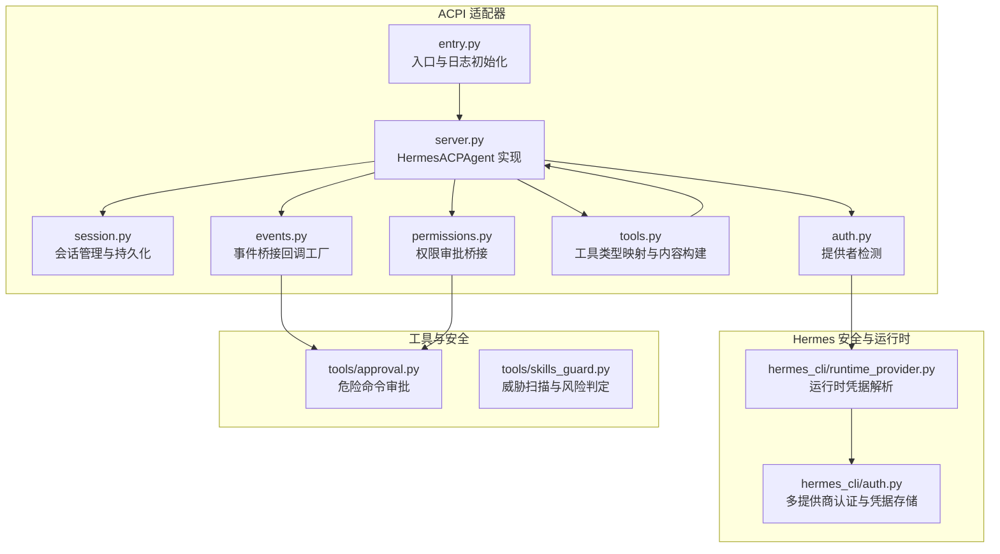
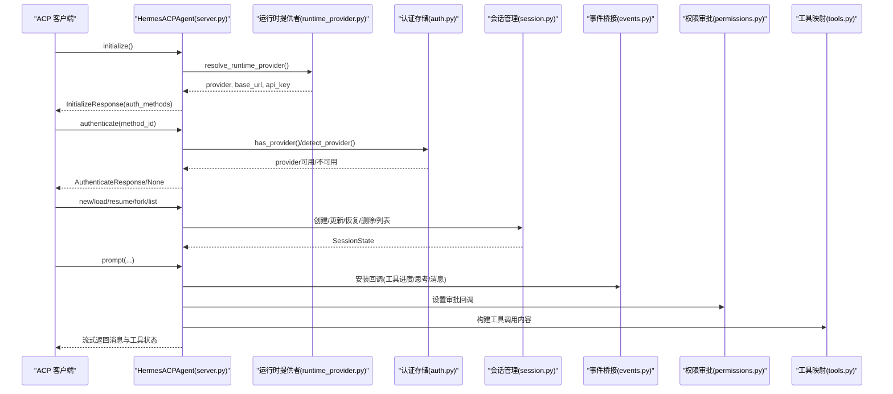
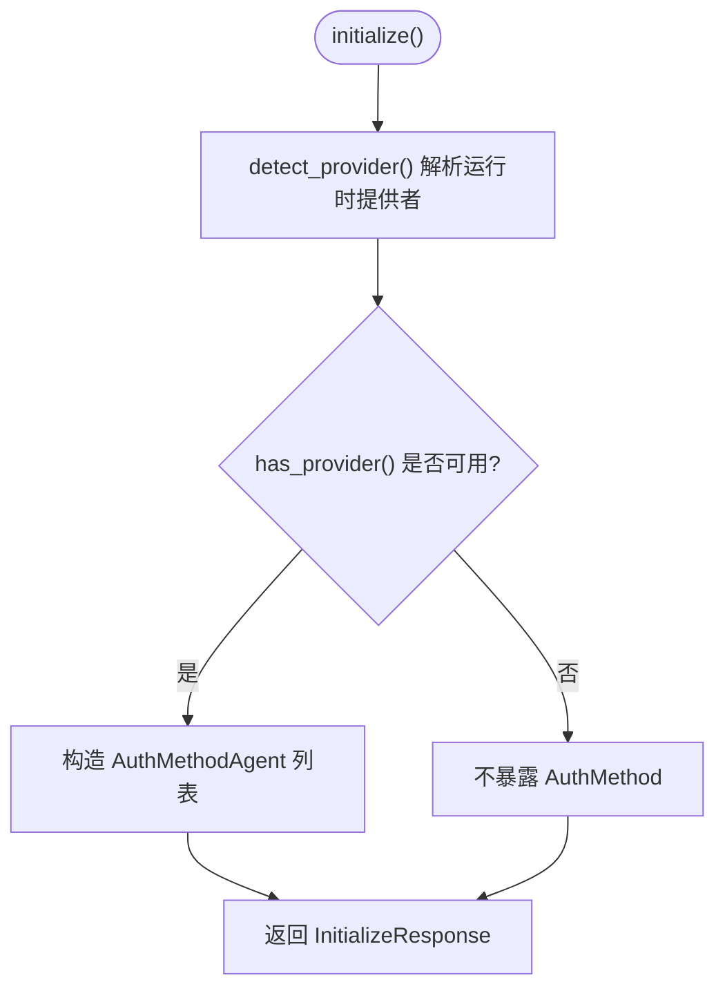
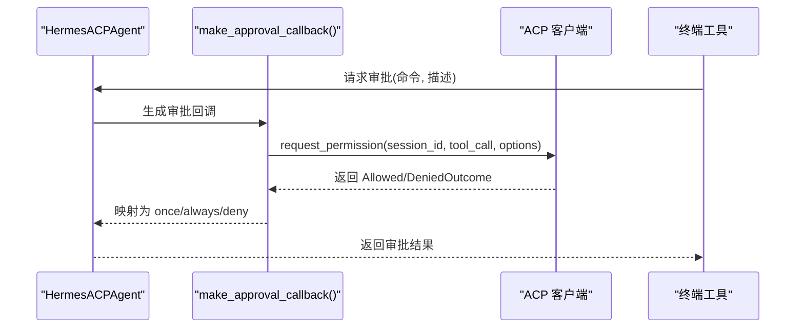
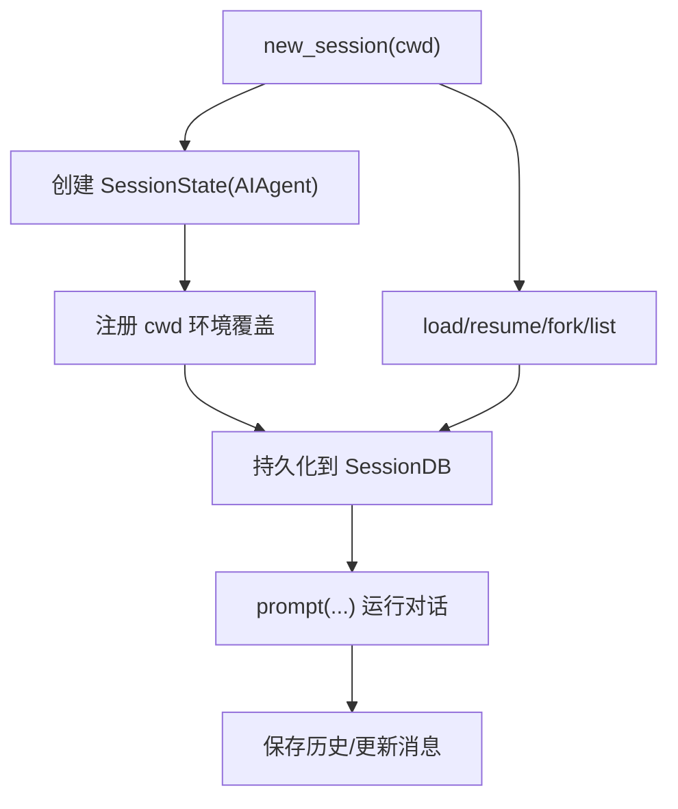
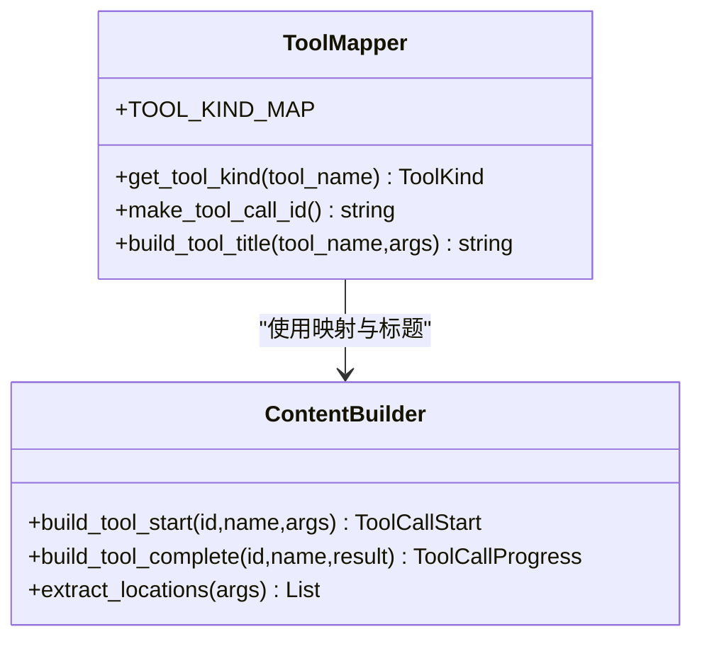
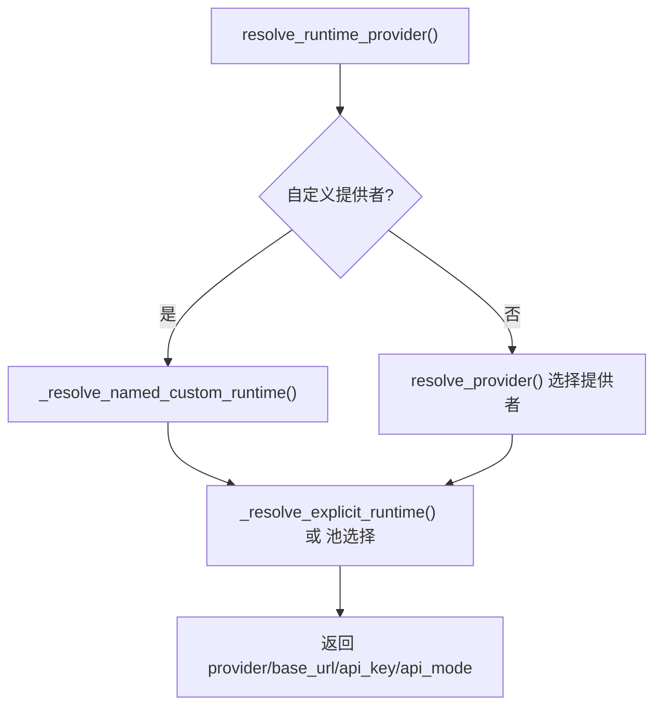
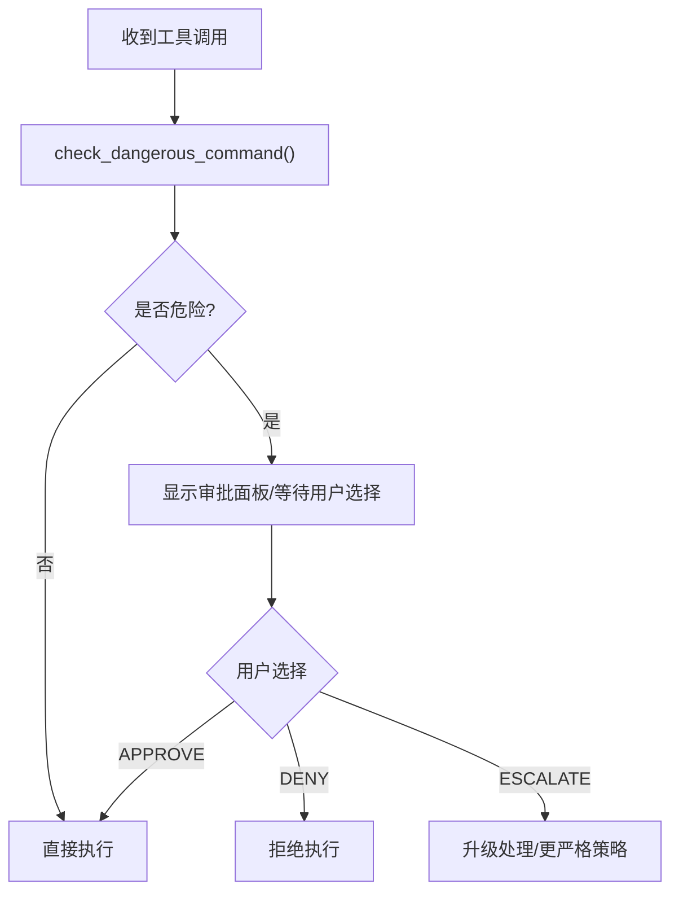
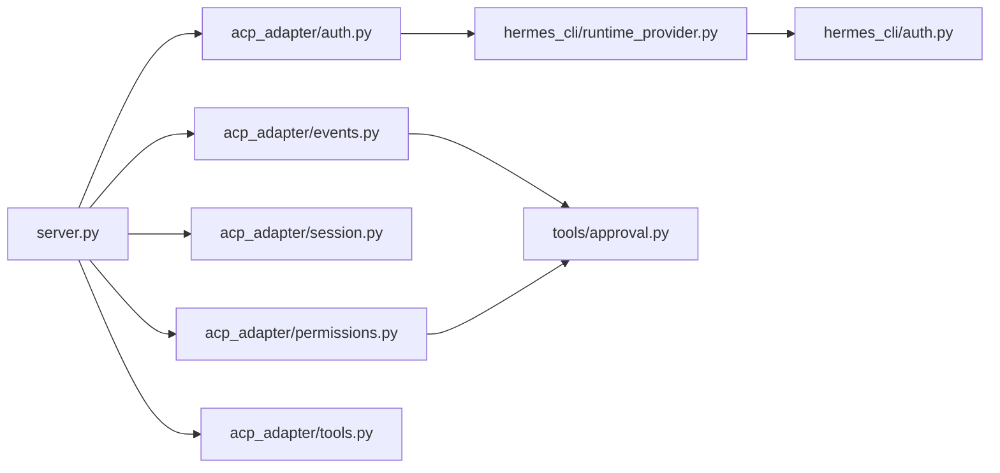

# 权限控制与安全

<cite>
**本文引用的文件**
- [acp_adapter/auth.py](file://acp_adapter/auth.py)
- [acp_adapter/permissions.py](file://acp_adapter/permissions.py)
- [acp_adapter/server.py](file://acp_adapter/server.py)
- [acp_adapter/session.py](file://acp_adapter/session.py)
- [acp_adapter/tools.py](file://acp_adapter/tools.py)
- [acp_adapter/events.py](file://acp_adapter/events.py)
- [acp_adapter/entry.py](file://acp_adapter/entry.py)
- [hermes_cli/auth.py](file://hermes_cli/auth.py)
- [hermes_cli/runtime_provider.py](file://hermes_cli/runtime_provider.py)
- [tools/approval.py](file://tools/approval.py)
- [tools/skills_guard.py](file://tools/skills_guard.py)
- [tests/acp/test_auth.py](file://tests/acp/test_auth.py)
- [tests/acp/test_permissions.py](file://tests/acp/test_permissions.py)
- [tests/acp/test_server.py](file://tests/acp/test_server.py)
- [website/docs/developer-guide/acp-internals.md](file://website/docs/developer-guide/acp-internals.md)
- [website/docs/user-guide/security.md](file://website/docs/user-guide/security.md)
</cite>

## 目录
1. [简介](#简介)
2. [项目结构](#项目结构)
3. [核心组件](#核心组件)
4. [架构总览](#架构总览)
5. [详细组件分析](#详细组件分析)
6. [依赖关系分析](#依赖关系分析)
7. [性能考量](#性能考量)
8. [故障排查指南](#故障排查指南)
9. [结论](#结论)
10. [附录](#附录)

## 简介
本文件围绕 ACPI（Agent Communication Protocol）适配器中的权限控制与安全机制进行系统化说明，覆盖认证流程、授权策略、访问控制模型、凭据验证与安全令牌管理、工具调用的权限检查与用户批准流程、敏感操作保护、安全威胁模型与攻击面分析、防护措施、安全配置指南、最佳实践以及审计与监控建议。内容基于仓库中 ACPI 适配器与相关安全模块的实际实现，确保可追溯性与可操作性。

## 项目结构
ACPI 适配器位于 acp_adapter 目录，围绕会话管理、事件桥接、工具映射、权限审批与认证方法暴露形成闭环；同时复用 Hermes 的运行时凭证解析能力与 CLI 认证体系，确保统一的凭据来源与一致的安全策略。



图示来源
- [acp_adapter/entry.py:1-86](file://acp_adapter/entry.py#L1-L86)
- [acp_adapter/server.py:1-727](file://acp_adapter/server.py#L1-L727)
- [acp_adapter/session.py:1-476](file://acp_adapter/session.py#L1-L476)
- [acp_adapter/events.py:1-176](file://acp_adapter/events.py#L1-L176)
- [acp_adapter/permissions.py:1-78](file://acp_adapter/permissions.py#L1-L78)
- [acp_adapter/tools.py:1-215](file://acp_adapter/tools.py#L1-L215)
- [acp_adapter/auth.py:1-25](file://acp_adapter/auth.py#L1-L25)
- [hermes_cli/auth.py:1-800](file://hermes_cli/auth.py#L1-L800)
- [hermes_cli/runtime_provider.py:1-769](file://hermes_cli/runtime_provider.py#L1-L769)
- [tools/approval.py:510-546](file://tools/approval.py#L510-L546)
- [tools/skills_guard.py:73-1105](file://tools/skills_guard.py#L73-L1105)

章节来源
- [acp_adapter/entry.py:1-86](file://acp_adapter/entry.py#L1-L86)
- [acp_adapter/server.py:1-727](file://acp_adapter/server.py#L1-L727)
- [acp_adapter/session.py:1-476](file://acp_adapter/session.py#L1-L476)
- [acp_adapter/events.py:1-176](file://acp_adapter/events.py#L1-L176)
- [acp_adapter/permissions.py:1-78](file://acp_adapter/permissions.py#L1-L78)
- [acp_adapter/tools.py:1-215](file://acp_adapter/tools.py#L1-L215)
- [acp_adapter/auth.py:1-25](file://acp_adapter/auth.py#L1-L25)
- [hermes_cli/auth.py:1-800](file://hermes_cli/auth.py#L1-L800)
- [hermes_cli/runtime_provider.py:1-769](file://hermes_cli/runtime_provider.py#L1-L769)
- [tools/approval.py:510-546](file://tools/approval.py#L510-L546)
- [tools/skills_guard.py:73-1105](file://tools/skills_guard.py#L73-L1105)

## 核心组件
- 认证与提供者解析：通过 detect_provider()/has_provider() 检测当前运行时提供者，initialize() 将其作为 AuthMethod 暴露给客户端；authenticate() 基于是否已配置提供者决定是否允许认证。
- 会话与持久化：SessionManager 负责创建/恢复/清理会话，持久化到 SessionDB，绑定任务工作目录，支持 fork 与列表查询。
- 事件桥接：将工具调用、思考过程、消息流等事件转换为 ACP 更新并异步发送。
- 权限审批桥接：将终端危险命令审批请求映射为 ACP 权限请求，超时或失败默认拒绝。
- 工具映射与内容构建：将 Hermes 工具名映射为 ACP ToolKind，并生成 UI 友好的标题与内容块。
- 危险命令审批与威胁扫描：在执行前对命令进行规则扫描与智能判断，结合用户交互完成审批。

章节来源
- [acp_adapter/auth.py:8-25](file://acp_adapter/auth.py#L8-L25)
- [acp_adapter/server.py:216-260](file://acp_adapter/server.py#L216-L260)
- [acp_adapter/server.py:256-259](file://acp_adapter/server.py#L256-L259)
- [acp_adapter/session.py:70-248](file://acp_adapter/session.py#L70-L248)
- [acp_adapter/events.py:27-41](file://acp_adapter/events.py#L27-L41)
- [acp_adapter/permissions.py:26-78](file://acp_adapter/permissions.py#L26-L78)
- [acp_adapter/tools.py:20-56](file://acp_adapter/tools.py#L20-L56)
- [tools/approval.py:510-546](file://tools/approval.py#L510-L546)
- [tools/skills_guard.py:73-1105](file://tools/skills_guard.py#L73-L1105)

## 架构总览
下图展示 ACPI 适配器如何与运行时认证、会话管理、事件桥接、权限审批及工具映射协同，形成从认证到执行再到反馈的闭环。



图示来源
- [acp_adapter/server.py:216-260](file://acp_adapter/server.py#L216-L260)
- [acp_adapter/server.py:256-259](file://acp_adapter/server.py#L256-L259)
- [acp_adapter/server.py:349-466](file://acp_adapter/server.py#L349-L466)
- [hermes_cli/runtime_provider.py:566-762](file://hermes_cli/runtime_provider.py#L566-L762)
- [hermes_cli/auth.py:592-654](file://hermes_cli/auth.py#L592-L654)
- [acp_adapter/session.py:94-164](file://acp_adapter/session.py#L94-L164)
- [acp_adapter/events.py:47-156](file://acp_adapter/events.py#L47-L156)
- [acp_adapter/permissions.py:26-78](file://acp_adapter/permissions.py#L26-L78)
- [acp_adapter/tools.py:104-197](file://acp_adapter/tools.py#L104-L197)

## 详细组件分析

### 认证与 AuthMethod 实现
- 提供者检测：detect_provider() 通过运行时解析器获取 provider 与 api_key，has_provider() 判断是否存在有效凭据。
- 初始化阶段：initialize() 根据 detect_provider() 结果构造 AuthMethodAgent 列表，向客户端暴露当前运行时提供者。
- 认证阶段：authenticate() 仅当 has_provider() 返回真值时才允许认证，否则返回 None。



图示来源
- [acp_adapter/server.py:216-260](file://acp_adapter/server.py#L216-L260)
- [acp_adapter/auth.py:8-25](file://acp_adapter/auth.py#L8-L25)

章节来源
- [acp_adapter/server.py:216-260](file://acp_adapter/server.py#L216-L260)
- [acp_adapter/server.py:256-259](file://acp_adapter/server.py#L256-L259)
- [acp_adapter/auth.py:8-25](file://acp_adapter/auth.py#L8-L25)
- [tests/acp/test_auth.py:1-57](file://tests/acp/test_auth.py#L1-L57)

### 授权策略与访问控制模型
- 访问控制：ACPI 不直接管理凭据存储，而是复用 Hermes 的运行时解析器与认证存储，确保凭据来源统一且受控。
- 授权决策：authorize() 由终端工具侧的审批回调完成，ACPI 适配器通过 make_approval_callback() 将审批结果映射回 ACP 权限选项。
- 默认拒绝：权限请求超时或异常时，自动拒绝，遵循“失败关闭”原则。



图示来源
- [acp_adapter/permissions.py:26-78](file://acp_adapter/permissions.py#L26-L78)
- [acp_adapter/server.py:396-436](file://acp_adapter/server.py#L396-L436)
- [website/docs/developer-guide/acp-internals.md:89-154](file://website/docs/developer-guide/acp-internals.md#L89-L154)

章节来源
- [acp_adapter/permissions.py:17-23](file://acp_adapter/permissions.py#L17-L23)
- [acp_adapter/permissions.py:43-76](file://acp_adapter/permissions.py#L43-L76)
- [tests/acp/test_permissions.py:47-75](file://tests/acp/test_permissions.py#L47-L75)
- [website/docs/developer-guide/acp-internals.md:89-154](file://website/docs/developer-guide/acp-internals.md#L89-L154)

### 会话生命周期与持久化
- 生命周期：new_session()/load_session()/resume_session()/fork_session()/list_sessions() 支持完整的会话管理。
- 持久化：SessionDB 存储会话元数据与消息历史，支持跨进程重启后恢复。
- 工作目录绑定：通过任务级环境覆盖将 cwd 绑定到工具执行上下文，避免越权路径访问。



图示来源
- [acp_adapter/session.py:94-164](file://acp_adapter/session.py#L94-L164)
- [acp_adapter/session.py:273-332](file://acp_adapter/session.py#L273-L332)
- [acp_adapter/session.py:333-405](file://acp_adapter/session.py#L333-L405)

章节来源
- [acp_adapter/session.py:70-248](file://acp_adapter/session.py#L70-L248)
- [tests/acp/test_server.py:106-217](file://tests/acp/test_server.py#L106-L217)

### 工具调用与内容渲染
- 工具类型映射：TOOL_KIND_MAP 将 Hermes 工具映射为 ACP ToolKind，用于 UI 渲染与分类。
- 内容构建：build_tool_start()/build_tool_complete() 生成 ToolCallStart/Update，限制大结果输出长度，提升 UI 安全性。
- 位置提取：extract_locations() 从参数中提取文件系统位置信息，便于编辑器定位。



图示来源
- [acp_adapter/tools.py:20-56](file://acp_adapter/tools.py#L20-L56)
- [acp_adapter/tools.py:104-197](file://acp_adapter/tools.py#L104-L197)
- [acp_adapter/tools.py:205-215](file://acp_adapter/tools.py#L205-L215)

章节来源
- [acp_adapter/tools.py:1-215](file://acp_adapter/tools.py#L1-L215)
- [website/docs/developer-guide/acp-internals.md:101-111](file://website/docs/developer-guide/acp-internals.md#L101-L111)

### 事件桥接与 UI 更新
- 回调工厂：make_tool_progress_cb()/make_thinking_cb()/make_step_cb()/make_message_cb() 将 AIAgent 的事件转换为 ACP session_update。
- 异步发送：通过 asyncio.run_coroutine_threadsafe() 在主线程事件循环中安全发送更新，避免线程间同步问题。

```mermaid
sequenceDiagram
participant Agent as "AIAgent"
participant Factory as "事件工厂(events.py)"
participant Conn as "acp.Client"
participant Loop as "事件循环"
Agent->>Factory : 触发 tool/step/thinking/message
Factory->>Conn : session_update(session_id, update)
Conn->>Loop : run_coroutine_threadsafe(...)
Loop-->>Conn : 发送完成
```

图示来源
- [acp_adapter/events.py:47-156](file://acp_adapter/events.py#L47-L156)
- [acp_adapter/events.py:27-41](file://acp_adapter/events.py#L27-L41)

章节来源
- [acp_adapter/events.py:1-176](file://acp_adapter/events.py#L1-L176)

### 凭据验证与安全令牌管理
- 多提供商认证：hermes_cli/auth.py 提供 ProviderConfig 注册、OAuth 设备码流程、API Key 提供商解析与凭据池管理。
- 运行时解析：hermes_cli/runtime_provider.py 统一解析 provider、base_url、api_key、api_mode，并支持自定义提供者与池选择。
- 文件锁与权限：认证存储采用跨进程文件锁与严格权限设置，防止并发写入与泄露。



图示来源
- [hermes_cli/runtime_provider.py:566-762](file://hermes_cli/runtime_provider.py#L566-L762)
- [hermes_cli/auth.py:592-654](file://hermes_cli/auth.py#L592-L654)

章节来源
- [hermes_cli/auth.py:1-800](file://hermes_cli/auth.py#L1-L800)
- [hermes_cli/runtime_provider.py:1-769](file://hermes_cli/runtime_provider.py#L1-L769)

### 工具调用的权限检查与用户批准流程
- 危险命令检测：check_dangerous_command() 对命令进行规则扫描与智能判断，必要时触发用户交互。
- 审批策略：APPROVE/DENY/ESCALATE，支持一次性、会话内、永久三种模式，超时默认 DENY。
- 集成到 ACPI：通过 make_approval_callback() 将审批结果映射为 ACP 权限选项，确保工具调用可控。



图示来源
- [tools/approval.py:510-546](file://tools/approval.py#L510-L546)
- [acp_adapter/permissions.py:26-78](file://acp_adapter/permissions.py#L26-L78)

章节来源
- [tools/approval.py:510-546](file://tools/approval.py#L510-L546)
- [website/docs/user-guide/security.md:71-80](file://website/docs/user-guide/security.md#L71-L80)

### 敏感操作保护与威胁模型
- 威胁扫描：skills_guard.py 定义威胁模式库，涵盖凭据外泄、读取密钥存储、危险路径操作等。
- 风险判定：根据发现的严重级别返回 dangerous/caution，辅助审批决策。
- 防护措施：限制大结果输出、严格的审批超时策略、失败关闭、最小权限原则。

章节来源
- [tools/skills_guard.py:73-1105](file://tools/skills_guard.py#L73-L1105)
- [website/docs/developer-guide/acp-internals.md:89-154](file://website/docs/developer-guide/acp-internals.md#L89-L154)

## 依赖关系分析
- ACPI 适配器依赖运行时解析器与认证存储，确保凭据来源可信与一致。
- 事件桥接与工具映射解耦 AIAgent 与 ACP 协议细节，便于扩展与维护。
- 权限审批桥接将终端工具的审批语义映射到 ACP 权限模型，形成统一的授权入口。



图示来源
- [acp_adapter/server.py:1-727](file://acp_adapter/server.py#L1-L727)
- [acp_adapter/auth.py:1-25](file://acp_adapter/auth.py#L1-L25)
- [acp_adapter/permissions.py:1-78](file://acp_adapter/permissions.py#L1-L78)
- [acp_adapter/session.py:1-476](file://acp_adapter/session.py#L1-L476)
- [acp_adapter/events.py:1-176](file://acp_adapter/events.py#L1-L176)
- [acp_adapter/tools.py:1-215](file://acp_adapter/tools.py#L1-L215)
- [hermes_cli/runtime_provider.py:1-769](file://hermes_cli/runtime_provider.py#L1-L769)
- [hermes_cli/auth.py:1-800](file://hermes_cli/auth.py#L1-L800)
- [tools/approval.py:510-546](file://tools/approval.py#L510-L546)

章节来源
- [acp_adapter/server.py:1-727](file://acp_adapter/server.py#L1-L727)
- [hermes_cli/runtime_provider.py:1-769](file://hermes_cli/runtime_provider.py#L1-L769)

## 性能考量
- 线程池执行：prompt() 使用 ThreadPoolExecutor 并发运行 AIAgent，避免阻塞事件循环。
- 事件异步发送：通过 run_coroutine_threadsafe() 将更新投递至事件循环，降低线程切换开销。
- 输出截断：工具结果超过阈值时截断，减少 UI 压力与传输成本。
- 会话持久化：批量写入与事务提交，减少磁盘 IO 次数。

章节来源
- [acp_adapter/server.py:68-69](file://acp_adapter/server.py#L68-L69)
- [acp_adapter/server.py:438-442](file://acp_adapter/server.py#L438-L442)
- [acp_adapter/tools.py:185-197](file://acp_adapter/tools.py#L185-L197)
- [acp_adapter/session.py:297-331](file://acp_adapter/session.py#L297-L331)

## 故障排查指南
- 认证失败：确认 has_provider() 返回真值，检查运行时解析器是否正确加载 provider 与 api_key。
- 权限请求超时：检查客户端网络连通性与事件循环健康；适当延长超时时间。
- 会话恢复失败：确认 SessionDB 可用与会话记录完整；检查 cwd 元数据解析。
- 审批超时被拒：调整 approvals.timeout 配置；优化审批面板交互以减少延迟。
- 日志定位：入口脚本将日志输出到 stderr，避免污染 stdout 协议帧。

章节来源
- [tests/acp/test_auth.py:1-57](file://tests/acp/test_auth.py#L1-L57)
- [tests/acp/test_permissions.py:63-75](file://tests/acp/test_permissions.py#L63-L75)
- [tests/acp/test_server.py:106-217](file://tests/acp/test_server.py#L106-L217)
- [website/docs/user-guide/security.md:71-80](file://website/docs/user-guide/security.md#L71-L80)
- [acp_adapter/entry.py:23-56](file://acp_adapter/entry.py#L23-L56)

## 结论
ACPI 适配器通过复用 Hermes 的运行时解析与认证体系，实现了统一的凭据来源与一致的授权策略；借助权限审批桥接、事件桥接与工具映射，既保证了功能完整性，又强化了安全性与可观测性。默认拒绝、超时保护与威胁扫描共同构成纵深防御，配合完善的配置与最佳实践，能够有效降低风险并提升系统的整体安全性。

## 附录
- 安全配置要点
  - 启用并配置 approvals.timeout，确保审批超时行为符合预期。
  - 使用自定义提供者时，确保 base_url 与 api_key 正确配置，避免凭据泄露。
  - 定期轮换凭据，利用认证存储的跨进程锁保障一致性。
- 最佳实践
  - 对高危工具调用强制审批，谨慎授予“永久允许”。
  - 限制工具输出长度，避免敏感信息在 UI 中过度暴露。
  - 使用 MCP 服务器注册时，严格校验外部服务的可信度与权限范围。
- 审计与监控
  - 关注会话创建/销毁、权限请求与审批结果、工具调用统计与错误日志。
  - 结合 SessionDB 的消息历史与事件流，建立端到端的审计轨迹。

章节来源
- [website/docs/user-guide/security.md:71-80](file://website/docs/user-guide/security.md#L71-L80)
- [acp_adapter/session.py:273-332](file://acp_adapter/session.py#L273-L332)
- [acp_adapter/events.py:1-176](file://acp_adapter/events.py#L1-L176)
- [tools/skills_guard.py:73-1105](file://tools/skills_guard.py#L73-L1105)