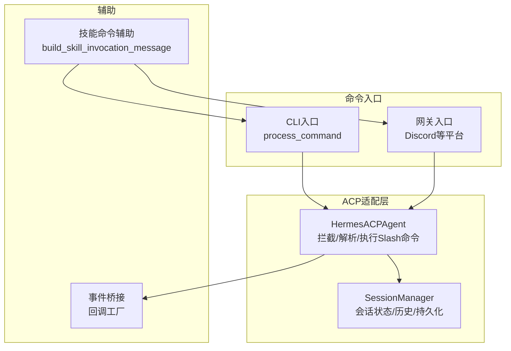
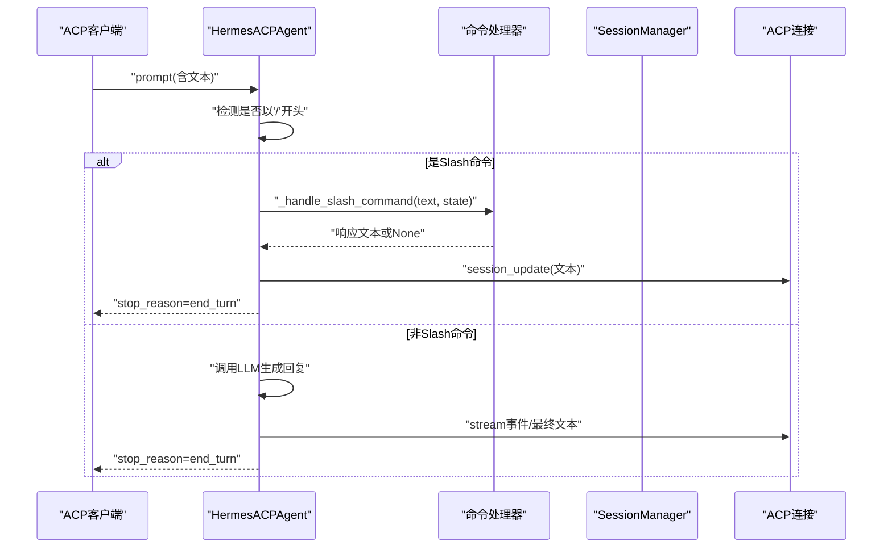
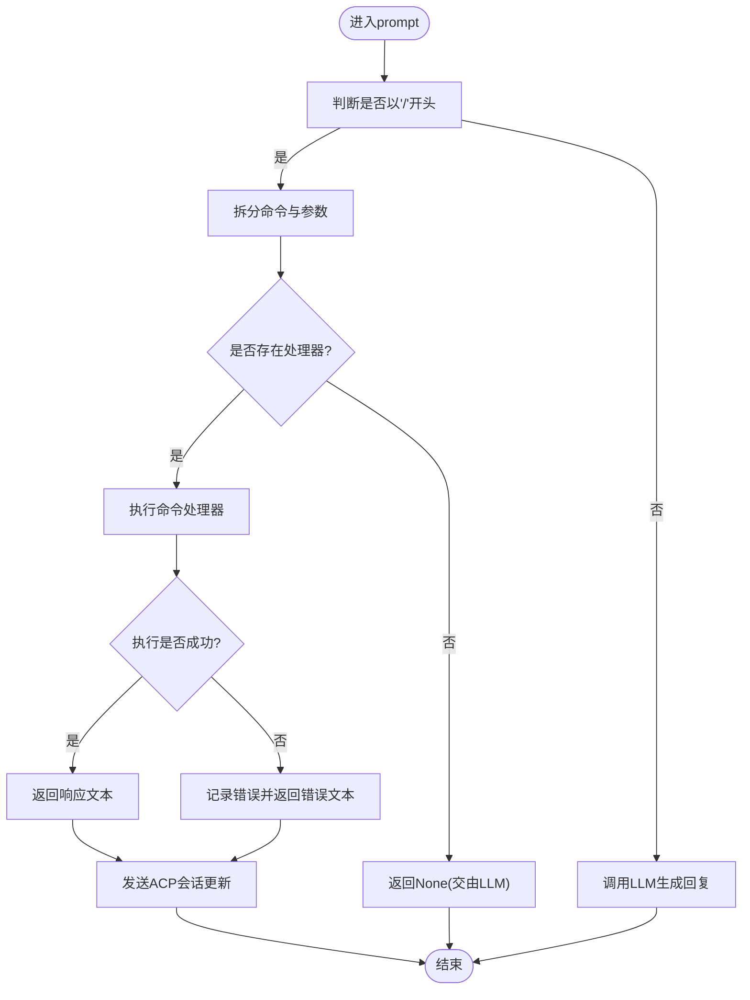
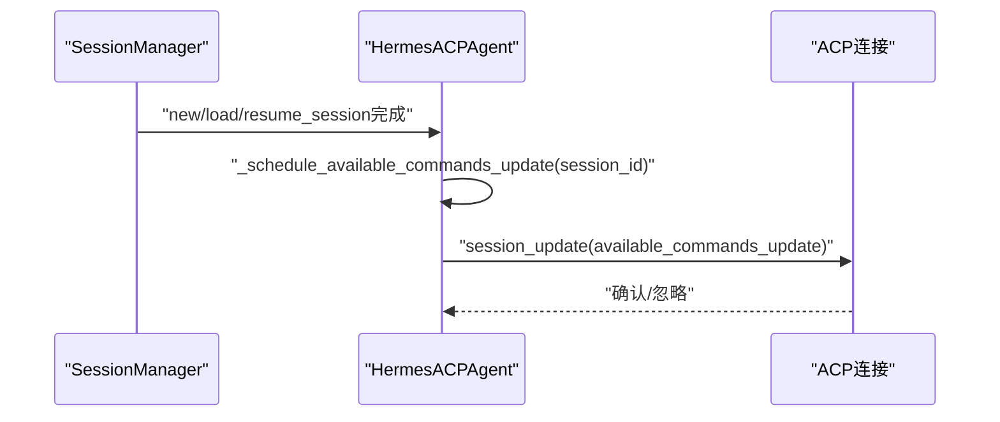
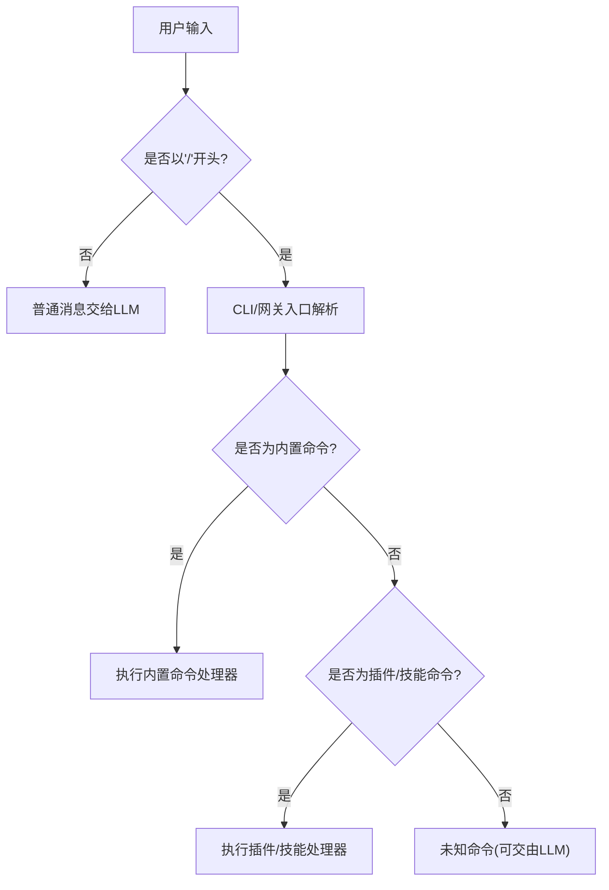
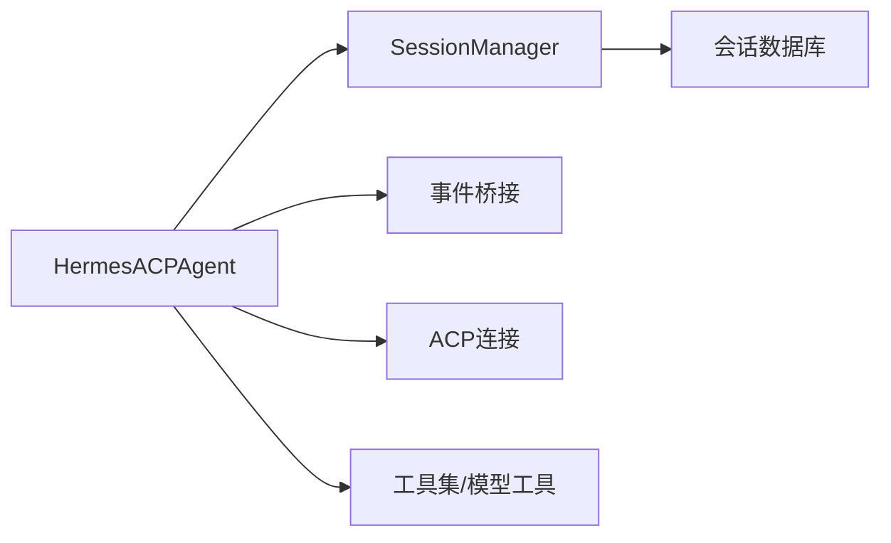

# Slash命令处理

<cite>
**本文引用的文件**
- [acp_adapter/server.py](file://acp_adapter/server.py)
- [acp_adapter/session.py](file://acp_adapter/session.py)
- [agent/skill_commands.py](file://agent/skill_commands.py)
- [cli.py](file://cli.py)
- [gateway/platforms/discord.py](file://gateway/platforms/discord.py)
- [acp_adapter/events.py](file://acp_adapter/events.py)
- [tests/acp/test_server.py](file://tests/acp/test_server.py)
</cite>

## 目录
1. [简介](#简介)
2. [项目结构](#项目结构)
3. [核心组件](#核心组件)
4. [架构总览](#架构总览)
5. [详细组件分析](#详细组件分析)
6. [依赖关系分析](#依赖关系分析)
7. [性能考量](#性能考量)
8. [故障排查指南](#故障排查指南)
9. [结论](#结论)
10. [附录](#附录)

## 简介
本文件面向ACPI协议下的Slash命令处理机制，系统性梳理拦截、解析、执行与响应的全流程，覆盖内置命令（help、model、tools、context、reset、compact、version）的完整规范，包括参数说明、输出格式、错误处理与使用示例；并补充命令广告机制与可用命令更新流程，提供流程图、状态图与典型使用场景，帮助开发者与用户正确理解与扩展Slash命令体系。

## 项目结构
围绕Slash命令处理的关键模块如下：
- ACP适配器服务端：负责拦截/解析/分发Slash命令，生成响应文本并通过ACP会话更新返回客户端。
- 会话管理：维护会话状态、历史消息、持久化与工具集刷新。
- 技能命令辅助：提供技能类Slash命令的加载与消息构建能力。
- CLI与网关：在不同入口处对Slash命令进行识别与派发，支持插件与技能命令。
- 事件桥接：将内部事件转化为ACP会话更新，保证交互一致性。

图表来源
- [acp_adapter/server.py:349-465](file://acp_adapter/server.py#L349-L465)
- [acp_adapter/session.py:70-248](file://acp_adapter/session.py#L70-L248)
- [agent/skill_commands.py:291-326](file://agent/skill_commands.py#L291-L326)
- [cli.py:4309-4600](file://cli.py#L4309-L4600)
- [gateway/platforms/discord.py:1537-1559](file://gateway/platforms/discord.py#L1537-L1559)

章节来源
- [acp_adapter/server.py:349-465](file://acp_adapter/server.py#L349-L465)
- [acp_adapter/session.py:70-248](file://acp_adapter/session.py#L70-L248)
- [agent/skill_commands.py:291-326](file://agent/skill_commands.py#L291-L326)
- [cli.py:4309-4600](file://cli.py#L4309-L4600)
- [gateway/platforms/discord.py:1537-1559](file://gateway/platforms/discord.py#L1537-L1559)

## 核心组件
- 拦截与分发：在ACP会话的prompt阶段检测以“/”开头的消息，若命中已知Slash命令则直接处理并返回，不调用LLM。
- 命令表与广告：内置命令表与可输入提示通过AvailableCommandsUpdate广播给客户端，便于UI自动补全与展示。
- 内置命令处理器：统一由_handle_slash_command分发到各命令处理器，异常时返回错误信息。
- 会话状态与持久化：命令执行后可能修改历史或模型配置，需保存会话以确保重启后状态一致。
- 事件桥接：将命令执行结果以ACP会话更新形式发送至客户端，保持交互一致性。

章节来源
- [acp_adapter/server.py:371-378](file://acp_adapter/server.py#L371-L378)
- [acp_adapter/server.py:485-512](file://acp_adapter/server.py#L485-L512)
- [acp_adapter/server.py:514-542](file://acp_adapter/server.py#L514-L542)
- [acp_adapter/session.py:238-247](file://acp_adapter/session.py#L238-L247)

## 架构总览
下图展示Slash命令从入口到响应的端到端流程，涵盖拦截、解析、执行、会话更新与错误处理。

图表来源
- [acp_adapter/server.py:349-465](file://acp_adapter/server.py#L349-L465)
- [acp_adapter/server.py:514-542](file://acp_adapter/server.py#L514-L542)

## 详细组件分析

### 组件A：Slash命令拦截与分发
- 拦截位置：在prompt处理中，若用户文本以“/”开头，则进入Slash命令分支。
- 解析逻辑：按空格拆分首段作为命令名，其余为参数；命令名转小写用于匹配。
- 分发策略：根据命令名映射到具体处理器；未知命令返回None，交由LLM继续处理。
- 错误处理：捕获命令执行异常，记录日志并返回错误提示文本。

图表来源
- [acp_adapter/server.py:367-378](file://acp_adapter/server.py#L367-L378)
- [acp_adapter/server.py:514-542](file://acp_adapter/server.py#L514-L542)

章节来源
- [acp_adapter/server.py:367-378](file://acp_adapter/server.py#L367-L378)
- [acp_adapter/server.py:514-542](file://acp_adapter/server.py#L514-L542)

### 组件B：命令广告与可用命令更新
- 广告内容：内置命令列表及可选输入提示，用于客户端UI展示与自动补全。
- 触发时机：新会话、加载会话、恢复会话时，延迟调度一次可用命令更新。
- 更新方式：通过AvailableCommandsUpdate推送，失败仅记录警告，不影响主流程。

图表来源
- [acp_adapter/server.py:268-305](file://acp_adapter/server.py#L268-L305)
- [acp_adapter/server.py:485-512](file://acp_adapter/server.py#L485-L512)

章节来源
- [acp_adapter/server.py:470-512](file://acp_adapter/server.py#L470-L512)

### 组件C：内置命令规范

#### 命令：help
- 参数：无
- 行为：列出所有内置命令及其简要描述；提示未识别的“/命令”将被当作普通消息发送给模型。
- 输出格式：多行文本，包含命令清单与提示语。
- 典型输出：命令列表+“未识别命令将发送给模型”的说明。
- 使用示例：/help

章节来源
- [acp_adapter/server.py:543-549](file://acp_adapter/server.py#L543-L549)

#### 命令：model
- 参数：可选的新模型名称（可带提供商前缀）。若为空，显示当前模型与提供商。
- 行为：解析目标模型与提供商，切换会话模型并重建代理实例；保存会话。
- 输出格式：当前模型与提供商信息。
- 错误处理：解析失败或切换异常时返回错误文本。
- 使用示例：
  - /model
  - /model anthropic/claude-4
- 注意：当提供者与模型组合无法自动识别时，将尝试探测并回退。

章节来源
- [acp_adapter/server.py:551-582](file://acp_adapter/server.py#L551-L582)

#### 命令：tools
- 参数：无
- 行为：列举当前启用工具集中的工具定义，包含名称与描述；长描述会被截断。
- 输出格式：工具数量与逐条“名称: 描述”的列表。
- 错误处理：获取工具定义失败时返回错误文本。
- 使用示例：/tools

章节来源
- [acp_adapter/server.py:584-601](file://acp_adapter/server.py#L584-L601)

#### 命令：context
- 参数：无
- 行为：统计会话历史消息按角色的数量，显示消息总数与各角色计数；若存在模型信息则一并显示。
- 输出格式：会话统计与模型信息。
- 边界情况：空会话返回提示文本。
- 使用示例：/context

章节来源
- [acp_adapter/server.py:603-620](file://acp_adapter/server.py#L603-L620)

#### 命令：reset
- 参数：无
- 行为：清空会话历史并保存会话。
- 输出格式：提示“会话历史已清除”。
- 使用示例：/reset

章节来源
- [acp_adapter/server.py:622-625](file://acp_adapter/server.py#L622-L625)

#### 命令：compact
- 参数：无
- 行为：对会话历史进行上下文压缩，估算令牌数变化；为避免会话分裂副作用，临时禁用会话数据库。
- 输出格式：压缩前后消息数与近似令牌数对比。
- 错误处理：压缩失败返回错误文本；若代理不支持压缩或禁用压缩则返回相应提示。
- 使用示例：/compact

章节来源
- [acp_adapter/server.py:627-666](file://acp_adapter/server.py#L627-L666)

#### 命令：version
- 参数：无
- 行为：返回Hermes版本号。
- 输出格式：版本字符串。
- 使用示例：/version

章节来源
- [acp_adapter/server.py:668-669](file://acp_adapter/server.py#L668-L669)

### 组件D：命令入口与派发（CLI与网关）
- CLI入口：process_command对命令进行别名解析、插件命令与技能命令的检查，最后回落到内置命令。
- 网关入口：Discord平台注册大量slash命令，统一转发为“/命令 参数”形式，再由网关内部路由到处理逻辑。
- 技能命令：通过扫描技能目录构建命令映射，支持斜杠与下划线混用的键名匹配。

图表来源
- [cli.py:4309-4600](file://cli.py#L4309-L4600)
- [gateway/platforms/discord.py:1561-1661](file://gateway/platforms/discord.py#L1561-L1661)
- [agent/skill_commands.py:200-269](file://agent/skill_commands.py#L200-L269)

章节来源
- [cli.py:4309-4600](file://cli.py#L4309-L4600)
- [gateway/platforms/discord.py:1561-1661](file://gateway/platforms/discord.py#L1561-L1661)
- [agent/skill_commands.py:200-269](file://agent/skill_commands.py#L200-L269)

### 组件E：事件桥接与会话更新
- 事件桥接：将工具进度、思考过程、步骤与消息流式更新为ACP会话更新，保证与命令响应一致的交互体验。
- 会话更新：Slash命令执行后，通过session_update发送文本更新，随后prompt结束返回end_turn，避免重复触发LLM。

章节来源
- [acp_adapter/events.py:27-41](file://acp_adapter/events.py#L27-L41)
- [acp_adapter/events.py:162-175](file://acp_adapter/events.py#L162-L175)
- [acp_adapter/server.py:375-378](file://acp_adapter/server.py#L375-L378)

## 依赖关系分析
- 组件耦合：
  - HermesACPAgent依赖SessionManager进行会话状态与持久化。
  - 命令处理器依赖会话状态读取历史与模型信息。
  - 事件桥接依赖ACP连接对象进行会话更新。
- 外部依赖：
  - ACP协议库用于会话更新与命令广告。
  - 工具集与模型工具用于tools与model命令。
- 潜在循环依赖：未发现直接循环；命令处理与事件桥接通过回调解耦。

图表来源
- [acp_adapter/server.py:137-140](file://acp_adapter/server.py#L137-L140)
- [acp_adapter/session.py:251-331](file://acp_adapter/session.py#L251-L331)
- [acp_adapter/events.py:27-41](file://acp_adapter/events.py#L27-L41)

章节来源
- [acp_adapter/server.py:137-140](file://acp_adapter/server.py#L137-L140)
- [acp_adapter/session.py:251-331](file://acp_adapter/session.py#L251-L331)
- [acp_adapter/events.py:27-41](file://acp_adapter/events.py#L27-L41)

## 性能考量
- 命令执行开销：内置命令均为内存操作，开销极低；compact命令涉及上下文压缩估算与可能的代理重建，应避免频繁触发。
- 会话持久化：命令执行后保存会话，I/O成本与消息数量相关，建议在批量操作后统一保存。
- 事件流控：事件桥接采用fire-and-forget更新，超时控制在固定时间内，避免阻塞主事件循环。
- 广告更新：可用命令更新为一次性延迟任务，不会影响prompt处理路径。

## 故障排查指南
- 问题：/help无效或未显示全部命令
  - 排查：确认会话已触发可用命令更新；检查广告推送是否抛出异常（仅记录警告）。
  - 参考：[acp_adapter/server.py:485-512](file://acp_adapter/server.py#L485-L512)
- 问题：/model切换失败
  - 排查：确认模型名称与提供商组合有效；查看解析与探测逻辑是否报错。
  - 参考：[acp_adapter/server.py:551-582](file://acp_adapter/server.py#L551-L582)
- 问题：/tools列表为空
  - 排查：确认已启用工具集；检查工具定义获取是否异常。
  - 参考：[acp_adapter/server.py:584-601](file://acp_adapter/server.py#L584-L601)
- 问题：/compact无效果
  - 排查：确认代理支持压缩且未禁用；检查历史是否为空；关注压缩异常。
  - 参考：[acp_adapter/server.py:627-666](file://acp_adapter/server.py#L627-L666)
- 问题：未知/命令被当作普通消息
  - 排查：确认命令名是否拼写正确；测试用例验证未知命令应交由LLM。
  - 参考：[tests/acp/test_server.py:554-578](file://tests/acp/test_server.py#L554-L578)

章节来源
- [acp_adapter/server.py:551-582](file://acp_adapter/server.py#L551-L582)
- [acp_adapter/server.py:584-601](file://acp_adapter/server.py#L584-L601)
- [acp_adapter/server.py:627-666](file://acp_adapter/server.py#L627-L666)
- [tests/acp/test_server.py:554-578](file://tests/acp/test_server.py#L554-L578)

## 结论
ACPI协议下的Slash命令处理机制以“拦截—解析—分发—响应”为核心，内置命令覆盖模型、工具、上下文、重置与压缩等关键场景，具备完善的错误处理与会话持久化保障。命令广告机制确保客户端能够自动感知可用命令，提升交互体验。通过本文档的规范与流程图，开发者可快速扩展新命令、修复问题并优化性能。

## 附录

### 典型使用场景
- 快速查看上下文：/context
- 切换模型：/model anthropic/claude-4
- 查看工具：/tools
- 清理历史：/reset
- 压缩上下文：/compact
- 查看版本：/version

### 最佳实践
- 在命令处理器中尽量避免长时间阻塞操作，必要时异步化。
- 对外部依赖（如工具定义、模型解析）做好异常捕获与降级。
- 重要命令（如reset、model）应在执行后及时保存会话，确保状态持久化。
- 新增命令时同步更新命令广告与描述，保持UI一致性。