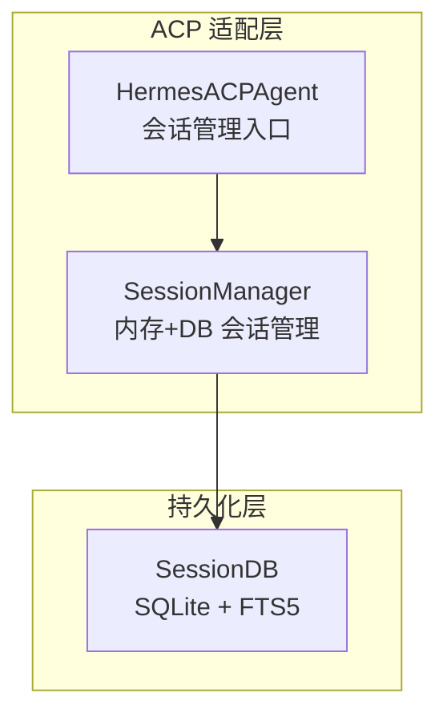
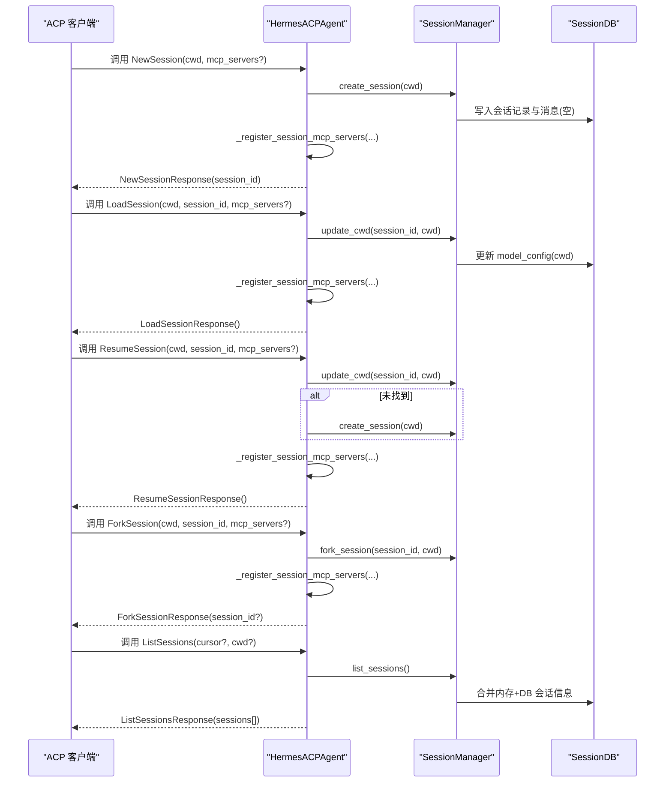
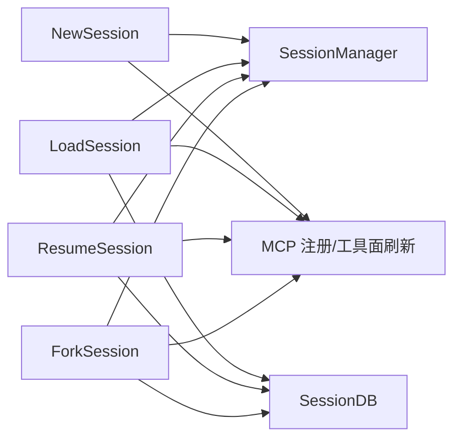
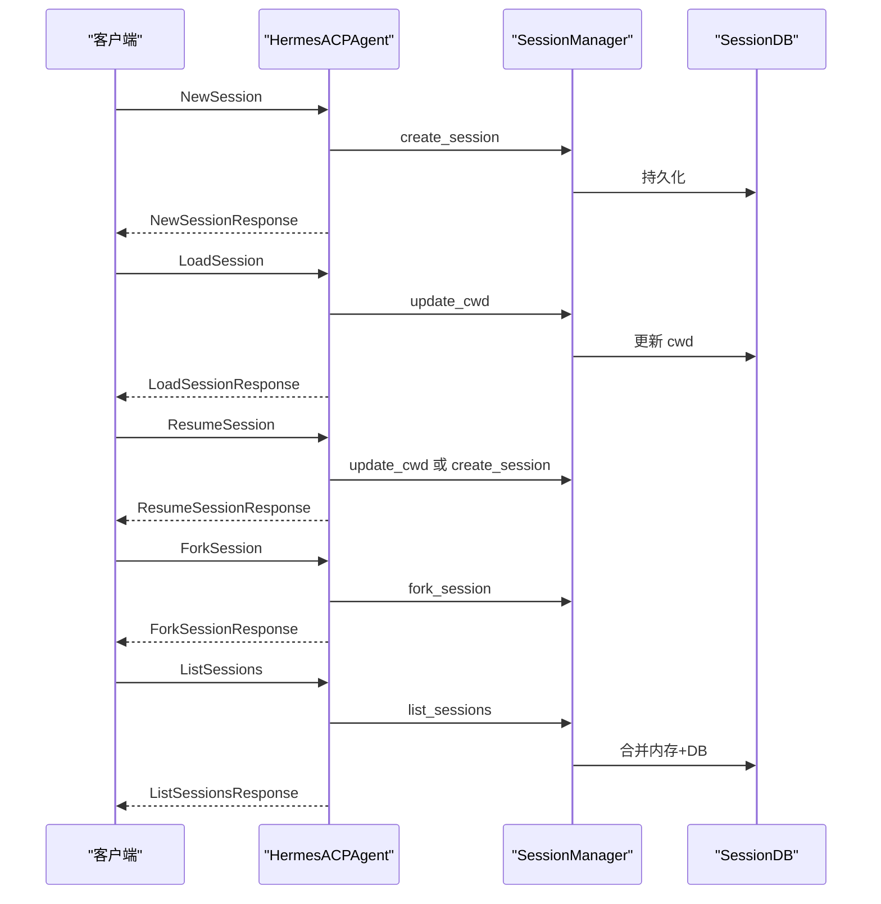
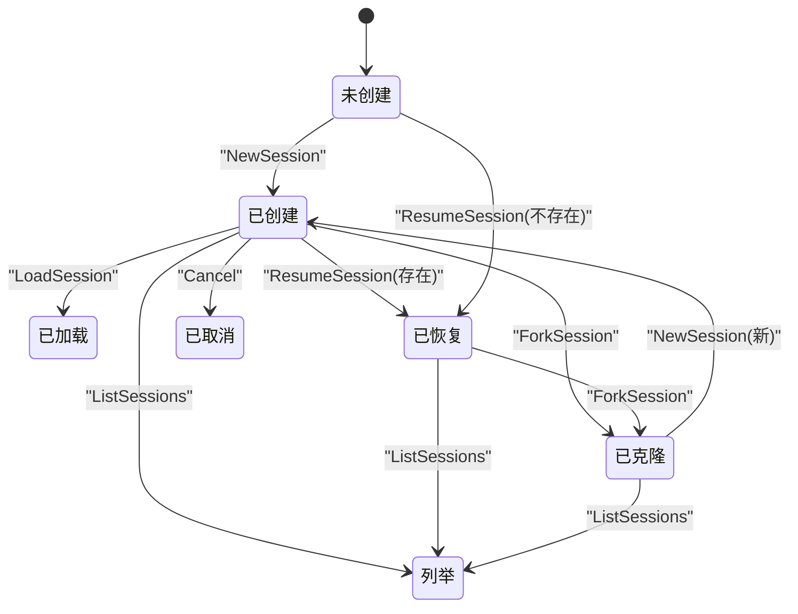

# 会话管理方法

<cite>
**本文引用的文件**
- [acp_adapter/server.py](file://acp_adapter/server.py)
- [acp_adapter/session.py](file://acp_adapter/session.py)
- [hermes_state.py](file://hermes_state.py)
- [tests/acp/test_server.py](file://tests/acp/test_server.py)
- [tests/acp/test_session.py](file://tests/acp/test_session.py)
</cite>

## 目录
1. [简介](#简介)
2. [项目结构](#项目结构)
3. [核心组件](#核心组件)
4. [架构总览](#架构总览)
5. [详细组件分析](#详细组件分析)
6. [依赖分析](#依赖分析)
7. [性能考虑](#性能考虑)
8. [故障排查指南](#故障排查指南)
9. [结论](#结论)
10. [附录](#附录)

## 简介
本技术规范面向 ACPI（Agent Client Protocol）适配层中的会话管理方法，系统性地定义并说明以下方法的完整规范：NewSession、LoadSession、ResumeSession、Cancel、ForkSession、ListSessions。内容涵盖参数与返回值、错误处理与异常、前置条件与依赖关系、典型使用场景、生命周期时序与状态转换图，并给出最佳实践与参考实现路径。

## 项目结构
围绕 ACPI 会话管理的核心代码位于 acp_adapter 子模块，配合全局会话持久化存储 hermes_state 提供跨进程重启的会话恢复能力。测试用例覆盖了关键行为与边界条件。

图表来源
- [acp_adapter/server.py:92-141](file://acp_adapter/server.py#L92-L141)
- [acp_adapter/session.py:70-91](file://acp_adapter/session.py#L70-L91)
- [hermes_state.py:115-161](file://hermes_state.py#L115-L161)

章节来源
- [acp_adapter/server.py:1-200](file://acp_adapter/server.py#L1-L200)
- [acp_adapter/session.py:1-120](file://acp_adapter/session.py#L1-L120)
- [hermes_state.py:1-120](file://hermes_state.py#L1-L120)

## 核心组件
- HermesACPAgent：暴露 ACPI 协议方法的服务器端实现，负责路由到 SessionManager 并维护客户端连接。
- SessionManager：线程安全的会话管理器，负责创建、加载、克隆、清理会话；同时负责与 SessionDB 的持久化交互。
- SessionDB：基于 SQLite 的会话持久化存储，支持消息历史、元数据与全文检索。

章节来源
- [acp_adapter/server.py:92-141](file://acp_adapter/server.py#L92-L141)
- [acp_adapter/session.py:70-120](file://acp_adapter/session.py#L70-L120)
- [hermes_state.py:115-161](file://hermes_state.py#L115-L161)

## 架构总览
ACP 会话管理通过服务器方法调用 SessionManager，后者在内存中维护 SessionState，并通过 SessionDB 持久化会话元数据与消息历史。MCP 服务器注册与工具面刷新在会话创建/加载/恢复/克隆后触发，确保客户端可用命令与工具集同步。

图表来源
- [acp_adapter/server.py:263-345](file://acp_adapter/server.py#L263-L345)
- [acp_adapter/session.py:94-163](file://acp_adapter/session.py#L94-L163)
- [hermes_state.py:115-161](file://hermes_state.py#L115-L161)

## 详细组件分析

### NewSession 方法
- 功能：创建新会话，分配唯一 session_id，初始化 AIAgent，持久化元数据。
- 参数
  - cwd: 字符串，工作目录
  - mcp_servers: 可选列表，MCP 服务器配置
  - 其他关键字参数透传
- 返回值
  - NewSessionResponse(session_id: str)
- 前置条件
  - 进程可访问 SessionDB（若不可用则仅内存态）
- 异常与错误处理
  - 若 MCP 注册失败，记录警告但不中断流程
  - 会话创建成功后调度可用命令更新
- 典型使用场景
  - 编辑器首次打开项目对话
  - 需要隔离上下文的新任务开始
- 最佳实践
  - 在创建后立即注册 MCP 服务器以保证工具面可用
  - 使用稳定的 cwd 以便工具环境绑定

章节来源
- [acp_adapter/server.py:263-273](file://acp_adapter/server.py#L263-L273)
- [acp_adapter/server.py:149-184](file://acp_adapter/server.py#L149-L184)
- [acp_adapter/session.py:94-112](file://acp_adapter/session.py#L94-L112)
- [tests/acp/test_server.py:108-116](file://tests/acp/test_server.py#L108-L116)

### LoadSession 方法
- 功能：根据 session_id 加载已有会话，更新 cwd 并注册 MCP 服务器。
- 参数
  - cwd: 字符串，工作目录
  - session_id: 字符串，目标会话标识
  - mcp_servers: 可选列表，MCP 服务器配置
- 返回值
  - LoadSessionResponse 或 None（当会话不存在时）
- 前置条件
  - 会话必须已存在（内存或 DB 中）
- 异常与错误处理
  - 会话不存在时返回 None 并记录警告
  - MCP 注册失败记录警告
- 典型使用场景
  - 编辑器重连后恢复先前会话
  - 切换工作目录继续同一会话
- 最佳实践
  - 在调用前确认 session_id 存在
  - 成功后触发可用命令更新

章节来源
- [acp_adapter/server.py:275-289](file://acp_adapter/server.py#L275-L289)
- [acp_adapter/server.py:208-216](file://acp_adapter/server.py#L208-L216)
- [tests/acp/test_server.py:178-195](file://tests/acp/test_server.py#L178-L195)

### ResumeSession 方法
- 功能：尝试恢复指定 session_id 的会话；若不存在则新建会话。
- 参数
  - cwd: 字符串，工作目录
  - session_id: 字符串，目标会话标识
  - mcp_servers: 可选列表，MCP 服务器配置
- 返回值
  - ResumeSessionResponse
- 前置条件
  - 会话可从内存或 DB 恢复
- 异常与错误处理
  - 会话不存在时自动创建新会话并记录日志
  - MCP 注册失败记录警告
- 典型使用场景
  - 编辑器重启后恢复会话
  - 未知 session_id 的兜底创建
- 最佳实践
  - 将此作为默认入口，减少“会话不存在”的分支逻辑

章节来源
- [acp_adapter/server.py:291-305](file://acp_adapter/server.py#L291-L305)
- [tests/acp/test_server.py:204-216](file://tests/acp/test_server.py#L204-L216)

### Cancel 方法
- 功能：请求取消当前会话的运行，设置取消事件并尝试中断底层 AIAgent。
- 参数
  - session_id: 字符串，目标会话标识
- 返回值
  - 无返回值（None）
- 前置条件
  - 会话存在且具备 cancel_event
- 异常与错误处理
  - 未找到会话或中断失败时记录调试日志
- 典型使用场景
  - 用户主动取消长耗时操作
- 最佳实践
  - 在会话处理循环中定期检查取消事件

章节来源
- [acp_adapter/server.py:307-317](file://acp_adapter/server.py#L307-L317)
- [tests/acp/test_server.py:164-176](file://tests/acp/test_server.py#L164-L176)

### ForkSession 方法
- 功能：基于现有会话深拷贝其历史，创建新会话并继承模型与工具面。
- 参数
  - cwd: 字符串，新会话工作目录
  - session_id: 字符串，源会话标识
  - mcp_servers: 可选列表，MCP 服务器配置
- 返回值
  - ForkSessionResponse(session_id: str)
- 前置条件
  - 源会话存在（内存或 DB）
- 异常与错误处理
  - 源会话不存在返回空 session_id
  - MCP 注册失败记录警告
- 典型使用场景
  - 并行探索不同方案
  - 基于历史上下文的分支任务
- 最佳实践
  - 深拷贝历史避免互相污染
  - 新会话独立管理 MCP 服务

章节来源
- [acp_adapter/server.py:318-332](file://acp_adapter/server.py#L318-L332)
- [acp_adapter/session.py:136-163](file://acp_adapter/session.py#L136-L163)
- [tests/acp/test_server.py:233-246](file://tests/acp/test_server.py#L233-L246)

### ListSessions 方法
- 功能：列出所有会话的基本信息（session_id、cwd 等），合并内存与 DB 数据。
- 参数
  - cursor: 可选字符串，游标（用于分页扩展）
  - cwd: 可选字符串，按工作目录过滤
- 返回值
  - ListSessionsResponse(sessions: List[SessionInfo])
- 前置条件
  - 可访问 SessionDB
- 异常与错误处理
  - DB 查询失败时记录调试日志并返回部分结果
- 典型使用场景
  - 会话列表展示、搜索与切换
- 最佳实践
  - 结合 cwd 过滤快速定位目标会话

章节来源
- [acp_adapter/server.py:334-345](file://acp_adapter/server.py#L334-L345)
- [acp_adapter/session.py:165-206](file://acp_adapter/session.py#L165-L206)

## 依赖分析
- 方法间依赖
  - NewSession/LoadSession/ResumeSession/ForkSession 均依赖 SessionManager 的 create/update/fork/list 等能力
  - 所有会话操作最终写入 SessionDB 以保证持久化
  - MCP 服务器注册在上述方法完成后执行，刷新工具面
- 外部依赖
  - SessionDB：SQLite + FTS5，提供消息历史与全文检索
  - AIAgent：会话承载的智能体实例
  - MCP 工具：动态注册与工具面刷新

图表来源
- [acp_adapter/server.py:263-345](file://acp_adapter/server.py#L263-L345)
- [acp_adapter/session.py:94-163](file://acp_adapter/session.py#L94-L163)
- [hermes_state.py:115-161](file://hermes_state.py#L115-L161)

章节来源
- [acp_adapter/server.py:149-184](file://acp_adapter/server.py#L149-L184)
- [acp_adapter/session.py:251-332](file://acp_adapter/session.py#L251-L332)
- [hermes_state.py:115-161](file://hermes_state.py#L115-L161)

## 性能考虑
- 写入竞争与重试
  - SessionDB 使用 WAL 模式与应用层抖动重试降低写入拥塞
  - 写事务采用 BEGIN IMMEDIATE 并在锁冲突时随机退避
- 读多写少优化
  - 多线程读取共享数据库，单写者模式下通过重试与检查点平衡吞吐
- 会话持久化频率
  - Prompt 完成后保存会话历史，避免频繁 IO；大失败场景跳过持久化防止放大错误

章节来源
- [hermes_state.py:138-200](file://hermes_state.py#L138-L200)
- [acp_adapter/server.py:446-447](file://acp_adapter/server.py#L446-L447)

## 故障排查指南
- 会话不存在
  - LoadSession 返回 None；建议回退到 ResumeSession 自动创建
- MCP 注册失败
  - 记录警告但不中断；检查 mcp_servers 配置与网络权限
- 取消无效
  - 确认会话存在 cancel_event；在处理循环中轮询该事件
- 会话恢复异常
  - 确认 SessionDB 可用；检查 model_config 与 provider 元数据一致性
- 测试验证
  - 使用测试套件验证各方法行为与边界条件

章节来源
- [tests/acp/test_server.py:178-195](file://tests/acp/test_server.py#L178-L195)
- [tests/acp/test_server.py:752-767](file://tests/acp/test_server.py#L752-L767)
- [tests/acp/test_session.py:129-142](file://tests/acp/test_session.py#L129-L142)

## 结论
ACP 会话管理通过统一的服务器接口与 SessionManager 抽象，实现了从创建、加载、恢复、取消、克隆到列举的全生命周期管理。结合 SessionDB 的持久化能力与 MCP 注册机制，既满足实时交互需求，又保障跨进程重启后的会话连续性。遵循本文规范与最佳实践，可在复杂场景中稳定地构建与扩展会话管理能力。

## 附录

### 生命周期时序图（NewSession/LoadSession/ResumeSession/ForkSession/ListSessions）

图表来源
- [acp_adapter/server.py:263-345](file://acp_adapter/server.py#L263-L345)
- [acp_adapter/session.py:94-163](file://acp_adapter/session.py#L94-L163)
- [hermes_state.py:115-161](file://hermes_state.py#L115-L161)

### 状态转换图（简化）

图表来源
- [acp_adapter/server.py:263-345](file://acp_adapter/server.py#L263-L345)
- [acp_adapter/session.py:94-163](file://acp_adapter/session.py#L94-L163)