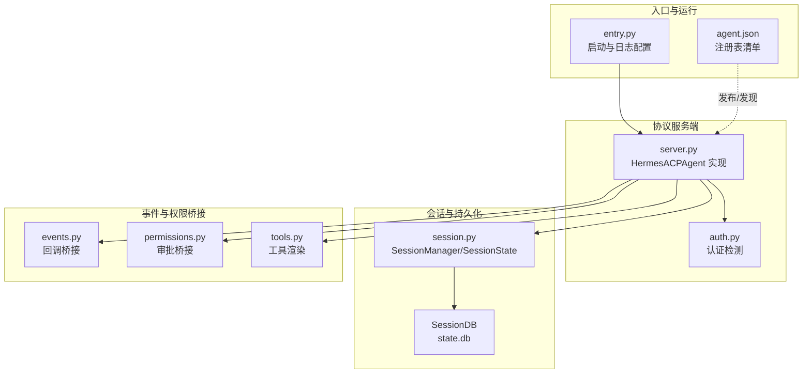
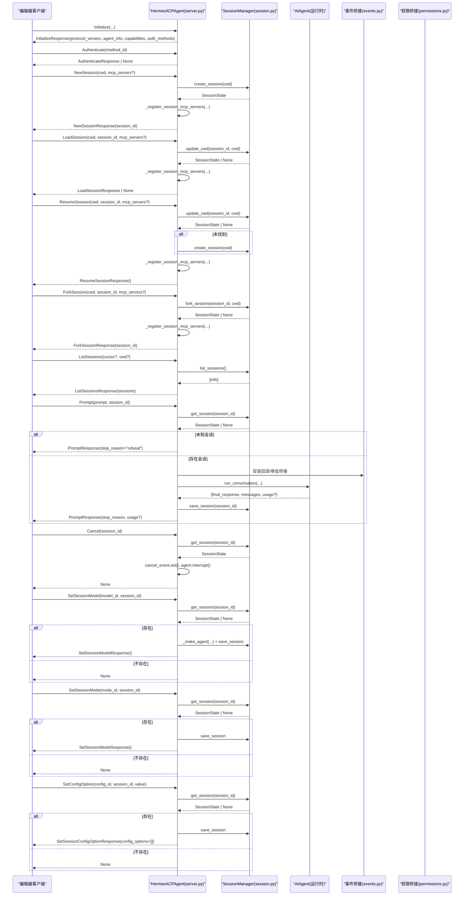
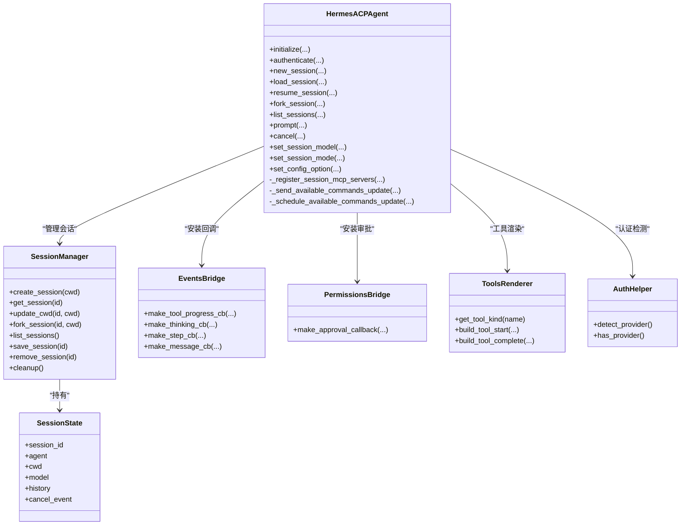
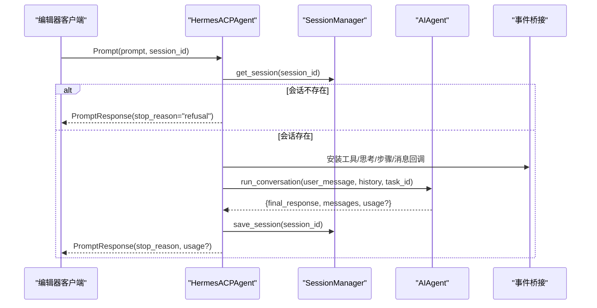
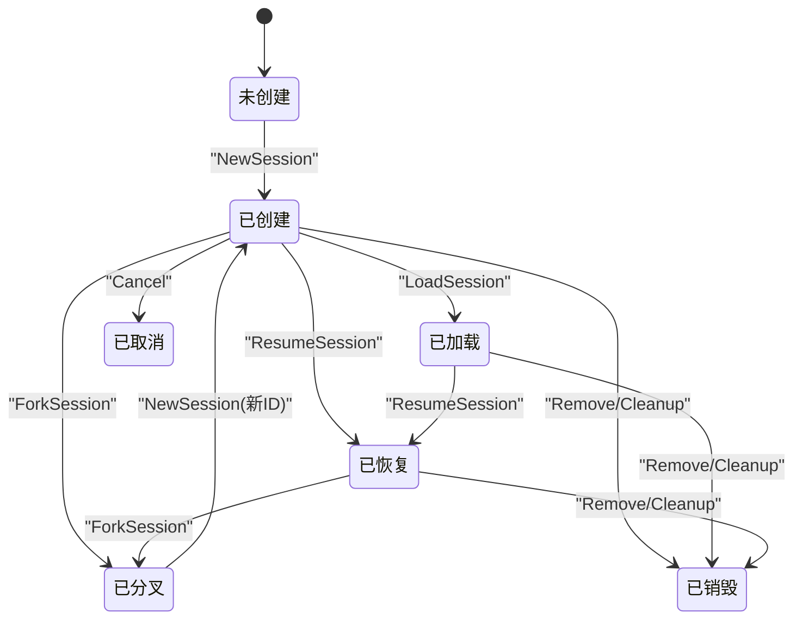

# 核心协议方法

<cite>
**本文引用的文件**
- [acp_adapter/server.py](file://acp_adapter/server.py)
- [acp_adapter/session.py](file://acp_adapter/session.py)
- [acp_adapter/entry.py](file://acp_adapter/entry.py)
- [acp_adapter/auth.py](file://acp_adapter/auth.py)
- [acp_adapter/events.py](file://acp_adapter/events.py)
- [acp_adapter/permissions.py](file://acp_adapter/permissions.py)
- [acp_adapter/tools.py](file://acp_adapter/tools.py)
- [acp_registry/agent.json](file://acp_registry/agent.json)
- [website/docs/developer-guide/acp-internals.md](file://website/docs/developer-guide/acp-internals.md)
- [website/docs/user-guide/features/acp.md](file://website/docs/user-guide/features/acp.md)
- [tests/acp/test_server.py](file://tests/acp/test_server.py)
- [tests/acp/test_session.py](file://tests/acp/test_session.py)
</cite>

## 目录
1. [简介](#简介)
2. [项目结构](#项目结构)
3. [核心组件](#核心组件)
4. [架构总览](#架构总览)
5. [详细组件分析](#详细组件分析)
6. [依赖分析](#依赖分析)
7. [性能考虑](#性能考虑)
8. [故障排查指南](#故障排查指南)
9. [结论](#结论)
10. [附录](#附录)

## 简介
本文件面向ACPI（Agent Client Protocol）协议在本仓库中的实现，系统性梳理并规范以下核心方法的技术规范：Initialize、Authenticate、NewSession、LoadSession、ResumeSession、Cancel、ForkSession、ListSessions、Prompt、SetSessionModel、SetSessionMode、SetConfigOption。内容覆盖参数说明、返回值格式、错误码与异常处理机制、方法间依赖与前置条件、典型使用场景、时序图与状态转换图，并提供可追溯的源码路径与最佳实践建议。

## 项目结构
ACPI适配层由入口、服务端、会话管理、事件桥接、权限桥接、工具映射与认证辅助等模块组成；会话持久化通过共享数据库完成，确保进程重启后会话可恢复。

图表来源
- [acp_adapter/entry.py:58-86](file://acp_adapter/entry.py#L58-L86)
- [acp_adapter/server.py:92-141](file://acp_adapter/server.py#L92-L141)
- [acp_adapter/session.py:70-112](file://acp_adapter/session.py#L70-L112)
- [acp_adapter/auth.py:8-25](file://acp_adapter/auth.py#L8-L25)
- [acp_adapter/events.py:27-176](file://acp_adapter/events.py#L27-L176)
- [acp_adapter/permissions.py:26-78](file://acp_adapter/permissions.py#L26-L78)
- [acp_adapter/tools.py:16-215](file://acp_adapter/tools.py#L16-L215)
- [acp_registry/agent.json:1-13](file://acp_registry/agent.json#L1-L13)

章节来源
- [acp_adapter/entry.py:16-86](file://acp_adapter/entry.py#L16-L86)
- [acp_adapter/server.py:92-141](file://acp_adapter/server.py#L92-L141)
- [acp_adapter/session.py:70-112](file://acp_adapter/session.py#L70-L112)
- [acp_adapter/auth.py:8-25](file://acp_adapter/auth.py#L8-L25)
- [acp_adapter/events.py:27-176](file://acp_adapter/events.py#L27-L176)
- [acp_adapter/permissions.py:26-78](file://acp_adapter/permissions.py#L26-L78)
- [acp_adapter/tools.py:16-215](file://acp_adapter/tools.py#L16-L215)
- [acp_registry/agent.json:1-13](file://acp_registry/agent.json#L1-L13)

## 核心组件
- 初始化与认证
  - Initialize：返回协议版本、代理信息与能力声明；根据当前运行时提供可用认证方法。
  - Authenticate：若已配置运行时凭证则返回认证成功。
- 会话生命周期
  - NewSession：创建新会话并绑定工作目录。
  - LoadSession：加载已有会话（按会话ID与工作目录），不存在时返回空响应。
  - ResumeSession：恢复会话，不存在则新建。
  - ForkSession：深拷贝历史到新会话，保留对话上下文。
  - ListSessions：列出内存与数据库中的会话摘要。
  - Cancel：设置取消事件并尝试中断底层智能体。
- 对话执行
  - Prompt：提取文本内容，拦截斜杠命令，否则交由智能体执行；支持工具进度、思考流式输出、最终消息推送与用量统计。
- 会话配置
  - SetSessionModel：切换会话模型（需启用非稳定协议路由）。
  - SetSessionMode：持久化编辑器请求的模式标识。
  - SetConfigOption：接受任意配置项更新，暂存于会话状态。

章节来源
- [acp_adapter/server.py:216-260](file://acp_adapter/server.py#L216-L260)
- [acp_adapter/server.py:263-305](file://acp_adapter/server.py#L263-L305)
- [acp_adapter/server.py:318-345](file://acp_adapter/server.py#L318-L345)
- [acp_adapter/server.py:349-466](file://acp_adapter/server.py#L349-L466)
- [acp_adapter/server.py:673-727](file://acp_adapter/server.py#L673-L727)

## 架构总览
下图展示ACPI适配器的关键交互：入口负责启动与环境加载，服务端实现协议方法并与会话管理器协作，事件与权限桥接将同步智能体回调转为异步通知，工具映射负责UI呈现。

图表来源
- [acp_adapter/server.py:216-260](file://acp_adapter/server.py#L216-L260)
- [acp_adapter/server.py:263-305](file://acp_adapter/server.py#L263-L305)
- [acp_adapter/server.py:318-345](file://acp_adapter/server.py#L318-L345)
- [acp_adapter/server.py:349-466](file://acp_adapter/server.py#L349-L466)
- [acp_adapter/server.py:673-727](file://acp_adapter/server.py#L673-L727)

## 详细组件分析

### Initialize 方法
- 功能：初始化连接，声明协议版本、代理信息与能力；若存在运行时凭证，则提供认证方法列表。
- 参数
  - protocol_version: 可选，客户端声明的协议版本
  - client_capabilities: 可选，客户端能力
  - client_info: 可选，客户端实现信息
- 返回
  - InitializeResponse：包含 protocol_version、agent_info、agent_capabilities、auth_methods
- 前置条件
  - 运行时环境已加载（入口负责）
  - 可解析到当前运行时凭证（用于生成认证方法）
- 异常与错误
  - 无显式抛出；失败通常通过日志记录
- 典型场景
  - 编辑器首次连接，协商协议版本与能力
- 最佳实践
  - 保持 agent_info 的版本号与实际一致
  - 条件性提供认证方法，避免无凭证时暴露无效选项

章节来源
- [acp_adapter/server.py:216-254](file://acp_adapter/server.py#L216-L254)
- [acp_adapter/auth.py:8-25](file://acp_adapter/auth.py#L8-L25)
- [acp_adapter/entry.py:43-56](file://acp_adapter/entry.py#L43-L56)

### Authenticate 方法
- 功能：基于当前运行时凭证判断是否允许认证。
- 参数
  - method_id: 认证方法标识（来自 Initialize 提供的候选）
- 返回
  - AuthenticateResponse | None：有凭证则成功，否则返回空
- 前置条件
  - Initialize 已被调用且返回了可用认证方法
- 异常与错误
  - 无显式抛出；失败返回空响应
- 典型场景
  - 编辑器发起认证，若已配置凭证则通过
- 最佳实践
  - 仅在 detect_provider 成功时提供认证方法

章节来源
- [acp_adapter/server.py:256-259](file://acp_adapter/server.py#L256-L259)
- [acp_adapter/auth.py:8-25](file://acp_adapter/auth.py#L8-L25)

### NewSession 方法
- 功能：创建新会话，绑定工作目录，注册会话级 MCP 服务器，调度可用命令更新。
- 参数
  - cwd: 工作目录
  - mcp_servers: 可选，MCP 服务器配置列表
- 返回
  - NewSessionResponse(session_id)
- 前置条件
  - SessionManager 可用
- 异常与错误
  - 无显式抛出；失败通过日志记录
- 典型场景
  - 新建对话窗口或打开新工程根目录
- 最佳实践
  - 在创建后立即注册 MCP 服务器，确保工具面完整
  - 将 cwd 注册到任务环境覆盖，保证文件/终端工具相对工作区执行

章节来源
- [acp_adapter/server.py:263-273](file://acp_adapter/server.py#L263-L273)
- [acp_adapter/session.py:94-112](file://acp_adapter/session.py#L94-L112)
- [acp_adapter/server.py:149-213](file://acp_adapter/server.py#L149-L213)

### LoadSession 方法
- 功能：加载已有会话（按 session_id 与 cwd），不存在时返回空响应。
- 参数
  - cwd: 工作目录
  - session_id: 会话标识
  - mcp_servers: 可选，MCP 服务器配置列表
- 返回
  - LoadSessionResponse | None：存在则返回响应，不存在返回空
- 前置条件
  - SessionManager 可用
- 异常与错误
  - 未找到会话时记录警告并返回空
- 典型场景
  - 编辑器重连或切换工作区
- 最佳实践
  - 加载后同样注册 MCP 并更新可用命令

章节来源
- [acp_adapter/server.py:275-289](file://acp_adapter/server.py#L275-L289)
- [acp_adapter/session.py:208-216](file://acp_adapter/session.py#L208-L216)

### ResumeSession 方法
- 功能：恢复会话；若不存在则新建。
- 参数
  - cwd: 工作目录
  - session_id: 会话标识
  - mcp_servers: 可选，MCP 服务器配置列表
- 返回
  - ResumeSessionResponse
- 前置条件
  - SessionManager 可用
- 异常与错误
  - 未找到会话时记录警告并新建
- 典型场景
  - 编辑器长时间闲置后恢复
- 最佳实践
  - 恢复后注册 MCP 并更新可用命令

章节来源
- [acp_adapter/server.py:291-305](file://acp_adapter/server.py#L291-L305)
- [acp_adapter/session.py:208-216](file://acp_adapter/session.py#L208-L216)

### ForkSession 方法
- 功能：深拷贝历史到新会话，保留对话上下文，分配新的 session_id 与 cwd。
- 参数
  - cwd: 新会话工作目录
  - session_id: 源会话标识
  - mcp_servers: 可选，MCP 服务器配置列表
- 返回
  - ForkSessionResponse(session_id)
- 前置条件
  - 源会话存在
- 异常与错误
  - 源会话不存在返回空响应
- 典型场景
  - 需要并行探索不同分支或复制上下文
- 最佳实践
  - 复制后及时注册 MCP 并更新可用命令

章节来源
- [acp_adapter/server.py:318-332](file://acp_adapter/server.py#L318-L332)
- [acp_adapter/session.py:136-163](file://acp_adapter/session.py#L136-L163)

### ListSessions 方法
- 功能：列出当前内存与数据库中的会话摘要（session_id、cwd、model、历史长度）。
- 参数
  - cursor: 可选，游标（当前实现未使用）
  - cwd: 可选，过滤条件（当前实现未使用）
- 返回
  - ListSessionsResponse(sessions)
- 前置条件
  - SessionManager 可用
- 异常与错误
  - 数据库查询失败时记录调试日志
- 典型场景
  - 编辑器侧显示会话列表
- 最佳实践
  - 列表合并内存与数据库结果，避免遗漏

章节来源
- [acp_adapter/server.py:334-345](file://acp_adapter/server.py#L334-L345)
- [acp_adapter/session.py:165-206](file://acp_adapter/session.py#L165-L206)

### Prompt 方法
- 功能：执行用户提示词，拦截斜杠命令，否则交由智能体运行；推送工具进度、思考与最终消息；保存历史；返回停止原因与用量。
- 参数
  - prompt: 内容块列表（文本/图片/音频/资源等）
  - session_id: 会话标识
- 返回
  - PromptResponse(stop_reason, usage?)
- 前置条件
  - 会话存在
- 异常与错误
  - 未知会话：返回拒绝
  - 空消息：返回结束
  - 执行异常：记录异常并返回结束
- 典型场景
  - 用户输入消息或斜杠命令
- 最佳实践
  - 使用线程池执行同步智能体，避免阻塞事件循环
  - 安装审批回调，将危险命令回流至编辑器审批
  - 将最终响应作为消息块推送

章节来源
- [acp_adapter/server.py:349-466](file://acp_adapter/server.py#L349-L466)
- [acp_adapter/events.py:47-176](file://acp_adapter/events.py#L47-L176)
- [acp_adapter/permissions.py:26-78](file://acp_adapter/permissions.py#L26-L78)

### Cancel 方法
- 功能：设置会话取消事件并尝试中断底层智能体。
- 参数
  - session_id: 会话标识
- 返回
  - None
- 前置条件
  - 会话存在
- 异常与错误
  - 不存在会话不抛错，静默返回
- 典型场景
  - 用户取消长耗时操作
- 最佳实践
  - Prompt 结果中根据取消事件设置停止原因为“取消”

章节来源
- [acp_adapter/server.py:307-317](file://acp_adapter/server.py#L307-L317)

### SetSessionModel 方法
- 功能：切换会话模型（启用非稳定协议路由时）。
- 参数
  - model_id: 目标模型标识
  - session_id: 会话标识
- 返回
  - SetSessionModelResponse | None：存在会话则返回响应，否则返回空
- 前置条件
  - 启用非稳定协议路由（测试用例演示）
- 异常与错误
  - 不存在会话记录警告并返回空
- 典型场景
  - 编辑器请求切换模型
- 最佳实践
  - 切换后重建智能体并保存会话元数据

章节来源
- [acp_adapter/server.py:673-695](file://acp_adapter/server.py#L673-L695)
- [tests/acp/test_server.py:279-315](file://tests/acp/test_server.py#L279-L315)

### SetSessionMode 方法
- 功能：持久化编辑器请求的模式标识，避免后续模式切换失败。
- 参数
  - mode_id: 模式标识
  - session_id: 会话标识
- 返回
  - SetSessionModeResponse | None：存在会话则返回响应，否则返回空
- 前置条件
  - 会话存在
- 异常与错误
  - 不存在会话记录警告并返回空
- 典型场景
  - 编辑器切换“聊天/写作”等模式
- 最佳实践
  - 保存会话状态，确保重启后仍有效

章节来源
- [acp_adapter/server.py:697-708](file://acp_adapter/server.py#L697-L708)

### SetConfigOption 方法
- 功能：接受任意配置项更新，暂存于会话状态。
- 参数
  - config_id: 配置键
  - session_id: 会话标识
  - value: 配置值
- 返回
  - SetSessionConfigOptionResponse(config_options=[]) | None：存在会话则返回响应，否则返回空
- 前置条件
  - 会话存在
- 异常与错误
  - 不存在会话记录警告并返回空
- 典型场景
  - 编辑器设置自动审批等行为
- 最佳实践
  - 保存会话状态，便于后续读取

章节来源
- [acp_adapter/server.py:710-727](file://acp_adapter/server.py#L710-L727)

## 依赖分析
- 组件耦合
  - HermesACPAgent 依赖 SessionManager 管理会话生命周期
  - 事件桥接与权限桥接依赖 acp.Client 推送通知
  - 工具映射负责将工具调用渲染为 UI 内容
  - 认证依赖运行时解析器
- 外部依赖
  - SessionDB：会话持久化
  - acp.schema：协议数据结构
  - hermes_cli.*：配置与运行时解析

图表来源
- [acp_adapter/server.py:92-141](file://acp_adapter/server.py#L92-L141)
- [acp_adapter/session.py:58-112](file://acp_adapter/session.py#L58-L112)
- [acp_adapter/events.py:47-176](file://acp_adapter/events.py#L47-L176)
- [acp_adapter/permissions.py:26-78](file://acp_adapter/permissions.py#L26-L78)
- [acp_adapter/tools.py:53-215](file://acp_adapter/tools.py#L53-L215)
- [acp_adapter/auth.py:8-25](file://acp_adapter/auth.py#L8-L25)

章节来源
- [acp_adapter/server.py:92-141](file://acp_adapter/server.py#L92-L141)
- [acp_adapter/session.py:58-112](file://acp_adapter/session.py#L58-L112)
- [acp_adapter/events.py:47-176](file://acp_adapter/events.py#L47-L176)
- [acp_adapter/permissions.py:26-78](file://acp_adapter/permissions.py#L26-L78)
- [acp_adapter/tools.py:53-215](file://acp_adapter/tools.py#L53-L215)
- [acp_adapter/auth.py:8-25](file://acp_adapter/auth.py#L8-L25)

## 性能考虑
- 线程池执行：Prompt 使用线程池执行同步智能体，避免阻塞事件循环
- 事件桥接：回调通过 run_coroutine_threadsafe 跨线程推送，注意超时与异常
- 工具结果截断：UI 安全考虑对大结果进行截断
- 会话持久化：批量写入消息与元数据，减少频繁 IO

[本节为通用指导，无需源码引用]

## 故障排查指南
- 启动与日志
  - 入口将日志定向到 stderr，stdout 专用于协议传输；崩溃时记录异常并退出
- 会话缺失
  - Prompt/Cancel/Set* 等方法在会话不存在时记录警告或返回空响应
- 执行异常
  - 智能体执行异常被捕获并记录，返回结束；线程池执行异常同样记录
- 权限请求
  - 审批桥接默认超时或失败即拒绝，确保安全

章节来源
- [acp_adapter/entry.py:23-56](file://acp_adapter/entry.py#L23-L56)
- [acp_adapter/server.py:363-365](file://acp_adapter/server.py#L363-L365)
- [acp_adapter/server.py:426-441](file://acp_adapter/server.py#L426-L441)
- [acp_adapter/permissions.py:62-76](file://acp_adapter/permissions.py#L62-L76)

## 结论
本实现严格遵循 ACPI 协议方法语义，结合会话持久化与事件/权限桥接，提供了从初始化、认证到会话生命周期管理、对话执行与配置更新的完整能力。通过线程池与跨线程通知机制保障交互流畅，配合严格的错误处理与日志记录提升可观测性。建议在生产环境中启用稳定的 MCP 注册与工具面刷新流程，并持续完善会话元数据与用量统计。

[本节为总结，无需源码引用]

## 附录

### 方法调用时序图（Prompt 流程细化）

图表来源
- [acp_adapter/server.py:349-466](file://acp_adapter/server.py#L349-L466)

### 状态转换图（会话生命周期）

图表来源
- [acp_adapter/server.py:263-305](file://acp_adapter/server.py#L263-L305)
- [acp_adapter/server.py:318-332](file://acp_adapter/server.py#L318-L332)
- [acp_adapter/session.py:127-134](file://acp_adapter/session.py#L127-L134)

### 典型使用场景与最佳实践
- 场景一：新建工程对话
  - 步骤：NewSession -> 注册 MCP -> 发送 Prompt -> 观察工具与消息流
  - 最佳实践：确保 cwd 正确绑定，MCP 注册后刷新工具面
- 场景二：恢复会话
  - 步骤：ResumeSession -> 若不存在则新建 -> 注册 MCP -> 继续对话
  - 最佳实践：恢复后检查历史完整性
- 场景三：切换模型
  - 步骤：SetSessionModel -> 重建智能体 -> 保存会话
  - 最佳实践：切换后验证 provider/base_url/api_mode
- 场景四：自动审批
  - 步骤：Prompt 中触发危险命令 -> 审批桥接 -> 编辑器弹窗 -> 回传结果
  - 最佳实践：超时与失败统一拒绝，避免误操作

章节来源
- [acp_adapter/server.py:149-213](file://acp_adapter/server.py#L149-L213)
- [acp_adapter/server.py:673-695](file://acp_adapter/server.py#L673-L695)
- [acp_adapter/permissions.py:26-78](file://acp_adapter/permissions.py#L26-L78)