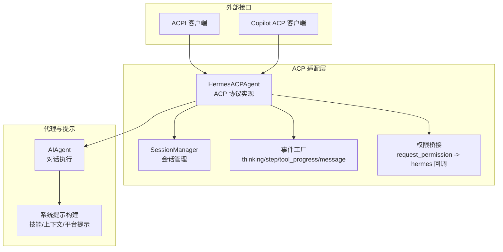
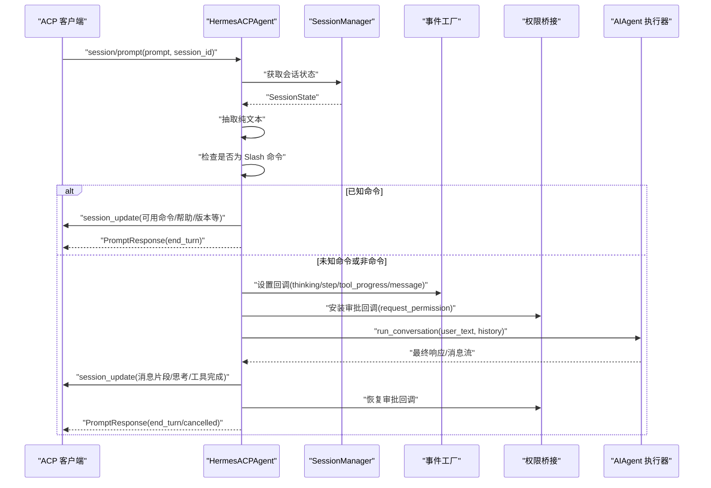
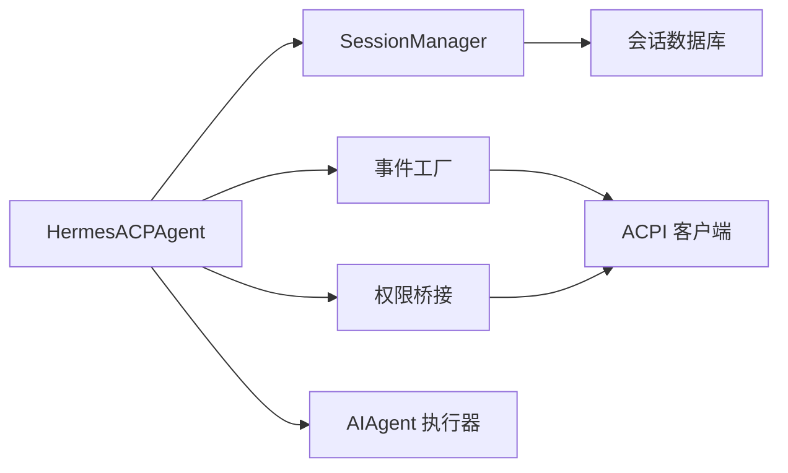
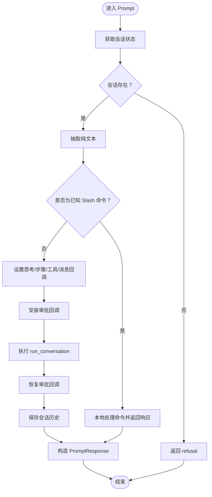

# 核心提示方法

<cite>
**本文档引用的文件**
- [acp_adapter/server.py](file://acp_adapter/server.py)
- [acp_adapter/events.py](file://acp_adapter/events.py)
- [acp_adapter/permissions.py](file://acp_adapter/permissions.py)
- [acp_adapter/session.py](file://acp_adapter/session.py)
- [agent/copilot_acp_client.py](file://agent/copilot_acp_client.py)
- [agent/prompt_builder.py](file://agent/prompt_builder.py)
- [tests/acp/test_server.py](file://tests/acp/test_server.py)
- [website/docs/developer-guide/acp-internals.md](file://website/docs/developer-guide/acp-internals.md)
</cite>

## 目录
1. [简介](#简介)
2. [项目结构](#项目结构)
3. [核心组件](#核心组件)
4. [架构总览](#架构总览)
5. [详细组件分析](#详细组件分析)
6. [依赖关系分析](#依赖关系分析)
7. [性能考量](#性能考量)
8. [故障排查指南](#故障排查指南)
9. [结论](#结论)
10. [附录](#附录)

## 简介
本技术规范围绕 ACPI（Agent Communication Protocol）适配器中的“提示方法”Prompt进行系统化梳理，覆盖以下关键能力：
- 多模态内容块处理：支持文本、图像、音频、资源等 ACP 内容块的解析与提取
- 用户文本提取：从多模态输入中抽取纯文本作为模型输入
- Slash 命令拦截：在进入大模型推理前拦截已知命令并本地处理
- 代理回调设置：将代理运行过程中的思考、步骤、工具进度与消息流式回传至客户端
- 与代理回调系统的集成：通过权限请求桥接、事件回调工厂与会话管理协同工作
- 返回值格式与错误处理：统一的响应结构、停止原因与使用量统计

本规范面向开发者与平台集成者，帮助准确理解 Prompt 方法的行为边界、参数约定、事件流与最佳实践。

## 项目结构
与 ACPI 提示方法直接相关的模块分布如下：
- 适配层核心：HermesACPAgent（ACP 协议实现）、SessionManager（会话生命周期）
- 事件桥接：事件工厂（思考、步骤、工具进度、消息流）、权限桥接
- 提示构建：系统提示组装（技能索引、上下文文件、平台提示）
- 客户端兼容：Copilot ACP 客户端（用于测试与兼容性）

图表来源
- [acp_adapter/server.py:92-727](file://acp_adapter/server.py#L92-L727)
- [acp_adapter/events.py:1-176](file://acp_adapter/events.py#L1-L176)
- [acp_adapter/permissions.py:1-78](file://acp_adapter/permissions.py#L1-L78)
- [acp_adapter/session.py:70-476](file://acp_adapter/session.py#L70-L476)
- [agent/copilot_acp_client.py:256-571](file://agent/copilot_acp_client.py#L256-L571)
- [agent/prompt_builder.py:1-960](file://agent/prompt_builder.py#L1-L960)

章节来源
- [acp_adapter/server.py:92-727](file://acp_adapter/server.py#L92-L727)
- [acp_adapter/events.py:1-176](file://acp_adapter/events.py#L1-L176)
- [acp_adapter/permissions.py:1-78](file://acp_adapter/permissions.py#L1-L78)
- [acp_adapter/session.py:70-476](file://acp_adapter/session.py#L70-L476)
- [agent/copilot_acp_client.py:256-571](file://agent/copilot_acp_client.py#L256-L571)
- [agent/prompt_builder.py:1-960](file://agent/prompt_builder.py#L1-L960)

## 核心组件
- 提示方法（Prompt）：接收多模态内容块列表，抽取纯文本，拦截 Slash 命令，调度代理执行，并通过回调流式回传结果
- 事件工厂：将代理内部事件转换为 ACP 更新帧（思考、步骤、工具开始/完成、消息片段）
- 权限桥接：将危险操作的审批请求转发给客户端，等待用户选择后返回 hermes 回调
- 会话管理：维护会话状态、历史、工作目录与工具集，持久化以支持重启恢复

章节来源
- [acp_adapter/server.py:349-466](file://acp_adapter/server.py#L349-L466)
- [acp_adapter/events.py:47-176](file://acp_adapter/events.py#L47-L176)
- [acp_adapter/permissions.py:26-77](file://acp_adapter/permissions.py#L26-L77)
- [acp_adapter/session.py:70-248](file://acp_adapter/session.py#L70-L248)

## 架构总览
下图展示从 ACPI 客户端到代理执行的端到端流程，包括命令拦截、事件流与权限请求：

图表来源
- [acp_adapter/server.py:349-466](file://acp_adapter/server.py#L349-L466)
- [acp_adapter/events.py:47-176](file://acp_adapter/events.py#L47-L176)
- [acp_adapter/permissions.py:26-77](file://acp_adapter/permissions.py#L26-L77)
- [acp_adapter/session.py:70-248](file://acp_adapter/session.py#L70-L248)

## 详细组件分析

### 提示方法（Prompt）规范
- 输入参数
  - prompt: 多模态内容块数组，支持 TextContentBlock、ImageContentBlock、AudioContentBlock、ResourceContentBlock、EmbeddedResourceContentBlock
  - session_id: 会话标识符
  - 其他协议参数：由 ACP 规范传递，适配器按需处理
- 文本提取策略
  - 仅从 TextContentBlock 或带 text 字段的内容块中抽取文本，拼接为纯文本
  - 非文本内容块当前不参与推理文本提取
- Slash 命令拦截
  - 若用户文本以 “/” 开头，则尝试匹配已知命令（help、model、tools、context、reset、compact、version）
  - 已知命令在本地处理，不调用大模型；未知命令或非命令文本则进入代理执行
- 代理执行与回调
  - 设置思考、步骤、工具进度与消息流回调，将代理输出分片推送至客户端
  - 安装审批回调以处理危险操作的权限请求，执行完毕后恢复原有回调
  - 将最终响应写入会话历史并持久化
- 返回值
  - PromptResponse：包含 stop_reason（end_turn、cancelled、refusal 等）与可选 Usage 统计
- 错误处理
  - 会话不存在：返回 refusal
  - 文本为空：返回 end_turn
  - 执行异常：记录日志并返回包含错误信息的最终响应
  - 权限请求超时：自动拒绝并记录警告

章节来源
- [acp_adapter/server.py:72-89](file://acp_adapter/server.py#L72-L89)
- [acp_adapter/server.py:349-466](file://acp_adapter/server.py#L349-L466)
- [acp_adapter/server.py:514-670](file://acp_adapter/server.py#L514-L670)
- [tests/acp/test_server.py:560-592](file://tests/acp/test_server.py#L560-L592)

### 事件流与回调
- 思考回调（thinking_callback）
  - 将代理的“思考”内容以片段形式推送
- 步骤回调（step_callback）
  - 在工具调用完成后，按顺序完成对应的工具调用 ID，确保重复/并发同名工具也能正确配对
- 工具进度回调（tool_progress_callback）
  - 为每个“started”事件生成唯一工具调用 ID 并推送 ToolCallStart
- 消息回调（message_callback）
  - 流式推送最终消息文本片段
- 事件发送机制
  - 使用 run_coroutine_threadsafe 将更新投递到主事件循环，避免线程安全问题

章节来源
- [acp_adapter/events.py:47-176](file://acp_adapter/events.py#L47-L176)
- [website/docs/developer-guide/acp-internals.md:156-176](file://website/docs/developer-guide/acp-internals.md#L156-L176)

### 权限请求与审批回调
- 权限桥接
  - 将 ACP 的 request_permission 调用映射为 hermes 审批回调，支持“允许一次/允许总是/拒绝”
  - 默认超时 60 秒，超时或失败默认拒绝
- 审批回调安装与恢复
  - 在提示执行期间临时安装审批回调，执行结束后恢复原回调，避免全局污染
- 与代理的协作
  - 当代理触发危险操作时，通过审批回调向客户端发起权限请求，根据用户选择决定执行路径

章节来源
- [acp_adapter/permissions.py:26-77](file://acp_adapter/permissions.py#L26-L77)
- [acp_adapter/server.py:404-436](file://acp_adapter/server.py#L404-L436)
- [website/docs/developer-guide/acp-internals.md:167-176](file://website/docs/developer-guide/acp-internals.md#L167-L176)

### 会话管理与持久化
- 会话创建/加载/恢复/派生（fork）
  - 支持新会话创建、工作目录绑定、会话历史持久化与重启恢复
- 工作目录与工具环境
  - 将会话 ID 与工作目录绑定，确保终端/文件工具在正确的路径下执行
- 历史与元数据
  - 持久化消息与会话元数据（模型、提供商、API 模式等），支持跨进程恢复

章节来源
- [acp_adapter/session.py:94-248](file://acp_adapter/session.py#L94-L248)
- [acp_adapter/session.py:251-405](file://acp_adapter/session.py#L251-L405)

### 系统提示与上下文
- 技能索引与平台提示
  - 动态构建技能清单与平台特定提示，注入系统提示以增强代理能力
- 上下文文件扫描与安全
  - 对上下文文件进行威胁模式检测与不可见字符过滤，防止注入
- 提示构建缓存
  - 使用内存 LRU 与磁盘快照提升冷启动性能

章节来源
- [agent/prompt_builder.py:1-960](file://agent/prompt_builder.py#L1-L960)

### Copilot ACP 客户端兼容
- 消息格式转换
  - 将 OpenAI 风格的消息数组转换为 ACP 友好的提示文本，包含工具规范与模型提示
- 工具调用提取
  - 从文本中识别并提取工具调用块，清理非工具文本
- 进程通信与超时
  - 通过子进程与 JSON-RPC 交互，处理 stdout/stderr 流，支持超时与错误封装

章节来源
- [agent/copilot_acp_client.py:57-154](file://agent/copilot_acp_client.py#L57-L154)
- [agent/copilot_acp_client.py:156-227](file://agent/copilot_acp_client.py#L156-L227)
- [agent/copilot_acp_client.py:344-484](file://agent/copilot_acp_client.py#L344-L484)

## 依赖关系分析
- 组件耦合
  - HermesACPAgent 依赖 SessionManager、事件工厂与权限桥接
  - 事件工厂与权限桥接均依赖 ACP 客户端连接对象
  - 会话管理负责与持久化存储交互
- 外部依赖
  - ACP 协议库（acp.schema）提供类型与消息结构
  - hermes-cli 提供运行时配置与模型解析
  - hermes_state 提供会话数据库访问

图表来源
- [acp_adapter/server.py:92-727](file://acp_adapter/server.py#L92-L727)
- [acp_adapter/events.py:1-176](file://acp_adapter/events.py#L1-L176)
- [acp_adapter/permissions.py:1-78](file://acp_adapter/permissions.py#L1-L78)
- [acp_adapter/session.py:70-476](file://acp_adapter/session.py#L70-L476)

章节来源
- [acp_adapter/server.py:92-727](file://acp_adapter/server.py#L92-L727)
- [acp_adapter/events.py:1-176](file://acp_adapter/events.py#L1-L176)
- [acp_adapter/permissions.py:1-78](file://acp_adapter/permissions.py#L1-L78)
- [acp_adapter/session.py:70-476](file://acp_adapter/session.py#L70-L476)

## 性能考量
- 线程池执行
  - 使用线程池执行同步的 AIAgent.run_conversation，避免阻塞事件循环
- 事件流式推送
  - 通过回调将消息与思考分片推送，降低一次性传输开销
- 缓存与快照
  - 系统提示构建采用 LRU 与磁盘快照，减少重复扫描与解析成本
- 会话持久化
  - 历史与元数据持久化，减少重启后的重建成本

章节来源
- [acp_adapter/server.py:68-69](file://acp_adapter/server.py#L68-L69)
- [agent/prompt_builder.py:339-408](file://agent/prompt_builder.py#L339-L408)
- [acp_adapter/session.py:238-248](file://acp_adapter/session.py#L238-L248)

## 故障排查指南
- 提示无响应或立即结束
  - 检查 prompt 是否包含可识别的文本块；非文本块不会被抽取
  - 确认会话是否存在且有效
- Slash 命令未生效
  - 确认命令是否为已知命令；未知命令会被当作普通消息处理
  - 检查命令广告是否成功下发（available_commands_update）
- 权限请求超时
  - 客户端未及时响应；默认超时 60 秒后自动拒绝
  - 检查 ACP 客户端是否正确实现 request_permission
- 工具调用未完成
  - 确保步骤回调正确完成对应工具调用 ID；重复/并发同名工具通过 FIFO 队列保证配对
- 会话历史丢失
  - 确认会话保存逻辑是否被调用；异常情况下应检查持久化存储可用性

章节来源
- [acp_adapter/server.py:349-466](file://acp_adapter/server.py#L349-L466)
- [acp_adapter/events.py:129-155](file://acp_adapter/events.py#L129-L155)
- [acp_adapter/permissions.py:59-76](file://acp_adapter/permissions.py#L59-L76)
- [tests/acp/test_server.py:560-592](file://tests/acp/test_server.py#L560-L592)

## 结论
ACP 提示方法通过严格的命令拦截、事件流式回传与权限桥接，实现了与客户端的高效协作。其设计兼顾易用性与安全性：既能在本地快速处理常见命令，又能在需要时将复杂任务交由代理执行，并通过回调与权限控制保障可控性。配合会话管理与系统提示构建，整体具备良好的扩展性与稳定性。

## 附录

### 参数与返回值规范
- 输入
  - prompt: 多模态内容块数组
  - session_id: 字符串
- 输出
  - PromptResponse：包含 stop_reason 与可选 Usage

章节来源
- [acp_adapter/server.py:349-466](file://acp_adapter/server.py#L349-L466)

### 事件流图（算法视角）

图表来源
- [acp_adapter/server.py:349-466](file://acp_adapter/server.py#L349-L466)
- [acp_adapter/events.py:47-176](file://acp_adapter/events.py#L47-L176)
- [acp_adapter/permissions.py:26-77](file://acp_adapter/permissions.py#L26-L77)