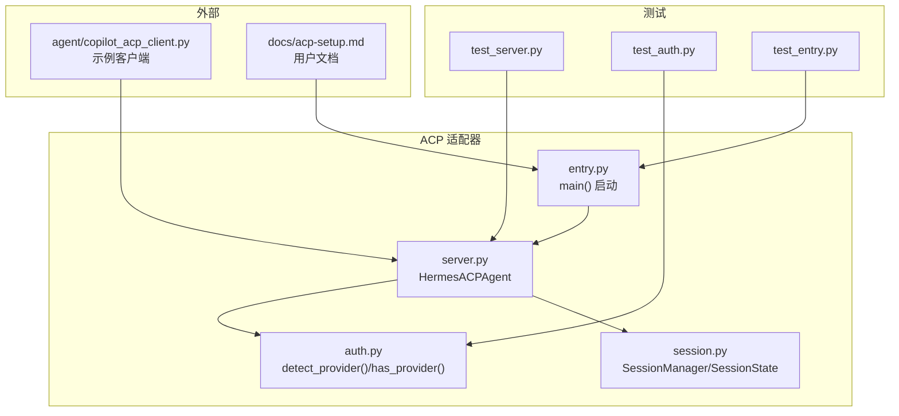
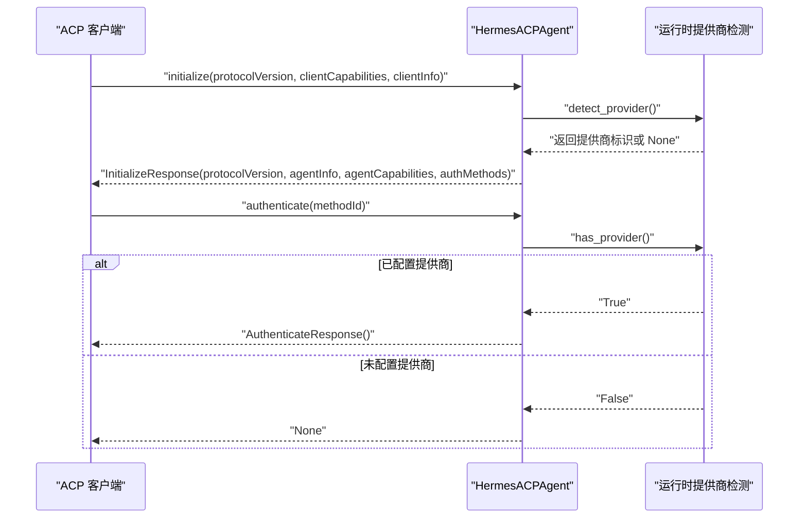
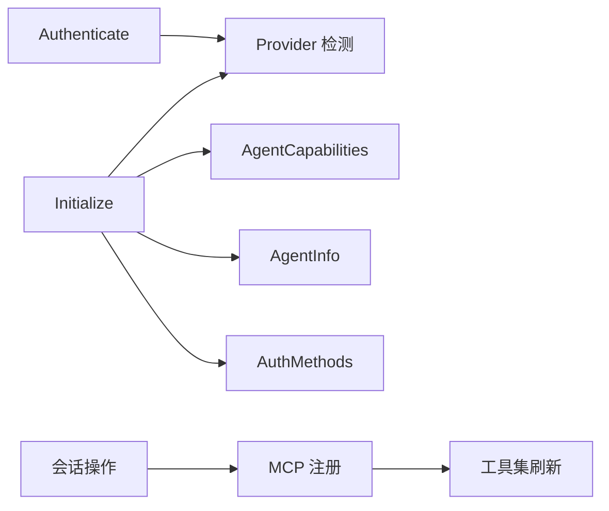

# 连接生命周期方法

<cite>
**本文引用的文件**
- [acp_adapter/server.py](file://acp_adapter/server.py)
- [acp_adapter/auth.py](file://acp_adapter/auth.py)
- [acp_adapter/session.py](file://acp_adapter/session.py)
- [acp_adapter/entry.py](file://acp_adapter/entry.py)
- [tests/acp/test_server.py](file://tests/acp/test_server.py)
- [tests/acp/test_auth.py](file://tests/acp/test_auth.py)
- [tests/acp/test_entry.py](file://tests/acp/test_entry.py)
- [agent/copilot_acp_client.py](file://agent/copilot_acp_client.py)
- [docs/acp-setup.md](file://docs/acp-setup.md)
</cite>

## 目录
1. [简介](#简介)
2. [项目结构](#项目结构)
3. [核心组件](#核心组件)
4. [架构总览](#架构总览)
5. [详细组件分析](#详细组件分析)
6. [依赖分析](#依赖分析)
7. [性能考虑](#性能考虑)
8. [故障排查指南](#故障排查指南)
9. [结论](#结论)
10. [附录](#附录)

## 简介
本技术规范聚焦于 ACPI（Agent Client Protocol）连接生命周期中的两个核心方法：Initialize（初始化）与 Authenticate（认证）。文档将系统性阐述这两个方法的协议版本协商、客户端能力声明、代理信息返回、认证方法提供等关键流程；并给出参数说明、返回值格式、错误码定义与异常处理机制；同时提供连接建立的时序图、状态转换图与典型使用场景，明确前置条件与依赖关系，并提供可参考的代码示例路径与最佳实践。

## 项目结构
围绕 ACPI 生命周期方法的相关代码主要位于以下模块：
- 连接生命周期与会话管理：acp_adapter/server.py
- 认证能力检测：acp_adapter/auth.py
- 会话持久化与状态管理：acp_adapter/session.py
- CLI 启动入口与运行配置：acp_adapter/entry.py
- 单元测试与行为验证：tests/acp/*
- 示例客户端（Copilot ACP 客户端）：agent/copilot_acp_client.py
- 用户文档与安装指引：docs/acp-setup.md

图表来源
- [acp_adapter/server.py](file://acp_adapter/server.py)
- [acp_adapter/auth.py](file://acp_adapter/auth.py)
- [acp_adapter/session.py](file://acp_adapter/session.py)
- [acp_adapter/entry.py](file://acp_adapter/entry.py)
- [tests/acp/test_server.py](file://tests/acp/test_server.py)
- [tests/acp/test_auth.py](file://tests/acp/test_auth.py)
- [tests/acp/test_entry.py](file://tests/acp/test_entry.py)
- [agent/copilot_acp_client.py](file://agent/copilot_acp_client.py)
- [docs/acp-setup.md](file://docs/acp-setup.md)

章节来源
- [acp_adapter/server.py](file://acp_adapter/server.py)
- [acp_adapter/auth.py](file://acp_adapter/auth.py)
- [acp_adapter/session.py](file://acp_adapter/session.py)
- [acp_adapter/entry.py](file://acp_adapter/entry.py)
- [tests/acp/test_server.py](file://tests/acp/test_server.py)
- [tests/acp/test_auth.py](file://tests/acp/test_auth.py)
- [tests/acp/test_entry.py](file://tests/acp/test_entry.py)
- [agent/copilot_acp_client.py](file://agent/copilot_acp_client.py)
- [docs/acp-setup.md](file://docs/acp-setup.md)

## 核心组件
- Initialize 方法：负责协议版本协商、返回代理能力与认证方法列表。
- Authenticate 方法：根据已配置的运行时提供商进行认证授权。
- SessionManager：负责会话创建、恢复、持久化与工具集刷新。
- Provider 检测：从运行时配置中解析可用的认证提供商。

章节来源
- [acp_adapter/server.py](file://acp_adapter/server.py)
- [acp_adapter/auth.py](file://acp_adapter/auth.py)
- [acp_adapter/session.py](file://acp_adapter/session.py)

## 架构总览
下图展示了客户端与 Hermes ACP 适配器之间的连接生命周期交互，重点体现 Initialize 与 Authenticate 的调用顺序与数据流。

图表来源
- [acp_adapter/server.py](file://acp_adapter/server.py)
- [acp_adapter/auth.py](file://acp_adapter/auth.py)

## 详细组件分析

### Initialize 方法规范
- 方法签名与职责
  - 输入参数
    - protocol_version: 可选整数，表示客户端请求的协议版本
    - client_capabilities: 可选对象，描述客户端能力
    - client_info: 可选对象，包含客户端名称、标题、版本等信息
    - kwargs: 其他扩展参数
  - 返回值
    - InitializeResponse 对象，包含：
      - protocol_version: 固定返回当前适配器支持的协议版本
      - agent_info: Implementation 对象，包含代理名称与版本
      - agent_capabilities: AgentCapabilities 对象，包含会话能力（fork/list）
      - auth_methods: 可选的认证方法数组（当检测到有效提供商时返回）

- 协议版本协商
  - 若传入 protocol_version 为整数，则按客户端请求处理；否则使用适配器内置的协议版本常量
  - 返回值始终以适配器支持的协议版本为准

- 客户端能力声明
  - 当检测到运行时提供商可用时，返回一个 AuthMethodAgent 列表，其中包含提供商标识与描述
  - 用于向客户端展示可用的认证方式

- 代理信息返回
  - agent_info.name 固定为 "hermes-agent"
  - agent_info.version 来自运行时版本常量

- 错误与异常
  - 初始化过程中若发生异常，应记录日志并返回标准 InitializeResponse（不抛出异常）
  - 无特定错误码定义，遵循 ACP 规范的通用错误语义

- 前置条件与依赖
  - 需要能够访问运行时提供商检测逻辑
  - 需要具备会话管理能力（在后续会话操作中使用）

- 典型调用路径与示例
  - 参考单元测试对 Initialize 行为的断言
    - [tests/acp/test_server.py](file://tests/acp/test_server.py)
  - 参考示例客户端的初始化请求
    - [agent/copilot_acp_client.py](file://agent/copilot_acp_client.py)

章节来源
- [acp_adapter/server.py](file://acp_adapter/server.py)
- [tests/acp/test_server.py](file://tests/acp/test_server.py)
- [agent/copilot_acp_client.py](file://agent/copilot_acp_client.py)

### Authenticate 方法规范
- 方法签名与职责
  - 输入参数
    - method_id: 字符串，指定使用的认证方法标识（通常为提供商名称）
    - kwargs: 其他扩展参数
  - 返回值
    - AuthenticateResponse 对象：当认证成功时返回
    - None：当未配置任何提供商时返回

- 认证流程
  - 通过 has_provider() 判断是否已配置运行时提供商
  - 若已配置，直接返回 AuthenticateResponse
  - 若未配置，返回 None，表示不支持该认证方法

- 错误与异常
  - 无显式错误码；失败时返回 None
  - 异常情况会被捕获并记录日志，不影响返回值

- 前置条件与依赖
  - 需要运行时提供商已正确配置（API Key、Provider 等）
  - 与 Initialize 返回的 auth_methods 中的 id 对应

- 典型调用路径与示例
  - 参考单元测试对 Authenticate 行为的断言
    - [tests/acp/test_server.py](file://tests/acp/test_server.py)
  - 参考示例客户端的认证请求
    - [agent/copilot_acp_client.py](file://agent/copilot_acp_client.py)

章节来源
- [acp_adapter/server.py](file://acp_adapter/server.py)
- [tests/acp/test_server.py](file://tests/acp/test_server.py)
- [agent/copilot_acp_client.py](file://agent/copilot_acp_client.py)

### 会话管理与工具集刷新
- 会话创建/加载/恢复
  - new_session/load_session/resume_session 会创建或恢复 SessionState，并注册 MCP 服务器
  - 注册后刷新工具集，更新 agent.tools 与 valid_tool_names
- 工具集刷新
  - 通过注册 MCP 服务器后获取工具定义，刷新代理工具表面
  - 失败时记录警告日志但不中断流程

章节来源
- [acp_adapter/server.py](file://acp_adapter/server.py)
- [acp_adapter/session.py](file://acp_adapter/session.py)

### Provider 检测与权限桥接
- Provider 检测
  - detect_provider() 解析运行时提供商与 API Key，返回小写提供商名或 None
  - has_provider() 返回是否存在有效提供商
- 权限桥接
  - 将 ACP 的 request_permission 映射为 Hermes 的审批回调，支持超时与自动拒绝策略

章节来源
- [acp_adapter/auth.py](file://acp_adapter/auth.py)
- [acp_adapter/permissions.py](file://acp_adapter/permissions.py)

## 依赖分析
- 组件耦合
  - HermesACPAgent 依赖 SessionManager 提供会话生命周期管理
  - Initialize/ Authenticate 依赖运行时提供商检测模块
  - 会话操作依赖 MCP 服务器注册与工具集刷新
- 外部依赖
  - ACP 协议库与 schema 类型
  - 运行时提供商解析（hermes_cli.runtime_provider）
  - 日志与异步事件循环

图表来源
- [acp_adapter/server.py](file://acp_adapter/server.py)
- [acp_adapter/auth.py](file://acp_adapter/auth.py)
- [acp_adapter/session.py](file://acp_adapter/session.py)

章节来源
- [acp_adapter/server.py](file://acp_adapter/server.py)
- [acp_adapter/auth.py](file://acp_adapter/auth.py)
- [acp_adapter/session.py](file://acp_adapter/session.py)

## 性能考虑
- Initialize/ Authenticate 为轻量级方法，避免在响应中执行重计算
- 会话工具集刷新在后台线程执行，避免阻塞主事件循环
- 日志输出重定向至 stderr，确保 stdout 仅用于 ACP JSON-RPC 传输

## 故障排查指南
- 初始化失败
  - 检查运行时提供商是否正确配置（API Key、Provider）
  - 查看 stderr 日志定位异常
- 认证失败
  - 确认 Initialize 返回的 auth_methods 是否包含所需方法
  - 使用 has_provider() 验证是否已配置提供商
- 客户端未出现
  - 确认 ACP 客户端扩展/插件已正确安装与配置
  - 检查注册目录与 hermes 命令是否在 PATH 中

章节来源
- [tests/acp/test_server.py](file://tests/acp/test_server.py)
- [tests/acp/test_auth.py](file://tests/acp/test_auth.py)
- [tests/acp/test_entry.py](file://tests/acp/test_entry.py)
- [docs/acp-setup.md](file://docs/acp-setup.md)

## 结论
Initialize 与 Authenticate 是 ACPI 连接生命周期的入口，前者完成协议版本协商与能力/认证方法声明，后者基于运行时提供商完成认证。二者配合会话管理与工具集刷新，构成完整的连接建立与会话启动流程。遵循本文规范可确保客户端与适配器之间的稳定交互与一致的用户体验。

## 附录

### 参数与返回值摘要
- Initialize
  - 输入：protocol_version, client_capabilities, client_info, kwargs
  - 输出：InitializeResponse（protocol_version, agent_info, agent_capabilities, auth_methods）
- Authenticate
  - 输入：method_id, kwargs
  - 输出：AuthenticateResponse 或 None

### 典型使用场景
- 场景一：客户端首次连接
  - 客户端发送 initialize，适配器返回支持的协议版本与认证方法
  - 客户端选择认证方法并调用 authenticate，适配器返回认证结果
- 场景二：客户端重启后恢复连接
  - 客户端调用 resume_session，适配器恢复会话并重新注册 MCP 服务器与工具集

### 最佳实践
- 在 Initialize 中仅返回已配置的认证方法，避免误导客户端
- 在 Authenticate 中保持幂等，避免重复认证
- 将日志输出重定向到 stderr，保证 ACP 传输通道纯净
- 在会话操作中捕获并记录异常，避免中断连接