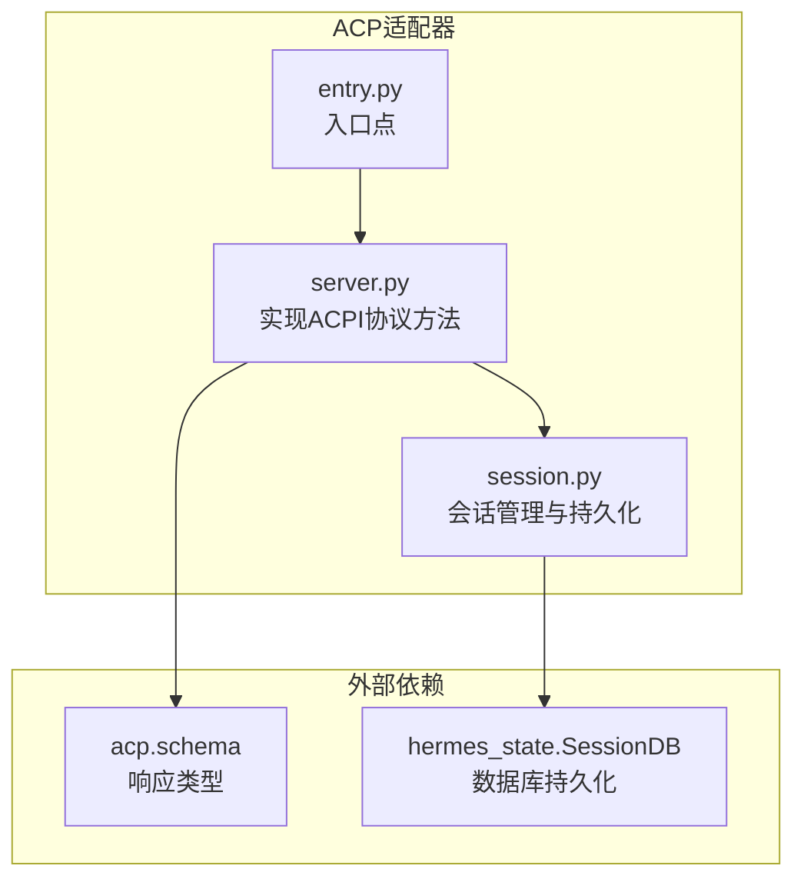
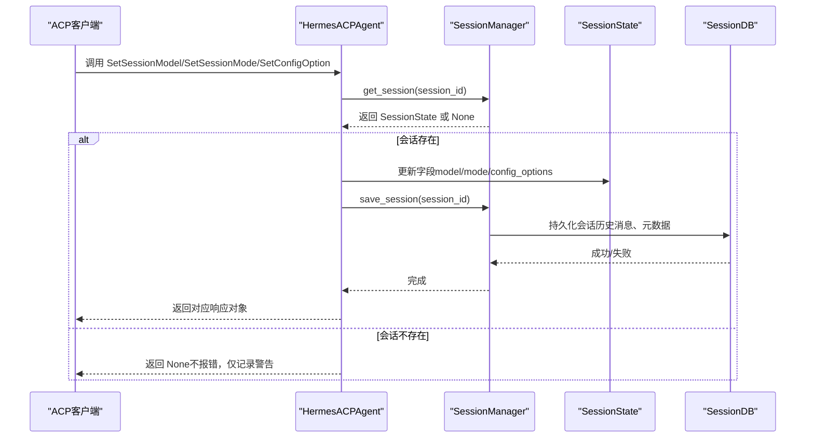
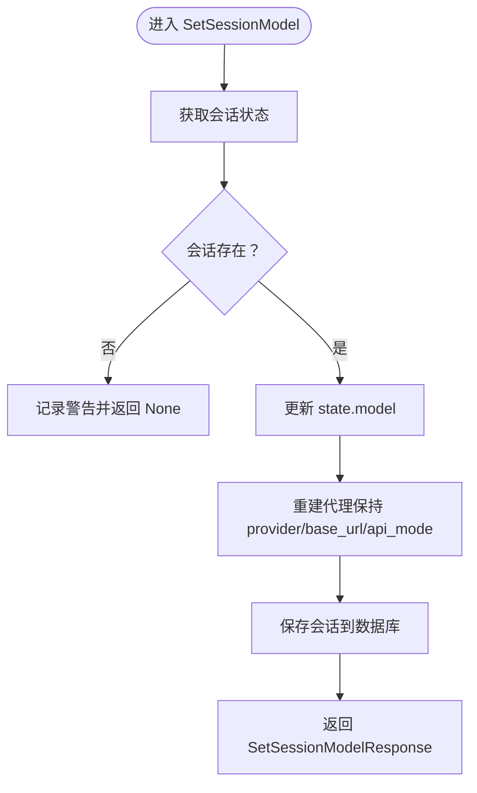
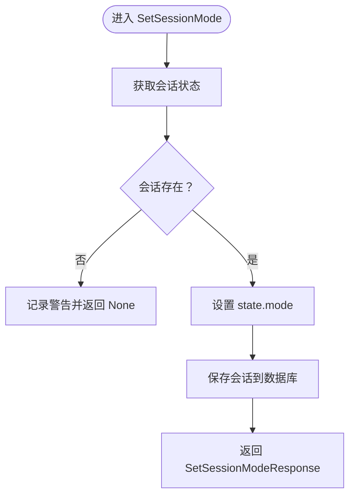
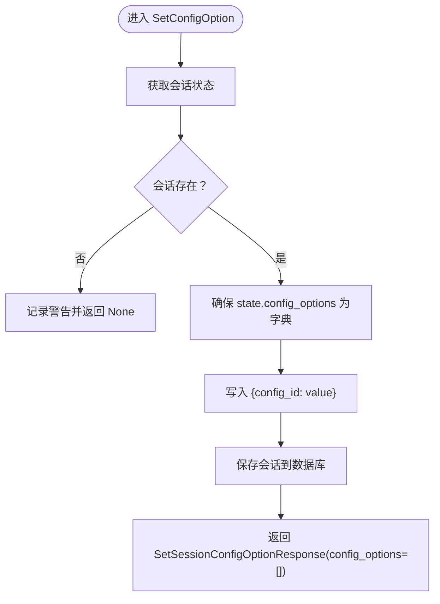
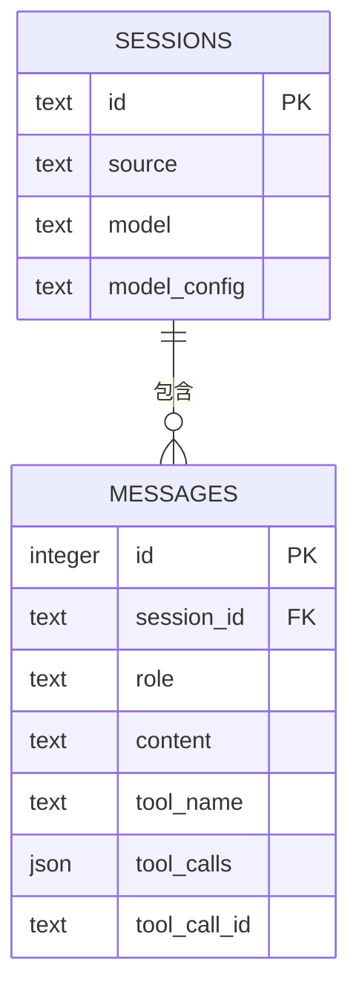
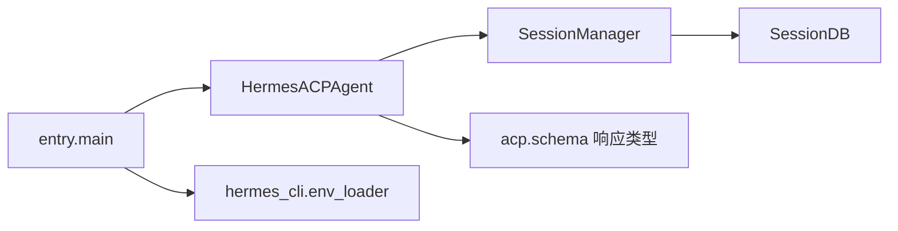

# 配置管理方法

<cite>
**本文档引用的文件**
- [acp_adapter/server.py](file://acp_adapter/server.py)
- [acp_adapter/session.py](file://acp_adapter/session.py)
- [acp_adapter/entry.py](file://acp_adapter/entry.py)
- [docs/acp-setup.md](file://docs/acp-setup.md)
- [tests/acp/test_session.py](file://tests/acp/test_session.py)
</cite>

## 目录
1. [简介](#简介)
2. [项目结构](#项目结构)
3. [核心组件](#核心组件)
4. [架构总览](#架构总览)
5. [详细组件分析](#详细组件分析)
6. [依赖分析](#依赖分析)
7. [性能考虑](#性能考虑)
8. [故障排除指南](#故障排除指南)
9. [结论](#结论)
10. [附录](#附录)

## 简介
本技术规范文档聚焦于ACPI（Agent Client Protocol）协议中的配置管理方法，系统性地定义并说明以下三个关键方法：
- SetSessionModel：切换会话模型
- SetSessionMode：设置会话模式
- SetConfigOption：设置会话配置选项

文档覆盖每个方法的参数说明、返回值格式、错误码与异常处理机制，以及配置更新的时序图、状态转换图、典型使用场景、对会话状态的影响与持久化机制，并提供最佳实践与参考路径。

## 项目结构
与配置管理方法直接相关的模块位于 acp_adapter 包中，核心文件如下：
- server.py：实现ACPI协议方法（含上述三个配置管理方法）
- session.py：会话状态与持久化（SessionManager、SessionState）
- entry.py：ACP适配器入口点（启动日志与环境加载）

图表来源
- [acp_adapter/server.py:12-43](file://acp_adapter/server.py#L12-L43)
- [acp_adapter/session.py:251-332](file://acp_adapter/session.py#L251-L332)
- [acp_adapter/entry.py:58-86](file://acp_adapter/entry.py#L58-L86)

章节来源
- [acp_adapter/server.py:1-727](file://acp_adapter/server.py#L1-L727)
- [acp_adapter/session.py:1-476](file://acp_adapter/session.py#L1-L476)
- [acp_adapter/entry.py:1-86](file://acp_adapter/entry.py#L1-L86)

## 核心组件
- HermesACPAgent：实现ACPI协议的核心类，负责连接生命周期、会话管理、提示处理以及配置管理方法。
- SessionManager：线程安全的会话管理器，负责会话创建、获取、克隆、列表、清理、工作目录更新、持久化与恢复。
- SessionState：会话状态数据结构，包含会话ID、代理实例、工作目录、模型、历史消息、取消事件等字段。

章节来源
- [acp_adapter/server.py:92-141](file://acp_adapter/server.py#L92-L141)
- [acp_adapter/session.py:58-112](file://acp_adapter/session.py#L58-L112)

## 架构总览
下图展示配置管理方法在系统中的调用链与数据流：

图表来源
- [acp_adapter/server.py:673-726](file://acp_adapter/server.py#L673-L726)
- [acp_adapter/session.py:114-125](file://acp_adapter/session.py#L114-L125)
- [acp_adapter/session.py:238-247](file://acp_adapter/session.py#L238-L247)
- [acp_adapter/session.py:273-332](file://acp_adapter/session.py#L273-L332)

## 详细组件分析

### SetSessionModel 方法
- 方法签名与职责
  - 功能：根据会话ID切换会话使用的模型，并重建代理以应用新的模型与运行时参数。
  - 参数：
    - model_id: 字符串，目标模型标识
    - session_id: 字符串，会话标识
    - 其他关键字参数：保留给协议扩展
  - 返回值：SetSessionModelResponse 或 None（当会话不存在时）
- 处理流程
  - 获取会话状态；若不存在则记录警告并返回 None
  - 更新 SessionState.model 并重建代理（保持当前 provider/base_url/api_mode）
  - 保存会话到数据库
  - 记录成功日志并返回响应对象
- 异常与错误处理
  - 会话不存在：返回 None（不抛出异常），记录警告日志
  - 代理重建失败：由上层捕获并返回拒绝或错误响应（见 prompt 方法的错误处理）
- 性能与并发
  - 使用线程池执行同步代理操作（在 prompt 方法中体现），但 SetSessionModel 本身为异步方法，不阻塞事件循环
- 典型使用场景
  - 编辑器通过 ACP 协议请求切换模型，确保后续对话使用新模型
  - 与 set_session_mode 配合，保证编辑器在模式切换时不会因缺失状态而失败

图表来源
- [acp_adapter/server.py:673-695](file://acp_adapter/server.py#L673-L695)
- [acp_adapter/session.py:420-475](file://acp_adapter/session.py#L420-L475)

章节来源
- [acp_adapter/server.py:673-695](file://acp_adapter/server.py#L673-L695)

### SetSessionMode 方法
- 方法签名与职责
  - 功能：持久化编辑器请求的模式（mode），避免编辑器在模式切换时因状态缺失而失败
  - 参数：
    - mode_id: 字符串，目标模式标识
    - session_id: 字符串，会话标识
    - 其他关键字参数：保留给协议扩展
  - 返回值：SetSessionModeResponse 或 None（当会话不存在时）
- 处理流程
  - 获取会话状态；若不存在则记录警告并返回 None
  - 设置 state.mode
  - 保存会话到数据库
  - 记录成功日志并返回响应对象
- 异常与错误处理
  - 会话不存在：返回 None，记录警告日志
- 典型使用场景
  - 编辑器在不同工作模式间切换（如“写作”、“调试”、“代码审查”等），需要会话状态记住该模式以便后续恢复

图表来源
- [acp_adapter/server.py:697-708](file://acp_adapter/server.py#L697-L708)
- [acp_adapter/session.py:238-247](file://acp_adapter/session.py#L238-L247)

章节来源
- [acp_adapter/server.py:697-708](file://acp_adapter/server.py#L697-L708)

### SetConfigOption 方法
- 方法签名与职责
  - 功能：接受 ACP 配置选项更新，即使 Hermes 当前尚未暴露强类型的 ACP 配置表面
  - 参数：
    - config_id: 字符串，配置项键名
    - session_id: 字符串，会话标识
    - value: 字符串，配置值
    - 其他关键字参数：保留给协议扩展
  - 返回值：SetSessionConfigOptionResponse（config_options 为空数组）或 None（当会话不存在时）
- 处理流程
  - 获取会话状态；若不存在则记录警告并返回 None
  - 从 state.config_options 取出字典，若非字典则初始化为空字典
  - 将 {config_id: value} 写入字典
  - 设置 state.config_options 并保存会话到数据库
  - 记录成功日志并返回空数组的响应对象
- 异常与错误处理
  - 会话不存在：返回 None，记录警告日志
  - config_options 不是字典：自动重置为空字典，继续写入
- 典型使用场景
  - 编辑器传递临时配置（如“启用自动补全”、“显示行号”等），Hermes 以字符串形式暂存并在后续逻辑中读取

图表来源
- [acp_adapter/server.py:710-726](file://acp_adapter/server.py#L710-L726)
- [acp_adapter/session.py:238-247](file://acp_adapter/session.py#L238-L247)

章节来源
- [acp_adapter/server.py:710-726](file://acp_adapter/server.py#L710-L726)

### 会话状态与持久化
- SessionState 字段
  - session_id: 会话唯一标识
  - agent: 代理实例
  - cwd: 工作目录
  - model: 当前模型标识
  - history: 对话历史消息列表
  - cancel_event: 取消事件
  - mode: 会话模式（由 set_session_mode 写入）
  - config_options: 配置选项字典（由 set_config_option 写入）
- 持久化机制
  - save_session：将内存中的会话状态写入 SessionDB，替换历史消息并更新元数据（cwd、provider、base_url、api_mode）
  - _restore：从数据库恢复会话，重建代理并恢复历史消息
  - _delete_persisted：删除数据库中的会话记录
- 数据库存储内容
  - sessions 表：id、source（固定为 "acp"）、model、model_config（JSON，包含 cwd、provider、base_url、api_mode）
  - messages 表：按会话存储消息（角色、内容、工具调用等）

图表来源
- [acp_adapter/session.py:273-332](file://acp_adapter/session.py#L273-L332)
- [tests/acp/test_session.py:129-193](file://tests/acp/test_session.py#L129-L193)

章节来源
- [acp_adapter/session.py:58-112](file://acp_adapter/session.py#L58-L112)
- [acp_adapter/session.py:238-332](file://acp_adapter/session.py#L238-L332)
- [tests/acp/test_session.py:129-193](file://tests/acp/test_session.py#L129-L193)

### 错误码与异常处理机制
- 返回值约定
  - 成功：返回对应响应对象（SetSessionModelResponse/SetSessionModeResponse/SetSessionConfigOptionResponse）
  - 会话不存在：返回 None（不抛出异常）
- 日志与可观测性
  - 成功：INFO 级别日志记录会话ID与操作结果
  - 失败（会话不存在）：WARNING 级别日志记录警告
  - 持久化失败：WARNING 级别日志记录失败原因
- 异常传播
  - 代理重建与运行时异常在 prompt 方法中捕获并返回拒绝响应，配置管理方法未显式抛出异常，而是通过返回 None 与日志进行降级处理

章节来源
- [acp_adapter/server.py:673-726](file://acp_adapter/server.py#L673-L726)
- [acp_adapter/session.py:333-405](file://acp_adapter/session.py#L333-L405)

### 典型使用场景
- 切换模型
  - 编辑器通过 SetSessionModel 请求切换模型，Hermes 更新 state.model 并重建代理，随后保存会话，确保后续对话使用新模型
- 设置模式
  - 编辑器通过 SetSessionMode 请求切换模式，Hermes 记录模式并在会话恢复时保持一致
- 配置选项
  - 编辑器通过 SetConfigOption 传递临时配置，Hermes 以字符串形式暂存，供后续逻辑读取

章节来源
- [acp_adapter/server.py:673-726](file://acp_adapter/server.py#L673-L726)
- [docs/acp-setup.md:146-172](file://docs/acp-setup.md#L146-L172)

## 依赖分析
- 组件耦合
  - HermesACPAgent 依赖 SessionManager 进行会话状态管理与持久化
  - SessionManager 依赖 hermes_state.SessionDB 进行数据库访问
  - 响应类型来自 acp.schema（SetSessionModelResponse、SetSessionModeResponse、SetSessionConfigOptionResponse）
- 外部集成点
  - ACP 协议：通过 acp.run_agent 启动，支持不稳定协议标志
  - 环境变量：通过 hermes_cli.env_loader 加载 ~/.hermes/.env
  - 日志：输出到 stderr，stdout 保留用于 ACP JSON-RPC 传输

图表来源
- [acp_adapter/server.py:12-43](file://acp_adapter/server.py#L12-L43)
- [acp_adapter/session.py:251-271](file://acp_adapter/session.py#L251-L271)
- [acp_adapter/entry.py:43-56](file://acp_adapter/entry.py#L43-L56)

章节来源
- [acp_adapter/server.py:1-727](file://acp_adapter/server.py#L1-L727)
- [acp_adapter/session.py:1-476](file://acp_adapter/session.py#L1-L476)
- [acp_adapter/entry.py:1-86](file://acp_adapter/entry.py#L1-L86)

## 性能考虑
- 线程池与异步
  - prompt 方法使用线程池执行同步代理操作，配置管理方法为纯异步，避免阻塞事件循环
- 持久化开销
  - save_session 在模型切换、模式设置、配置更新后调用，涉及数据库写入与消息替换，建议在批量更新时合并操作以减少写入次数
- 并发控制
  - SessionManager 使用锁保护会话字典与数据库访问，确保多线程安全

章节来源
- [acp_adapter/server.py:673-726](file://acp_adapter/server.py#L673-L726)
- [acp_adapter/session.py:87-91](file://acp_adapter/session.py#L87-L91)
- [acp_adapter/session.py:238-247](file://acp_adapter/session.py#L238-L247)

## 故障排除指南
- 会话不存在
  - 现象：调用配置管理方法返回 None
  - 排查：确认 session_id 是否正确；检查会话是否已创建或被清理
  - 参考：日志 WARNING 级别记录“会话不存在”的情况
- 持久化失败
  - 现象：会话状态未写入数据库
  - 排查：检查 SessionDB 初始化与权限；查看 WARNING 级别日志
  - 参考：SessionDB 可用性在 _get_db 中动态检测
- 代理重建失败
  - 现象：模型切换后代理不可用
  - 排查：检查运行时提供商解析与 API 密钥；查看异常日志
  - 参考：prompt 方法中的异常捕获与返回拒绝响应

章节来源
- [acp_adapter/server.py:673-726](file://acp_adapter/server.py#L673-L726)
- [acp_adapter/session.py:251-271](file://acp_adapter/session.py#L251-L271)
- [acp_adapter/session.py:333-405](file://acp_adapter/session.py#L333-L405)

## 结论
本文档对 ACPI 协议中的配置管理方法进行了全面规范，明确了参数、返回值、错误处理与持久化机制。通过 SetSessionModel、SetSessionMode、SetConfigOption 三者协同，Hermes 能够在编辑器驱动的会话中稳定地维护模型、模式与临时配置，确保跨进程重启后的状态一致性。建议在实际集成中遵循本文的最佳实践，关注日志与异常处理，合理安排持久化时机以提升性能与可靠性。

## 附录
- 最佳实践
  - 在调用配置管理方法前先验证 session_id 的有效性
  - 批量更新配置时尽量合并多次调用，减少数据库写入
  - 对于关键配置（如模型），在更新后立即保存会话并记录日志
  - 使用日志级别 DEBUG 观察持久化细节，必要时开启详细日志
- 参考路径
  - 方法实现：[acp_adapter/server.py:673-726](file://acp_adapter/server.py#L673-L726)
  - 会话状态与持久化：[acp_adapter/session.py:58-112](file://acp_adapter/session.py#L58-L112), [acp_adapter/session.py:238-332](file://acp_adapter/session.py#L238-L332)
  - 测试用例（持久化与恢复）：[tests/acp/test_session.py:129-193](file://tests/acp/test_session.py#L129-L193)
  - ACP 设置指南：[docs/acp-setup.md:146-172](file://docs/acp-setup.md#L146-L172)