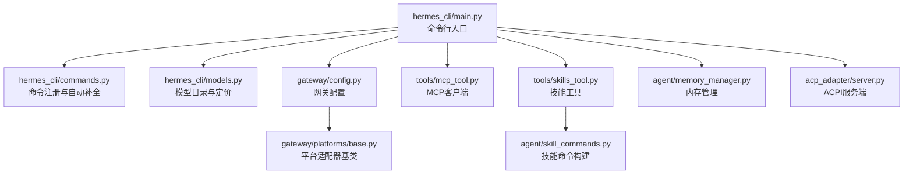
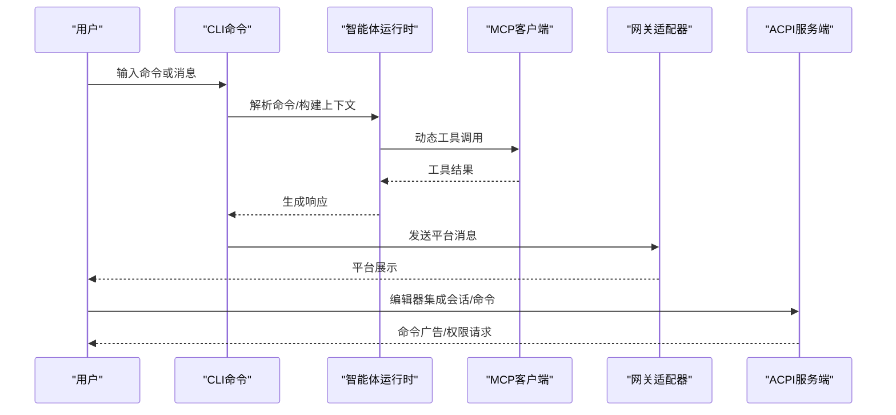
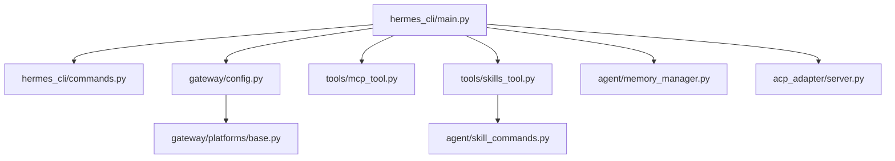

# API参考

<cite>
**本文档引用的文件**
- [hermes_cli/main.py](file://hermes_cli/main.py)
- [hermes_cli/commands.py](file://hermes_cli/commands.py)
- [acp_adapter/server.py](file://acp_adapter/server.py)
- [gateway/platforms/base.py](file://gateway/platforms/base.py)
- [agent/memory_manager.py](file://agent/memory_manager.py)
- [hermes_cli/models.py](file://hermes_cli/models.py)
- [tools/skills_tool.py](file://tools/skills_tool.py)
- [agent/skill_commands.py](file://agent/skill_commands.py)
- [tools/mcp_tool.py](file://tools/mcp_tool.py)
- [gateway/config.py](file://gateway/config.py)
</cite>

## 目录
1. [简介](#简介)
2. [项目结构](#项目结构)
3. [核心组件](#核心组件)
4. [架构总览](#架构总览)
5. [详细组件分析](#详细组件分析)
6. [依赖分析](#依赖分析)
7. [性能考量](#性能考量)
8. [故障排查指南](#故障排查指南)
9. [结论](#结论)
10. [附录](#附录)

## 简介
本文件为 Hermes Agent 的全面 API 参考，覆盖以下方面：
- CLI 命令参考：完整命令、参数、标志与使用示例
- ACPI 协议规范：协议格式、集成步骤与实现要点
- MCP 集成接口：服务器配置、工具发现、安全与采样机制
- 消息网关 API：平台适配器接口规范
- 内存管理 API：多提供者协调与工具路由
- 工具系统 API：技能目录、前置条件与动态加载
- 技能管理 API：命令映射、消息构建与预加载
- HTTP 接口、WebSocket 连接与 IPC 通信规范
- 错误码参考、认证方法、速率限制与版本兼容性

## 项目结构
Hermes Agent 采用模块化分层设计：
- hermes_cli：命令行入口与交互式聊天、网关管理、模型选择等
- acp_adapter：ACPI（Agent Client Protocol）服务端实现
- gateway：消息网关与多平台适配器（Telegram、Discord、WhatsApp 等）
- agent：智能体运行时、内存管理、技能命令解析
- tools：通用工具集，含 MCP 客户端、技能工具、文件与环境工具
- optional-skills、skills：可选与内置技能生态

图表来源
- [hermes_cli/main.py:1-800](file://hermes_cli/main.py#L1-L800)
- [hermes_cli/commands.py:1-800](file://hermes_cli/commands.py#L1-L800)
- [gateway/config.py:1-800](file://gateway/config.py#L1-L800)
- [gateway/platforms/base.py:1-800](file://gateway/platforms/base.py#L1-L800)
- [tools/mcp_tool.py:1-800](file://tools/mcp_tool.py#L1-L800)
- [tools/skills_tool.py:1-800](file://tools/skills_tool.py#L1-L800)
- [agent/skill_commands.py:1-369](file://agent/skill_commands.py#L1-L369)
- [agent/memory_manager.py:1-368](file://agent/memory_manager.py#L1-L368)
- [acp_adapter/server.py:1-727](file://acp_adapter/server.py#L1-L727)

章节来源
- [hermes_cli/main.py:1-800](file://hermes_cli/main.py#L1-L800)
- [gateway/platforms/base.py:1-800](file://gateway/platforms/base.py#L1-L800)

## 核心组件
- CLI 命令系统：集中注册与自动补全，支持会话、配置、工具、技能、定时任务等命令族
- ACPI 服务端：面向编辑器的 Agent 客户端协议实现，支持会话管理、提示、命令广告与权限请求
- 网关平台适配器：统一的消息平台接入接口，负责连接、发送、媒体缓存与错误处理
- MCP 客户端：连接外部 MCP 服务器，动态发现工具，安全过滤凭据，支持采样回调
- 内存管理器：协调内置与外部记忆提供者，统一工具 schema 路由
- 技能系统：技能目录扫描、前置条件检查、动态加载与命令映射

章节来源
- [hermes_cli/commands.py:1-800](file://hermes_cli/commands.py#L1-L800)
- [acp_adapter/server.py:1-727](file://acp_adapter/server.py#L1-L727)
- [gateway/platforms/base.py:1-800](file://gateway/platforms/base.py#L1-L800)
- [tools/mcp_tool.py:1-800](file://tools/mcp_tool.py#L1-L800)
- [agent/memory_manager.py:1-368](file://agent/memory_manager.py#L1-L368)
- [tools/skills_tool.py:1-800](file://tools/skills_tool.py#L1-L800)
- [agent/skill_commands.py:1-369](file://agent/skill_commands.py#L1-L369)

## 架构总览
Hermes Agent 的 API 层通过 CLI、ACPI、网关与工具系统协同工作：
- CLI 提供用户交互与命令解析
- ACPI 服务端面向编辑器，提供会话与命令能力
- 网关适配器统一多平台消息通道，支持 HTTP/WS/IPC
- MCP 客户端扩展工具面，动态发现与调用外部工具
- 内存管理器与技能系统贯穿上下文与工具调用

图表来源
- [hermes_cli/main.py:556-663](file://hermes_cli/main.py#L556-L663)
- [tools/mcp_tool.py:1-800](file://tools/mcp_tool.py#L1-L800)
- [gateway/platforms/base.py:612-632](file://gateway/platforms/base.py#L612-L632)
- [acp_adapter/server.py:348-466](file://acp_adapter/server.py#L348-L466)

## 详细组件分析

### CLI 命令参考
- 命令注册与别名：集中定义在命令注册表中，支持别名与子命令提示
- 自动补全：支持命令、子命令与路径补全
- 网关可用命令：根据配置门控动态暴露命令
- 示例命令族：
  - 会话控制：/new、/resume、/history、/clear、/save、/retry、/undo、/branch、/compress、/rollback、/stop
  - 配置管理：/config、/model、/provider、/prompt、/personality、/statusbar、/verbose、/yolo、/reasoning、/skin、/voice
  - 工具与技能：/tools、/toolsets、/skills、/cron、/reload-mcp、/browser、/plugins
  - 信息与退出：/commands、/help、/usage、/insights、/platforms、/paste、/update、/quit

章节来源
- [hermes_cli/commands.py:1-800](file://hermes_cli/commands.py#L1-L800)
- [hermes_cli/main.py:556-663](file://hermes_cli/main.py#L556-L663)

### ACPI 协议规范
- 协议版本与能力：初始化时声明协议版本与代理能力（会话 fork/list）
- 认证方法：基于当前运行时提供商的认证方式
- 会话管理：新建、加载、恢复、取消、分叉、列出
- 提示流程：提取文本内容块，拦截斜杠命令本地处理，其余交由智能体运行
- 命令广告：向客户端通告可用斜杠命令及其输入提示
- 使用示例（概念性流程）：
  - 客户端初始化并声明能力
  - 服务端返回协议版本与能力
  - 客户端发起新建会话请求
  - 服务端创建会话并注册 MCP 工具
  - 客户端发送提示消息
  - 服务端运行智能体并流式更新状态

章节来源
- [acp_adapter/server.py:216-254](file://acp_adapter/server.py#L216-L254)
- [acp_adapter/server.py:263-306](file://acp_adapter/server.py#L263-L306)
- [acp_adapter/server.py:349-466](file://acp_adapter/server.py#L349-L466)
- [acp_adapter/server.py:485-513](file://acp_adapter/server.py#L485-L513)

### MCP 集成接口
- 配置项：服务器名称、传输类型（stdio/http/streamable-http）、命令/URL、环境变量、超时、采样配置
- 动态工具发现：监听工具列表变更通知，自动刷新工具面
- 安全机制：仅传递安全环境变量；对错误信息中的凭据进行脱敏
- 采样回调：MCP 服务器可请求 LLM 补充消息，支持速率限制、模型白名单与工具循环限制
- 重连策略：指数回退重试，最多固定次数
- 使用示例（概念性流程）：
  - 从配置加载服务器列表
  - 启动每个服务器的长连接任务
  - 列举工具并注册到工具注册表
  - 处理采样请求并调用 LLM 客户端
  - 工具调用完成后清理资源

章节来源
- [tools/mcp_tool.py:1-800](file://tools/mcp_tool.py#L1-L800)
- [tools/mcp_tool.py:716-800](file://tools/mcp_tool.py#L716-L800)

### 消息网关 API 与平台适配器
- 平台适配器基类：统一连接、断开、发送、编辑、打字指示、图片/语音/视频发送等接口
- 消息事件：标准化消息类型、媒体附件、回复上下文、时间戳
- 发送结果：成功/失败、错误码、是否可重试
- 图像/音频/文档缓存：下载并本地缓存以提升稳定性与隐私保护
- 网关配置：平台启用状态、令牌/密钥、主页频道、会话重置策略、快速命令、STT 开关、会话隔离策略、未授权 DM 行为、流式传输设置
- 使用示例（概念性流程）：
  - 加载网关配置
  - 初始化各平台适配器
  - 注册消息处理器
  - 接收消息并解析命令
  - 调用智能体或技能工具
  - 发送响应（支持图片/语音/视频）

章节来源
- [gateway/platforms/base.py:1-800](file://gateway/platforms/base.py#L1-L800)
- [gateway/config.py:1-800](file://gateway/config.py#L1-L800)

### 内存管理 API
- 提供者注册：内置提供者优先，最多允许一个外部提供者
- 系统提示构建：按提供者顺序收集系统提示块
- 预取与同步：跨提供者合并上下文，回合后同步
- 工具路由：按工具名路由到对应提供者，冲突去重
- 生命周期钩子：回合开始、会话结束、压缩前、写入通知、委派完成
- 使用示例（概念性流程）：
  - 注册内置与外部提供者
  - 构建系统提示
  - 预取上下文并注入
  - 执行回合后同步
  - 工具调用路由到对应提供者

章节来源
- [agent/memory_manager.py:1-368](file://agent/memory_manager.py#L1-L368)

### 工具系统 API
- 技能目录：支持分类、描述、平台过滤、前置条件与环境变量要求
- 技能视图：加载主文档与关联文件，支持路径补全与令牌估算
- 前置条件检查：环境变量、命令存在性、平台兼容性
- 环境变量捕获：支持安全输入回调，网关表面提示不支持安全输入
- 使用示例（概念性流程）：
  - 扫描技能目录
  - 解析前端数据与描述
  - 过滤禁用与不兼容技能
  - 加载技能内容与关联文件
  - 检查前置条件并提示缺失

章节来源
- [tools/skills_tool.py:1-800](file://tools/skills_tool.py#L1-L800)

### 技能管理 API
- 技能命令映射：从 SKILL.md 中提取名称与描述，生成 /slug 命令键
- 消息构建：将技能内容、配置注入、支持文件列表与运行时注记组合为消息
- 预加载技能：会话启动时预加载指定技能，支持缺失标识
- 使用示例（概念性流程）：
  - 扫描技能目录并建立命令映射
  - 解析用户指令与技能标识
  - 加载技能内容并构建消息
  - 注入配置与支持文件提示

章节来源
- [agent/skill_commands.py:1-369](file://agent/skill_commands.py#L1-L369)

### HTTP 接口、WebSocket 连接与 IPC 规范
- HTTP 接口：网关平台适配器通过各自平台 API 提供 HTTP/HTTPS 能力（如 Telegram/Slack/Discord 等），具体端点与鉴权由平台决定
- WebSocket 连接：部分平台（如 Matrix）支持 WS，用于实时消息与状态更新
- IPC 通信：MCP stdio 传输通过子进程与标准输入输出进行通信
- 安全与限流：凭据脱敏、环境变量白名单、连接/工具调用超时、重连与速率限制
- 使用示例（概念性流程）：
  - 通过 stdio 启动 MCP 服务器
  - 建立长连接并列举工具
  - 处理工具调用并在超时内返回结果
  - 对 WS 平台进行鉴权与消息订阅

章节来源
- [tools/mcp_tool.py:1-800](file://tools/mcp_tool.py#L1-L800)
- [gateway/platforms/base.py:612-632](file://gateway/platforms/base.py#L612-L632)

## 依赖分析
- 组件耦合与内聚：CLI 与命令系统高内聚；网关适配器通过抽象基类降低平台差异；MCP 客户端与工具系统解耦
- 直接与间接依赖：ACPI 服务端依赖会话管理与工具定义；网关适配器依赖配置与缓存；内存管理器依赖工具注册表
- 循环依赖：未见明显循环依赖
- 外部依赖：MCP SDK（可选）、平台 SDK（Telegram/Discord/Matrix 等）、HTTP 客户端库

图表来源
- [hermes_cli/main.py:1-800](file://hermes_cli/main.py#L1-L800)
- [hermes_cli/commands.py:1-800](file://hermes_cli/commands.py#L1-L800)
- [gateway/config.py:1-800](file://gateway/config.py#L1-L800)
- [tools/mcp_tool.py:1-800](file://tools/mcp_tool.py#L1-L800)
- [tools/skills_tool.py:1-800](file://tools/skills_tool.py#L1-L800)
- [agent/skill_commands.py:1-369](file://agent/skill_commands.py#L1-L369)
- [agent/memory_manager.py:1-368](file://agent/memory_manager.py#L1-L368)
- [acp_adapter/server.py:1-727](file://acp_adapter/server.py#L1-L727)
- [gateway/platforms/base.py:1-800](file://gateway/platforms/base.py#L1-L800)

## 性能考量
- 工具调用超时与重试：MCP 工具调用默认超时与最大重连次数，避免阻塞主线程
- 会话持久化：ACPI 会话历史保存，减少重启后的上下文重建成本
- 缓存策略：图像/音频/文档本地缓存，降低平台 URL 过期风险与带宽消耗
- 流式传输：网关支持渐进式消息编辑与缓冲阈值，平衡实时性与网络负载
- 模型选择与定价：模型目录与定价查询，辅助选择性价比更高的推理后端

## 故障排查指南
- 网关连接失败：检查令牌/密钥是否为空字符串；查看平台状态日志；确认环境变量覆盖
- MCP 工具不可用：确认 MCP SDK 是否安装；检查命令/URL 与环境变量；查看凭据脱敏后的错误信息
- 技能前置条件缺失：在 CLI 中手动输入或在 .env 中添加所需环境变量；网关表面提示不支持安全输入
- ACPI 权限拒绝：确保已配置运行时提供商认证；检查权限请求回调是否正确设置
- 速率限制：MCP 采样回调有速率限制与工具循环限制，超出将返回错误

章节来源
- [gateway/config.py:626-662](file://gateway/config.py#L626-L662)
- [tools/mcp_tool.py:270-328](file://tools/mcp_tool.py#L270-L328)
- [tools/skills_tool.py:275-344](file://tools/skills_tool.py#L275-L344)
- [acp_adapter/server.py:256-259](file://acp_adapter/server.py#L256-L259)

## 结论
本文档提供了 Hermes Agent 的全面 API 参考，涵盖 CLI、ACPI、网关、MCP、内存管理、工具系统与技能管理等核心模块。通过清晰的接口规范、流程图与示例，开发者可以快速集成编辑器、消息平台与外部工具，同时遵循安全与性能最佳实践。

## 附录
- 版本兼容性：ACPI 服务端声明协议版本并向下兼容；MCP SDK 新旧版本通过特性检测保证功能可用性
- 认证方法：支持多种提供商认证（API Key/OAuth/运行时凭据），并提供认证回调与门控
- 错误码参考：发送结果包含错误码与可重试标记；MCP 采样回调返回标准化错误数据