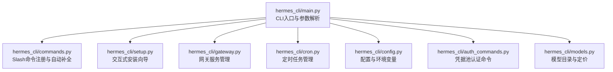
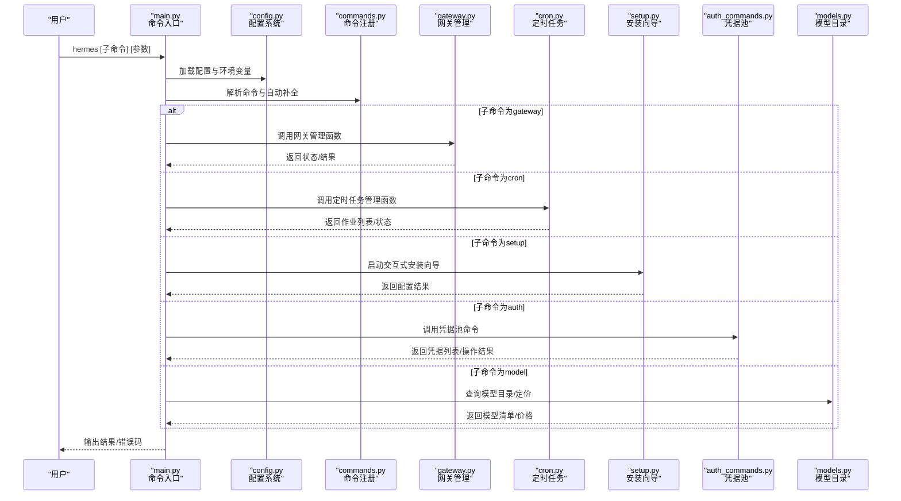
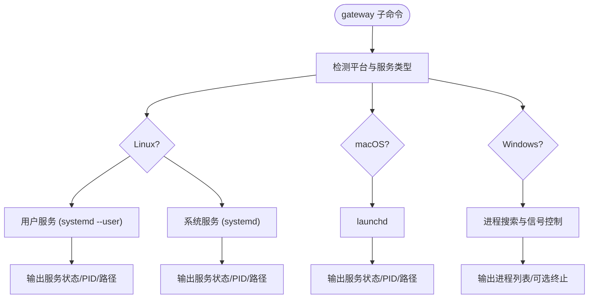
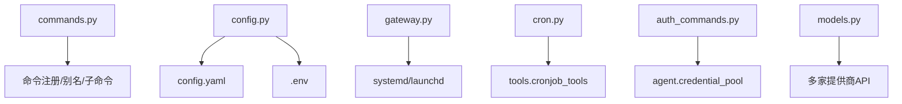

# CLI命令参考

<cite>
**本文档引用的文件**
- [hermes_cli/main.py](file://hermes_cli/main.py)
- [hermes_cli/commands.py](file://hermes_cli/commands.py)
- [hermes_cli/setup.py](file://hermes_cli/setup.py)
- [hermes_cli/gateway.py](file://hermes_cli/gateway.py)
- [hermes_cli/cron.py](file://hermes_cli/cron.py)
- [hermes_cli/config.py](file://hermes_cli/config.py)
- [hermes_cli/auth_commands.py](file://hermes_cli/auth_commands.py)
- [hermes_cli/models.py](file://hermes_cli/models.py)
</cite>

## 目录
1. [简介](#简介)
2. [项目结构](#项目结构)
3. [核心组件](#核心组件)
4. [架构总览](#架构总览)
5. [详细组件分析](#详细组件分析)
6. [依赖分析](#依赖分析)
7. [性能考虑](#性能考虑)
8. [故障排除指南](#故障排除指南)
9. [结论](#结论)
10. [附录](#附录)

## 简介
本参考文档面向Hermes Agent CLI用户与开发者，系统梳理hermes命令及其子命令（含hermes、hermes setup、hermes gateway、hermes cron等）的完整用法，涵盖参数、标志、选项、使用示例、输出格式、错误码与故障排除。同时说明命令行参数解析规则、配置文件优先级与环境变量覆盖机制，并提供常见使用场景的命令组合示例以及交互式TUI的快捷键与键盘导航指南。

## 项目结构
Hermes CLI以模块化方式组织，核心入口在主模块中解析命令与参数，各功能子命令由独立模块实现。主要目录与职责如下：
- hermes_cli/main.py：CLI入口与命令分发、参数预处理（如profile覆盖）、日志初始化、TTY保护等
- hermes_cli/commands.py：Slash命令注册与自动补全、平台映射、帮助文本生成
- hermes_cli/setup.py：交互式安装向导，涵盖模型/提供商选择、终端后端、工具配置等
- hermes_cli/gateway.py：网关服务管理（安装、启动、停止、状态、进程管理）
- hermes_cli/cron.py：定时任务管理（列出、创建、编辑、暂停/恢复、触发、删除、状态检查）
- hermes_cli/config.py：配置文件读写、默认配置、环境变量与配置文件优先级
- hermes_cli/auth_commands.py：凭据池认证命令（添加、列出、移除、重置策略）
- hermes_cli/models.py：模型目录与定价查询、提供商别名与可用性检测

**图表来源**
- [hermes_cli/main.py](file://hermes_cli/main.py)
- [hermes_cli/commands.py](file://hermes_cli/commands.py)
- [hermes_cli/setup.py](file://hermes_cli/setup.py)
- [hermes_cli/gateway.py](file://hermes_cli/gateway.py)
- [hermes_cli/cron.py](file://hermes_cli/cron.py)
- [hermes_cli/config.py](file://hermes_cli/config.py)
- [hermes_cli/auth_commands.py](file://hermes_cli/auth_commands.py)
- [hermes_cli/models.py](file://hermes_cli/models.py)

**章节来源**
- [hermes_cli/main.py](file://hermes_cli/main.py)
- [hermes_cli/commands.py](file://hermes_cli/commands.py)
- [hermes_cli/setup.py](file://hermes_cli/setup.py)
- [hermes_cli/gateway.py](file://hermes_cli/gateway.py)
- [hermes_cli/cron.py](file://hermes_cli/cron.py)
- [hermes_cli/config.py](file://hermes_cli/config.py)
- [hermes_cli/auth_commands.py](file://hermes_cli/auth_commands.py)
- [hermes_cli/models.py](file://hermes_cli/models.py)

## 核心组件
- 命令入口与参数解析：负责解析命令、子命令、全局参数（如--profile），并进行TTY保护与环境加载
- 配置系统：统一管理config.yaml与.env，支持环境变量覆盖与迁移提示
- 安装向导：交互式引导用户完成模型/提供商、终端后端、工具等配置
- 网关服务：跨平台服务安装（systemd/launchd）与进程管理
- 定时任务：基于cron的计划任务生命周期管理
- 凭据池：多提供商凭据的增删改查与轮转策略
- 模型目录：提供模型清单、别名映射、实时定价查询

**章节来源**
- [hermes_cli/main.py](file://hermes_cli/main.py)
- [hermes_cli/config.py](file://hermes_cli/config.py)
- [hermes_cli/setup.py](file://hermes_cli/setup.py)
- [hermes_cli/gateway.py](file://hermes_cli/gateway.py)
- [hermes_cli/cron.py](file://hermes_cli/cron.py)
- [hermes_cli/auth_commands.py](file://hermes_cli/auth_commands.py)
- [hermes_cli/models.py](file://hermes_cli/models.py)

## 架构总览
下图展示CLI命令从入口到执行的关键流程，包括参数解析、配置加载、功能模块调用与输出格式化。

**图表来源**
- [hermes_cli/main.py](file://hermes_cli/main.py)
- [hermes_cli/config.py](file://hermes_cli/config.py)
- [hermes_cli/commands.py](file://hermes_cli/commands.py)
- [hermes_cli/gateway.py](file://hermes_cli/gateway.py)
- [hermes_cli/cron.py](file://hermes_cli/cron.py)
- [hermes_cli/setup.py](file://hermes_cli/setup.py)
- [hermes_cli/auth_commands.py](file://hermes_cli/auth_commands.py)
- [hermes_cli/models.py](file://hermes_cli/models.py)

## 详细组件分析

### hermes 命令
- 默认行为：进入交互式聊天界面
- 关键参数：
  - --continue/-c：继续最近一次CLI会话或指定名称/ID的会话
  - --resume：按名称或ID恢复会话
  - --model/--provider：临时覆盖当前会话使用的模型与提供商
  - --toolsets：指定工具集
  - --skills：附加技能
  - --verbose/--quiet：控制详细程度
  - --query：直接传入初始查询
  - --worktree/--checkpoints/--pass-session-id/--max-turns：运行时行为控制
  - --yolo：跳过危险命令审批
  - --source：为会话打标签（用于过滤）
- 行为说明：
  - 首次运行检测是否已配置任一推理提供商；未配置则提示运行setup
  - 支持从历史会话继续或按名称/ID恢复
  - 支持Yolo模式与会话源标签
- 输出格式：标准CLI输出，错误通过标准错误返回
- 错误码：非零表示失败（具体取决于内部实现）

**章节来源**
- [hermes_cli/main.py](file://hermes_cli/main.py)

### hermes setup 命令
- 功能：交互式安装向导，引导完成以下配置：
  - 模型与提供商选择
  - 终端后端（本地/容器/SSH等）
  - 代理设置（迭代次数、压缩、会话重置等）
  - 消息平台（Telegram、Discord等）连接
  - 工具配置（TTS、网络搜索、图像生成等）
- 使用要点：
  - 支持非交互模式（无TTY时）通过环境变量或配置命令完成
  - 提供工具可用性摘要与缺失项提示
  - 支持自定义提供商与端点
- 示例：hermes setup 或在无TTY环境中使用 hermes config set 设置必要字段后继续

**章节来源**
- [hermes_cli/setup.py](file://hermes_cli/setup.py)

### hermes gateway 命令
- 子命令：
  - start/stop/restart/status：服务管理（systemd/launchd）
  - install/uninstall：安装/卸载服务
  - run：前台运行网关
  - 其他：进程查找、PID文件、替换运行等
- 平台差异：
  - Linux：支持用户服务与系统服务，自动处理linger与PATH
  - macOS：使用launchd
  - Windows：通过进程搜索与信号控制
- 输出格式：状态信息、PID、服务定义路径等
- 错误码：权限不足、服务冲突、无法连接等

**图表来源**
- [hermes_cli/gateway.py](file://hermes_cli/gateway.py)

**章节来源**
- [hermes_cli/gateway.py](file://hermes_cli/gateway.py)

### hermes cron 命令
- 子命令：
  - list：列出所有计划任务（可显示已禁用）
  - status：显示cron执行状态与网关运行情况
  - tick：立即触发到期任务
  - create/add：创建新任务（支持schedule/prompt/name/deliver/repeat/skill/script）
  - edit：编辑现有任务（支持替换/追加/移除技能）
  - pause/resume/run/remove：暂停/恢复/触发/删除任务
- 输出格式：表格化任务信息，包含ID、名称、调度、重复次数、下次运行时间、交付目标、技能列表、脚本等
- 依赖：需要网关运行以自动触发任务

**章节来源**
- [hermes_cli/cron.py](file://hermes_cli/cron.py)

### hermes auth 命令
- 子命令：
  - add：添加凭据（API Key/OAuth）
  - list：列出指定提供商的所有凭据
  - remove：按索引/ID/标签移除凭据
  - reset：重置提供商凭据冷却状态
- 支持提供商：Anthropic、Nous Portal、OpenAI Codex、OpenRouter、自定义端点等
- 交互式：hermes auth 无子命令时进入交互菜单

**章节来源**
- [hermes_cli/auth_commands.py](file://hermes_cli/auth_commands.py)

### hermes config 命令
- 子命令：
  - show：显示当前配置
  - edit：在编辑器中打开配置文件
  - set：设置特定配置值（键路径与值）
  - wizard：重新运行安装向导
- 配置文件位置：~/.hermes/config.yaml（主配置）、~/.hermes/.env（密钥）
- 环境变量覆盖：.env中的键值优先于默认配置，且可被运行时环境变量覆盖

**章节来源**
- [hermes_cli/config.py](file://hermes_cli/config.py)

### hermes model 命令
- 功能：查看/切换模型、提供商与模型定价信息
- 支持：OpenRouter、Nous Portal、GitHub Copilot、Google AI Studio、Z.AI、MiniMax、Kimi、DeepSeek、OpenCode、AI Gateway、Alibaba DashScope、Hugging Face、自定义端点等
- 输出：模型清单、别名映射、实时定价表（按$/Mtok）

**章节来源**
- [hermes_cli/models.py](file://hermes_cli/models.py)

### hermes sessions 命令
- 子命令：
  - browse：交互式浏览与筛选会话（支持搜索与键盘导航）
- 交互式TUI：
  - 支持上下箭头、回车选择、Esc退出、Backspace过滤、字母输入过滤
  - 自适应终端宽度布局
  - Windows降级为数字列表输入

**章节来源**
- [hermes_cli/main.py](file://hermes_cli/main.py)

## 依赖分析
- 命令注册与自动补全：commands.py集中维护Slash命令定义，支持别名、子命令提示、平台映射
- 配置加载：config.py统一读取config.yaml与.env，提供默认配置与迁移提示
- 网关服务：gateway.py封装跨平台服务安装与进程管理，避免直接依赖系统细节
- 定时任务：cron.py基于工具层实现，与网关状态联动
- 凭据池：auth_commands.py与agent.credential_pool协作，支持多种轮转策略
- 模型目录：models.py提供模型清单、别名与定价查询，支持多家提供商

**图表来源**
- [hermes_cli/commands.py](file://hermes_cli/commands.py)
- [hermes_cli/config.py](file://hermes_cli/config.py)
- [hermes_cli/gateway.py](file://hermes_cli/gateway.py)
- [hermes_cli/cron.py](file://hermes_cli/cron.py)
- [hermes_cli/auth_commands.py](file://hermes_cli/auth_commands.py)
- [hermes_cli/models.py](file://hermes_cli/models.py)

**章节来源**
- [hermes_cli/commands.py](file://hermes_cli/commands.py)
- [hermes_cli/config.py](file://hermes_cli/config.py)
- [hermes_cli/gateway.py](file://hermes_cli/gateway.py)
- [hermes_cli/cron.py](file://hermes_cli/cron.py)
- [hermes_cli/auth_commands.py](file://hermes_cli/auth_commands.py)
- [hermes_cli/models.py](file://hermes_cli/models.py)

## 性能考虑
- 配置加载：config.py对默认配置与环境变量进行缓存与安全权限设置，减少IO与权限问题
- 日志：main.py集中初始化文件日志，避免频繁初始化开销
- 网关：gateway.py在Linux/macOS上利用systemd/launchd减少进程管理成本
- 模型定价：models.py对OpenRouter/Nous的定价查询进行缓存，降低重复请求
- 交互式TUI：main.py的会话浏览采用curses优化渲染，避免在tmux/iTerm中的渲染问题

[本节为通用指导，不涉及具体文件分析]

## 故障排除指南
- 无法启动网关服务：
  - 检查服务定义与用户/系统范围冲突（Linux）
  - 确认linger启用（Linux用户服务）
  - 查看journalctl输出定位错误
- 会话无法继续：
  - 确认会话ID或名称存在
  - 使用hermes sessions browse交互式选择
- 定时任务未触发：
  - 确认网关正在运行（hermes gateway status）
  - 检查任务状态与下次运行时间
- 凭据无效：
  - 使用hermes auth list查看状态
  - 使用hermes auth reset重置冷却
  - 按需重新添加凭据
- 非交互模式：
  - 在无TTY环境下使用hermes config set设置必要字段
  - 或通过环境变量覆盖

**章节来源**
- [hermes_cli/gateway.py](file://hermes_cli/gateway.py)
- [hermes_cli/cron.py](file://hermes_cli/cron.py)
- [hermes_cli/auth_commands.py](file://hermes_cli/auth_commands.py)
- [hermes_cli/main.py](file://hermes_cli/main.py)

## 结论
本文档系统梳理了Hermes Agent CLI的核心命令与子命令，明确了参数、选项、使用示例与输出格式，并解释了配置文件优先级与环境变量覆盖机制。通过交互式TUI与服务管理能力，Hermes为用户提供了从首次设置到日常运维的完整CLI体验。建议在生产环境中结合网关服务与定时任务，配合凭据池与模型目录管理，实现稳定高效的自动化工作流。

[本节为总结性内容，不涉及具体文件分析]

## 附录

### 常见使用场景与命令组合
- 首次设置：hermes setup（交互式）或 hermes config set 设置必要字段后继续
- 启动网关：hermes gateway install（用户服务）或 sudo hermes gateway install --system（系统服务），随后 hermes gateway start
- 配置模型：hermes model 列出可用模型，hermes config set 设置默认模型与提供商
- 创建定时任务：hermes cron create --schedule "*/5 * * * *" --prompt "检查系统状态" --deliver local
- 管理凭据：hermes auth add 添加API Key/OAuth，hermes auth list 查看状态，hermes auth remove 移除凭据

[本节为概念性内容，不涉及具体文件分析]

### 交互式TUI快捷键与键盘导航
- hermes sessions browse：
  - 上/下箭头：上下移动光标
  - 回车：确认选择
  - Esc：清空过滤或退出
  - Backspace：删除过滤字符
  - 字母/数字：输入过滤关键词
  - q：在无过滤状态下退出
- hermes setup：
  - 方向键/j/k：上下选择
  - 回车：确认
  - Ctrl+C：退出向导
  - Esc：保持默认（跳过该问题）

**章节来源**
- [hermes_cli/main.py](file://hermes_cli/main.py)
- [hermes_cli/setup.py](file://hermes_cli/setup.py)