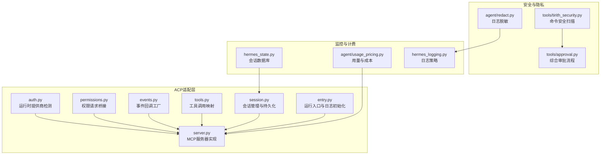
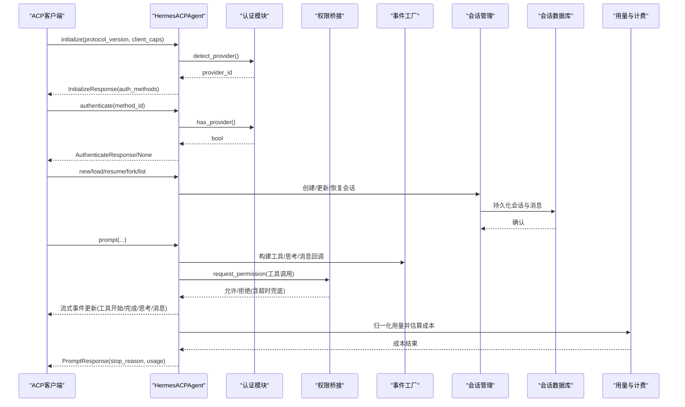
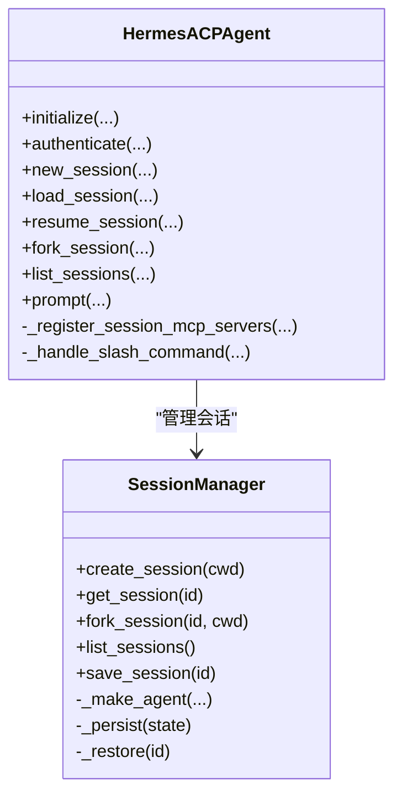
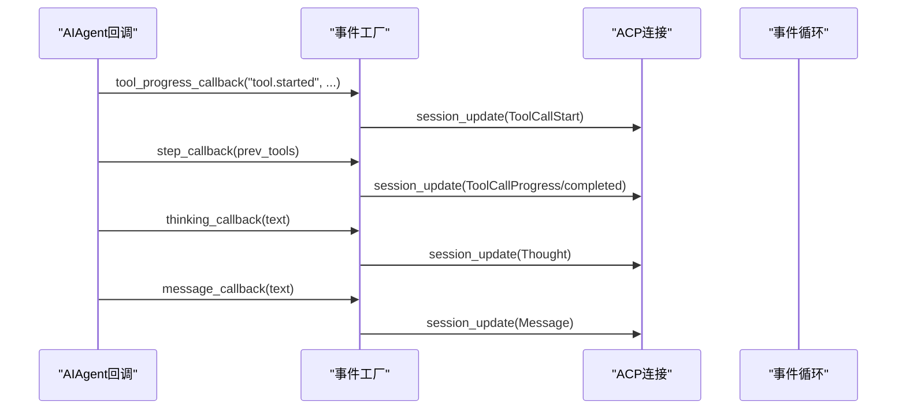
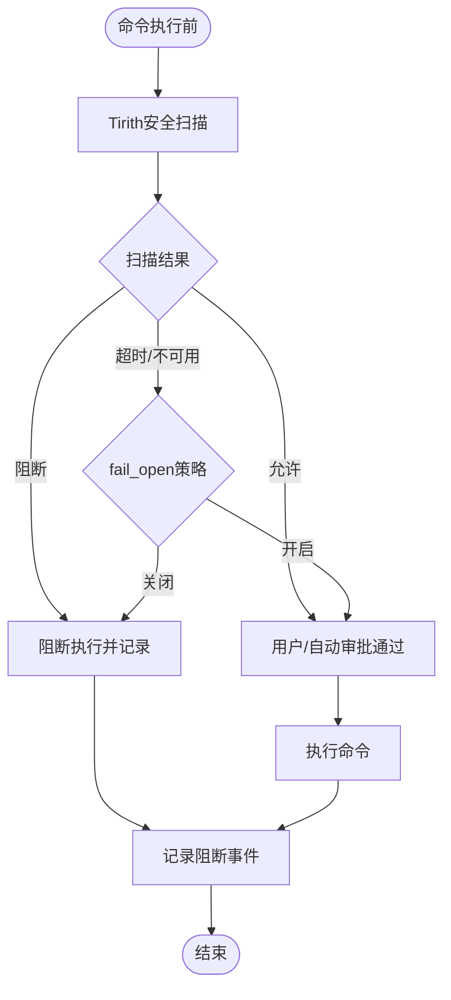
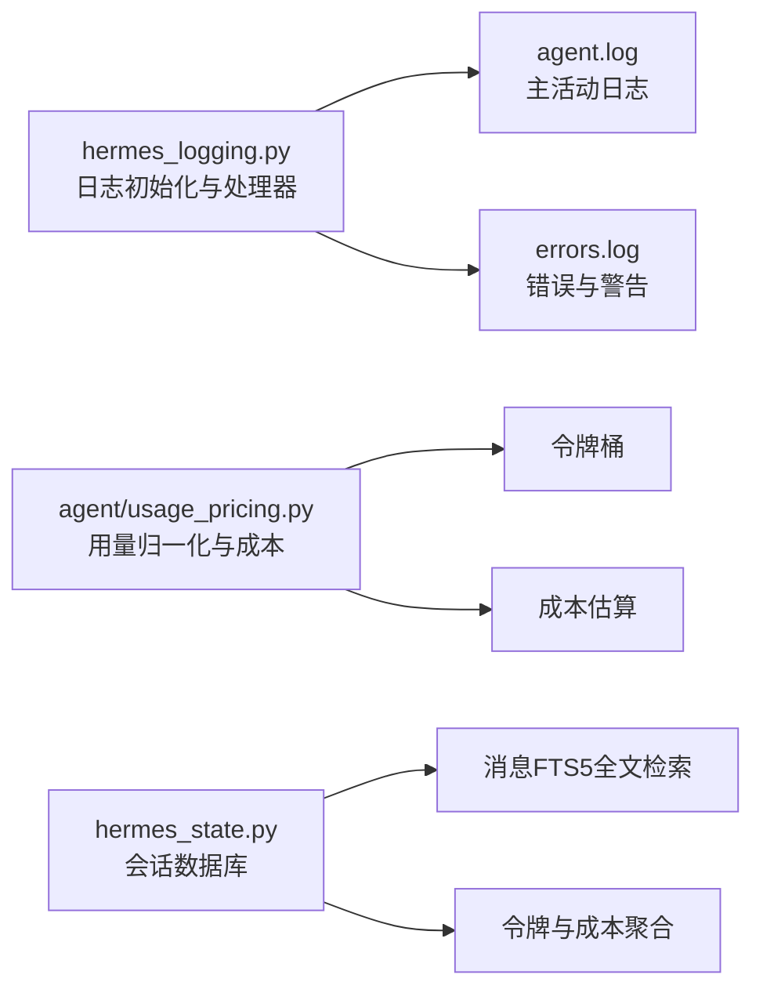
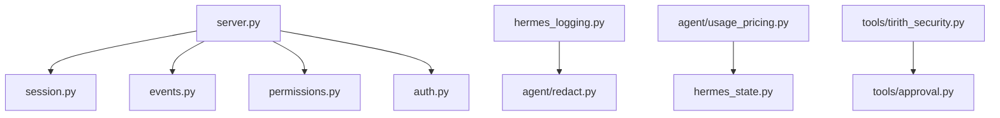

# MCP安全与监控

<cite>
**本文档引用的文件**
- [acp_adapter/auth.py](file://acp_adapter/auth.py)
- [acp_adapter/server.py](file://acp_adapter/server.py)
- [acp_adapter/events.py](file://acp_adapter/events.py)
- [acp_adapter/permissions.py](file://acp_adapter/permissions.py)
- [acp_adapter/session.py](file://acp_adapter/session.py)
- [acp_adapter/tools.py](file://acp_adapter/tools.py)
- [acp_adapter/entry.py](file://acp_adapter/entry.py)
- [agent/redact.py](file://agent/redact.py)
- [hermes_logging.py](file://hermes_logging.py)
- [hermes_state.py](file://hermes_state.py)
- [agent/usage_pricing.py](file://agent/usage_pricing.py)
- [tools/tirith_security.py](file://tools/tirith_security.py)
- [tools/approval.py](file://tools/approval.py)
- [website/docs/user-guide/configuration.md](file://website/docs/user-guide/configuration.md)
</cite>

## 目录
1. [简介](#简介)
2. [项目结构](#项目结构)
3. [核心组件](#核心组件)
4. [架构总览](#架构总览)
5. [详细组件分析](#详细组件分析)
6. [依赖关系分析](#依赖关系分析)
7. [性能考量](#性能考量)
8. [故障排查指南](#故障排查指南)
9. [结论](#结论)
10. [附录](#附录)

## 简介
本文件面向Hermes Agent的MCP（Model Context Protocol）安全与监控体系，系统化阐述MCP服务器的安全机制（访问控制、身份认证、授权管理）、事件桥接的安全考虑（数据隐私与敏感信息过滤）、监控指标与日志策略、以及异常检测与安全告警的实现路径。同时给出安全配置最佳实践、漏洞防护建议与合规性要点，帮助读者在生产环境中安全、稳定地运行MCP服务。

## 项目结构
围绕MCP安全与监控的关键模块分布如下：
- ACP适配层：负责MCP协议接入、会话管理、权限桥接与事件流输出
- 安全与隐私：日志脱敏、命令预执行安全扫描、凭据检测
- 监控与计费：令牌用量归一化、成本估算、状态持久化
- 配置与入口：环境加载、日志初始化、运行入口

图表来源
- [acp_adapter/server.py:92-727](file://acp_adapter/server.py#L92-L727)
- [acp_adapter/session.py:70-476](file://acp_adapter/session.py#L70-L476)
- [acp_adapter/permissions.py:26-78](file://acp_adapter/permissions.py#L26-L78)
- [acp_adapter/events.py:27-176](file://acp_adapter/events.py#L27-L176)
- [acp_adapter/tools.py:53-215](file://acp_adapter/tools.py#L53-L215)
- [acp_adapter/auth.py:8-25](file://acp_adapter/auth.py#L8-L25)
- [acp_adapter/entry.py:58-86](file://acp_adapter/entry.py#L58-L86)
- [agent/redact.py:113-182](file://agent/redact.py#L113-L182)
- [tools/tirith_security.py:600-636](file://tools/tirith_security.py#L600-L636)
- [tools/approval.py:618-645](file://tools/approval.py#L618-L645)
- [hermes_state.py:115-800](file://hermes_state.py#L115-L800)
- [agent/usage_pricing.py:27-657](file://agent/usage_pricing.py#L27-L657)
- [hermes_logging.py:50-230](file://hermes_logging.py#L50-L230)

章节来源
- [acp_adapter/server.py:92-727](file://acp_adapter/server.py#L92-L727)
- [acp_adapter/session.py:70-476](file://acp_adapter/session.py#L70-L476)
- [acp_adapter/permissions.py:26-78](file://acp_adapter/permissions.py#L26-L78)
- [acp_adapter/events.py:27-176](file://acp_adapter/events.py#L27-L176)
- [acp_adapter/tools.py:53-215](file://acp_adapter/tools.py#L53-L215)
- [acp_adapter/auth.py:8-25](file://acp_adapter/auth.py#L8-L25)
- [acp_adapter/entry.py:58-86](file://acp_adapter/entry.py#L58-L86)
- [agent/redact.py:113-182](file://agent/redact.py#L113-L182)
- [tools/tirith_security.py:600-636](file://tools/tirith_security.py#L600-L636)
- [tools/approval.py:618-645](file://tools/approval.py#L618-L645)
- [hermes_state.py:115-800](file://hermes_state.py#L115-L800)
- [agent/usage_pricing.py:27-657](file://agent/usage_pricing.py#L27-L657)
- [hermes_logging.py:50-230](file://hermes_logging.py#L50-L230)

## 核心组件
- 认证与授权
  - 运行时提供商检测：通过运行时配置解析当前活跃提供商，用于声明支持的身份认证方式
  - 初始化响应：根据检测到的提供商动态提供AuthMethod，供客户端选择
  - 认证处理：当存在有效提供商配置时返回认证成功
- 会话与事件桥接
  - 会话管理：内存+持久化双层存储，支持fork、恢复、列表查询；工作目录绑定与任务覆盖
  - 事件桥接：将工具调用、思考过程、消息流等事件转换为ACP协议更新并异步推送
  - 权限桥接：将工具调用前的权限请求转发至ACP客户端，并以超时/拒绝兜底
- 数据隐私与安全
  - 日志脱敏：统一格式化器对日志进行敏感信息掩码
  - 命令安全扫描：基于外部工具对终端命令进行预执行安全检查，支持fail-open/fail-closed策略
  - 敏感信息过滤：针对API密钥、令牌、私钥、数据库连接串、电话号码等模式进行识别与遮蔽
- 监控与计费
  - 用量归一化：兼容多供应商API响应结构，提取输入/输出/缓存/推理等令牌桶
  - 成本估算：基于官方定价或模型元数据估算美元成本，标注来源与状态
  - 会话持久化：SQLite WAL模式、FTS5全文检索、写入重试与检查点优化

章节来源
- [acp_adapter/auth.py:8-25](file://acp_adapter/auth.py#L8-L25)
- [acp_adapter/server.py:216-260](file://acp_adapter/server.py#L216-L260)
- [acp_adapter/permissions.py:26-78](file://acp_adapter/permissions.py#L26-L78)
- [acp_adapter/events.py:27-176](file://acp_adapter/events.py#L27-L176)
- [acp_adapter/session.py:70-476](file://acp_adapter/session.py#L70-L476)
- [agent/redact.py:113-182](file://agent/redact.py#L113-L182)
- [tools/tirith_security.py:600-636](file://tools/tirith_security.py#L600-L636)
- [agent/usage_pricing.py:420-557](file://agent/usage_pricing.py#L420-L557)
- [hermes_state.py:115-350](file://hermes_state.py#L115-L350)

## 架构总览
下图展示MCP服务器从初始化到会话生命周期的交互流程，以及安全与监控关键节点：

图表来源
- [acp_adapter/server.py:216-466](file://acp_adapter/server.py#L216-L466)
- [acp_adapter/permissions.py:26-78](file://acp_adapter/permissions.py#L26-L78)
- [acp_adapter/events.py:27-176](file://acp_adapter/events.py#L27-L176)
- [acp_adapter/session.py:94-164](file://acp_adapter/session.py#L94-L164)
- [hermes_state.py:355-501](file://hermes_state.py#L355-L501)
- [agent/usage_pricing.py:420-557](file://agent/usage_pricing.py#L420-L557)

## 详细组件分析

### 组件A：MCP服务器与认证授权
- 初始化阶段
  - 动态声明AuthMethod，使用detect_provider()返回的提供商名称作为方法标识
  - 返回协议版本与代理能力，包含会话fork/list能力
- 认证阶段
  - authenticate仅在存在有效提供商配置时允许认证
- 会话管理
  - 支持新建、加载、恢复、分叉、列出；工作目录与任务环境绑定
  - prompt执行前拦截斜杠命令，避免进入LLM
  - 使用线程池执行同步AIAgent，避免阻塞事件循环

图表来源
- [acp_adapter/server.py:92-727](file://acp_adapter/server.py#L92-L727)
- [acp_adapter/session.py:70-476](file://acp_adapter/session.py#L70-L476)

章节来源
- [acp_adapter/server.py:216-466](file://acp_adapter/server.py#L216-L466)
- [acp_adapter/session.py:94-164](file://acp_adapter/session.py#L94-L164)

### 组件B：事件桥接与权限请求
- 事件桥接
  - 工具进度：仅在“started”时发出ToolCallStart，其他事件忽略
  - 思考过程：将中间思考文本推送到客户端
  - 步进完成：按工具名队列匹配完成事件，确保并发同名调用正确闭合
  - 消息流：将生成文本增量推送到客户端
- 权限请求
  - 将工具调用前的审批请求转为ACP request_permission
  - 超时或失败默认拒绝，保障执行安全

图表来源
- [acp_adapter/events.py:47-176](file://acp_adapter/events.py#L47-L176)
- [acp_adapter/permissions.py:26-78](file://acp_adapter/permissions.py#L26-L78)

章节来源
- [acp_adapter/events.py:27-176](file://acp_adapter/events.py#L27-L176)
- [acp_adapter/permissions.py:26-78](file://acp_adapter/permissions.py#L26-L78)

### 组件C：数据隐私与敏感信息过滤
- 日志脱敏
  - 统一使用RedactingFormatter，对API密钥、令牌、私钥、数据库连接串、电话号码等进行识别与遮蔽
  - 支持环境变量赋值、JSON字段、Authorization头等常见载体
- 命令安全扫描
  - 在终端命令执行前进行安全扫描，支持超时与失败开/关策略
  - 结合危险命令检测与用户确认，形成综合审批流程

图表来源
- [tools/tirith_security.py:600-636](file://tools/tirith_security.py#L600-L636)
- [tools/approval.py:618-645](file://tools/approval.py#L618-L645)
- [agent/redact.py:113-182](file://agent/redact.py#L113-L182)

章节来源
- [agent/redact.py:113-182](file://agent/redact.py#L113-L182)
- [tools/tirith_security.py:600-636](file://tools/tirith_security.py#L600-L636)
- [tools/approval.py:618-645](file://tools/approval.py#L618-L645)

### 组件D：监控指标与日志策略
- 日志策略
  - agent.log：INFO及以上，主活动日志
  - errors.log：WARNING及以上，快速排障
  - 使用RotatingFileHandler与RedactingFormatter，避免敏感信息落盘
- 监控指标
  - 令牌用量：输入/输出/缓存读写/推理令牌
  - 成本估算：基于官方定价或模型元数据，标注来源与状态
  - 会话统计：消息数、工具调用数、标题唯一索引、全文搜索支持

图表来源
- [hermes_logging.py:50-142](file://hermes_logging.py#L50-L142)
- [agent/usage_pricing.py:420-557](file://agent/usage_pricing.py#L420-L557)
- [hermes_state.py:35-112](file://hermes_state.py#L35-L112)

章节来源
- [hermes_logging.py:50-142](file://hermes_logging.py#L50-L142)
- [agent/usage_pricing.py:420-557](file://agent/usage_pricing.py#L420-L557)
- [hermes_state.py:35-112](file://hermes_state.py#L35-L112)

## 依赖关系分析
- 组件耦合
  - HermesACPAgent依赖SessionManager进行会话生命周期管理，依赖权限桥接与事件工厂实现安全与可观测性
  - 日志子系统通过RedactingFormatter与全局RotatingFileHandler统一输出
  - 用量与计费模块独立于协议层，仅消费标准化的usage对象
- 外部依赖
  - ACP协议库：提供Initialize/Authenticate/Prompt等协议类型与客户端通信
  - SQLite：会话持久化与全文检索
  - 外部安全扫描工具：命令级安全检查

图表来源
- [acp_adapter/server.py:51-59](file://acp_adapter/server.py#L51-L59)
- [acp_adapter/session.py:433-476](file://acp_adapter/session.py#L433-L476)
- [acp_adapter/events.py:16-24](file://acp_adapter/events.py#L16-L24)
- [acp_adapter/permissions.py:49-51](file://acp_adapter/permissions.py#L49-L51)
- [acp_adapter/auth.py:51-51](file://acp_adapter/auth.py#L51-L51)
- [hermes_logging.py:108-130](file://hermes_logging.py#L108-L130)
- [agent/redact.py:173-182](file://agent/redact.py#L173-L182)
- [agent/usage_pricing.py:420-557](file://agent/usage_pricing.py#L420-L557)
- [hermes_state.py:115-161](file://hermes_state.py#L115-L161)
- [tools/tirith_security.py:600-636](file://tools/tirith_security.py#L600-L636)
- [tools/approval.py:618-645](file://tools/approval.py#L618-L645)

章节来源
- [acp_adapter/server.py:51-59](file://acp_adapter/server.py#L51-L59)
- [acp_adapter/session.py:433-476](file://acp_adapter/session.py#L433-L476)
- [acp_adapter/events.py:16-24](file://acp_adapter/events.py#L16-L24)
- [acp_adapter/permissions.py:49-51](file://acp_adapter/permissions.py#L49-L51)
- [acp_adapter/auth.py:51-51](file://acp_adapter/auth.py#L51-L51)
- [hermes_logging.py:108-130](file://hermes_logging.py#L108-L130)
- [agent/redact.py:173-182](file://agent/redact.py#L173-L182)
- [agent/usage_pricing.py:420-557](file://agent/usage_pricing.py#L420-L557)
- [hermes_state.py:115-161](file://hermes_state.py#L115-L161)
- [tools/tirith_security.py:600-636](file://tools/tirith_security.py#L600-L636)
- [tools/approval.py:618-645](file://tools/approval.py#L618-L645)

## 性能考量
- 写入竞争与锁优化
  - SQLite采用短超时+随机抖动重试，避免内置busy handler导致的排队效应
  - 定期被动checkpoint减少WAL膨胀
- 并发与异步
  - 会话事件推送通过run_coroutine_threadsafe异步发送，避免阻塞主线程
  - 工具调用完成事件按工具名队列匹配，保证并发场景下的顺序一致性
- 日志与I/O
  - 日志脱敏与轮转减少磁盘写入量与敏感信息泄露风险
  - 会话消息批量写入与FTS5触发器保持全文检索实时性

章节来源
- [acp_adapter/events.py:27-41](file://acp_adapter/events.py#L27-L41)
- [acp_adapter/session.py:164-236](file://acp_adapter/session.py#L164-L236)
- [hermes_state.py:164-236](file://hermes_state.py#L164-L236)

## 故障排查指南
- 认证失败
  - 检查运行时提供商配置是否可用（detect_provider/has_provider）
  - 确认initialize响应中的auth_methods是否正确声明
- 权限请求超时
  - 调整权限请求超时时间，或在客户端侧提升响应速度
  - 观察日志中权限请求失败的warning记录
- 会话恢复异常
  - 确认state.db可写且schema版本匹配
  - 检查会话元数据（cwd/provider/base_url/api_mode）是否正确恢复
- 日志中出现敏感信息
  - 确认RedactingFormatter已启用，检查环境变量HERMES_REDACT_SECRETS
  - 核对配置文件security.redact_secrets开关
- 命令被阻断
  - 查看tirith扫描结果与fail_open设置
  - 检查approval流程中的描述与发现项

章节来源
- [acp_adapter/auth.py:8-25](file://acp_adapter/auth.py#L8-L25)
- [acp_adapter/permissions.py:59-76](file://acp_adapter/permissions.py#L59-L76)
- [acp_adapter/session.py:333-405](file://acp_adapter/session.py#L333-L405)
- [agent/redact.py:173-182](file://agent/redact.py#L173-L182)
- [tools/tirith_security.py:600-636](file://tools/tirith_security.py#L600-L636)
- [tools/approval.py:618-645](file://tools/approval.py#L618-L645)

## 结论
Hermes Agent的MCP安全与监控体系以“最小信任、最大可观测”为核心设计：通过运行时提供商驱动的认证、严格的权限请求与超时兜底、事件驱动的细粒度可观测、以及全面的日志脱敏与命令安全扫描，构建了端到端的安全闭环。配合SQLite的高并发写入优化、标准化的用量与成本计算，以及完善的日志策略，能够在复杂生产环境中实现安全、稳定与可审计的MCP服务。

## 附录

### 安全配置最佳实践
- 启用日志脱敏与轮转，避免敏感信息落盘
- 启用Tirith安全扫描与fail_open策略，平衡安全性与可用性
- 明确会话元数据（cwd/provider/base_url/api_mode），确保恢复一致性
- 对外暴露的MCP端点应限制在受信网络内，必要时增加传输层安全

章节来源
- [website/docs/user-guide/configuration.md:1067-1078](file://website/docs/user-guide/configuration.md#L1067-L1078)
- [hermes_logging.py:50-142](file://hermes_logging.py#L50-L142)
- [agent/redact.py:113-182](file://agent/redact.py#L113-L182)
- [tools/tirith_security.py:600-636](file://tools/tirith_security.py#L600-L636)

### 漏洞防护与合规要点
- 输入校验与命令沙箱：结合Tirith扫描与危险命令检测，阻断高危操作
- 数据最小化：日志与事件中避免传输原始敏感数据，使用脱敏后的摘要
- 可追溯性：完整记录会话、工具调用、权限请求与成本变化，满足审计要求
- 配置治理：集中管理HERMES_HOME与环境变量，避免硬编码敏感信息

章节来源
- [tools/tirith_security.py:600-636](file://tools/tirith_security.py#L600-L636)
- [agent/redact.py:113-182](file://agent/redact.py#L113-L182)
- [hermes_state.py:355-501](file://hermes_state.py#L355-L501)