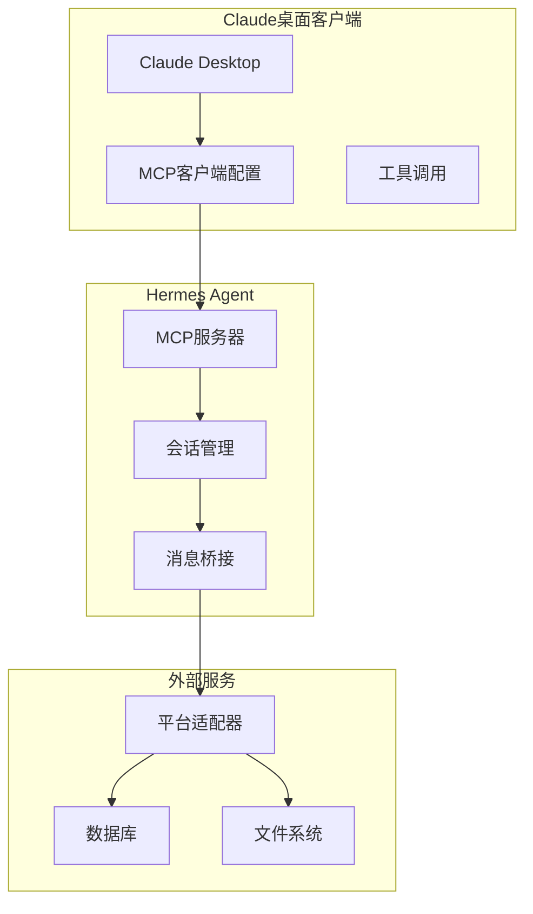
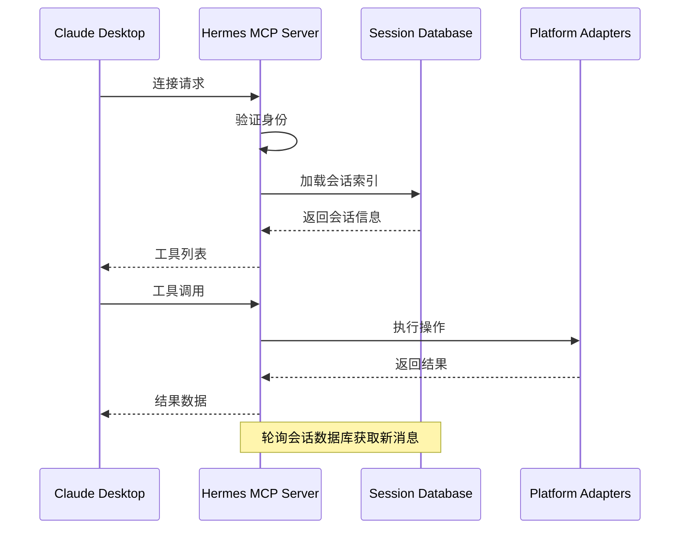
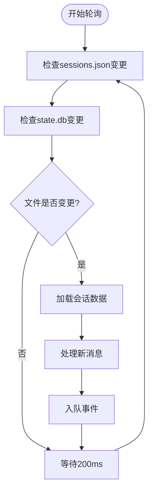
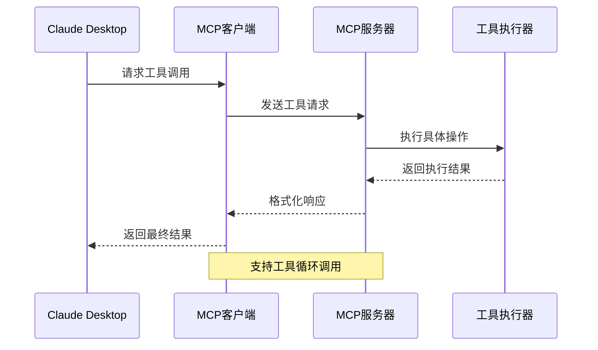
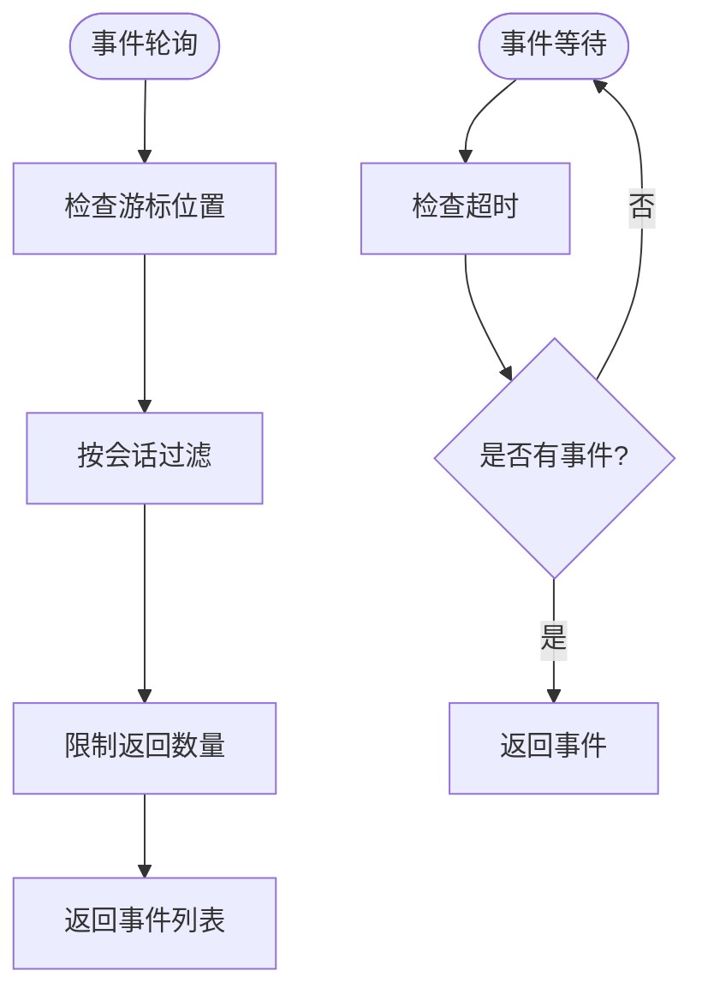
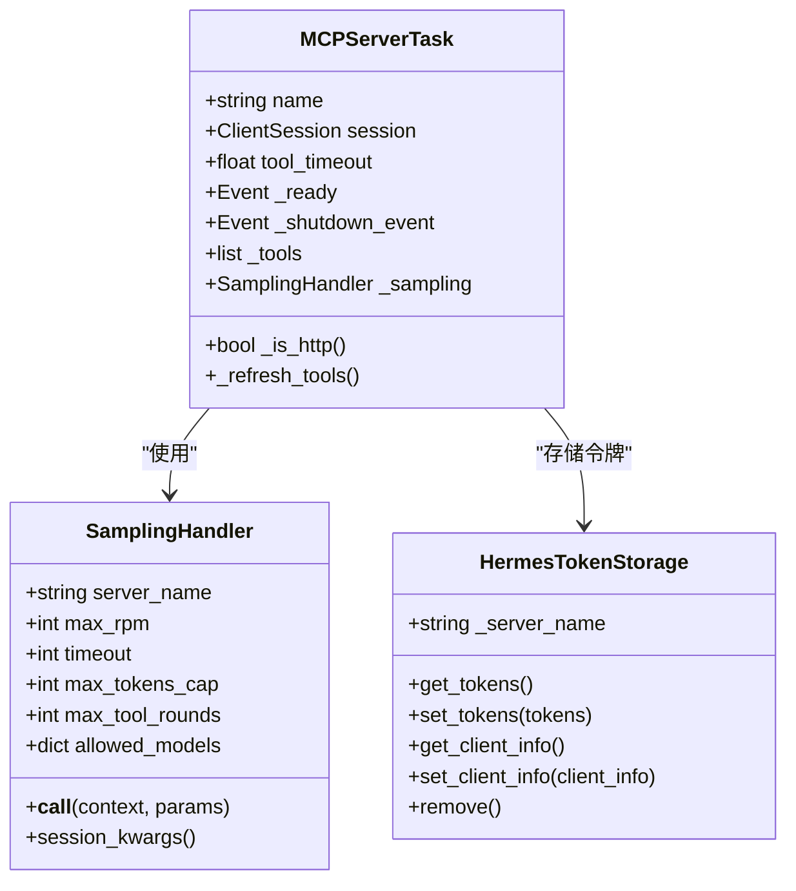
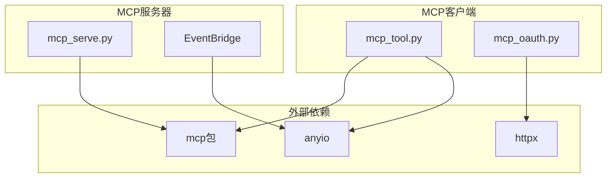

# Claude桌面客户端集成

<cite>
**本文档引用的文件**
- [mcp_config.py](file://hermes_cli/mcp_config.py)
- [mcp_serve.py](file://mcp_serve.py)
- [mcp_tool.py](file://tools/mcp_tool.py)
- [mcp_oauth.py](file://tools/mcp_oauth.py)
- [mcp.md](file://website/docs/user-guide/features/mcp.md)
- [SKILL.md](file://skills/autonomous-ai-agents/claude-code/SKILL.md)
- [cli-config.yaml.example](file://cli-config.yaml.example)
</cite>

## 目录
1. [简介](#简介)
2. [项目结构](#项目结构)
3. [核心组件](#核心组件)
4. [架构概览](#架构概览)
5. [详细组件分析](#详细组件分析)
6. [依赖关系分析](#依赖关系分析)
7. [性能考虑](#性能考虑)
8. [故障排除指南](#故障排除指南)
9. [结论](#结论)

## 简介

本文档为Claude桌面客户端的MCP（模型上下文协议）集成提供了完整的配置和使用指南。MCP允许Claude桌面客户端与外部工具服务器通信，访问文件系统、数据库、API端点等资源。本文档涵盖了从配置到部署的完整流程，包括：

- 完整的claude_desktop_config.json配置示例和参数说明
- MCP服务器的命令行配置、启动参数和运行模式
- Claude客户端中的MCP服务器添加过程和连接验证
- 消息传递、工具调用和事件处理的完整示例
- 故障排除指南和性能优化建议

## 项目结构

该项目采用模块化架构，主要涉及以下关键组件：



**图表来源**
- [mcp_serve.py:1-50](file://mcp_serve.py#L1-L50)
- [mcp_tool.py:1-100](file://tools/mcp_tool.py#L1-L100)

**章节来源**
- [mcp_serve.py:1-50](file://mcp_serve.py#L1-L50)
- [mcp_tool.py:1-100](file://tools/mcp_tool.py#L1-L100)

## 核心组件

### MCP服务器管理

Hermes Agent提供了完整的MCP服务器生命周期管理功能：

| 组件 | 功能描述 | 主要特性 |
|------|----------|----------|
| hermes mcp add | 添加新的MCP服务器 | 支持HTTP和stdio传输，自动发现工具，OAuth认证 |
| hermes mcp remove | 移除MCP服务器 | 安全删除配置和OAuth令牌 |
| hermes mcp list | 列出所有MCP服务器 | 实时状态显示，工具计数统计 |
| hermes mcp test | 测试服务器连接 | 连接超时检测，工具列表验证 |
| hermes mcp configure | 配置工具过滤 | 包含/排除工具，动态更新 |

### MCP服务器类型

系统支持两种主要的MCP服务器类型：

1. **stdio服务器**：本地子进程，通过stdin/stdout通信
2. **HTTP服务器**：远程端点，直接HTTP连接

**章节来源**
- [mcp_config.py:171-338](file://hermes_cli/mcp_config.py#L171-L338)
- [mcp_config.py:439-501](file://hermes_cli/mcp_config.py#L439-L501)

## 架构概览

### MCP服务器架构



**图表来源**
- [mcp_serve.py:431-800](file://mcp_serve.py#L431-L800)
- [mcp_tool.py:720-800](file://tools/mcp_tool.py#L720-L800)

### 事件处理机制



**图表来源**
- [mcp_serve.py:313-426](file://mcp_serve.py#L313-L426)

## 详细组件分析

### Claude桌面客户端配置

#### 完整配置示例

```json
{
  "mcpServers": {
    "hermes": {
      "command": "hermes",
      "args": ["mcp", "serve"],
      "env": {
        "HERMES_HOME": "/home/user/.hermes"
      },
      "timeout": 30000,
      "connectTimeout": 10000
    }
  },
  "permissions": {
    "allow": ["mcp_hermes_*"],
    "ask": [],
    "deny": []
  }
}
```

#### 关键配置参数

| 参数 | 类型 | 描述 | 默认值 |
|------|------|------|--------|
| command | string | MCP服务器可执行文件路径 | 必需 |
| args | array | 命令行参数数组 | [] |
| env | object | 环境变量映射 | {} |
| timeout | number | 工具调用超时(毫秒) | 30000 |
| connectTimeout | number | 连接超时(毫秒) | 10000 |
| headers | object | HTTP头部(仅HTTP服务器) | {} |
| auth | string | 认证类型(oauth或header) | null |

**章节来源**
- [mcp.md:465-489](file://website/docs/user-guide/features/mcp.md#L465-L489)
- [mcp_config.py:196-204](file://hermes_cli/mcp_config.py#L196-L204)

### MCP服务器启动和运行

#### 启动命令

```bash
# 基本启动
hermes mcp serve

# 详细日志
hermes mcp serve --verbose

# 在后台运行
nohup hermes mcp serve > /dev/null 2>&1 &
```

#### 运行模式

| 模式 | 描述 | 使用场景 |
|------|------|----------|
| stdio模式 | 本地进程通信 | 低延迟，本地资源访问 |
| HTTP模式 | 远程端点连接 | 云服务，分布式部署 |
| SSE模式 | 服务器推送事件 | 实时通知，事件驱动 |

**章节来源**
- [mcp_serve.py:15-28](file://mcp_serve.py#L15-L28)
- [mcp_serve.py:524-530](file://mcp_serve.py#L524-L530)

### 工具调用流程



**图表来源**
- [mcp_tool.py:588-714](file://tools/mcp_tool.py#L588-L714)

### 事件处理系统

#### 事件类型

| 事件类型 | 描述 | 数据结构 |
|----------|------|----------|
| message | 新消息到达 | `{role, content, timestamp, message_id}` |
| approval_requested | 需要权限审批 | `{approval_id, request_details}` |
| approval_resolved | 权限审批完成 | `{approval_id, decision}` |

#### 事件轮询



**图表来源**
- [mcp_serve.py:225-276](file://mcp_serve.py#L225-L276)

**章节来源**
- [mcp_serve.py:508-543](file://mcp_serve.py#L508-L543)
- [mcp_serve.py:647-700](file://mcp_serve.py#L647-L700)

## 依赖关系分析

### MCP客户端架构



**图表来源**
- [mcp_tool.py:720-800](file://tools/mcp_tool.py#L720-L800)
- [mcp_tool.py:349-408](file://tools/mcp_tool.py#L349-L408)
- [mcp_oauth.py:175-235](file://tools/mcp_oauth.py#L175-L235)

### 依赖关系图



**图表来源**
- [mcp_tool.py:90-138](file://tools/mcp_tool.py#L90-L138)
- [mcp_serve.py:49-56](file://mcp_serve.py#L49-L56)

**章节来源**
- [mcp_tool.py:90-138](file://tools/mcp_tool.py#L90-L138)
- [mcp_oauth.py:55-68](file://tools/mcp_oauth.py#L55-L68)

## 性能考虑

### 优化策略

1. **连接池管理**
   - 最大重连重试次数：5次
   - 指数退避：最多60秒
   - 自动重新连接

2. **内存管理**
   - 事件队列限制：1000个事件
   - 轮询间隔：200ms
   - mtime缓存：避免重复读取

3. **工具调用优化**
   - 默认工具超时：120秒
   - 连接超时：60秒
   - 可配置超时时间

### 监控指标

| 指标 | 描述 | 建议阈值 |
|------|------|----------|
| 连接成功率 | 服务器连接成功率 | >95% |
| 工具响应时间 | 平均工具调用时间 | <5秒 |
| 事件延迟 | 事件从产生到客户端收到 | <1秒 |
| 内存使用 | 事件队列占用内存 | <10MB |

**章节来源**
- [mcp_tool.py:162-166](file://tools/mcp_tool.py#L162-L166)
- [mcp_serve.py:172-174](file://mcp_serve.py#L172-L174)

## 故障排除指南

### 常见问题及解决方案

#### 1. MCP服务器无法连接

**症状**：连接超时或拒绝连接

**诊断步骤**：
1. 检查MCP包安装状态
   ```bash
   cd ~/.hermes/hermes-agent && uv pip install -e ".[mcp]"
   ```

2. 验证服务器可执行文件
   ```bash
   which hermes
   hermes --version
   ```

3. 检查网络连接
   ```bash
   telnet your-mcp-server.com 80
   ```

**章节来源**
- [mcp.md:379-391](file://website/docs/user-guide/features/mcp.md#L379-L391)

#### 2. 工具未显示在Claude中

**可能原因**：
- 服务器连接失败
- 工具过滤配置排除了工具
- 服务器禁用(enabled: false)

**解决方法**：
1. 使用测试命令验证连接
   ```bash
   hermes mcp test server-name
   ```

2. 检查工具过滤配置
   ```yaml
   mcp_servers:
     server-name:
       tools:
         include: [all]  # 显示所有工具
   ```

3. 确认服务器启用状态
   ```yaml
   mcp_servers:
     server-name:
       enabled: true
   ```

**章节来源**
- [mcp_config.py:441-501](file://hermes_cli/mcp_config.py#L441-L501)

#### 3. OAuth认证问题

**症状**：OAuth流程卡住或失败

**诊断和解决**：
1. 检查浏览器可用性
   ```bash
   echo $DISPLAY  # Linux
   echo $WAYLAND_DISPLAY  # Wayland
   ```

2. 验证回调端口
   ```bash
   lsof -i :8080  # 检查端口占用
   ```

3. 清理过期令牌
   ```bash
   hermes mcp remove server-name
   hermes mcp add server-name --url https://server.com/mcp --auth oauth
   ```

**章节来源**
- [mcp_oauth.py:286-363](file://tools/mcp_oauth.py#L286-L363)

#### 4. 性能问题

**症状**：响应缓慢或内存泄漏

**优化措施**：
1. 调整轮询间隔
   ```yaml
   mcp_servers:
     hermes:
       sampling:
         max_rpm: 5  # 降低请求频率
   ```

2. 限制事件队列大小
   ```bash
   export MCP_QUEUE_LIMIT=500
   ```

3. 监控资源使用
   ```bash
   ps aux | grep hermes
   top -p $(pgrep hermes)
   ```

**章节来源**
- [mcp_serve.py:172-174](file://mcp_serve.py#L172-L174)
- [mcp_tool.py:387-396](file://tools/mcp_tool.py#L387-L396)

### 调试技巧

1. **启用详细日志**
   ```bash
   export MCP_DEBUG=1
   hermes mcp serve --verbose
   ```

2. **检查配置文件**
   ```bash
   cat ~/.hermes/config.yaml | grep -A 10 -B 5 mcp_servers
   ```

3. **验证工具发现**
   ```bash
   hermes mcp test server-name
   hermes tools  # 查看可用工具
   ```

**章节来源**
- [mcp_serve.py:43-44](file://mcp_serve.py#L43-L44)
- [mcp_config.py:615-646](file://hermes_cli/mcp_config.py#L615-L646)

## 结论

通过本文档，您应该能够：

1. **成功配置Claude桌面客户端**：使用提供的配置示例和参数说明
2. **部署MCP服务器**：理解不同的传输方式和运行模式
3. **管理MCP工具**：掌握工具发现、过滤和权限控制
4. **处理事件**：实现消息传递和实时通知
5. **故障排除**：快速识别和解决常见问题

关键要点：
- MCP服务器支持stdio和HTTP两种传输方式
- OAuth认证提供安全的令牌管理
- 事件系统实现实时消息传递
- 性能优化确保稳定的用户体验
- 完善的监控和调试工具

建议在生产环境中：
- 使用HTTPS和OAuth进行安全通信
- 配置适当的超时和重试策略
- 监控资源使用情况
- 定期清理过期的OAuth令牌
- 实施适当的日志记录和审计