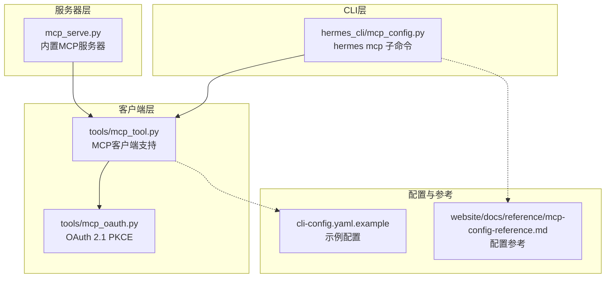
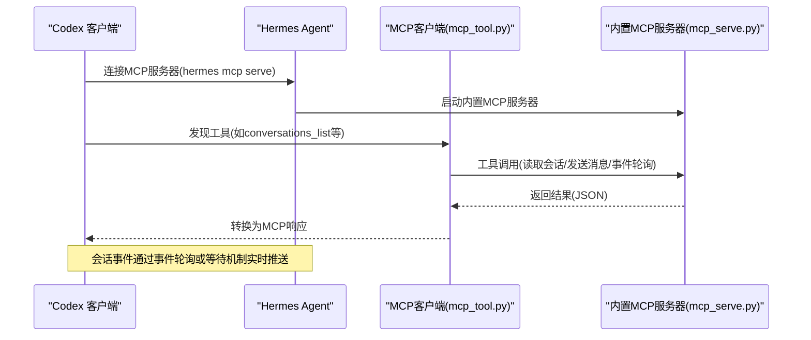
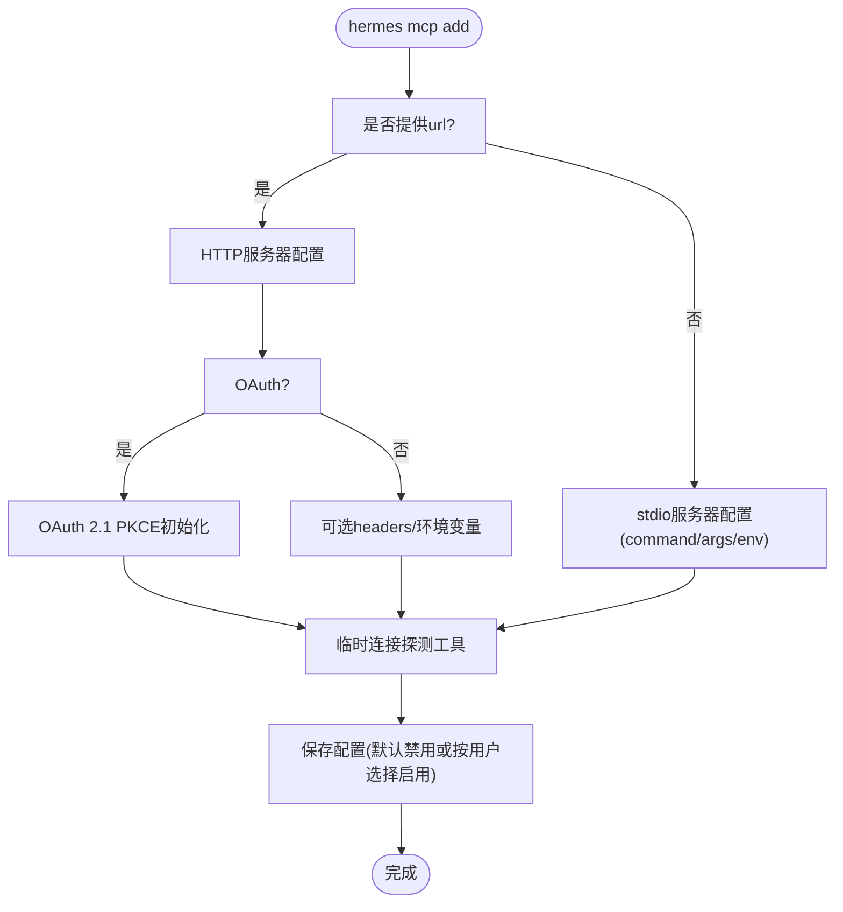
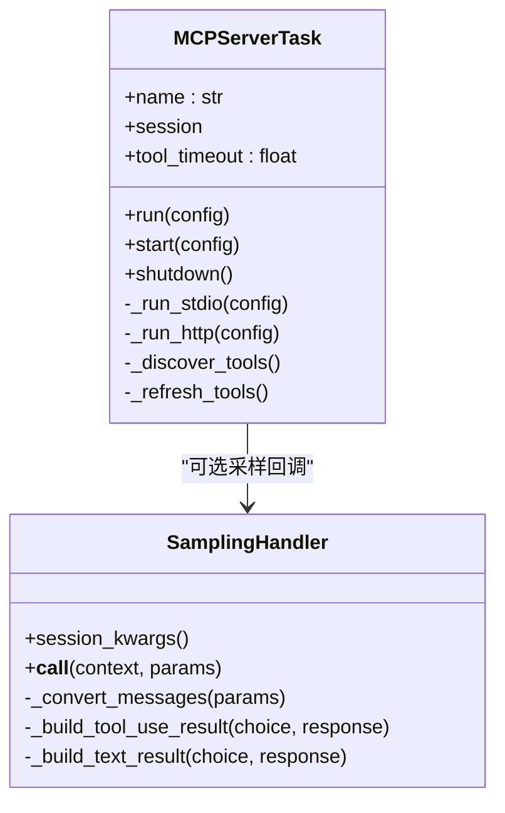
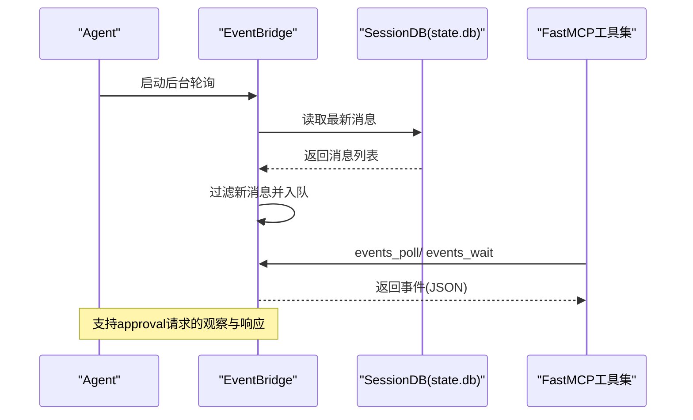
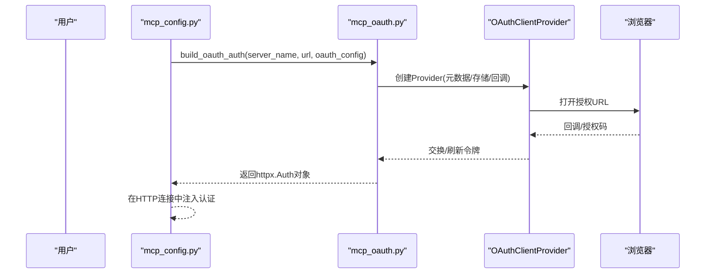
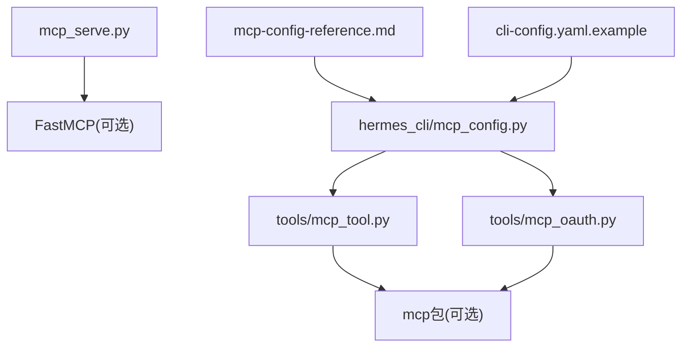

# Codex客户端集成

<cite>
**本文档引用的文件**
- [mcp_config.py](file://hermes_cli/mcp_config.py)
- [mcp_serve.py](file://mcp_serve.py)
- [mcp_tool.py](file://tools/mcp_tool.py)
- [mcp_oauth.py](file://tools/mcp_oauth.py)
- [cli-config.yaml.example](file://cli-config.yaml.example)
- [mcp-config-reference.md](file://website/docs/reference/mcp-config-reference.md)
- [test_mcp_tool.py](file://tests/tools/test_mcp_tool.py)
- [test_mcp_oauth.py](file://tests/tools/test_mcp_oauth.py)
</cite>

## 目录
1. [简介](#简介)
2. [项目结构](#项目结构)
3. [核心组件](#核心组件)
4. [架构总览](#架构总览)
5. [详细组件分析](#详细组件分析)
6. [依赖关系分析](#依赖关系分析)
7. [性能考虑](#性能考虑)
8. [故障排除指南](#故障排除指南)
9. [结论](#结论)
10. [附录](#附录)

## 简介
本文件面向在Codex客户端中集成MCP（Model Context Protocol）的开发者与运维人员，提供从配置到使用的完整指南。内容涵盖：
- Codex客户端中的MCP服务器配置、工具调用与事件处理
- MCP服务器的启动方式、连接建立与认证机制
- 常见问题排查与调试技巧
- 面向非技术用户的可操作步骤与最佳实践

## 项目结构
围绕MCP集成的关键模块包括：
- CLI管理：hermes mcp 子命令用于添加、删除、列出、测试与配置MCP服务器
- 客户端适配：MCP客户端支持（stdio与HTTP/StreamableHTTP），动态发现工具，注册为本地工具
- 服务器桥接：内置MCP服务器（hermes mcp serve），将会话消息、事件与发送消息等能力暴露给外部MCP客户端（如Codex）
- 认证支持：OAuth 2.1 PKCE（仅HTTP服务器）

**图表来源**
- [mcp_config.py:610-646](file://hermes_cli/mcp_config.py#L610-L646)
- [mcp_tool.py:1169-1196](file://tools/mcp_tool.py#L1169-L1196)
- [mcp_oauth.py:377-482](file://tools/mcp_oauth.py#L377-L482)
- [mcp_serve.py:1-80](file://mcp_serve.py#L1-L80)
- [mcp-config-reference.md:1-248](file://website/docs/reference/mcp-config-reference.md#L1-L248)
- [cli-config.yaml.example:594-642](file://cli-config.yaml.example#L594-L642)

**章节来源**
- [mcp_config.py:1-646](file://hermes_cli/mcp_config.py#L1-L646)
- [mcp_tool.py:1-200](file://tools/mcp_tool.py#L1-L200)
- [mcp_oauth.py:1-120](file://tools/mcp_oauth.py#L1-L120)
- [mcp_serve.py:1-80](file://mcp_serve.py#L1-L80)
- [mcp-config-reference.md:1-248](file://website/docs/reference/mcp-config-reference.md#L1-L248)
- [cli-config.yaml.example:594-642](file://cli-config.yaml.example#L594-L642)

## 核心组件
- hermes mcp 子命令：提供交互式服务器生命周期管理（添加、删除、列表、测试、配置）
- MCP客户端：支持stdio与HTTP/StreamableHTTP，自动重连、动态工具发现、采样（server-initiated LLM请求）
- 内置MCP服务器：将会话消息、事件与发送消息等能力暴露给外部MCP客户端
- OAuth 2.1 PKCE：为HTTP服务器提供安全认证，令牌持久化与刷新

**章节来源**
- [mcp_config.py:173-338](file://hermes_cli/mcp_config.py#L173-L338)
- [mcp_tool.py:90-138](file://tools/mcp_tool.py#L90-L138)
- [mcp_serve.py:1-80](file://mcp_serve.py#L1-L80)
- [mcp_oauth.py:377-482](file://tools/mcp_oauth.py#L377-L482)

## 架构总览
下图展示Codex作为MCP客户端如何与Hermes Agent交互，以及Hermes内部的MCP客户端与服务器桥接。

**图表来源**
- [mcp_serve.py:431-800](file://mcp_serve.py#L431-L800)
- [mcp_tool.py:950-1062](file://tools/mcp_tool.py#L950-L1062)

**章节来源**
- [mcp_serve.py:431-800](file://mcp_serve.py#L431-L800)
- [mcp_tool.py:950-1062](file://tools/mcp_tool.py#L950-L1062)

## 详细组件分析

### hermes mcp 子命令（CLI管理）
- 支持子命令：add、remove（rm）、list（ls）、test、configure（config）
- add流程：选择传输（url或command）、可选OAuth配置、连接探测工具、交互式工具选择、保存配置
- test流程：显示传输与认证信息、尝试连接并列出工具
- configure流程：重新探测工具、交互式启用/禁用工具、更新配置

**图表来源**
- [mcp_config.py:173-338](file://hermes_cli/mcp_config.py#L173-L338)
- [mcp_config.py:441-501](file://hermes_cli/mcp_config.py#L441-L501)

**章节来源**
- [mcp_config.py:173-338](file://hermes_cli/mcp_config.py#L173-L338)
- [mcp_config.py:441-501](file://hermes_cli/mcp_config.py#L441-L501)

### MCP客户端（工具发现与调用）
- 传输支持：stdio（command/args/env）与HTTP/StreamableHTTP（url/headers）
- 动态工具发现：首次连接后拉取工具清单，并支持通知触发的动态刷新
- 自动重连：指数退避最多5次重试
- 采样支持：允许服务器发起LLM请求，进行工具循环推理
- 错误处理：清理凭证模式的错误信息，避免泄露

**图表来源**
- [mcp_tool.py:720-1062](file://tools/mcp_tool.py#L720-L1062)
- [mcp_tool.py:349-714](file://tools/mcp_tool.py#L349-L714)

**章节来源**
- [mcp_tool.py:720-1062](file://tools/mcp_tool.py#L720-L1062)
- [mcp_tool.py:349-714](file://tools/mcp_tool.py#L349-L714)

### 内置MCP服务器（Hermes桥接）
- 暴露工具：conversations_list、conversation_get、messages_read、attachments_fetch、events_poll、events_wait、messages_send、channels_list
- 事件桥接：轮询会话数据库，维护内存事件队列，支持长轮询等待
- 会话数据：从sessions.json与state.db读取，提取文本内容与附件
- 发送消息：通过send_message_tool转发至各平台

**图表来源**
- [mcp_serve.py:185-426](file://mcp_serve.py#L185-L426)
- [mcp_serve.py:431-800](file://mcp_serve.py#L431-L800)

**章节来源**
- [mcp_serve.py:185-426](file://mcp_serve.py#L185-L426)
- [mcp_serve.py:431-800](file://mcp_serve.py#L431-L800)

### OAuth 2.1 PKCE（HTTP服务器认证）
- 使用MCP SDK的OAuthClientProvider实现PKCE流程
- 令牌与客户端信息持久化到$HERMES_HOME/mcp-tokens/
- 支持预注册client_id/secret与自定义scope
- 回调服务器与浏览器授权流程

**图表来源**
- [mcp_config.py:207-224](file://hermes_cli/mcp_config.py#L207-L224)
- [mcp_oauth.py:377-482](file://tools/mcp_oauth.py#L377-L482)

**章节来源**
- [mcp_config.py:207-224](file://hermes_cli/mcp_config.py#L207-L224)
- [mcp_oauth.py:377-482](file://tools/mcp_oauth.py#L377-L482)

## 依赖关系分析
- MCP客户端依赖mcp包（可选），提供stdio与HTTP客户端、OAuth支持、采样类型
- 内置MCP服务器依赖FastMCP（可选），提供工具注册与事件桥接
- OAuth模块依赖MCP SDK的OAuthClientProvider与Pydantic模型
- CLI配置与参考文档提供配置键与过滤策略说明

**图表来源**
- [mcp_tool.py:90-138](file://tools/mcp_tool.py#L90-L138)
- [mcp_serve.py:49-56](file://mcp_serve.py#L49-L56)
- [mcp_oauth.py:55-68](file://tools/mcp_oauth.py#L55-L68)
- [mcp_config.py:1-646](file://hermes_cli/mcp_config.py#L1-L646)
- [mcp-config-reference.md:1-248](file://website/docs/reference/mcp-config-reference.md#L1-L248)
- [cli-config.yaml.example:594-642](file://cli-config.yaml.example#L594-L642)

**章节来源**
- [mcp_tool.py:90-138](file://tools/mcp_tool.py#L90-L138)
- [mcp_serve.py:49-56](file://mcp_serve.py#L49-L56)
- [mcp_oauth.py:55-68](file://tools/mcp_oauth.py#L55-L68)
- [mcp_config.py:1-646](file://hermes_cli/mcp_config.py#L1-L646)
- [mcp-config-reference.md:1-248](file://website/docs/reference/mcp-config-reference.md#L1-L248)
- [cli-config.yaml.example:594-642](file://cli-config.yaml.example#L594-L642)

## 性能考虑
- 事件轮询：默认200ms轮询间隔，基于文件mtime缓存避免昂贵工作
- 事件队列：最大1000条，超出则丢弃最早事件
- 采样限流：每分钟滑动窗口限制，默认10 RPM
- 工具超时：默认工具调用超时120秒，连接超时60秒
- 重连退避：最多5次，上限60秒

**章节来源**
- [mcp_serve.py:172-174](file://mcp_serve.py#L172-L174)
- [mcp_serve.py:313-326](file://mcp_serve.py#L313-L326)
- [mcp_tool.py:162-166](file://tools/mcp_tool.py#L162-L166)
- [mcp_tool.py:986-1031](file://tools/mcp_tool.py#L986-L1031)

## 故障排除指南
- 连接失败
  - 检查网络与URL可达性；确认headers与OAuth配置正确
  - 使用hermes mcp test查看传输与认证信息
  - 参考连接错误格式化逻辑定位缺失可执行文件或路径问题
- 工具未出现
  - 确认服务器已返回工具清单；检查include/exclude过滤策略
  - 若启用resources/prompts但服务器不支持，则不会注册对应工具
- OAuth问题
  - 非交互环境需先在交互终端完成授权以生成缓存令牌
  - 检查$HERMES_HOME/mcp-tokens/目录下的令牌与客户端信息文件
- 采样失败
  - 检查max_rpm、timeout、allowed_models等配置
  - 关注工具循环限制（max_tool_rounds）与速率限制日志

**章节来源**
- [mcp_config.py:441-501](file://hermes_cli/mcp_config.py#L441-L501)
- [mcp_tool.py:270-328](file://tools/mcp_tool.py#L270-L328)
- [mcp_tool.py:349-714](file://tools/mcp_tool.py#L349-L714)
- [mcp_oauth.py:377-482](file://tools/mcp_oauth.py#L377-L482)
- [mcp-config-reference.md:54-131](file://website/docs/reference/mcp-config-reference.md#L54-L131)

## 结论
通过CLI管理、客户端适配与内置服务器桥接，Hermes实现了对MCP协议的完整支持。Codex等外部客户端可无缝访问会话消息、事件与发送消息等能力；同时，HTTP服务器可通过OAuth 2.1 PKCE获得安全认证。建议在生产环境中合理配置工具过滤、采样策略与超时参数，并结合日志与测试命令进行持续验证。

## 附录

### Codex配置示例与参数设置
- 示例配置位置：cli-config.yaml.example 中的“MCP (Model Context Protocol) Servers”段落
- 关键参数
  - 传输：command/args/env（stdio）或url/headers（HTTP）
  - 认证：auth: oauth（HTTP服务器）
  - 工具策略：tools.include/exclude、tools.resources、tools.prompts
  - 超时：timeout、connect_timeout
- 示例片段路径
  - [示例配置:613-642](file://cli-config.yaml.example#L613-L642)
  - [配置参考:15-62](file://website/docs/reference/mcp-config-reference.md#L15-L62)

**章节来源**
- [cli-config.yaml.example:594-642](file://cli-config.yaml.example#L594-L642)
- [mcp-config-reference.md:15-62](file://website/docs/reference/mcp-config-reference.md#L15-L62)

### MCP服务器启动与连接
- 启动内置服务器
  - hermes mcp serve 或在客户端配置中使用command: ["mcp", "serve"]
- 连接建立
  - CLI add时可探测工具；客户端运行时自动重连
- 认证机制
  - HTTP服务器支持OAuth 2.1 PKCE；stdio服务器通过headers/env传递凭据

**章节来源**
- [mcp_serve.py:15-28](file://mcp_serve.py#L15-L28)
- [mcp_config.py:173-338](file://hermes_cli/mcp_config.py#L173-L338)
- [mcp_tool.py:874-949](file://tools/mcp_tool.py#L874-L949)
- [mcp_oauth.py:377-482](file://tools/mcp_oauth.py#L377-L482)

### 工具调用与事件处理
- 工具调用
  - 通过MCP客户端注册为本地工具，支持schema转换与错误信息脱敏
- 事件处理
  - 内置服务器桥接会话数据库，提供events_poll/events_wait
  - 支持approval请求的观察与响应

**章节来源**
- [mcp_tool.py:720-1062](file://tools/mcp_tool.py#L720-L1062)
- [mcp_serve.py:185-426](file://mcp_serve.py#L185-L426)
- [mcp_serve.py:431-800](file://mcp_serve.py#L431-L800)

### 常见问题与调试技巧
- 使用hermes mcp test快速验证连接与工具
- 通过日志级别与审计日志（采样）定位问题
- 在非交互环境提前完成OAuth授权以避免回调超时
- 使用reload命令重新加载MCP配置

**章节来源**
- [mcp_config.py:441-501](file://hermes_cli/mcp_config.py#L441-L501)
- [mcp_oauth.py:312-363](file://tools/mcp_oauth.py#L312-L363)
- [mcp-config-reference.md:192-198](file://website/docs/reference/mcp-config-reference.md#L192-L198)