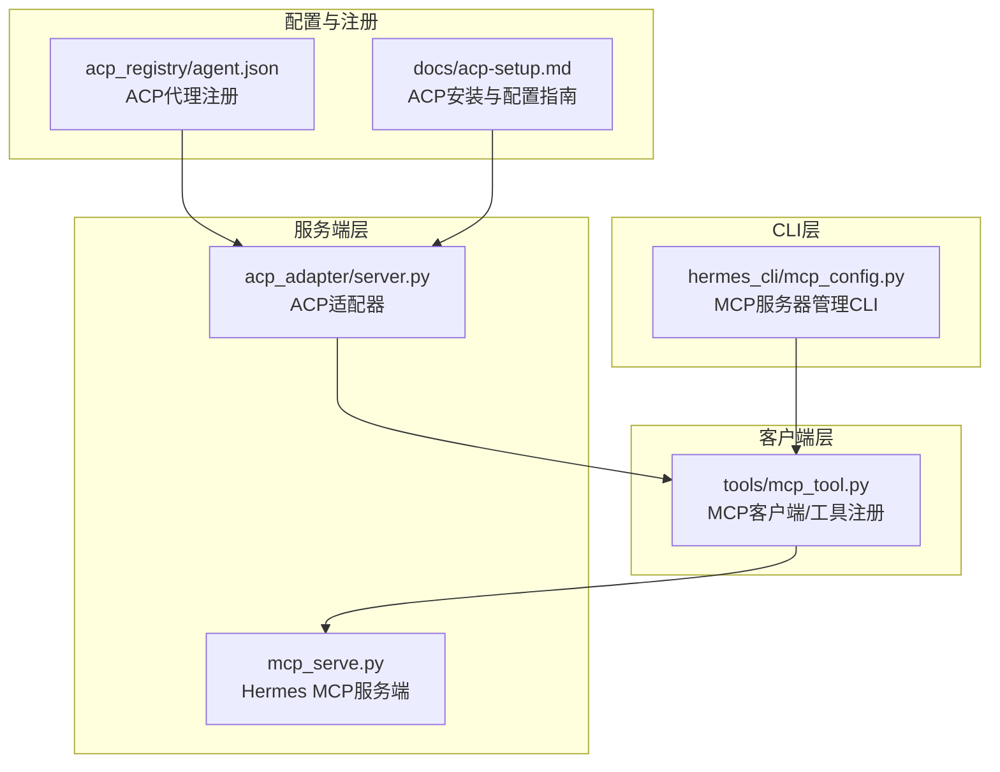
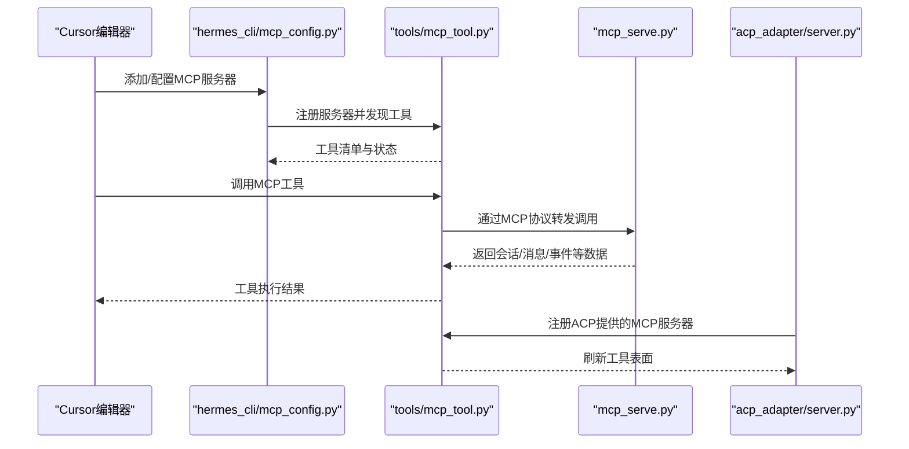
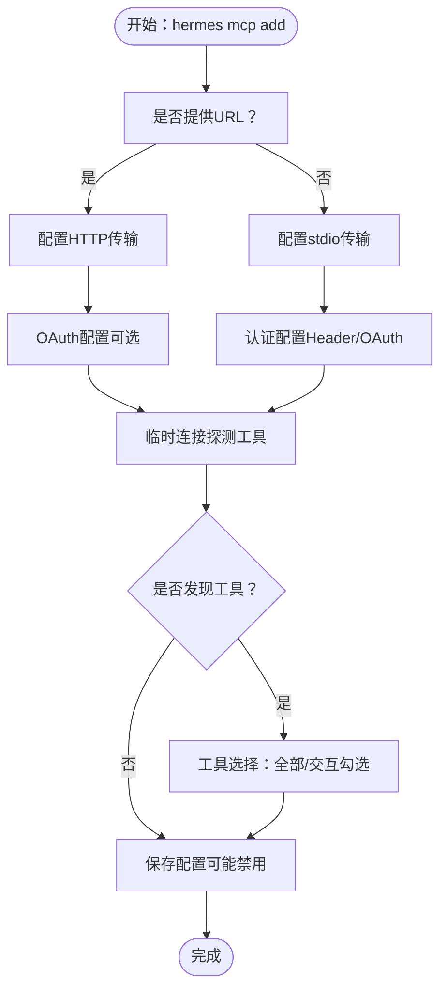
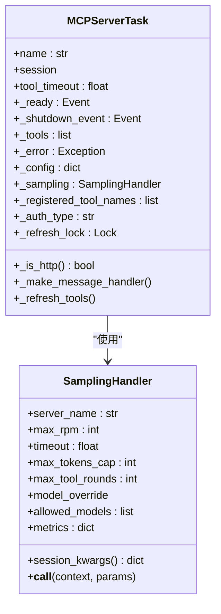
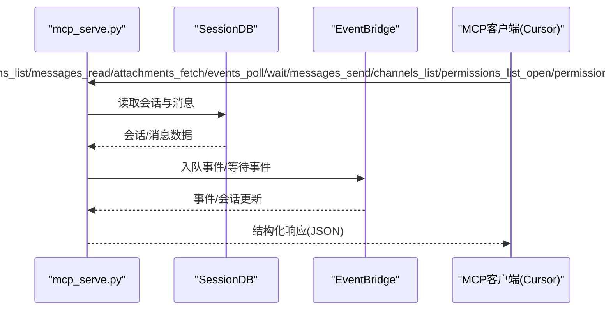
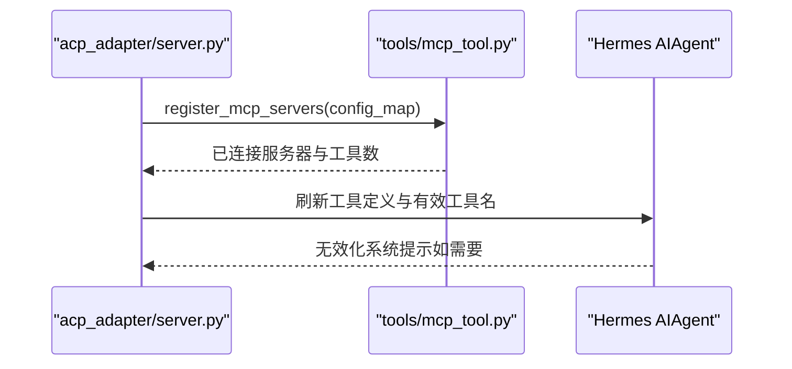
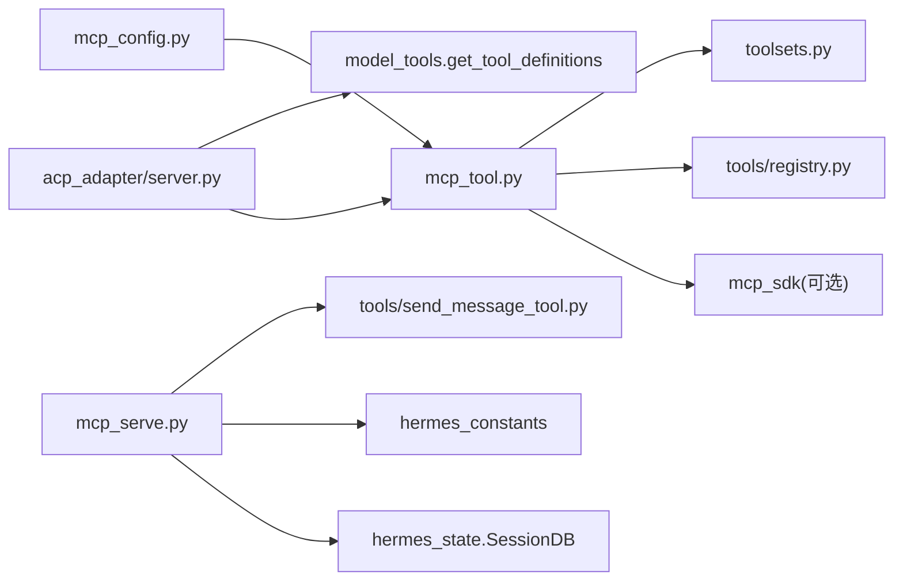

# Cursor编辑器集成

<cite>
**本文档引用的文件**
- [mcp_config.py](file://hermes_cli/mcp_config.py)
- [mcp_serve.py](file://mcp_serve.py)
- [mcp_tool.py](file://tools/mcp_tool.py)
- [server.py](file://acp_adapter/server.py)
- [acp-setup.md](file://docs/acp-setup.md)
- [agent.json](file://acp_registry/agent.json)
- [README.md](file://README.md)
</cite>

## 目录
1. [简介](#简介)
2. [项目结构](#项目结构)
3. [核心组件](#核心组件)
4. [架构总览](#架构总览)
5. [详细组件分析](#详细组件分析)
6. [依赖关系分析](#依赖关系分析)
7. [性能考虑](#性能考虑)
8. [故障排除指南](#故障排除指南)
9. [结论](#结论)

## 简介
本文件面向Cursor编辑器的MCP（模型上下文协议）集成，系统性阐述Hermes Agent如何通过MCP协议与Cursor协作，实现工具发现、消息传递、权限管理与上下文感知等功能。文档同时覆盖Cursor特定的配置要点、快捷键绑定建议、上下文感知与代码补全集成策略，并提供故障排除与性能优化建议。

## 项目结构
围绕Cursor集成的关键模块包括：
- CLI MCP管理：hermes_cli/mcp_config.py 提供服务器添加、删除、测试、配置等命令行接口
- MCP客户端：tools/mcp_tool.py 负责连接外部MCP服务器、动态发现工具、注册到Agent工具集
- MCP服务端：mcp_serve.py 将Hermes会话桥接为MCP工具，支持对话列表、消息读取、附件获取、事件轮询/等待、消息发送、频道列表、权限请求等
- ACP适配器：acp_adapter/server.py 将Hermes作为ACP代理运行，支持会话生命周期、工具表面刷新、权限回调等
- 配置与注册：acp_registry/agent.json 定义ACP代理的分发方式；docs/acp-setup.md 提供ACP在各编辑器的安装与配置指引

**图表来源**
- [mcp_config.py:1-646](file://hermes_cli/mcp_config.py#L1-646)
- [mcp_tool.py:1-800](file://tools/mcp_tool.py#L1-800)
- [mcp_serve.py:1-800](file://mcp_serve.py#L1-800)
- [server.py:1-727](file://acp_adapter/server.py#L1-727)
- [agent.json:1-13](file://acp_registry/agent.json#L1-13)
- [acp-setup.md:1-229](file://docs/acp-setup.md#L1-229)

**章节来源**
- [mcp_config.py:1-646](file://hermes_cli/mcp_config.py#L1-646)
- [mcp_tool.py:1-800](file://tools/mcp_tool.py#L1-800)
- [mcp_serve.py:1-800](file://mcp_serve.py#L1-800)
- [server.py:1-727](file://acp_adapter/server.py#L1-727)
- [agent.json:1-13](file://acp_registry/agent.json#L1-13)
- [acp-setup.md:1-229](file://docs/acp-setup.md#L1-229)

## 核心组件
- MCP服务器管理CLI：提供add/remove/list/test/configure等子命令，支持HTTP与stdio两种传输方式，内置OAuth与Header认证、工具选择与保存、连接探测与错误解包
- MCP客户端：负责后台事件循环、服务器任务管理、动态工具发现通知、采样回调（server-initiated LLM请求）、安全环境变量过滤、错误文本脱敏
- MCP服务端：将Hermes会话桥接为MCP工具集合，提供对话列表、会话详情、消息读取、附件提取、事件轮询/等待、消息发送、频道列表、权限请求与处理
- ACP适配器：以ACP协议运行Hermes Agent，支持会话创建/加载/恢复、工具表面刷新、权限回调、斜杠命令等

**章节来源**
- [mcp_config.py:171-338](file://hermes_cli/mcp_config.py#L171-338)
- [mcp_tool.py:716-800](file://tools/mcp_tool.py#L716-800)
- [mcp_serve.py:431-800](file://mcp_serve.py#L431-800)
- [server.py:92-727](file://acp_adapter/server.py#L92-727)

## 架构总览
Hermes Agent通过MCP协议在Cursor中呈现为可调用的工具集合。当Cursor发起工具调用时，MCP客户端负责建立连接、执行工具、返回结果；同时，MCP服务端可将Hermes的会话状态暴露为MCP工具，供Cursor查询与交互。

**图表来源**
- [mcp_config.py:171-338](file://hermes_cli/mcp_config.py#L171-338)
- [mcp_tool.py:716-800](file://tools/mcp_tool.py#L716-800)
- [mcp_serve.py:431-800](file://mcp_serve.py#L431-800)
- [server.py:149-213](file://acp_adapter/server.py#L149-213)

## 详细组件分析

### MCP服务器管理CLI（hermes_cli/mcp_config.py）
- 支持HTTP与stdio两种传输方式，自动进行OAuth与Header认证配置
- 提供工具选择界面，支持“全部启用”或“交互式勾选”
- 内置连接探测与错误解包，便于快速定位连接问题
- 保存配置至~/.hermes/config.yaml，支持按服务器名管理

**图表来源**
- [mcp_config.py:171-338](file://hermes_cli/mcp_config.py#L171-338)
- [mcp_config.py:114-152](file://hermes_cli/mcp_config.py#L114-152)

**章节来源**
- [mcp_config.py:171-338](file://hermes_cli/mcp_config.py#L171-338)
- [mcp_config.py:114-152](file://hermes_cli/mcp_config.py#L114-152)

### MCP客户端（tools/mcp_tool.py）
- 后台事件循环与服务器任务：每个MCP服务器在独立异步任务中运行，确保anyio取消作用域在同一任务内进入/退出
- 动态工具发现：监听ServerNotification，收到tools/list_changed后刷新工具集
- 采样回调：支持server-initiated LLM请求（sampling/createMessage），具备速率限制、模型白名单、超时控制与指标统计
- 安全与容错：过滤环境变量、错误文本脱敏、重连与指数退避、连接错误归因

**图表来源**
- [mcp_tool.py:720-800](file://tools/mcp_tool.py#L720-800)
- [mcp_tool.py:349-585](file://tools/mcp_tool.py#L349-585)

**章节来源**
- [mcp_tool.py:716-800](file://tools/mcp_tool.py#L716-800)
- [mcp_tool.py:349-585](file://tools/mcp_tool.py#L349-585)

### MCP服务端（mcp_serve.py）
- 暴露9个MCP工具，匹配OpenClaw的通道桥接表面，额外提供channels_list
- 事件桥接：基于SQLite会话数据库轮询新消息，维护内存事件队列与等待器，支持长轮询
- 工具实现：对话列表、会话详情、消息读取、附件提取、事件轮询/等待、消息发送、频道列表、权限请求与处理

**图表来源**
- [mcp_serve.py:431-800](file://mcp_serve.py#L431-800)
- [mcp_serve.py:185-426](file://mcp_serve.py#L185-426)

**章节来源**
- [mcp_serve.py:431-800](file://mcp_serve.py#L431-800)
- [mcp_serve.py:185-426](file://mcp_serve.py#L185-426)

### ACP适配器（acp_adapter/server.py）
- 以ACP协议运行Hermes Agent，支持会话创建/加载/恢复、fork、列表、权限回调
- 在会话中动态注册MCP服务器并刷新工具表面，使模型可见新增工具
- 提供斜杠命令（/help、/model、/tools、/context、/reset、/compact、/version）

**图表来源**
- [server.py:149-213](file://acp_adapter/server.py#L149-213)
- [server.py:92-135](file://acp_adapter/server.py#L92-135)

**章节来源**
- [server.py:149-213](file://acp_adapter/server.py#L149-213)
- [server.py:92-135](file://acp_adapter/server.py#L92-135)

## 依赖关系分析
- hermes_cli/mcp_config.py 依赖 tools/mcp_tool.py 进行服务器连接与工具探测
- tools/mcp_tool.py 依赖 mcp_sdk（可选）进行MCP通信，依赖 tools/registry 与 toolsets 进行工具注册
- mcp_serve.py 依赖 hermes_state 的 SessionDB 与 hermes_constants 获取HERMES_HOME，依赖 tools/send_message_tool 发送消息
- acp_adapter/server.py 依赖 tools.mcp_tool.register_mcp_servers 与 model_tools.get_tool_definitions

**图表来源**
- [mcp_config.py:114-152](file://hermes_cli/mcp_config.py#L114-152)
- [mcp_tool.py:90-138](file://tools/mcp_tool.py#L90-138)
- [mcp_serve.py:71-79](file://mcp_serve.py#L71-79)
- [server.py:159-201](file://acp_adapter/server.py#L159-201)

**章节来源**
- [mcp_config.py:114-152](file://hermes_cli/mcp_config.py#L114-152)
- [mcp_tool.py:90-138](file://tools/mcp_tool.py#L90-138)
- [mcp_serve.py:71-79](file://mcp_serve.py#L71-79)
- [server.py:159-201](file://acp_adapter/server.py#L159-201)

## 性能考虑
- 事件轮询与缓存：EventBridge通过mtime检查跳过无变更轮询，降低200ms轮询开销
- 工具刷新去重：动态工具发现通知触发的刷新受锁保护，避免并发刷新
- 采样速率限制：每服务器滑动窗口限速，防止过度请求
- 连接重试：指数退避与最大重试次数，提升网络波动下的稳定性
- 错误归因：对anyio TaskGroup异常进行解包，便于快速定位根因

[本节为通用性能指导，无需特定文件引用]

## 故障排除指南
- 服务器未发现工具：确认服务器可正常连接，使用hermes mcp test验证；检查工具过滤配置（include/exclude）
- 认证失败：确认Header或OAuth配置正确；查看保存的环境变量键值；必要时重新配置
- 连接超时/断线：检查网络与防火墙；观察重连日志；适当调整connect_timeout与tool_timeout
- 工具不可见：确认服务器已启用且已刷新工具表面；在ACP会话中确认工具定义已更新
- Cursor侧无响应：检查MCP服务器配置与传输（stdio/http），确保命令路径与环境变量正确

**章节来源**
- [mcp_config.py:440-501](file://hermes_cli/mcp_config.py#L440-501)
- [mcp_tool.py:270-328](file://tools/mcp_tool.py#L270-328)
- [mcp_serve.py:185-224](file://mcp_serve.py#L185-224)

## 结论
通过上述组件与流程，Hermes Agent实现了与Cursor编辑器的MCP集成：CLI层面完成服务器配置与工具选择，客户端层面负责稳定连接与动态发现，服务端层面将会话能力暴露为MCP工具，ACP适配器则在编辑器侧统一调度。配合Cursor的快捷键绑定与上下文感知，用户可在编辑器中直接调用MCP工具、访问会话历史与事件流、进行消息发送与权限审批，从而获得流畅的智能开发体验。