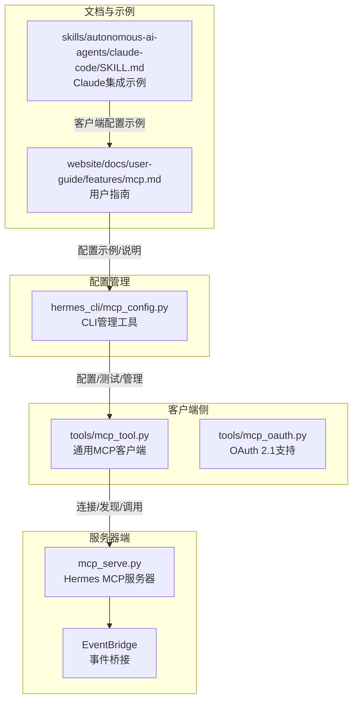
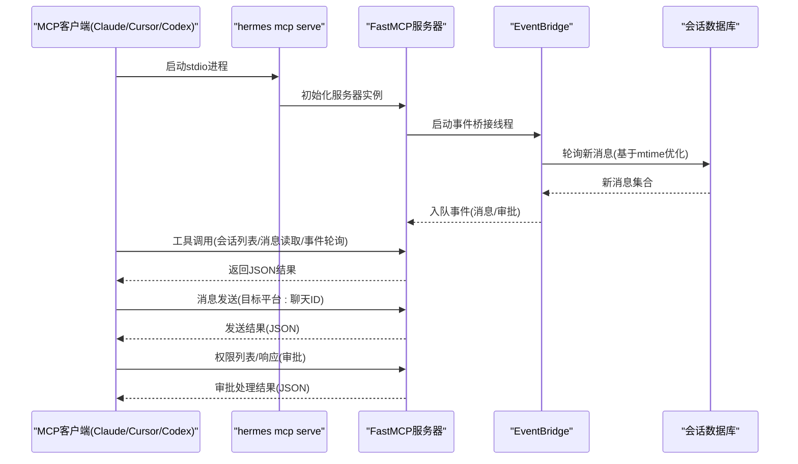
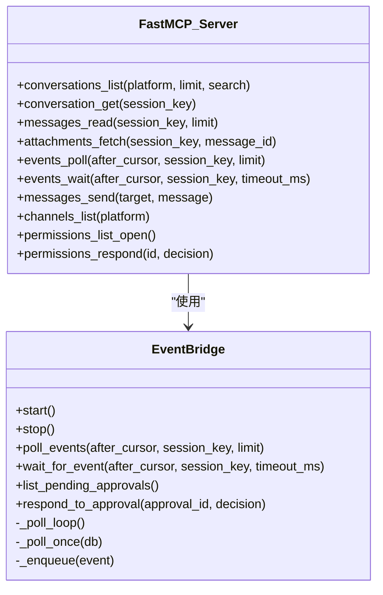
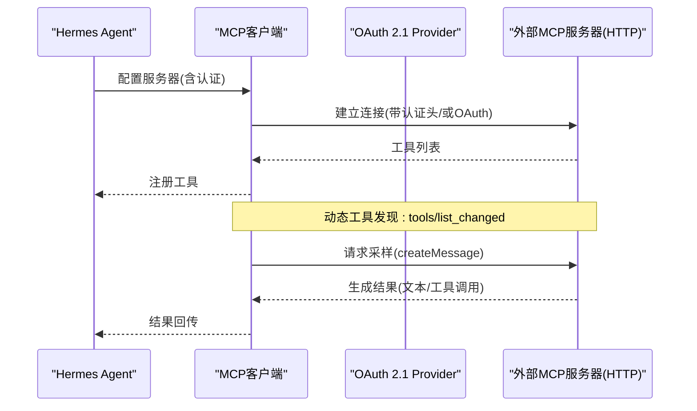
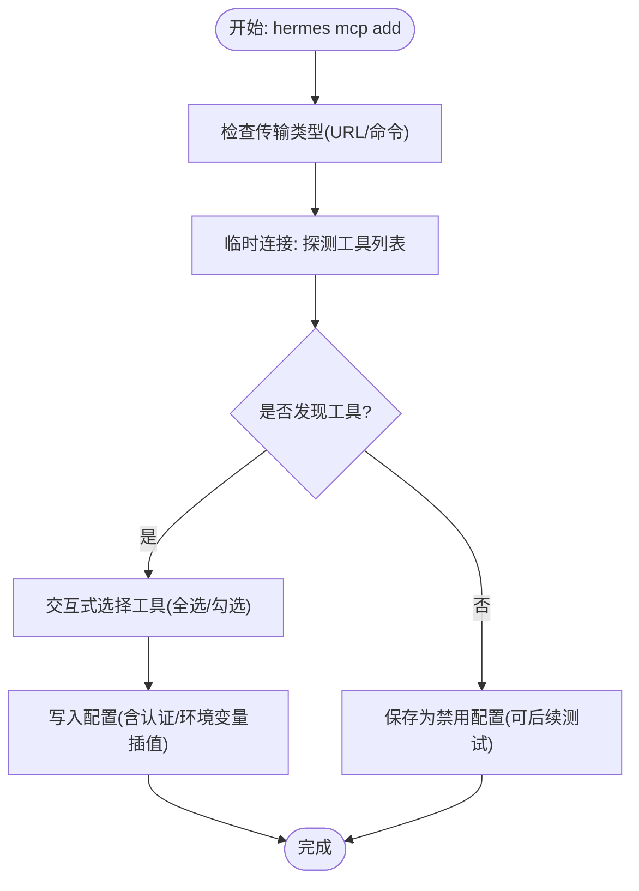
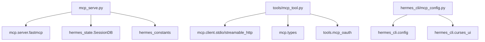

# MCP客户端集成

<cite>
**本文档引用的文件**
- [mcp_serve.py](file://mcp_serve.py)
- [hermes_cli/mcp_config.py](file://hermes_cli/mcp_config.py)
- [website/docs/user-guide/features/mcp.md](file://website/docs/user-guide/features/mcp.md)
- [tools/mcp_tool.py](file://tools/mcp_tool.py)
- [tools/mcp_oauth.py](file://tools/mcp_oauth.py)
- [tests/hermes_cli/test_mcp_config.py](file://tests/hermes_cli/test_mcp_config.py)
- [tests/tools/test_mcp_oauth.py](file://tests/tools/test_mcp_oauth.py)
- [skills/autonomous-ai-agents/claude-code/SKILL.md](file://skills/autonomous-ai-agents/claude-code/SKILL.md)
</cite>

## 目录
1. [简介](#简介)
2. [项目结构](#项目结构)
3. [核心组件](#核心组件)
4. [架构总览](#架构总览)
5. [详细组件分析](#详细组件分析)
6. [依赖关系分析](#依赖关系分析)
7. [性能考虑](#性能考虑)
8. [故障排除指南](#故障排除指南)
9. [结论](#结论)
10. [附录](#附录)

## 简介
本文件面向希望在各类MCP客户端（如Claude Desktop、Cursor、Codex等）中集成并使用Hermes MCP服务器的开发者与运维人员。文档系统性阐述了如何在不同客户端中配置Hermes MCP服务器、连接建立流程、认证机制、消息传递协议、MCP握手与工具发现机制，以及请求/响应格式。同时提供最佳实践、调试技巧与常见问题解决方案，帮助快速落地集成。

## 项目结构
围绕MCP客户端集成的关键模块与文件如下：
- 服务器端：Hermes MCP服务器实现，提供消息会话查询、事件轮询、消息发送、通道列表、权限审批等工具。
- 客户端侧：通用MCP客户端支持、OAuth 2.1认证、工具发现与注册、采样能力等。
- 配置管理：CLI命令行工具用于添加/移除/列出/测试/配置MCP服务器，支持环境变量插值与OAuth令牌清理。
- 文档与示例：用户指南与技能文档中提供了客户端配置示例与使用说明。



**图表来源**
- [mcp_serve.py:431-829](file://mcp_serve.py#L431-L829)
- [tools/mcp_tool.py:1-200](file://tools/mcp_tool.py#L1-L200)
- [tools/mcp_oauth.py:1-120](file://tools/mcp_oauth.py#L1-L120)
- [hermes_cli/mcp_config.py:610-646](file://hermes_cli/mcp_config.py#L610-L646)
- [website/docs/user-guide/features/mcp.md:445-550](file://website/docs/user-guide/features/mcp.md#L445-L550)
- [skills/autonomous-ai-agents/claude-code/SKILL.md:666-691](file://skills/autonomous-ai-agents/claude-code/SKILL.md#L666-L691)

**章节来源**
- [mcp_serve.py:1-868](file://mcp_serve.py#L1-L868)
- [hermes_cli/mcp_config.py:1-646](file://hermes_cli/mcp_config.py#L1-L646)
- [website/docs/user-guide/features/mcp.md:1-550](file://website/docs/user-guide/features/mcp.md#L1-L550)
- [tools/mcp_tool.py:1-200](file://tools/mcp_tool.py#L1-L200)
- [tools/mcp_oauth.py:1-120](file://tools/mcp_oauth.py#L1-L120)
- [skills/autonomous-ai-agents/claude-code/SKILL.md:666-691](file://skills/autonomous-ai-agents/claude-code/SKILL.md#L666-L691)

## 核心组件
- Hermes MCP服务器（stdio）
  - 提供10个工具：会话列表、会话详情、消息读取、附件提取、事件轮询、事件等待、消息发送、通道列表、权限列表、权限响应。
  - 基于事件桥接轮询会话数据库，维护内存事件队列，支持长轮询等待事件。
  - 仅支持stdio传输（当前版本）。
- 通用MCP客户端
  - 支持stdio与HTTP/StreamableHTTP两种传输方式。
  - 自动重连（指数退避，最多5次）、超时控制、凭据清洗、采样能力。
  - 动态工具发现（接收tools/list_changed通知后自动刷新工具集）。
- OAuth 2.1认证
  - 基于浏览器授权码+PKCE流程，动态客户端注册、令牌持久化与自动刷新。
  - 适用于HTTP服务器（URL型）。
- 配置管理CLI
  - 添加/移除/列出/测试/配置MCP服务器；支持环境变量插值与OAuth令牌清理。
  - 工具选择支持全选或交互式勾选。

**章节来源**
- [mcp_serve.py:431-829](file://mcp_serve.py#L431-L829)
- [tools/mcp_tool.py:1-200](file://tools/mcp_tool.py#L1-L200)
- [tools/mcp_oauth.py:1-120](file://tools/mcp_oauth.py#L1-L120)
- [hermes_cli/mcp_config.py:170-338](file://hermes_cli/mcp_config.py#L170-L338)

## 架构总览
下图展示了从MCP客户端到Hermes MCP服务器的完整数据流与交互路径，包括连接建立、工具发现、事件订阅与消息发送。



**图表来源**
- [mcp_serve.py:836-868](file://mcp_serve.py#L836-L868)
- [mcp_serve.py:313-426](file://mcp_serve.py#L313-L426)
- [mcp_serve.py:431-829](file://mcp_serve.py#L431-L829)

## 详细组件分析

### 组件A：Hermes MCP服务器（stdio）
- 工具清单与职责
  - conversations_list/conversation_get/messages_read/attachments_fetch：查询会话与消息历史。
  - events_poll/events_wait：事件轮询与长轮询等待。
  - messages_send：向指定平台发送消息。
  - channels_list：列出可发送的目标通道。
  - permissions_list_open/permissions_respond：列出并响应待审批请求。
- 事件桥接
  - 基于会话索引与SQLite状态库，按文件mtime判断是否需要轮询，避免空转。
  - 内存队列限制与游标管理，支持多会话过滤与超时等待。
- 连接与生命周期
  - 通过异步运行stdio传输，进程由客户端管理；服务启动时开启桥接线程，退出时停止。



**图表来源**
- [mcp_serve.py:185-312](file://mcp_serve.py#L185-L312)
- [mcp_serve.py:431-829](file://mcp_serve.py#L431-L829)

**章节来源**
- [mcp_serve.py:431-829](file://mcp_serve.py#L431-L829)
- [mcp_serve.py:185-312](file://mcp_serve.py#L185-L312)

### 组件B：通用MCP客户端与OAuth认证
- 传输与发现
  - 支持stdio与HTTP/StreamableHTTP；自动重连与超时控制。
  - 动态工具发现：接收tools/list_changed通知后刷新工具集。
- 认证机制
  - OAuth 2.1 PKCE：浏览器授权、动态客户端注册、令牌持久化与自动刷新。
  - Bearer Token：通过Authorization头注入。
- 采样能力
  - MCP服务器可请求LLM生成文本，支持速率限制、超时与工具循环深度限制。



**图表来源**
- [tools/mcp_tool.py:892-922](file://tools/mcp_tool.py#L892-L922)
- [tools/mcp_oauth.py:381-419](file://tools/mcp_oauth.py#L381-L419)

**章节来源**
- [tools/mcp_tool.py:1-200](file://tools/mcp_tool.py#L1-L200)
- [tools/mcp_tool.py:892-922](file://tools/mcp_tool.py#L892-L922)
- [tools/mcp_oauth.py:1-120](file://tools/mcp_oauth.py#L1-L120)
- [tools/mcp_oauth.py:381-419](file://tools/mcp_oauth.py#L381-L419)

### 组件C：配置管理CLI（hermes mcp）
- 子命令与功能
  - add：添加服务器（支持URL或命令），自动探测工具，交互式选择启用工具，保存配置。
  - remove：移除服务器，清理OAuth令牌。
  - list/test/configure：列出、测试连接、重新配置工具集。
- 环境变量插值
  - 对Authorization等敏感字段进行环境变量插值，避免明文存储。
- 错误处理
  - 对异常组进行解包，暴露真实错误原因（如401未授权）。



**图表来源**
- [hermes_cli/mcp_config.py:173-338](file://hermes_cli/mcp_config.py#L173-L338)
- [hermes_cli/mcp_config.py:114-152](file://hermes_cli/mcp_config.py#L114-L152)

**章节来源**
- [hermes_cli/mcp_config.py:170-338](file://hermes_cli/mcp_config.py#L170-L338)
- [hermes_cli/mcp_config.py:503-508](file://hermes_cli/mcp_config.py#L503-L508)

### 组件D：MCP客户端配置示例（Claude Desktop）
- 配置位置
  - Claude Desktop：~/.claude/claude_desktop_config.json
- 配置格式
  - mcpServers.herames：command为hermes，args为["mcp","serve"]。
  - 可根据安装路径调整command为绝对路径。
- 使用场景
  - 在Claude中直接调用Hermes提供的消息工具，实现跨平台消息读取与发送。

```mermaid
flowchart TD
A["编辑 ~/.claude/claude_desktop_config.json"] --> B["添加 mcpServers.hermes"]
B --> C["设置 command: hermes 或绝对路径"]
C --> D["设置 args: [\"mcp\",\"serve\"]"]
D --> E["重启Claude以加载配置"]
E --> F["在Claude中使用Hermes工具"]
```

**图表来源**
- [website/docs/user-guide/features/mcp.md:463-489](file://website/docs/user-guide/features/mcp.md#L463-L489)

**章节来源**
- [website/docs/user-guide/features/mcp.md:449-489](file://website/docs/user-guide/features/mcp.md#L449-L489)

## 依赖关系分析
- 服务器端依赖
  - mcp.server.fastmcp：FastMCP服务器框架。
  - hermes_state.SessionDB：会话数据库访问。
  - hermes_constants：HERMES_HOME路径解析。
- 客户端依赖
  - mcp.client.stdio/streamable_http：传输层。
  - mcp.types：通知与采样类型。
  - tools.mcp_oauth：OAuth 2.1认证。
- 配置管理依赖
  - hermes_cli.config：配置与环境变量读写。
  - curses_ui：交互式工具选择界面。



**图表来源**
- [mcp_serve.py:49-56](file://mcp_serve.py#L49-L56)
- [tools/mcp_tool.py:95-137](file://tools/mcp_tool.py#L95-L137)
- [hermes_cli/mcp_config.py:19-27](file://hermes_cli/mcp_config.py#L19-L27)

**章节来源**
- [mcp_serve.py:49-56](file://mcp_serve.py#L49-L56)
- [tools/mcp_tool.py:95-137](file://tools/mcp_tool.py#L95-L137)
- [hermes_cli/mcp_config.py:19-27](file://hermes_cli/mcp_config.py#L19-L27)

## 性能考虑
- 事件轮询优化
  - 基于sessions.json与state.db的mtime缓存，避免频繁读取数据库。
  - 轮询间隔约200ms，内存队列上限1000条，游标递增保证顺序。
- 工具调用超时
  - 默认工具调用超时120秒，连接超时60秒，可按服务器能力调整。
- 输出大小与令牌限制
  - 工具描述2KB限制，结果默认截断；可通过注解提升最大结果字符数。
  - 可设置最大MCP输出令牌数以防止上下文溢出。

**章节来源**
- [mcp_serve.py:172-174](file://mcp_serve.py#L172-L174)
- [mcp_serve.py:333-358](file://mcp_serve.py#L333-L358)
- [website/docs/user-guide/features/mcp.md:412-444](file://website/docs/user-guide/features/mcp.md#L412-L444)
- [skills/autonomous-ai-agents/claude-code/SKILL.md:666-671](file://skills/autonomous-ai-agents/claude-code/SKILL.md#L666-L671)

## 故障排除指南
- MCP服务器未连接
  - 确认已安装mcp扩展：pip install 'hermes-agent[mcp]'
  - 检查客户端配置中的command与args是否正确指向hermes mcp serve。
- 工具未出现
  - 检查服务器连接状态与工具发现日志。
  - 确认过滤配置（include/exclude）未将所需工具排除。
- OAuth失败
  - 非交互环境且无缓存令牌时需先交互式完成授权。
  - 检查服务器端点是否支持OAuth 2.1与PKCE。
- 权限审批问题
  - 使用permissions_list_open查看待处理审批，permissions_respond进行允许/拒绝。
- CLI测试
  - 使用hermes mcp test <name>验证连接与工具数量。
  - 使用hermes mcp configure <name>重新选择工具集。

**章节来源**
- [website/docs/user-guide/features/mcp.md:377-444](file://website/docs/user-guide/features/mcp.md#L377-L444)
- [hermes_cli/mcp_config.py:440-501](file://hermes_cli/mcp_config.py#L440-L501)
- [tests/hermes_cli/test_mcp_config.py:277-303](file://tests/hermes_cli/test_mcp_config.py#L277-L303)
- [tests/tools/test_mcp_oauth.py:408-433](file://tests/tools/test_mcp_oauth.py#L408-L433)

## 结论
通过本文档，您可以在Claude Desktop、Cursor、Codex等MCP客户端中无缝集成Hermes MCP服务器。服务器提供消息读取、事件订阅与消息发送等核心能力，配合OAuth认证与CLI配置管理，能够满足大多数跨平台消息自动化场景。建议结合性能与安全策略（超时、令牌限制、凭据清洗）进行生产部署，并利用动态工具发现与权限审批机制提升安全性与可用性。

## 附录

### A. MCP协议与握手要点
- 握手与传输
  - stdio：客户端启动服务器进程，通过stdin/stdout通信。
  - HTTP：客户端发起HTTP/StreamableHTTP连接，支持OAuth或Bearer Token。
- 工具发现
  - 服务器启动后返回工具清单；动态变更时接收tools/list_changed通知并刷新。
- 请求/响应格式
  - JSON字符串封装，包含工具名称、参数与返回结果；错误信息中会清洗敏感凭据。

**章节来源**
- [tools/mcp_tool.py:1-200](file://tools/mcp_tool.py#L1-L200)
- [tools/mcp_tool.py:892-922](file://tools/mcp_tool.py#L892-L922)

### B. 客户端配置示例（Claude Desktop）
- claude_desktop_config.json
  - 在mcpServers中添加名为hermes的条目，command为hermes，args为["mcp","serve"]。
  - 若Hermes安装在非标准路径，请使用绝对路径command。

**章节来源**
- [website/docs/user-guide/features/mcp.md:463-489](file://website/docs/user-guide/features/mcp.md#L463-L489)

### C. 最佳实践
- 传输选择
  - 本地低延迟访问优先使用stdio；远程或组织托管使用HTTP。
- 安全配置
  - 使用OAuth 2.1替代静态Bearer Token；严格控制工具白名单。
- 监控与调试
  - 启用--verbose查看服务器端调试日志；使用CLI test命令验证连通性。
- 事件与权限
  - 利用events_poll/events_wait实现实时感知；通过permissions_*工具管理审批。

**章节来源**
- [website/docs/user-guide/features/mcp.md:445-550](file://website/docs/user-guide/features/mcp.md#L445-L550)
- [mcp_serve.py:836-868](file://mcp_serve.py#L836-L868)