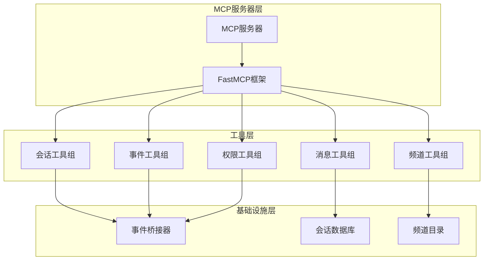
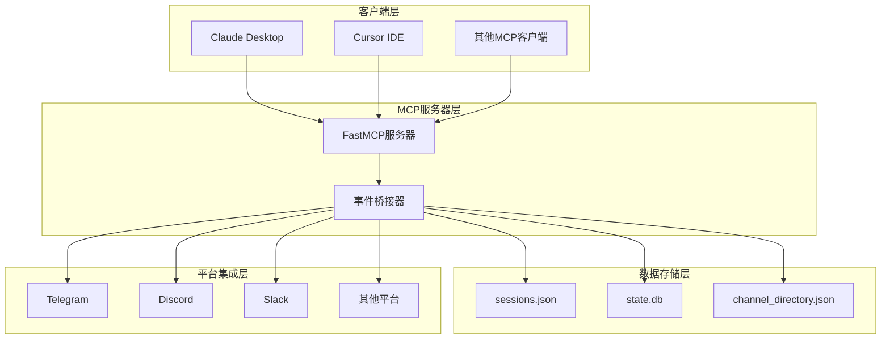
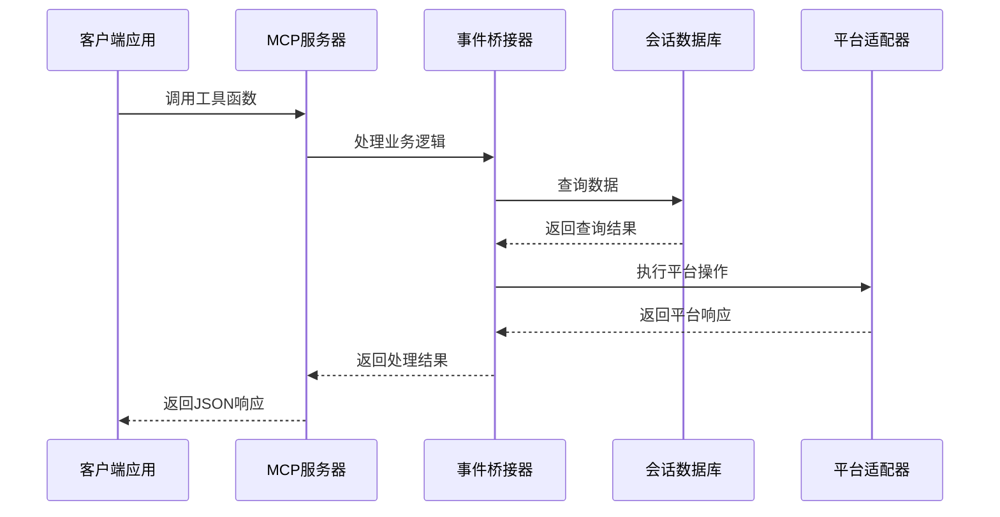
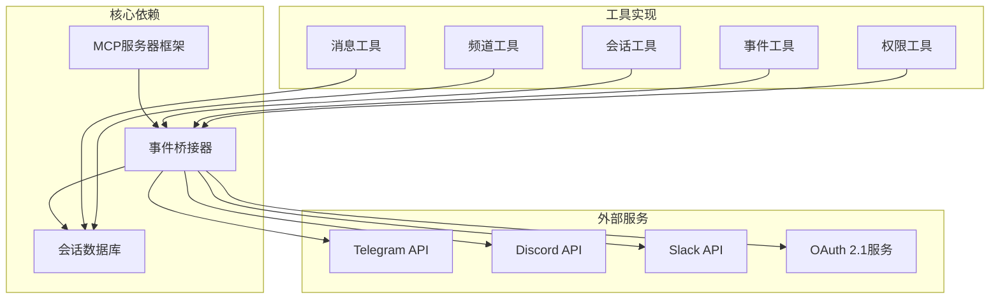
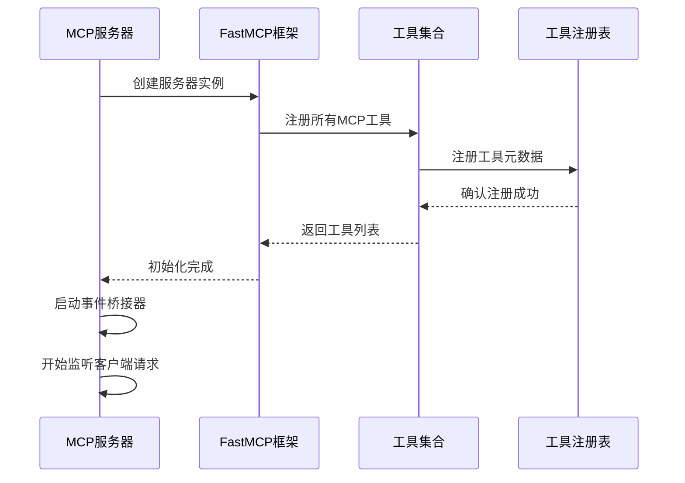

# MCP工具管理

<cite>
**本文档引用的文件**
- [mcp_serve.py](file://mcp_serve.py)
- [test_mcp_serve.py](file://tests/test_mcp_serve.py)
- [mcp_tool.py](file://tools/mcp_tool.py)
- [mcp_oauth.py](file://tools/mcp_oauth.py)
- [mcp_config.py](file://hermes_cli/mcp_config.py)
</cite>

## 目录
1. [简介](#简介)
2. [项目结构](#项目结构)
3. [核心组件](#核心组件)
4. [架构概览](#架构概览)
5. [详细组件分析](#详细组件分析)
6. [依赖关系分析](#依赖关系分析)
7. [性能考虑](#性能考虑)
8. [故障排除指南](#故障排除指南)
9. [结论](#结论)

## 简介

Hermes Agent的MCP（Model Context Protocol）工具管理系统是一个强大的消息桥接系统，它将Hermes Agent与各种通信平台连接起来。该系统提供了9个核心MCP工具，包括conversations_list、conversation_get、messages_read、attachments_fetch、events_poll、events_wait、messages_send、channels_list和permissions相关工具。

该系统的核心功能是：
- 暴露消息会话作为MCP工具供外部客户端使用
- 支持实时事件轮询和等待机制
- 提供跨平台的消息发送能力
- 实现权限管理和审批流程
- 支持动态工具发现和刷新

## 项目结构

MCP工具管理系统主要由以下组件构成：



**图表来源**
- [mcp_serve.py:431-829](file://mcp_serve.py#L431-L829)

**章节来源**
- [mcp_serve.py:1-868](file://mcp_serve.py#L1-L868)

## 核心组件

### MCP服务器架构

MCP服务器采用FastMCP框架构建，提供了完整的MCP协议支持。服务器具有以下关键特性：

- **异步事件循环**：使用独立的后台线程运行事件循环
- **动态工具注册**：支持运行时工具的动态发现和注册
- **自动重连机制**：具备断线重连和指数退避策略
- **安全认证**：支持OAuth 2.1 PKCE和Bearer Token认证

### 工具分类体系

系统将MCP工具分为五大类：

1. **会话管理工具**：conversations_list、conversation_get
2. **消息读取工具**：messages_read、attachments_fetch  
3. **事件监控工具**：events_poll、events_wait
4. **消息发送工具**：messages_send、channels_list
5. **权限管理工具**：permissions_list_open、permissions_respond

**章节来源**
- [mcp_serve.py:452-829](file://mcp_serve.py#L452-L829)

## 架构概览

### 系统架构图



**图表来源**
- [mcp_serve.py:431-868](file://mcp_serve.py#L431-L868)

### 数据流架构



**图表来源**
- [mcp_serve.py:185-426](file://mcp_serve.py#L185-L426)

## 详细组件分析

### 会话管理工具

#### conversations_list 工具

**功能描述**：列出所有活跃的消息会话，支持按平台过滤、名称搜索和限制数量。

**参数规范**：
- `platform` (可选)：平台名称（如telegram、discord、slack）
- `limit` (可选，默认50)：返回的最大会话数
- `search` (可选)：按显示名称或聊天名称搜索

**返回值格式**：
```json
{
  "count": 3,
  "conversations": [
    {
      "session_key": "agent:main:telegram:dm:123456",
      "session_id": "20260329_120000_xyz",
      "platform": "telegram",
      "chat_type": "dm",
      "display_name": "Alice",
      "chat_name": "",
      "user_name": "",
      "updated_at": "2026-03-29T14:30:00"
    }
  ]
}
```

**使用示例**：
```bash
# 列出所有会话
hermes mcp serve
# 在MCP客户端中调用
conversations_list()

# 按平台过滤
conversations_list(platform="telegram")

# 限制数量并搜索
conversations_list(limit=10, search="Alice")
```

**错误处理机制**：
- 会话索引加载失败时返回错误信息
- 参数验证失败时抛出相应异常
- 数据库访问异常时提供降级处理

#### conversation_get 工具

**功能描述**：获取指定会话的详细信息。

**参数规范**：
- `session_key` (必需)：会话键值，来自conversations_list的输出

**返回值格式**：
```json
{
  "session_key": "agent:main:telegram:dm:123456",
  "session_id": "20260329_120000_xyz",
  "platform": "telegram",
  "chat_type": "dm",
  "display_name": "Alice",
  "user_name": "",
  "chat_name": "",
  "chat_id": "123456",
  "thread_id": null,
  "updated_at": "2026-03-29T14:30:00",
  "created_at": "2026-03-29T11:00:00",
  "input_tokens": 50000,
  "output_tokens": 25000,
  "total_tokens": 75000
}
```

**使用示例**：
```python
# 获取特定会话详情
result = conversation_get("agent:main:telegram:dm:123456")
print(f"会话平台: {result['platform']}")
print(f"显示名称: {result['display_name']}")
```

**错误处理机制**：
- 会话不存在时返回明确的错误信息
- 缺少必需参数时抛出异常
- 数据库连接失败时提供降级响应

**章节来源**
- [mcp_serve.py:452-537](file://mcp_serve.py#L452-L537)

### 消息读取工具

#### messages_read 工具

**功能描述**：从指定会话中读取消息历史，按时间顺序返回用户和助手的消息。

**参数规范**：
- `session_key` (必需)：会话键值
- `limit` (可选，默认50)：返回的最大消息数（最新优先）

**返回值格式**：
```json
{
  "session_key": "agent:main:telegram:dm:123456",
  "count": 10,
  "total_in_session": 150,
  "messages": [
    {
      "id": "msg_001",
      "role": "user",
      "content": "你好，请问有什么可以帮助你的吗？",
      "timestamp": "2026-03-29T14:30:00"
    },
    {
      "id": "msg_002", 
      "role": "assistant",
      "content": "你好！我需要了解关于项目的需求。",
      "timestamp": "2026-03-29T14:31:00"
    }
  ]
}
```

**使用示例**：
```python
# 读取最近20条消息
result = messages_read("agent:main:telegram:dm:123456", limit=20)

# 遍历消息
for message in result['messages']:
    print(f"{message['role']}: {message['content'][:100]}...")
```

**错误处理机制**：
- 会话不存在时返回错误
- 数据库不可用时提供降级响应
- 消息提取异常时记录日志并返回部分数据

#### attachments_fetch 工具

**功能描述**：提取指定消息中的非文本附件，包括图片、媒体文件等。

**参数规范**：
- `session_key` (必需)：会话键值
- `message_id` (必需)：消息ID，来自messages_read的输出

**返回值格式**：
```json
{
  "message_id": "msg_001",
  "count": 2,
  "attachments": [
    {
      "type": "image",
      "url": "https://example.com/image.jpg"
    },
    {
      "type": "media",
      "path": "/tmp/screenshot.png"
    }
  ]
}
```

**使用示例**：
```python
# 获取消息附件
result = attachments_fetch("agent:main:telegram:dm:123456", "msg_001")

# 处理不同类型附件
for attachment in result['attachments']:
    if attachment['type'] == 'image':
        download_image(attachment['url'])
    elif attachment['type'] == 'media':
        process_media_file(attachment['path'])
```

**错误处理机制**：
- 消息不存在时返回错误
- 附件提取失败时记录详细信息
- 文件路径解析异常时提供降级处理

**章节来源**
- [mcp_serve.py:541-645](file://mcp_serve.py#L541-L645)

### 事件监控工具

#### events_poll 工具

**功能描述**：轮询自上次游标以来的新事件，支持游标分页和会话过滤。

**参数规范**：
- `after_cursor` (可选，默认0)：返回此游标之后的事件
- `session_key` (可选)：可选的会话键值过滤器
- `limit` (可选，默认20)：最大返回事件数

**返回值格式**：
```json
{
  "events": [
    {
      "cursor": 1,
      "type": "message",
      "session_key": "agent:main:telegram:dm:123456",
      "role": "user",
      "content": "你好",
      "timestamp": "2026-03-29T14:30:00",
      "message_id": "msg_001"
    }
  ],
  "next_cursor": 1
}
```

**使用示例**：
```python
# 初始轮询
result = events_poll()
last_cursor = result['next_cursor']

# 后续轮询
result = events_poll(after_cursor=last_cursor)
```

**错误处理机制**：
- 事件队列为空时返回空数组
- 游标参数验证失败时抛出异常
- 会话过滤无效时返回空结果

#### events_wait 工具

**功能描述**：长轮询等待下一个事件，支持超时控制。

**参数规范**：
- `after_cursor` (可选，默认0)：等待此游标之后的事件
- `session_key` (可选)：可选的会话键值过滤器
- `timeout_ms` (可选，默认30000)：最大等待时间（毫秒，上限5分钟）

**返回值格式**：
```json
{
  "event": {
    "cursor": 1,
    "type": "message",
    "session_key": "agent:main:telegram:dm:123456",
    "role": "user",
    "content": "你好",
    "timestamp": "2026-03-29T14:30:00",
    "message_id": "msg_001"
  }
}

# 或者超时情况
{
  "event": null,
  "reason": "timeout"
}
```

**使用示例**：
```python
# 等待新消息
while True:
    result = events_wait(timeout_ms=60000)  # 60秒超时
    if result['event']:
        handle_new_message(result['event'])
    else:
        print("等待超时，继续监听...")
```

**错误处理机制**：
- 超时控制在5分钟以内
- 事件队列无可用事件时返回超时
- 会话过滤无效时返回空事件

**章节来源**
- [mcp_serve.py:649-700](file://mcp_serve.py#L649-L700)

### 消息发送工具

#### messages_send 工具

**功能描述**：向指定平台的对话发送消息，支持多种目标格式。

**参数规范**：
- `target` (必需)：目标格式为"平台:标识符"
- `message` (必需)：要发送的消息文本

**支持的目标格式**：
- `telegram:6308981865` - 直接使用聊天ID
- `discord:#general` - 使用频道名称（带#前缀）
- `slack:#engineering` - 使用频道名称（带#前缀）

**返回值格式**：
```json
{
  "success": true,
  "platform": "telegram",
  "message_id": "sent_msg_001"
}

# 或者错误情况
{
  "error": "发送失败: 权限不足"
}
```

**使用示例**：
```python
# 发送消息到不同平台
messages_send("telegram:6308981865", "Hello from Hermes!")

messages_send("discord:#general", "System alert: Maintenance scheduled")

messages_send("slack:#engineering", "Deployment completed successfully")
```

**错误处理机制**：
- 缺少必需参数时返回错误
- 消息发送工具不可用时提供降级响应
- 平台适配器异常时记录详细错误信息

#### channels_list 工具

**功能描述**：列出所有可用的消息通道和目标，用于messages_send工具。

**参数规范**：
- `platform` (可选)：按平台名称过滤

**返回值格式**：
```json
{
  "count": 3,
  "channels": [
    {
      "target": "telegram:123456",
      "platform": "telegram",
      "name": "Alice",
      "chat_type": "dm"
    },
    {
      "target": "discord:789",
      "platform": "discord", 
      "name": "General",
      "chat_type": "group"
    }
  ]
}
```

**使用示例**：
```python
# 获取所有可用频道
result = channels_list()
for channel in result['channels']:
    print(f"{channel['target']} - {channel['name']} ({channel['platform']})")

# 按平台过滤
telegram_channels = channels_list(platform="telegram")
```

**错误处理机制**：
- 频道目录文件不存在时回退到会话索引
- 目录解析失败时记录警告并返回部分数据
- 平台过滤无效时返回空结果

**章节来源**
- [mcp_serve.py:703-790](file://mcp_serve.py#L703-L790)

### 权限管理工具

#### permissions_list_open 工具

**功能描述**：列出在当前桥接会话期间观察到的待处理审批请求。

**参数规范**：无

**返回值格式**：
```json
{
  "count": 1,
  "approvals": [
    {
      "id": "app_001",
      "kind": "exec",
      "description": "sudo rm -rf /",
      "session_key": "agent:main:telegram:dm:test",
      "created_at": "2026-03-29T12:00:00"
    }
  ]
}
```

**使用示例**：
```python
# 查看待处理审批
result = permissions_list_open()
for approval in result['approvals']:
    print(f"审批ID: {approval['id']}")
    print(f"类型: {approval['kind']}")
    print(f"描述: {approval['description']}")
```

**错误处理机制**：
- 无待处理审批时返回空列表
- 审批状态管理异常时记录错误
- 会话期间的数据丢失时提供降级处理

#### permissions_respond 工具

**功能描述**：对待处理的审批请求做出响应。

**参数规范**：
- `id` (必需)：来自permissions_list_open的审批ID
- `decision` (必需)：决策类型，必须为以下之一：
  - `allow-once` - 一次性允许
  - `allow-always` - 永久允许  
  - `deny` - 拒绝

**返回值格式**：
```json
{
  "resolved": true,
  "approval_id": "app_001",
  "decision": "allow-once"
}

# 或者错误情况
{
  "error": "审批未找到: app_001"
}
```

**使用示例**：
```python
# 处理审批请求
result = permissions_respond("app_001", "allow-once")
if result.get('resolved'):
    print("审批已处理")
else:
    print(f"处理失败: {result.get('error')}")
```

**错误处理机制**：
- 无效决策类型时返回错误
- 审批ID不存在时提供明确错误
- 决议状态更新失败时记录异常

**章节来源**
- [mcp_serve.py:791-827](file://mcp_serve.py#L791-L827)

## 依赖关系分析

### 组件依赖图



**图表来源**
- [mcp_serve.py:175-426](file://mcp_serve.py#L175-L426)

### 工具注册流程



**图表来源**
- [mcp_serve.py:431-449](file://mcp_serve.py#L431-L449)

**章节来源**
- [mcp_serve.py:831-868](file://mcp_serve.py#L831-L868)

## 性能考虑

### 事件轮询优化

系统采用了智能的事件轮询机制来平衡实时性和性能：

- **文件修改时间检查**：通过检查sessions.json和state.db的mtime来避免不必要的数据库查询
- **内存队列限制**：事件队列最多保持1000个事件，超出时自动清理旧事件
- **轮询间隔优化**：默认200ms轮询间隔，在保证实时性的同时减少系统开销

### 数据库访问优化

- **缓存机制**：会话索引和状态数据库的mtime被缓存，只有在文件变更时才重新加载
- **增量查询**：只查询自上次轮询以来新增的消息，避免全量扫描
- **内容截断**：消息内容在返回前进行截断，减少网络传输开销

### 内存管理

- **事件队列限制**：防止内存无限增长
- **资源清理**：服务器停止时自动清理所有资源
- **连接池管理**：平台API连接的生命周期管理

## 故障排除指南

### 常见问题及解决方案

#### MCP服务器启动失败

**症状**：运行`hermes mcp serve`时报错，提示缺少mcp包

**解决方案**：
```bash
# 安装MCP支持
pip install 'hermes-agent[mcp]'

# 或者安装完整的开发环境
pip install -e .
```

**章节来源**
- [mcp_serve.py:836-844](file://mcp_serve.py#L836-L844)

#### 会话数据加载失败

**症状**：conversations_list或conversation_get返回错误

**排查步骤**：
1. 检查sessions.json文件是否存在且格式正确
2. 验证state.db数据库文件完整性
3. 确认会话索引缓存是否过期

**解决方案**：
```python
# 检查会话目录
sessions_dir = Path.home() / ".hermes" / "sessions"
if not sessions_dir.exists():
    print("会话目录不存在，请初始化Hermes Agent")
```

#### 消息读取异常

**症状**：messages_read返回错误或数据不完整

**排查步骤**：
1. 验证session_key的有效性
2. 检查会话ID对应的数据库表是否存在
3. 确认消息表结构是否正确

**解决方案**：
```python
# 验证会话存在性
entries = _load_sessions_index()
if session_key not in entries:
    raise ValueError(f"会话不存在: {session_key}")
```

#### 事件轮询无响应

**症状**：events_poll和events_wait无法获取新事件

**排查步骤**：
1. 检查EventBridge是否正常启动
2. 验证数据库文件是否有新消息
3. 确认轮询间隔设置合理

**解决方案**：
```python
# 手动触发一次轮询
bridge = EventBridge()
bridge.start()
bridge._poll_once(SessionDB())
```

#### 消息发送失败

**症状**：messages_send返回发送失败错误

**排查步骤**：
1. 验证目标格式是否正确
2. 检查平台适配器配置
3. 确认网络连接正常

**解决方案**：
```python
# 使用channels_list获取有效目标
channels = channels_list()
if channels['count'] == 0:
    print("没有可用的频道，请检查平台连接")
```

**章节来源**
- [tests/test_mcp_serve.py:895-925](file://tests/test_mcp_serve.py#L895-L925)

## 结论

Hermes Agent的MCP工具管理系统提供了一个完整、健壮的消息桥接解决方案。系统的主要优势包括：

### 技术优势
- **模块化设计**：清晰的组件分离和职责划分
- **异步架构**：高效的事件驱动处理模式
- **安全机制**：完善的认证和授权流程
- **容错能力**：强大的错误处理和恢复机制

### 功能特性
- **多平台支持**：统一接口支持Telegram、Discord、Slack等多个平台
- **实时监控**：基于事件的实时消息推送
- **灵活配置**：支持动态工具发现和配置管理
- **扩展性强**：易于添加新的平台和工具

### 最佳实践建议
1. **合理使用轮询**：根据实际需求调整轮询间隔和超时设置
2. **监控系统健康**：定期检查EventBridge和数据库连接状态
3. **错误处理**：在生产环境中实现完善的错误捕获和日志记录
4. **性能优化**：利用缓存机制和增量查询提高系统性能

该系统为开发者提供了一个强大而灵活的消息桥接平台，能够满足各种复杂的通信需求场景。