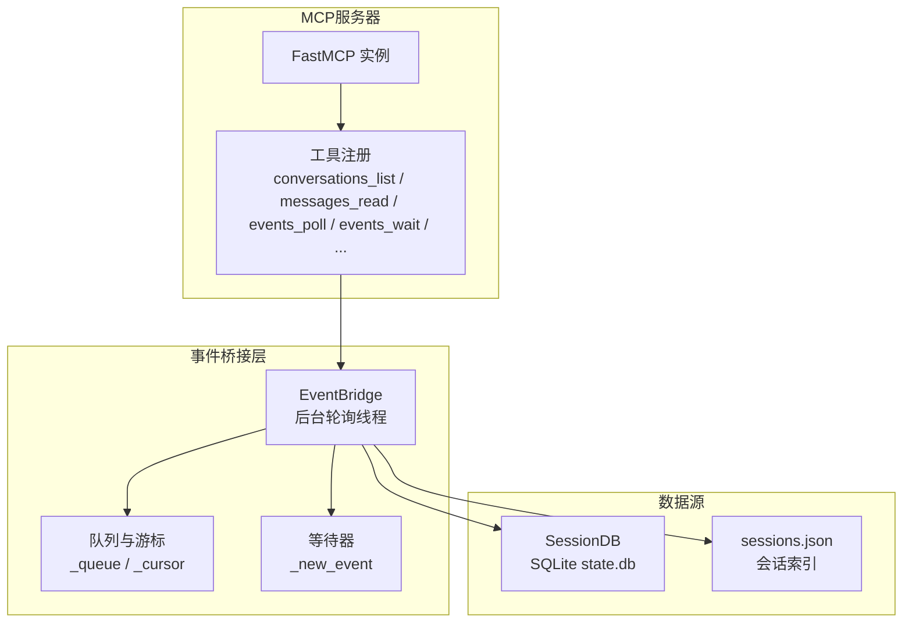
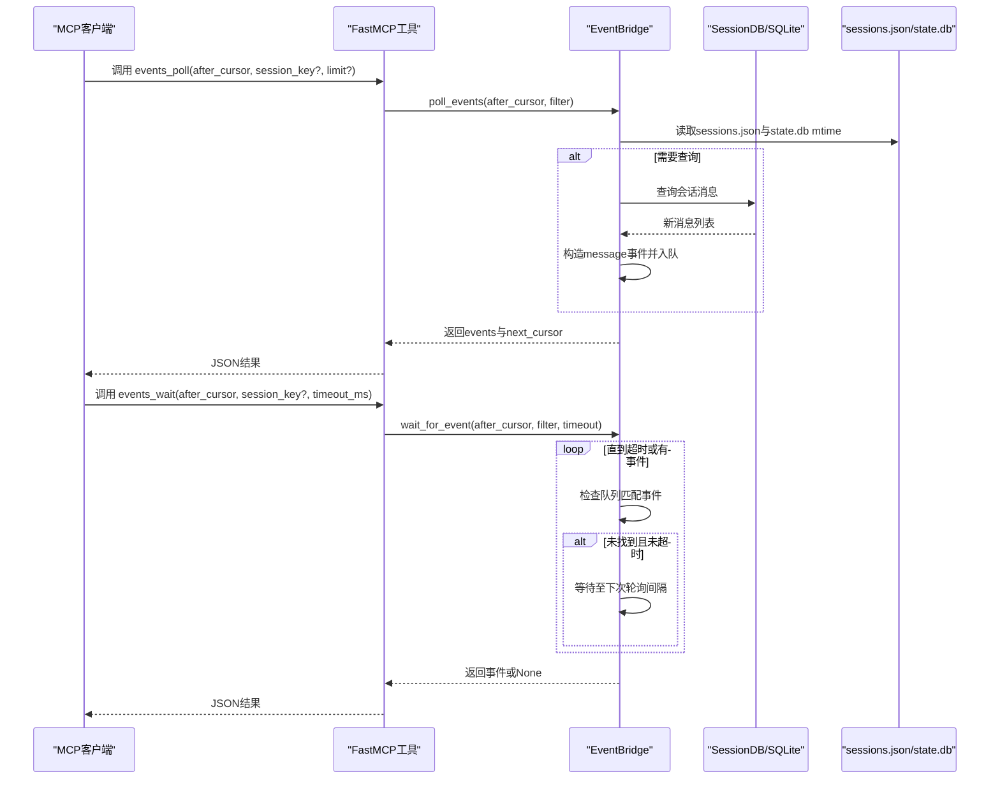
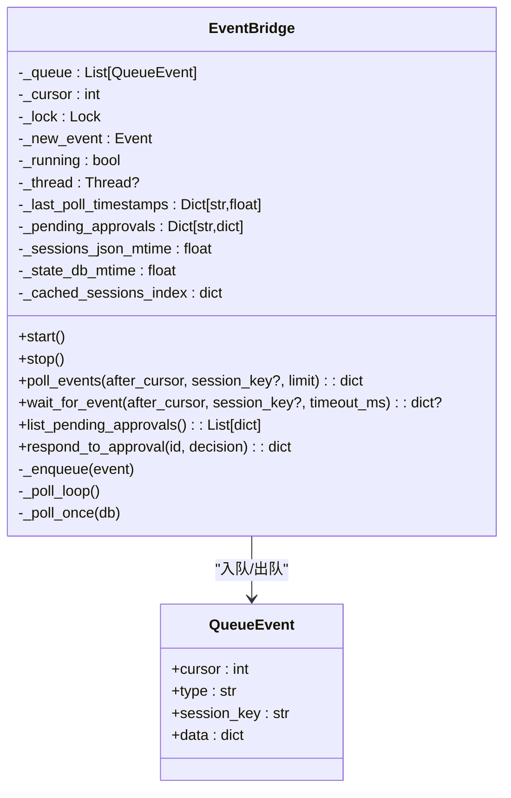
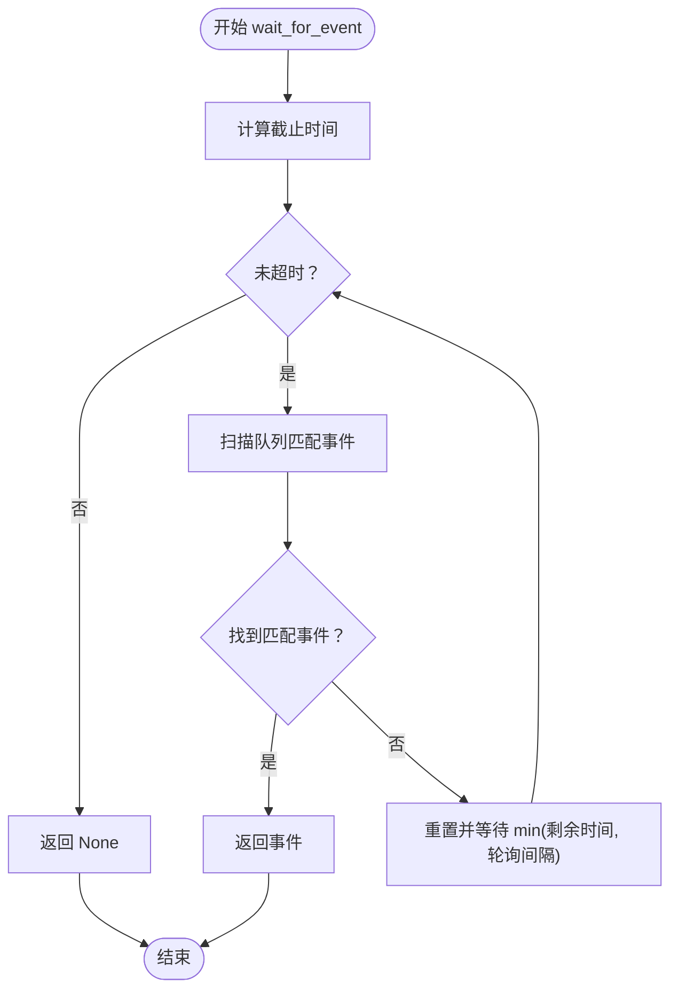
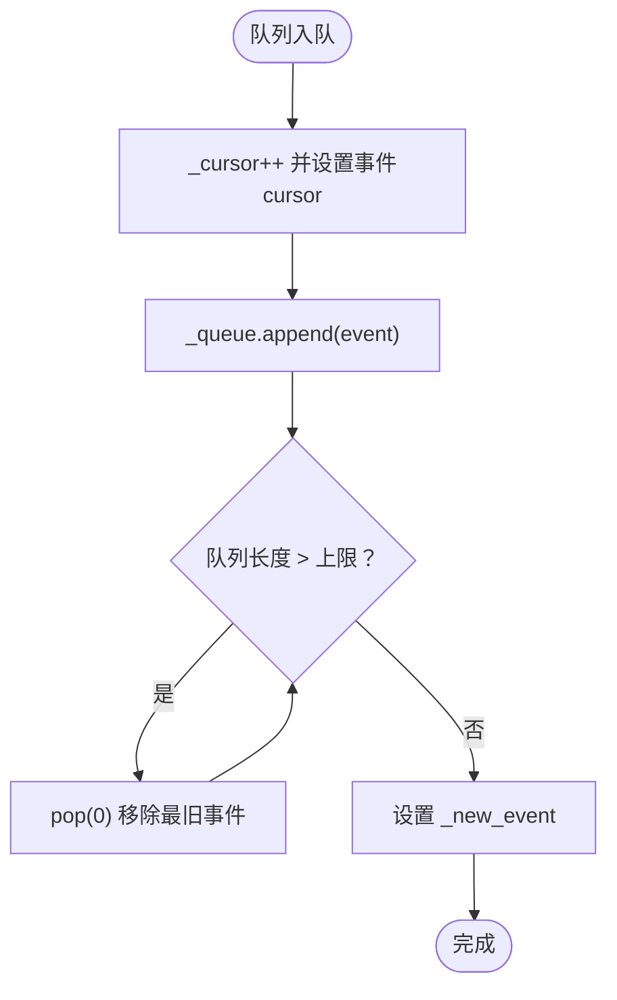
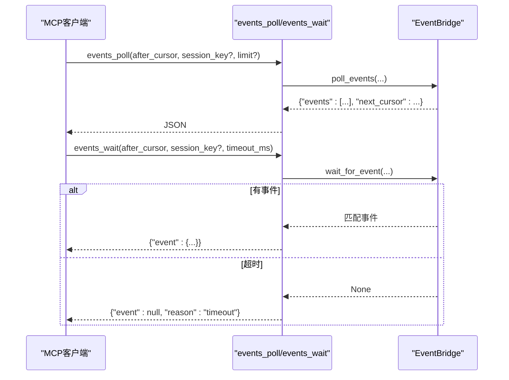
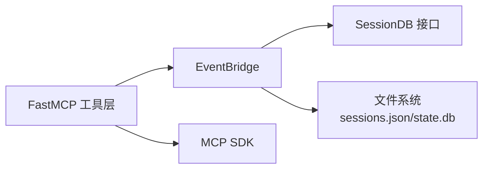

# 事件流工具

<cite>
**本文档引用的文件**
- [mcp_serve.py](file://mcp_serve.py)
- [test_mcp_serve.py](file://tests/test_mcp_serve.py)
- [mcp.md](file://website/docs/user-guide/features/mcp.md)
- [slack.py](file://gateway/platforms/slack.py)
- [approval.py](file://tools/approval.py)
</cite>

## 目录
1. [简介](#简介)
2. [项目结构](#项目结构)
3. [核心组件](#核心组件)
4. [架构总览](#架构总览)
5. [详细组件分析](#详细组件分析)
6. [依赖分析](#依赖分析)
7. [性能考虑](#性能考虑)
8. [故障排除指南](#故障排除指南)
9. [结论](#结论)
10. [附录](#附录)

## 简介
本文件面向Hermes Agent的事件流MCP工具，系统性阐述events_poll与events_wait两个事件处理工具的功能、实现机制与最佳实践。文档覆盖事件桥接系统的架构设计、轮询策略与长轮询实现、事件过滤与游标管理、超时处理、事件类型（message、approval_requested、approval_resolved）说明，并提供实时事件监听的完整示例与最佳实践。同时解释EventBridge类的设计模式与线程安全机制。

## 项目结构
事件流工具位于MCP服务器实现中，围绕EventBridge后台轮询器与FastMCP工具注册展开，通过SQLite会话数据库与sessions.json索引进行消息检测与事件生成。

图表来源
- [mcp_serve.py:431-829](file://mcp_serve.py#L431-L829)

章节来源
- [mcp_serve.py:1-868](file://mcp_serve.py#L1-L868)

## 核心组件
- EventBridge：后台轮询器，负责从SessionDB拉取消息并入队事件，支持游标分页与长轮询等待。
- FastMCP工具：events_poll与events_wait分别提供非阻塞轮询与阻塞等待能力。
- 事件类型：message、approval_requested、approval_resolved。
- 游标系统：基于自增cursor的事件游标，支持after_cursor过滤与next_cursor分页。
- 过滤机制：按session_key过滤单一会话事件。
- 超时控制：events_wait对等待设置超时上限（默认30秒，最大5分钟）。

章节来源
- [mcp_serve.py:176-325](file://mcp_serve.py#L176-L325)
- [mcp_serve.py:647-700](file://mcp_serve.py#L647-L700)

## 架构总览
事件桥接系统采用“轮询+内存队列+游标”的轻量架构：后台线程定期检查sessions.json与state.db变更，发现新消息后构造message事件入队；MCP工具通过游标过滤与分页返回事件；等待工具在无事件时阻塞直到超时或新事件到达。

图表来源
- [mcp_serve.py:225-275](file://mcp_serve.py#L225-L275)
- [mcp_serve.py:313-325](file://mcp_serve.py#L313-L325)
- [mcp_serve.py:647-700](file://mcp_serve.py#L647-L700)

## 详细组件分析

### EventBridge类设计与线程安全
- 设计模式
  - 后台轮询模式：独立守护线程执行周期性轮询，避免阻塞主流程。
  - 内存队列模式：使用列表维护事件队列，配合自增游标实现顺序事件序列。
  - 等待器模式：使用threading.Event协调等待线程与入队操作。
- 关键字段
  - _queue：事件队列，元素为QueueEvent。
  - _cursor：自增游标，保证事件顺序唯一性。
  - _lock：互斥锁，保护队列与游标状态。
  - _new_event：事件通知信号，用于唤醒等待者。
  - _running/_thread：运行状态与后台线程句柄。
  - _last_poll_timestamps：各会话最后轮询时间戳，用于增量检测。
  - _pending_approvals：审批请求缓存（由外部触发approval_resolved）。
  - mtime缓存：_sessions_json_mtime/_state_db_mtime，避免重复查询。
- 线程安全
  - 所有共享状态访问均在临界区内完成（with self._lock）。
  - 入队与出队、游标递增、队列长度修剪均受锁保护。
  - 等待逻辑使用Event与定时等待，避免忙轮询。

图表来源
- [mcp_serve.py:176-325](file://mcp_serve.py#L176-L325)

章节来源
- [mcp_serve.py:185-325](file://mcp_serve.py#L185-L325)

### 轮询策略与长轮询实现
- 轮询策略
  - 周期：固定0.2秒轮询一次。
  - 变更检测：通过sessions.json与state.db的mtime判断是否需要查询。
  - 增量处理：仅对新增消息构造事件，避免重复入队。
- 长轮询实现
  - events_wait在超时前循环检查队列，若未找到匹配事件则等待至下次轮询间隔。
  - 使用deadline与min(remaining, POLL_INTERVAL)确保及时退出与响应。
  - 超时上限：工具层将timeout上限限制在300000ms（5分钟）。

图表来源
- [mcp_serve.py:249-275](file://mcp_serve.py#L249-L275)

章节来源
- [mcp_serve.py:249-275](file://mcp_serve.py#L249-L275)
- [mcp_serve.py:313-325](file://mcp_serve.py#L313-L325)
- [test_mcp_serve.py:666-691](file://tests/test_mcp_serve.py#L666-L691)

### 事件过滤与游标管理
- 游标过滤
  - events_poll根据after_cursor筛选事件，支持session_key过滤与limit限制。
  - 返回next_cursor作为下一页起点，确保客户端可连续拉取。
- 队列修剪
  - 队列长度超过上限（默认1000）时，移除最旧事件，保持内存占用可控。
- 并发安全
  - 所有过滤与截断操作在锁内完成，避免竞态条件。

图表来源
- [mcp_serve.py:302-311](file://mcp_serve.py#L302-L311)

章节来源
- [mcp_serve.py:225-247](file://mcp_serve.py#L225-L247)
- [mcp_serve.py:302-311](file://mcp_serve.py#L302-L311)
- [test_mcp_serve.py:349-355](file://tests/test_mcp_serve.py#L349-L355)

### 事件类型说明
- message
  - 触发时机：检测到新消息（role为user/assistant），内容非空。
  - 数据字段：包含role、content（截断至500字符）、timestamp、message_id。
- approval_requested
  - 触发时机：外部模块（如Slack平台）产生审批请求，EventBridge将其转换为approval_resolved事件。
  - 数据字段：包含审批ID、会话键、描述等。
- approval_resolved
  - 触发时机：调用permissions_respond后，EventBridge生成该事件以通知客户端审批已解决。
  - 数据字段：包含approval_id与decision。

章节来源
- [mcp_serve.py:176-183](file://mcp_serve.py#L176-L183)
- [mcp_serve.py:404-417](file://mcp_serve.py#L404-L417)
- [mcp_serve.py:293-298](file://mcp_serve.py#L293-L298)
- [mcp.md:520](file://website/docs/user-guide/features/mcp.md#L520)

### events_poll与events_wait工具实现
- events_poll
  - 参数：after_cursor（默认0）、session_key（可选）、limit（默认20）。
  - 行为：返回after_cursor之后的事件列表与next_cursor。
- events_wait
  - 参数：after_cursor（默认0）、session_key（可选）、timeout_ms（默认30000，上限5分钟）。
  - 行为：阻塞等待匹配事件，超时返回{"event": None, "reason": "timeout"}。

图表来源
- [mcp_serve.py:647-700](file://mcp_serve.py#L647-L700)
- [mcp_serve.py:225-275](file://mcp_serve.py#L225-L275)

章节来源
- [mcp_serve.py:647-700](file://mcp_serve.py#L647-L700)
- [test_mcp_serve.py:615-664](file://tests/test_mcp_serve.py#L615-L664)
- [test_mcp_serve.py:666-691](file://tests/test_mcp_serve.py#L666-L691)

### 审批事件与approval_resolved生成
- 审批生命周期
  - 外部平台（如Slack）触发审批请求，EventBridge接收并缓存。
  - 客户端调用permissions_respond后，EventBridge生成approval_resolved事件。
- 事件数据
  - approval_id：审批ID。
  - decision：用户决策（allow-once、allow-always、deny）。
  - session_key：关联会话键。

章节来源
- [mcp_serve.py:277-300](file://mcp_serve.py#L277-L300)
- [slack.py:1058-1145](file://gateway/platforms/slack.py#L1058-L1145)
- [approval.py:225-251](file://tools/approval.py#L225-L251)

## 依赖分析
- 组件耦合
  - EventBridge与FastMCP工具强耦合：工具直接调用EventBridge方法。
  - EventBridge与SessionDB/文件系统弱耦合：通过mtime与查询接口交互。
- 外部依赖
  - MCP SDK（FastMCP）：提供工具注册与运行环境。
  - hermes_state.SessionDB：提供消息读取接口。
  - hermes_constants：提供HERMES_HOME路径解析。
- 循环依赖
  - 未发现循环导入；EventBridge仅被工具层调用。

图表来源
- [mcp_serve.py:431-829](file://mcp_serve.py#L431-L829)

章节来源
- [mcp_serve.py:431-829](file://mcp_serve.py#L431-L829)

## 性能考虑
- 轮询间隔与CPU占用
  - 固定0.2秒轮询，开销极低；通过mtime缓存避免重复查询。
- 内存占用
  - 队列上限1000条事件，超出即丢弃最旧事件，防止内存膨胀。
- I/O优化
  - sessions.json与state.db的mtime检查为常数级开销，远小于数据库查询。
- 并发与锁
  - 临界区仅包含队列操作与游标更新，避免长时间持锁。

[本节为通用性能讨论，不涉及具体文件分析]

## 故障排除指南
- 事件未出现
  - 检查sessions.json与state.db是否存在且mtime变化。
  - 确认SessionDB可用且消息role为user/assistant。
- 超时问题
  - events_wait默认超时30秒，最大5分钟；确认客户端正确处理{"reason":"timeout"}。
- 并发问题
  - 多线程入队不会导致数据错乱，但请勿直接修改内部状态。
- 审批事件缺失
  - 确认permissions_respond调用后，EventBridge已生成approval_resolved事件。

章节来源
- [test_mcp_serve.py:666-691](file://tests/test_mcp_serve.py#L666-L691)
- [test_mcp_serve.py:927-1112](file://tests/test_mcp_serve.py#L927-L1112)

## 结论
Hermes Agent的事件流MCP工具以轻量的EventBridge为核心，结合FastMCP工具层，实现了近实时的消息事件推送。通过游标与过滤机制，客户端可稳定地进行增量拉取与长轮询等待；通过mtime缓存与队列修剪，系统在资源占用与实时性之间取得平衡。审批事件的approval_resolved机制完善了授权闭环，适用于多平台集成场景。

[本节为总结性内容，不涉及具体文件分析]

## 附录

### 实时事件监听最佳实践
- 使用events_poll进行短周期轮询，适合批量获取与断点续传。
- 使用events_wait进行长轮询，适合接近实时的监听场景。
- 合理设置after_cursor与session_key，减少无关事件干扰。
- 控制timeout_ms，避免长时间阻塞；在客户端侧实现指数退避重试。
- 对于审批事件，优先使用permissions_list_open与permissions_respond配合approval_resolved。

章节来源
- [mcp.md:501-520](file://website/docs/user-guide/features/mcp.md#L501-L520)
- [mcp_serve.py:647-700](file://mcp_serve.py#L647-L700)