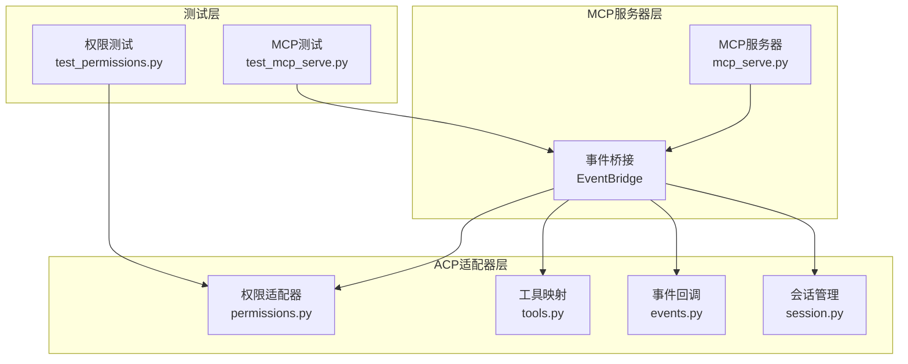
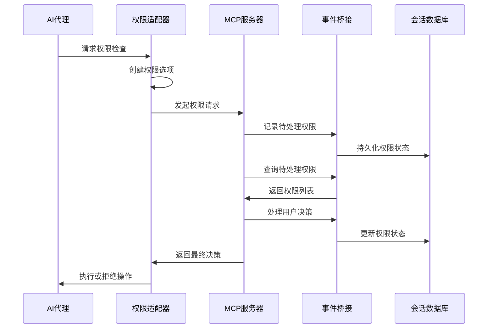
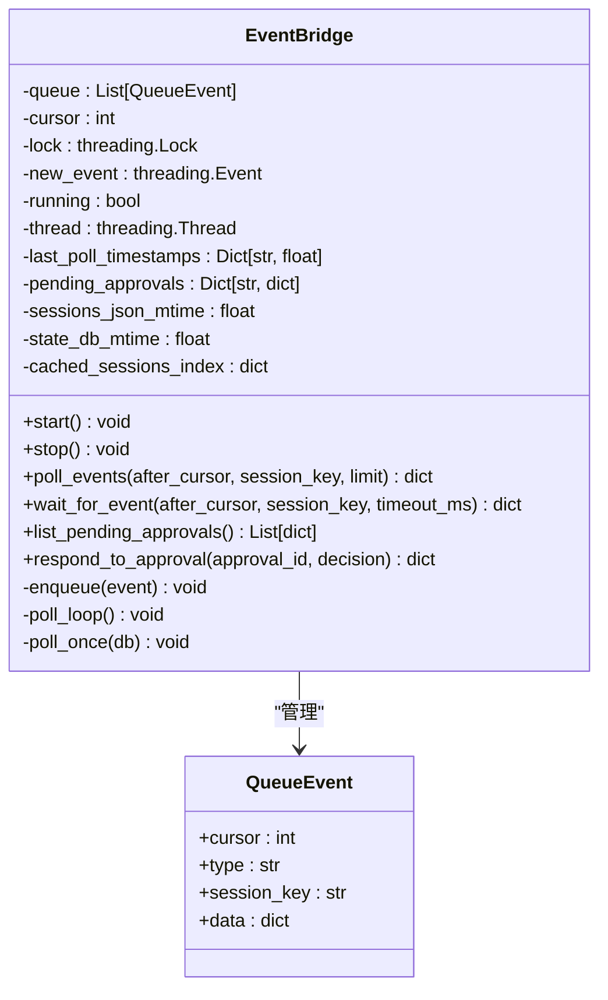
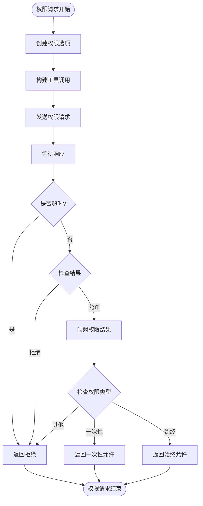
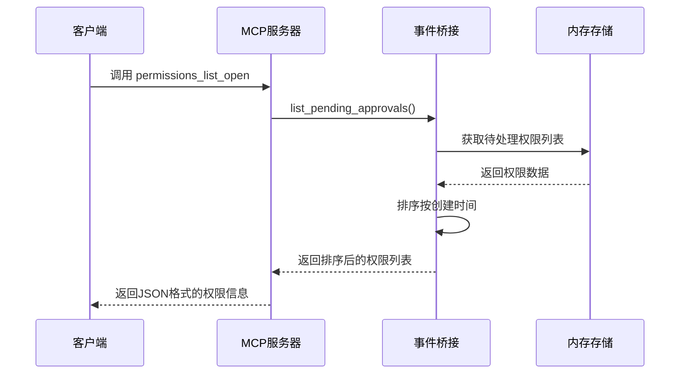
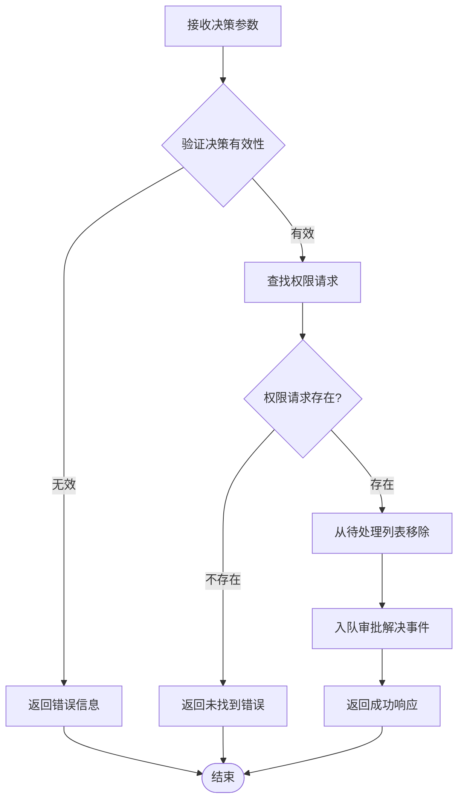
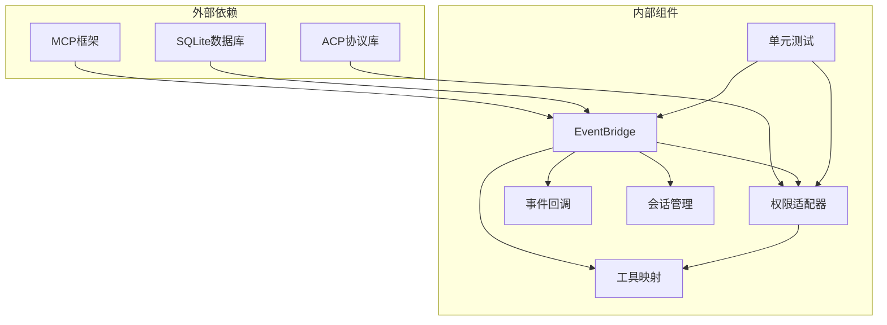

# 权限管理工具

<cite>
**本文档引用的文件**
- [mcp_serve.py](file://mcp_serve.py)
- [permissions.py](file://acp_adapter/permissions.py)
- [tools.py](file://acp_adapter/tools.py)
- [events.py](file://acp_adapter/events.py)
- [session.py](file://acp_adapter/session.py)
- [test_permissions.py](file://tests/acp/test_permissions.py)
- [test_mcp_serve.py](file://tests/test_mcp_serve.py)
</cite>

## 目录
1. [简介](#简介)
2. [项目结构](#项目结构)
3. [核心组件](#核心组件)
4. [架构概览](#架构概览)
5. [详细组件分析](#详细组件分析)
6. [依赖关系分析](#依赖关系分析)
7. [性能考虑](#性能考虑)
8. [故障排除指南](#故障排除指南)
9. [结论](#结论)

## 简介

Hermes Agent的权限管理MCP工具为AI代理提供了细粒度的权限控制机制。该系统通过两个核心工具permissions_list_open和permissions_respond实现了完整的权限生命周期管理，包括权限请求的发现、状态跟踪和响应处理。

权限管理系统集成了ACP（Agent Communication Protocol）适配器，提供了从命令执行到文件操作等各类工具调用的权限验证功能。系统采用事件驱动架构，通过内存队列和数据库轮询实现权限状态的实时同步。

## 项目结构

权限管理工具主要分布在以下模块中：

**图表来源**
- [mcp_serve.py:180-379](file://mcp_serve.py#L180-L379)
- [permissions.py:1-78](file://acp_adapter/permissions.py#L1-L78)
- [tools.py:1-215](file://acp_adapter/tools.py#L1-L215)

**章节来源**
- [mcp_serve.py:790-868](file://mcp_serve.py#L790-L868)
- [permissions.py:1-78](file://acp_adapter/permissions.py#L1-L78)

## 核心组件

### 权限管理工具

系统提供两个核心MCP工具来管理权限生命周期：

#### permissions_list_open 工具
- **功能**：列出当前桥接会话中观察到的所有待处理权限请求
- **作用域**：仅返回当前会话期间的权限请求，历史请求不包含在内
- **输出格式**：JSON对象，包含计数和权限请求数组

#### permissions_respond 工具  
- **功能**：对指定的待处理权限请求做出响应
- **决策类型**：支持"allow-once"、"allow-always"、"deny"三种决策
- **状态管理**：响应后权限请求从待处理列表中移除

### 权限适配器

权限适配器负责将ACP权限请求转换为Hermes兼容的权限回调：

- **映射机制**：将ACP权限选项映射到Hermes权限结果字符串
- **超时处理**：默认60秒超时，超时自动拒绝
- **错误恢复**：异常情况下的安全降级处理

**章节来源**
- [mcp_serve.py:791-829](file://mcp_serve.py#L791-L829)
- [permissions.py:26-77](file://acp_adapter/permissions.py#L26-L77)

## 架构概览

权限管理系统采用分层架构设计，实现了从底层事件捕获到上层工具调用的完整权限控制链路：

**图表来源**
- [mcp_serve.py:277-300](file://mcp_serve.py#L277-L300)
- [permissions.py:43-76](file://acp_adapter/permissions.py#L43-L76)

## 详细组件分析

### EventBridge 类分析

EventBridge是权限管理系统的核心协调器，负责监控会话数据库变化并维护权限状态：

**图表来源**
- [mcp_serve.py:184-379](file://mcp_serve.py#L184-L379)

#### 权限生命周期管理

权限请求的完整生命周期包括以下阶段：

1. **请求生成**：当AI代理尝试执行需要权限的工具时触发
2. **状态跟踪**：权限请求被添加到待处理字典中
3. **状态查询**：通过MCP工具查询当前所有待处理权限
4. **决策处理**：用户通过MCP工具提交权限决策
5. **状态更新**：权限状态根据决策进行更新
6. **清理回收**：已处理的权限请求从待处理列表中移除

### 权限适配器分析

权限适配器实现了从ACP权限系统到Hermes权限系统的无缝转换：

**图表来源**
- [permissions.py:43-76](file://acp_adapter/permissions.py#L43-L76)

**章节来源**
- [permissions.py:17-23](file://acp_adapter/permissions.py#L17-L23)
- [permissions.py:43-76](file://acp_adapter/permissions.py#L43-L76)

### MCP工具接口分析

MCP服务器提供了两个专门的权限管理工具：

#### permissions_list_open 工具实现

该工具负责返回当前会话中的所有待处理权限请求：

**图表来源**
- [mcp_serve.py:793-805](file://mcp_serve.py#L793-L805)
- [mcp_serve.py:277-283](file://mcp_serve.py#L277-L283)

#### permissions_respond 工具实现

该工具处理用户的权限决策：

**图表来源**
- [mcp_serve.py:809-827](file://mcp_serve.py#L809-L827)
- [mcp_serve.py:285-300](file://mcp_serve.py#L285-L300)

**章节来源**
- [mcp_serve.py:791-829](file://mcp_serve.py#L791-L829)

## 依赖关系分析

权限管理系统各组件之间的依赖关系如下：

**图表来源**
- [mcp_serve.py:184-379](file://mcp_serve.py#L184-L379)
- [permissions.py:10-13](file://acp_adapter/permissions.py#L10-L13)

### 关键依赖特性

1. **异步事件处理**：使用asyncio和线程池实现非阻塞权限检查
2. **内存缓存优化**：通过mtime检查避免不必要的数据库轮询
3. **线程安全保证**：使用锁机制确保并发访问的安全性
4. **持久化状态**：通过会话数据库实现权限状态的持久化

**章节来源**
- [mcp_serve.py:313-325](file://mcp_serve.py#L313-L325)
- [permissions.py:59-64](file://acp_adapter/permissions.py#L59-L64)

## 性能考虑

权限管理系统在设计时充分考虑了性能优化：

### 数据库轮询优化
- **mtime缓存**：通过文件修改时间戳避免重复读取数据库
- **智能轮询**：200ms轮询间隔，实际工作中基本为零开销
- **索引缓存**：会话索引数据缓存减少文件系统访问

### 内存管理优化
- **队列限制**：事件队列最大长度限制防止内存泄漏
- **批量处理**：支持批量事件处理提高吞吐量
- **延迟初始化**：组件按需初始化，减少启动时间

### 并发处理优化
- **无锁数据结构**：在读多写少场景下使用优化的数据结构
- **异步I/O**：使用异步操作避免阻塞主线程
- **连接池**：数据库连接复用减少连接开销

## 故障排除指南

### 常见问题及解决方案

#### 权限请求超时
**症状**：权限请求在60秒内没有得到响应自动拒绝
**原因**：ACP客户端无响应或网络问题
**解决方案**：
1. 检查ACP客户端连接状态
2. 增加权限请求超时时间
3. 验证权限适配器配置

#### 权限状态不同步
**症状**：MCP工具显示的权限状态与实际不符
**原因**：事件桥接轮询失败或数据库连接问题
**解决方案**：
1. 检查会话数据库状态
2. 验证事件桥接线程运行状态
3. 查看日志中的轮询错误信息

#### 决策处理失败
**症状**：permissions_respond工具返回错误
**原因**：权限ID不存在或决策格式不正确
**解决方案**：
1. 使用permissions_list_open确认权限ID
2. 验证决策参数格式
3. 检查权限状态是否已被处理

**章节来源**
- [permissions.py:62-64](file://acp_adapter/permissions.py#L62-L64)
- [mcp_serve.py:290-291](file://mcp_serve.py#L290-L291)

## 结论

Hermes Agent的权限管理MCP工具提供了一个完整、安全且高效的权限控制系统。通过permissions_list_open和permissions_respond两个核心工具，系统实现了从权限请求到决策处理的全生命周期管理。

系统的主要优势包括：
- **安全性**：细粒度的权限控制，防止危险操作
- **可观测性**：完整的权限状态跟踪和审计
- **可用性**：简洁的MCP工具接口，易于集成
- **性能**：优化的数据库轮询和内存管理
- **可靠性**：完善的错误处理和故障恢复机制

该权限管理系统为Hermes Agent提供了坚实的安全基础，确保AI代理在执行各种工具调用时始终处于受控状态。