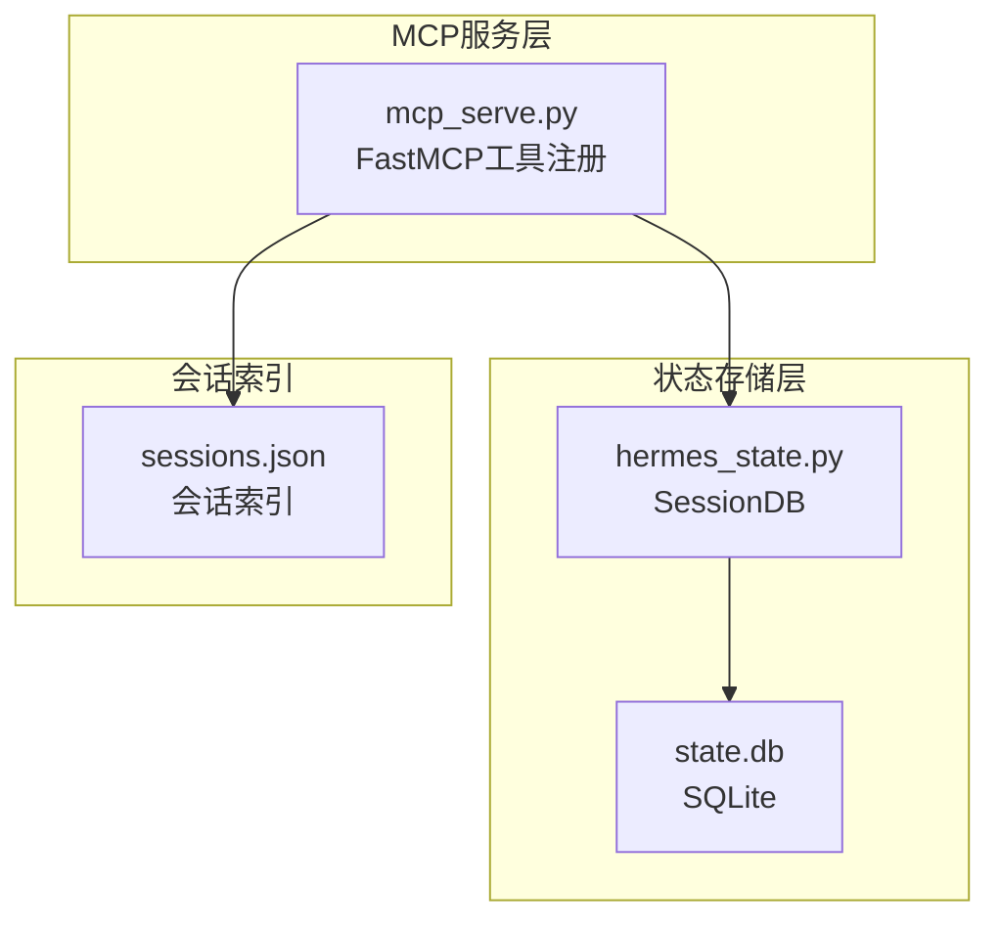
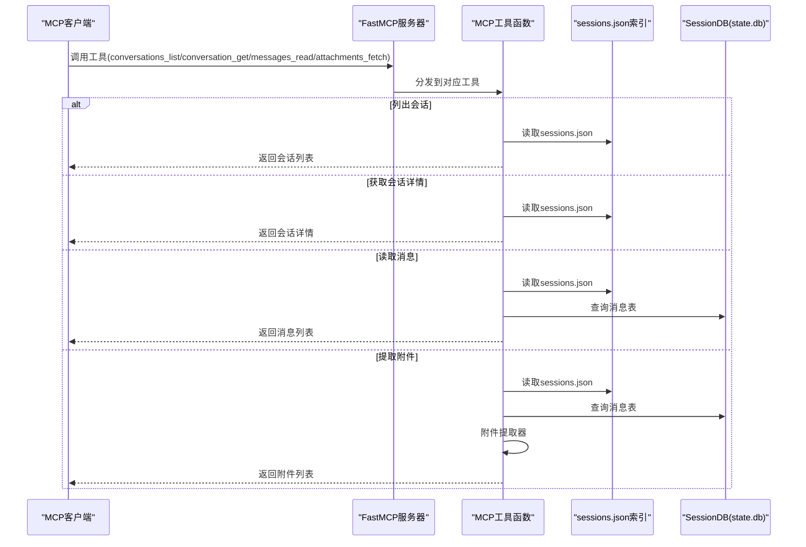
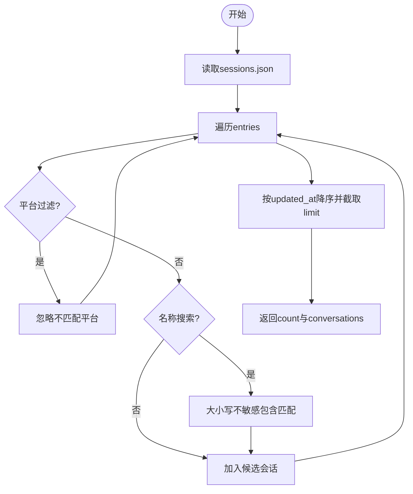
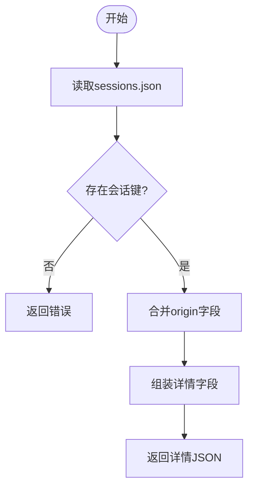
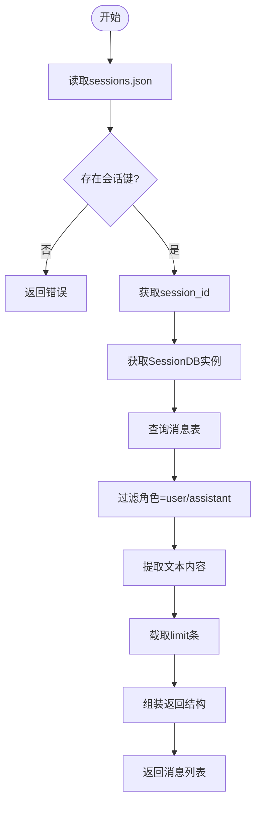
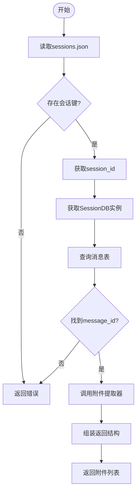
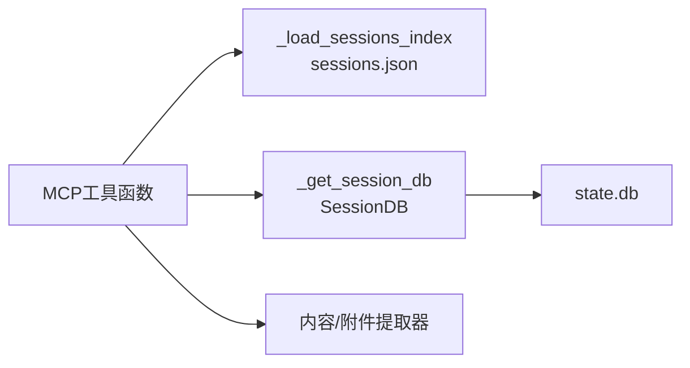

# 核心消息工具

<cite>
**本文引用的文件列表**
- [mcp_serve.py](file://mcp_serve.py)
- [test_mcp_serve.py](file://tests/test_mcp_serve.py)
- [hermes_state.py](file://hermes_state.py)
</cite>

## 目录
1. [简介](#简介)
2. [项目结构与入口](#项目结构与入口)
3. [核心组件总览](#核心组件总览)
4. [架构概览](#架构概览)
5. [详细组件分析](#详细组件分析)
6. [依赖关系分析](#依赖关系分析)
7. [性能考量](#性能考量)
8. [故障排查指南](#故障排查指南)
9. [结论](#结论)
10. [附录：使用示例与最佳实践](#附录使用示例与最佳实践)

## 简介
本文件面向Hermes Agent的MCP（Model Context Protocol）消息桥接工具，聚焦于四个核心工具：
- conversations_list：列出活跃会话并返回会话键与基础元信息
- conversation_get：按会话键获取会话详情（含平台、聊天类型、名称、令牌用量等）
- messages_read：读取指定会话的消息历史（按时间排序，过滤非文本内容块）
- attachments_fetch：从指定消息中提取非文本附件（图片、媒体路径等）

文档将系统阐述各工具的参数校验、数据提取与结果格式化流程，解释工具间的协作与数据流，并给出错误处理策略与性能优化建议，覆盖会话索引加载、消息数据库查询与附件解析的具体实现细节。

## 项目结构与入口
- MCP服务器入口在mcp_serve.py中定义，通过FastMCP注册工具函数，暴露conversations_list、conversation_get、messages_read、attachments_fetch等工具。
- 会话索引sessions.json由mcp_serve.py直接读取，避免导入重型会话存储模块。
- 消息数据库查询由hermes_state.py中的SessionDB类提供，支持并发访问与写入重试策略。

图表来源
- [mcp_serve.py:431-829](file://mcp_serve.py#L431-L829)
- [hermes_state.py:115-161](file://hermes_state.py#L115-L161)

章节来源
- [mcp_serve.py:431-829](file://mcp_serve.py#L431-L829)
- [hermes_state.py:115-161](file://hermes_state.py#L115-L161)

## 核心组件总览
- conversations_list：从sessions.json加载会话索引，支持平台过滤、名称搜索与数量限制；按updated_at降序返回会话列表。
- conversation_get：基于会话键检索索引条目，返回平台、聊天类型、显示名、用户名、聊天名、线程ID、更新/创建时间及令牌用量统计。
- messages_read：根据会话键定位session_id，查询SessionDB的消息表，过滤角色为user/assistant且有可提取文本的内容，按时间截断limit条，返回消息数组。
- attachments_fetch：在messages_read基础上，定位目标消息，调用附件提取器提取非文本附件（多段内容中的图片/文件、文本中的MEDIA标签等），返回附件清单。

章节来源
- [mcp_serve.py:452-504](file://mcp_serve.py#L452-L504)
- [mcp_serve.py:508-537](file://mcp_serve.py#L508-L537)
- [mcp_serve.py:541-593](file://mcp_serve.py#L541-L593)
- [mcp_serve.py:597-645](file://mcp_serve.py#L597-L645)

## 架构概览
下图展示了MCP工具在运行时的调用链路与数据来源：

图表来源
- [mcp_serve.py:452-645](file://mcp_serve.py#L452-L645)
- [hermes_state.py:932-949](file://hermes_state.py#L932-L949)

## 详细组件分析

### conversations_list 工具
- 功能：列出活跃会话，支持平台过滤、名称搜索与数量限制，按updated_at降序返回。
- 参数校验与处理：
  - platform：大小写不敏感匹配
  - search：对display_name、chat_name、session_key进行大小写不敏感包含匹配
  - limit：整数限制返回数量
- 数据提取：
  - 从sessions.json读取entries，遍历并筛选
  - 合并origin字段中的平台/聊天名等信息
- 结果格式化：
  - 返回count与conversations数组，每项包含session_key、session_id、platform、chat_type、display_name、chat_name、user_name、updated_at

图表来源
- [mcp_serve.py:452-504](file://mcp_serve.py#L452-L504)

章节来源
- [mcp_serve.py:452-504](file://mcp_serve.py#L452-L504)

### conversation_get 工具
- 功能：按会话键获取会话详情。
- 参数校验与处理：
  - session_key：必需
- 数据提取：
  - 从sessions.json读取entry，合并origin字段
- 结果格式化：
  - 返回session_key、session_id、platform、chat_type、display_name、user_name、chat_name、chat_id、thread_id、updated_at、created_at、input_tokens、output_tokens、total_tokens

图表来源
- [mcp_serve.py:508-537](file://mcp_serve.py#L508-L537)

章节来源
- [mcp_serve.py:508-537](file://mcp_serve.py#L508-L537)

### messages_read 工具
- 功能：读取指定会话最近的消息历史，按时间排序，仅保留user/assistant角色且可提取文本的内容。
- 参数校验与处理：
  - session_key：必需
  - limit：默认50，整数
- 数据提取：
  - 从sessions.json获取session_id
  - 通过SessionDB.get_messages(session_id)查询消息表
  - 过滤角色为user/assistant且content可提取文本
  - 截取最新limit条
- 结果格式化：
  - 返回session_key、count、total_in_session与messages数组，每项包含id、role、content、timestamp

图表来源
- [mcp_serve.py:541-593](file://mcp_serve.py#L541-L593)
- [hermes_state.py:932-949](file://hermes_state.py#L932-L949)

章节来源
- [mcp_serve.py:541-593](file://mcp_serve.py#L541-L593)
- [hermes_state.py:932-949](file://hermes_state.py#L932-L949)

### attachments_fetch 工具
- 功能：从指定消息中提取非文本附件（图片URL、文件块、MEDIA标签等）。
- 参数校验与处理：
  - session_key：必需
  - message_id：必需
- 数据提取：
  - 从sessions.json获取session_id
  - 通过SessionDB.get_messages(session_id)查询消息表
  - 定位目标消息
  - 使用附件提取器提取非文本附件
- 结果格式化：
  - 返回message_id、count与attachments数组，每项包含type与具体数据（如url或path）

图表来源
- [mcp_serve.py:597-645](file://mcp_serve.py#L597-L645)
- [hermes_state.py:932-949](file://hermes_state.py#L932-L949)

章节来源
- [mcp_serve.py:597-645](file://mcp_serve.py#L597-L645)
- [hermes_state.py:932-949](file://hermes_state.py#L932-L949)

## 依赖关系分析
- 工具函数依赖：
  - sessions.json：会话索引，提供会话键到会话ID与平台信息的映射
  - SessionDB：消息数据库接口，提供消息查询与写入能力
- 内部依赖：
  - _load_sessions_index：直接读取sessions.json，避免导入重型会话存储模块
  - _get_session_db：延迟初始化SessionDB，异常时返回None
  - _extract_message_content：统一从多段内容中提取文本
  - _extract_attachments：统一从消息中提取非文本附件

图表来源
- [mcp_serve.py:81-95](file://mcp_serve.py#L81-L95)
- [mcp_serve.py:71-79](file://mcp_serve.py#L71-L79)
- [mcp_serve.py:118-165](file://mcp_serve.py#L118-L165)

章节来源
- [mcp_serve.py:81-95](file://mcp_serve.py#L81-L95)
- [mcp_serve.py:71-79](file://mcp_serve.py#L71-L79)
- [mcp_serve.py:118-165](file://mcp_serve.py#L118-L165)

## 性能考量
- 会话索引加载：
  - sessions.json直接读取，避免导入重型会话存储模块，减少启动开销
  - 对sessions.json与state.db采用mtime缓存，轮询时跳过无变更的检查，降低IO压力
- 消息数据库查询：
  - SessionDB使用WAL模式与行级锁，写入采用应用层随机抖动重试，避免SQLite内置忙等待导致的“车队效应”
  - 读取消息时按timestamp/id排序，索引idx_messages_session加速查询
- 附件提取：
  - 附件提取器对多段内容与文本中的MEDIA标签进行快速扫描，复杂度与消息长度线性相关
- 工具调用：
  - conversations_list支持limit与搜索，避免一次性返回过多数据
  - messages_read支持limit裁剪，控制单次响应大小

章节来源
- [mcp_serve.py:333-357](file://mcp_serve.py#L333-L357)
- [mcp_serve.py:168-175](file://mcp_serve.py#L168-L175)
- [hermes_state.py:144-156](file://hermes_state.py#L144-L156)
- [hermes_state.py:180-214](file://hermes_state.py#L180-L214)
- [hermes_state.py:932-949](file://hermes_state.py#L932-L949)

## 故障排查指南
- 会话不存在：
  - conversations_list/conversation_get/messages_read/attachments_fetch在找不到会话键时返回错误
- 会话ID缺失：
  - messages_read/attachments_fetch在会话条目缺少session_id时返回错误
- 数据库不可用：
  - messages_read/attachments_fetch在SessionDB不可用时返回错误
- 消息查询失败：
  - messages_read/attachments_fetch在查询消息时抛出异常返回错误
- 附件不存在：
  - attachments_fetch在找不到目标message_id时返回错误

章节来源
- [mcp_serve.py:518-519](file://mcp_serve.py#L518-L519)
- [mcp_serve.py:561-562](file://mcp_serve.py#L561-L562)
- [mcp_serve.py:617-618](file://mcp_serve.py#L617-L618)
- [mcp_serve.py:570-571](file://mcp_serve.py#L570-L571)
- [mcp_serve.py:626-627](file://mcp_serve.py#L626-L627)
- [mcp_serve.py:637-637](file://mcp_serve.py#L637-L637)

## 结论
本文系统梳理了Hermes Agent MCP消息桥接的四个核心工具：conversations_list、conversation_get、messages_read与attachments_fetch。通过对参数校验、数据提取与结果格式化的逐项分析，结合会话索引加载、消息数据库查询与附件解析的实现细节，提供了清晰的工具协作关系与数据流图。同时，文档总结了错误处理策略与性能优化建议，便于在实际部署中稳定运行与高效扩展。

## 附录：使用示例与最佳实践
- 获取会话列表并按平台过滤
  - 调用conversations_list，传入platform参数以筛选特定平台
  - 可配合search参数按显示名/聊天名过滤
  - 使用limit限制返回数量
- 读取会话详情
  - 使用conversations_list返回的session_key调用conversation_get
  - 获取平台、聊天类型、显示名、用户名、聊天名、线程ID、更新/创建时间与令牌用量
- 读取消息历史
  - 先调用conversations_list获取session_key
  - 再调用messages_read，传入session_key与可选limit
  - 注意：仅返回user/assistant角色且可提取文本的内容
- 提取附件
  - 先调用messages_read获取消息ID列表
  - 再调用attachments_fetch，传入session_key与目标message_id
  - 支持从多段内容与文本中的MEDIA标签提取附件

章节来源
- [test_mcp_serve.py:472-515](file://tests/test_mcp_serve.py#L472-L515)
- [test_mcp_serve.py:517-532](file://tests/test_mcp_serve.py#L517-L532)
- [test_mcp_serve.py:534-574](file://tests/test_mcp_serve.py#L534-L574)
- [test_mcp_serve.py:576-613](file://tests/test_mcp_serve.py#L576-L613)