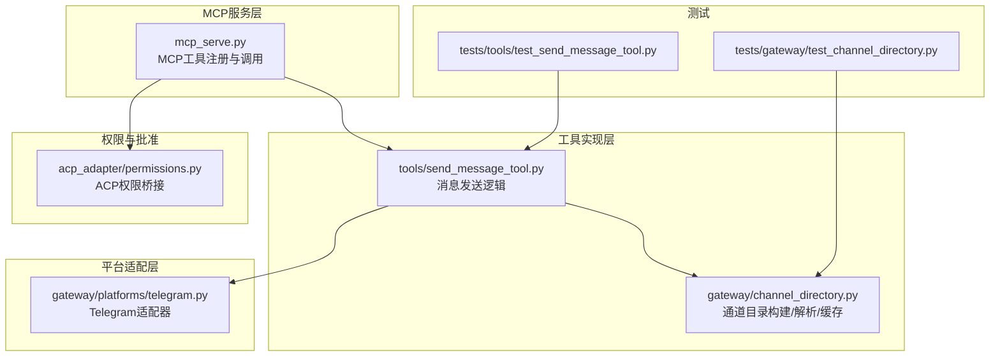
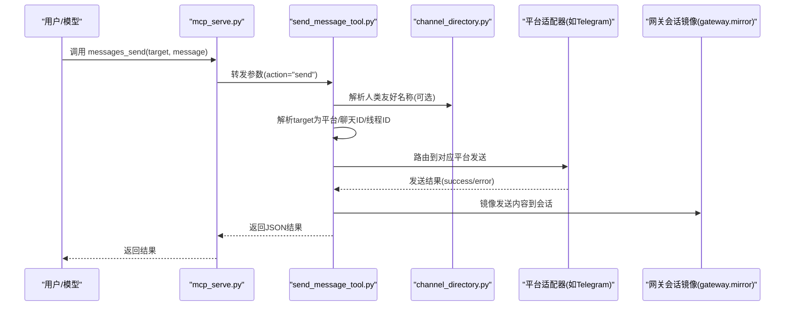
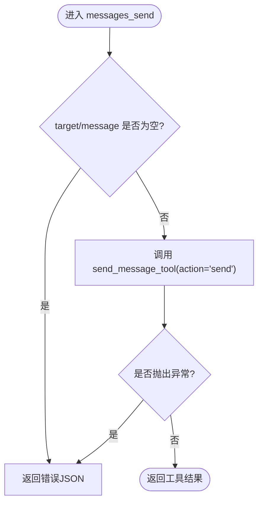
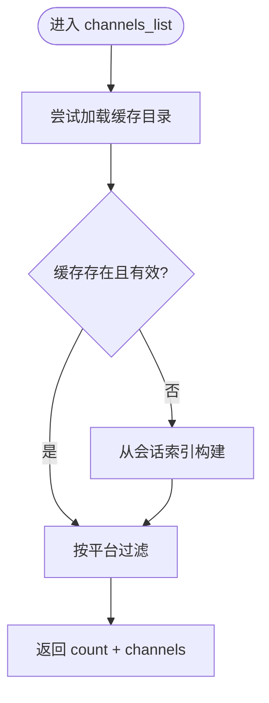
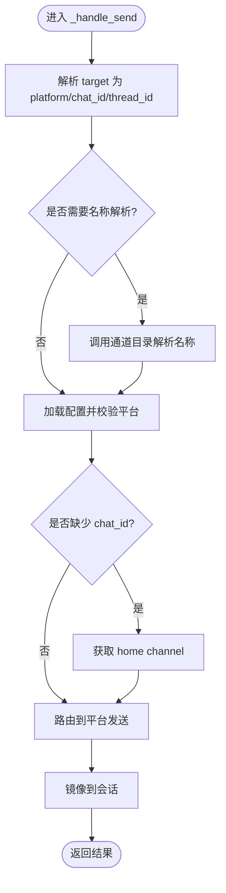
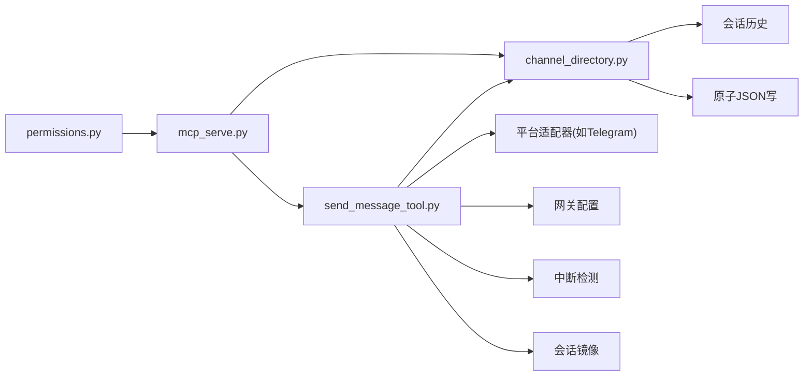

# 通信工具

<cite>
**本文引用的文件**
- [mcp_serve.py](file://mcp_serve.py)
- [send_message_tool.py](file://tools/send_message_tool.py)
- [channel_directory.py](file://gateway/channel_directory.py)
- [permissions.py](file://acp_adapter/permissions.py)
- [test_send_message_tool.py](file://tests/tools/test_send_message_tool.py)
- [test_channel_directory.py](file://tests/gateway/test_channel_directory.py)
- [telegram.py](file://gateway/platforms/telegram.py)
</cite>

## 目录
1. [简介](#简介)
2. [项目结构](#项目结构)
3. [核心组件](#核心组件)
4. [架构总览](#架构总览)
5. [详细组件分析](#详细组件分析)
6. [依赖关系分析](#依赖关系分析)
7. [性能考量](#性能考量)
8. [故障排查指南](#故障排查指南)
9. [结论](#结论)

## 简介
本文件面向Hermes Agent的MCP（Model Context Protocol）通信工具，系统性说明以下能力：
- messages_send：向任意已连接平台的对话发送消息，支持目标格式、平台标识符与通道解析。
- channels_list：列出可发送消息的通道与目标，返回可直接用于messages_send的target字符串。

文档覆盖目标字符串解析、平台路由、通道目录构建与缓存、权限与批准流程、安全与错误处理等关键实现细节，并提供跨平台示例与最佳实践。

## 项目结构
与通信MCP工具直接相关的模块分布如下：
- MCP服务端入口与工具定义：mcp_serve.py
- 消息发送工具实现：tools/send_message_tool.py
- 通道目录构建与解析：gateway/channel_directory.py
- 权限与批准桥接：acp_adapter/permissions.py
- 平台适配器（以Telegram为例）：gateway/platforms/telegram.py
- 单元测试与集成测试：tests/tools/test_send_message_tool.py、tests/gateway/test_channel_directory.py

图表来源
- [mcp_serve.py:700-828](file://mcp_serve.py#L700-L828)
- [send_message_tool.py:80-220](file://tools/send_message_tool.py#L80-L220)
- [channel_directory.py:60-94](file://gateway/channel_directory.py#L60-L94)
- [permissions.py:26-77](file://acp_adapter/permissions.py#L26-L77)
- [test_send_message_tool.py:1-200](file://tests/tools/test_send_message_tool.py#L1-L200)
- [test_channel_directory.py:1-200](file://tests/gateway/test_channel_directory.py#L1-L200)

章节来源
- [mcp_serve.py:700-828](file://mcp_serve.py#L700-L828)
- [send_message_tool.py:80-220](file://tools/send_message_tool.py#L80-L220)
- [channel_directory.py:60-94](file://gateway/channel_directory.py#L60-L94)

## 核心组件
- messages_send：接收target与message参数，委托send_message_tool执行实际发送；对空参数与异常进行统一错误返回。
- channels_list：优先读取本地缓存的通道目录；若无缓存则从会话索引生成；支持按平台过滤；返回标准化的channels列表。
- send_message_tool：解析target、解析/解析人类友好名称、校验配置、路由到具体平台适配器、镜像回会话、错误脱敏与重试策略。
- 通道目录：构建并缓存各平台可用通道，支持名称解析与显示格式化；失败时降级为空结果。
- 权限与批准：将ACP权限请求映射为内部批准回调，支持超时自动拒绝与选项映射。

章节来源
- [mcp_serve.py:703-735](file://mcp_serve.py#L703-L735)
- [mcp_serve.py:739-789](file://mcp_serve.py#L739-L789)
- [send_message_tool.py:80-220](file://tools/send_message_tool.py#L80-L220)
- [channel_directory.py:178-226](file://gateway/channel_directory.py#L178-L226)
- [permissions.py:26-77](file://acp_adapter/permissions.py#L26-L77)

## 架构总览
MCP工具通过mcp_serve.py注册，messages_send与channels_list分别调用send_message_tool与通道目录模块。发送路径中，工具负责目标解析、名称解析、配置校验与路由；平台适配器负责具体API调用与消息分片；通道目录负责缓存与名称解析；权限模块负责批准流程。

图表来源
- [mcp_serve.py:703-735](file://mcp_serve.py#L703-L735)
- [send_message_tool.py:99-220](file://tools/send_message_tool.py#L99-L220)
- [channel_directory.py:189-225](file://gateway/channel_directory.py#L189-L225)

## 详细组件分析

### messages_send 工具
- 输入参数
  - target：平台标识符与目标标识符的组合，格式为“platform:identifier”。当identifier省略时默认使用home channel。
  - message：要发送的消息文本。
- 行为
  - 参数校验：target或message为空时返回错误。
  - 委托send_message_tool执行action="send"。
  - 异常捕获：导入失败或运行时异常统一转为错误JSON。
- 示例
  - 直接发送到平台home channel：target="telegram"
  - 指定群组/频道：target="discord:#general"
  - 指定私聊/频道ID：target="slack:C123456789"
  - Telegram主题/线程：target="telegram:-1001234567890:17585"

图表来源
- [mcp_serve.py:703-735](file://mcp_serve.py#L703-L735)

章节来源
- [mcp_serve.py:703-735](file://mcp_serve.py#L703-L735)

### channels_list 工具
- 功能
  - 优先加载本地通道目录缓存；若无缓存则从会话索引生成。
  - 支持按平台过滤（大小写不敏感）。
  - 返回标准化channels数组，每个条目包含target、platform、name、chat_type。
- 缓存机制
  - 本地缓存文件路径：~/.hermes/channel_directory.json。
  - 成功构建后写入缓存；写入失败时保留上次缓存。
  - 加载失败或损坏时返回空结果，避免阻断功能。
- 名称解析
  - 人类友好名称解析：支持精确匹配、带类型后缀的显示名、Discord的“服务器/频道”限定、前缀唯一匹配等策略。

图表来源
- [mcp_serve.py:739-789](file://mcp_serve.py#L739-L789)
- [channel_directory.py:178-186](file://gateway/channel_directory.py#L178-L186)

章节来源
- [mcp_serve.py:739-789](file://mcp_serve.py#L739-L789)
- [channel_directory.py:60-94](file://gateway/channel_directory.py#L60-L94)
- [channel_directory.py:178-226](file://gateway/channel_directory.py#L178-L226)

### send_message_tool：目标解析与平台路由
- 目标解析
  - 分割“platform:identifier”，提取平台名与目标引用。
  - 对于Telegram/飞书等平台，支持复合ID“chat_id:thread_id”的显式解析。
  - 若非显式ID且存在人类友好名称，调用通道目录解析为具体ID。
- 配置与路由
  - 加载网关配置，校验平台启用状态。
  - 将平台名映射到Platform枚举，按平台选择对应发送函数。
- 发送与镜像
  - 平台适配器负责消息分片与媒体处理（以Telegram为例）。
  - 发送成功后可镜像到目标会话，便于上下文一致性。
- 错误处理
  - 统一错误封装与敏感信息脱敏。
  - 中断检测：在发送前检查中断标志，避免长时间阻塞。
  - 自动投递去重：当与计划任务自动投递目标一致时跳过重复发送。

图表来源
- [send_message_tool.py:99-220](file://tools/send_message_tool.py#L99-L220)
- [send_message_tool.py:223-235](file://tools/send_message_tool.py#L223-L235)

章节来源
- [send_message_tool.py:99-220](file://tools/send_message_tool.py#L99-L220)
- [send_message_tool.py:223-235](file://tools/send_message_tool.py#L223-L235)

### 通道目录构建与缓存
- 构建来源
  - Discord/Slack：优先使用SDK客户端枚举；否则回退到会话历史。
  - Telegram/WhatsApp/Signal/Email/SMS：由于无法枚举，仅从会话历史构建。
- 写入策略
  - 使用原子写入，失败时保留旧缓存，确保数据一致性。
- 加载策略
  - 文件不存在或损坏时返回空目录，避免崩溃。
- 名称解析策略
  - 精确匹配（含显示名与目标标签）、Discord“服务器/频道”限定、前缀唯一匹配、大小写不敏感。

章节来源
- [channel_directory.py:60-94](file://gateway/channel_directory.py#L60-L94)
- [channel_directory.py:178-226](file://gateway/channel_directory.py#L178-L226)

### 权限管理与批准请求
- ACP桥接
  - 将ACP的request_permission调用桥接到内部批准回调。
  - 支持“允许一次/总是”、“拒绝一次/总是”映射。
  - 超时或异常自动拒绝。
- 使用场景
  - 在MCP工具调用前触发批准UI，等待用户决策。
  - 批准结果影响后续工具执行策略（例如允许/拒绝）。

章节来源
- [permissions.py:26-77](file://acp_adapter/permissions.py#L26-L77)

### 平台适配器与消息分片
- 以Telegram为例
  - 支持MarkdownV2与HTML两种渲染模式，自动回退。
  - 支持媒体类型：图片、视频、音频、语音、文档。
  - 主题/线程支持：message_thread_id。
- 其他平台
  - Discord/Slack/WhatsApp/Signal/Email/SMS/Mattermost/Matrix/HomeAssistant/DingTalk/飞书等均有对应发送实现。
  - 非Telegram平台当前仅支持纯文本消息，媒体附件会被忽略并提示警告。

章节来源
- [send_message_tool.py:302-410](file://tools/send_message_tool.py#L302-L410)
- [telegram.py:111-130](file://gateway/platforms/telegram.py#L111-L130)

## 依赖关系分析
- mcp_serve.py依赖send_message_tool与通道目录模块，提供MCP工具接口。
- send_message_tool依赖：
  - 通道目录：名称解析与显示。
  - 平台适配器：具体发送实现。
  - 网关配置：平台启用状态与home channel。
  - 中断检测与镜像模块：安全与一致性。
- 通道目录依赖：
  - 会话历史：构建Telegram/WhatsApp/Signal/Email/SMS等平台目录。
  - 原子JSON写：保证缓存一致性。
- 权限模块独立，但可被上层工具调用以触发批准流程。

图表来源
- [mcp_serve.py:703-735](file://mcp_serve.py#L703-L735)
- [send_message_tool.py:99-220](file://tools/send_message_tool.py#L99-L220)
- [channel_directory.py:60-94](file://gateway/channel_directory.py#L60-L94)
- [permissions.py:26-77](file://acp_adapter/permissions.py#L26-L77)

章节来源
- [mcp_serve.py:703-735](file://mcp_serve.py#L703-L735)
- [send_message_tool.py:99-220](file://tools/send_message_tool.py#L99-L220)
- [channel_directory.py:60-94](file://gateway/channel_directory.py#L60-L94)
- [permissions.py:26-77](file://acp_adapter/permissions.py#L26-L77)

## 性能考量
- 通道目录缓存
  - 本地缓存减少频繁枚举与API调用，提升channels_list响应速度。
  - 失败写入保护旧缓存，避免频繁重建。
- 消息分片
  - 平台消息长度限制下自动分片，避免单次发送超限。
- 媒体处理
  - Telegram支持多类型媒体；其他平台当前仅支持文本，媒体会被忽略并提示。
- 去重策略
  - 计划任务自动投递与手动发送目标一致时跳过重复发送，避免冗余。

章节来源
- [channel_directory.py:89-94](file://gateway/channel_directory.py#L89-L94)
- [send_message_tool.py:333-339](file://tools/send_message_tool.py#L333-L339)
- [send_message_tool.py:271-299](file://tools/send_message_tool.py#L271-L299)

## 故障排查指南
- messages_send返回错误
  - 检查target与message是否为空。
  - 查看send_message_tool的错误脱敏输出，确认平台配置是否正确。
  - 确认通道目录缓存是否存在或损坏。
- channels_list无结果
  - 确认本地缓存文件是否存在且可读。
  - 检查会话历史是否存在对应平台的对话。
- 名称解析失败
  - 使用channels_list查看可用名称与ID。
  - 尝试使用显式ID（如“platform:chat_id”或“platform:chat_id:thread_id”）。
- 权限未生效
  - 确认ACP桥接回调是否正确设置与超时时间。
  - 检查批准UI是否弹出以及用户选择。
- 平台发送异常
  - 检查平台凭据与启用状态。
  - 查看平台API返回的错误码与消息。
- 媒体发送问题
  - 当前仅Telegram支持媒体；其他平台媒体会被忽略并提示。

章节来源
- [mcp_serve.py:703-735](file://mcp_serve.py#L703-L735)
- [send_message_tool.py:216-220](file://tools/send_message_tool.py#L216-L220)
- [channel_directory.py:178-186](file://gateway/channel_directory.py#L178-L186)
- [permissions.py:59-75](file://acp_adapter/permissions.py#L59-L75)
- [test_send_message_tool.py:36-107](file://tests/tools/test_send_message_tool.py#L36-L107)
- [test_channel_directory.py:26-47](file://tests/gateway/test_channel_directory.py#L26-L47)

## 结论
Hermes Agent的MCP通信工具通过清晰的职责划分与稳健的实现，提供了跨平台消息发送与通道发现能力。messages_send与channels_list配合使用，既能满足快速发送需求，又能保障目标解析与权限控制的安全性。通道目录的缓存与去重策略进一步提升了性能与用户体验。建议在生产环境中：
- 定期维护通道目录缓存，确保名称解析准确。
- 明确平台凭据与home channel配置，减少发送失败。
- 合理使用批准流程，平衡自动化与安全。
- 在需要媒体发送时优先选择Telegram平台。