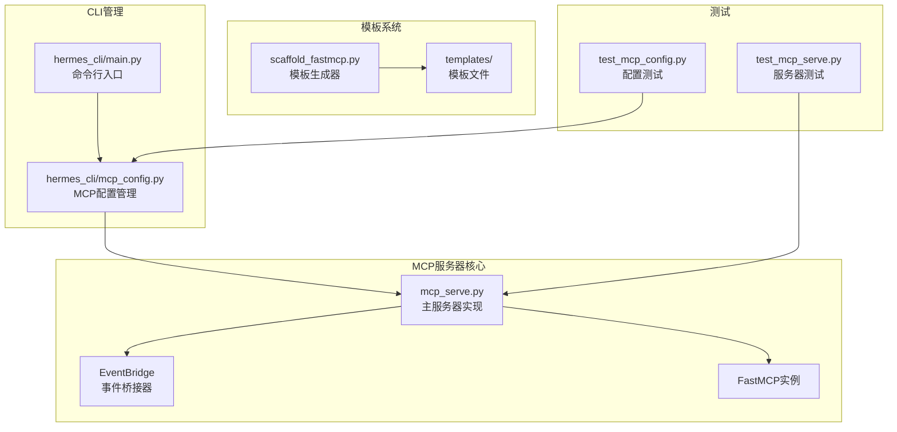
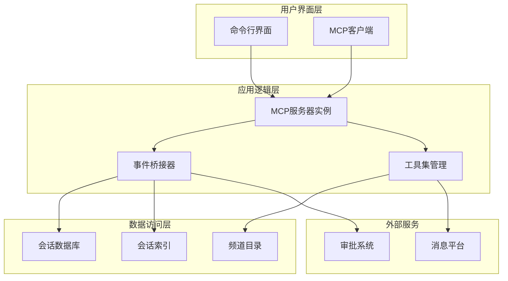
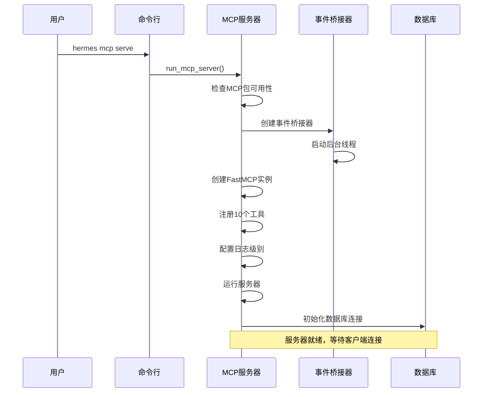
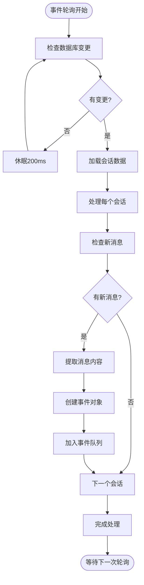
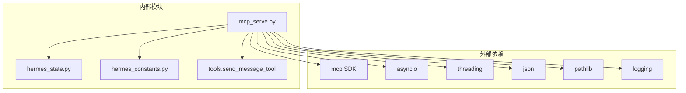

# MCP服务器配置

<cite>
**本文档引用的文件**
- [mcp_serve.py](file://mcp_serve.py)
- [hermes_cli/mcp_config.py](file://hermes_cli/mcp_config.py)
- [hermes_cli/main.py](file://hermes_cli/main.py)
- [tests/test_mcp_serve.py](file://tests/test_mcp_serve.py)
- [tests/hermes_cli/test_mcp_config.py](file://tests/hermes_cli/test_mcp_config.py)
- [optional-skills/mcp/fastmcp/scripts/scaffold_fastmcp.py](file://optional-skills/mcp/fastmcp/scripts/scaffold_fastmcp.py)
- [optional-skills/mcp/fastmcp/templates/api_wrapper.py](file://optional-skills/mcp/fastmcp/templates/api_wrapper.py)
- [nix/nixosModules.nix](file://nix/nixosModules.nix)
</cite>

## 目录
1. [简介](#简介)
2. [项目结构](#项目结构)
3. [核心组件](#核心组件)
4. [架构概览](#架构概览)
5. [详细组件分析](#详细组件分析)
6. [依赖关系分析](#依赖关系分析)
7. [性能考虑](#性能考虑)
8. [故障排除指南](#故障排除指南)
9. [结论](#结论)
10. [附录](#附录)

## 简介

Hermes Agent的MCP（Model Context Protocol）服务器是一个强大的消息传递桥接系统，它将Hermes Agent与各种消息平台（如Telegram、Discord、Slack、WhatsApp、Signal、Matrix等）集成在一起。该服务器通过FastMCP框架实现，提供了10个标准MCP工具，包括会话列表、消息读取、附件获取、事件轮询、消息发送等功能。

MCP服务器的核心价值在于：
- **统一接口**：为所有支持的平台提供一致的消息访问接口
- **实时事件**：通过事件桥接实现实时消息通知
- **工具注册**：动态发现和注册外部MCP服务器工具
- **权限管理**：内置审批请求处理机制
- **多平台支持**：无缝连接多种消息平台

## 项目结构

Hermes MCP服务器相关的核心文件组织如下：



**图表来源**
- [mcp_serve.py:1-868](file://mcp_serve.py#L1-L868)
- [hermes_cli/mcp_config.py:1-646](file://hermes_cli/mcp_config.py#L1-L646)
- [hermes_cli/main.py:4991-5005](file://hermes_cli/main.py#L4991-L5005)

**章节来源**
- [mcp_serve.py:1-868](file://mcp_serve.py#L1-L868)
- [hermes_cli/mcp_config.py:1-646](file://hermes_cli/mcp_config.py#L1-L646)

## 核心组件

### FastMCP服务器实例

MCP服务器基于FastMCP框架构建，提供了完整的MCP协议实现。服务器实例具有以下关键特性：

- **指令设置**：服务器指令描述了其在消息传递桥接中的作用
- **工具注册**：自动注册10个标准MCP工具
- **异步运行**：支持异步操作和事件处理
- **错误处理**：完善的异常捕获和错误报告机制

### 事件桥接器（EventBridge）

EventBridge是MCP服务器的核心组件，负责：

- **数据库轮询**：定期检查SessionDB中的新消息
- **事件队列**：维护内存中的事件队列，支持游标分页
- **并发控制**：使用线程锁确保线程安全
- **超时处理**：支持长轮询等待机制
- **内存限制**：队列长度限制为1000条事件

### 工具集管理

服务器提供了完整的工具集管理功能：

- **会话管理**：列出和获取活动对话
- **消息处理**：读取消息历史和发送新消息
- **附件处理**：提取和处理非文本附件
- **事件监控**：轮询和等待事件通知
- **权限控制**：管理执行和插件审批请求

**章节来源**
- [mcp_serve.py:431-829](file://mcp_serve.py#L431-L829)
- [mcp_serve.py:185-426](file://mcp_serve.py#L185-L426)

## 架构概览

MCP服务器采用分层架构设计，确保了良好的模块化和可扩展性：



**图表来源**
- [mcp_serve.py:431-829](file://mcp_serve.py#L431-L829)
- [mcp_serve.py:185-426](file://mcp_serve.py#L185-L426)

## 详细组件分析

### 服务器初始化流程

MCP服务器的启动过程遵循严格的初始化顺序：



**图表来源**
- [mcp_serve.py:836-868](file://mcp_serve.py#L836-L868)
- [mcp_serve.py:431-829](file://mcp_serve.py#L431-L829)

### 工具注册机制

MCP服务器自动注册10个标准工具，每个工具都有特定的功能：

| 工具名称 | 功能描述 | 参数 |
|---------|----------|------|
| conversations_list | 列出活动对话 | platform, limit, search |
| conversation_get | 获取对话详情 | session_key |
| messages_read | 读取消息历史 | session_key, limit |
| attachments_fetch | 获取消息附件 | session_key, message_id |
| events_poll | 轮询事件 | after_cursor, session_key, limit |
| events_wait | 等待事件 | after_cursor, session_key, timeout_ms |
| messages_send | 发送消息 | target, message |
| channels_list | 列出可用频道 | platform |
| permissions_list_open | 列出开放的审批请求 | 无 |
| permissions_respond | 处理审批请求 | id, decision |

**章节来源**
- [mcp_serve.py:452-829](file://mcp_serve.py#L452-L829)

### 事件处理流程

事件桥接器实现了高效的事件处理机制：



**图表来源**
- [mcp_serve.py:313-426](file://mcp_serve.py#L313-L426)

**章节来源**
- [mcp_serve.py:185-426](file://mcp_serve.py#L185-L426)

### 命令行参数详解

#### hermes mcp serve 命令

| 参数 | 类型 | 默认值 | 描述 |
|------|------|--------|------|
| -v, --verbose | 标志 | False | 启用详细日志输出 |
| --help | 标志 | - | 显示帮助信息 |

#### hermes mcp 配置管理命令

| 命令 | 参数 | 描述 |
|------|------|------|
| add | `<name>` `--url <endpoint>` 或 `--command <cmd>` | 添加新的MCP服务器 |
| remove | `<name>` | 移除MCP服务器 |
| list | - | 列出所有配置的服务器 |
| test | `<name>` | 测试服务器连接 |
| configure | `<name>` | 配置工具选择 |

**章节来源**
- [hermes_cli/mcp_config.py:617-645](file://hermes_cli/mcp_config.py#L617-L645)
- [tests/test_mcp_serve.py:853-884](file://tests/test_mcp_serve.py#L853-L884)

### 配置文件结构

MCP服务器配置存储在`~/.hermes/config.yaml`中，格式如下：

```yaml
mcp_servers:
  hermes:
    url: "https://mcp.ml.ink/mcp"
    enabled: true
    tools:
      include:
        - create_service
        - list_services
    headers:
      Authorization: "Bearer ${MCP_HERMES_API_KEY}"
    auth: "oauth"
```

**章节来源**
- [hermes_cli/mcp_config.py:77-110](file://hermes_cli/mcp_config.py#L77-L110)

## 依赖关系分析

MCP服务器的依赖关系相对简单，主要依赖于外部MCP SDK：



**图表来源**
- [mcp_serve.py:30-56](file://mcp_serve.py#L30-L56)

**章节来源**
- [mcp_serve.py:30-56](file://mcp_serve.py#L30-L56)

## 性能考虑

### 内存优化策略

1. **事件队列限制**：最大保留1000条事件，超出则移除最旧的事件
2. **数据库轮询优化**：使用文件修改时间戳检查避免不必要的数据库查询
3. **内存缓存**：缓存会话索引和状态数据库路径，减少文件系统访问

### 并发处理

1. **后台线程**：事件轮询在独立的守护线程中运行
2. **线程同步**：使用线程锁保护共享数据结构
3. **异步操作**：支持异步工具调用和事件处理

### 资源管理

1. **数据库连接**：延迟建立数据库连接，按需初始化
2. **文件句柄**：合理管理文件句柄，避免资源泄漏
3. **内存清理**：服务器停止时自动清理所有资源

## 故障排除指南

### 常见问题及解决方案

#### MCP包未安装

**症状**：启动时显示MCP包不可用错误

**解决方案**：
```bash
pip install 'hermes-agent[mcp]'
```

#### 数据库连接失败

**症状**：事件轮询无法正常工作

**诊断步骤**：
1. 检查`~/.hermes/state.db`文件是否存在
2. 验证数据库文件权限
3. 确认Hermes Home目录设置正确

#### 事件处理延迟

**症状**：消息到达后延迟显示

**优化建议**：
1. 检查系统负载情况
2. 调整轮询间隔（默认200ms）
3. 监控内存使用情况

#### 权限问题

**症状**：某些工具调用失败

**解决方案**：
1. 检查API密钥配置
2. 验证OAuth令牌有效性
3. 确认服务器配置中的认证设置

**章节来源**
- [mcp_serve.py:836-868](file://mcp_serve.py#L836-L868)
- [tests/test_mcp_serve.py:848-851](file://tests/test_mcp_serve.py#L848-L851)

## 结论

Hermes Agent的MCP服务器提供了一个强大而灵活的消息传递桥接解决方案。通过FastMCP框架和精心设计的架构，它成功地将多个消息平台整合到一个统一的接口中。

主要优势包括：
- **标准化接口**：10个标准MCP工具提供一致的API体验
- **实时能力**：事件桥接器确保消息的近实时传递
- **易于扩展**：支持动态发现和注册外部MCP服务器
- **健壮性**：完善的错误处理和资源管理机制

对于生产环境部署，建议重点关注数据库性能、网络连接稳定性和权限配置的安全性。

## 附录

### 快速开始指南

1. **安装依赖**：
```bash
pip install 'hermes-agent[mcp]'
```

2. **启动服务器**：
```bash
hermes mcp serve
```

3. **配置客户端**：
```json
{
  "mcpServers": {
    "hermes": {
      "command": "hermes",
      "args": ["mcp", "serve"]
    }
  }
}
```

### 最佳实践

1. **监控指标**：定期检查事件队列长度和数据库连接状态
2. **备份策略**：定期备份会话数据库和配置文件
3. **安全配置**：使用环境变量存储敏感信息
4. **性能调优**：根据实际使用情况调整轮询间隔和队列大小

### 部署要求

- Python 3.8+
- 至少2GB RAM（推荐4GB+）
- 稳定的网络连接
- 适当的磁盘空间用于会话存储