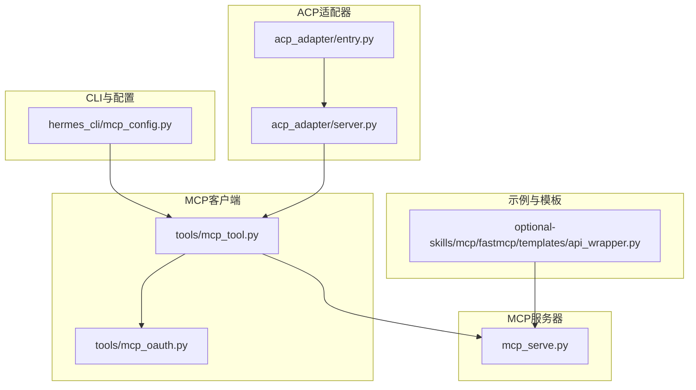
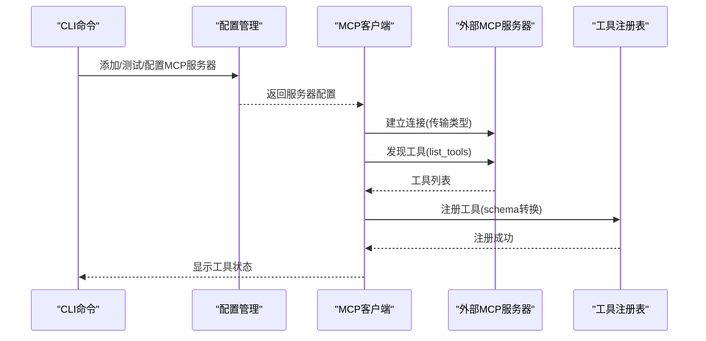
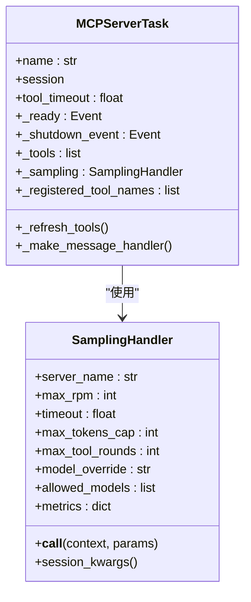
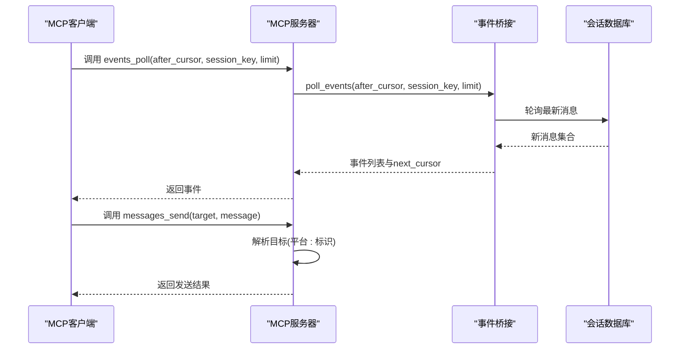
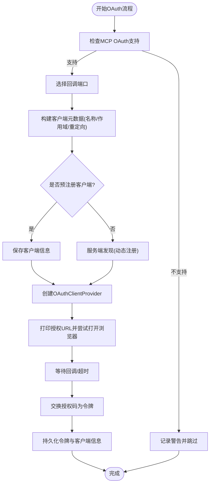
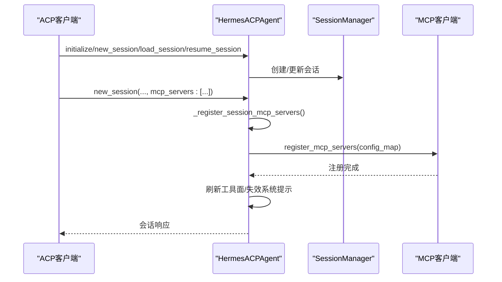
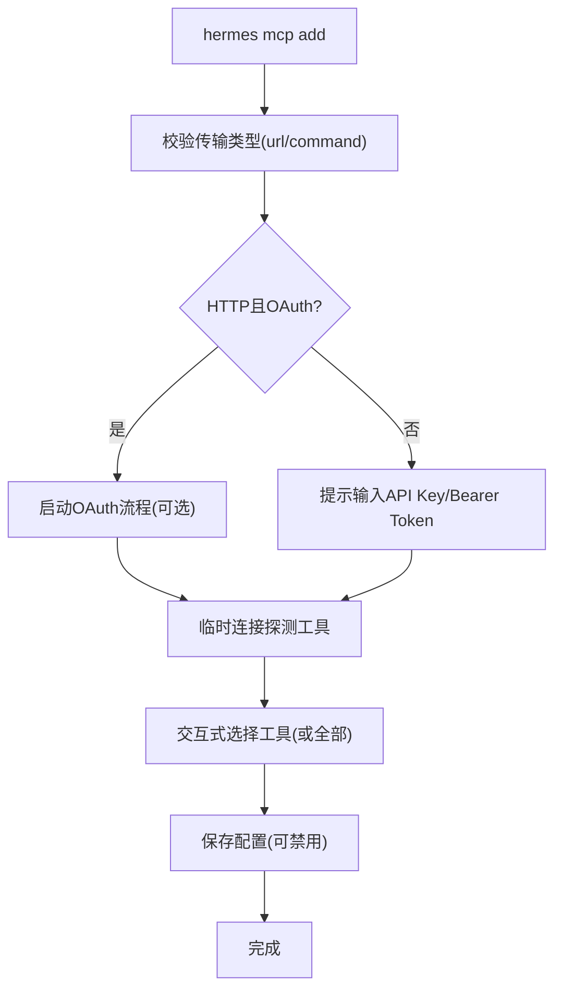
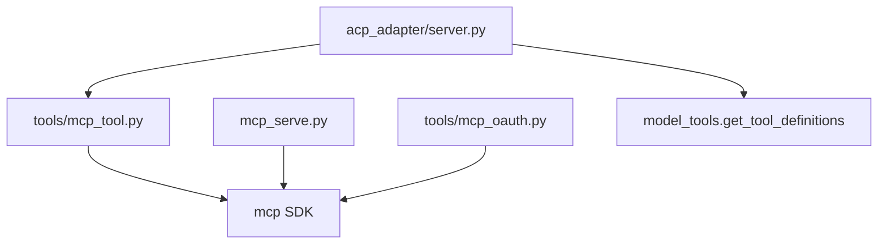

# MCP集成接口

<cite>
**本文档引用的文件**
- [mcp_config.py](file://hermes_cli/mcp_config.py)
- [mcp_serve.py](file://mcp_serve.py)
- [mcp_tool.py](file://tools/mcp_tool.py)
- [mcp_oauth.py](file://tools/mcp_oauth.py)
- [SKILL.md](file://skills/mcp/native-mcp/SKILL.md)
- [test_mcp_tool.py](file://tests/tools/test_mcp_tool.py)
- [server.py](file://acp_adapter/server.py)
- [entry.py](file://acp_adapter/entry.py)
- [api_wrapper.py](file://optional-skills/mcp/fastmcp/templates/api_wrapper.py)
</cite>

## 目录
1. [简介](#简介)
2. [项目结构](#项目结构)
3. [核心组件](#核心组件)
4. [架构总览](#架构总览)
5. [详细组件分析](#详细组件分析)
6. [依赖关系分析](#依赖关系分析)
7. [性能考虑](#性能考虑)
8. [故障排除指南](#故障排除指南)
9. [结论](#结论)
10. [附录](#附录)

## 简介
本文件为 Hermes Agent 的 MCP（Model Context Protocol）集成提供完整的技术文档，涵盖 MCP 服务器配置、工具发现机制、协议规范、工具注册与生命周期管理、状态同步、客户端集成（连接建立、认证、消息传递）、工具描述与参数验证、结果处理、部署配置、性能调优与监控，以及与 ACPI 协议的协同工作机制。文档面向开发者与运维人员，既提供代码级实现细节，也提供可操作的配置与排障指南。

## 项目结构
Hermes Agent 中与 MCP 相关的核心模块分布如下：
- CLI 配置与管理：`hermes_cli/mcp_config.py`
- MCP 客户端核心：`tools/mcp_tool.py`
- MCP 服务器端：`mcp_serve.py`
- OAuth 认证支持：`tools/mcp_oauth.py`
- ACP 协议适配器（与 MCP 协同）：`acp_adapter/server.py`、`acp_adapter/entry.py`
- 示例与模板：`optional-skills/mcp/fastmcp/templates/api_wrapper.py`
- 文档与技能说明：`skills/mcp/native-mcp/SKILL.md`

**图表来源**
- [mcp_config.py:1-646](file://hermes_cli/mcp_config.py#L1-L646)
- [mcp_tool.py:1-2187](file://tools/mcp_tool.py#L1-L2187)
- [mcp_serve.py:1-868](file://mcp_serve.py#L1-L868)
- [mcp_oauth.py:1-482](file://tools/mcp_oauth.py#L1-L482)
- [server.py:1-727](file://acp_adapter/server.py#L1-L727)
- [entry.py:1-86](file://acp_adapter/entry.py#L1-L86)
- [api_wrapper.py:1-55](file://optional-skills/mcp/fastmcp/templates/api_wrapper.py#L1-L55)

**章节来源**
- [mcp_config.py:1-646](file://hermes_cli/mcp_config.py#L1-L646)
- [mcp_tool.py:1-2187](file://tools/mcp_tool.py#L1-L2187)
- [mcp_serve.py:1-868](file://mcp_serve.py#L1-L868)
- [mcp_oauth.py:1-482](file://tools/mcp_oauth.py#L1-L482)
- [server.py:1-727](file://acp_adapter/server.py#L1-L727)
- [entry.py:1-86](file://acp_adapter/entry.py#L1-L86)
- [api_wrapper.py:1-55](file://optional-skills/mcp/fastmcp/templates/api_wrapper.py#L1-L55)

## 核心组件
- MCP 客户端管理器：负责读取配置、连接服务器、动态发现工具、注册到工具集、执行工具调用、处理错误与重连。
- MCP 服务器端：将 Hermes Agent 的会话、消息、事件桥接为 MCP 工具，供外部 MCP 客户端使用。
- OAuth 支持：为需要 OAuth 的 MCP 服务器提供 PKCE 授权码流与令牌持久化。
- ACP 适配器：在 ACP 协议下动态注册 MCP 服务器并刷新工具面，实现与 MCP 的协同。
- CLI 管理命令：提供添加、移除、列出、测试、配置 MCP 服务器的交互式子命令。

**章节来源**
- [mcp_tool.py:1-2187](file://tools/mcp_tool.py#L1-L2187)
- [mcp_serve.py:1-868](file://mcp_serve.py#L1-L868)
- [mcp_oauth.py:1-482](file://tools/mcp_oauth.py#L1-L482)
- [server.py:1-727](file://acp_adapter/server.py#L1-L727)
- [mcp_config.py:1-646](file://hermes_cli/mcp_config.py#L1-L646)

## 架构总览
MCP 在 Hermes Agent 中采用“客户端-服务器”双端架构：
- 客户端侧：通过 `tools/mcp_tool.py` 连接外部 MCP 服务器，自动发现工具并注册为本地工具；支持 stdio 与 HTTP/StreamableHTTP 传输，具备指数退避重连、超时控制、凭据清洗等特性。
- 服务器侧：通过 `mcp_serve.py` 暴露会话、消息、附件、事件、权限等工具，供外部 MCP 客户端（如 Claude Desktop、Cursor 等）使用。
- 协同机制：在 ACP 环境中，`acp_adapter/server.py` 可接收来自 ACP 的 MCP 服务器配置，动态注册并刷新工具面。

**图表来源**
- [mcp_config.py:173-338](file://hermes_cli/mcp_config.py#L173-L338)
- [mcp_tool.py:1539-1831](file://tools/mcp_tool.py#L1539-L1831)

**章节来源**
- [mcp_config.py:173-338](file://hermes_cli/mcp_config.py#L173-L338)
- [mcp_tool.py:1539-1831](file://tools/mcp_tool.py#L1539-L1831)

## 详细组件分析

### MCP 客户端核心（tools/mcp_tool.py）
- 功能要点
  - 传输支持：stdio（命令+参数）与 HTTP/StreamableHTTP（URL+请求头）。
  - 连接与重连：每个服务器在后台事件循环中以长连接运行，断线自动指数退避重连（最多5次，最大60秒）。
  - 工具发现：调用 `list_tools()` 获取工具清单，按命名规范注册到工具集。
  - 安全与隔离：stdio 子进程仅继承安全环境变量，用户可通过 `env` 显式注入；错误消息中的凭据会被清洗。
  - 超时控制：支持每工具调用超时与初始连接超时。
  - 采样（Sampling）：支持 MCP 采样能力，允许服务器在工具执行过程中请求 LLM 补全或工具调用，内置速率限制与轮次限制。
  - 动态工具发现：监听 `tools/list_changed` 通知，触发工具刷新。
  - 线程安全：使用锁与事件循环确保多线程访问安全。

- 关键类与方法
  - `MCPServerTask`：封装单个服务器的生命周期、工具集合、采样回调、刷新逻辑。
  - `SamplingHandler`：处理采样请求，进行模型解析、速率限制、工具轮次治理、消息格式转换与指标统计。
  - `_convert_mcp_schema`：将 MCP 工具模式转换为 Hermes 工具模式，含命名前缀与输入参数规范化。
  - `_build_safe_env`：构建安全的子进程环境变量集。
  - `_sanitize_error`：清洗错误消息中的凭据模式。
  - `_connect_server`、`_run_on_mcp_loop`：连接与调度工具调用到事件循环。

**图表来源**
- [mcp_tool.py:720-800](file://tools/mcp_tool.py#L720-L800)
- [mcp_tool.py:349-714](file://tools/mcp_tool.py#L349-L714)

**章节来源**
- [mcp_tool.py:1-2187](file://tools/mcp_tool.py#L1-L2187)

### MCP 服务器端（mcp_serve.py）
- 功能要点
  - 将 Hermes Agent 的会话数据库与通道目录暴露为 MCP 工具，包括：
    - 列出会话、获取会话详情、读取消息历史、提取附件、轮询/等待事件、发送消息、列出可用通道、列出待处理审批、响应审批。
  - 事件桥接：基于内存队列与轮询策略，将会话数据库变更转化为事件，供 MCP 客户端实时订阅。
  - 启动方式：通过 `hermes mcp serve` 以 stdio 方式启动，内部使用 FastMCP 实现。

- 关键工具与数据流
  - `conversations_list` / `conversation_get`：会话索引查询与详情。
  - `messages_read` / `attachments_fetch`：消息读取与附件提取。
  - `events_poll` / `events_wait`：事件轮询与长等待。
  - `messages_send`：向指定平台目标发送消息。
  - `channels_list`：列出可用通道目标。
  - `permissions_list_open` / `permissions_respond`：审批请求的查询与响应。

**图表来源**
- [mcp_serve.py:450-829](file://mcp_serve.py#L450-L829)

**章节来源**
- [mcp_serve.py:1-868](file://mcp_serve.py#L1-L868)

### OAuth 认证（tools/mcp_oauth.py）
- 功能要点
  - 实现 OAuth 2.1 授权码 + PKCE 流程，自动处理发现、动态客户端注册、令牌交换与刷新。
  - 提供本地回调服务器捕获授权码，支持浏览器打开与非交互环境提示。
  - 令牌与客户端信息持久化到磁盘，支持跨进程复用。
  - 与 MCP SDK 的 `OAuthClientProvider` 集成，返回可直接用于 HTTP 客户端的身份认证对象。

**图表来源**
- [mcp_oauth.py:377-482](file://tools/mcp_oauth.py#L377-L482)

**章节来源**
- [mcp_oauth.py:1-482](file://tools/mcp_oauth.py#L1-L482)

### ACP 协同（acp_adapter/server.py）
- 功能要点
  - 在 ACP 会话生命周期内动态注册 MCP 服务器，刷新工具面。
  - 支持从 ACP 接收 stdio 与 HTTP 类型的 MCP 服务器配置，转换为内部配置并注册。
  - 与工具系统集成，更新可用工具集合并使能系统提示失效。

**图表来源**
- [server.py:149-213](file://acp_adapter/server.py#L149-L213)

**章节来源**
- [server.py:1-727](file://acp_adapter/server.py#L1-L727)

### CLI 管理（hermes_cli/mcp_config.py）
- 功能要点
  - 提供 `hermes mcp add/remove/list/test/configure` 子命令，支持交互式服务器管理。
  - 支持 OAuth 与静态 Bearer Token 两种认证方式，自动保存到配置与环境变量。
  - 连接探测：临时连接服务器，列出工具后断开，便于验证配置。
  - 工具筛选：支持按 include/exclude 控制启用的工具集合。

**图表来源**
- [mcp_config.py:173-338](file://hermes_cli/mcp_config.py#L173-L338)

**章节来源**
- [mcp_config.py:1-646](file://hermes_cli/mcp_config.py#L1-L646)

### 示例与模板（optional-skills/mcp/fastmcp/templates/api_wrapper.py）
- 功能要点
  - 提供基于 FastMCP 的 API 包装模板，演示如何将外部 HTTP API 暴露为 MCP 工具。
  - 展示健康检查、资源检索与搜索等典型工具实现。
  - 适用于快速搭建 MCP 服务器，作为自定义工具集的参考。

**章节来源**
- [api_wrapper.py:1-55](file://optional-skills/mcp/fastmcp/templates/api_wrapper.py#L1-L55)

## 依赖关系分析
- 组件耦合
  - `mcp_tool.py` 与 `mcp_serve.py` 分别独立实现客户端与服务器端，通过 MCP 协议互通。
  - `mcp_oauth.py` 与 `mcp_tool.py` 松耦合，通过返回的认证对象注入 HTTP 客户端。
  - `acp_adapter/server.py` 通过 `register_mcp_servers` 与 `model_tools.get_tool_definitions` 与 MCP 客户端及工具系统集成。
- 外部依赖
  - MCP SDK（可选安装），支持 stdio、HTTP/StreamableHTTP、OAuth、采样等能力。
  - ACP 协议库，用于 ACP 适配器。
  - httpx/pydantic 等用于 OAuth 与配置序列化。

**图表来源**
- [mcp_tool.py:95-137](file://tools/mcp_tool.py#L95-L137)
- [mcp_serve.py:49-56](file://mcp_serve.py#L49-L56)
- [mcp_oauth.py:55-68](file://tools/mcp_oauth.py#L55-L68)
- [server.py:177-213](file://acp_adapter/server.py#L177-L213)

**章节来源**
- [mcp_tool.py:95-137](file://tools/mcp_tool.py#L95-L137)
- [mcp_serve.py:49-56](file://mcp_serve.py#L49-L56)
- [mcp_oauth.py:55-68](file://tools/mcp_oauth.py#L55-L68)
- [server.py:177-213](file://acp_adapter/server.py#L177-L213)

## 性能考虑
- 连接与重连
  - 指数退避重连（最多5次，上限60秒），避免对不可达服务器频繁轮询。
  - 服务器连接为长连接，共享同一事件循环任务，减少上下文切换开销。
- 轮询与事件
  - 服务器端事件桥接采用 200ms 轮询间隔与 mtime 缓存，降低数据库压力。
  - 使用内存队列与游标机制，限制队列长度（默认1000），避免内存膨胀。
- 超时与并发
  - 工具调用默认超时 120 秒，连接默认超时 60 秒；可在配置中调整。
  - 采样回调使用线程池异步执行 LLM 调用，避免阻塞事件循环。
- 安全与资源
  - stdio 子进程仅继承安全环境变量，防止凭据泄露。
  - 错误消息中的凭据被清洗，降低敏感信息外泄风险。

[本节为通用性能建议，无需特定文件引用]

## 故障排除指南
- 常见问题与定位
  - “未安装 MCP SDK”：客户端功能被禁用。安装 `mcp` 包后重启。
  - “找不到可执行文件”：stdio 命令缺失或 PATH 不正确；确保 npx/uvx/node 可用或显式设置绝对路径并追加到 env.PATH。
  - “HTTP 传输不可用”：当前 mcp 版本不包含 HTTP 客户端支持；升级 `mcp` 包。
  - “工具未出现”：检查配置键名（应为 `mcp_servers`）、缩进与命名前缀；查看启动日志。
  - “连接频繁断开”：网络不稳定或服务器不可达；检查服务器状态与防火墙；客户端最多重连5次。
- CLI 诊断
  - 使用 `hermes mcp test <name>` 快速验证连接、认证与工具发现。
  - 使用 `hermes mcp configure <name>` 交互式调整工具启用集合。
- 日志与可观测性
  - MCP 服务器端支持 `--verbose` 输出更详细日志。
  - OAuth 回调端口与令牌存储位置位于 `HERMES_HOME/mcp-tokens/`。

**章节来源**
- [mcp_config.py:218-244](file://hermes_cli/mcp_config.py#L218-L244)
- [mcp_serve.py:836-868](file://mcp_serve.py#L836-L868)
- [mcp_tool.py:270-328](file://tools/mcp_tool.py#L270-L328)

## 结论
Hermes Agent 对 MCP 的集成提供了从客户端到服务器端的完整链路：通过灵活的配置与认证机制、完善的工具发现与注册流程、稳健的连接与重连策略、以及与 ACP 的协同能力，使得外部 MCP 服务器与内部会话能力得以无缝融合。配合 CLI 管理工具与示例模板，开发者可以快速构建、部署与维护 MCP 工具生态。

[本节为总结性内容，无需特定文件引用]

## 附录

### MCP 客户端集成步骤
- 安装依赖：确保已安装 `mcp` 包。
- 配置服务器：在 `~/.hermes/config.yaml` 下添加 `mcp_servers` 条目（stdio 或 HTTP）。
- 认证配置：对于 HTTP 服务器，可配置 Bearer Token 或启用 OAuth。
- 启动与验证：使用 `hermes mcp test <name>` 验证连接与工具发现。
- 工具使用：工具将以 `mcp_<server>_<tool>` 命名出现在所有平台工具集中。

**章节来源**
- [SKILL.md:42-60](file://skills/mcp/native-mcp/SKILL.md#L42-L60)
- [mcp_config.py:173-338](file://hermes_cli/mcp_config.py#L173-L338)

### MCP 服务器端部署与监控
- 部署方式：通过 `hermes mcp serve` 以 stdio 启动；也可在容器或云环境中以 HTTP 方式托管（需满足 FastMCP 要求）。
- 监控建议：关注事件桥接队列长度、轮询间隔与数据库 mtime 变化频率；在高并发场景下适当增大轮询间隔或优化数据库索引。
- 日志：使用 `--verbose` 查看详细日志；生产环境建议将日志输出到文件而非终端。

**章节来源**
- [mcp_serve.py:836-868](file://mcp_serve.py#L836-L868)

### MCP 工具开发示例
- 快速开始：参考 `optional-skills/mcp/fastmcp/templates/api_wrapper.py`，将外部 API 包装为 MCP 工具。
- 规范与最佳实践：遵循输入参数模式规范化、错误处理与结果结构化、命名前缀与工具描述清晰。

**章节来源**
- [api_wrapper.py:1-55](file://optional-skills/mcp/fastmcp/templates/api_wrapper.py#L1-L55)

### 与 ACPI 协议的协同机制
- ACP 会话中动态注册 MCP 服务器，刷新工具面，使 MCP 工具即时可用。
- ACP 适配器在会话生命周期内维护工具集合与系统提示有效性，确保一致性。

**章节来源**
- [server.py:149-213](file://acp_adapter/server.py#L149-L213)
- [entry.py:58-86](file://acp_adapter/entry.py#L58-L86)