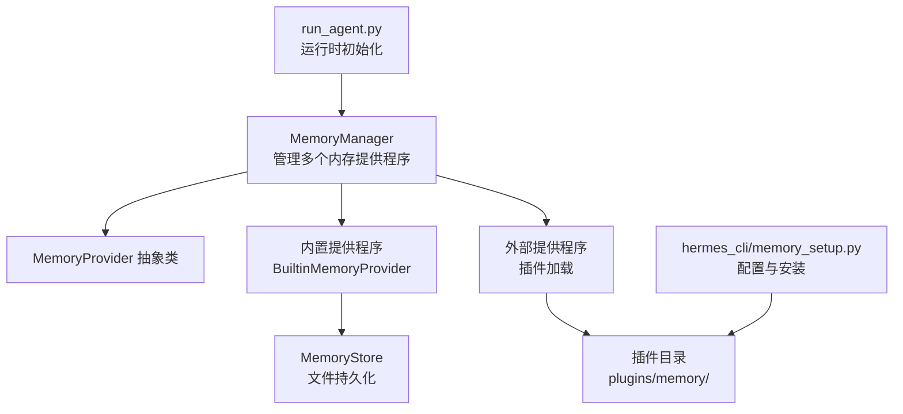
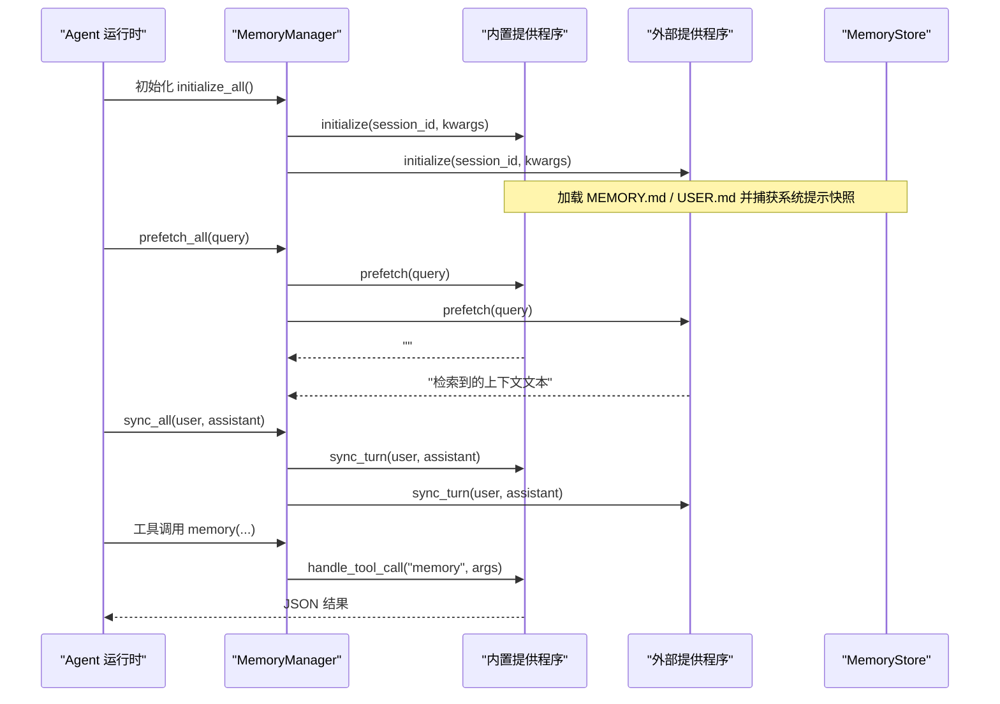
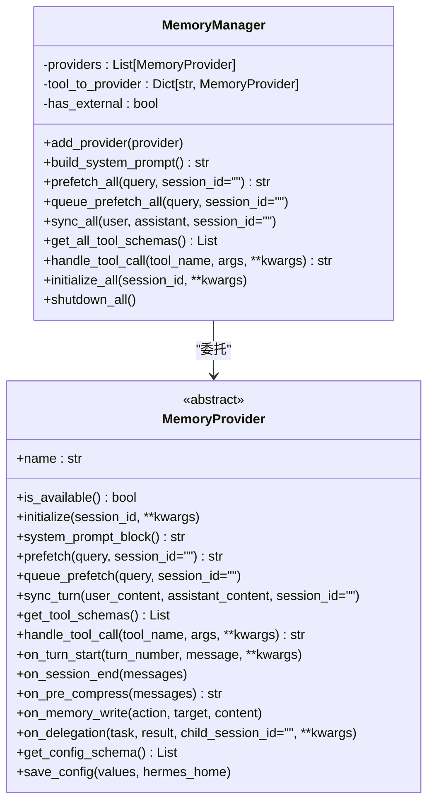
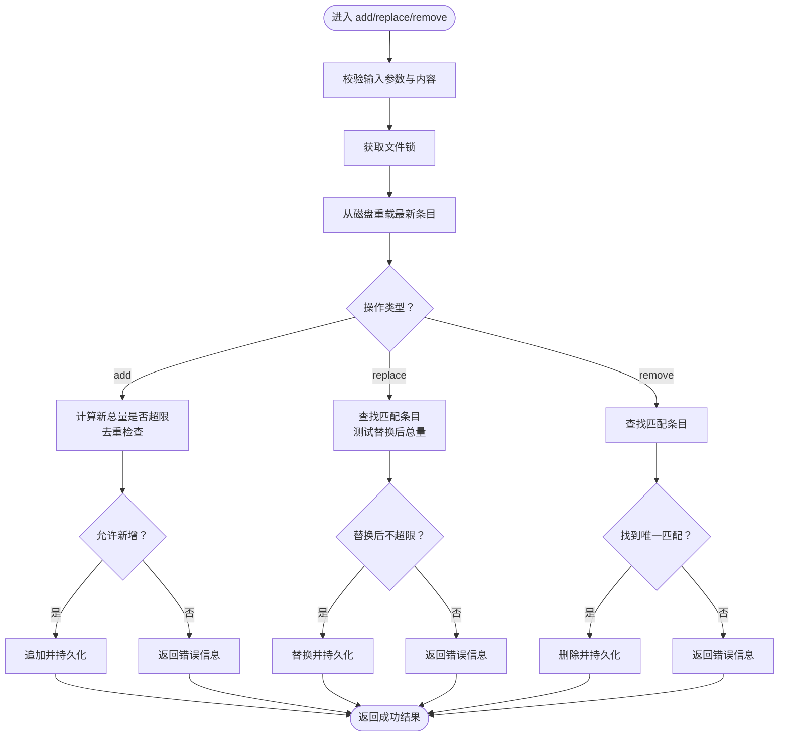
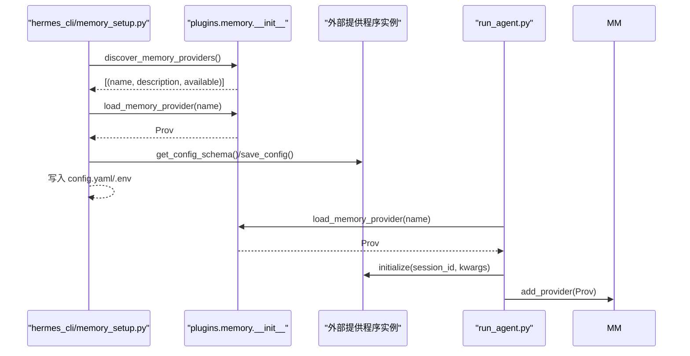
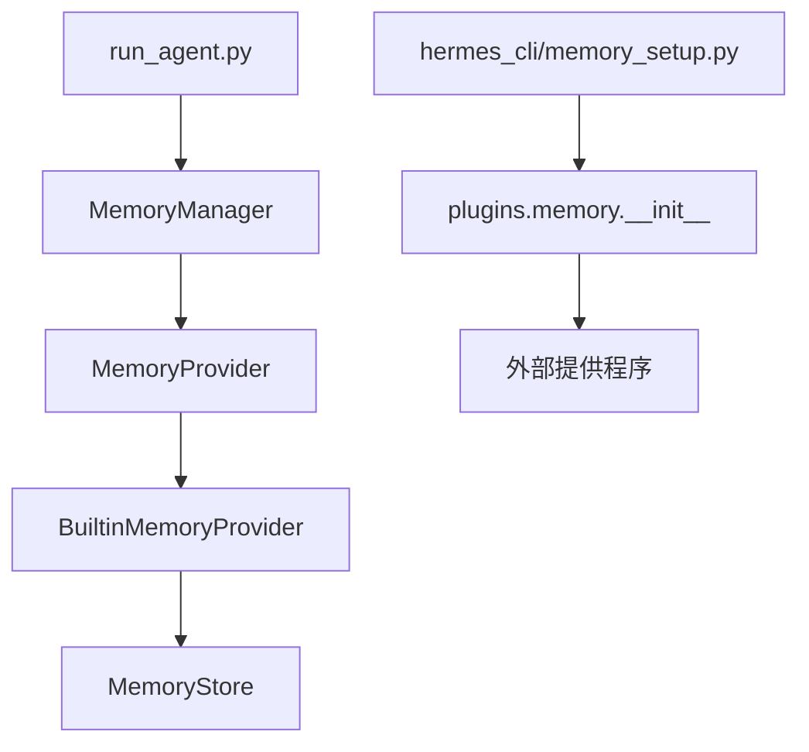

# 内存管理API

<cite>
**本文档引用的文件**
- [agent/memory_manager.py](file://agent/memory_manager.py)
- [agent/memory_provider.py](file://agent/memory_provider.py)
- [agent/builtin_memory_provider.py](file://agent/builtin_memory_provider.py)
- [tools/memory_tool.py](file://tools/memory_tool.py)
- [plugins/memory/__init__.py](file://plugins/memory/__init__.py)
- [hermes_cli/memory_setup.py](file://hermes_cli/memory_setup.py)
- [run_agent.py](file://run_agent.py)
</cite>

## 目录
1. [简介](#简介)
2. [项目结构](#项目结构)
3. [核心组件](#核心组件)
4. [架构总览](#架构总览)
5. [详细组件分析](#详细组件分析)
6. [依赖关系分析](#依赖关系分析)
7. [性能考虑](#性能考虑)
8. [故障排查指南](#故障排查指南)
9. [结论](#结论)
10. [附录](#附录)

## 简介
本文件为 Hermes Agent 的内存管理系统提供详细的 API 文档，覆盖以下方面：
- 内存提供程序接口规范：存储、检索与更新操作
- 内存查询接口、搜索算法与索引机制
- 内存工具 API 规范：读取、写入、删除与批量操作
- 扩展接口：如何开发自定义内存后端
- 容量管理、过期策略与清理机制
- 性能优化建议与监控指标
- 与代理学习循环的集成方式与数据同步机制

## 项目结构
内存管理相关代码主要分布在以下模块：
- 提供程序抽象与管理器：agent/memory_provider.py、agent/memory_manager.py、agent/builtin_memory_provider.py
- 内置内存工具与存储：tools/memory_tool.py
- 插件发现与加载：plugins/memory/__init__.py
- CLI 配置与安装：hermes_cli/memory_setup.py
- 运行时集成：run_agent.py

图表来源
- [agent/memory_manager.py:72-368](file://agent/memory_manager.py#L72-L368)
- [agent/memory_provider.py:42-232](file://agent/memory_provider.py#L42-L232)
- [agent/builtin_memory_provider.py:24-115](file://agent/builtin_memory_provider.py#L24-L115)
- [tools/memory_tool.py:100-561](file://tools/memory_tool.py#L100-L561)
- [plugins/memory/__init__.py:32-318](file://plugins/memory/__init__.py#L32-L318)
- [hermes_cli/memory_setup.py:291-524](file://hermes_cli/memory_setup.py#L291-L524)
- [run_agent.py:1092-1114](file://run_agent.py#L1092-L1114)

章节来源
- [agent/memory_manager.py:1-368](file://agent/memory_manager.py#L1-L368)
- [agent/memory_provider.py:1-232](file://agent/memory_provider.py#L1-L232)
- [agent/builtin_memory_provider.py:1-115](file://agent/builtin_memory_provider.py#L1-L115)
- [tools/memory_tool.py:1-561](file://tools/memory_tool.py#L1-L561)
- [plugins/memory/__init__.py:1-318](file://plugins/memory/__init__.py#L1-L318)
- [hermes_cli/memory_setup.py:1-524](file://hermes_cli/memory_setup.py#L1-L524)
- [run_agent.py:1092-1114](file://run_agent.py#L1092-L1114)

## 核心组件
- MemoryProvider 抽象类：定义内存提供程序的标准接口与生命周期钩子
- MemoryManager：编排内置与外部提供程序，统一系统提示注入、预取、同步与工具路由
- BuiltinMemoryProvider：内置文件持久化提供程序（MEMORY.md / USER.md）
- MemoryStore：内置内存存储实现，负责文件读写、并发安全与容量控制
- 插件发现与加载：扫描 plugins/memory/<name>/ 目录，动态加载外部提供程序
- hermes_cli/memory_setup.py：交互式配置与安装外部提供程序
- run_agent.py：在运行时初始化内存提供程序并接入代理学习循环

章节来源
- [agent/memory_provider.py:42-232](file://agent/memory_provider.py#L42-L232)
- [agent/memory_manager.py:72-368](file://agent/memory_manager.py#L72-L368)
- [agent/builtin_memory_provider.py:24-115](file://agent/builtin_memory_provider.py#L24-L115)
- [tools/memory_tool.py:100-561](file://tools/memory_tool.py#L100-L561)
- [plugins/memory/__init__.py:32-318](file://plugins/memory/__init__.py#L32-L318)
- [hermes_cli/memory_setup.py:291-524](file://hermes_cli/memory_setup.py#L291-L524)
- [run_agent.py:1092-1114](file://run_agent.py#L1092-L1114)

## 架构总览
内存管理采用“内置优先 + 外部可选”的双层架构：
- 内置提供程序始终激活，不可移除，负责文件持久化与系统提示注入
- 外部提供程序最多一个，通过配置选择，支持异步写入与背景预取
- MemoryManager 统一调度，屏蔽具体提供程序差异

图表来源
- [agent/memory_manager.py:172-262](file://agent/memory_manager.py#L172-L262)
- [agent/builtin_memory_provider.py:51-96](file://agent/builtin_memory_provider.py#L51-L96)
- [tools/memory_tool.py:439-477](file://tools/memory_tool.py#L439-L477)

章节来源
- [agent/memory_manager.py:72-368](file://agent/memory_manager.py#L72-L368)
- [agent/builtin_memory_provider.py:24-115](file://agent/builtin_memory_provider.py#L24-L115)
- [tools/memory_tool.py:100-561](file://tools/memory_tool.py#L100-L561)

## 详细组件分析

### MemoryProvider 接口规范
- 必需方法
  - name: 提供程序标识符（如 "builtin"）
  - is_available(): 检查配置与凭据可用性
  - initialize(session_id, **kwargs): 资源初始化与连接建立
  - get_tool_schemas(): 返回工具模式列表（OpenAI 函数调用格式）
  - handle_tool_call(tool_name, args, **kwargs): 处理工具调用并返回 JSON 字符串
- 可选钩子
  - system_prompt_block(): 注入静态系统提示文本
  - prefetch(query, session_id): 返回用于注入的上下文文本
  - queue_prefetch(query, session_id): 预取排队（下一轮使用）
  - sync_turn(user_content, assistant_content, session_id): 异步写入回合内容
  - on_turn_start(turn_number, message, **kwargs): 每轮开始通知
  - on_session_end(messages): 会话结束通知
  - on_pre_compress(messages): 压缩前提取要点
  - on_memory_write(action, target, content): 内置写入镜像
  - on_delegation(task, result, child_session_id, **kwargs): 子代理完成通知
  - get_config_schema()/save_config(values, hermes_home): 配置收集与保存
- 生命周期
  - initialize → system_prompt_block/prefetch/sync_turn → on_turn_start/on_session_end/on_pre_compress/on_delegation → shutdown

章节来源
- [agent/memory_provider.py:42-232](file://agent/memory_provider.py#L42-L232)

### MemoryManager 管理流程
- 注册与路由
  - add_provider(): 注册内置或外部提供程序；限制外部提供程序唯一
  - get_tool_schemas()/handle_tool_call(): 工具名称到提供程序的路由
- 上下文与系统提示
  - build_system_prompt(): 收集各提供程序的系统提示块
  - prefetch_all()/queue_prefetch_all(): 预取与后台预取
- 同步与生命周期
  - sync_all(): 回合后同步
  - on_turn_start()/on_session_end()/on_pre_compress()/on_memory_write()/on_delegation()/shutdown_all()/initialize_all()

图表来源
- [agent/memory_manager.py:72-368](file://agent/memory_manager.py#L72-L368)
- [agent/memory_provider.py:42-232](file://agent/memory_provider.py#L42-L232)

章节来源
- [agent/memory_manager.py:72-368](file://agent/memory_manager.py#L72-L368)

### 内置内存提供程序（BuiltinMemoryProvider）
- 角色与职责
  - 包装 MemoryStore，暴露空工具模式（内存工具由运行时拦截）
  - 在系统提示中注入冻结快照（避免前缀缓存失效）
  - 不自动同步回合，写入通过工具即时落盘
- 关键行为
  - initialize(): 从磁盘加载
  - system_prompt_block(): 返回冻结的 MEMORY.md / USER.md 块
  - prefetch()/sync_turn(): 空实现（不参与检索/自动写入）

章节来源
- [agent/builtin_memory_provider.py:24-115](file://agent/builtin_memory_provider.py#L24-L115)

### 内置内存存储（MemoryStore）
- 文件与并发
  - 文件位置：基于 hermes_home 的 memories 目录
  - 并发安全：使用独立 .lock 文件与原子重命名写入
- 数据模型
  - 两份存储：memory_entries（个人笔记）与 user_entries（用户画像）
  - 分隔符：多行条目使用特定分隔符
- 容量与安全
  - 字符上限：memory 与 user 各自独立上限
  - 写入前扫描：检测潜在注入/窃取模式与隐藏字符
- 操作语义
  - add(target, content): 新增条目，拒绝重复与超限
  - replace(target, old_text, content): 基于短子串匹配替换，必要时检查超限
  - remove(target, old_text): 基于短子串匹配删除
  - format_for_system_prompt(target): 返回冻结快照（用于系统提示）
- 工具入口
  - memory_tool(action, target, content, old_text, store): 统一入口，返回 JSON

图表来源
- [tools/memory_tool.py:198-333](file://tools/memory_tool.py#L198-L333)
- [tools/memory_tool.py:439-477](file://tools/memory_tool.py#L439-L477)

章节来源
- [tools/memory_tool.py:100-561](file://tools/memory_tool.py#L100-L561)

### 内存工具 API 规范
- 工具名称：memory
- 参数
  - action: "add" | "replace" | "remove"
  - target: "memory" | "user"
  - content: 新内容（add/replace 必填）
  - old_text: 旧内容片段（replace/remove 必填）
- 行为
  - add：新增条目，拒绝重复与超限
  - replace：基于短子串匹配替换，确保总量不超限
  - remove：基于短子串匹配删除
  - 返回值：JSON 字符串，包含 success、entries、usage、entry_count 等字段

章节来源
- [tools/memory_tool.py:439-561](file://tools/memory_tool.py#L439-L561)

### 外部提供程序扩展接口
- 插件发现
  - plugins/memory/<name>/ 目录下包含 __init__.py，导出 MemoryProvider 实现
  - discover_memory_providers(): 扫描并返回可用提供程序清单
  - load_memory_provider(name): 动态加载指定提供程序
- CLI 配置
  - hermes memory setup/status：交互式选择与配置外部提供程序
  - 自动安装依赖、写入 .env 与 config.yaml
- 运行时集成
  - run_agent.py 中根据配置加载并初始化 MemoryManager

图表来源
- [plugins/memory/__init__.py:32-318](file://plugins/memory/__init__.py#L32-L318)
- [hermes_cli/memory_setup.py:291-524](file://hermes_cli/memory_setup.py#L291-L524)
- [run_agent.py:1092-1114](file://run_agent.py#L1092-L1114)

章节来源
- [plugins/memory/__init__.py:32-318](file://plugins/memory/__init__.py#L32-L318)
- [hermes_cli/memory_setup.py:291-524](file://hermes_cli/memory_setup.py#L291-L524)
- [run_agent.py:1092-1114](file://run_agent.py#L1092-L1114)

### 查询接口、搜索算法与索引机制
- 内置提供程序
  - 不进行基于查询的召回（prefetch 返回空），依赖系统提示冻结快照
- 外部提供程序
  - 可实现 prefetch()/queue_prefetch() 进行背景检索
  - 可实现 on_pre_compress() 提取要点以保留关键信息
- 索引与匹配
  - 内置 replace/remove 使用短子串匹配定位条目
  - 外部提供程序可实现更复杂的检索与索引（取决于具体实现）

章节来源
- [agent/builtin_memory_provider.py:78-84](file://agent/builtin_memory_provider.py#L78-L84)
- [agent/memory_provider.py:92-120](file://agent/memory_provider.py#L92-L120)
- [tools/memory_tool.py:243-333](file://tools/memory_tool.py#L243-L333)

### 容量管理、过期策略与清理机制
- 容量管理
  - MemoryStore 对 memory 与 user 分别设置字符上限
  - 写入前计算新总量，超限时拒绝并返回当前使用情况
- 过期策略
  - 内置提供程序未实现自动过期
  - 外部提供程序可自行实现（例如按时间戳或使用频率）
- 清理机制
  - 写入采用原子重命名，避免部分写入
  - 文件锁保证并发一致性

章节来源
- [tools/memory_tool.py:198-333](file://tools/memory_tool.py#L198-L333)
- [tools/memory_tool.py:407-437](file://tools/memory_tool.py#L407-L437)

### 与代理学习循环的集成与数据同步
- 集成点
  - 初始化：initialize_all() 注入 hermes_home、平台、身份等上下文
  - 预取：prefetch_all() 在每轮 API 调用前注入上下文
  - 同步：sync_all() 在回合结束后异步写入
  - 工具：handle_tool_call() 将 memory 工具路由至内置提供程序
- 数据流
  - 内置：工具写入即时落盘，系统提示使用冻结快照
  - 外部：可异步写入与背景预取，on_memory_write() 用于镜像内置写入

章节来源
- [agent/memory_manager.py:151-324](file://agent/memory_manager.py#L151-L324)
- [agent/builtin_memory_provider.py:51-96](file://agent/builtin_memory_provider.py#L51-L96)
- [run_agent.py:1092-1114](file://run_agent.py#L1092-L1114)

## 依赖关系分析
- MemoryManager 依赖 MemoryProvider 抽象类
- BuiltinMemoryProvider 实现 MemoryProvider，并委托 MemoryStore
- MemoryStore 依赖 hermes_home 与文件系统
- 插件发现模块扫描 plugins/memory/<name>/ 目录并动态导入
- CLI 通过 hermes_cli/memory_setup.py 与插件交互
- 运行时在 run_agent.py 中初始化并注册提供程序

图表来源
- [agent/memory_manager.py:72-368](file://agent/memory_manager.py#L72-L368)
- [agent/memory_provider.py:42-232](file://agent/memory_provider.py#L42-L232)
- [agent/builtin_memory_provider.py:24-115](file://agent/builtin_memory_provider.py#L24-L115)
- [tools/memory_tool.py:100-561](file://tools/memory_tool.py#L100-L561)
- [plugins/memory/__init__.py:32-318](file://plugins/memory/__init__.py#L32-L318)
- [hermes_cli/memory_setup.py:291-524](file://hermes_cli/memory_setup.py#L291-L524)
- [run_agent.py:1092-1114](file://run_agent.py#L1092-L1114)

章节来源
- [agent/memory_manager.py:72-368](file://agent/memory_manager.py#L72-L368)
- [agent/memory_provider.py:42-232](file://agent/memory_provider.py#L42-L232)
- [agent/builtin_memory_provider.py:24-115](file://agent/builtin_memory_provider.py#L24-L115)
- [tools/memory_tool.py:100-561](file://tools/memory_tool.py#L100-L561)
- [plugins/memory/__init__.py:32-318](file://plugins/memory/__init__.py#L32-L318)
- [hermes_cli/memory_setup.py:291-524](file://hermes_cli/memory_setup.py#L291-L524)
- [run_agent.py:1092-1114](file://run_agent.py#L1092-L1114)

## 性能考虑
- I/O 与并发
  - 使用文件锁与原子重命名，避免竞态与部分写入
  - 建议外部提供程序采用异步线程池与队列，减少主线程阻塞
- 预取与缓存
  - 外部提供程序实现 queue_prefetch() 与 prefetch()，降低检索延迟
  - 避免在 prefetch 中执行高延迟网络请求
- 系统提示稳定性
  - 内置提供程序冻结快照，保持前缀缓存稳定，提升推理效率
- 容量控制
  - 合理设置字符上限，定期清理冗余条目，避免频繁拒绝写入

## 故障排查指南
- 提供程序冲突
  - 仅允许一个外部提供程序，重复注册会被拒绝并记录警告
- 工具调用失败
  - handle_tool_call() 会捕获异常并返回错误 JSON
- 写入被拒
  - 超出字符上限或内容包含威胁模式会被拒绝，检查返回的 usage 与错误信息
- 并发问题
  - 确保外部提供程序正确处理并发写入，避免竞态条件
- 配置问题
  - 使用 hermes memory status 检查当前配置与依赖状态

章节来源
- [agent/memory_manager.py:86-131](file://agent/memory_manager.py#L86-L131)
- [agent/memory_manager.py:243-262](file://agent/memory_manager.py#L243-L262)
- [tools/memory_tool.py:204-235](file://tools/memory_tool.py#L204-L235)
- [hermes_cli/memory_setup.py:454-509](file://hermes_cli/memory_setup.py#L454-L509)

## 结论
Hermes Agent 的内存管理通过“内置优先 + 外部可选”的架构实现了稳定、可扩展的记忆能力。内置提供程序保证了文件持久化与系统提示稳定性，外部提供程序则提供了异步写入、背景预取与检索能力。通过 MemoryManager 的统一编排，代理学习循环能够高效地利用记忆数据，同时保持良好的性能与可靠性。

## 附录
- 配置项
  - memory.provider：选择外部提供程序名称（留空表示仅使用内置）
- 命令
  - hermes memory setup：交互式配置外部提供程序
  - hermes memory status：查看当前状态与依赖

章节来源
- [hermes_cli/memory_setup.py:454-509](file://hermes_cli/memory_setup.py#L454-L509)
- [plugins/memory/__init__.py:219-232](file://plugins/memory/__init__.py#L219-L232)