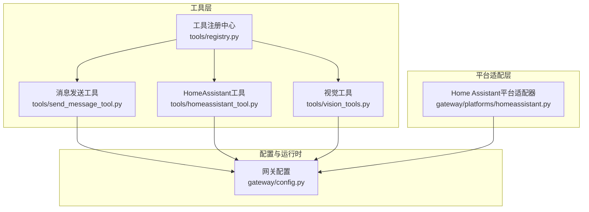
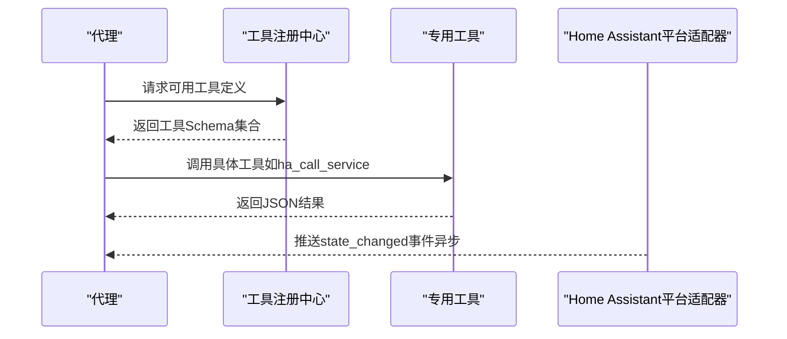
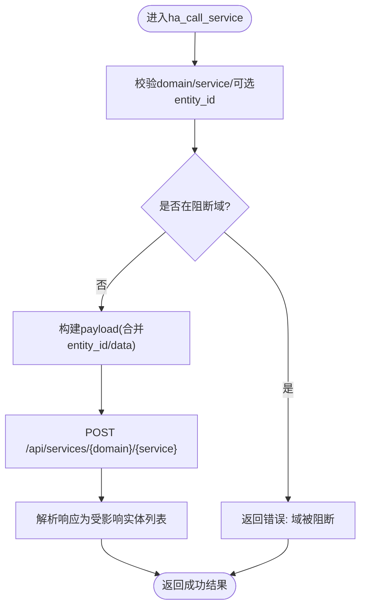
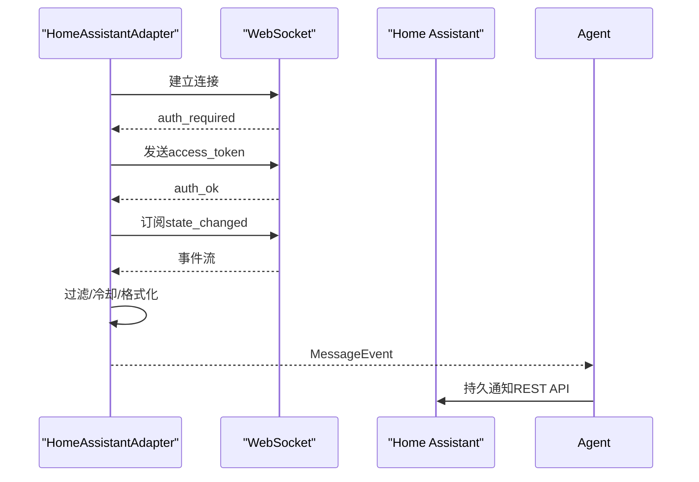
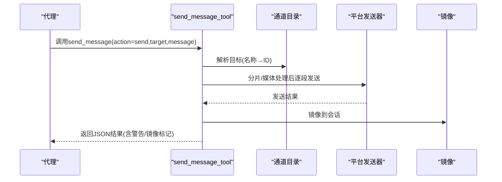
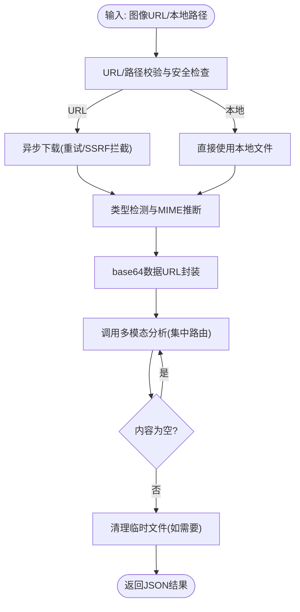
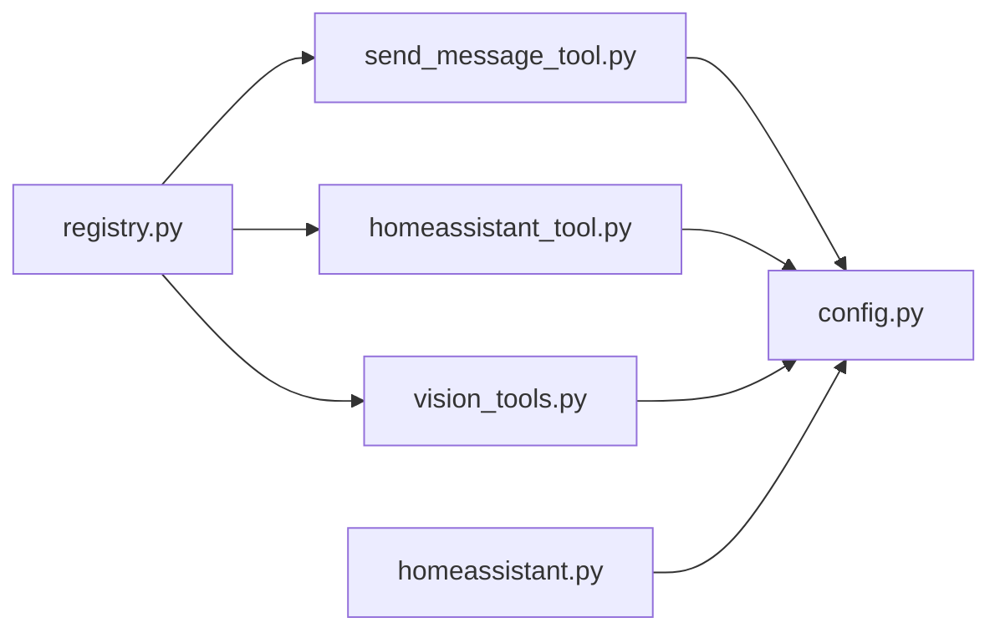

# 专用工具API

<cite>
**本文引用的文件**
- [homeassistant.py](file://gateway/platforms/homeassistant.py)
- [send_message_tool.py](file://tools/send_message_tool.py)
- [vision_tools.py](file://tools/vision_tools.py)
- [homeassistant_tool.py](file://tools/homeassistant_tool.py)
- [config.py](file://gateway/config.py)
- [registry.py](file://tools/registry.py)
- [test_homeassistant_tool.py](file://tests/tools/test_homeassistant_tool.py)
- [test_send_message_tool.py](file://tests/tools/test_send_message_tool.py)
- [test_vision_tools.py](file://tests/tools/test_vision_tools.py)
</cite>

## 目录
1. [简介](#简介)
2. [项目结构](#项目结构)
3. [核心组件](#核心组件)
4. [架构总览](#架构总览)
5. [详细组件分析](#详细组件分析)
6. [依赖分析](#依赖分析)
7. [性能考虑](#性能考虑)
8. [故障排查指南](#故障排查指南)
9. [结论](#结论)
10. [附录](#附录)

## 简介
本文件面向Hermes Agent的专用工具API，系统性阐述三类专用工具的能力边界与实现要点：
- HomeAssistant工具：设备实体查询、服务调用与自动化触发；同时介绍Home Assistant平台适配器的消息收发能力（事件订阅与通知下发）。
- 消息发送工具：跨平台消息发送、目标解析、媒体附件处理、智能分片与镜像回显。
- 视觉工具：图像下载、类型检测、编码与多模态分析，含安全防护与调试支持。

文档还覆盖配置与认证机制（环境变量、网关配置）、错误处理与故障恢复策略、使用示例与最佳实践，以及与代理的集成与扩展开发指南。

## 项目结构
围绕专用工具API的关键模块分布如下：
- 工具层
  - 消息发送工具：tools/send_message_tool.py
  - HomeAssistant工具：tools/homeassistant_tool.py
  - 视觉工具：tools/vision_tools.py
  - 工具注册中心：tools/registry.py
- 平台适配层
  - Home Assistant平台适配器：gateway/platforms/homeassistant.py
- 配置与运行时
  - 网关配置：gateway/config.py
  - 测试用例：tests/tools 下对应测试文件

图表来源
- [send_message_tool.py:1-953](file://tools/send_message_tool.py#L1-L953)
- [homeassistant_tool.py:1-491](file://tools/homeassistant_tool.py#L1-L491)
- [vision_tools.py:1-615](file://tools/vision_tools.py#L1-L615)
- [registry.py:1-321](file://tools/registry.py#L1-L321)
- [homeassistant.py:1-450](file://gateway/platforms/homeassistant.py#L1-L450)
- [config.py:1-958](file://gateway/config.py#L1-L958)

章节来源
- [send_message_tool.py:1-953](file://tools/send_message_tool.py#L1-L953)
- [homeassistant_tool.py:1-491](file://tools/homeassistant_tool.py#L1-L491)
- [vision_tools.py:1-615](file://tools/vision_tools.py#L1-L615)
- [registry.py:1-321](file://tools/registry.py#L1-L321)
- [homeassistant.py:1-450](file://gateway/platforms/homeassistant.py#L1-L450)
- [config.py:1-958](file://gateway/config.py#L1-L958)

## 核心组件
- HomeAssistant工具集（REST API）
  - 实体列表与过滤、单实体状态查询、服务清单查询、服务调用（带参数与实体绑定）
  - 安全域阻断与实体ID校验，避免危险服务与路径穿越
- Home Assistant平台适配器（WebSocket）
  - 订阅state_changed事件，按域/实体过滤与冷却去抖，格式化为人类可读消息并上送代理
  - 使用持久通知服务向Home Assistant发送消息
- 跨平台消息发送工具
  - 统一入口send_message_tool，支持平台列表、目标解析、智能分片、媒体附件（Telegram特供）、镜像回显
  - 对敏感错误内容进行脱敏输出
- 视觉分析工具
  - URL/本地文件输入，下载与类型检测，base64数据URL封装，多模态分析调用，调试日志与清理
  - SSRF防护、重定向拦截、网站白名单检查

章节来源
- [homeassistant_tool.py:1-491](file://tools/homeassistant_tool.py#L1-L491)
- [homeassistant.py:1-450](file://gateway/platforms/homeassistant.py#L1-L450)
- [send_message_tool.py:1-953](file://tools/send_message_tool.py#L1-L953)
- [vision_tools.py:1-615](file://tools/vision_tools.py#L1-L615)

## 架构总览
专用工具通过工具注册中心统一暴露给代理，代理根据可用性与上下文选择合适工具。HomeAssistant平台适配器独立于工具层，负责与Home Assistant实例的实时事件交互。

图表来源
- [registry.py:111-138](file://tools/registry.py#L111-L138)
- [homeassistant_tool.py:456-491](file://tools/homeassistant_tool.py#L456-L491)
- [homeassistant.py:217-318](file://gateway/platforms/homeassistant.py#L217-L318)

## 详细组件分析

### HomeAssistant工具（REST API）
- 功能范围
  - 列出实体：支持按域或区域过滤，返回实体简要信息
  - 获取状态：返回实体当前状态与属性
  - 列举服务：返回各域可用服务及字段说明
  - 调用服务：支持实体绑定与参数传递，自动构建payload
- 安全与校验
  - 内置危险域阻断列表（如shell_command、hassio等）
  - 实体ID格式严格校验，防止路径穿越
  - 可用性检查基于环境变量HASS_TOKEN存在性
- 错误处理
  - 统一返回JSON错误对象，便于代理与前端展示
  - 调用失败时保留原始异常信息但不泄露内部细节

图表来源
- [homeassistant_tool.py:242-265](file://tools/homeassistant_tool.py#L242-L265)
- [homeassistant_tool.py:133-144](file://tools/homeassistant_tool.py#L133-L144)
- [homeassistant_tool.py:168-191](file://tools/homeassistant_tool.py#L168-L191)

章节来源
- [homeassistant_tool.py:1-491](file://tools/homeassistant_tool.py#L1-L491)
- [test_homeassistant_tool.py:221-251](file://tests/tools/test_homeassistant_tool.py#L221-L251)

### Home Assistant平台适配器（WebSocket）
- 连接与认证
  - 建立WebSocket连接，接收auth_required后发送access_token，等待auth_ok
  - 订阅state_changed事件，按需过滤与冷却
- 事件处理
  - 解析事件数据，生成人类可读消息，封装为MessageEvent并交由handle_message处理
  - 支持域特定格式化（如HVAC模式、传感器单位、二进制传感器触发状态等）
- 发送消息
  - 使用持久通知REST API发送消息，避免与事件监听竞争同一WS连接
- 断线重连
  - 指数退避重连，异常时清理资源并记录日志

图表来源
- [homeassistant.py:140-185](file://gateway/platforms/homeassistant.py#L140-L185)
- [homeassistant.py:217-261](file://gateway/platforms/homeassistant.py#L217-L261)
- [homeassistant.py:386-439](file://gateway/platforms/homeassistant.py#L386-L439)

章节来源
- [homeassistant.py:1-450](file://gateway/platforms/homeassistant.py#L1-L450)

### 消息发送工具（跨平台）
- 统一入口
  - send_message_tool：支持action=list（列出可用目标）与action=send（发送消息）
  - 自动解析目标字符串（平台:频道/ID），支持Telegram话题与飞书ID
- 目标解析与镜像
  - 通过通道目录解析人类友好名称到ID
  - 发送后可镜像到会话，便于用户在目标平台看到回显
- 智能分片与媒体
  - 针对平台长度限制进行智能分片，保持代码块边界与段落
  - Telegram支持媒体附件（图片/视频/音频/语音），仅在最后片段发送
- 错误与安全
  - 敏感信息（如access_token）在错误中脱敏
  - 对重复投递（与计划任务自动投递冲突）进行跳过提示

图表来源
- [send_message_tool.py:99-221](file://tools/send_message_tool.py#L99-L221)
- [send_message_tool.py:302-410](file://tools/send_message_tool.py#L302-L410)
- [send_message_tool.py:413-536](file://tools/send_message_tool.py#L413-L536)

章节来源
- [send_message_tool.py:1-953](file://tools/send_message_tool.py#L1-L953)
- [test_send_message_tool.py:36-147](file://tests/tools/test_send_message_tool.py#L36-L147)
- [test_send_message_tool.py:420-459](file://tests/tools/test_send_message_tool.py#L420-L459)

### 视觉工具（图像处理与分析）
- 输入与下载
  - 支持HTTP/HTTPS URL与本地文件路径（含~展开）
  - 下载时进行SSRF防护与重定向拦截，最终URL再次校验
- 编码与封装
  - 类型检测与MIME推断，生成base64数据URL
  - 临时文件在分析完成后清理
- 多模态分析
  - 将文本提示与图像封装为消息结构，调用集中式LLM路由
  - 对空内容进行一次重试，增强鲁棒性
- 安全与调试
  - 网站白名单检查，阻止私有地址访问
  - 提供调试会话信息与详细日志

图表来源
- [vision_tools.py:124-213](file://tools/vision_tools.py#L124-L213)
- [vision_tools.py:264-495](file://tools/vision_tools.py#L264-L495)

章节来源
- [vision_tools.py:1-615](file://tools/vision_tools.py#L1-L615)
- [test_vision_tools.py:357-427](file://tests/tools/test_vision_tools.py#L357-L427)

## 依赖分析
- 工具注册中心
  - 所有工具在模块导入时注册，代理通过registry查询可用工具与Schema
  - 支持按工具集检查可用性，避免不可用工具被调度
- 网关配置
  - 平台配置（令牌、额外参数、Home Channel）由GatewayConfig加载，影响工具可用性与默认行为
  - 环境变量优先级高于配置文件，用于覆盖平台令牌与行为
- Home Assistant平台适配器
  - 依赖aiohttp进行WebSocket与REST通信
  - 通过环境变量HASS_TOKEN/HASS_URL进行认证与实例定位

图表来源
- [registry.py:56-89](file://tools/registry.py#L56-L89)
- [config.py:415-662](file://gateway/config.py#L415-L662)
- [homeassistant.py:65-88](file://gateway/platforms/homeassistant.py#L65-L88)

章节来源
- [registry.py:1-321](file://tools/registry.py#L1-L321)
- [config.py:1-958](file://gateway/config.py#L1-L958)
- [homeassistant.py:1-450](file://gateway/platforms/homeassistant.py#L1-L450)

## 性能考虑
- 消息发送
  - 长消息按平台上限智能分片，减少单次请求体积与失败概率
  - Telegram媒体仅在最后一段发送，降低网络开销
- Home Assistant平台适配器
  - 事件冷却（按实体去抖）避免风暴事件
  - 指数退避重连，降低瞬时故障对稳定性的影响
- 视觉分析
  - 异步下载与重试，临时文件及时清理，避免磁盘压力
  - 多模态调用超时可配置，避免长时间阻塞

## 故障排查指南
- HomeAssistant工具
  - 确认HASS_TOKEN已设置且有效；若返回“被阻断”，检查服务域是否在阻断列表中
  - 实体ID必须符合格式规范，避免路径穿越
- Home Assistant平台适配器
  - 若无法连接，检查HASS_URL与HASS_TOKEN；查看日志中的认证与订阅确认
  - 事件未到达：确认过滤条件（watch_domains/watch_entities/watch_all）与冷却时间
- 消息发送工具
  - 目标解析失败：使用action=list查看可用目标；确保平台启用且令牌正确
  - 重复投递：当与计划任务自动投递目标一致时会被跳过，检查HERMES_CRON_AUTO_DELIVER_*环境变量
  - 错误脱敏：敏感参数已在错误中隐藏，必要时查看日志以获取完整堆栈
- 视觉工具
  - URL被拦截：检查网站白名单与SSRF防护；确认最终URL未指向私有地址
  - 下载失败：关注重试次数与日志中的exc_info，确认网络可达性
  - 临时文件清理失败：检查权限与磁盘空间

章节来源
- [test_homeassistant_tool.py:311-323](file://tests/tools/test_homeassistant_tool.py#L311-L323)
- [test_send_message_tool.py:36-108](file://tests/tools/test_send_message_tool.py#L36-L108)
- [test_vision_tools.py:254-304](file://tests/tools/test_vision_tools.py#L254-L304)

## 结论
专用工具API围绕“安全、稳定、易用”设计：
- HomeAssistant工具提供完整的设备控制与状态查询能力，并内置安全域阻断与实体校验
- 消息发送工具统一跨平台交互，具备目标解析、智能分片与镜像回显
- 视觉工具在保障安全的前提下，提供可靠的图像分析能力
- 通过工具注册中心与网关配置，代理可灵活发现与调度工具，满足多样化的应用场景

## 附录

### 配置与认证机制
- 环境变量
  - HomeAssistant：HASS_TOKEN、HASS_URL
  - 跨平台消息：各平台令牌/密钥（如TELEGRAM_BOT_TOKEN、DISCORD_BOT_TOKEN等）
  - 视觉分析：辅助视觉模型提供商相关环境变量（如OPENROUTER_API_KEY等）
- 网关配置
  - 平台启用状态、令牌、Home Channel、回复模式等
  - 环境变量优先覆盖配置文件
- 权限与连接池
  - 工具层通过aiohttp客户端进行HTTP调用；平台适配器复用会话以降低连接成本
  - 安全策略：阻断域、实体ID校验、URL安全检查、SSRF拦截

章节来源
- [config.py:415-662](file://gateway/config.py#L415-L662)
- [homeassistant_tool.py:31-36](file://tools/homeassistant_tool.py#L31-L36)
- [send_message_tool.py:1-953](file://tools/send_message_tool.py#L1-L953)
- [vision_tools.py:1-615](file://tools/vision_tools.py#L1-L615)

### 使用示例与最佳实践
- 智能家居控制
  - 先ha_list_entities筛选域或区域，再ha_get_state获取详情，最后ha_call_service调用服务
  - 注意服务域是否在阻断列表中，必要时通过服务清单ha_list_services探索可用参数
- 跨平台通信
  - 使用send_message(action=list)查看可用目标；针对Telegram话题与飞书ID采用明确格式
  - 长消息自动分片，媒体仅在最后片段发送；注意平台长度限制
- 多媒体处理
  - 视觉分析支持URL与本地文件；建议先检查网站白名单与URL有效性
  - 临时文件自动清理，避免手动维护

章节来源
- [homeassistant_tool.py:330-447](file://tools/homeassistant_tool.py#L330-L447)
- [send_message_tool.py:49-77](file://tools/send_message_tool.py#L49-L77)
- [vision_tools.py:264-300](file://tools/vision_tools.py#L264-L300)

### 与代理的集成与扩展开发
- 工具注册
  - 工具模块导入时调用registry.register完成Schema与处理器注册
  - 代理通过registry.get_definitions动态获取可用工具，避免硬编码
- 扩展新工具
  - 定义Schema与处理器，注册到对应toolset
  - 如需环境依赖，提供check_fn并在registry中声明requirements_env
- 平台适配器扩展
  - 参考HomeAssistant平台适配器的连接、认证、事件处理与重连逻辑
  - 严格遵循错误处理与日志记录规范

章节来源
- [registry.py:56-89](file://tools/registry.py#L56-L89)
- [registry.py:111-138](file://tools/registry.py#L111-L138)
- [homeassistant.py:140-185](file://gateway/platforms/homeassistant.py#L140-L185)