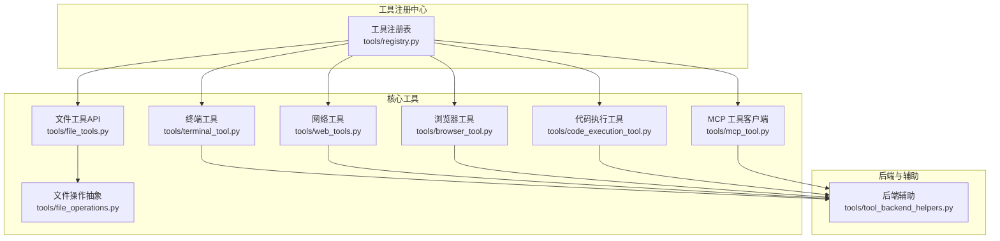
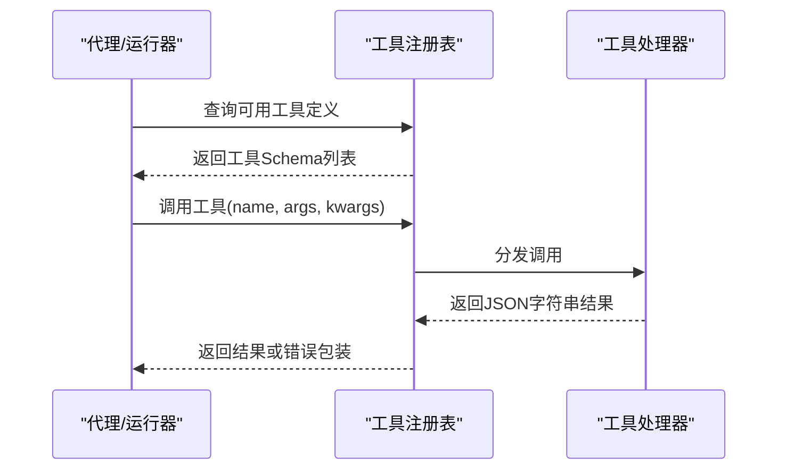
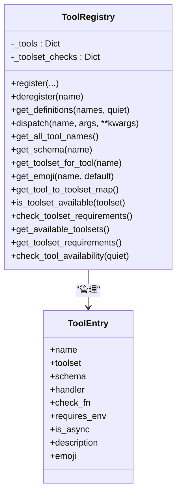
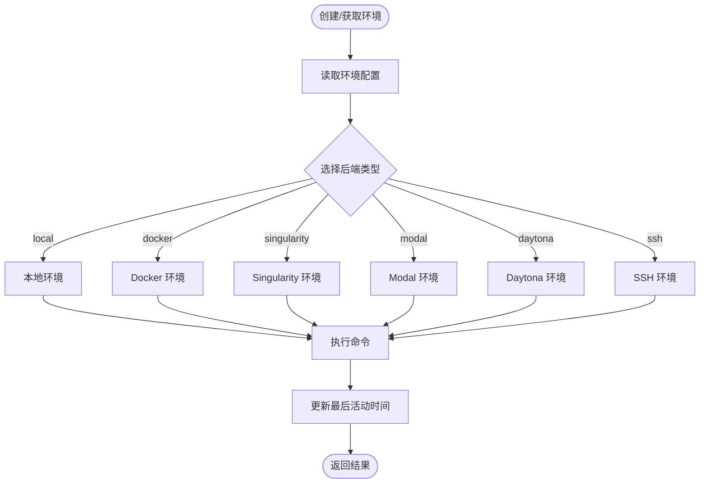
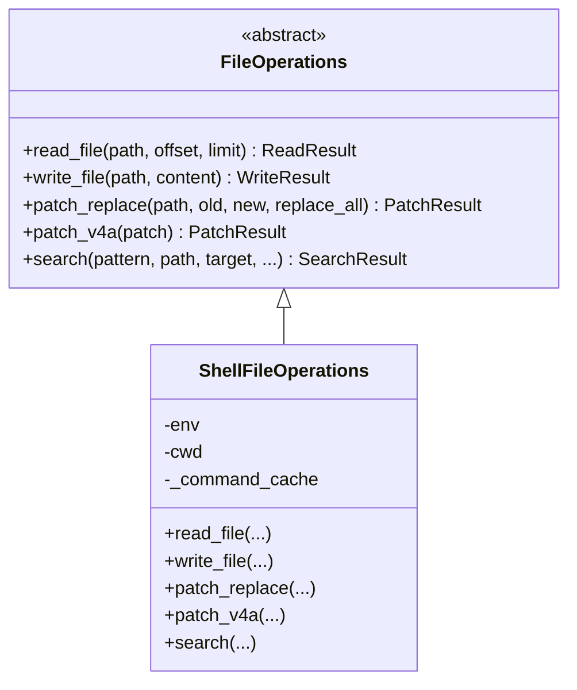
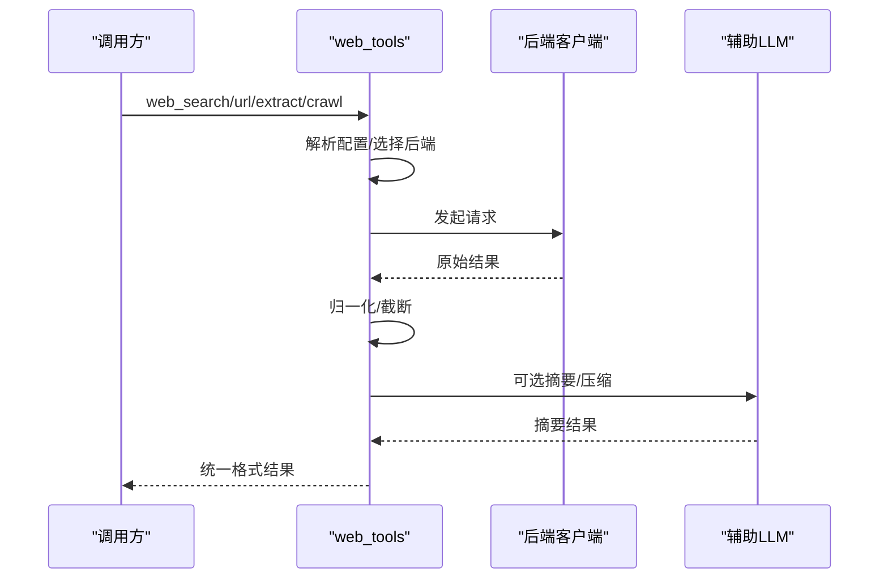
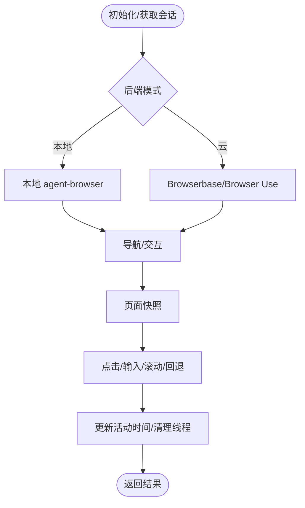
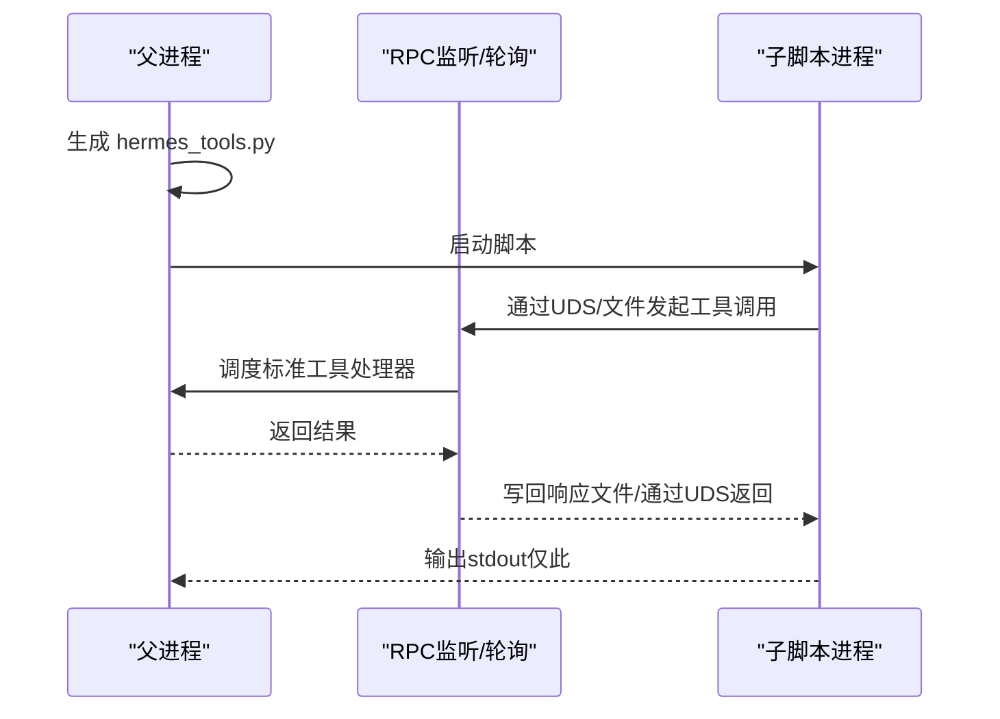
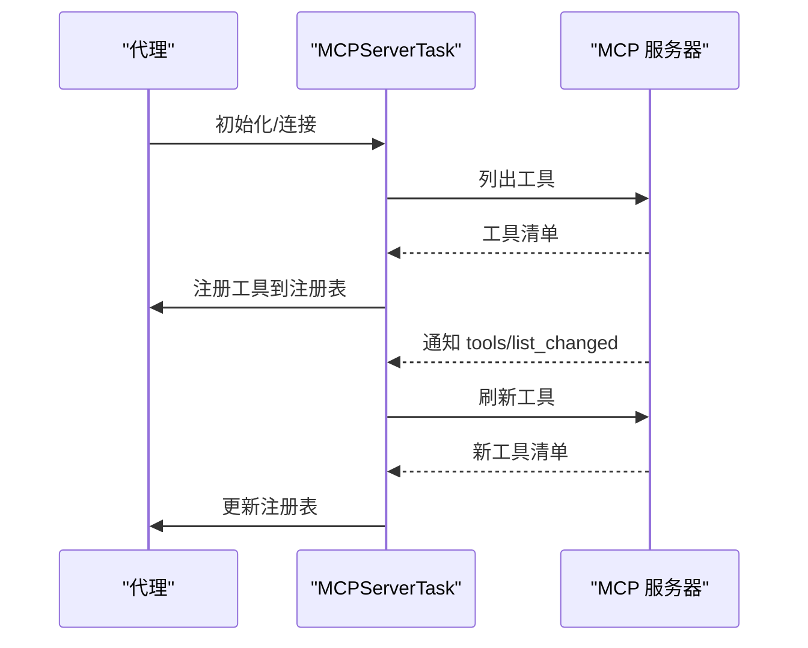
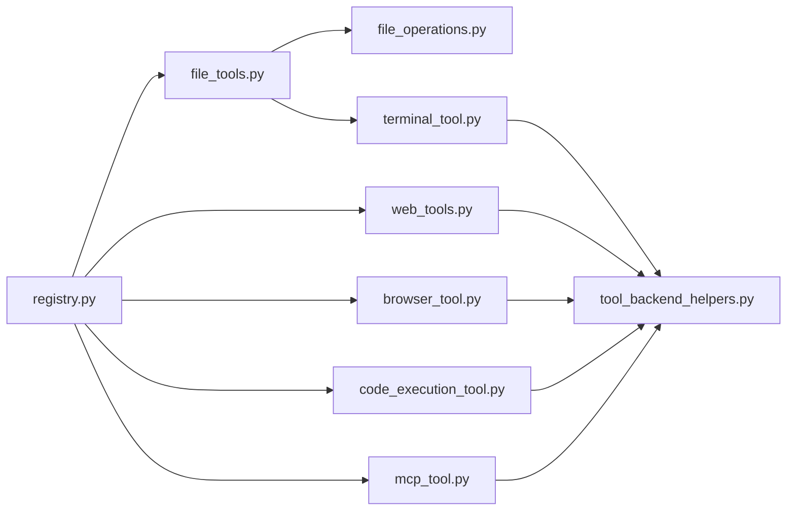

# 工具系统API

<cite>
**本文档引用的文件**
- [tools/__init__.py](file://tools/__init__.py)
- [tools/registry.py](file://tools/registry.py)
- [tools/terminal_tool.py](file://tools/terminal_tool.py)
- [tools/file_operations.py](file://tools/file_operations.py)
- [tools/file_tools.py](file://tools/file_tools.py)
- [tools/web_tools.py](file://tools/web_tools.py)
- [tools/browser_tool.py](file://tools/browser_tool.py)
- [tools/code_execution_tool.py](file://tools/code_execution_tool.py)
- [tools/mcp_tool.py](file://tools/mcp_tool.py)
- [tools/tool_backend_helpers.py](file://tools/tool_backend_helpers.py)
</cite>

## 目录
1. [简介](#简介)
2. [项目结构](#项目结构)
3. [核心组件](#核心组件)
4. [架构总览](#架构总览)
5. [详细组件分析](#详细组件分析)
6. [依赖关系分析](#依赖关系分析)
7. [性能考虑](#性能考虑)
8. [故障排除指南](#故障排除指南)
9. [结论](#结论)

## 简介
本文件为 Hermes Agent 的工具系统提供全面的 API 参考文档，覆盖工具注册机制、接口规范、调用流程、参数验证、结果处理与错误传播、工具集管理（启用/禁用/配置）、安全沙箱与资源限制、超时控制、并发执行与状态管理，以及自定义工具开发指南与与代理的集成方式。内容基于仓库中的工具模块实现进行整理，确保技术细节可追溯至具体源码。

## 项目结构
工具系统主要由以下层次构成：
- 工具注册中心：集中管理工具元数据、可用性检查、分发与序列化辅助函数
- 具体工具实现：终端工具、文件操作工具、网络工具、浏览器工具、代码执行工具、MCP 工具等
- 后端辅助：环境选择、Modal/云后端模式、路径解析与安全策略
- 集成入口：CLI/运行器通过工具注册中心查询可用工具并调度执行

**图表来源**
- [tools/registry.py:45-275](file://tools/registry.py#L45-L275)
- [tools/terminal_tool.py:495-713](file://tools/terminal_tool.py#L495-L713)
- [tools/file_operations.py:321-800](file://tools/file_operations.py#L321-L800)
- [tools/file_tools.py:149-267](file://tools/file_tools.py#L149-L267)
- [tools/web_tools.py:1-200](file://tools/web_tools.py#L1-L200)
- [tools/browser_tool.py:1-120](file://tools/browser_tool.py#L1-L120)
- [tools/code_execution_tool.py:1-120](file://tools/code_execution_tool.py#L1-L120)
- [tools/mcp_tool.py:1-120](file://tools/mcp_tool.py#L1-L120)
- [tools/tool_backend_helpers.py:1-90](file://tools/tool_backend_helpers.py#L1-L90)

**章节来源**
- [tools/__init__.py:1-26](file://tools/__init__.py#L1-L26)
- [tools/registry.py:1-321](file://tools/registry.py#L1-L321)

## 核心组件
- 工具注册表（ToolRegistry）：统一注册、查询、可用性检查、分发与错误包装；提供工具集元信息与可用性统计
- 文件操作抽象（FileOperations/ShellFileOperations）：跨后端的文件读写、补丁、搜索能力，内置二进制/图像检测、写入保护、命令缓存与限流
- 终端工具（terminal_tool）：多后端执行环境（本地/容器/Modal/SSH/Daytona），支持持久化、清理、sudo 处理、危险命令审批、磁盘使用告警
- 网络工具（web_tools）：多后端搜索/提取/抓取（Exa/Firecrawl/Parallel/Tavily），支持 LLM 智能摘要、调试会话、网关路由
- 浏览器工具（browser_tool）：本地/云浏览器（Browserbase/Browser Use）会话管理、元素交互、快照、清理线程、SSRF 保护
- 代码执行工具（code_execution_tool）：程序化工具调用（PTC），本地 UDS 或远程文件传输两种传输方式，带资源限制与工具调用计数
- MCP 工具（mcp_tool）：连接外部 MCP 服务器，动态发现工具，注册到注册表，采样回调与速率限制
- 后端辅助（tool_backend_helpers）：浏览器/Modal 后端模式规范化、凭证检测、环境变量过滤、OpenAI 音频密钥回退

**章节来源**
- [tools/registry.py:24-321](file://tools/registry.py#L24-L321)
- [tools/file_operations.py:247-800](file://tools/file_operations.py#L247-L800)
- [tools/file_tools.py:149-824](file://tools/file_tools.py#L149-L824)
- [tools/terminal_tool.py:495-800](file://tools/terminal_tool.py#L495-L800)
- [tools/web_tools.py:1-800](file://tools/web_tools.py#L1-L800)
- [tools/browser_tool.py:1-800](file://tools/browser_tool.py#L1-L800)
- [tools/code_execution_tool.py:1-800](file://tools/code_execution_tool.py#L1-L800)
- [tools/mcp_tool.py:1-800](file://tools/mcp_tool.py#L1-L800)
- [tools/tool_backend_helpers.py:1-90](file://tools/tool_backend_helpers.py#L1-L90)

## 架构总览
工具系统采用“注册表驱动”的架构：各工具在导入时向注册表注册自身模式、处理器、可用性检查与描述；代理侧通过注册表查询可用工具并进行分发。注册表负责：
- 注册/反注册工具
- 过滤不可用工具（按 check_fn）
- 分发工具调用（同步/异步桥接）
- 错误统一包装
- 工具集元信息与可用性统计

**图表来源**
- [tools/registry.py:111-162](file://tools/registry.py#L111-L162)

**章节来源**
- [tools/registry.py:45-275](file://tools/registry.py#L45-L275)

## 详细组件分析

### 工具注册与分发（Registry）
- 注册接口：register(name, toolset, schema, handler, check_fn, requires_env, is_async, description, emoji)
- 反注册：deregister(name)，自动清理空工具集的检查函数
- 可用性过滤：get_definitions(tool_names, quiet) 依据 check_fn 过滤
- 分发：dispatch(name, args, **kwargs)，自动桥接异步处理器，捕获异常并统一返回 JSON 错误
- 辅助：tool_error/tool_result 统一错误/结果序列化

**图表来源**
- [tools/registry.py:24-275](file://tools/registry.py#L24-L275)

**章节来源**
- [tools/registry.py:56-162](file://tools/registry.py#L56-L162)
- [tools/registry.py:294-321](file://tools/registry.py#L294-L321)

### 终端工具（terminal_tool）
- 支持后端：local、docker、singularity、modal、daytona、ssh
- 环境生命周期：全局活跃环境字典、最后活动时间、清理线程、任务级环境覆盖
- 安全与权限：sudo 密码缓存与交互提示、危险命令审批、设备路径阻断、磁盘使用告警
- 资源与超时：环境配置解析（超时、CPU/内存/磁盘、持久化等）、Modal 后端模式解析
- 并发与清理：每任务创建锁、清理线程周期扫描、进程注册联动避免误删

**图表来源**
- [tools/terminal_tool.py:583-713](file://tools/terminal_tool.py#L583-L713)
- [tools/terminal_tool.py:715-790](file://tools/terminal_tool.py#L715-L790)

**章节来源**
- [tools/terminal_tool.py:495-800](file://tools/terminal_tool.py#L495-L800)

### 文件操作与文件工具（file_operations + file_tools）
- 抽象层：FileOperations 接口 + ShellFileOperations 实现，统一跨后端文件操作
- 安全策略：写入拒绝列表（系统/凭证敏感路径）、可选安全根目录约束、写前校验
- 读取：分页、二进制/图像检测、行号添加、相似文件建议、字符数上限与去重
- 写入：父目录自动创建、stdin 管道写入规避 ARG_MAX、写后统计
- 补丁：替换模式（模糊匹配）、V4A 多文件补丁、语法检查
- 搜索：Ripgrep 后端、输出模式（内容/文件/计数）、上下文行
- 工具层：read_file/write_file/patch/search 包装，读写去重与连续循环检测，staleness 提示

**图表来源**
- [tools/file_operations.py:247-327](file://tools/file_operations.py#L247-L327)

**章节来源**
- [tools/file_operations.py:321-800](file://tools/file_operations.py#L321-L800)
- [tools/file_tools.py:149-824](file://tools/file_tools.py#L149-L824)

### 网络工具（web_tools）
- 后端选择：Exa/Firecrawl/Parallel/Tavily，支持直连与工具网关（Nous 订阅者）
- 客户端初始化：延迟加载、配置解析、工具网关解析、令牌读取
- 结果归一化：不同后端响应标准化为统一格式
- LLM 摘要：大文本智能压缩与分块处理，带输出长度限制与失败回退
- 调试：可选调试会话，记录调用与压缩指标

**图表来源**
- [tools/web_tools.py:1-200](file://tools/web_tools.py#L1-L200)
- [tools/web_tools.py:477-690](file://tools/web_tools.py#L477-L690)

**章节来源**
- [tools/web_tools.py:1-800](file://tools/web_tools.py#L1-L800)

### 浏览器工具（browser_tool）
- 后端：本地 agent-browser、Browserbase、Browser Use、Firecrawl
- 会话管理：每任务会话隔离、清理线程、活动时间跟踪、CDP 端点解析
- 安全：SSRF 保护（默认禁止私有地址）、URL 安全检查、网站策略检查
- 功能：导航、快照（紧凑/完整）、点击/输入/滚动/回退/按键、图片提取、控制台、视觉分析

**图表来源**
- [tools/browser_tool.py:690-744](file://tools/browser_tool.py#L690-L744)
- [tools/browser_tool.py:414-494](file://tools/browser_tool.py#L414-L494)

**章节来源**
- [tools/browser_tool.py:1-800](file://tools/browser_tool.py#L1-L800)

### 代码执行工具（code_execution_tool）
- 传输方式：本地 UDS（Unix Domain Socket）或远程文件传输
- 允许工具集合：web_search、web_extract、read_file、write_file、search_files、patch、terminal
- 资源限制：超时、最大工具调用次数、stdout/stderr 字节数限制
- 远程执行：在终端后端创建沙箱目录，生成 hermes_tools.py，通过轮询文件实现 RPC

**图表来源**
- [tools/code_execution_tool.py:129-162](file://tools/code_execution_tool.py#L129-L162)
- [tools/code_execution_tool.py:306-425](file://tools/code_execution_tool.py#L306-L425)
- [tools/code_execution_tool.py:546-683](file://tools/code_execution_tool.py#L546-L683)

**章节来源**
- [tools/code_execution_tool.py:1-800](file://tools/code_execution_tool.py#L1-L800)

### MCP 工具客户端（mcp_tool）
- 连接：stdio 或 HTTP/StreamableHTTP 传输，自动重连（指数退避）
- 安全：环境变量过滤、错误消息中凭据脱敏
- 动态发现：接收 tools/list_changed 通知后刷新工具注册
- 采样：服务器主动请求 LLM 补充消息，带速率限制、模型白名单、工具循环限制与审计日志

**图表来源**
- [tools/mcp_tool.py:719-800](file://tools/mcp_tool.py#L719-L800)
- [tools/mcp_tool.py:349-714](file://tools/mcp_tool.py#L349-L714)

**章节来源**
- [tools/mcp_tool.py:1-800](file://tools/mcp_tool.py#L1-L800)

### 工具集管理与可用性检查
- 工具集可用性：按工具集维度检查 check_fn，返回可用/不可用集合
- 工具集元信息：每个工具集包含可用性、工具列表、要求的环境变量
- 工具注册：同一名称冲突时记录警告并覆盖（不同工具集）

**章节来源**
- [tools/registry.py:194-271](file://tools/registry.py#L194-L271)

## 依赖关系分析
- 注册表是所有工具的中枢，工具在导入时注册，代理侧通过注册表查询与分发
- 文件工具依赖文件操作抽象与终端工具提供的环境
- 终端工具依赖后端辅助（环境选择、Modal 模式、SSH/Docker 配置）
- 网络/浏览器/代码执行/MCP 工具均依赖后端辅助与安全策略
- 各工具通过统一的 tool_error/tool_result 序列化返回值

**图表来源**
- [tools/registry.py:45-275](file://tools/registry.py#L45-L275)
- [tools/file_tools.py:149-267](file://tools/file_tools.py#L149-L267)
- [tools/file_operations.py:321-348](file://tools/file_operations.py#L321-L348)
- [tools/terminal_tool.py:495-572](file://tools/terminal_tool.py#L495-L572)
- [tools/web_tools.py:1-120](file://tools/web_tools.py#L1-L120)
- [tools/browser_tool.py:1-120](file://tools/browser_tool.py#L1-L120)
- [tools/code_execution_tool.py:1-120](file://tools/code_execution_tool.py#L1-L120)
- [tools/mcp_tool.py:1-120](file://tools/mcp_tool.py#L1-L120)
- [tools/tool_backend_helpers.py:1-90](file://tools/tool_backend_helpers.py#L1-L90)

**章节来源**
- [tools/registry.py:1-321](file://tools/registry.py#L1-L321)
- [tools/file_tools.py:149-267](file://tools/file_tools.py#L149-L267)
- [tools/terminal_tool.py:495-572](file://tools/terminal_tool.py#L495-L572)
- [tools/web_tools.py:1-120](file://tools/web_tools.py#L1-L120)
- [tools/browser_tool.py:1-120](file://tools/browser_tool.py#L1-L120)
- [tools/code_execution_tool.py:1-120](file://tools/code_execution_tool.py#L1-L120)
- [tools/mcp_tool.py:1-120](file://tools/mcp_tool.py#L1-L120)
- [tools/tool_backend_helpers.py:1-90](file://tools/tool_backend_helpers.py#L1-L90)

## 性能考虑
- 文件读取字符数上限与分页，避免上下文窗口溢出
- 文件搜索使用 ripgrep，比 shell 命令更高效
- 终端工具对命令可用性进行缓存，减少重复探测
- 清理线程定期回收不活跃环境，避免资源泄漏
- 代码执行工具限制最大工具调用次数与输出大小
- 网络工具对大文本进行分块处理与摘要，降低 token 使用
- 浏览器工具会话清理线程与活动时间跟踪，避免长时间占用

## 故障排除指南
- 工具调用错误：统一通过 tool_error 序列化错误消息；检查工具是否存在、参数是否正确、后端是否可用
- 文件读取过大：使用 offset/limit 分页；超过字符上限会被拒绝
- 写入被拒绝：检查敏感路径与安全根目录设置；必要时使用终端工具配合 sudo
- 终端超时/中断：调整超时配置；注意后台任务与通知完成模式
- 网络工具配置：确认后端 API Key/网关 URL；调试开关开启以获取详细日志
- 浏览器工具：检查本地 agent-browser 是否安装；云后端需正确配置凭据
- 代码执行工具：本地需 POSIX 系统；远程需 Python3；检查工具调用次数与输出大小限制
- MCP 工具：检查服务器连接、凭据过滤与采样配置；查看动态发现与通知日志

**章节来源**
- [tools/registry.py:294-321](file://tools/registry.py#L294-L321)
- [tools/file_tools.py:279-436](file://tools/file_tools.py#L279-L436)
- [tools/file_operations.py:469-557](file://tools/file_operations.py#L469-L557)
- [tools/terminal_tool.py:715-790](file://tools/terminal_tool.py#L715-L790)
- [tools/web_tools.py:1-200](file://tools/web_tools.py#L1-L200)
- [tools/browser_tool.py:1-200](file://tools/browser_tool.py#L1-L200)
- [tools/code_execution_tool.py:1-200](file://tools/code_execution_tool.py#L1-L200)
- [tools/mcp_tool.py:1-200](file://tools/mcp_tool.py#L1-L200)

## 结论
Hermes Agent 的工具系统通过注册表实现统一管理与分发，结合多后端执行环境与严格的安全策略，提供了稳定、可扩展且高性能的工具生态。开发者可通过实现工具处理器与模式定义快速扩展新工具，并利用现有工具集与后端辅助实现复杂任务编排。建议在生产环境中合理配置资源限制、超时与清理策略，确保长期运行的稳定性与安全性。