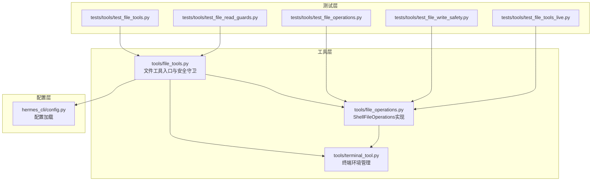
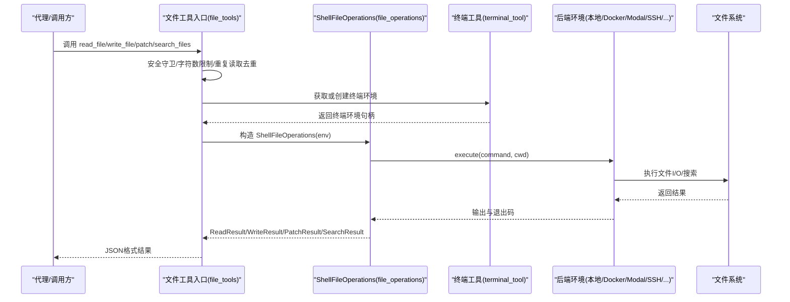
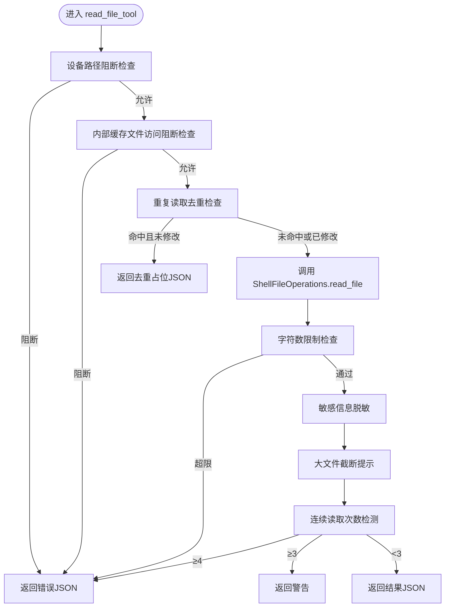
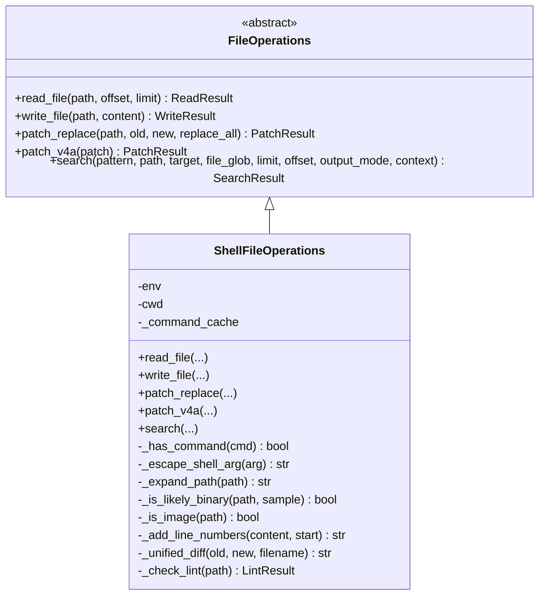
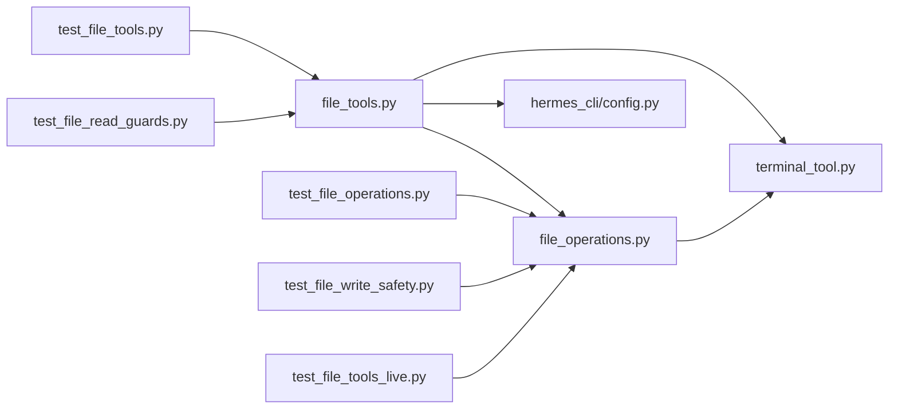

# 文件操作工具API

<cite>
**本文档引用的文件**
- [tools/file_tools.py](file://tools/file_tools.py)
- [tools/file_operations.py](file://tools/file_operations.py)
- [tools/terminal_tool.py](file://tools/terminal_tool.py)
- [tests/tools/test_file_tools.py](file://tests/tools/test_file_tools.py)
- [tests/tools/test_file_operations.py](file://tests/tools/test_file_operations.py)
- [tests/tools/test_file_read_guards.py](file://tests/tools/test_file_read_guards.py)
- [tests/tools/test_file_write_safety.py](file://tests/tools/test_file_write_safety.py)
- [tests/tools/test_file_tools_live.py](file://tests/tools/test_file_tools_live.py)
- [hermes_cli/config.py](file://hermes_cli/config.py)
</cite>

## 目录
1. [简介](#简介)
2. [项目结构](#项目结构)
3. [核心组件](#核心组件)
4. [架构总览](#架构总览)
5. [详细组件分析](#详细组件分析)
6. [依赖关系分析](#依赖关系分析)
7. [性能考虑](#性能考虑)
8. [故障排除指南](#故障排除指南)
9. [结论](#结论)
10. [附录](#附录)

## 简介
本文件操作工具API为Hermes Agent提供统一的文件系统能力，覆盖文件读写、目录搜索与内容检索、以及文件变更监控等关键功能。该API在多后端（本地、Docker、Modal、SSH、Singularity、Daytona）环境中保持一致行为，通过安全机制（路径验证、权限检查、敏感路径拦截、字符数限制、重复读取去重）保障代理在执行文件操作时的安全性与稳定性。

## 项目结构
文件操作相关的核心代码位于tools目录下，配合终端工具模块实现跨环境的文件操作能力；测试用例覆盖了安全守卫、结果数据结构、命令注入防护、以及真实环境集成验证。

**图表来源**
- [tools/file_tools.py:1-824](file://tools/file_tools.py#L1-L824)
- [tools/file_operations.py:1-1102](file://tools/file_operations.py#L1-L1102)
- [tools/terminal_tool.py:1-200](file://tools/terminal_tool.py#L1-L200)
- [tests/tools/test_file_tools.py:1-315](file://tests/tools/test_file_tools.py#L1-L315)
- [tests/tools/test_file_operations.py:1-336](file://tests/tools/test_file_operations.py#L1-L336)
- [tests/tools/test_file_read_guards.py:1-379](file://tests/tools/test_file_read_guards.py#L1-L379)
- [tests/tools/test_file_write_safety.py:1-84](file://tests/tools/test_file_write_safety.py#L1-L84)
- [tests/tools/test_file_tools_live.py:1-588](file://tests/tools/test_file_tools_live.py#L1-L588)
- [hermes_cli/config.py:1-200](file://hermes_cli/config.py#L1-L200)

**章节来源**
- [tools/file_tools.py:1-824](file://tools/file_tools.py#L1-L824)
- [tools/file_operations.py:1-1102](file://tools/file_operations.py#L1-L1102)
- [tools/terminal_tool.py:1-200](file://tools/terminal_tool.py#L1-L200)
- [tests/tools/test_file_tools.py:1-315](file://tests/tools/test_file_tools.py#L1-L315)
- [tests/tools/test_file_operations.py:1-336](file://tests/tools/test_file_operations.py#L1-L336)
- [tests/tools/test_file_read_guards.py:1-379](file://tests/tools/test_file_read_guards.py#L1-L379)
- [tests/tools/test_file_write_safety.py:1-84](file://tests/tools/test_file_write_safety.py#L1-L84)
- [tests/tools/test_file_tools_live.py:1-588](file://tests/tools/test_file_tools_live.py#L1-L588)
- [hermes_cli/config.py:1-200](file://hermes_cli/config.py#L1-L200)

## 核心组件
- 文件工具入口：提供read_file、write_file、patch、search_files四个工具函数，封装安全守卫、字符数限制、重复读取去重、敏感路径检查、写入前缀沙箱等机制，并将调用委托给ShellFileOperations。
- ShellFileOperations：基于终端后端execute接口实现的统一文件操作实现，支持本地、Docker、Modal、SSH、Singularity、Daytona等环境；内置二进制检测、图像识别、行号格式化、Ripgrep/Grep搜索、补丁应用与语法检查。
- 终端工具：负责环境生命周期管理、清理线程、任务隔离、危险命令审批回调等，为文件操作提供稳定的执行环境。
- 测试体系：覆盖安全守卫（设备路径阻断、字符数限制、重复读取去重、HERMES_WRITE_SAFE_ROOT）、结果数据结构、命令注入防护、真实环境一致性验证等。

**章节来源**
- [tools/file_tools.py:279-800](file://tools/file_tools.py#L279-L800)
- [tools/file_operations.py:321-1102](file://tools/file_operations.py#L321-L1102)
- [tools/terminal_tool.py:1-200](file://tools/terminal_tool.py#L1-L200)
- [tests/tools/test_file_tools.py:1-315](file://tests/tools/test_file_tools.py#L1-L315)
- [tests/tools/test_file_operations.py:1-336](file://tests/tools/test_file_operations.py#L1-L336)
- [tests/tools/test_file_read_guards.py:1-379](file://tests/tools/test_file_read_guards.py#L1-L379)
- [tests/tools/test_file_write_safety.py:1-84](file://tests/tools/test_file_write_safety.py#L1-L84)
- [tests/tools/test_file_tools_live.py:1-588](file://tests/tools/test_file_tools_live.py#L1-L588)

## 架构总览
文件操作从代理到终端后端的调用链路如下：

**图表来源**
- [tools/file_tools.py:149-267](file://tools/file_tools.py#L149-L267)
- [tools/file_operations.py:329-367](file://tools/file_operations.py#L329-L367)
- [tools/terminal_tool.py:1-200](file://tools/terminal_tool.py#L1-L200)

**章节来源**
- [tools/file_tools.py:149-267](file://tools/file_tools.py#L149-L267)
- [tools/file_operations.py:329-367](file://tools/file_operations.py#L329-L367)
- [tools/terminal_tool.py:1-200](file://tools/terminal_tool.py#L1-L200)

## 详细组件分析

### 文件工具入口（file_tools）
- 安全守卫
  - 设备路径阻断：对/dev/zero、/dev/stdin、/proc/self/fd/*等可能造成阻塞或无限输出的路径直接拒绝。
  - 内部缓存文件访问阻断：禁止直接读取Hermes内部索引缓存文件，防止提示词注入。
  - 敏感路径检查：拒绝写入/etc/、/boot/、/usr/lib/systemd/及特定系统套接字等敏感位置。
  - 字符数限制：默认最大返回字符数可由配置文件覆盖，避免上下文窗口压力。
  - 重复读取去重：同一任务内相同路径+偏移+范围的重复读取返回轻量占位，节省上下文。
  - 连续循环检测：连续重复读取超过阈值会给出警告或阻止，防止死循环。
- 工具函数
  - read_file_tool：带分页、行号、截断提示、大文件建议、敏感信息脱敏。
  - write_file_tool：创建父目录、写入内容、统计字节数、敏感路径拦截、写后时间戳更新。
  - patch_tool：支持“替换模式”和“V4A补丁模式”，自动语法检查，失败时给出提示。
  - search_tool：支持内容搜索与文件名搜索，自动选择ripgrep/grep，支持上下文行、计数模式、分页提示。
- 集成与缓存
  - 通过_get_file_ops按任务ID获取ShellFileOperations实例，支持缓存与环境清理线程。
  - 提供读取历史汇总、去重缓存重置、与其他工具调用的协同（如通知其他工具调用以重置连续读取计数）。

**图表来源**
- [tools/file_tools.py:279-436](file://tools/file_tools.py#L279-L436)

**章节来源**
- [tools/file_tools.py:279-800](file://tools/file_tools.py#L279-L800)

### ShellFileOperations实现（file_operations）
- 数据结构
  - ReadResult/WriteResult/PatchResult/SearchResult/LintResult：标准化返回结构，to_dict用于序列化。
- 读取实现
  - 路径展开（~与~user）、二进制检测（扩展名+采样分析）、图像识别、分页读取（sed）、行号格式化、总行数统计、截断提示。
- 写入实现
  - 敏感路径拦截（静态列表+可选安全根目录HERMES_WRITE_SAFE_ROOT）、父目录创建、stdin管道写入规避ARG_MAX限制、字节数统计。
- 补丁实现
  - 替换模式：模糊匹配查找与替换，生成统一差异，自动语法检查。
  - V4A模式：解析并应用多文件补丁。
- 搜索实现
  - 优先ripgrep（尊重.gitignore、隐藏目录过滤、并行遍历），回退至grep或find；支持内容搜索、文件名搜索、文件计数、上下文行、分页与截断标记。
- 命令可用性缓存与安全性
  - _has_command缓存命令存在性；_escape_shell_arg安全转义；_expand_path限制用户名注入风险。

**图表来源**
- [tools/file_operations.py:247-277](file://tools/file_operations.py#L247-L277)
- [tools/file_operations.py:321-1102](file://tools/file_operations.py#L321-L1102)

**章节来源**
- [tools/file_operations.py:1-1102](file://tools/file_operations.py#L1-L1102)

### 终端工具（terminal_tool）
- 环境管理：按TERMINAL_ENV选择后端类型（local/docker/modal/ssh/singularity/daytona），支持持久化工作目录、容器/VM生命周期管理、空闲清理线程。
- 危险命令审批：集中化的危险命令检测与审批回调，支持消息网关场景下的sudo密码提示与批准策略。
- 工作目录校验：基于白名单字符集拒绝危险路径，降低路径注入风险。

**章节来源**
- [tools/terminal_tool.py:1-200](file://tools/terminal_tool.py#L1-L200)

### 安全机制与配置

#### 路径验证与权限检查
- 设备路径阻断：针对/dev/zero、/dev/random、/dev/stdin、/proc/self/fd/*等阻断，避免阻塞或无限输出。
- 内部缓存文件保护：禁止直接读取Hermes内部索引缓存文件，防止提示词注入。
- 敏感路径拦截：拒绝写入/etc/、/boot/、/usr/lib/systemd/及特定系统套接字；静态deny列表+可选HERMES_WRITE_SAFE_ROOT安全根目录沙箱。
- 路径展开安全：限制~与~user展开，防止命令注入；对无效用户名直接返回原路径不展开。

**章节来源**
- [tools/file_tools.py:73-116](file://tools/file_tools.py#L73-L116)
- [tools/file_operations.py:42-116](file://tools/file_operations.py#L42-L116)
- [tests/tools/test_file_read_guards.py:58-88](file://tests/tools/test_file_read_guards.py#L58-L88)
- [tests/tools/test_file_write_safety.py:14-84](file://tests/tools/test_file_write_safety.py#L14-L84)

#### 字符数限制与重复读取去重
- 字符数限制：默认上限可通过配置文件覆盖；超限时返回错误并建议使用offset/limit分段读取。
- 重复读取去重：同一任务内相同路径+偏移+范围的重复读取返回轻量占位；文件修改后自动失效去重缓存。
- 连续循环检测：连续重复读取≥4次阻止，≥3次警告，防止死循环。

**章节来源**
- [tools/file_tools.py:31-56](file://tools/file_tools.py#L31-L56)
- [tools/file_tools.py:316-432](file://tools/file_tools.py#L316-L432)
- [tests/tools/test_file_read_guards.py:94-138](file://tests/tools/test_file_read_guards.py#L94-L138)
- [tests/tools/test_file_read_guards.py:144-216](file://tests/tools/test_file_read_guards.py#L144-L216)

#### 配置项与参数
- file_read_max_chars：控制单次读取字符上限，默认约10万字符，可通过配置文件调整。
- HERMES_WRITE_SAFE_ROOT：可选环境变量，将写入限制在指定子树内，即使静态deny列表未覆盖的路径也会被拒绝。
- 终端环境配置：TERMINAL_ENV、容器资源（CPU/内存/磁盘）、持久化开关、SSH连接参数等，影响ShellFileOperations的工作目录与命令可用性。

**章节来源**
- [tools/file_tools.py:31-56](file://tools/file_tools.py#L31-L56)
- [tools/file_operations.py:81-96](file://tools/file_operations.py#L81-L96)
- [hermes_cli/config.py:1-200](file://hermes_cli/config.py#L1-L200)

### 错误处理与异常恢复
- 预期写入异常：对权限不足、只读文件系统、只读文件等预期异常进行降噪日志处理，避免污染错误日志。
- 搜索失败处理：ripgrep/grep返回非零退出码时，根据错误类型返回明确的错误信息；路径不存在时给出提示。
- 重复读取与搜索：连续重复触发警告或阻止，帮助代理跳出循环；搜索截断时提供下一页offset提示。
- 实时输出清洁：终端噪声过滤（如bash提示、zsh会话信息）确保代理看到的输出干净。

**章节来源**
- [tools/file_tools.py:575-581](file://tools/file_tools.py#L575-L581)
- [tools/file_operations.py:939-943](file://tools/file_operations.py#L939-L943)
- [tests/tools/test_file_tools.py:90-111](file://tests/tools/test_file_tools.py#L90-L111)
- [tests/tools/test_file_tools_live.py:93-177](file://tests/tools/test_file_tools_live.py#L93-L177)

### 使用示例与最佳实践

#### 文件读取
- 分页读取：使用offset与limit分段读取大文件，避免超限；结合“大文件截断提示”逐步定位目标区域。
- 敏感信息脱敏：读取结果会自动脱敏，无需额外处理。
- 去重与循环检测：在长对话中避免重复读取同一区域，减少上下文浪费。

**章节来源**
- [tools/file_tools.py:279-436](file://tools/file_tools.py#L279-L436)
- [tests/tools/test_file_read_guards.py:144-216](file://tests/tools/test_file_read_guards.py#L144-L216)

#### 文件写入与补丁
- 写入前检查：自动拦截敏感路径；必要时通过终端工具的sudo审批流程。
- 补丁应用：优先使用“替换模式”进行精确修改；失败时根据提示重新确认old_string唯一性或改用V4A模式。
- 语法检查：写入后自动运行对应语言的语法检查，快速发现潜在问题。

**章节来源**
- [tools/file_tools.py:559-637](file://tools/file_tools.py#L559-L637)
- [tools/file_operations.py:645-704](file://tools/file_operations.py#L645-L704)

#### 搜索与批量操作
- 内容搜索：优先使用ripgrep，支持正则表达式、文件过滤、上下文行、计数模式；分页offset/limit避免一次性返回过多结果。
- 文件搜索：支持glob模式，自动递归深度适配；默认忽略隐藏目录与.gitignore。
- 批量操作：结合V4A补丁模式对多个文件进行原子性批量修改。

**章节来源**
- [tools/file_tools.py:640-705](file://tools/file_tools.py#L640-L705)
- [tools/file_operations.py:772-1102](file://tools/file_operations.py#L772-L1102)

#### 与代理的集成方式
- 工具注册：FILE_TOOLS提供工具清单与Schema，便于代理动态发现与调用。
- 任务隔离：按task_id缓存ShellFileOperations实例，避免跨任务状态污染。
- 上下文压缩：提供读取历史汇总与去重缓存重置接口，配合上下文压缩流程使用。

**章节来源**
- [tools/file_tools.py:708-788](file://tools/file_tools.py#L708-L788)
- [tools/file_tools.py:438-492](file://tools/file_tools.py#L438-L492)

## 依赖关系分析

**图表来源**
- [tools/file_tools.py:1-13](file://tools/file_tools.py#L1-L13)
- [tools/file_operations.py:1-36](file://tools/file_operations.py#L1-L36)
- [tools/terminal_tool.py:1-47](file://tools/terminal_tool.py#L1-L47)
- [tests/tools/test_file_tools.py:1-17](file://tests/tools/test_file_tools.py#L1-L17)
- [tests/tools/test_file_operations.py:1-22](file://tests/tools/test_file_operations.py#L1-L22)
- [tests/tools/test_file_read_guards.py:1-24](file://tests/tools/test_file_read_guards.py#L1-L24)
- [tests/tools/test_file_write_safety.py:1-11](file://tests/tools/test_file_write_safety.py#L1-L11)
- [tests/tools/test_file_tools_live.py:1-32](file://tests/tools/test_file_tools_live.py#L1-L32)
- [hermes_cli/config.py:1-48](file://hermes_cli/config.py#L1-L48)

**章节来源**
- [tools/file_tools.py:1-13](file://tools/file_tools.py#L1-L13)
- [tools/file_operations.py:1-36](file://tools/file_operations.py#L1-L36)
- [tools/terminal_tool.py:1-47](file://tools/terminal_tool.py#L1-L47)
- [tests/tools/test_file_tools.py:1-17](file://tests/tools/test_file_tools.py#L1-L17)
- [tests/tools/test_file_operations.py:1-22](file://tests/tools/test_file_operations.py#L1-L22)
- [tests/tools/test_file_read_guards.py:1-24](file://tests/tools/test_file_read_guards.py#L1-L24)
- [tests/tools/test_file_write_safety.py:1-11](file://tests/tools/test_file_write_safety.py#L1-L11)
- [tests/tools/test_file_tools_live.py:1-32](file://tests/tools/test_file_tools_live.py#L1-L32)
- [hermes_cli/config.py:1-48](file://hermes_cli/config.py#L1-L48)

## 性能考虑
- 搜索性能：优先使用ripgrep，支持并行目录遍历与.gitignore感知，速度远超find/grep；在Windows上注意路径分隔符兼容。
- I/O优化：写入采用stdin管道，绕过ARG_MAX限制，适合大文件；读取分页与行号格式化避免一次性传输过多文本。
- 缓存与去重：重复读取去重与命令可用性缓存减少不必要的I/O与命令探测开销。
- 环境复用：按任务ID缓存ShellFileOperations实例，避免频繁创建销毁后端环境。

[本节为通用指导，无需具体文件分析]

## 故障排除指南
- 读取超限：根据错误提示使用offset/limit分段读取；必要时调整配置中的file_read_max_chars。
- 权限错误：若为预期的权限不足，工具会降噪日志；若为意外错误，查看详细错误信息并确认目标路径是否受HERMES_WRITE_SAFE_ROOT限制。
- 搜索失败：ripgrep/grep返回错误时，检查命令是否存在与版本；路径不存在时先用终端工具确认路径。
- 重复读取警告：连续重复读取会被警告或阻止，建议切换到其他工具或修改目标区域。
- 终端噪声：代理输出应保持干净，若出现shell噪声，检查终端工具的输出清理逻辑。

**章节来源**
- [tools/file_tools.py:360-372](file://tools/file_tools.py#L360-L372)
- [tools/file_tools.py:575-581](file://tools/file_tools.py#L575-L581)
- [tools/file_operations.py:939-943](file://tools/file_operations.py#L939-L943)
- [tests/tools/test_file_read_guards.py:94-138](file://tests/tools/test_file_read_guards.py#L94-L138)
- [tests/tools/test_file_tools_live.py:93-177](file://tests/tools/test_file_tools_live.py#L93-L177)

## 结论
Hermes Agent的文件操作工具API通过统一抽象与严格安全守卫，在多后端环境中提供了稳定、安全、高性能的文件系统能力。其设计兼顾易用性与安全性，支持分页读取、批量补丁、智能搜索与上下文压缩协作，适用于复杂工程场景下的自动化文件操作与知识管理。

[本节为总结性内容，无需具体文件分析]

## 附录

### API定义与Schema
- read_file：路径、偏移（行号起始）、限制（行数上限）
- write_file：路径、完整内容
- patch：mode（replace/patch）、path、old_string、new_string、replace_all、patch内容
- search_files：pattern、target（content/files）、path、file_glob、limit、offset、output_mode（content/files_only/count）、context

**章节来源**
- [tools/file_tools.py:727-788](file://tools/file_tools.py#L727-L788)

### 配置参考
- file_read_max_chars：单次读取字符上限
- HERMES_WRITE_SAFE_ROOT：写入安全根目录
- TERMINAL_ENV及相关终端配置：后端类型、容器资源、持久化、SSH参数等

**章节来源**
- [tools/file_tools.py:31-56](file://tools/file_tools.py#L31-L56)
- [tools/file_operations.py:81-96](file://tools/file_operations.py#L81-L96)
- [hermes_cli/config.py:1-200](file://hermes_cli/config.py#L1-L200)