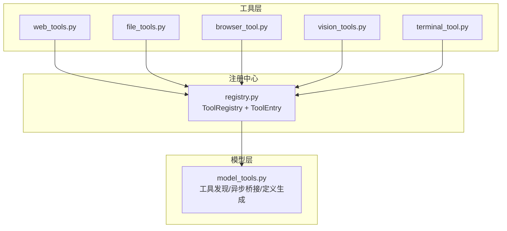
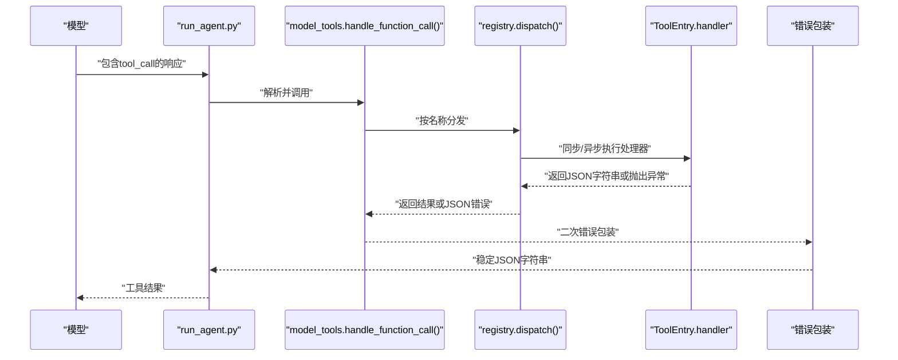
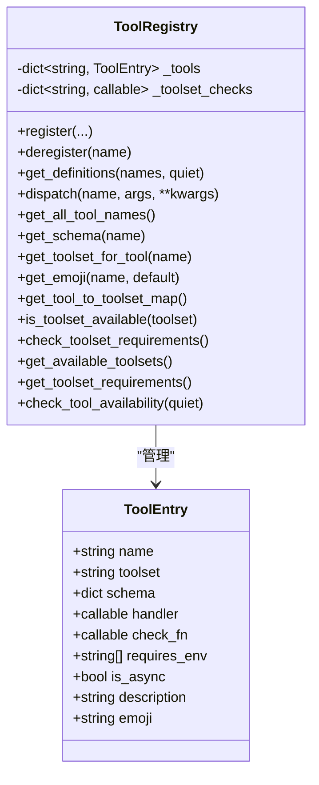
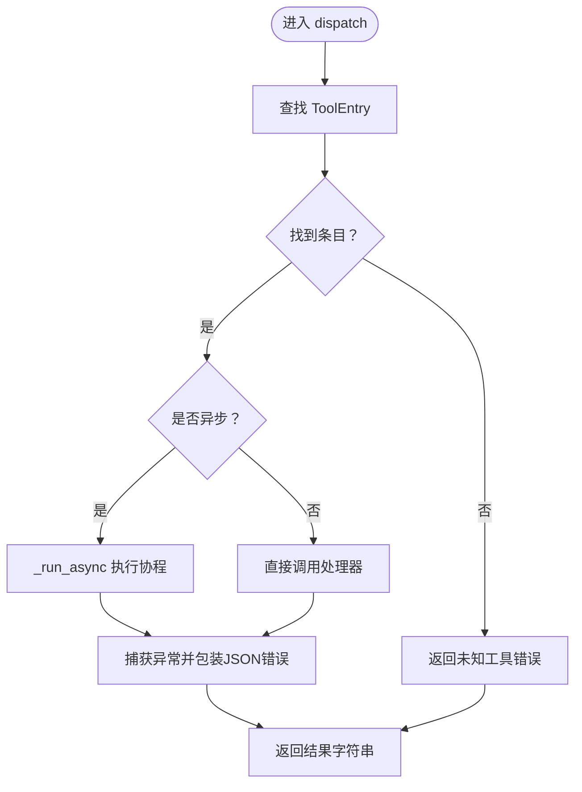
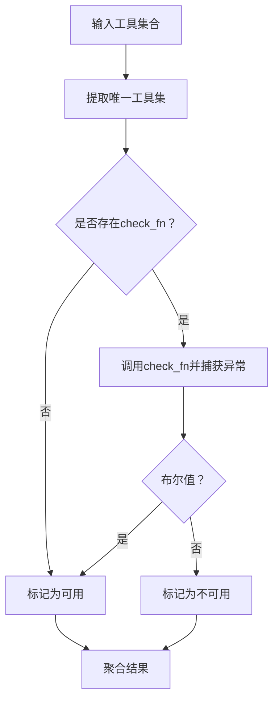
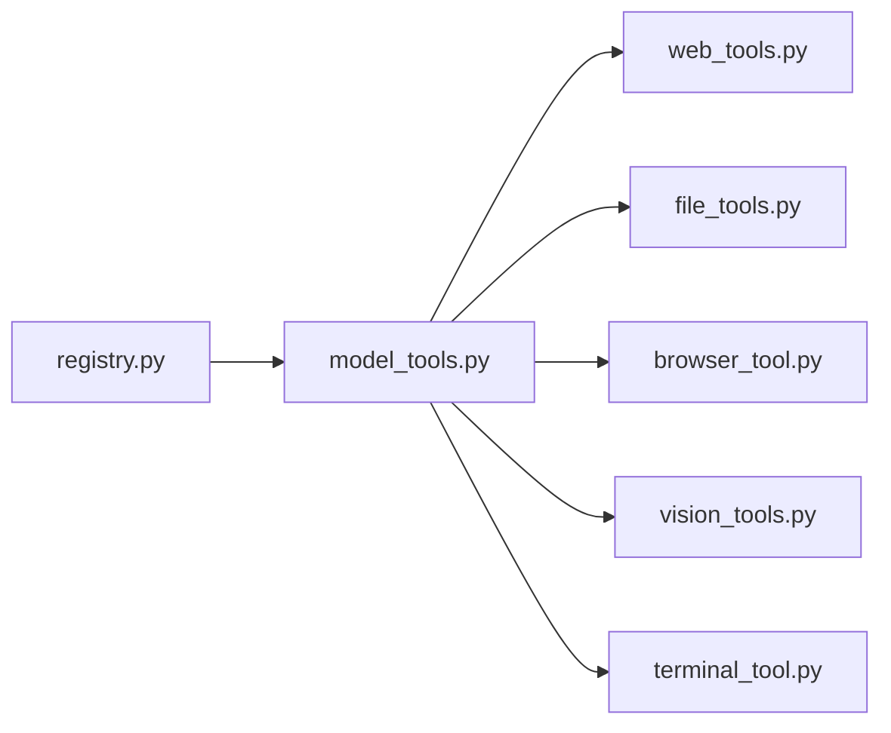

# 核心工具API

<cite>
**本文引用的文件**
- [tools/registry.py](file://tools/registry.py)
- [model_tools.py](file://model_tools.py)
- [tests/tools/test_registry.py](file://tests/tools/test_registry.py)
- [website/docs/developer-guide/tools-runtime.md](file://website/docs/developer-guide/tools-runtime.md)
- [tools/web_tools.py](file://tools/web_tools.py)
- [tools/file_tools.py](file://tools/file_tools.py)
- [tools/browser_tool.py](file://tools/browser_tool.py)
- [tools/vision_tools.py](file://tools/vision_tools.py)
- [tools/terminal_tool.py](file://tools/terminal_tool.py)
</cite>

## 目录
1. [简介](#简介)
2. [项目结构](#项目结构)
3. [核心组件](#核心组件)
4. [架构总览](#架构总览)
5. [详细组件分析](#详细组件分析)
6. [依赖分析](#依赖分析)
7. [性能考虑](#性能考虑)
8. [故障排查指南](#故障排查指南)
9. [结论](#结论)
10. [附录](#附录)

## 简介
本文件面向Hermes Agent的核心工具API，聚焦于ToolRegistry类的设计与实现，系统阐述工具注册机制（ToolEntry元数据结构、工具schema定义与处理器绑定）、工具调用流程（dispatch异步桥接、错误处理与异常传播）、工具可用性检查体系（check_fn与工具集可用性判断）、工具与代理引擎的集成方式（OpenAI格式schema转换与token估算），并提供工具注册API的使用示例与最佳实践。

## 项目结构
- 工具注册中心位于 tools/registry.py，提供单例registry，集中管理所有工具的schema、处理器与元数据。
- 模型层通过 model_tools.py 发现并调用工具，负责异步桥接与工具定义生成。
- 各具体工具模块在导入时向registry注册自身：如 tools/web_tools.py、tools/file_tools.py、tools/browser_tool.py、tools/vision_tools.py、tools/terminal_tool.py 等。
- 文档与测试覆盖了工具运行时序列、可用性检查与错误处理等关键行为。

**图表来源**
- [tools/registry.py:45-275](file://tools/registry.py#L45-L275)
- [model_tools.py:132-184](file://model_tools.py#L132-L184)
- [tools/web_tools.py:1-200](file://tools/web_tools.py#L1-L200)
- [tools/file_tools.py:819-821](file://tools/file_tools.py#L819-L821)
- [tools/browser_tool.py:2092-2166](file://tools/browser_tool.py#L2092-L2166)
- [tools/vision_tools.py:1-200](file://tools/vision_tools.py#L1-L200)
- [tools/terminal_tool.py:1-200](file://tools/terminal_tool.py#L1-L200)

**章节来源**
- [tools/registry.py:1-321](file://tools/registry.py#L1-L321)
- [model_tools.py:1-200](file://model_tools.py#L1-L200)

## 核心组件
- ToolEntry：封装单个工具的元数据，包括名称、所属工具集、schema、处理器、可用性检查函数、所需环境变量、是否异步、描述与emoji标识。
- ToolRegistry：单例注册中心，提供register/deregister、get_definitions、dispatch、可用性查询与工具集映射等能力；内部维护工具字典与工具集检查函数映射。
- 异步桥接：model_tools._run_async统一处理同步/异步上下文切换，避免“事件循环已关闭”等问题，支持CLI主循环、工作线程持久循环等场景。
- 工具定义生成：get_definitions将工具schema转换为OpenAI格式的function定义，并按check_fn过滤不可用工具。
- 错误处理：dispatch捕获异常并返回JSON错误字符串；上层handle_function_call亦进行二次包装，确保模型侧始终收到结构化错误。

**章节来源**
- [tools/registry.py:24-89](file://tools/registry.py#L24-L89)
- [tools/registry.py:111-162](file://tools/registry.py#L111-L162)
- [model_tools.py:39-126](file://model_tools.py#L39-L126)
- [website/docs/developer-guide/tools-runtime.md:140-194](file://website/docs/developer-guide/tools-runtime.md#L140-L194)

## 架构总览
下图展示从模型返回tool_call到工具执行与结果回传的完整链路，以及registry与model_tools之间的协作关系。

**图表来源**
- [website/docs/developer-guide/tools-runtime.md:140-194](file://website/docs/developer-guide/tools-runtime.md#L140-L194)
- [tools/registry.py:144-162](file://tools/registry.py#L144-L162)
- [model_tools.py:563-577](file://model_tools.py#L563-L577)

## 详细组件分析

### ToolRegistry与ToolEntry设计
- ToolEntry字段：name、toolset、schema、handler、check_fn、requires_env、is_async、description、emoji。通过__slots__减少内存占用并约束属性。
- 注册语义：同名工具可被不同toolset覆盖，但会记录警告；每个toolset仅保留一个check_fn，用于批量可用性判断。
- 可用性检查：is_toolset_available对check_fn进行异常保护，失败即视为不可用；check_toolset_requirements批量计算各工具集可用性。
- 定义生成：get_definitions将entry.schema补充"name"字段并包装为OpenAI function格式，同时复用check_fn结果缓存，避免重复调用。
- 查询辅助：提供工具名列表、schema查询、工具集映射、emoji查询、工具集需求汇总等便捷接口。

**图表来源**
- [tools/registry.py:24-89](file://tools/registry.py#L24-L89)
- [tools/registry.py:45-275](file://tools/registry.py#L45-L275)

**章节来源**
- [tools/registry.py:24-89](file://tools/registry.py#L24-L89)
- [tools/registry.py:111-162](file://tools/registry.py#L111-L162)
- [tools/registry.py:194-271](file://tools/registry.py#L194-L271)

### 工具调用流程与异步桥接
- 同步处理器：直接调用handler(args, **kwargs)，返回JSON字符串。
- 异步处理器：通过model_tools._run_async桥接到同步路径，自动选择持久循环或独立线程，避免“事件循环已关闭”问题。
- 错误处理：dispatch捕获异常并返回{"error": "..."}；上层handle_function_call再次包装，保证模型侧稳定输出。
- 调用序列参考开发者文档中的“Dispatch flow”。

**图表来源**
- [tools/registry.py:144-162](file://tools/registry.py#L144-L162)
- [model_tools.py:81-126](file://model_tools.py#L81-L126)

**章节来源**
- [tools/registry.py:144-162](file://tools/registry.py#L144-L162)
- [model_tools.py:81-126](file://model_tools.py#L81-L126)
- [website/docs/developer-guide/tools-runtime.md:140-194](file://website/docs/developer-guide/tools-runtime.md#L140-L194)

### 工具可用性检查系统
- check_fn：工具级可用性检查函数，若存在则在get_definitions与is_toolset_available中使用；异常会被捕获并视作不可用。
- 工具集维度：registry维护每个toolset对应的check_fn，批量计算可用性；get_available_toolsets与get_toolset_requirements提供UI与配置兼容信息。
- check_tool_availability：返回可用工具集与不可用工具集的详细信息（含环境变量与工具清单）。

**图表来源**
- [tools/registry.py:194-213](file://tools/registry.py#L194-L213)
- [tools/registry.py:253-271](file://tools/registry.py#L253-L271)

**章节来源**
- [tools/registry.py:194-213](file://tools/registry.py#L194-L213)
- [tools/registry.py:253-271](file://tools/registry.py#L253-L271)

### OpenAI格式工具schema转换与token估算
- get_definitions将每个工具schema补充"name"字段并包装为{"type": "function", "function": {...}}，用于OpenAI兼容的函数调用协议。
- get_schema提供原始schema，便于在不考虑可用性的情况下进行token估算与调试。
- 代理引擎通过model_tools聚合工具定义，结合工具集过滤与排序，生成最终的函数调用列表。

**章节来源**
- [tools/registry.py:111-138](file://tools/registry.py#L111-L138)
- [tools/registry.py:171-178](file://tools/registry.py#L171-L178)
- [model_tools.py:563-577](file://model_tools.py#L563-L577)

### 工具注册API使用示例与最佳实践
以下示例基于仓库中真实工具的注册模式，展示参数验证、环境变量要求与emoji标识的使用方式。请根据实际工具调整schema与处理器。

- 文件工具注册（含check_fn与emoji）
  - 示例路径：[tools/file_tools.py:819-821](file://tools/file_tools.py#L819-L821)
  - 关键点：使用check_fn进行前置校验；通过emoji为工具提供可视化标识；requires_env声明外部依赖。
- 浏览器工具注册（多工具、多schema）
  - 示例路径：[tools/browser_tool.py:2092-2166](file://tools/browser_tool.py#L2092-L2166)
  - 关键点：同一工具集内注册多个工具；每个工具拥有独立schema与处理器；check_fn控制可用性。
- 视觉工具注册（异步处理器与schema）
  - 示例路径：[tools/vision_tools.py:1-200](file://tools/vision_tools.py#L1-L200)
  - 关键点：异步处理器需配合异步schema；工具集划分清晰；参数校验与URL安全策略。
- 终端工具注册（复杂后端与环境变量）
  - 示例路径：[tools/terminal_tool.py:1-200](file://tools/terminal_tool.py#L1-L200)
  - 关键点：环境变量驱动后端选择；危险命令审批与路径白名单；磁盘用量告警等运行时保障。

最佳实践要点
- 使用check_fn进行轻量级前置检查（网络连通、密钥存在、权限状态），避免昂贵IO阻塞注册流程。
- 为工具提供清晰的schema与description，便于模型理解工具用途与参数含义。
- 对异步处理器，确保内部客户端复用与持久循环，减少“事件循环已关闭”风险。
- 在工具集层面汇总requires_env，便于UI与doctor命令展示缺失依赖。
- 使用emoji提升界面友好度，但保持默认值一致（如“⚡”）。

**章节来源**
- [tools/file_tools.py:819-821](file://tools/file_tools.py#L819-L821)
- [tools/browser_tool.py:2092-2166](file://tools/browser_tool.py#L2092-L2166)
- [tools/vision_tools.py:1-200](file://tools/vision_tools.py#L1-L200)
- [tools/terminal_tool.py:1-200](file://tools/terminal_tool.py#L1-L200)

## 依赖分析
- 导入关系
  - tools/registry.py 不依赖model_tools或具体工具模块，避免循环导入。
  - model_tools.py 导入registry并触发工具模块导入，形成自举式发现。
  - 具体工具模块在导入时调用registry.register完成注册。
- 运行时耦合
  - registry.dispatch依赖model_tools._run_async处理异步桥接。
  - get_definitions依赖check_fn缓存，降低重复调用成本。
  - 工具集可用性查询通过_toolset_checks映射实现。

**图表来源**
- [tools/registry.py:1-321](file://tools/registry.py#L1-L321)
- [model_tools.py:132-184](file://model_tools.py#L132-L184)

**章节来源**
- [tools/registry.py:1-321](file://tools/registry.py#L1-L321)
- [model_tools.py:132-184](file://model_tools.py#L132-L184)

## 性能考虑
- 异步桥接优化：持久事件循环避免频繁创建/销毁导致的客户端重建与GC开销；工作线程使用本地循环减少竞争。
- check_fn缓存：get_definitions内部对check_fn结果进行缓存，避免重复调用同一check_fn。
- 工具定义生成：仅在需要时生成OpenAI格式定义，避免不必要的序列化与传输。
- 工具集批量检查：is_toolset_available与check_toolset_requirements按工具集粒度计算，减少冗余I/O。

[本节为通用性能讨论，无需特定文件引用]

## 故障排查指南
- 工具未出现在定义列表
  - 检查工具是否注册（registry.get_all_tool_names）、是否通过check_fn（get_definitions会跳过不可用工具）。
  - 参考测试用例：[tests/tools/test_registry.py:64-110](file://tests/tools/test_registry.py#L64-L110)
- 工具调用报错
  - 查看dispatch返回的JSON错误；确认处理器是否抛出异常；必要时在工具内增加日志定位。
  - 参考测试用例：[tests/tools/test_registry.py:170-182](file://tests/tools/test_registry.py#L170-L182)
- 工具集不可用
  - 检查_toolset_checks映射与check_fn实现；is_toolset_available会捕获异常并返回False。
  - 参考测试用例：[tests/tools/test_registry.py:184-219](file://tests/tools/test_registry.py#L184-L219)
- 异步工具崩溃
  - 确认使用model_tools._run_async桥接；避免在协程中直接使用一次性循环。
  - 参考文档：[website/docs/developer-guide/tools-runtime.md:188-194](file://website/docs/developer-guide/tools-runtime.md#L188-L194)

**章节来源**
- [tests/tools/test_registry.py:64-110](file://tests/tools/test_registry.py#L64-L110)
- [tests/tools/test_registry.py:170-182](file://tests/tools/test_registry.py#L170-L182)
- [tests/tools/test_registry.py:184-219](file://tests/tools/test_registry.py#L184-L219)
- [website/docs/developer-guide/tools-runtime.md:188-194](file://website/docs/developer-guide/tools-runtime.md#L188-L194)

## 结论
ToolRegistry为核心工具API的中枢，通过ToolEntry标准化元数据、通过get_definitions生成OpenAI兼容schema、通过dispatch与model_tools._run_async实现稳定的同步/异步执行与错误包装。配合check_fn与工具集可用性检查，系统实现了灵活、健壮且可扩展的工具生态。遵循本文最佳实践，可在保证安全性的同时最大化工具性能与可用性。

[本节为总结性内容，无需特定文件引用]

## 附录
- 工具注册API关键参数
  - name：工具唯一标识
  - toolset：工具集名称（用于批量可用性与UI分组）
  - schema：OpenAI风格的工具参数定义
  - handler：工具处理器（同步或异步）
  - check_fn：可用性检查函数（可选）
  - requires_env：环境变量依赖列表（可选）
  - is_async：是否为异步处理器（可选）
  - description：工具描述（可选）
  - emoji：工具emoji标识（可选）

- 常用查询接口
  - get_definitions：生成OpenAI格式工具定义
  - get_schema：获取原始schema（不含可用性过滤）
  - is_toolset_available：检查工具集可用性
  - get_toolset_requirements：构建工具集需求字典
  - check_tool_availability：返回可用与不可用工具集详情

**章节来源**
- [tools/registry.py:56-89](file://tools/registry.py#L56-L89)
- [tools/registry.py:111-178](file://tools/registry.py#L111-L178)
- [tools/registry.py:194-271](file://tools/registry.py#L194-L271)