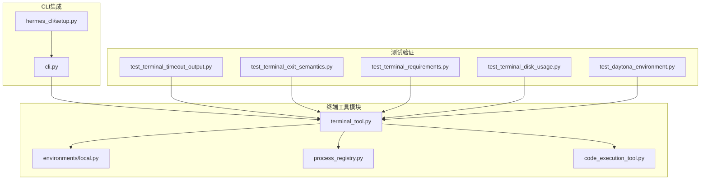
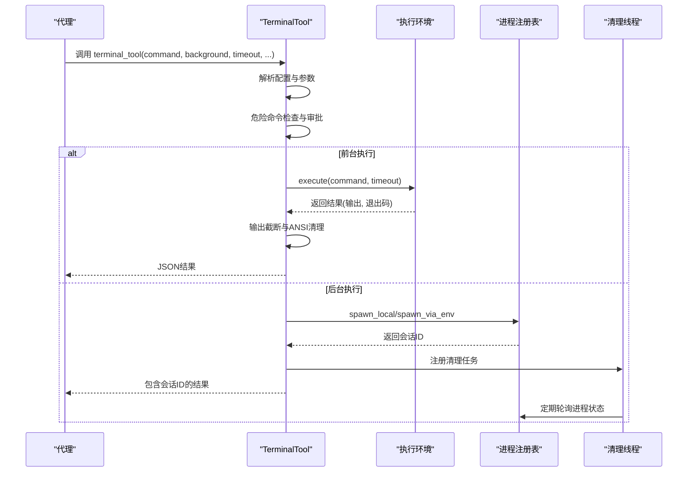
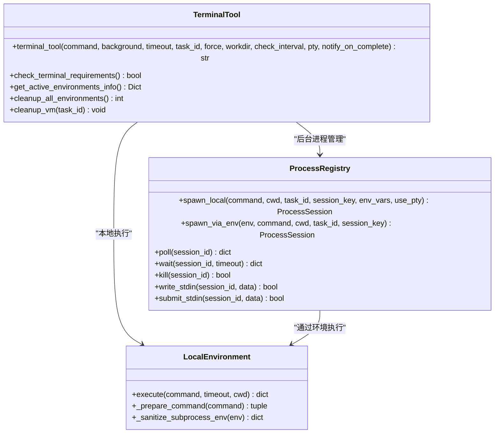
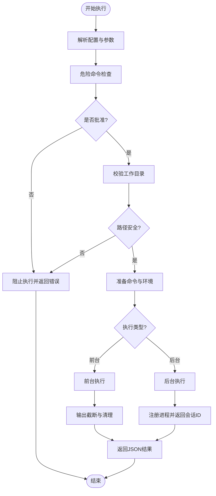
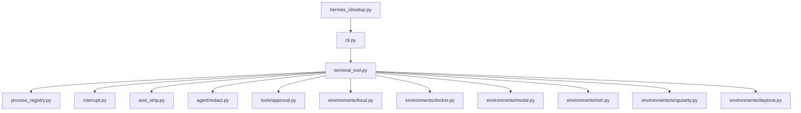

# 终端工具API

<cite>
**本文档引用的文件**
- [tools/terminal_tool.py](file://tools/terminal_tool.py)
- [tools/environments/local.py](file://tools/environments/local.py)
- [tools/process_registry.py](file://tools/process_registry.py)
- [tools/code_execution_tool.py](file://tools/code_execution_tool.py)
- [cli.py](file://cli.py)
- [hermes_cli/setup.py](file://hermes_cli/setup.py)
- [tests/tools/test_terminal_timeout_output.py](file://tests/tools/test_terminal_timeout_output.py)
- [tests/tools/test_terminal_exit_semantics.py](file://tests/tools/test_terminal_exit_semantics.py)
- [tests/tools/test_terminal_requirements.py](file://tests/tools/test_terminal_requirements.py)
- [tests/tools/test_terminal_disk_usage.py](file://tests/tools/test_terminal_disk_usage.py)
- [tests/tools/test_daytona_environment.py](file://tests/tools/test_daytona_environment.py)
</cite>

## 目录
1. [简介](#简介)
2. [项目结构](#项目结构)
3. [核心组件](#核心组件)
4. [架构概览](#架构概览)
5. [详细组件分析](#详细组件分析)
6. [依赖分析](#依赖分析)
7. [性能考虑](#性能考虑)
8. [故障排除指南](#故障排除指南)
9. [结论](#结论)
10. [附录](#附录)

## 简介
本文件为 Hermes Agent 的终端工具API技术文档，专注于 TerminalTool 类的完整实现与使用指南。该工具支持在本地、Docker、Modal、SSH、Singularity 和 Daytona 环境中执行命令，提供多后端沙箱执行、后台任务管理、资源限制、超时控制、安全沙箱机制以及丰富的参数配置选项。

## 项目结构
终端工具位于 tools 模块下，核心文件包括：
- tools/terminal_tool.py：终端工具主入口，负责环境选择、命令执行、安全检查、输出处理与错误恢复
- tools/environments/local.py：本地环境实现，包含中断支持、非阻塞I/O、环境变量过滤等
- tools/process_registry.py：后台进程注册表，提供进程生命周期管理、输出缓冲、状态轮询与通知
- tests/tools/*：覆盖超时输出、退出码语义解释、环境要求检查、磁盘使用统计等测试用例

**图表来源**
- [tools/terminal_tool.py:1-1621](file://tools/terminal_tool.py#L1-L1621)
- [tools/environments/local.py:1-487](file://tools/environments/local.py#L1-L487)
- [tools/process_registry.py:1-200](file://tools/process_registry.py#L1-L200)
- [cli.py:379-430](file://cli.py#L379-L430)
- [hermes_cli/setup.py:1365-1402](file://hermes_cli/setup.py#L1365-L1402)

**章节来源**
- [tools/terminal_tool.py:1-1621](file://tools/terminal_tool.py#L1-L1621)
- [tools/environments/local.py:1-487](file://tools/environments/local.py#L1-L487)
- [tools/process_registry.py:1-200](file://tools/process_registry.py#L1-L200)

## 核心组件
- TerminalTool 主函数：terminal_tool() 提供统一的命令执行接口，支持前台执行与后台任务管理，自动进行危险命令检测与审批流程，处理输出截断与ANSI转义清理，提供超时控制与重试机制。
- 环境抽象层：通过 _create_environment() 工厂方法创建不同后端环境实例（本地、Docker、Singularity、Modal、Daytona、SSH），每个环境实现 execute() 方法。
- 进程注册表：ProcessRegistry 提供后台进程的生命周期管理，包括输出缓冲、状态轮询、阻塞等待、进程终止与崩溃恢复。
- 安全沙箱机制：包含危险命令检测、工作目录白名单校验、环境变量过滤、sudo密码处理、ANSI转义清理与敏感信息脱敏。
- 配置系统：通过环境变量与CLI配置映射，支持工作目录、超时、生命周期、容器资源、SSH连接等参数配置。

**章节来源**
- [tools/terminal_tool.py:991-1400](file://tools/terminal_tool.py#L991-L1400)
- [tools/environments/local.py:317-487](file://tools/environments/local.py#L317-L487)
- [tools/process_registry.py:90-200](file://tools/process_registry.py#L90-L200)

## 架构概览
终端工具采用分层架构设计，从上到下依次为：API层（terminal_tool）、环境层（各后端环境）、进程管理层（ProcessRegistry）与基础设施层（清理线程、中断事件、安全检查）。

**图表来源**
- [tools/terminal_tool.py:1032-1387](file://tools/terminal_tool.py#L1032-L1387)
- [tools/process_registry.py:132-200](file://tools/process_registry.py#L132-L200)
- [tools/environments/local.py:379-487](file://tools/environments/local.py#L379-L487)

## 详细组件分析

### TerminalTool 类与API接口
TerminalTool 提供统一的命令执行接口，支持以下关键功能：
- 命令执行：前台执行返回即时结果，后台执行返回会话ID用于后续查询
- 输出捕获：自动截断长输出（保留首尾内容），清理ANSI转义序列，脱敏敏感信息
- 进程管理：通过 ProcessRegistry 管理后台进程，支持轮询、等待、终止与输入写入
- 安全检查：危险命令检测、工作目录白名单校验、sudo密码处理
- 错误处理：超时返回特定退出码、重试机制、详细错误信息与回溯

**图表来源**
- [tools/terminal_tool.py:991-1400](file://tools/terminal_tool.py#L991-L1400)
- [tools/process_registry.py:90-200](file://tools/process_registry.py#L90-L200)
- [tools/environments/local.py:317-487](file://tools/environments/local.py#L317-L487)

**章节来源**
- [tools/terminal_tool.py:991-1400](file://tools/terminal_tool.py#L991-L1400)
- [tools/process_registry.py:132-200](file://tools/process_registry.py#L132-L200)
- [tools/environments/local.py:379-487](file://tools/environments/local.py#L379-L487)

### 安全沙箱机制
终端工具实施多层次安全防护：
- 危险命令检测：通过 approval 模块对命令进行危险性评估，必要时触发用户审批
- 工作目录校验：使用白名单正则表达式限制工作目录字符集，防止路径注入
- 环境变量过滤：自动移除可能泄露的提供商密钥与内部配置变量，支持显式透传
- sudo 密码处理：支持 SUDO_PASSWORD 环境变量与交互式密码提示，统一转换为 -S 参数模式
- 输出安全：清理ANSI转义序列，脱敏敏感信息，避免模型复制敏感数据

**图表来源**
- [tools/terminal_tool.py:1148-1387](file://tools/terminal_tool.py#L1148-L1387)
- [tools/environments/local.py:134-162](file://tools/environments/local.py#L134-L162)

**章节来源**
- [tools/terminal_tool.py:1148-1387](file://tools/terminal_tool.py#L1148-L1387)
- [tools/environments/local.py:134-162](file://tools/environments/local.py#L134-L162)

### 参数配置选项
终端工具支持丰富的配置选项，可通过环境变量或CLI配置：
- 环境选择：TERMINAL_ENV (local/docker/singularity/modal/daytona/ssh)
- 超时控制：TERMINAL_TIMEOUT（默认180秒），支持前台与后台不同行为
- 生命周期：TERMINAL_LIFETIME_SECONDS（默认300秒），自动清理不活跃环境
- 容器资源：TERMINAL_CONTAINER_CPU/MEMORY/DISK（默认1/5120/51200）
- 工作目录：TERMINAL_CWD（支持相对路径与主机路径映射）
- SSH配置：TERMINAL_SSH_HOST/USER/PORT/KEY
- Modal配置：TERMINAL_MODAL_MODE/auto/direct/managed
- Docker配置：TERMINAL_DOCKER_IMAGE/VOLUMES/FORWARD_ENV
- 持久化：TERMINAL_CONTAINER_PERSISTENT/local_persistent
- 其他：TERMINAL_SANDBOX_DIR、SUDO_PASSWORD

**章节来源**
- [tools/terminal_tool.py:495-571](file://tools/terminal_tool.py#L495-L571)
- [cli.py:401-428](file://cli.py#L401-L428)
- [hermes_cli/setup.py:1365-1402](file://hermes_cli/setup.py#L1365-L1402)

### 错误处理与异常恢复
终端工具实现了完善的错误处理机制：
- 超时处理：返回特定退出码124，保留超时前的部分输出
- 重试机制：前台执行失败时最多重试3次，指数退避
- 进程清理：后台进程通过清理线程定期回收，支持手动清理
- 环境恢复：进程注册表支持崩溃恢复与检查点持久化
- 用户中断：通过全局中断事件协作式取消长时间运行的进程

**章节来源**
- [tools/terminal_tool.py:1305-1344](file://tools/terminal_tool.py#L1305-L1344)
- [tools/process_registry.py:1-200](file://tools/process_registry.py#L1-200)
- [tools/environments/local.py:448-482](file://tools/environments/local.py#L448-L482)

### 使用示例与最佳实践
- 文件操作：优先使用专用文件工具而非直接使用终端命令
- 系统命令：使用前台执行短命令，后台执行长任务并设置 notify_on_complete
- 脚本执行：确保脚本可执行权限，合理设置超时时间
- 交互式工具：需要PTY模式时设置 pty=true（仅本地与SSH后端）
- 最佳实践：合理设置容器资源，避免长时间占用，及时清理不活跃环境

**章节来源**
- [tools/terminal_tool.py:1019-1031](file://tools/terminal_tool.py#L1019-L1031)
- [tools/process_registry.py:132-200](file://tools/process_registry.py#L132-L200)

## 依赖分析
终端工具的依赖关系清晰且模块化：
- 内部依赖：process_registry、approval、interrupt、ansi_strip、redact
- 外部依赖：各后端SDK（docker、modal、daytona等）
- 配置依赖：CLI配置桥接与环境变量映射

**图表来源**
- [tools/terminal_tool.py:1-1621](file://tools/terminal_tool.py#L1-L1621)
- [cli.py:379-430](file://cli.py#L379-L430)

**章节来源**
- [tools/terminal_tool.py:1-1621](file://tools/terminal_tool.py#L1-L1621)
- [cli.py:379-430](file://cli.py#L379-L430)

## 性能考虑
- 输出截断：长输出自动截断，保留首尾内容，避免内存溢出
- 进程池管理：后台进程使用滚动输出缓冲（200KB），限制最大进程数量
- 清理策略：定期清理不活跃环境，支持手动清理所有环境
- 资源限制：容器后端支持CPU、内存、磁盘配额，避免资源滥用
- 超时控制：前台执行即时返回，后台执行支持超时与重试

## 故障排除指南
常见问题与解决方案：
- Docker不可用：检查Docker安装与权限，确认Docker守护进程运行正常
- Modal认证失败：配置Direct模式或启用Managed工具，确保凭据正确
- SSH连接问题：验证主机、用户、端口与密钥配置
- 超时问题：调整TERMINAL_TIMEOUT，合理设置后台任务的notify_on_complete
- 磁盘空间不足：使用cleanup_all_environments()清理环境，调整警告阈值

**章节来源**
- [tests/tools/test_terminal_requirements.py:1-176](file://tests/tools/test_terminal_requirements.py#L1-L176)
- [tests/tools/test_terminal_disk_usage.py:1-74](file://tests/tools/test_terminal_disk_usage.py#L1-L74)
- [tools/terminal_tool.py:1402-1504](file://tools/terminal_tool.py#L1402-L1504)

## 结论
TerminalTool 为Hermes Agent提供了强大而安全的终端执行能力，通过多后端沙箱、完善的进程管理、严格的安全检查与灵活的配置选项，满足了从简单命令到复杂脚本执行的各种需求。其模块化设计便于扩展与维护，适合在生产环境中稳定运行。

## 附录

### API参考
- terminal_tool(command, background=False, timeout=None, task_id=None, force=False, workdir=None, check_interval=None, pty=False, notify_on_complete=False)
- check_terminal_requirements()
- get_active_environments_info()
- cleanup_all_environments()
- cleanup_vm(task_id)

### 环境变量参考
- TERMINAL_ENV：执行环境类型
- TERMINAL_TIMEOUT：默认超时时间
- TERMINAL_LIFETIME_SECONDS：环境生命周期
- TERMINAL_CWD：工作目录
- TERMINAL_*_IMAGE：各后端镜像配置
- TERMINAL_CONTAINER_*：容器资源配置
- TERMINAL_SSH_*：SSH连接配置
- SUDO_PASSWORD：sudo密码

**章节来源**
- [tools/terminal_tool.py:1555-1597](file://tools/terminal_tool.py#L1555-L1597)
- [tools/terminal_tool.py:495-571](file://tools/terminal_tool.py#L495-L571)