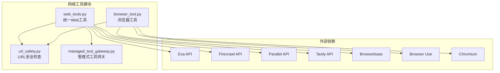
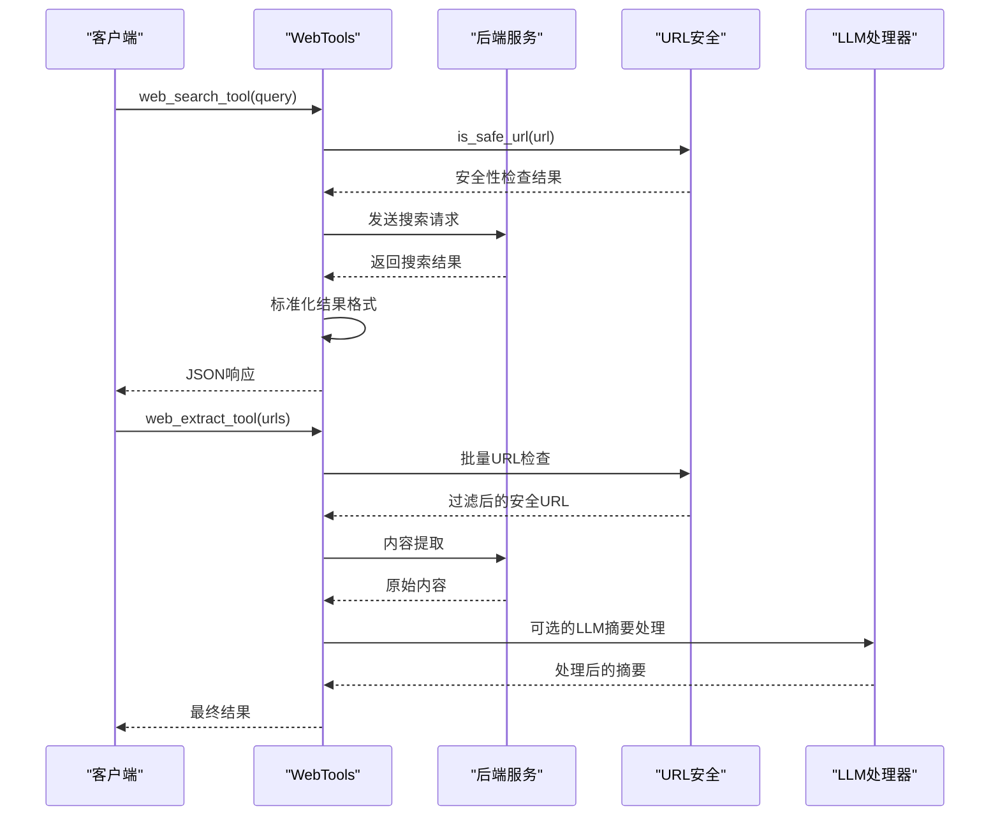
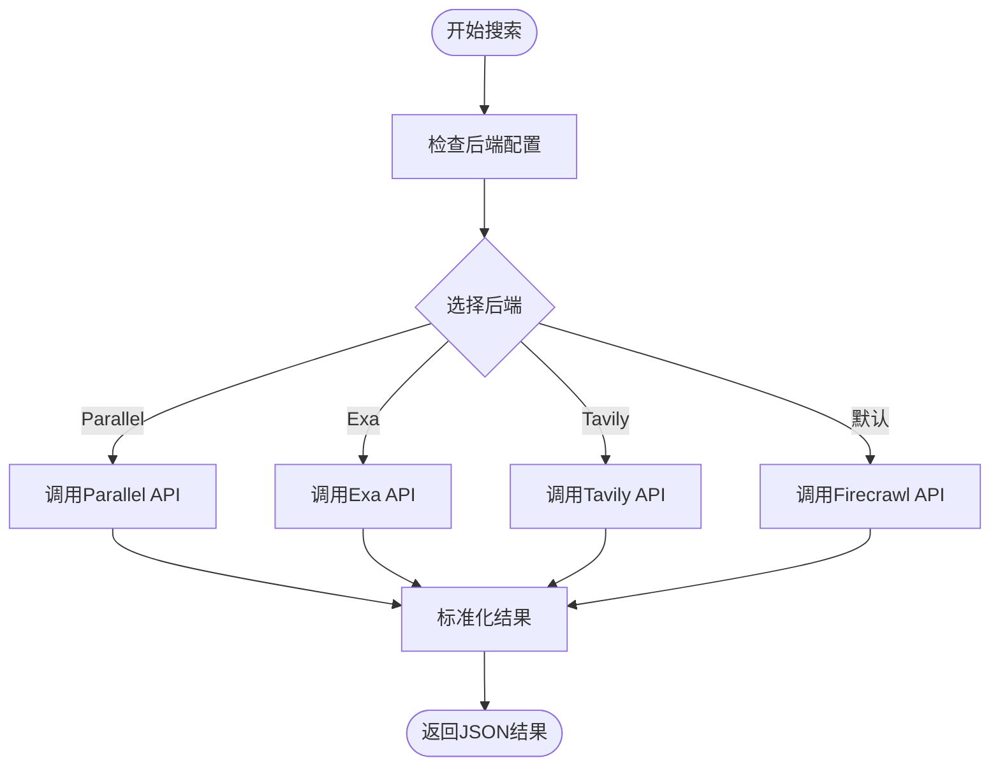
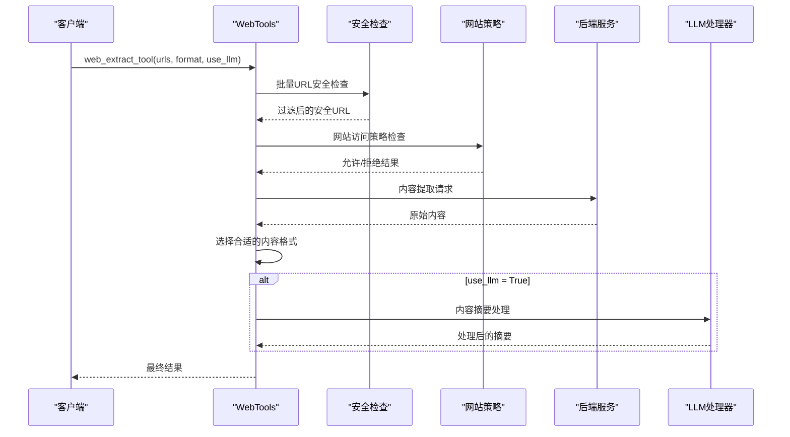
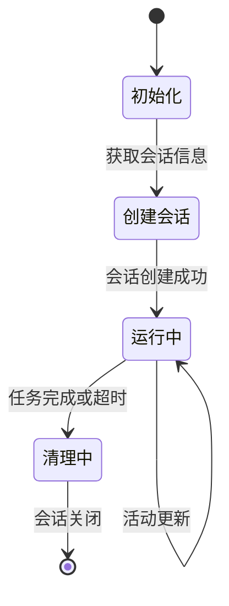
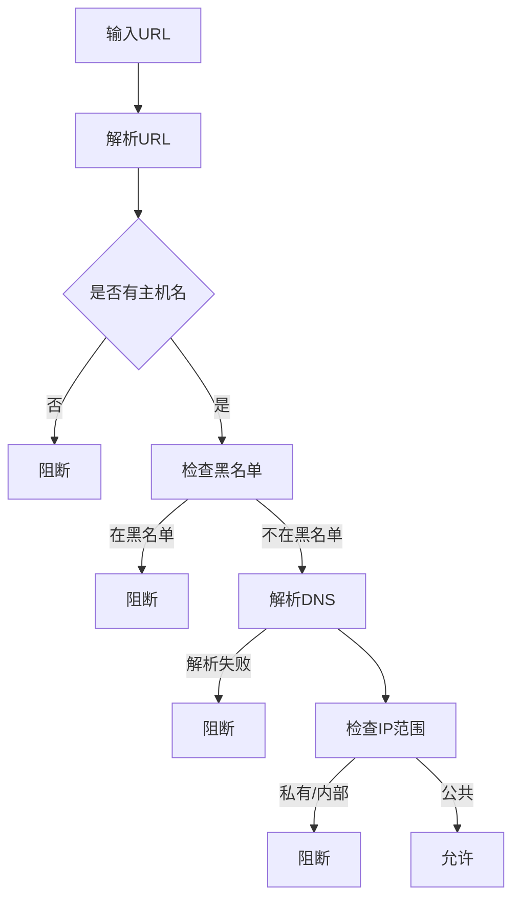
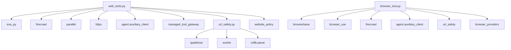

# 网络工具API

<cite>
**本文档引用的文件**
- [web_tools.py](file://tools/web_tools.py)
- [browser_tool.py](file://tools/browser_tool.py)
- [url_safety.py](file://tools/url_safety.py)
- [managed_tool_gateway.py](file://tools/managed_tool_gateway.py)
- [test_web_tools.py](file://tests/integration/test_web_tools.py)
- [test_web_tools_config.py](file://tests/tools/test_web_tools_config.py)
- [test_url_safety.py](file://tests/tools/test_url_safety.py)
- [test_browser_cdp_override.py](file://tests/tools/test_browser_cdp_override.py)
- [test_browser_console.py](file://tests/tools/test_browser_console.py)
- [tool_context.py](file://environments/tool_context.py)
</cite>

## 目录
1. [简介](#简介)
2. [项目结构](#项目结构)
3. [核心组件](#核心组件)
4. [架构概览](#架构概览)
5. [详细组件分析](#详细组件分析)
6. [依赖分析](#依赖分析)
7. [性能考虑](#性能考虑)
8. [故障排除指南](#故障排除指南)
9. [结论](#结论)
10. [附录](#附录)

## 简介
本文件为 Hermes Agent 的网络工具API技术文档，重点覆盖以下方面：
- WebTools 类的API接口：HTTP请求、URL处理和网络资源访问
- 浏览器工具的API功能：页面抓取、自动化操作和内容提取
- 网络工具的安全机制：URL验证、内容过滤和SSRF防护
- 网络工具的配置选项：代理设置、超时控制和重试策略
- 使用示例与最佳实践：网页爬取、API调用和数据获取场景
- 与代理的集成方式和性能监控方法

## 项目结构
网络工具相关的核心模块位于 tools/ 目录下，主要文件包括：
- tools/web_tools.py：统一的Web工具模块，支持多个后端（Exa、Firecrawl、Parallel、Tavily）
- tools/browser_tool.py：浏览器自动化工具，支持本地Chromium、Browserbase、Browser Use等
- tools/url_safety.py：URL安全检查，防止SSRF攻击
- tools/managed_tool_gateway.py：管理式工具网关，支持通过Nous订阅者令牌访问第三方服务



**图表来源**
- [web_tools.py:1-120](file://tools/web_tools.py#L1-L120)
- [browser_tool.py:1-120](file://tools/browser_tool.py#L1-L120)
- [url_safety.py:1-97](file://tools/url_safety.py#L1-L97)
- [managed_tool_gateway.py:1-168](file://tools/managed_tool_gateway.py#L1-L168)

**章节来源**
- [web_tools.py:1-200](file://tools/web_tools.py#L1-L200)
- [browser_tool.py:1-200](file://tools/browser_tool.py#L1-L200)
- [url_safety.py:1-97](file://tools/url_safety.py#L1-L97)
- [managed_tool_gateway.py:1-168](file://tools/managed_tool_gateway.py#L1-L168)

## 核心组件
本节详细介绍网络工具的核心组件及其职责。

### WebTools 统一Web工具
WebTools 提供统一的Web搜索、内容提取和网站爬取接口，支持多种后端提供商：
- 后端选择：根据配置或环境变量自动选择可用的后端
- 内容处理：可选的LLM内容摘要和压缩
- 安全防护：内置URL安全检查和网站策略过滤
- 调试支持：详细的调试日志和性能指标

关键特性：
- 多后端兼容：Exa、Firecrawl、Parallel、Tavily
- 智能内容处理：超过阈值的内容自动进行LLM摘要
- 并发处理：异步实现，支持并行内容处理
- 错误恢复：完善的错误处理和重试机制

**章节来源**
- [web_tools.py:69-121](file://tools/web_tools.py#L69-L121)
- [web_tools.py:1034-1162](file://tools/web_tools.py#L1034-L1162)
- [web_tools.py:1164-1488](file://tools/web_tools.py#L1164-L1488)
- [web_tools.py:1490-1900](file://tools/web_tools.py#L1490-L1900)

### 浏览器工具
浏览器工具提供完整的页面自动化能力：
- 多后端支持：本地Chromium、Browserbase、Browser Use
- 页面交互：导航、点击、输入、滚动等操作
- 内容提取：文本快照、图片分析、控制台输出
- 会话管理：自动清理和超时控制

关键特性：
- 会话隔离：每个任务独立的浏览器会话
- 自动清理：进程退出时自动清理浏览器进程
- 配置灵活：支持命令超时、会话超时等参数
- 安全考虑：云后端启用SSRF保护，本地后端可配置允许私有地址

**章节来源**
- [browser_tool.py:1-120](file://tools/browser_tool.py#L1-L120)
- [browser_tool.py:496-656](file://tools/browser_tool.py#L496-L656)
- [browser_tool.py:662-800](file://tools/browser_tool.py#L662-L800)

### URL安全检查
URL安全检查模块提供SSRF防护：
- 主机名黑名单：阻止metadata.google.internal等内部主机
- IP范围检查：阻断私有IP、回环地址、链路本地地址等
- CGNAT防护：额外阻断100.64.0.0/10范围
- 多协议支持：IPv4/IPv6双重检查

**章节来源**
- [url_safety.py:25-96](file://tools/url_safety.py#L25-L96)

## 架构概览
网络工具采用分层架构设计，确保功能模块化和可扩展性：



**图表来源**
- [web_tools.py:1034-1162](file://tools/web_tools.py#L1034-L1162)
- [web_tools.py:1164-1488](file://tools/web_tools.py#L1164-L1488)
- [url_safety.py:50-96](file://tools/url_safety.py#L50-L96)

## 详细组件分析

### WebTools API 接口详解

#### web_search_tool 搜索接口
提供统一的Web搜索接口，支持多种后端：
- 参数：查询字符串、结果数量限制
- 返回：标准化的JSON格式，包含标题、URL、描述
- 后端选择：自动选择可用的后端（Parallel、Exa、Firecrawl、Tavily）



**图表来源**
- [web_tools.py:1034-1162](file://tools/web_tools.py#L1034-L1162)

#### web_extract_tool 内容提取接口
提供网页内容提取功能，支持批量URL处理：
- 参数：URL列表、输出格式、是否使用LLM处理
- 安全检查：批量URL安全验证
- 网站策略：网站访问策略检查
- LLM处理：可选的内容摘要和压缩



**图表来源**
- [web_tools.py:1164-1488](file://tools/web_tools.py#L1164-L1488)

#### web_crawl_tool 网站爬取接口
提供网站爬取功能，支持指令式爬取：
- 参数：起始URL、爬取指令、深度设置
- 支持后端：Firecrawl（直接或工具网关）、Tavily
- LLM处理：可选的爬取内容摘要

**章节来源**
- [web_tools.py:1490-1900](file://tools/web_tools.py#L1490-L1900)

### 浏览器工具API

#### 浏览器会话管理
浏览器工具提供完整的会话生命周期管理：
- 会话创建：根据配置自动选择后端
- 会话隔离：每个任务独立的会话标识
- 自动清理：进程退出时自动清理
- 超时控制：可配置的命令超时和会话超时



**图表来源**
- [browser_tool.py:690-744](file://tools/browser_tool.py#L690-L744)
- [browser_tool.py:414-494](file://tools/browser_tool.py#L414-L494)

#### 页面交互操作
浏览器工具支持多种页面交互操作：
- 导航：browser_navigate
- 快照：browser_snapshot
- 点击：browser_click
- 输入：browser_type
- 滚动：browser_scroll
- 后退：browser_back
- 键盘：browser_press
- 关闭：browser_close

**章节来源**
- [browser_tool.py:496-656](file://tools/browser_tool.py#L496-L656)
- [browser_tool.py:132-156](file://tools/browser_tool.py#L132-L156)

### 安全机制

#### SSRF防护
网络工具实施多层SSRF防护：
- URL解析：检查协议、主机名、端口
- DNS验证：解析主机名到IP地址
- IP范围检查：阻断私有、内部IP地址
- 主机名黑名单：阻止metadata.google.internal等
- CGNAT防护：阻断100.64.0.0/10范围



**图表来源**
- [url_safety.py:50-96](file://tools/url_safety.py#L50-L96)

#### 网站策略检查
除了URL安全检查外，还实施网站访问策略：
- 网站规则匹配：基于配置的访问规则
- 动态策略：运行时检查最终URL
- 错误报告：详细的阻断原因和来源

**章节来源**
- [web_tools.py:1274-1335](file://tools/web_tools.py#L1274-L1335)
- [web_tools.py:1760-1769](file://tools/web_tools.py#L1760-L1769)

### 配置选项

#### 后端配置
WebTools 支持多种后端配置：
- 环境变量：EXA_API_KEY、PARALLEL_API_KEY、FIRECRAWL_API_KEY、TAVILY_API_KEY
- 工具网关：FIRECRAWL_GATEWAY_URL、TOOL_GATEWAY_DOMAIN、TOOL_GATEWAY_SCHEME
- 配置文件：~/.hermes/config.yaml中的web.backend设置

#### 浏览器配置
浏览器工具支持丰富的配置选项：
- 命令超时：browser.command_timeout（默认30秒）
- 会话超时：browser.session_timeout（默认300秒）
- 私有地址访问：browser.allow_private_urls（默认False）
- 记录会话：browser.record_sessions（默认False）

**章节来源**
- [web_tools.py:75-107](file://tools/web_tools.py#L75-L107)
- [browser_tool.py:132-167](file://tools/browser_tool.py#L132-L167)
- [browser_tool.py:308-327](file://tools/browser_tool.py#L308-L327)

## 依赖分析



**图表来源**
- [web_tools.py:43-65](file://tools/web_tools.py#L43-L65)
- [browser_tool.py:70-83](file://tools/browser_tool.py#L70-L83)

### 外部依赖关系
- WebTools 依赖多个第三方API库（Exa、Firecrawl、Parallel、Tavily）
- 浏览器工具依赖浏览器提供程序（Browserbase、Browser Use、Firecrawl）
- 安全模块依赖标准库的网络和解析功能

**章节来源**
- [web_tools.py:43-65](file://tools/web_tools.py#L43-L65)
- [browser_tool.py:70-83](file://tools/browser_tool.py#L70-L83)

## 性能考虑

### 内容处理优化
WebTools 实施了多层次的内容处理优化：
- 大内容分块处理：超过500k字符的内容自动分块并行处理
- 智能摘要：超过阈值的内容使用LLM生成摘要
- 输出限制：最终输出限制在5000字符以内
- 缓存机制：后端客户端实例缓存

### 并发处理
- 异步实现：web_extract_tool和web_crawl_tool使用asyncio
- 并行处理：批量URL的LLM处理并行执行
- 超时控制：单个URL提取60秒超时限制

### 监控和调试
- 调试模式：WEB_TOOLS_DEBUG=true启用详细日志
- 性能指标：记录原始响应大小、处理后大小、压缩率
- 会话信息：记录当前调试会话的详细信息

**章节来源**
- [web_tools.py:474-575](file://tools/web_tools.py#L474-L575)
- [web_tools.py:693-838](file://tools/web_tools.py#L693-L838)
- [web_tools.py:1933-1936](file://tools/web_tools.py#L1933-L1936)

## 故障排除指南

### 常见问题诊断

#### API密钥配置问题
- 检查环境变量是否正确设置
- 验证后端可用性：check_web_api_key()
- 查看调试日志了解具体错误信息

#### URL安全检查失败
- 检查URL格式是否正确
- 验证目标主机不是私有或内部地址
- 确认DNS解析正常

#### 浏览器工具问题
- 检查agent-browser CLI是否正确安装
- 验证浏览器后端配置
- 查看会话超时设置

### 调试技巧
- 启用调试模式：export WEB_TOOLS_DEBUG=true
- 查看日志文件：./logs/web_tools_debug_UUID.json
- 使用工具上下文：environments/tool_context.py

**章节来源**
- [web_tools.py:1919-1931](file://tools/web_tools.py#L1919-L1931)
- [test_web_tools.py:122-147](file://tests/integration/test_web_tools.py#L122-L147)

## 结论
Hermes Agent 的网络工具API提供了完整而强大的Web资源访问能力：
- 统一的接口设计，支持多种后端提供商
- 严格的安全机制，有效防范SSRF等攻击
- 智能的内容处理，自动优化大文本的处理效率
- 完善的配置选项，满足不同部署环境的需求
- 详细的调试支持，便于问题诊断和性能优化

这些特性使得网络工具能够安全、高效地处理各种Web数据获取场景，从简单的搜索查询到复杂的网站爬取和内容分析。

## 附录

### 使用示例

#### 基础搜索示例
```python
from tools.web_tools import web_search_tool

# 基本搜索
results = web_search_tool("Python机器学习库", limit=5)
print(results)
```

#### 内容提取示例
```python
from tools.web_tools import web_extract_tool
import asyncio

async def extract_example():
    urls = ["https://example.com", "https://docs.example.com"]
    content = await web_extract_tool(urls, format="markdown")
    print(content)

asyncio.run(extract_example())
```

#### 网站爬取示例
```python
from tools.web_tools import web_crawl_tool
import asyncio

async def crawl_example():
    crawl_data = await web_crawl_tool(
        "example.com", 
        "查找联系方式",
        depth="basic"
    )
    print(crawl_data)

asyncio.run(crawl_example())
```

#### 浏览器自动化示例
```python
from tools.browser_tool import browser_navigate, browser_snapshot, browser_click

# 导航到页面
result = browser_navigate("https://example.com", task_id="task_123")

# 获取页面快照
snapshot = browser_snapshot(task_id="task_123")

# 点击元素
browser_click("@e5", task_id="task_123")
```

### 最佳实践

#### URL处理最佳实践
- 始终验证URL格式和协议
- 对于私有地址访问，明确配置browser.allow_private_urls
- 使用批量URL时，先进行安全检查

#### 内容处理最佳实践
- 对于大文本内容，合理设置min_length阈值
- 使用use_llm_processing=True时，确保辅助模型可用
- 考虑使用格式参数选择合适的输出格式

#### 安全最佳实践
- 启用URL安全检查，不要禁用默认的安全措施
- 定期更新网站策略规则
- 监控调试日志，及时发现异常访问

#### 性能优化建议
- 合理设置超时参数，避免长时间阻塞
- 使用异步接口处理多个URL
- 对于大量内容，考虑分批处理

**章节来源**
- [test_web_tools.py:149-520](file://tests/integration/test_web_tools.py#L149-L520)
- [browser_tool.py:496-656](file://tools/browser_tool.py#L496-L656)