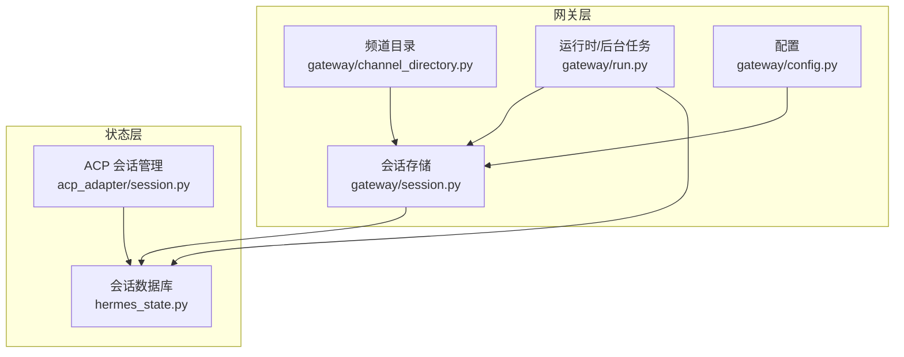
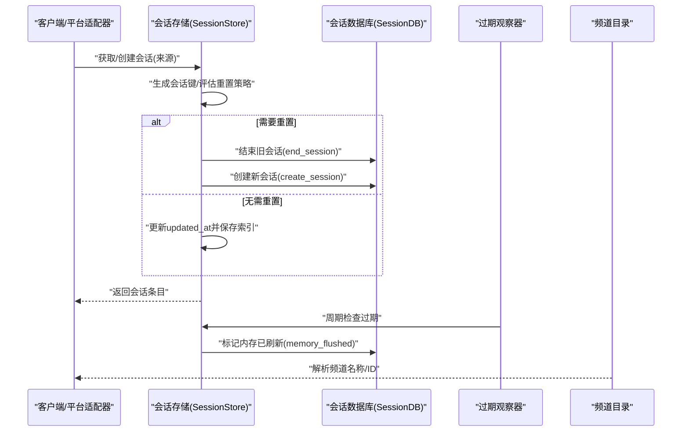
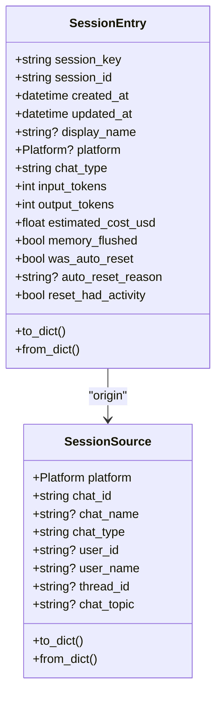
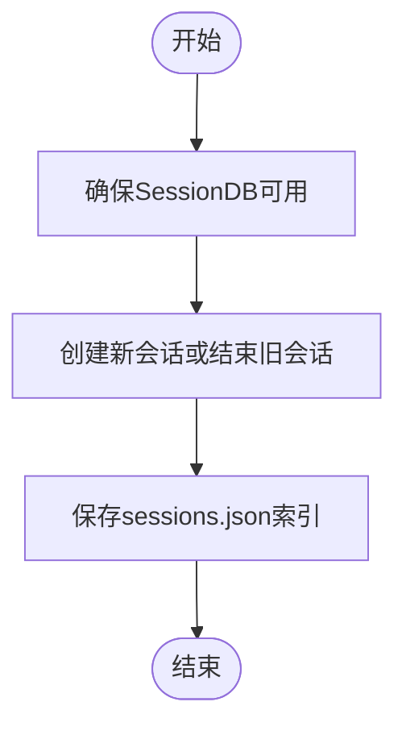
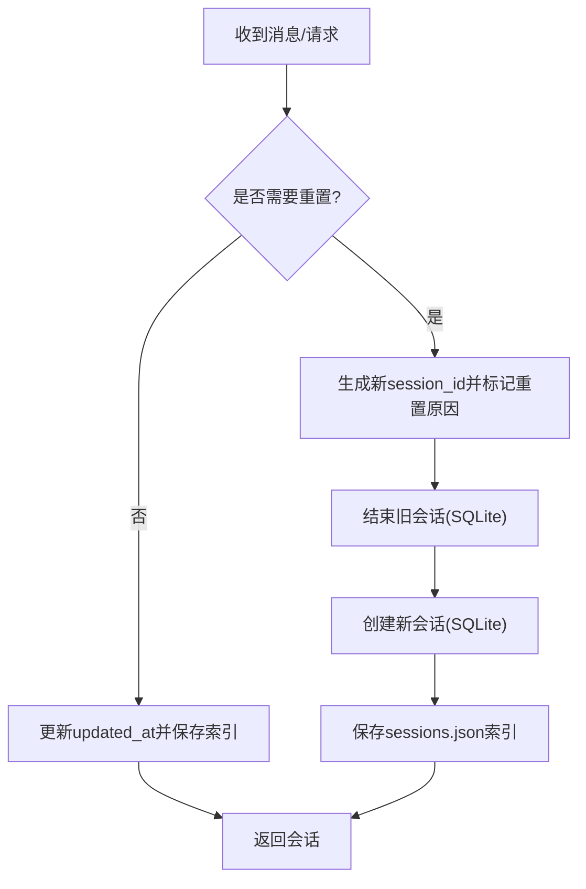
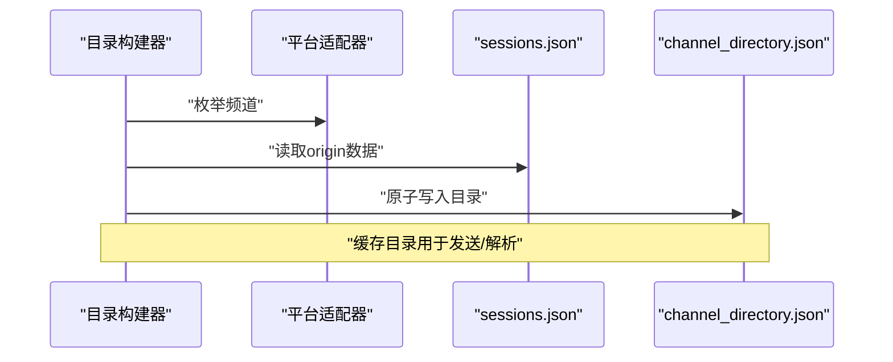
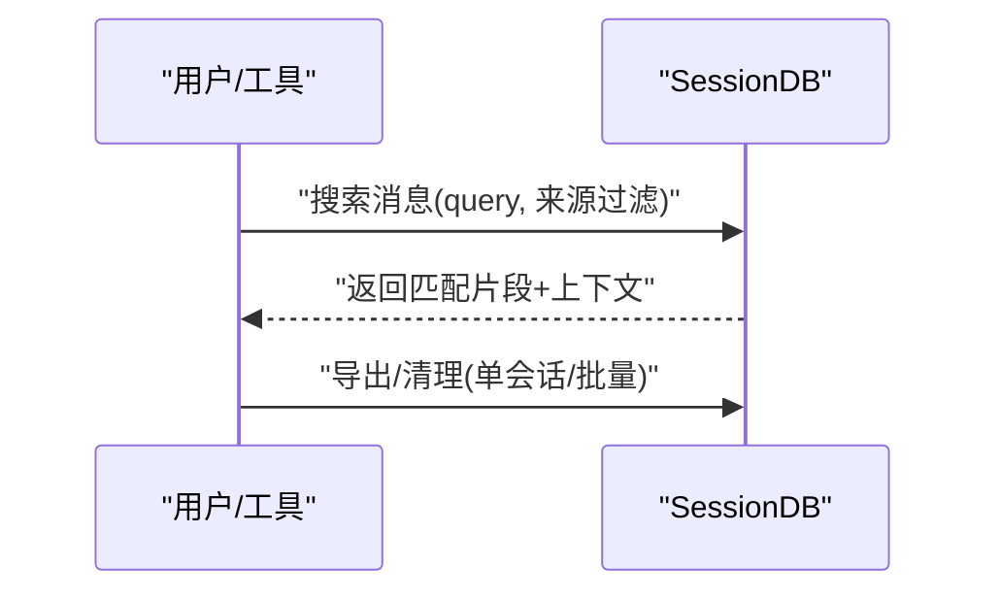
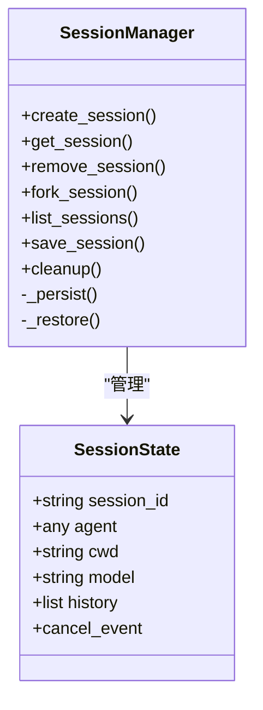
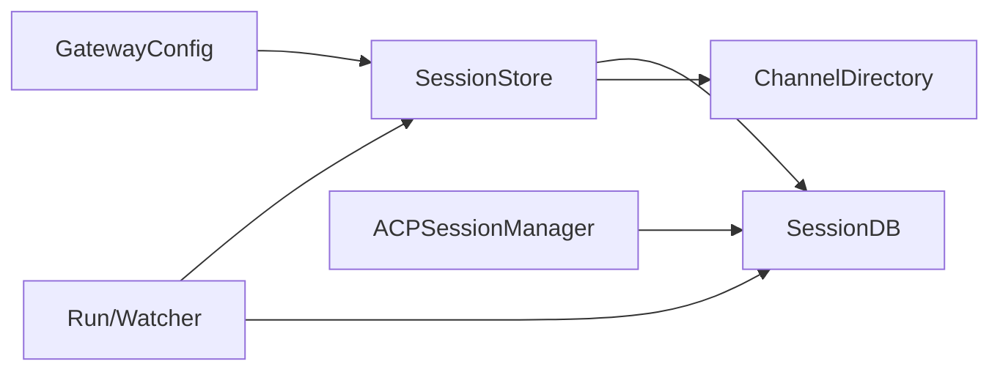

# 会话管理

<cite>
**本文引用的文件**
- [gateway/session.py](file://gateway/session.py)
- [gateway/channel_directory.py](file://gateway/channel_directory.py)
- [gateway/config.py](file://gateway/config.py)
- [hermes_state.py](file://hermes_state.py)
- [acp_adapter/session.py](file://acp_adapter/session.py)
- [gateway/run.py](file://gateway/run.py)
- [tests/gateway/test_session.py](file://tests/gateway/test_session.py)
- [tests/gateway/test_session_reset_notify.py](file://tests/gateway/test_session_reset_notify.py)
- [tests/gateway/test_async_memory_flush.py](file://tests/gateway/test_async_memory_flush.py)
- [tests/test_hermes_state.py](file://tests/test_hermes_state.py)
- [website/docs/user-guide/security.md](file://website/docs/user-guide/security.md)
</cite>

## 目录
1. [简介](#简介)
2. [项目结构](#项目结构)
3. [核心组件](#核心组件)
4. [架构总览](#架构总览)
5. [详细组件分析](#详细组件分析)
6. [依赖分析](#依赖分析)
7. [性能考虑](#性能考虑)
8. [故障排查指南](#故障排查指南)
9. [结论](#结论)
10. [附录](#附录)

## 简介
本文件为 Hermes Agent 的会话管理系统提供全面的 API 参考与实现解析，覆盖以下主题：
- 会话创建、维护与销毁流程：会话键生成、会话状态跟踪、自动重置与过期管理
- 会话存储与持久化：SQLite 会话数据库与 JSONL 历史文件双轨存储
- 会话恢复与历史检索：基于会话 ID 的恢复、标题与前缀解析、全文检索
- 频道目录与路由：跨平台频道映射、名称解析与目标定位
- 多平台会话同步：会话键规则、线程隔离与共享、DM 种子历史
- 会话安全与隔离：PII 脱敏、跨会话隔离、权限与授权边界
- 监控与运维：会话计数、清理策略、内存刷新与后台观察器
- 配置项与超时：会话重置策略、空闲与每日重置、通知策略

## 项目结构
围绕会话管理的关键模块与职责如下：
- 会话键与存储：gateway/session.py 提供会话键生成、会话条目、会话存储与重置策略
- 会话持久化：hermes_state.py 提供 SQLite 会话数据库（含 FTS5 全文检索）
- 频道目录与路由：gateway/channel_directory.py 提供平台频道缓存与名称解析
- ACP 会话管理：acp_adapter/session.py 提供 ACP 侧会话生命周期与持久化
- 运行时与后台任务：gateway/run.py 提供会话过期观察器、内存刷新与会话信息格式化
- 配置：gateway/config.py 定义平台、会话重置策略等配置模型

图表来源
- [gateway/session.py](file://gateway/session.py)
- [gateway/channel_directory.py](file://gateway/channel_directory.py)
- [gateway/run.py](file://gateway/run.py)
- [gateway/config.py](file://gateway/config.py)
- [hermes_state.py](file://hermes_state.py)
- [acp_adapter/session.py](file://acp_adapter/session.py)

章节来源
- [gateway/session.py](file://gateway/session.py)
- [gateway/channel_directory.py](file://gateway/channel_directory.py)
- [gateway/config.py](file://gateway/config.py)
- [hermes_state.py](file://hermes_state.py)
- [acp_adapter/session.py](file://acp_adapter/session.py)
- [gateway/run.py](file://gateway/run.py)

## 核心组件
- 会话键生成：根据来源（平台、聊天类型、用户/群组标识、线程）构建确定性键，支持按用户分组与线程共享/隔离
- 会话条目：记录会话键、会话 ID、创建/更新时间、显示名、平台类型、令牌统计、成本估算、是否自动重置及原因
- 会话存储：内存字典 + sessions.json 持久化；SQLite 会话数据库用于消息历史与元数据
- 重置策略：空闲重置、每日重置、两者皆可或禁用；支持后台观察器与内存刷新标记
- 频道目录：缓存各平台可到达的频道/联系人，支持名称到 ID 的解析
- ACP 会话：在 ACP 场景下持久化会话历史与元数据，支持 fork 与恢复
- 运行时集成：会话过期观察器、内存刷新、会话信息展示、历史压缩与转写

章节来源
- [gateway/session.py](file://gateway/session.py)
- [hermes_state.py](file://hermes_state.py)
- [gateway/channel_directory.py](file://gateway/channel_directory.py)
- [acp_adapter/session.py](file://acp_adapter/session.py)
- [gateway/run.py](file://gateway/run.py)

## 架构总览
会话管理由“键生成—状态跟踪—持久化—路由—恢复—监控”构成闭环。会话键决定跨平台与线程的隔离粒度；会话条目承载状态与统计；SQLite 提供消息历史与全文检索；频道目录支撑跨平台路由；ACP 会话在外部编辑器场景下保持一致性。

图表来源
- [gateway/session.py](file://gateway/session.py)
- [hermes_state.py](file://hermes_state.py)
- [gateway/run.py](file://gateway/run.py)
- [gateway/channel_directory.py](file://gateway/channel_directory.py)

## 详细组件分析

### 会话键生成与会话条目
- 会话键规则
  - DM：优先使用 chat_id，其次 thread_id，若均无则按平台 dm 共享
  - 群组/频道：以 chat_id 为主，thread_id 可区分线程；默认线程对所有参与者共享会话，可通过配置改为按用户隔离
  - 可选用户标识：user_id 或 user_id_alt，启用按用户隔离
- 会话条目字段
  - 基础：session_key、session_id、created_at、updated_at
  - 显示：display_name、platform、chat_type
  - 统计：输入/输出/缓存读写令牌、总令牌、成本估算、最后提示词令牌
  - 重置：was_auto_reset、auto_reset_reason、reset_had_activity
  - 内存：memory_flushed（后台观察器标记）

图表来源
- [gateway/session.py](file://gateway/session.py)

章节来源
- [gateway/session.py](file://gateway/session.py)

### 会话存储与持久化
- 存储介质
  - 内存：_entries 字典 + sessions.json（键到条目的映射）
  - SQLite：SessionDB 提供会话元数据、消息历史、全文检索（FTS5）、批量写入与 WAL 模式
- 写入策略
  - sessions.json 使用临时文件 + 原子替换，保证写入一致性
  - SQLite 使用 BEGIN IMMEDIATE + 应用级随机抖动重试，避免写入锁竞争
- 会话生命周期
  - 创建：create_session
  - 结束：end_session（带结束原因）
  - 重新打开：reopen_session
  - 更新统计：update_token_counts/set_token_counts
  - 清理：clear_messages/delete_session/prune_sessions

图表来源
- [gateway/session.py](file://gateway/session.py)
- [hermes_state.py](file://hermes_state.py)

章节来源
- [gateway/session.py](file://gateway/session.py)
- [hermes_state.py](file://hermes_state.py)

### 会话重置与过期管理
- 重置策略
  - 空闲重置：超过 idle_minutes 未活跃触发
  - 每日重置：本地 at_hour 边界触发
  - 两者皆可：任一条件满足即重置
  - 禁用：不自动重置
- 过期判断
  - _is_session_expired 仅依据条目与策略，不依赖来源
  - _should_reset 同时考虑活跃进程与策略
- 自动重置行为
  - 生成新 session_id，记录 was_auto_reset/auto_reset_reason/reset_had_activity
  - SQLite 中结束旧会话并创建新会话
- 后台观察器
  - 定期扫描过期会话，触发内存刷新并标记 memory_flushed
  - 避免对有活跃进程的会话进行过期判断

图表来源
- [gateway/session.py](file://gateway/session.py)
- [gateway/run.py](file://gateway/run.py)

章节来源
- [gateway/session.py](file://gateway/session.py)
- [tests/gateway/test_session_reset_notify.py](file://tests/gateway/test_session_reset_notify.py)
- [tests/gateway/test_async_memory_flush.py](file://tests/gateway/test_async_memory_flush.py)
- [gateway/run.py](file://gateway/run.py)

### 频道目录与会话路由
- 频道目录构建
  - Discord/Slack：通过适配器枚举频道
  - Telegram/WhatsApp/Signal/Email/SMS：从 sessions.json 的 origin 数据回溯
- 名称解析
  - 支持精确匹配、显示标签匹配、带服务器限定的匹配、前缀唯一匹配
- 路由
  - 会话上下文包含 home_channels 与 connected_platforms，动态系统提示注入路由信息

图表来源
- [gateway/channel_directory.py](file://gateway/channel_directory.py)

章节来源
- [gateway/channel_directory.py](file://gateway/channel_directory.py)

### 会话恢复与历史检索
- 会话 ID 解析
  - 支持精确 ID 或唯一前缀解析
  - 标题清洗与唯一性约束
- 历史检索
  - FTS5 全文检索，支持短语、布尔、前缀查询
  - 返回匹配片段与前后文
- 导出与清理
  - 单会话导出与全量导出
  - 按时间清理已结束会话

图表来源
- [hermes_state.py](file://hermes_state.py)

章节来源
- [hermes_state.py](file://hermes_state.py)
- [tests/test_hermes_state.py](file://tests/test_hermes_state.py)

### ACP 会话管理
- 生命周期
  - 创建/获取/删除/fork 列表
  - 工作目录与模型配置持久化
- 恢复
  - 重启后从数据库恢复会话历史与代理实例
- 与网关协同
  - 共享 SessionDB，支持 session_search

图表来源
- [acp_adapter/session.py](file://acp_adapter/session.py)

章节来源
- [acp_adapter/session.py](file://acp_adapter/session.py)

### 会话安全与隔离
- 跨会话隔离：不同 session_key 对应不同会话，互不访问
- PII 脱敏：在动态系统提示中对部分平台的用户/聊天 ID 进行确定性哈希
- 平台边界：Discord/Slack 等平台的 API 访问限制在系统提示中明确
- 安全模型：七层安全边界（授权、审批、容器隔离、凭证过滤、内容扫描、跨会话隔离、输入净化）

章节来源
- [website/docs/user-guide/security.md](file://website/docs/user-guide/security.md)
- [gateway/session.py](file://gateway/session.py)

## 依赖分析
- 组件耦合
  - SessionStore 依赖 GatewayConfig 与 SessionDB
  - SessionDB 为所有会话与消息提供统一存储
  - ChannelDirectory 依赖 sessions.json 与平台适配器
  - ACP SessionManager 依赖 SessionDB
- 外部依赖
  - SQLite（WAL/FTS5）、JSONL 文件、平台 SDK（Discord/Slack 等）

图表来源
- [gateway/session.py](file://gateway/session.py)
- [hermes_state.py](file://hermes_state.py)
- [gateway/channel_directory.py](file://gateway/channel_directory.py)
- [acp_adapter/session.py](file://acp_adapter/session.py)
- [gateway/run.py](file://gateway/run.py)

章节来源
- [gateway/session.py](file://gateway/session.py)
- [hermes_state.py](file://hermes_state.py)
- [gateway/channel_directory.py](file://gateway/channel_directory.py)
- [acp_adapter/session.py](file://acp_adapter/session.py)
- [gateway/run.py](file://gateway/run.py)

## 性能考虑
- 写入优化
  - sessions.json 使用临时文件 + 原子替换，减少损坏风险
  - SessionDB 使用 WAL + 随机抖动重试，降低写入锁竞争
- 查询优化
  - FTS5 全文检索，支持短语与布尔查询
  - 索引：sessions/source、sessions/parent、messages/session
- 后台任务
  - 过期观察器定期扫描，避免阻塞主流程
  - 内存刷新失败具备重试上限，防止无限循环

## 故障排查指南
- 会话未重置
  - 检查重置策略模式与阈值
  - 确认是否有活跃进程导致跳过过期判断
- 会话历史丢失
  - 确认 SQLite 是否可用；必要时回退至 JSONL
  - 检查 sessions.json 是否被意外删除或损坏
- 频道解析失败
  - 确认 channel_directory.json 是否存在且最新
  - 检查平台适配器是否正常连接
- ACP 会话无法恢复
  - 检查 SessionDB 可用性与 source=acp 的会话记录
  - 确认工作目录与模型配置 JSON 是否有效

章节来源
- [tests/gateway/test_session.py](file://tests/gateway/test_session.py)
- [tests/gateway/test_session_reset_notify.py](file://tests/gateway/test_session_reset_notify.py)
- [tests/gateway/test_async_memory_flush.py](file://tests/gateway/test_async_memory_flush.py)
- [tests/test_hermes_state.py](file://tests/test_hermes_state.py)

## 结论
Hermes Agent 的会话管理系统通过“确定性键 + 多层存储 + 策略驱动重置 + 频道目录 + ACP 持久化”的组合，实现了跨平台、可恢复、可审计、可扩展的会话生命周期管理。配合安全模型与后台观察器，系统在复杂多平台环境下仍能保持稳定与高效。

## 附录

### 关键 API 一览（按模块）
- 会话存储（SessionStore）
  - get_or_create_session(source, force_new=False)
  - switch_session(session_key, target_session_id)
  - list_sessions(active_minutes=None)
  - get_transcript_path(session_id)
  - append_to_transcript(session_id, message, skip_db=False)
  - rewrite_transcript(session_id, messages)
- 会话数据库（SessionDB）
  - create_session(session_id, source, user_id=None, model=None, model_config=None)
  - end_session(session_id, end_reason)
  - reopen_session(session_id)
  - update_token_counts(..., absolute=False)
  - set_token_counts(...)
  - get_session(session_id)
  - resolve_session_id(prefix)
  - set_session_title(session_id, title)
  - get_session_title(session_id)
  - search_messages(query, source_filter=None, exclude_sources=None, role_filter=None, limit=20, offset=0)
  - search_sessions(source=None, limit=20, offset=0)
  - export_session(session_id)
  - export_all(source=None)
  - clear_messages(session_id)
  - delete_session(session_id)
  - prune_sessions(older_than_days, source=None)
- 频道目录（ChannelDirectory）
  - build_channel_directory(adapters)
  - load_directory()
  - resolve_channel_name(platform_name, name)
  - format_directory_for_display()
- ACP 会话管理（ACPSessionManager）
  - create_session(cwd=".")
  - get_session(session_id)
  - remove_session(session_id)
  - fork_session(session_id, cwd=".")
  - list_sessions()
  - save_session(session_id)
  - cleanup()

章节来源
- [gateway/session.py](file://gateway/session.py)
- [hermes_state.py](file://hermes_state.py)
- [gateway/channel_directory.py](file://gateway/channel_directory.py)
- [acp_adapter/session.py](file://acp_adapter/session.py)