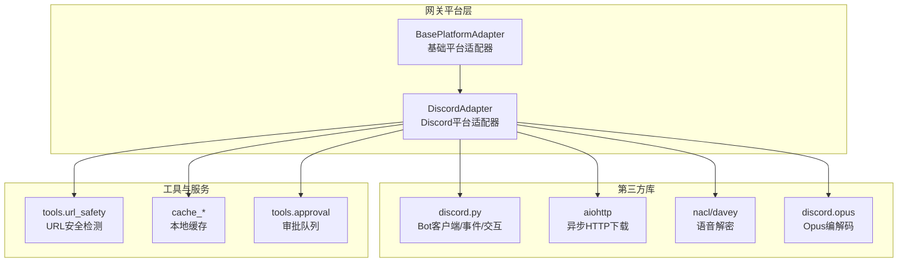
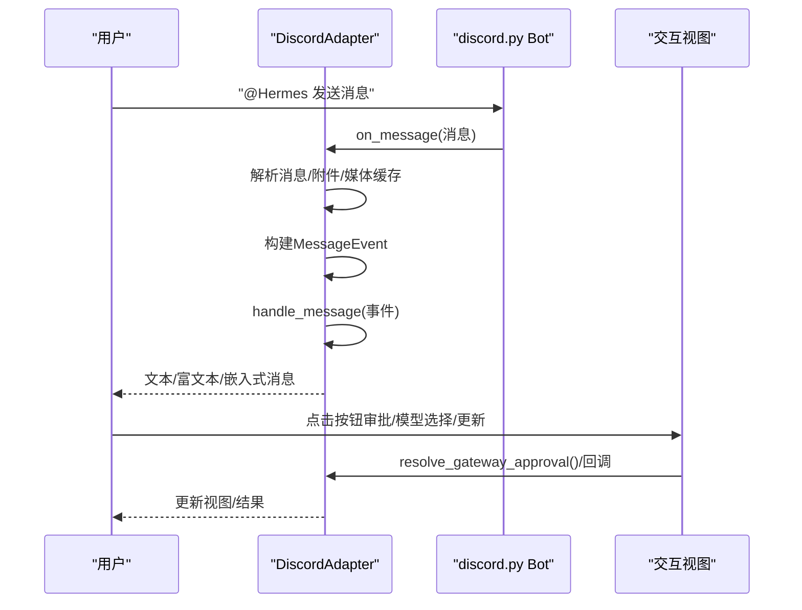
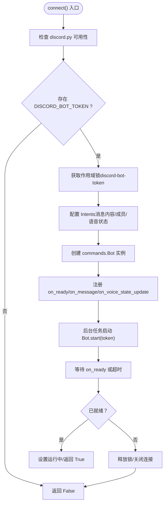
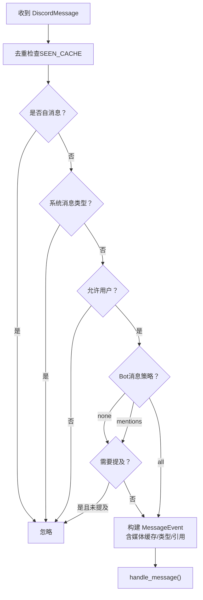
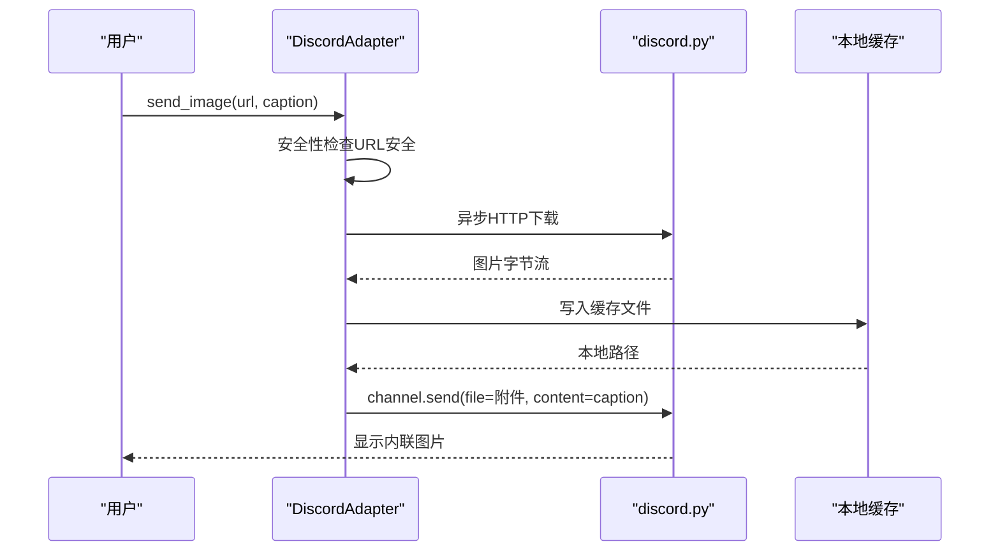
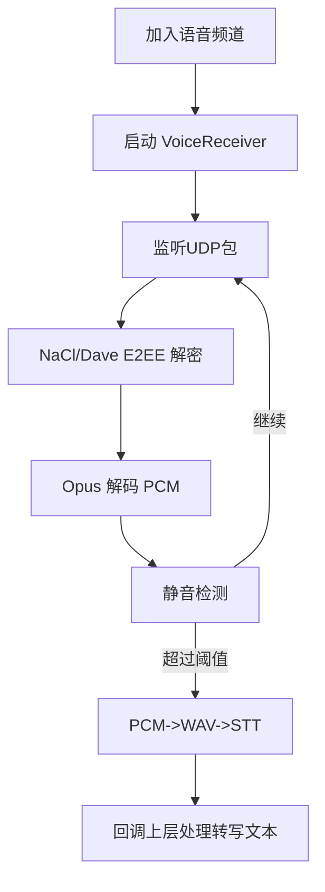
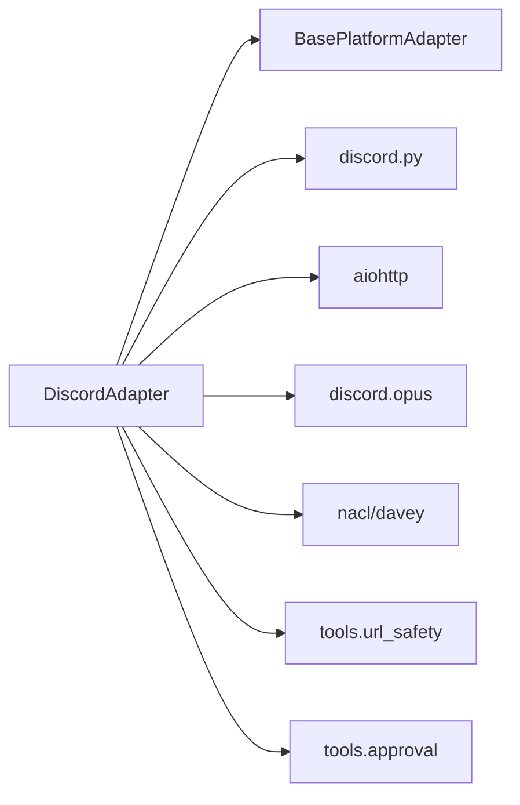

# Discord适配器

<cite>
**本文档引用的文件**
- [discord.py](file://gateway/platforms/discord.py)
- [config.py](file://gateway/config.py)
- [test_discord_slash_commands.py](file://tests/gateway/test_discord_slash_commands.py)
- [test_discord_channel_controls.py](file://tests/gateway/test_discord_channel_controls.py)
- [test_discord_media_metadata.py](file://tests/gateway/test_discord_media_metadata.py)
</cite>

## 目录
1. [简介](#简介)
2. [项目结构](#项目结构)
3. [核心组件](#核心组件)
4. [架构总览](#架构总览)
5. [详细组件分析](#详细组件分析)
6. [依赖关系分析](#依赖关系分析)
7. [性能考虑](#性能考虑)
8. [故障排除指南](#故障排除指南)
9. [结论](#结论)
10. [附录](#附录)

## 简介
本文件为 Hermes Agent 的 Discord 平台适配器提供完整的 API 参考与实现解析。内容覆盖：
- 认证与连接：Bot 令牌认证、WebSocket 连接与事件循环、速率限制与重连策略
- 消息处理：文本、图片、音频、视频与文档的发送与接收；媒体缓存与安全策略
- 线程与频道：自动线程创建、线程持久化、频道控制（忽略/免线程）
- 权限与授权：用户白名单、按钮式执行审批、交互式模型选择
- 特殊功能：语音频道接入、语音消息、STT 转写、语音状态展示
- 配置项：环境变量与配置桥接、平台级参数
- 最佳实践：错误处理、性能优化、限流与稳定性

## 项目结构
Discord 适配器位于网关平台层，继承通用平台适配器基类，使用 discord.py 库进行连接与事件处理。

图示来源
- [discord.py:409-820](file://gateway/platforms/discord.py#L409-L820)
- [discord.py:844-960](file://gateway/platforms/discord.py#L844-L960)
- [discord.py:1260-1380](file://gateway/platforms/discord.py#L1260-L1380)

章节来源
- [discord.py:409-820](file://gateway/platforms/discord.py#L409-L820)
- [discord.py:844-960](file://gateway/platforms/discord.py#L844-L960)
- [discord.py:1260-1380](file://gateway/platforms/discord.py#L1260-L1380)

## 核心组件
- DiscordAdapter：主适配器类，负责连接、事件处理、消息发送、线程管理、语音模式、交互式 UI 组件等
- VoiceReceiver：语音包监听与解码，支持 NaCl/Dave E2EE、Opus 解码、静音检测与说话人映射
- UI 视图组件：ExecApprovalView（执行审批）、UpdatePromptView（更新确认）、ModelPickerView（模型选择）

章节来源
- [discord.py:409-820](file://gateway/platforms/discord.py#L409-L820)
- [discord.py:83-408](file://gateway/platforms/discord.py#L83-L408)
- [discord.py:2439-2828](file://gateway/platforms/discord.py#L2439-L2828)

## 架构总览
Discord 适配器通过 discord.py 的 Bot 客户端建立长连接，注册事件回调（on_ready/on_message/on_voice_state_update），并提供同步/异步方法用于发送消息、文件、语音与交互视图。内部维护语音客户端、接收器与定时任务，支持语音频道自动断开与状态展示。

图示来源
- [discord.py:552-610](file://gateway/platforms/discord.py#L552-L610)
- [discord.py:2190-2433](file://gateway/platforms/discord.py#L2190-L2433)
- [discord.py:2441-2534](file://gateway/platforms/discord.py#L2441-L2534)

章节来源
- [discord.py:552-610](file://gateway/platforms/discord.py#L552-L610)
- [discord.py:2190-2433](file://gateway/platforms/discord.py#L2190-L2433)
- [discord.py:2441-2534](file://gateway/platforms/discord.py#L2441-L2534)

## 详细组件分析

### 认证与连接
- Bot 令牌校验：启动时检查 DISCORD_BOT_TOKEN，防止重复占用（作用域锁）
- Intents 设置：默认意图 + 消息内容 + DM/Guild 消息 + 成员列表（按需）+ 语音状态
- 事件注册：on_ready（同步 slash 命令）、on_message（消息处理）、on_voice_state_update（语音状态）
- 连接超时与异常：超时等待 on_ready 或异常时释放锁并返回失败

图示来源
- [discord.py:459-676](file://gateway/platforms/discord.py#L459-L676)

章节来源
- [discord.py:459-676](file://gateway/platforms/discord.py#L459-L676)

### 事件处理与消息路由
- 去重机制：基于消息 ID 的 TTL 缓存，避免 RESUME 重放导致重复响应
- 过滤规则：
  - 忽略系统消息类型（线程重命名/置顶等）
  - 白名单过滤（DISCORD_ALLOWED_USERS，支持用户名/提及清理）
  - Bot 消息策略（none/mentions/all）
  - 无提及行为（可配置，默认忽略未提及的多用户消息）
- 自动线程：在服务器文本频道中，@Hermes 时自动创建线程并重定向后续消息
- 线程参与持久化：记录 bot 参与过的线程 ID，后续无需 @ 即可回复

图示来源
- [discord.py:552-610](file://gateway/platforms/discord.py#L552-L610)
- [discord.py:2190-2433](file://gateway/platforms/discord.py#L2190-L2433)

章节来源
- [discord.py:552-610](file://gateway/platforms/discord.py#L552-L610)
- [discord.py:2190-2433](file://gateway/platforms/discord.py#L2190-L2433)

### 消息格式与内容安全
- Markdown 支持：Discord 使用其自有 Markdown，适配器不做额外转义
- 富文本与嵌入式消息：通过 Embed 对象支持标题、描述、颜色、字段等
- 内容安全：图片/音频 URL 安全检测；文档大小限制与类型白名单
- 媒体注入：对 txt/md 文档进行文本注入，限制最大注入长度

章节来源
- [discord.py:1528-1536](file://gateway/platforms/discord.py#L1528-L1536)
- [discord.py:1998-2011](file://gateway/platforms/discord.py#L1998-L2011)
- [discord.py:2312-2409](file://gateway/platforms/discord.py#L2312-L2409)

### 文件上传与媒体处理
- 本地文件：send_image_file/send_video/send_document 直接作为附件发送
- 远程资源：send_image 下载后以附件形式发送；支持扩展名推断
- 语音消息：优先尝试原生语音消息标志，失败则回退为普通文件
- 附件缓存：图片/音频/文档下载到本地缓存，便于视觉/语音工具访问

图示来源
- [discord.py:1284-1344](file://gateway/platforms/discord.py#L1284-L1344)
- [discord.py:2312-2409](file://gateway/platforms/discord.py#L2312-L2409)

章节来源
- [discord.py:1284-1344](file://gateway/platforms/discord.py#L1284-L1344)
- [discord.py:2312-2409](file://gateway/platforms/discord.py#L2312-L2409)

### 线程管理与频道控制
- 自动线程：@Hermes 时在文本频道创建线程，名称来自消息前缀，自动归档时长可选
- 线程持久化：将 bot 参与过的线程 ID 持久化到磁盘，重启后仍可免 @ 回复
- 频道控制：
  - ignored_channels：完全忽略的频道（含线程父频道）
  - no_thread_channels：免自动线程的频道
  - free_response_channels：免提及自由回复的频道
- slash 命令 /thread：创建线程并可选发送首条消息

章节来源
- [discord.py:1789-1948](file://gateway/platforms/discord.py#L1789-L1948)
- [discord.py:2151-2189](file://gateway/platforms/discord.py#L2151-L2189)
- [discord.py:2210-2258](file://gateway/platforms/discord.py#L2210-L2258)
- [test_discord_channel_controls.py:105-200](file://tests/gateway/test_discord_channel_controls.py#L105-L200)
- [test_discord_slash_commands.py:74-120](file://tests/gateway/test_discord_slash_commands.py#L74-L120)

### 权限系统与授权
- 用户白名单：DISCORD_ALLOWED_USERS 支持数字 ID/用户名/全局名，启动时解析为 ID
- 按钮式审批：仅允许白名单用户点击“允许/拒绝”按钮，触发审批队列
- 交互式模型选择：两步下拉菜单（提供商→模型），仅白名单用户可操作
- 语音模式：/voice 切换语音回复模式（on/off/tts/channel/leave/status）

章节来源
- [discord.py:1464-1527](file://gateway/platforms/discord.py#L1464-L1527)
- [discord.py:1971-2015](file://gateway/platforms/discord.py#L1971-L2015)
- [discord.py:2047-2106](file://gateway/platforms/discord.py#L2047-L2106)
- [discord.py:1646-1658](file://gateway/platforms/discord.py#L1646-L1658)

### 语音频道与实时活动
- 语音接入：join_voice_channel/leave_voice_channel，支持自动断连空闲超时
- 语音监听：VoiceReceiver 监听 UDP，解密 NaCl/Dave E2EE，Opus 解码，静音检测
- STT 转写：PCM 转 WAV 后调用 STT 工具生成转写文本
- 语音状态展示：获取当前语音频道成员、说话人状态，注入系统提示词

图示来源
- [discord.py:964-1014](file://gateway/platforms/discord.py#L964-L1014)
- [discord.py:1186-1253](file://gateway/platforms/discord.py#L1186-L1253)
- [discord.py:1109-1177](file://gateway/platforms/discord.py#L1109-L1177)

章节来源
- [discord.py:964-1014](file://gateway/platforms/discord.py#L964-L1014)
- [discord.py:1186-1253](file://gateway/platforms/discord.py#L1186-L1253)
- [discord.py:1109-1177](file://gateway/platforms/discord.py#L1109-L1177)

### 交互式 UI 组件
- ExecApprovalView：四种审批选项（一次/会话/永久/拒绝），超时禁用
- UpdatePromptView：更新确认（是/否），写入响应文件供更新流程读取
- ModelPickerView：两步模型选择（提供商→模型），超时禁用

章节来源
- [discord.py:2441-2534](file://gateway/platforms/discord.py#L2441-L2534)
- [discord.py:2535-2613](file://gateway/platforms/discord.py#L2535-L2613)
- [discord.py:2614-2828](file://gateway/platforms/discord.py#L2614-L2828)

### 配置选项与环境变量
- 平台级配置：token、home_channel、reply_to_mode、extra
- Discord 环境变量（优先于配置桥接）：
  - DISCORD_BOT_TOKEN：Bot 令牌
  - DISCORD_HOME_CHANNEL：首页频道
  - DISCORD_REQUIRE_MENTION：是否要求提及
  - DISCORD_FREE_RESPONSE_CHANNELS：免提及自由回复频道
  - DISCORD_IGNORED_CHANNELS：忽略的频道（含线程父频道）
  - DISCORD_NO_THREAD_CHANNELS：免自动线程频道
  - DISCORD_AUTO_THREAD：是否自动线程
  - DISCORD_REACTIONS：是否启用消息反应
  - DISCORD_ALLOWED_USERS：允许用户白名单（支持用户名解析）
  - DISCORD_ALLOW_BOTS：Bot 消息策略（none/mentions/all）
  - DISCORD_IGNORE_NO_MENTION：是否忽略未提及的多用户消息

章节来源
- [config.py:699-714](file://gateway/config.py#L699-L714)
- [config.py:546-571](file://gateway/config.py#L546-L571)
- [discord.py:508-527](file://gateway/platforms/discord.py#L508-L527)
- [discord.py:2210-2258](file://gateway/platforms/discord.py#L2210-L2258)

## 依赖关系分析
- 外部依赖：discord.py（Bot/事件/交互）、aiohttp（异步下载）、nacl/davey（语音解密）、discord.opus（编解码）
- 内部依赖：BasePlatformAdapter（消息格式化、分块发送、媒体缓存）、tools.url_safety（URL 安全）、tools.approval（审批队列）

图示来源
- [discord.py:409-820](file://gateway/platforms/discord.py#L409-L820)
- [discord.py:844-960](file://gateway/platforms/discord.py#L844-L960)

章节来源
- [discord.py:409-820](file://gateway/platforms/discord.py#L409-L820)
- [discord.py:844-960](file://gateway/platforms/discord.py#L844-L960)

## 性能考虑
- 消息分块：文本超过最大长度自动分块发送，避免 2000 字符限制
- 去重缓存：SEEN_CACHE 控制内存增长，TTL 清理过期键
- 语音解码：每 SSRC 维护独立解码器状态，避免跨用户干扰
- STT 执行：在独立线程中执行，避免阻塞事件循环
- Typing 指示：DM 中采用轮询保持输入指示，避免不可靠的 TYPING_START
- Opus 加载：按需加载，失败时降级为文本回复

## 故障排除指南
- 连接失败
  - 检查 DISCORD_BOT_TOKEN 是否正确且未被其他进程占用
  - 确认 Intents 配置（消息内容/成员/语音状态）与开发者门户一致
  - 关注 on_ready 超时日志，必要时增加超时时间或检查网络
- 消息未响应
  - 检查 DISCORD_IGNORED_CHANNELS、DISCORD_REQUIRE_MENTION、DISCORD_FREE_RESPONSE_CHANNELS
  - 确认用户在 DISCORD_ALLOWED_USERS 中，或允许所有 Bot 消息
  - 在线程中首次回复可能需要 @Hermes，除非已参与线程
- 语音问题
  - 确认系统已安装 Opus 动态库，discord.opus.is_loaded() 为真
  - 检查语音频道权限与网络状况，关注静音检测与解密失败日志
- 附件/媒体问题
  - 图片/音频下载失败时检查 URL 安全与网络超时
  - 文档过大或类型不受支持会被跳过，检查大小与扩展名映射

章节来源
- [discord.py:459-676](file://gateway/platforms/discord.py#L459-L676)
- [discord.py:2210-2258](file://gateway/platforms/discord.py#L2210-L2258)
- [discord.py:1186-1253](file://gateway/platforms/discord.py#L1186-L1253)

## 结论
Discord 适配器提供了从认证、事件处理、消息发送到语音交互的完整能力，具备良好的扩展性与安全性设计。通过环境变量与配置桥接，用户可以灵活控制频道行为、线程策略与权限范围。建议在生产环境中启用白名单、合理设置自动线程与忽略频道，并监控语音解码与 STT 性能。

## 附录

### API 参考（方法概览）
- 连接与断开
  - connect()：建立连接，注册事件，等待就绪
  - disconnect()：断开所有语音连接，关闭客户端，释放令牌锁
- 消息发送
  - send(chat_id, content, reply_to, metadata)：发送文本消息，自动分块
  - edit_message(chat_id, message_id, content)：编辑已有消息
  - send_image_file/chat_id, image_path, caption)：发送本地图片
  - send_image(chat_id, image_url, caption)：发送远程图片（下载后附件）
  - send_video(chat_id, video_path, caption)：发送本地视频
  - send_document(chat_id, file_path, caption, file_name)：发送任意文件
  - send_voice(chat_id, audio_path, caption, reply_to, metadata)：发送语音（优先原生语音消息）
  - play_tts(chat_id, audio_path)：在语音频道播放 TTS
- 语音频道
  - join_voice_channel(channel)：加入语音频道
  - leave_voice_channel(guild_id)：离开语音频道
  - play_in_voice_channel(guild_id, audio_path)：播放音频
  - get_user_voice_channel(guild_id, user_id)：获取用户所在语音频道
  - get_voice_channel_info(guild_id)/get_voice_channel_context(guild_id)：获取语音状态信息
- 线程与频道
  - _auto_create_thread(message)：自动创建线程
  - _create_thread(interaction, name, message, auto_archive_duration)：创建线程（slash）
  - _dispatch_thread_session(interaction, thread_id, thread_name, text)：在新线程发起会话
  - _track_thread(thread_id)：记录参与线程
- 交互式 UI
  - send_exec_approval(chat_id, command, session_key, description, metadata)：按钮式审批
  - send_update_prompt(chat_id, prompt, default, session_key)：更新确认
  - send_model_picker(...)：模型选择视图
- 辅助
  - format_message(content)：Markdown 格式化
  - send_typing(chat_id)/stop_typing(chat_id)：输入指示
  - get_chat_info(chat_id)：获取频道信息

章节来源
- [discord.py:459-706](file://gateway/platforms/discord.py#L459-L706)
- [discord.py:750-843](file://gateway/platforms/discord.py#L750-L843)
- [discord.py:844-960](file://gateway/platforms/discord.py#L844-L960)
- [discord.py:867-959](file://gateway/platforms/discord.py#L867-L959)
- [discord.py:964-1177](file://gateway/platforms/discord.py#L964-L1177)
- [discord.py:1789-1855](file://gateway/platforms/discord.py#L1789-L1855)
- [discord.py:1971-2106](file://gateway/platforms/discord.py#L1971-L2106)
- [discord.py:1381-1463](file://gateway/platforms/discord.py#L1381-L1463)

### 测试要点（验证行为）
- slash 命令注册与线程创建：见测试文件
- 频道控制（忽略/免线程）：见测试文件
- 媒体方法签名（metadata 参数）：见测试文件

章节来源
- [test_discord_slash_commands.py:74-120](file://tests/gateway/test_discord_slash_commands.py#L74-L120)
- [test_discord_channel_controls.py:105-200](file://tests/gateway/test_discord_channel_controls.py#L105-L200)
- [test_discord_media_metadata.py:6-10](file://tests/gateway/test_discord_media_metadata.py#L6-L10)