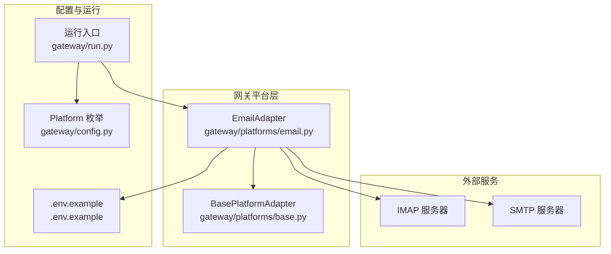
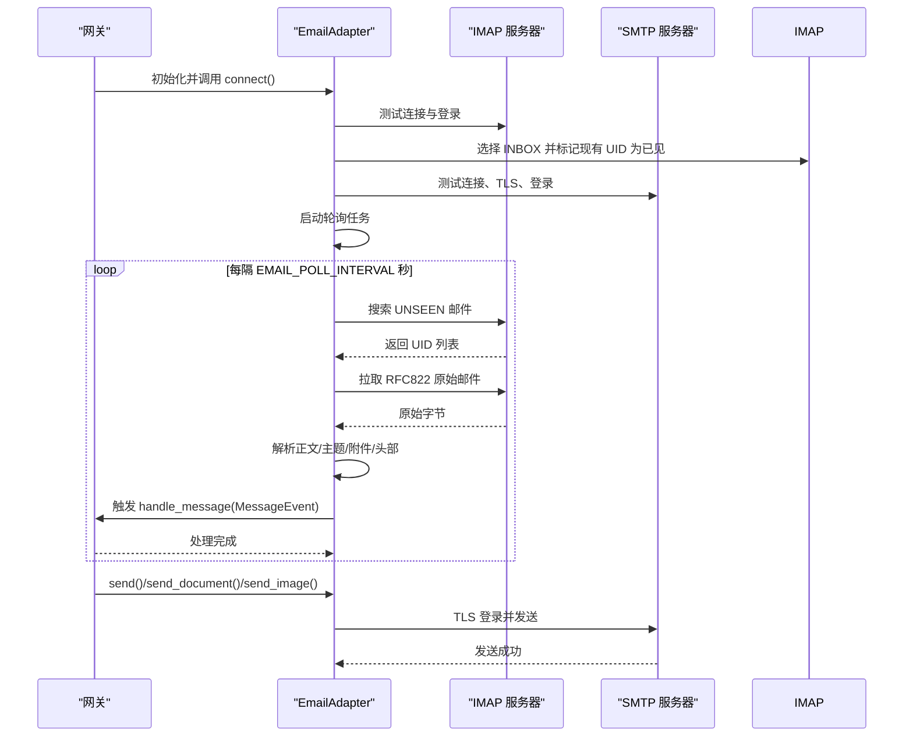
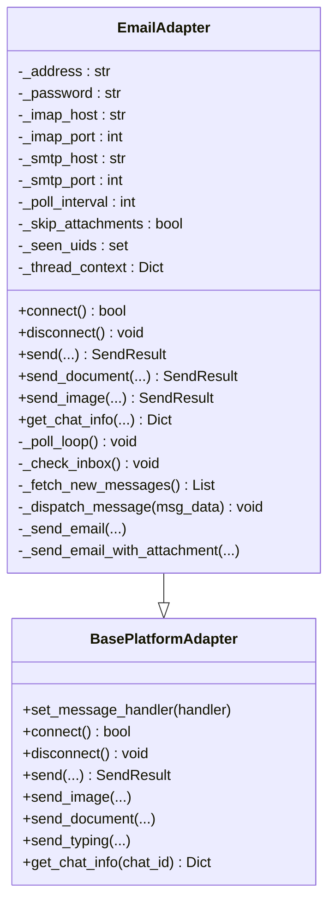
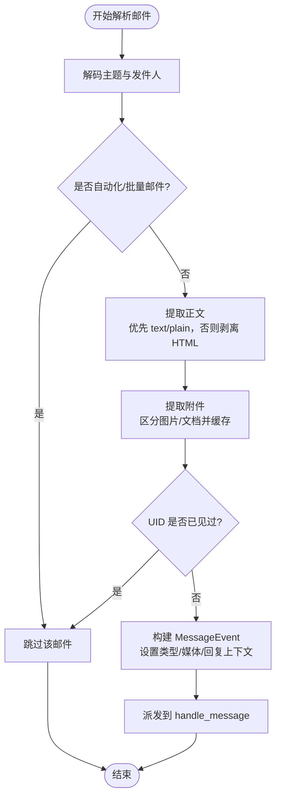
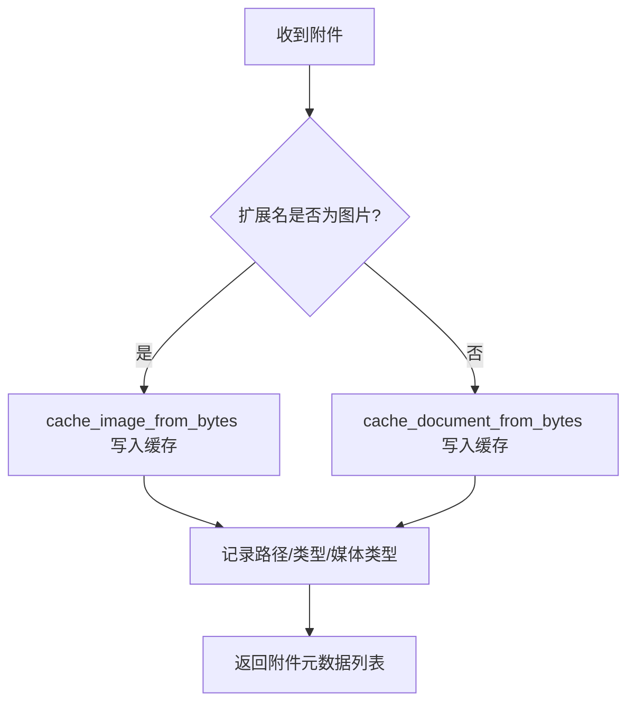
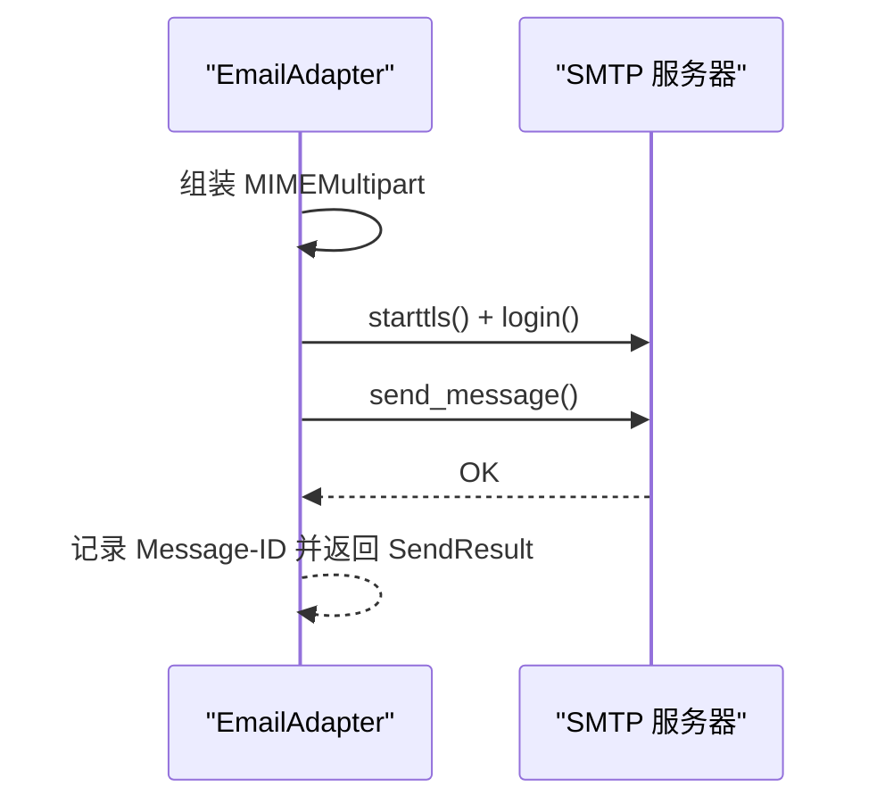
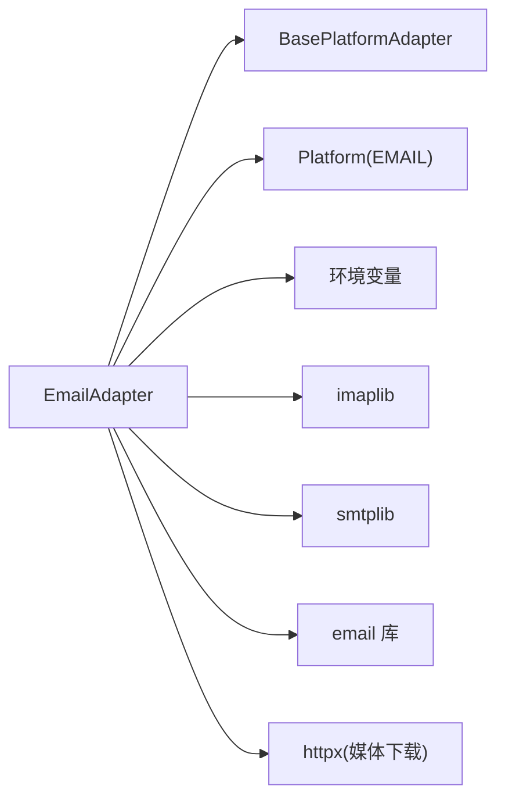

# 邮件适配器

<cite>
**本文档引用的文件**
- [email.py](file://gateway/platforms/email.py)
- [base.py](file://gateway/platforms/base.py)
- [config.py](file://gateway/config.py)
- [.env.example](file://.env.example)
- [test_email.py](file://tests/gateway/test_email.py)
- [run.py](file://gateway/run.py)
</cite>

## 目录
1. [简介](#简介)
2. [项目结构](#项目结构)
3. [核心组件](#核心组件)
4. [架构总览](#架构总览)
5. [详细组件分析](#详细组件分析)
6. [依赖分析](#依赖分析)
7. [性能考虑](#性能考虑)
8. [故障排查指南](#故障排查指南)
9. [结论](#结论)
10. [附录](#附录)

## 简介
本文件为 Hermes Agent 的 Email 平台适配器提供详细的 API 参考与实现说明。内容覆盖：
- SMTP/IMAP 协议集成与连接管理
- 邮件解析（文本/HTML、附件、头部信息）
- 自动回复与邮件线程保持
- 媒体处理（图片/文档缓存、URL 安全性）
- 权限控制（邮箱认证、允许用户列表、反垃圾策略）
- 特殊功能（模板化自动回复、转发、分类）
- 配置项（SMTP/IMAP 参数、轮询间隔、跳过附件等）
- 最佳实践（安全、性能、错误处理）

## 项目结构
Email 适配器位于网关平台层，继承自通用平台适配器基类，并通过环境变量驱动配置。测试用例覆盖了关键行为与边界条件。

图表来源
- [email.py:217-622](file://gateway/platforms/email.py#L217-L622)
- [base.py:470-800](file://gateway/platforms/base.py#L470-L800)
- [config.py:48-66](file://gateway/config.py#L48-L66)
- [.env.example:264-278](file://.env.example#L264-L278)

章节来源
- [email.py:1-622](file://gateway/platforms/email.py#L1-L622)
- [base.py:1-800](file://gateway/platforms/base.py#L1-L800)
- [config.py:1-200](file://gateway/config.py#L1-L200)
- [.env.example:1-362](file://.env.example#L1-L362)

## 核心组件
- EmailAdapter：基于 IMAP 接收、SMTP 发送的邮件适配器，负责轮询、解析、派发消息与发送响应。
- 基础适配器基类：统一的消息事件模型、发送结果封装、媒体缓存工具、会话与状态管理。
- 平台配置：定义 Platform 枚举（含 EMAIL），支持额外配置项（如 skip_attachments）。
- 运行时桥接：从配置文件读取值到环境变量，供适配器读取；同时提供权限映射与平台映射。

章节来源
- [email.py:217-622](file://gateway/platforms/email.py#L217-L622)
- [base.py:367-444](file://gateway/platforms/base.py#L367-L444)
- [config.py:48-66](file://gateway/config.py#L48-L66)
- [run.py:82-200](file://gateway/run.py#L82-L200)

## 架构总览
Email 适配器采用“轮询 + 异步执行”的模式：
- 启动时进行 IMAP/SMTP 连通性测试，标记已存在邮件为已见以避免重复处理
- 后台任务按固定周期轮询未读邮件
- 解析邮件正文、主题、附件，构建消息事件并交由上层处理器
- 发送时根据线程上下文生成合适的 Subject、In-Reply-To、References

图表来源
- [email.py:268-326](file://gateway/platforms/email.py#L268-L326)
- [email.py:335-399](file://gateway/platforms/email.py#L335-L399)
- [email.py:401-460](file://gateway/platforms/email.py#L401-L460)
- [email.py:461-521](file://gateway/platforms/email.py#L461-L521)
- [email.py:561-611](file://gateway/platforms/email.py#L561-L611)

## 详细组件分析

### EmailAdapter 类
- 职责
  - 读取环境变量与配置，初始化 IMAP/SMTP 参数与轮询间隔
  - 连接测试、后台轮询、去重（UID 集合）、线程上下文维护
  - 接收：解析邮件、提取正文/附件、构建消息事件
  - 发送：纯文本、带附件、图片 URL 插入
- 关键方法
  - connect/disconnect：连接生命周期管理
  - _poll_loop/_check_inbox：轮询与抓取
  - _fetch_new_messages：在执行器线程中进行 IMAP 操作
  - _dispatch_message：构建 MessageEvent 并派发
  - send/send_document/send_image：SMTP 发送
  - get_chat_info：返回聊天基本信息（线程主题）

图表来源
- [email.py:217-622](file://gateway/platforms/email.py#L217-L622)
- [base.py:470-800](file://gateway/platforms/base.py#L470-L800)

章节来源
- [email.py:217-622](file://gateway/platforms/email.py#L217-L622)

### 邮件解析与消息派发
- 主题解码与地址提取
- 正文优先取 text/plain，否则回退到 text/html 并剥离标签
- 附件提取：区分图片与文档，分别缓存至本地并记录媒体类型
- 自动化/批量邮件过滤：基于地址模式与常见自动化头字段
- 去重：使用 UID 集合，超过阈值时仅保留最近一半
- 线程上下文：按发件人保存最近主题与 Message-ID，用于自动回复时的 Subject 与 In-Reply-To 设置

图表来源
- [email.py:67-76](file://gateway/platforms/email.py#L67-L76)
- [email.py:89-98](file://gateway/platforms/email.py#L89-L98)
- [email.py:101-136](file://gateway/platforms/email.py#L101-L136)
- [email.py:161-214](file://gateway/platforms/email.py#L161-L214)
- [email.py:248-267](file://gateway/platforms/email.py#L248-L267)
- [email.py:401-460](file://gateway/platforms/email.py#L401-L460)

章节来源
- [email.py:67-76](file://gateway/platforms/email.py#L67-L76)
- [email.py:89-98](file://gateway/platforms/email.py#L89-L98)
- [email.py:101-136](file://gateway/platforms/email.py#L101-L136)
- [email.py:161-214](file://gateway/platforms/email.py#L161-L214)
- [email.py:248-267](file://gateway/platforms/email.py#L248-L267)
- [email.py:401-460](file://gateway/platforms/email.py#L401-L460)

### 媒体处理与缓存
- 图片缓存：将二进制图像写入本地缓存目录，返回绝对路径
- 文档缓存：对非图片附件进行缓存，防止路径穿越
- URL 下载与 SSRF 保护：通过 URL 安全检查后下载，失败重试与指数退避
- 媒体类型识别：基于扩展名与 Content-Type 判定图片/文档

图表来源
- [email.py:161-214](file://gateway/platforms/email.py#L161-L214)
- [base.py:95-111](file://gateway/platforms/base.py#L95-L111)
- [base.py:314-344](file://gateway/platforms/base.py#L314-L344)
- [base.py:113-171](file://gateway/platforms/base.py#L113-L171)

章节来源
- [email.py:161-214](file://gateway/platforms/email.py#L161-L214)
- [base.py:95-111](file://gateway/platforms/base.py#L95-L111)
- [base.py:314-344](file://gateway/platforms/base.py#L314-L344)
- [base.py:113-171](file://gateway/platforms/base.py#L113-L171)

### 发送流程（SMTP）
- 纯文本：设置 From/To/Subject/Message-ID，发送
- 附件：multipart + base64 编码附件
- 图片：在正文插入图片 URL，走 send 方法
- 线程保持：若存在线程上下文，自动添加 In-Reply-To/References

图表来源
- [email.py:461-521](file://gateway/platforms/email.py#L461-L521)
- [email.py:561-611](file://gateway/platforms/email.py#L561-L611)

章节来源
- [email.py:461-521](file://gateway/platforms/email.py#L461-L521)
- [email.py:561-611](file://gateway/platforms/email.py#L561-L611)

### 权限控制与安全
- 邮箱认证：IMAP/SMTP 使用 EMAIL_ADDRESS 与 EMAIL_PASSWORD
- 允许用户：通过 EMAIL_ALLOWED_USERS 控制可交互的发件人
- 反垃圾策略：自动化/批量邮件头与地址模式过滤
- SSRF 保护：媒体下载前进行 URL 安全校验
- 跳过附件：可通过配置项 skip_attachments 在高风险场景禁用附件下载

章节来源
- [.env.example:264-278](file://.env.example#L264-L278)
- [email.py:47-76](file://gateway/platforms/email.py#L47-L76)
- [email.py:231-237](file://gateway/platforms/email.py#L231-L237)
- [base.py:131-134](file://gateway/platforms/base.py#L131-L134)

### 配置选项
- 必填
  - EMAIL_ADDRESS：代理邮箱地址
  - EMAIL_PASSWORD：邮箱密码或应用专用密码
  - EMAIL_IMAP_HOST：IMAP 服务器主机
  - EMAIL_SMTP_HOST：SMTP 服务器主机
- 可选
  - EMAIL_IMAP_PORT：默认 993
  - EMAIL_SMTP_PORT：默认 587
  - EMAIL_POLL_INTERVAL：轮询间隔秒数，默认 15
  - EMAIL_ALLOWED_USERS：逗号分隔的允许发件人列表
  - EMAIL_HOME_ADDRESS：家庭频道（默认投递地址）
  - 平台额外配置：skip_attachments（布尔）
- 运行时桥接：config.yaml 中的某些键会映射到环境变量，从而影响适配器行为

章节来源
- [.env.example:264-278](file://.env.example#L264-L278)
- [email.py:220-237](file://gateway/platforms/email.py#L220-L237)
- [config.py:48-66](file://gateway/config.py#L48-L66)
- [run.py:82-200](file://gateway/run.py#L82-L200)

### 特殊功能
- 自动回复：基于线程上下文自动设置 Re: 前缀与 In-Reply-To
- 邮件模板：当前实现未内置模板引擎，但可通过上层逻辑拼接正文
- 邮件转发：通过 send_document/send_image 实现附件转发
- 邮件分类：可通过线程上下文与主题字段进行简单分类（需上层逻辑配合）

章节来源
- [email.py:490-504](file://gateway/platforms/email.py#L490-L504)
- [email.py:573-582](file://gateway/platforms/email.py#L573-L582)

## 依赖分析
- EmailAdapter 依赖
  - 平台基类：消息事件、发送结果、媒体缓存工具
  - 平台枚举：Platform.EMAIL
  - 运行时：从配置桥接环境变量，参与权限映射
- 外部依赖
  - IMAP/SMTP：标准库模块
  - email 库：解析 MIME 邮件
  - httpx（媒体下载）：异步 HTTP 客户端

图表来源
- [email.py:18-43](file://gateway/platforms/email.py#L18-L43)
- [config.py:48-66](file://gateway/config.py#L48-L66)
- [base.py:470-800](file://gateway/platforms/base.py#L470-L800)

章节来源
- [email.py:18-43](file://gateway/platforms/email.py#L18-L43)
- [config.py:48-66](file://gateway/config.py#L48-L66)
- [base.py:470-800](file://gateway/platforms/base.py#L470-L800)

## 性能考虑
- 轮询间隔：通过 EMAIL_POLL_INTERVAL 调整，平衡实时性与资源消耗
- 去重策略：UID 集合上限与半保留策略，避免内存无限增长
- 执行器线程：IMAP/SMTP 操作在执行器线程中运行，避免阻塞事件循环
- 附件处理：可启用 skip_attachments 减少带宽与磁盘占用
- 媒体缓存清理：定期清理过期缓存文件，释放空间

章节来源
- [email.py:229](file://gateway/platforms/email.py#L229)
- [email.py:248-267](file://gateway/platforms/email.py#L248-L267)
- [email.py:236](file://gateway/platforms/email.py#L236)
- [base.py:173-191](file://gateway/platforms/base.py#L173-L191)
- [base.py:346-364](file://gateway/platforms/base.py#L346-L364)

## 故障排查指南
- 连接失败
  - 检查 EMAIL_ADDRESS/EMAIL_PASSWORD 是否正确
  - 确认 EMAIL_IMAP_HOST/EMAIL_SMTP_HOST 可达且端口开放
  - 查看日志中的错误堆栈定位具体异常
- 无法接收邮件
  - 确认 IMAP 已开启并允许应用密码
  - 检查 EMAIL_POLL_INTERVAL 是否过大
  - 核对 ALLOWED_USERS 是否限制了发件人
- 发送失败
  - 检查 SMTP 认证与 STARTTLS 支持
  - 若启用 skip_attachments，确认未误删必要附件
- 媒体下载失败
  - 确认 URL 安全检查未拦截（SSRF 保护）
  - 查看重试日志与指数退避策略

章节来源
- [email.py:268-302](file://gateway/platforms/email.py#L268-L302)
- [email.py:335-399](file://gateway/platforms/email.py#L335-L399)
- [email.py:461-521](file://gateway/platforms/email.py#L461-L521)
- [email.py:561-611](file://gateway/platforms/email.py#L561-L611)
- [base.py:131-171](file://gateway/platforms/base.py#L131-L171)

## 结论
Email 适配器提供了稳定、可扩展的邮件接入能力，具备完善的解析、缓存与发送机制，并通过配置与权限映射满足不同部署场景的安全与性能需求。建议在生产环境中结合轮询间隔、附件策略与媒体缓存清理策略进行调优，并严格管理允许用户列表与认证凭据。

## 附录

### API 参考摘要
- 初始化与生命周期
  - 构造函数：读取环境变量与平台额外配置
  - connect：IMAP/SMTP 连通性测试与轮询任务启动
  - disconnect：停止轮询并断开连接
- 接收与派发
  - _poll_loop/_check_inbox：轮询未读邮件
  - _fetch_new_messages：拉取原始邮件并解析
  - _dispatch_message：构建 MessageEvent 并派发
- 发送接口
  - send：纯文本回复
  - send_document：带附件回复
  - send_image：在正文插入图片 URL
  - send_typing：空操作（Email 不支持打字指示）
- 辅助能力
  - get_chat_info：查询聊天信息（含主题）
  - 线程上下文：按发件人维护主题与 Message-ID

章节来源
- [email.py:217-622](file://gateway/platforms/email.py#L217-L622)