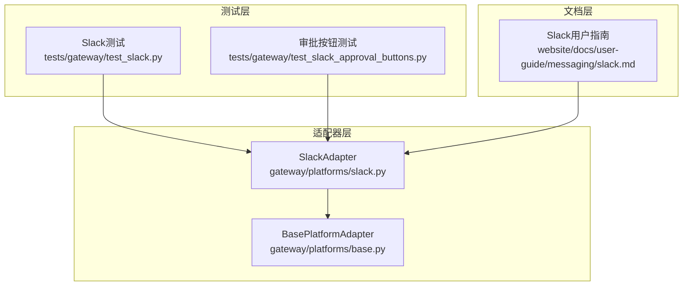
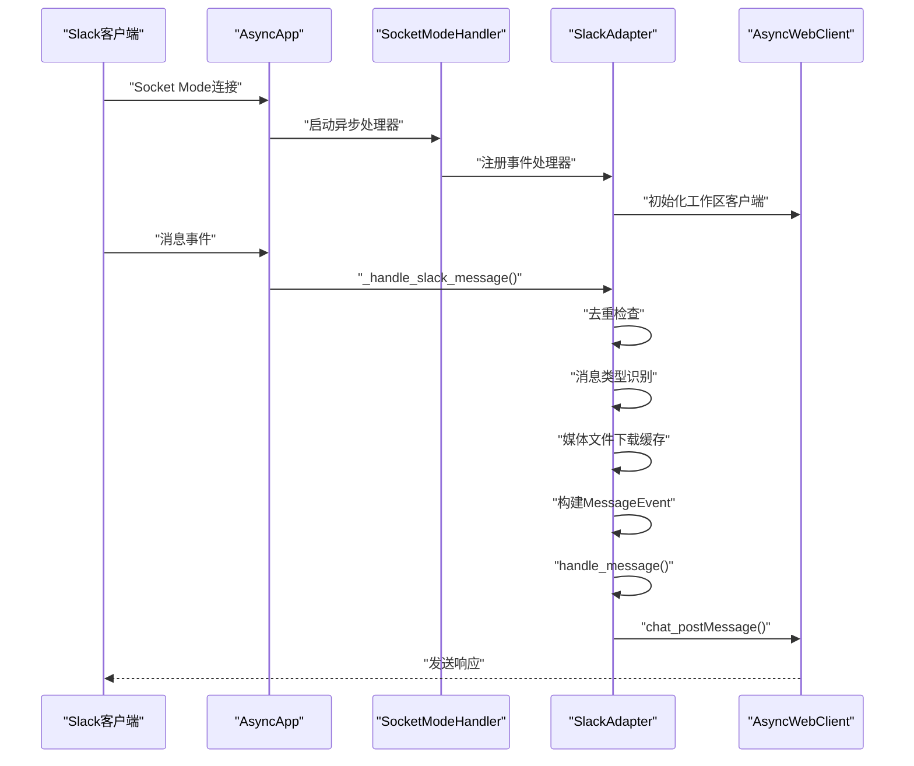
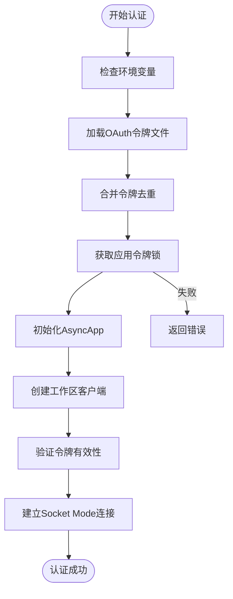
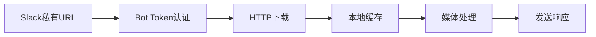
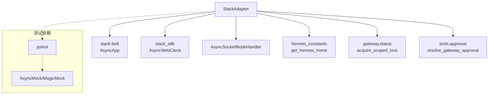

# Slack适配器

<cite>
**本文档引用的文件**
- [slack.py](file://gateway/platforms/slack.py)
- [test_slack.py](file://tests/gateway/test_slack.py)
- [test_slack_approval_buttons.py](file://tests/gateway/test_slack_approval_buttons.py)
- [base.py](file://gateway/platforms/base.py)
- [slack.md](file://website/docs/user-guide/messaging/slack.md)
- [setup.py](file://hermes_cli/setup.py)
- [run.py](file://gateway/run.py)
</cite>

## 目录
1. [简介](#简介)
2. [项目结构](#项目结构)
3. [核心组件](#核心组件)
4. [架构概览](#架构概览)
5. [详细组件分析](#详细组件分析)
6. [依赖关系分析](#依赖关系分析)
7. [性能考虑](#性能考虑)
8. [故障排除指南](#故障排除指南)
9. [结论](#结论)
10. [附录](#附录)

## 简介
本文件为Hermes Agent的Slack平台适配器提供详细的API参考文档。该适配器基于slack-bolt库，采用Socket Mode实现与Slack的双向通信，支持消息接收与发送、文件上传、线程回复、交互式按钮等高级功能。文档将深入解析OAuth认证流程、RTM API与Events API的使用方式、Slack特有消息格式（Rich Text Blocks、Block Kit组件）、媒体处理能力（文件上传、多文件支持、预览功能），并详细说明权限控制机制（Workspace权限、Channel权限、App权限管理）。同时，文档涵盖Slack的特殊功能（Thread回复、Message Buttons、Select Menus、Modals弹窗），提供配置选项说明（Bot Token设置、App Credentials配置、事件订阅），以及对Slack API复杂性的处理策略（事件过滤、重复消息处理、连接稳定性优化）。

## 项目结构
Slack适配器位于gateway/platforms目录下，核心实现文件为slack.py，配套测试位于tests/gateway目录中。基础平台适配器定义在base.py中，为所有平台提供统一接口。用户指南文档位于website/docs/user-guide/messaging/slack.md，提供了安装配置、权限设置、事件订阅等实用信息。



**图表来源**
- [slack.py:53-212](file://gateway/platforms/slack.py#L53-L212)
- [base.py:1-200](file://gateway/platforms/base.py#L1-L200)
- [test_slack.py:1-1201](file://tests/gateway/test_slack.py#L1-L1201)
- [test_slack_approval_buttons.py:1-427](file://tests/gateway/test_slack_approval_buttons.py#L1-L427)

**章节来源**
- [slack.py:1-1362](file://gateway/platforms/slack.py#L1-L1362)
- [base.py:1-200](file://gateway/platforms/base.py#L1-L200)
- [test_slack.py:1-1201](file://tests/gateway/test_slack.py#L1-L1201)
- [test_slack_approval_buttons.py:1-427](file://tests/gateway/test_slack_approval_buttons.py#L1-L427)

## 核心组件
Slack适配器的核心组件包括：
- 连接管理：通过Socket Mode建立持久连接，支持多工作区（multi-workspace）
- 消息处理：处理消息事件、应用提及、斜杠命令
- 媒体处理：图片、音频、视频、文档的上传与缓存
- 交互功能：Block Kit按钮、线程上下文获取
- 权限控制：基于用户ID的访问控制、工作区令牌管理
- 错误处理：去重机制、连接稳定性、异常恢复

关键特性：
- 支持DM和频道消息（频道内@机器人触发）
- 线程回复支持，自动识别机器人发起的线程
- 文件上传限制（20MB），支持多种媒体类型
- Block Kit交互式按钮（批准/拒绝执行命令）
- 多工作区令牌管理与动态客户端选择

**章节来源**
- [slack.py:53-212](file://gateway/platforms/slack.py#L53-L212)
- [slack.py:234-239](file://gateway/platforms/slack.py#L234-L239)
- [slack.py:387-409](file://gateway/platforms/slack.py#L387-L409)

## 架构概览
Slack适配器采用异步架构，基于slack-bolt的AsyncApp和AsyncSocketModeHandler实现Socket Mode连接。系统通过多工作区令牌映射到不同的AsyncWebClient实例，确保跨工作区的正确认证和响应。



**图表来源**
- [slack.py:99-212](file://gateway/platforms/slack.py#L99-L212)
- [slack.py:758-983](file://gateway/platforms/slack.py#L758-L983)

**章节来源**
- [slack.py:99-212](file://gateway/platforms/slack.py#L99-L212)
- [slack.py:758-983](file://gateway/platforms/slack.py#L758-L983)

## 详细组件分析

### OAuth认证流程
Slack适配器支持两种认证方式：
1. 环境变量认证：SLACK_BOT_TOKEN（xoxb-...）用于API调用，SLACK_APP_TOKEN（xapp-...）用于Socket Mode连接
2. OAuth令牌文件：~/.hermes/slack_tokens.json，支持多工作区令牌合并

认证流程：
- 首先从环境变量读取主令牌
- 检查OAuth令牌文件，合并额外工作区令牌
- 获取应用令牌的全局锁，防止重复使用
- 初始化AsyncApp和多个AsyncWebClient实例
- 通过auth.test验证每个令牌的有效性
- 建立Socket Mode连接



**图表来源**
- [slack.py:109-159](file://gateway/platforms/slack.py#L109-L159)
- [slack.py:136-145](file://gateway/platforms/slack.py#L136-L145)

**章节来源**
- [slack.py:109-159](file://gateway/platforms/slack.py#L109-L159)
- [slack.py:136-145](file://gateway/platforms/slack.py#L136-L145)
- [slack.md:381-419](file://website/docs/user-guide/messaging/slack.md#L381-L419)

### RTM API与Events API使用
适配器采用Socket Mode替代传统的RTM API，提供更稳定的连接：
- 使用AsyncSocketModeHandler处理实时事件
- 注册事件处理器：message、app_mention、slash command
- 自动去重机制防止重连后重复处理事件
- 支持多工作区事件路由

事件处理流程：
1. Socket Mode接收事件
2. 去重检查（event_ts缓存）
3. 忽略机器人消息和编辑/删除事件
4. 解析消息内容、用户信息、频道类型
5. 根据场景（DM/频道）决定是否处理
6. 下载媒体文件并缓存
7. 构建MessageEvent并交由上层处理

**章节来源**
- [slack.py:172-188](file://gateway/platforms/slack.py#L172-L188)
- [slack.py:758-983](file://gateway/platforms/slack.py#L758-L983)

### Rich Text Blocks与Block Kit组件
Slack适配器支持Block Kit交互式组件：

#### 执行批准按钮
使用Block Kit创建交互式按钮，支持四种操作：
- 允许一次（Allow Once）
- 允许会话（Allow Session）  
- 永久允许（Always Allow）
- 拒绝（Deny）

按钮结构：
```json
{
  "type": "actions",
  "elements": [
    {
      "type": "button",
      "action_id": "hermes_approve_once",
      "text": "允许一次",
      "style": "primary",
      "value": "session_key"
    }
  ]
}
```

#### 线程上下文获取
通过conversations_replies API获取线程历史：
- 限制消息数量（默认30条）
- 排除当前消息和机器人消息
- 剥离@机器人提及
- 格式化输出线程上下文

**章节来源**
- [slack.py:1003-1046](file://gateway/platforms/slack.py#L1003-L1046)
- [slack.py:1149-1209](file://gateway/platforms/slack.py#L1149-L1209)

### 媒体处理功能
Slack适配器提供完整的媒体处理能力：

#### 文件上传与缓存
支持多种媒体类型的上传：
- 图片：自动缓存到本地临时文件
- 音频：支持多种格式（.ogg, .mp3, .wav, .webm, .m4a）
- 视频：支持常见视频格式
- 文档：PDF、文本、压缩包等

上传限制：
- 单文件大小限制：20MB
- 自动扩展名检测和验证
- 支持初始评论（caption）

#### 媒体下载与缓存


**图表来源**
- [slack.py:1299-1332](file://gateway/platforms/slack.py#L1299-L1332)
- [slack.py:1334-1361](file://gateway/platforms/slack.py#L1334-L1361)

**章节来源**
- [slack.py:647-732](file://gateway/platforms/slack.py#L647-L732)
- [slack.py:868-950](file://gateway/platforms/slack.py#L868-L950)
- [slack.py:1299-1361](file://gateway/platforms/slack.py#L1299-L1361)

### 权限控制机制
Slack适配器实现多层次权限控制：

#### 用户访问控制
- SLACK_ALLOWED_USERS：允许的用户ID列表（逗号分隔）
- SLACK_ALLOW_ALL_USERS：允许所有用户（布尔值）
- 默认：未配置时仅允许已配对用户

#### 工作区令牌管理
- 多工作区支持：每个工作区独立令牌
- 动态客户端选择：根据频道ID查找对应工作区
- 主要机器人ID：向后兼容，使用第一个令牌的工作区

#### 通道权限
- 频道历史读取：channels:history、groups:history
- 应用提及读取：app_mentions:read
- 用户信息读取：users:read

**章节来源**
- [slack.py:78-81](file://gateway/platforms/slack.py#L78-L81)
- [slack.py:151-161](file://gateway/platforms/slack.py#L151-L161)
- [run.py:1677-1705](file://gateway/run.py#L1677-L1705)
- [setup.py:1991-2019](file://hermes_cli/setup.py#L1991-L2019)

### 特殊功能实现

#### 线程回复
Slack适配器智能处理线程回复：
- 机器人发起的线程：自动跟踪并响应后续消息
- @机器人提及的线程：首次提及后自动响应
- 会话状态：基于会话存储判断是否处理
- DM线程：顶层DM共享会话，回复线程独立

#### Message Buttons交互
Block Kit按钮实现：
- 四种操作类型：一次性、会话级、永久、拒绝
- 双击防护：防止重复点击
- 状态更新：按钮点击后更新消息状态
- 审批解析：调用resolve_gateway_approval解除阻塞

#### Select Menus与Modals弹窗
虽然代码中未直接实现，但适配器为后续扩展预留了：
- Block Kit组件支持
- 交互式元素处理框架
- 事件路由机制

**章节来源**
- [slack.py:812-846](file://gateway/platforms/slack.py#L812-L846)
- [slack.py:1066-1145](file://gateway/platforms/slack.py#L1066-L1145)

### 配置选项详解

#### 基础配置
- SLACK_BOT_TOKEN：机器人令牌（xoxb-...）
- SLACK_APP_TOKEN：应用令牌（xapp-...）
- SLACK_ALLOWED_USERS：允许的用户ID列表
- SLACK_ALLOW_ALL_USERS：允许所有用户

#### 平台特定配置
- reply_broadcast：线程回复广播选项
- reply_in_thread：是否启用线程回复（默认启用）

#### 事件订阅配置
- message.im：直接消息事件
- message.channels：公共频道消息事件
- message.groups：私有频道消息事件

**章节来源**
- [slack.py:262-264](file://gateway/platforms/slack.py#L262-L264)
- [slack.py:374-385](file://gateway/platforms/slack.py#L374-L385)
- [slack.md:42-87](file://website/docs/user-guide/messaging/slack.md#L42-L87)

### Slack API复杂性处理

#### 事件过滤
- 忽略机器人消息（bot_id、subtype: bot_message）
- 忽略消息编辑和删除事件
- 仅处理有效消息事件

#### 重复消息处理
去重机制：
- 缓存event_ts时间戳
- TTL（300秒）和最大容量（2000条）控制
- Socket Mode重连后的重复事件过滤

#### 连接稳定性优化
- 异常捕获和日志记录
- 资源清理（连接关闭、锁释放）
- 重试机制（文件下载3次重试）
- 内存限制（机器人消息TS集合上限5000）

**章节来源**
- [slack.py:760-781](file://gateway/platforms/slack.py#L760-L781)
- [slack.py:82-86](file://gateway/platforms/slack.py#L82-L86)
- [slack.py:1307-1331](file://gateway/platforms/slack.py#L1307-L1331)

## 依赖关系分析



**图表来源**
- [slack.py:19-28](file://gateway/platforms/slack.py#L19-L28)
- [slack.py:121-133](file://gateway/platforms/slack.py#L121-L133)
- [slack.py:136-145](file://gateway/platforms/slack.py#L136-L145)

**章节来源**
- [slack.py:19-28](file://gateway/platforms/slack.py#L19-L28)
- [slack.py:121-145](file://gateway/platforms/slack.py#L121-L145)

## 性能考虑
- 消息长度限制：MAX_MESSAGE_LENGTH=39000字符，避免接近40000字符限制
- 媒体缓存：本地缓存减少网络传输，支持定时清理
- 去重机制：防止重复处理提高系统效率
- 内存限制：机器人消息TS集合上限5000，避免内存泄漏
- 重试策略：文件下载3次重试，指数退避

## 故障排除指南

### 常见问题与解决方案
- Bot不响应DM：检查message.im事件订阅和重新安装应用
- Bot只在DM工作不在频道：添加message.channels和message.groups事件订阅
- @机器人无响应：确认channels:history作用域、重新安装应用
- 私有频道消息忽略：添加message.groups事件和groups:history作用域
- "发送消息被关闭"：启用App Home的消息标签
- "not_authed"或"invalid_auth"：重新生成Bot Token和App Token
- "missing_scope"：添加所需作用域并重新安装应用

### 调试建议
- 启用详细日志记录
- 检查令牌有效性（auth.test）
- 验证事件订阅完整性
- 确认工作区邀请状态

**章节来源**
- [slack.md:420-433](file://website/docs/user-guide/messaging/slack.md#L420-L433)

## 结论
Hermes Agent的Slack适配器提供了完整的企业级Slack集成方案，具备以下优势：
- 稳定的Socket Mode连接和完善的错误处理机制
- 丰富的媒体处理能力和灵活的权限控制
- 智能的线程管理和交互式用户体验
- 可扩展的Block Kit组件支持
- 多工作区支持和令牌管理

该适配器为Hermes Agent在Slack平台上的部署和使用提供了坚实的技术基础。

## 附录

### API参考摘要

#### 连接管理
- connect()：建立Socket Mode连接
- disconnect()：断开连接并清理资源
- check_slack_requirements()：检查依赖可用性

#### 消息发送
- send()：发送文本消息（支持长消息分割）
- edit_message()：编辑已发送消息
- send_image_file()：发送本地图片文件
- send_voice()：发送音频文件
- send_video()：发送视频文件
- send_document()：发送文档文件

#### 交互功能
- send_exec_approval()：发送执行批准按钮
- send_typing()：显示打字状态（assistant.threads.setStatus）

#### 辅助功能
- format_message()：Markdown到Slack mrkdwn转换
- truncate_message()：消息长度截断
- get_chat_info()：获取频道信息

**章节来源**
- [slack.py:99-232](file://gateway/platforms/slack.py#L99-L232)
- [slack.py:241-329](file://gateway/platforms/slack.py#L241-L329)
- [slack.py:560-732](file://gateway/platforms/slack.py#L560-L732)
- [slack.py:986-1064](file://gateway/platforms/slack.py#L986-L1064)
- [slack.py:331-358](file://gateway/platforms/slack.py#L331-L358)