# Telegram适配器

<cite>
**本文档引用的文件**
- [gateway/platforms/telegram.py](file://gateway/platforms/telegram.py)
- [gateway/platforms/telegram_network.py](file://gateway/platforms/telegram_network.py)
- [gateway/platforms/base.py](file://gateway/platforms/base.py)
- [website/docs/user-guide/messaging/telegram.md](file://website/docs/user-guide/messaging/telegram.md)
- [tests/gateway/test_telegram_format.py](file://tests/gateway/test_telegram_format.py)
- [tests/gateway/test_telegram_documents.py](file://tests/gateway/test_telegram_documents.py)
- [tests/gateway/test_telegram_conflict.py](file://tests/gateway/test_telegram_conflict.py)
</cite>

## 目录
1. [简介](#简介)
2. [项目结构](#项目结构)
3. [核心组件](#核心组件)
4. [架构概览](#架构概览)
5. [详细组件分析](#详细组件分析)
6. [依赖关系分析](#依赖关系分析)
7. [性能考虑](#性能考虑)
8. [故障排除指南](#故障排除指南)
9. [结论](#结论)

## 简介

Hermes Agent的Telegram适配器是一个完整的Telegram平台集成解决方案，基于python-telegram-bot库构建。该适配器提供了从基本消息收发到高级功能的全面支持，包括：

- **Bot API集成**：完整的Telegram Bot API支持，包括长轮询和Webhook两种连接模式
- **消息格式处理**：强大的MarkdownV2格式转换和特殊字符转义机制
- **媒体处理**：支持图片、视频、音频、文档等多媒体内容的上传和下载
- **权限控制**：用户授权、群组管理员权限和频道订阅管理
- **特殊功能**：Inline键盘、按钮交互、地理位置分享、联系人信息处理
- **网络优化**：智能DNS发现和IP回退机制，确保在受限网络环境下的稳定连接

## 项目结构

Telegram适配器位于gateway模块的platforms子目录中，采用模块化设计：

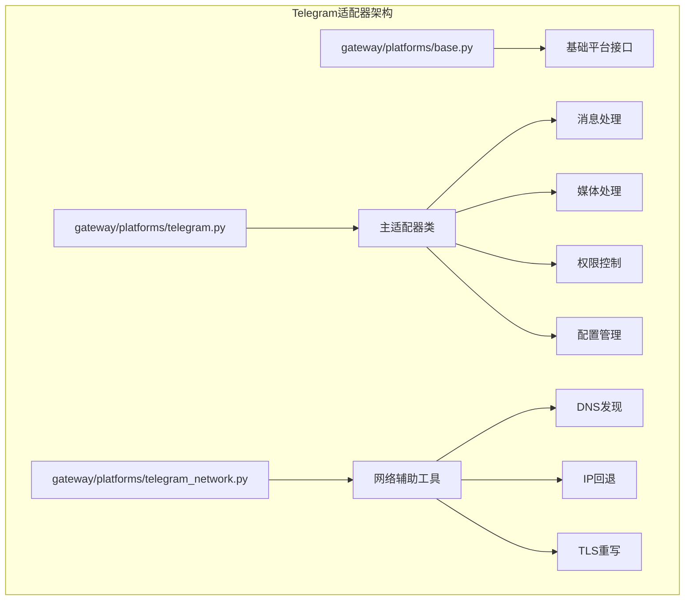

**图表来源**
- [gateway/platforms/telegram.py:1-100](file://gateway/platforms/telegram.py#L1-L100)
- [gateway/platforms/telegram_network.py:1-50](file://gateway/platforms/telegram_network.py#L1-L50)

**章节来源**
- [gateway/platforms/telegram.py:1-100](file://gateway/platforms/telegram.py#L1-L100)
- [gateway/platforms/telegram_network.py:1-50](file://gateway/platforms/telegram_network.py#L1-L50)

## 核心组件

### 主要类结构

Telegram适配器的核心是TelegramAdapter类，继承自BasePlatformAdapter基类：

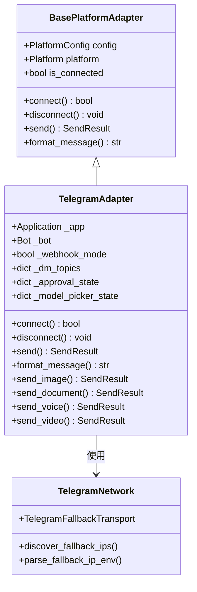

**图表来源**
- [gateway/platforms/telegram.py:111-160](file://gateway/platforms/telegram.py#L111-L160)
- [gateway/platforms/base.py:470-632](file://gateway/platforms/base.py#L470-L632)

### 关键配置参数

| 配置项 | 类型 | 默认值 | 描述 |
|--------|------|--------|------|
| `TELEGRAM_BOT_TOKEN` | 字符串 | 无 | Telegram Bot API令牌 |
| `TELEGRAM_WEBHOOK_URL` | 字符串 | 无 | Webhook模式的公网URL |
| `TELEGRAM_WEBHOOK_PORT` | 整数 | 8443 | Webhook服务器监听端口 |
| `TELEGRAM_WEBHOOK_SECRET` | 字符串 | 无 | Webhook更新验证密钥 |
| `TELEGRAM_ALLOWED_USERS` | 列表 | 无 | 允许访问的用户ID列表 |
| `TELEGRAM_REQUIRE_MENTION` | 布尔 | false | 是否要求@提及才能响应 |
| `TELEGRAM_REACTIONS` | 布尔 | false | 是否启用消息反应功能 |

**章节来源**
- [gateway/platforms/telegram.py:126-158](file://gateway/platforms/telegram.py#L126-L158)
- [website/docs/user-guide/messaging/telegram.md:128-144](file://website/docs/user-guide/messaging/telegram.md#L128-L144)

## 架构概览

### 连接模式架构

Telegram适配器支持两种主要连接模式：

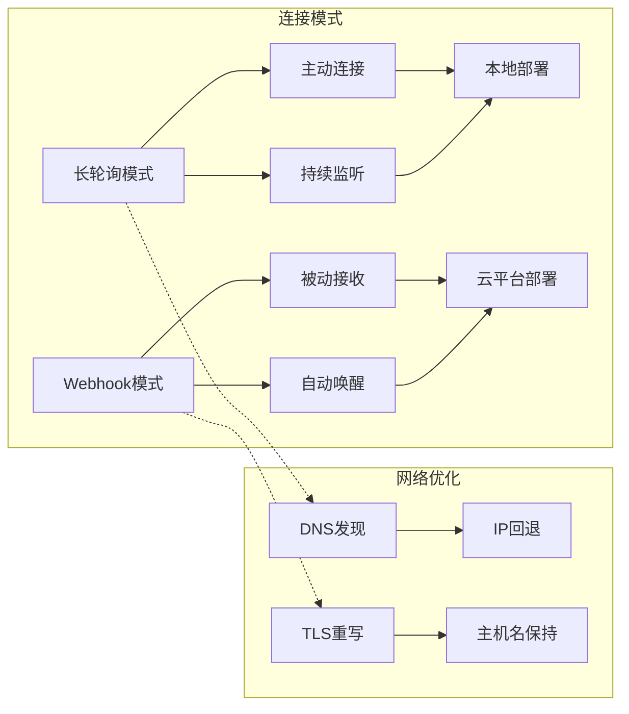

**图表来源**
- [gateway/platforms/telegram.py:470-690](file://gateway/platforms/telegram.py#L470-L690)
- [gateway/platforms/telegram_network.py:55-122](file://gateway/platforms/telegram_network.py#L55-L122)

### 消息处理流程

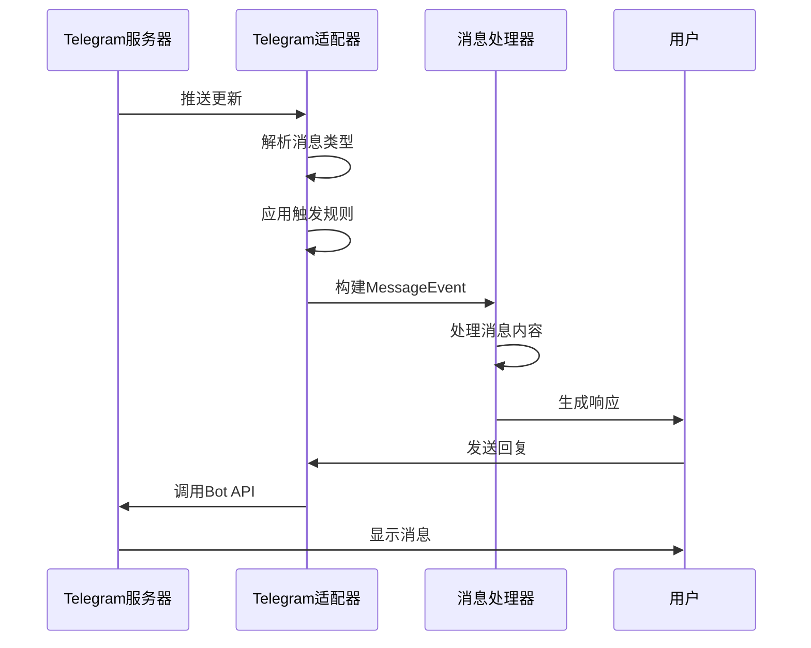

**图表来源**
- [gateway/platforms/telegram.py:2068-2130](file://gateway/platforms/telegram.py#L2068-L2130)
- [gateway/platforms/base.py:380-434](file://gateway/platforms/base.py#L380-L434)

**章节来源**
- [gateway/platforms/telegram.py:470-690](file://gateway/platforms/telegram.py#L470-L690)
- [gateway/platforms/telegram_network.py:187-228](file://gateway/platforms/telegram_network.py#L187-L228)

## 详细组件分析

### 消息格式处理系统

#### MarkdownV2转换引擎

Telegram适配器实现了完整的MarkdownV2格式转换系统：

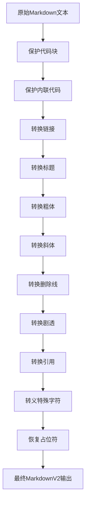

**图表来源**
- [gateway/platforms/telegram.py:1769-1924](file://gateway/platforms/telegram.py#L1769-L1924)

#### 特殊字符转义机制

系统使用正则表达式进行精确的特殊字符转义：

| 特殊字符 | 转义序列 | 用途 |
|----------|----------|------|
| `_` | `\_` | 斜体标记 |
| `*` | `\*` | 粗体标记 |
| `[` | `\[` | 链接开始 |
| `]` | `\]` | 链接结束 |
| `(` | `\(` | URL开始 |
| `)` | `\)` | URL结束 |
| `~` | `\~` | 删除线标记 |
| `|` | `\|` | 剧透标记 |
| `{` | `\{` | 占位符开始 |
| `}` | `\}` | 占位符结束 |
| `.` | `\.` | 小数点 |

**章节来源**
- [gateway/platforms/telegram.py:81-108](file://gateway/platforms/telegram.py#L81-L108)
- [gateway/platforms/telegram.py:1769-1924](file://gateway/platforms/telegram.py#L1769-L1924)

### 媒体处理系统

#### 图片处理流程

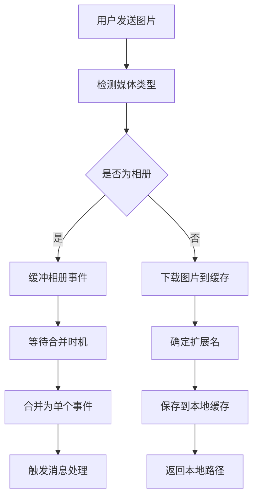

**图表来源**
- [gateway/platforms/telegram.py:2238-2403](file://gateway/platforms/telegram.py#L2238-L2403)

#### 支持的媒体类型

| 媒体类型 | 文件大小限制 | 处理方式 |
|----------|-------------|----------|
| 图片 | 10MB | URL直传或文件上传 |
| 视频 | 50MB | 文件上传 |
| 音频 | 50MB | 文件上传 |
| 语音消息 | 50MB | 自动转码为Ogg |
| 文档 | 20MB | 文件上传 |
| 动画 | 50MB | 文件上传 |

**章节来源**
- [gateway/platforms/telegram.py:1620-1714](file://gateway/platforms/telegram.py#L1620-L1714)
- [gateway/platforms/telegram.py:2275-2396](file://gateway/platforms/telegram.py#L2275-L2396)

### 权限控制系统

#### 用户授权机制

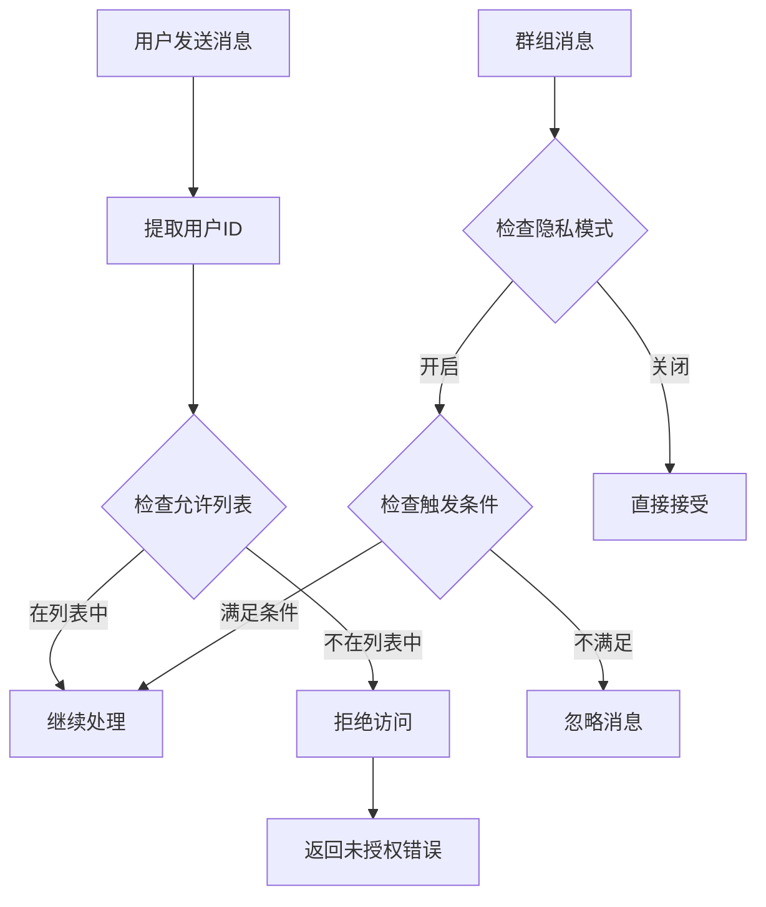

**图表来源**
- [gateway/platforms/telegram.py:2043-2067](file://gateway/platforms/telegram.py#L2043-L2067)

#### 群组权限管理

| 权限级别 | 访问范围 | 触发条件 |
|----------|----------|----------|
| 私聊 | 仅限个人 | 无限制 |
| 公开群组 | 所有消息 | 需要@提及或命令 |
| 私有群组 | 所有消息 | 需要@提及或命令 |
| 频道 | 所有消息 | 需要@提及或命令 |
| 管理员 | 所有消息 | 无需@提及 |

**章节来源**
- [gateway/platforms/telegram.py:1928-2067](file://gateway/platforms/telegram.py#L1928-L2067)
- [website/docs/user-guide/messaging/telegram.md:51-76](file://website/docs/user-guide/messaging/telegram.md#L51-L76)

### 特殊功能实现

#### Inline键盘交互

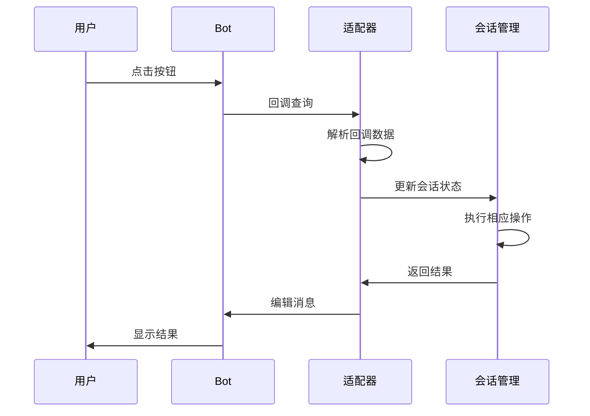

**图表来源**
- [gateway/platforms/telegram.py:1374-1467](file://gateway/platforms/telegram.py#L1374-L1467)

#### 交互式模型选择器

系统提供完整的交互式模型选择界面：

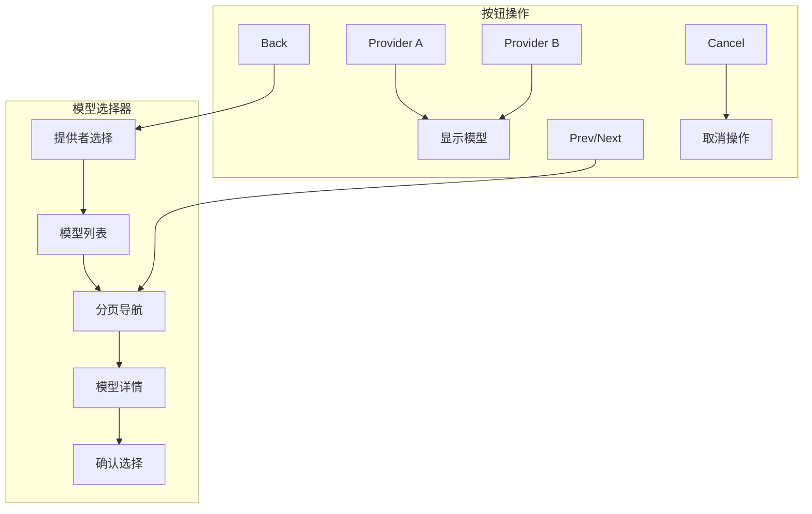

**图表来源**
- [gateway/platforms/telegram.py:1079-1150](file://gateway/platforms/telegram.py#L1079-L1150)
- [gateway/platforms/telegram.py:1152-1193](file://gateway/platforms/telegram.py#L1152-L1193)

**章节来源**
- [gateway/platforms/telegram.py:984-1077](file://gateway/platforms/telegram.py#L984-L1077)
- [gateway/platforms/telegram.py:1079-1373](file://gateway/platforms/telegram.py#L1079-L1373)

### 网络优化机制

#### DNS发现和IP回退

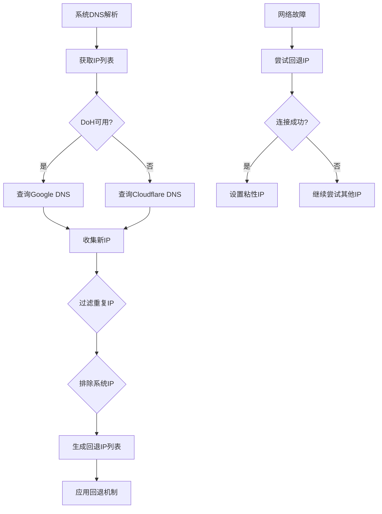

**图表来源**
- [gateway/platforms/telegram_network.py:187-228](file://gateway/platforms/telegram_network.py#L187-L228)
- [gateway/platforms/telegram_network.py:55-122](file://gateway/platforms/telegram_network.py#L55-L122)

**章节来源**
- [gateway/platforms/telegram_network.py:1-249](file://gateway/platforms/telegram_network.py#L1-L249)

## 依赖关系分析

### 外部依赖

Telegram适配器的主要外部依赖：

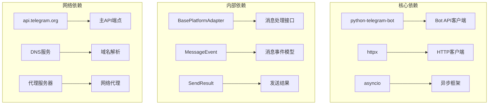

**图表来源**
- [gateway/platforms/telegram.py:19-53](file://gateway/platforms/telegram.py#L19-L53)
- [gateway/platforms/telegram_network.py:19-21](file://gateway/platforms/telegram_network.py#L19-L21)

### 内部模块依赖

| 模块 | 依赖模块 | 用途 |
|------|----------|------|
| telegram.py | base.py | 继承基础平台接口 |
| telegram.py | telegram_network.py | 网络优化功能 |
| base.py | config.py | 平台配置管理 |
| base.py | session.py | 会话状态管理 |
| telegram_network.py | httpx | HTTP客户端库 |

**章节来源**
- [gateway/platforms/telegram.py:58-73](file://gateway/platforms/telegram.py#L58-L73)
- [gateway/platforms/base.py:28-31](file://gateway/platforms/base.py#L28-L31)

## 性能考虑

### 连接优化策略

1. **智能重连机制**：网络中断后自动重试，支持指数退避策略
2. **连接池管理**：复用HTTP连接，减少建立连接的开销
3. **批量处理**：对快速连续的消息进行聚合处理，减少API调用次数

### 内存管理

1. **缓存策略**：图片、音频、文档采用本地缓存，避免重复下载
2. **任务调度**：使用异步任务处理媒体下载，不阻塞主线程
3. **资源清理**：定期清理过期的缓存文件

### 网络性能

1. **DNS优化**：自动发现可用的API端点IP
2. **TLS优化**：保持正确的SNI和主机名信息
3. **代理支持**：透明支持HTTP/HTTPS代理

## 故障排除指南

### 常见问题及解决方案

#### 连接问题

| 问题 | 可能原因 | 解决方案 |
|------|----------|----------|
| 无法连接到Telegram | 网络受限或DNS不可用 | 检查防火墙设置，配置TELEGRAM_FALLBACK_IPS |
| 409冲突错误 | 同时运行多个相同令牌的实例 | 停止其他实例，确保唯一性 |
| TLS证书错误 | Webhook端点证书无效 | 使用有效的SSL证书或反向代理 |
| 超时错误 | 网络延迟过高 | 检查网络质量，调整超时参数 |

#### 消息处理问题

| 问题 | 可能原因 | 解决方案 |
|------|----------|----------|
| 消息格式异常 | MarkdownV2转换错误 | 检查特殊字符转义，简化格式 |
| 媒体上传失败 | 文件过大或格式不支持 | 检查文件大小和类型限制 |
| 响应延迟高 | API调用过多 | 优化消息聚合策略 |
| 权限不足 | 用户未授权或隐私模式 | 检查ALLOWED_USERS配置 |

#### Webhook问题

| 问题 | 可能原因 | 解决方案 |
|------|----------|----------|
| Webhook不工作 | URL不可达或证书无效 | 使用curl测试URL，检查SSL配置 |
| 更新丢失 | 端口转发配置错误 | 确认平台端口映射正确 |
| 验证失败 | 密钥不匹配 | 检查TELEGRAM_WEBHOOK_SECRET配置 |

**章节来源**
- [website/docs/user-guide/messaging/telegram.md:495-524](file://website/docs/user-guide/messaging/telegram.md#L495-L524)
- [tests/gateway/test_telegram_conflict.py:49-302](file://tests/gateway/test_telegram_conflict.py#L49-L302)

### 调试技巧

1. **启用详细日志**：设置日志级别为DEBUG，观察连接和消息处理过程
2. **监控API限制**：关注速率限制和配额使用情况
3. **测试环境隔离**：使用测试令牌和沙盒环境进行功能验证
4. **性能基准测试**：测量不同场景下的响应时间和吞吐量

## 结论

Hermes Agent的Telegram适配器是一个功能完整、设计精良的平台集成解决方案。它不仅提供了基础的消息收发功能，还包含了丰富的高级特性：

- **可靠性**：通过多种连接模式和网络优化机制确保稳定运行
- **功能性**：支持完整的Telegram Bot API功能，包括最新的API特性
- **可扩展性**：模块化的架构设计便于功能扩展和维护
- **安全性**：完善的权限控制和安全措施保护用户数据

该适配器为Hermes Agent提供了强大的Telegram平台支持，能够满足从个人使用到企业级部署的各种需求。通过合理的配置和优化，可以实现高性能、高可靠性的Telegram机器人服务。