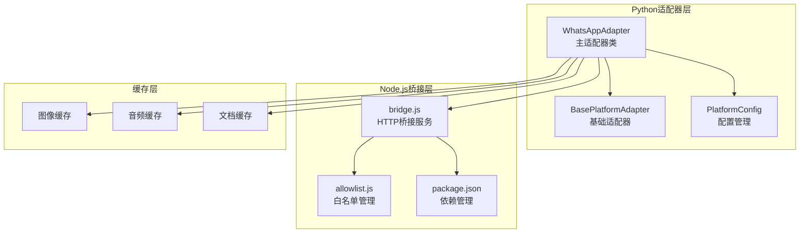
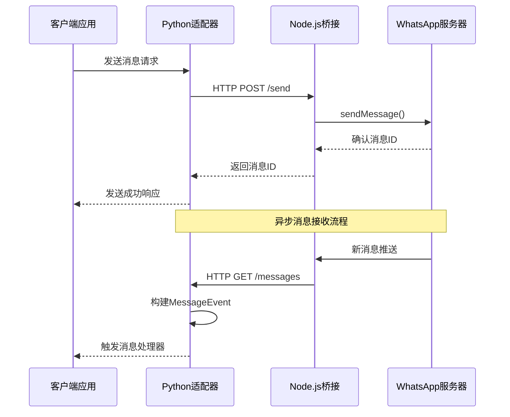
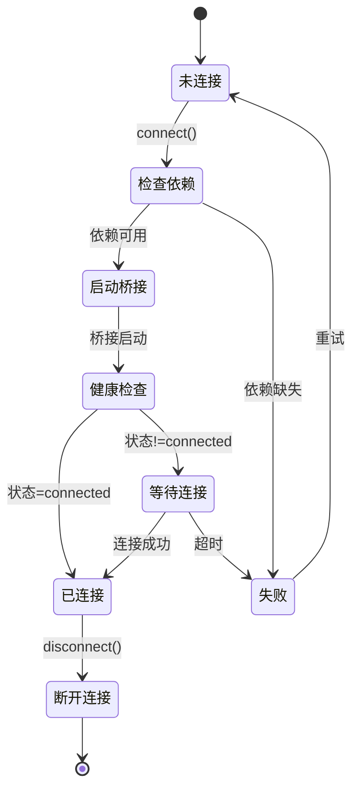
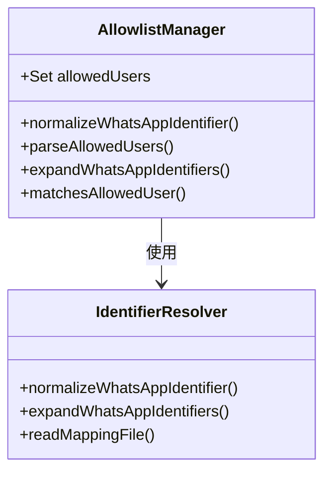

# WhatsApp适配器

<cite>
**本文档引用的文件**
- [gateway/platforms/whatsapp.py](file://gateway/platforms/whatsapp.py)
- [scripts/whatsapp-bridge/bridge.js](file://scripts/whatsapp-bridge/bridge.js)
- [scripts/whatsapp-bridge/package.json](file://scripts/whatsapp-bridge/package.json)
- [scripts/whatsapp-bridge/allowlist.js](file://scripts/whatsapp-bridge/allowlist.js)
- [gateway/platforms/base.py](file://gateway/platforms/base.py)
- [gateway/config.py](file://gateway/config.py)
- [tests/gateway/test_whatsapp_connect.py](file://tests/gateway/test_whatsapp_connect.py)
- [tests/gateway/test_whatsapp_group_gating.py](file://tests/gateway/test_whatsapp_group_gating.py)
- [hermes_cli/main.py](file://hermes_cli/main.py)
</cite>

## 目录
1. [简介](#简介)
2. [项目结构](#项目结构)
3. [核心组件](#核心组件)
4. [架构概览](#架构概览)
5. [详细组件分析](#详细组件分析)
6. [依赖关系分析](#依赖关系分析)
7. [性能考虑](#性能考虑)
8. [故障排除指南](#故障排除指南)
9. [结论](#结论)
10. [附录](#附录)

## 简介

Hermes Agent的WhatsApp平台适配器是一个完整的消息传递解决方案，支持多种WhatsApp集成模式。该适配器采用桥接架构设计，通过Node.js进程与WhatsApp Web客户端通信，实现了企业级的消息路由、媒体处理和权限控制功能。

该适配器支持两种主要运行模式：
- **企业模式（Bot模式）**：使用独立的企业号码作为机器人账号，适用于商业部署
- **个人模式（Self-chat模式）**：使用用户自己的号码进行自对话，便于个人使用

## 项目结构

WhatsApp适配器的项目结构采用模块化设计，主要包含以下关键组件：



**图表来源**
- [gateway/platforms/whatsapp.py:103-150](file://gateway/platforms/whatsapp.py#L103-L150)
- [scripts/whatsapp-bridge/bridge.js:1-50](file://scripts/whatsapp-bridge/bridge.js#L1-50)

**章节来源**
- [gateway/platforms/whatsapp.py:1-168](file://gateway/platforms/whatsapp.py#L1-L168)
- [scripts/whatsapp-bridge/bridge.js:1-50](file://scripts/whatsapp-bridge/bridge.js#L1-L50)

## 核心组件

### WhatsAppAdapter主类

WhatsAppAdapter是适配器的核心类，继承自BasePlatformAdapter，负责处理所有WhatsApp相关的操作。该类实现了完整的连接管理、消息路由和媒体处理功能。

**主要特性：**
- 多后端支持：支持Business API、whatsapp-web.js和Baileys三种不同的后端实现
- 桥接模式：通过HTTP接口与Node.js桥接进程通信
- 会话管理：支持独立的会话存储和锁机制
- 媒体处理：内置图像、音频、视频和文档的缓存机制

### Node.js桥接服务

bridge.js是一个独立的Node.js进程，负责与WhatsApp Web客户端直接通信。它提供了RESTful API接口供Python适配器调用。

**核心功能：**
- WebSocket连接管理
- 消息接收和发送
- 媒体文件下载和上传
- 用户身份验证和会话持久化

### 白名单管理系统

allowlist.js提供了WhatsApp用户的访问控制功能，支持基于电话号码的用户授权管理。

**功能特性：**
- 支持多种标识符格式（电话号码、LID等）
- 自动解析用户映射关系
- 动态用户权限验证

**章节来源**
- [gateway/platforms/whatsapp.py:103-150](file://gateway/platforms/whatsapp.py#L103-L150)
- [scripts/whatsapp-bridge/bridge.js:1-50](file://scripts/whatsapp-bridge/bridge.js#L1-L50)
- [scripts/whatsapp-bridge/allowlist.js:1-85](file://scripts/whatsapp-bridge/allowlist.js#L1-L85)

## 架构概览

WhatsApp适配器采用分层架构设计，确保了良好的可维护性和扩展性：



**图表来源**
- [gateway/platforms/whatsapp.py:562-603](file://gateway/platforms/whatsapp.py#L562-L603)
- [scripts/whatsapp-bridge/bridge.js:373-419](file://scripts/whatsapp-bridge/bridge.js#L373-L419)

### 连接生命周期管理



**图表来源**
- [gateway/platforms/whatsapp.py:274-480](file://gateway/platforms/whatsapp.py#L274-L480)
- [scripts/whatsapp-bridge/bridge.js:542-549](file://scripts/whatsapp-bridge/bridge.js#L542-L549)

**章节来源**
- [gateway/platforms/whatsapp.py:274-480](file://gateway/platforms/whatsapp.py#L274-L480)
- [scripts/whatsapp-bridge/bridge.js:542-571](file://scripts/whatsapp-bridge/bridge.js#L542-L571)

## 详细组件分析

### 认证流程

WhatsApp适配器支持多种认证方式，具体取决于所选的运行模式：

#### 企业模式认证
在企业模式下，适配器使用独立的企业号码作为机器人账号。认证过程包括：

1. **会话锁机制**：防止多个实例同时使用同一个会话
2. **凭据存储**：使用多文件认证状态系统
3. **自动重连**：网络中断后的智能重连机制

#### 个人模式认证
个人模式使用用户自己的号码进行自对话，认证过程更加简化：

1. **QR码扫描**：首次连接时生成QR码供用户扫描
2. **本地会话**：凭据存储在本地文件中
3. **无服务器依赖**：不需要额外的服务器配置

### 消息路由和处理

消息处理流程经过精心设计，确保高效和可靠的消息传递：

```mermaid
flowchart TD
Start([收到消息]) --> CheckGroup{是否群组消息?}
CheckGroup --> |是| CheckMention{是否@提及?}
CheckGroup --> |否| ProcessDM[处理私聊消息]
CheckMention --> |是| ProcessGroup[处理群组消息]
CheckMention --> |否| CheckFree{是否免提消息?}
CheckFree --> |是| ProcessGroup
CheckFree --> |否| Ignore[忽略消息]
ProcessGroup --> BuildEvent[构建MessageEvent]
ProcessDM --> BuildEvent
BuildEvent --> CacheMedia[缓存媒体文件]
CacheMedia --> InjectText[注入文本内容]
InjectText --> SendToAgent[发送到代理]
SendToAgent --> End([完成])
Ignore --> End
```

**图表来源**
- [gateway/platforms/whatsapp.py:257-273](file://gateway/platforms/whatsapp.py#L257-L273)
- [gateway/platforms/whatsapp.py:813-941](file://gateway/platforms/whatsapp.py#L813-L941)

#### 媒体处理机制

WhatsApp适配器提供了强大的媒体处理能力，支持多种媒体类型的自动缓存和转换：

**图像处理：**
- 支持JPG、PNG、WEBP、GIF格式
- 自动下载并缓存到本地目录
- 统一的文件命名和扩展名处理

**音频处理：**
- 支持OGG、MP3、M4A等格式
- 语音备忘录（PTT）的专门处理
- 自动转码和格式标准化

**文档处理：**
- 支持PDF、TXT、DOCX、XLSX等多种格式
- 文本可读文档的内容注入
- 文件大小限制和安全检查

**章节来源**
- [gateway/platforms/whatsapp.py:813-941](file://gateway/platforms/whatsapp.py#L813-L941)
- [gateway/platforms/base.py:85-365](file://gateway/platforms/base.py#L85-L365)

### 权限控制和安全

WhatsApp适配器实现了多层次的安全控制机制：

#### 用户白名单系统
通过allowlist.js实现基于电话号码的用户授权管理：



**图表来源**
- [scripts/whatsapp-bridge/allowlist.js:12-85](file://scripts/whatsapp-bridge/allowlist.js#L12-L85)

#### 消息过滤机制
适配器实现了智能的消息过滤系统，支持：

- **群组消息控制**：可配置的@提及要求
- **自定义唤醒词**：支持正则表达式的自定义触发词
- **免提聊天列表**：允许特定群组免@直接回复
- **空闲响应控制**：可配置的自由响应聊天

**章节来源**
- [scripts/whatsapp-bridge/allowlist.js:1-85](file://scripts/whatsapp-bridge/allowlist.js#L1-L85)
- [gateway/platforms/whatsapp.py:257-273](file://gateway/platforms/whatsapp.py#L257-L273)

### 配置选项详解

WhatsApp适配器提供了丰富的配置选项，支持灵活的部署需求：

#### 基础配置参数

| 参数名称 | 类型 | 默认值 | 描述 |
|---------|------|--------|------|
| bridge_port | 整数 | 3000 | 桥接服务监听端口 |
| bridge_script | 字符串 | 自动检测 | Node.js桥接脚本路径 |
| session_path | 字符串 | ~/.hermes/whatsapp/session | 会话数据存储路径 |
| reply_prefix | 字符串 | "⚕ *Hermes Agent*\n────────────\n" | 回复前缀格式 |

#### 高级配置参数

| 参数名称 | 类型 | 默认值 | 描述 |
|---------|------|--------|------|
| require_mention | 布尔值 | false | 群组消息是否需要@提及 |
| mention_patterns | 列表 | [] | 自定义唤醒词正则表达式 |
| free_response_chats | 列表 | [] | 免@提及的群组ID列表 |
| unauthorized_dm_behavior | 字符串 | "block" | 未授权用户的DM行为策略 |

**章节来源**
- [gateway/platforms/whatsapp.py:129-150](file://gateway/platforms/whatsapp.py#L129-L150)
- [gateway/config.py:588-598](file://gateway/config.py#L588-L598)

## 依赖关系分析

WhatsApp适配器的依赖关系清晰明确，遵循了模块化设计原则：

```mermaid
graph TB
subgraph "外部依赖"
NodeJS[Node.js Runtime]
Baileys[@whiskeysockets/baileys]
Express[Express.js]
Pino[Pino Logger]
QRCode[qrcode-terminal]
end
subgraph "内部依赖"
BaseAdapter[BasePlatformAdapter]
ConfigManager[PlatformConfig]
CacheManager[缓存管理器]
HTTPClient[aiohttp]
end
subgraph "核心适配器"
WAAdapter[WhatsAppAdapter]
BridgeService[Bridge Service]
MessageProcessor[消息处理器]
end
WAAdapter --> BridgeService
WAAdapter --> BaseAdapter
WAAdapter --> ConfigManager
WAAdapter --> CacheManager
WAAdapter --> HTTPClient
BridgeService --> NodeJS
BridgeService --> Baileys
BridgeService --> Express
BridgeService --> Pino
BridgeService --> QRCode
```

**图表来源**
- [scripts/whatsapp-bridge/package.json:10-15](file://scripts/whatsapp-bridge/package.json#L10-L15)
- [gateway/platforms/whatsapp.py:72-81](file://gateway/platforms/whatsapp.py#L72-L81)

### 第三方库依赖

**Node.js依赖：**
- @whiskeysockets/baileys: WhatsApp Web客户端库
- express: HTTP服务器框架
- pino: 结构化日志记录
- qrcode-terminal: 终端二维码生成

**Python依赖：**
- aiohttp: 异步HTTP客户端
- asyncio: 异步任务管理
- pathlib: 路径操作工具

**章节来源**
- [scripts/whatsapp-bridge/package.json:10-15](file://scripts/whatsapp-bridge/package.json#L10-L15)
- [gateway/platforms/whatsapp.py:18-32](file://gateway/platforms/whatsapp.py#L18-L32)

## 性能考虑

WhatsApp适配器在设计时充分考虑了性能优化，采用了多种策略来确保高效的运行表现：

### 缓存策略
- **媒体文件缓存**：所有接收到的媒体文件都会被下载到本地缓存，避免URL过期问题
- **图像缓存**：支持JPG、PNG等格式的自动缓存和清理
- **音频缓存**：语音消息的本地缓存支持快速访问
- **文档缓存**：文本可读文档的内容注入和缓存

### 连接管理
- **持久HTTP会话**：减少连接建立的开销
- **智能重连机制**：网络中断后的自动恢复
- **进程生命周期管理**：桥接进程的优雅启动和关闭

### 内存优化
- **消息队列限制**：最大100条消息的队列容量
- **媒体文件大小限制**：100KB的文本注入限制
- **会话锁机制**：防止重复实例占用资源

## 故障排除指南

### 常见问题和解决方案

#### 连接问题
**问题**：WhatsApp无法连接
**可能原因**：
- Node.js环境未正确安装
- 桥接进程启动失败
- 网络连接不稳定

**解决步骤**：
1. 检查Node.js版本和依赖安装
2. 查看桥接日志文件获取详细错误信息
3. 验证网络连接和防火墙设置

#### 媒体处理问题
**问题**：媒体文件无法正常显示或下载
**可能原因**：
- 缓存目录权限问题
- 网络URL过期
- 文件格式不支持

**解决步骤**：
1. 检查缓存目录的读写权限
2. 清理过期的缓存文件
3. 验证文件格式的兼容性

#### 认证问题
**问题**：QR码扫描后仍然无法登录
**可能原因**：
- 会话文件损坏
- 网络连接问题
- 账号被限制

**解决步骤**：
1. 删除会话目录重新开始
2. 检查网络连接稳定性
3. 尝试使用不同的网络环境

**章节来源**
- [tests/gateway/test_whatsapp_connect.py:152-184](file://tests/gateway/test_whatsapp_connect.py#L152-L184)
- [tests/gateway/test_whatsapp_connect.py:190-332](file://tests/gateway/test_whatsapp_connect.py#L190-L332)

### 调试和监控

适配器提供了完善的调试和监控功能：

**调试模式**：
- 启用WHATSAPP_DEBUG环境变量
- 详细的日志输出和事件跟踪
- 实时消息内容监控

**健康检查**：
- 桥接服务的健康状态监控
- 连接状态的实时更新
- 错误计数和重试统计

## 结论

Hermes Agent的WhatsApp平台适配器是一个功能完整、设计精良的消息传递解决方案。它成功地解决了WhatsApp集成的各种挑战，包括复杂的认证流程、多样化的消息格式支持和严格的权限控制。

**主要优势：**
- **灵活性**：支持多种运行模式和后端实现
- **可靠性**：完善的错误处理和恢复机制
- **安全性**：多层次的用户认证和权限控制
- **可扩展性**：模块化设计便于功能扩展

**技术特点：**
- 采用桥接架构设计，分离关注点
- 内置智能缓存和媒体处理机制
- 提供丰富的配置选项和环境变量支持
- 完善的测试覆盖和故障排除工具

该适配器为Hermes Agent提供了稳定可靠的WhatsApp集成能力，满足了从个人使用到企业部署的各种需求。

## 附录

### API参考

#### 主要方法

| 方法名 | 参数 | 返回值 | 描述 |
|-------|------|--------|------|
| connect | 无 | bool | 建立WhatsApp连接 |
| disconnect | 无 | None | 断开WhatsApp连接 |
| send | chat_id, content, reply_to, metadata | SendResult | 发送文本消息 |
| send_image | chat_id, image_url, caption, reply_to | SendResult | 发送图片消息 |
| send_video | chat_id, video_path, caption, reply_to | SendResult | 发送视频消息 |
| send_document | chat_id, file_path, caption, file_name, reply_to | SendResult | 发送文档消息 |
| send_typing | chat_id, metadata | None | 发送正在输入指示器 |
| get_chat_info | chat_id | Dict | 获取聊天信息 |

#### 配置参数

| 参数名 | 类型 | 必需 | 默认值 | 描述 |
|-------|------|------|--------|------|
| bridge_port | int | 否 | 3000 | 桥接服务端口 |
| bridge_script | str | 否 | 自动检测 | 桥接脚本路径 |
| session_path | str | 否 | ~/.hermes/whatsapp/session | 会话存储路径 |
| reply_prefix | str | 否 | "⚕ *Hermes Agent*\n────────────\n" | 回复前缀 |
| require_mention | bool | 否 | false | 群组@提及要求 |
| mention_patterns | list | 否 | [] | 自定义唤醒词 |
| free_response_chats | list | 否 | [] | 免@提及群组 |

### 最佳实践

1. **环境准备**：确保Node.js环境正确安装和配置
2. **权限设置**：为缓存目录设置适当的读写权限
3. **网络配置**：确保防火墙允许必要的端口通信
4. **监控设置**：启用日志记录和健康检查
5. **安全考虑**：合理配置用户白名单和访问控制