# 其他平台适配器

<cite>
**本文档引用的文件**
- [feishu.py](file://gateway/platforms/feishu.py)
- [dingtalk.py](file://gateway/platforms/dingtalk.py)
- [telegram_network.py](file://gateway/platforms/telegram_network.py)
- [webhook.py](file://gateway/platforms/webhook.py)
- [signal.py](file://gateway/platforms/signal.py)
- [matrix.py](file://gateway/platforms/matrix.py)
- [mattermost.py](file://gateway/platforms/mattermost.py)
- [homeassistant.py](file://gateway/platforms/homeassistant.py)
- [wecom.py](file://gateway/platforms/wecom.py)
- [sms.py](file://gateway/platforms/sms.py)
</cite>

## 目录
1. [简介](#简介)
2. [项目结构](#项目结构)
3. [核心组件](#核心组件)
4. [架构总览](#架构总览)
5. [详细组件分析](#详细组件分析)
6. [依赖分析](#依赖分析)
7. [性能考虑](#性能考虑)
8. [故障排除指南](#故障排除指南)
9. [结论](#结论)
10. [附录](#附录)

## 简介
本文件为 Hermes Agent 的“其他平台适配器”API 参考与实践指南，覆盖飞书（Feishu）、钉钉（DingTalk）、Telegram 网络版、Webhook、Signal、Matrix、Mattermost、HomeAssistant、企业微信（WeCom）以及短信（SMS）等平台的实现细节。内容包括：
- 各平台的认证方式、消息格式与功能支持范围
- 配置要求与部署注意事项（API 密钥获取、Webhook 配置、权限设置）
- 常见问题排查与性能特性建议（消息延迟、并发处理、资源消耗）

## 项目结构
这些适配器均位于网关平台目录下，遵循统一的适配器基类接口，通过抽象方法实现连接、消息收发与媒体处理。

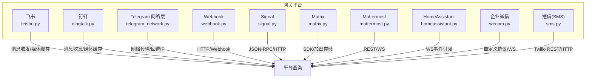

图表来源
- [feishu.py:1-120](file://gateway/platforms/feishu.py#L1-L120)
- [dingtalk.py:68-120](file://gateway/platforms/dingtalk.py#L68-L120)
- [telegram_network.py:55-122](file://gateway/platforms/telegram_network.py#L55-L122)
- [webhook.py:65-120](file://gateway/platforms/webhook.py#L65-L120)
- [signal.py:151-220](file://gateway/platforms/signal.py#L151-L220)
- [matrix.py:120-190](file://gateway/platforms/matrix.py#L120-L190)
- [mattermost.py:71-120](file://gateway/platforms/mattermost.py#L71-L120)
- [homeassistant.py:51-120](file://gateway/platforms/homeassistant.py#L51-L120)
- [wecom.py:142-220](file://gateway/platforms/wecom.py#L142-L220)
- [sms.py:62-120](file://gateway/platforms/sms.py#L62-L120)

章节来源
- [feishu.py:1-120](file://gateway/platforms/feishu.py#L1-L120)
- [dingtalk.py:68-120](file://gateway/platforms/dingtalk.py#L68-L120)
- [telegram_network.py:55-122](file://gateway/platforms/telegram_network.py#L55-L122)
- [webhook.py:65-120](file://gateway/platforms/webhook.py#L65-L120)
- [signal.py:151-220](file://gateway/platforms/signal.py#L151-L220)
- [matrix.py:120-190](file://gateway/platforms/matrix.py#L120-L190)
- [mattermost.py:71-120](file://gateway/platforms/mattermost.py#L71-L120)
- [homeassistant.py:51-120](file://gateway/platforms/homeassistant.py#L51-L120)
- [wecom.py:142-220](file://gateway/platforms/wecom.py#L142-L220)
- [sms.py:62-120](file://gateway/platforms/sms.py#L62-L120)

## 核心组件
- 平台适配器基类：统一的生命周期管理（connect/disconnect）、消息事件封装（MessageEvent）、发送结果封装（SendResult），以及媒体下载/缓存工具函数。
- 平台特定能力：
  - 实时长连接：Feishu（WS/Webhook）、DingTalk（Stream）、Signal（SSE/JSON-RPC）、Matrix（nio）、Mattermost（WS）、WeCom（AI Bot WS）、HomeAssistant（WS）。
  - HTTP/Webhook：Webhook（aiohttp）、SMS（Twilio REST + aiohttp Webhook）。
  - 企业级安全与策略：Feishu（去重、批处理、反应事件路由）、WeCom（消息去重、回复关联、媒体上传）、Matrix（E2EE 存储与维护）。
- 媒体处理：统一的图片/音频/文档缓存接口，支持本地路径与远程 URL 下载。

章节来源
- [feishu.py:88-120](file://gateway/platforms/feishu.py#L88-L120)
- [signal.py:29-40](file://gateway/platforms/signal.py#L29-L40)
- [matrix.py:38-70](file://gateway/platforms/matrix.py#L38-L70)
- [mattermost.py:25-40](file://gateway/platforms/mattermost.py#L25-L40)
- [wecom.py:61-90](file://gateway/platforms/wecom.py#L61-L90)
- [webhook.py:44-60](file://gateway/platforms/webhook.py#L44-L60)
- [sms.py:26-40](file://gateway/platforms/sms.py#L26-L40)

## 架构总览
下图展示各平台适配器在系统中的位置与交互模式。

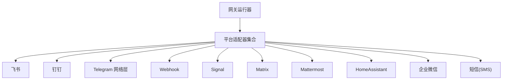

图表来源
- [feishu.py:88-120](file://gateway/platforms/feishu.py#L88-L120)
- [dingtalk.py:68-120](file://gateway/platforms/dingtalk.py#L68-L120)
- [telegram_network.py:55-122](file://gateway/platforms/telegram_network.py#L55-L122)
- [webhook.py:65-120](file://gateway/platforms/webhook.py#L65-L120)
- [signal.py:151-220](file://gateway/platforms/signal.py#L151-L220)
- [matrix.py:120-190](file://gateway/platforms/matrix.py#L120-L190)
- [mattermost.py:71-120](file://gateway/platforms/mattermost.py#L71-L120)
- [homeassistant.py:51-120](file://gateway/platforms/homeassistant.py#L51-L120)
- [wecom.py:142-220](file://gateway/platforms/wecom.py#L142-L220)
- [sms.py:62-120](file://gateway/platforms/sms.py#L62-L120)

## 详细组件分析

### 飞书（Feishu/Lark）
- 认证与连接
  - 支持 WebSocket 长连接与 Webhook 接收；可选 lark_oapi 客户端。
  - 支持去重窗口、批处理（文本/媒体）、反应事件转合成文本事件、卡片按钮点击事件转合成命令事件。
- 消息格式与功能
  - 文本、富文本（post）、图片、音频、视频、合并转发、分享聊天等多类型解析与归一化。
  - 支持 Markdown 渲染、提及解析、附件占位符生成。
- 配置要点
  - 必需参数：应用 ID/Secret、域名、连接模式、加密 Key、验证 Token。
  - 可选策略：群组策略（开放/白名单/黑名单/管理员仅限/禁用）、允许用户列表、Webhook 主机/端口/路径。
- 安全与稳定性
  - Webhook 速率限制、异常追踪、重复请求防护、消息 ACK 表情标记。
- 性能与限制
  - 文本/媒体批处理窗口与字符上限；去重缓存大小与 TTL；最大正文大小限制。

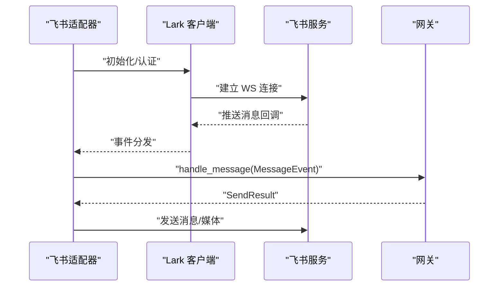

图表来源
- [feishu.py:52-83](file://gateway/platforms/feishu.py#L52-L83)
- [feishu.py:252-295](file://gateway/platforms/feishu.py#L252-L295)

章节来源
- [feishu.py:1-120](file://gateway/platforms/feishu.py#L1-L120)
- [feishu.py:252-295](file://gateway/platforms/feishu.py#L252-L295)
- [feishu.py:413-450](file://gateway/platforms/feishu.py#L413-L450)
- [feishu.py:608-660](file://gateway/platforms/feishu.py#L608-L660)

### 钉钉（DingTalk）
- 认证与连接
  - 使用 dingtalk-stream SDK 维护长连接；依赖 httpx 发送会话 Webhook 回复。
  - 依赖检查：必须安装 dingtalk-stream 与 httpx，并提供 CLIENT_ID/CLIENT_SECRET。
- 消息格式与功能
  - 文本消息解析（富文本降级）、去重窗口、按 chat_id 路由回复。
- 配置要点
  - 配置项：client_id、client_secret；或环境变量 DINGTALK_CLIENT_ID/SECRET。
- 性能与限制
  - 最大消息长度、重连退避策略、去重窗口与容量。

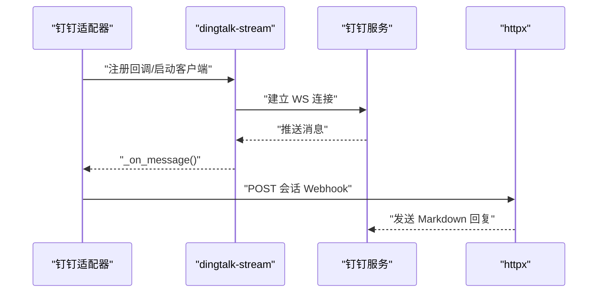

图表来源
- [dingtalk.py:68-120](file://gateway/platforms/dingtalk.py#L68-L120)
- [dingtalk.py:175-231](file://gateway/platforms/dingtalk.py#L175-L231)
- [dingtalk.py:266-301](file://gateway/platforms/dingtalk.py#L266-L301)

章节来源
- [dingtalk.py:59-120](file://gateway/platforms/dingtalk.py#L59-L120)
- [dingtalk.py:175-231](file://gateway/platforms/dingtalk.py#L175-L231)
- [dingtalk.py:266-301](file://gateway/platforms/dingtalk.py#L266-L301)

### Telegram 网络版
- 网络传输优化
  - 提供主机名保留的回退传输，当 api.telegram.org 解析到不可达地址时，通过 DNS-over-HTTPS 发现可达 IPv4 并替换 TCP 连接目标，同时保持 TLS SNI。
- 配置要点
  - 支持 HTTPS_PROXY/HTTP_PROXY 环境变量透传；可通过环境变量注入回退 IP 列表。
- 故障恢复
  - 主动探测与粘性回退 IP 记忆，避免全局阻断影响。

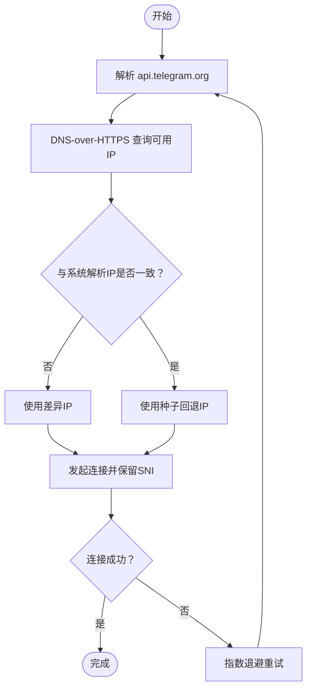

图表来源
- [telegram_network.py:161-229](file://gateway/platforms/telegram_network.py#L161-L229)
- [telegram_network.py:231-249](file://gateway/platforms/telegram_network.py#L231-L249)

章节来源
- [telegram_network.py:47-122](file://gateway/platforms/telegram_network.py#L47-L122)
- [telegram_network.py:161-229](file://gateway/platforms/telegram_network.py#L161-L229)

### Webhook
- 功能概述
  - 运行 aiohttp HTTP 服务器接收外部服务（GitHub/GitLab/JIRA/Stripe 等）的 Webhook，进行 HMAC 签名验证、模板渲染、技能注入、跨平台投递。
- 安全与可靠性
  - 每路由 HMAC 秘钥（支持测试模式 INSECURE_NO_AUTH）、固定窗口速率限制、幂等缓存（防止重复执行）、请求体大小限制、动态路由热加载。
- 配置要点
  - routes：事件过滤、签名秘钥、提示词模板、技能、交付目标与附加参数。
- 交付能力
  - 日志输出、GitHub 评论、跨平台投递（Telegram/Discord/Slack/Signal/SMS）。

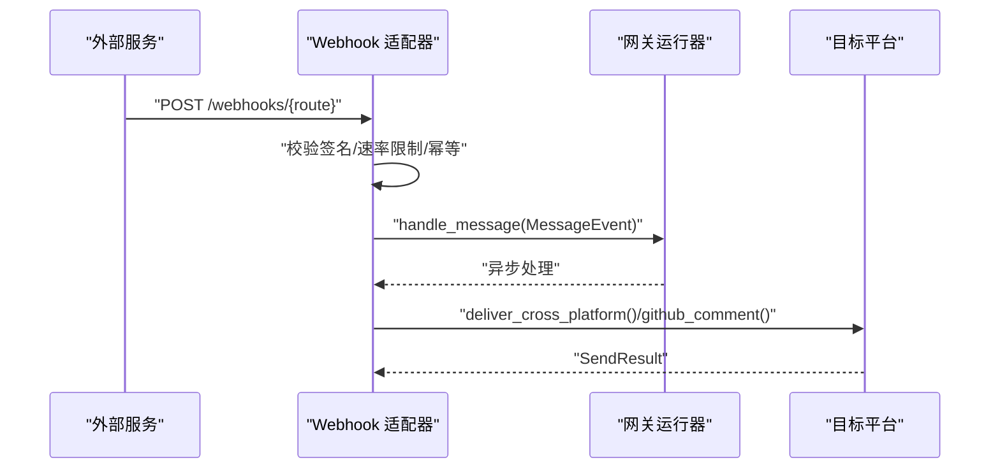

图表来源
- [webhook.py:112-154](file://gateway/platforms/webhook.py#L112-L154)
- [webhook.py:267-467](file://gateway/platforms/webhook.py#L267-L467)
- [webhook.py:618-662](file://gateway/platforms/webhook.py#L618-L662)

章节来源
- [webhook.py:60-120](file://gateway/platforms/webhook.py#L60-L120)
- [webhook.py:267-467](file://gateway/platforms/webhook.py#L267-L467)
- [webhook.py:618-662](file://gateway/platforms/webhook.py#L618-L662)

### Signal
- 连接与消息
  - 连接 signal-cli HTTP 守护进程（SSE 流式事件 + JSON-RPC 2.0 请求）；支持图片/音频/文档上传与发送。
- 安全与策略
  - 账号级锁防止重复监听；可配置组允许列表；自消息过滤（Note to Self）；附件大小限制。
- 配置要点
  - SIGNAL_HTTP_URL、SIGNAL_ACCOUNT；可选 SIGNAL_GROUP_ALLOWED_USERS；忽略故事消息。
- 性能与限制
  - Typing 指示刷新间隔、健康检查、SSE 断线重连与抖动退避。

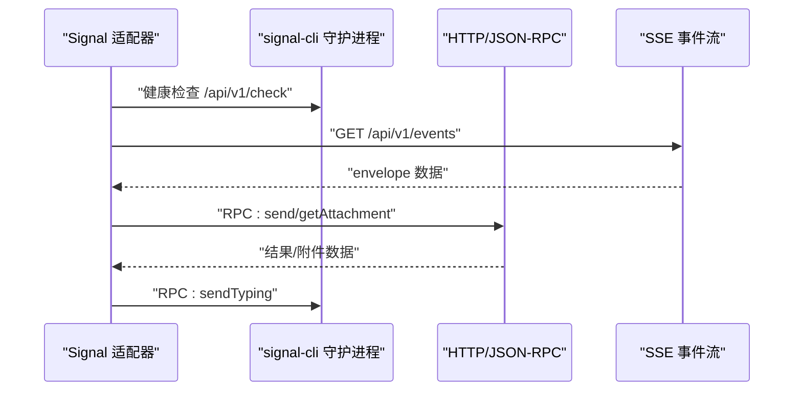

图表来源
- [signal.py:197-244](file://gateway/platforms/signal.py#L197-L244)
- [signal.py:287-351](file://gateway/platforms/signal.py#L287-L351)
- [signal.py:587-621](file://gateway/platforms/signal.py#L587-L621)

章节来源
- [signal.py:142-192](file://gateway/platforms/signal.py#L142-L192)
- [signal.py:197-244](file://gateway/platforms/signal.py#L197-L244)
- [signal.py:287-351](file://gateway/platforms/signal.py#L287-L351)
- [signal.py:587-621](file://gateway/platforms/signal.py#L587-L621)

### Matrix
- 连接与消息
  - 使用 matrix-nio SDK 连接任意 Matrix 服务端；支持可选 E2EE（需要额外依赖）；支持线程回复、编辑消息、媒体上传。
- 安全与策略
  - E2EE 存储目录与密钥导出/导入；设备 ID 稳定性；未验证设备重试；待解密事件缓冲。
- 配置要点
  - MATRIX_HOMESERVER、MATRIX_ACCESS_TOKEN 或 MATRIX_USER_ID/MATRIX_PASSWORD、MATRIX_ENCRYPTION、MATRIX_DEVICE_ID。
- 性能与限制
  - 事件去重队列、消息长度限制、同步循环与错误检测。

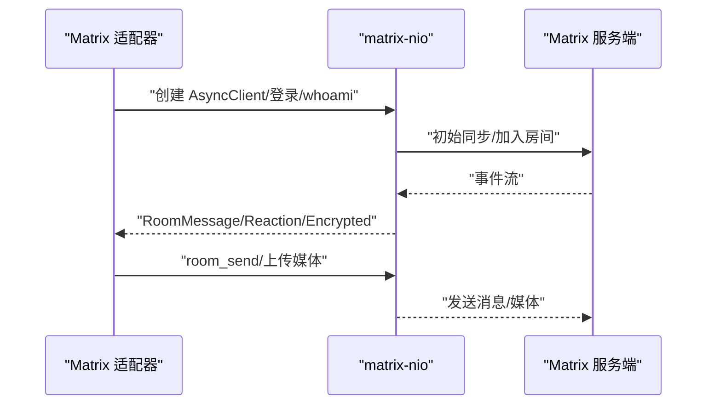

图表来源
- [matrix.py:192-391](file://gateway/platforms/matrix.py#L192-L391)
- [matrix.py:422-516](file://gateway/platforms/matrix.py#L422-L516)

章节来源
- [matrix.py:84-118](file://gateway/platforms/matrix.py#L84-L118)
- [matrix.py:192-391](file://gateway/platforms/matrix.py#L192-L391)
- [matrix.py:422-516](file://gateway/platforms/matrix.py#L422-L516)

### Mattermost
- 连接与消息
  - 使用 aiohttp REST API 与 WebSocket 实时事件；支持回复模式（线程/平铺）、消息去重、文件上传。
- 安全与策略
  - Bearer Token 认证；可配置 @mention 规则与自由响应通道。
- 配置要点
  - MATTERMOST_URL、MATTERMOST_TOKEN；可选 MATTERMOST_REPLY_MODE、ALLOWED_USERS、HOME_CHANNEL。
- 性能与限制
  - 事件去重缓存与 TTL、消息长度限制、WS 断线重连退避。

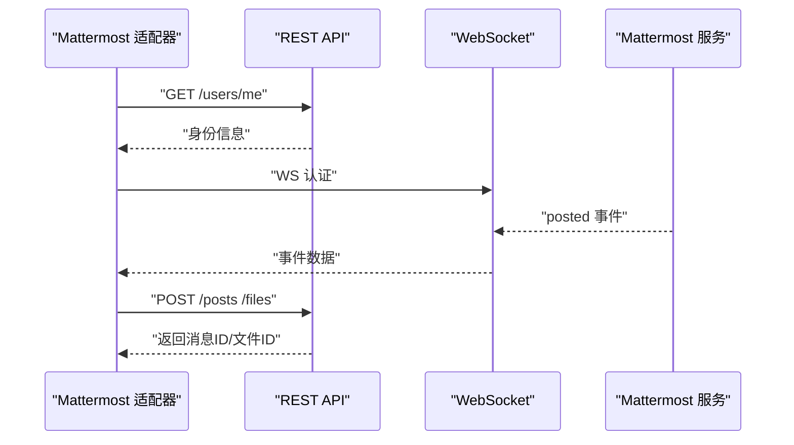

图表来源
- [mattermost.py:197-229](file://gateway/platforms/mattermost.py#L197-L229)
- [mattermost.py:507-540](file://gateway/platforms/mattermost.py#L507-L540)
- [mattermost.py:580-736](file://gateway/platforms/mattermost.py#L580-L736)

章节来源
- [mattermost.py:53-120](file://gateway/platforms/mattermost.py#L53-L120)
- [mattermost.py:197-229](file://gateway/platforms/mattermost.py#L197-L229)
- [mattermost.py:507-540](file://gateway/platforms/mattermost.py#L507-L540)
- [mattermost.py:580-736](file://gateway/platforms/mattermost.py#L580-L736)

### HomeAssistant
- 连接与消息
  - 通过 WebSocket 订阅 state_changed 事件，转换为 MessageEvent；通知通过 REST API 发送。
- 安全与策略
  - 长期访问令牌认证；支持域/实体过滤与冷却时间，避免事件风暴。
- 配置要点
  - HASS_TOKEN、HASS_URL；watch_domains/watch_entities/watch_all/cooldown_seconds。
- 性能与限制
  - 事件冷却、后台监听循环与自动重连。

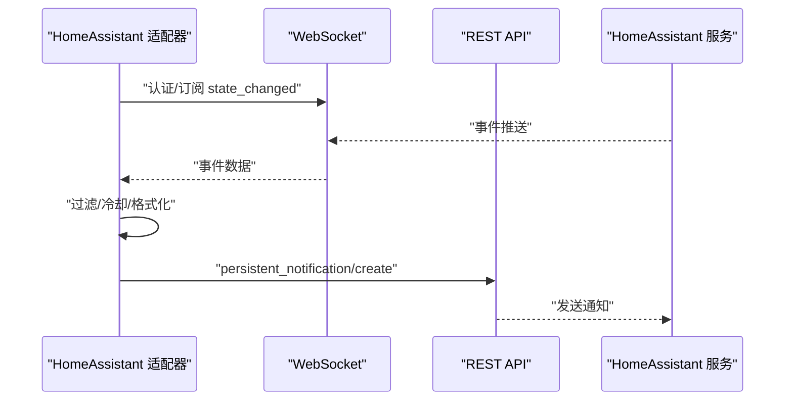

图表来源
- [homeassistant.py:101-139](file://gateway/platforms/homeassistant.py#L101-L139)
- [homeassistant.py:217-246](file://gateway/platforms/homeassistant.py#L217-L246)
- [homeassistant.py:386-439](file://gateway/platforms/homeassistant.py#L386-L439)

章节来源
- [homeassistant.py:42-91](file://gateway/platforms/homeassistant.py#L42-L91)
- [homeassistant.py:101-139](file://gateway/platforms/homeassistant.py#L101-L139)
- [homeassistant.py:217-246](file://gateway/platforms/homeassistant.py#L217-L246)
- [homeassistant.py:386-439](file://gateway/platforms/homeassistant.py#L386-L439)

### 企业微信（WeCom）
- 连接与消息
  - 使用 WeCom AI Bot WebSocket 网关；支持订阅、回调、心跳、回复关联、媒体上传与下载。
- 安全与策略
  - 消息去重窗口、回复 req_id 关联、分组/用户策略（开放/白名单/禁用/配对）。
- 配置要点
  - bot_id、secret、websocket_url；DM/群组策略与允许列表；分组细粒度策略。
- 性能与限制
  - 上传分块大小与最大块数、媒体大小限制、请求超时与重连退避。

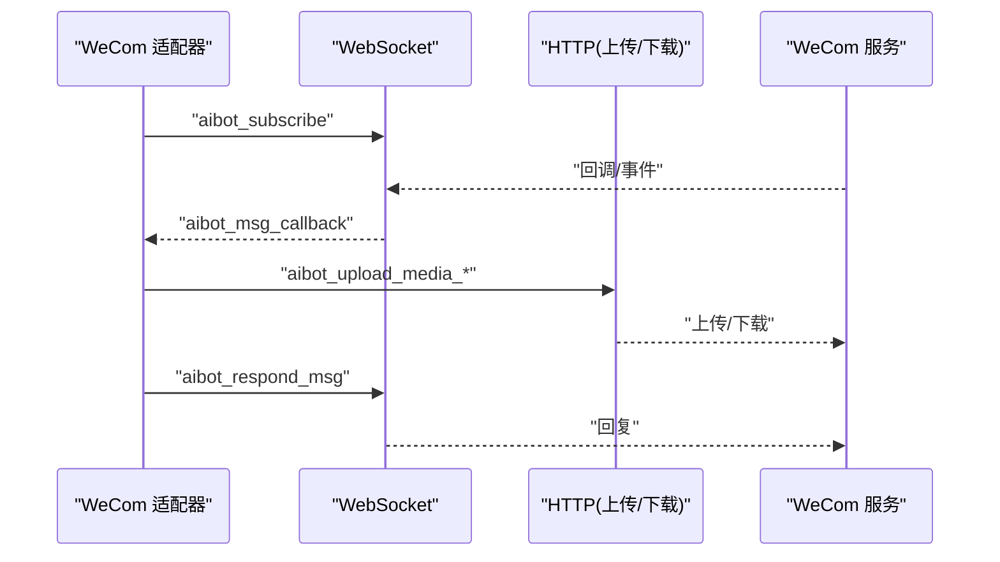

图表来源
- [wecom.py:179-214](file://gateway/platforms/wecom.py#L179-L214)
- [wecom.py:305-344](file://gateway/platforms/wecom.py#L305-L344)
- [wecom.py:462-523](file://gateway/platforms/wecom.py#L462-L523)
- [wecom.py:771-800](file://gateway/platforms/wecom.py#L771-L800)

章节来源
- [wecom.py:108-170](file://gateway/platforms/wecom.py#L108-L170)
- [wecom.py:179-214](file://gateway/platforms/wecom.py#L179-L214)
- [wecom.py:305-344](file://gateway/platforms/wecom.py#L305-L344)
- [wecom.py:462-523](file://gateway/platforms/wecom.py#L462-L523)
- [wecom.py:771-800](file://gateway/platforms/wecom.py#L771-L800)

### 短信（SMS，Twilio）
- 连接与消息
  - 运行 aiohttp Webhook 服务器接收短信；通过 Twilio REST API 发送短信；每条号码独立会话。
- 安全与策略
  - E.164 号码格式；可配置允许用户列表或全部放行；回显抑制。
- 配置要点
  - TWILIO_ACCOUNT_SID、TWILIO_AUTH_TOKEN、TWILIO_PHONE_NUMBER；SMS_WEBHOOK_PORT、SMS_ALLOWED_USERS、SMS_ALLOW_ALL_USERS、SMS_HOME_CHANNEL。
- 性能与限制
  - 单次短信最大长度（约 1600 字符，可能拆分为多段）；分片发送与 SID 返回。

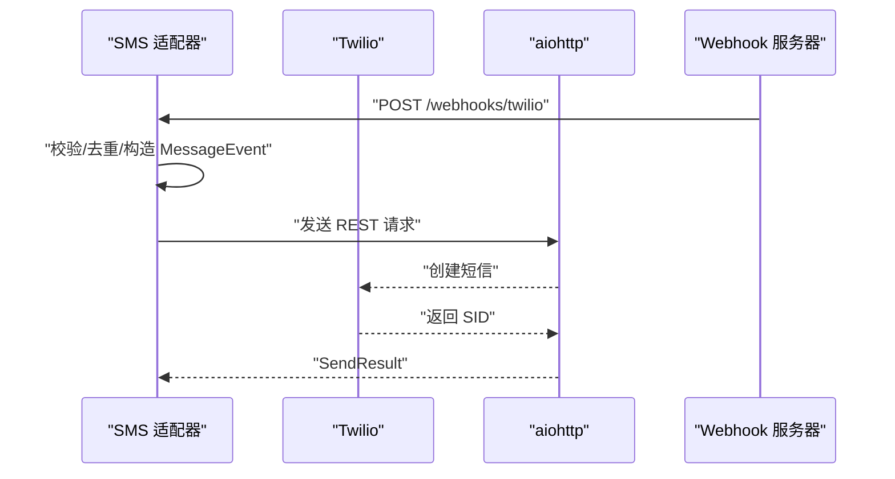

图表来源
- [sms.py:93-120](file://gateway/platforms/sms.py#L93-L120)
- [sms.py:210-277](file://gateway/platforms/sms.py#L210-L277)
- [sms.py:131-185](file://gateway/platforms/sms.py#L131-L185)

章节来源
- [sms.py:53-91](file://gateway/platforms/sms.py#L53-L91)
- [sms.py:93-120](file://gateway/platforms/sms.py#L93-L120)
- [sms.py:210-277](file://gateway/platforms/sms.py#L210-L277)
- [sms.py:131-185](file://gateway/platforms/sms.py#L131-L185)

## 依赖分析
- 外部依赖
  - aiohttp/httpx：Webhook、HTTP/WebSocket、文件上传下载。
  - lark_oapi：飞书 SDK（可选）。
  - dingtalk-stream：钉钉 Stream 模式。
  - matrix-nio：Matrix 客户端（可选 E2EE）。
  - signal-cli：Signal 守护进程。
  - twilio：短信发送（通过 REST API）。
- 内部依赖
  - 平台基类提供统一的消息事件、发送结果、媒体缓存工具。
  - 状态与锁：Signal 电话锁、Feishu/WeCom 去重缓存。

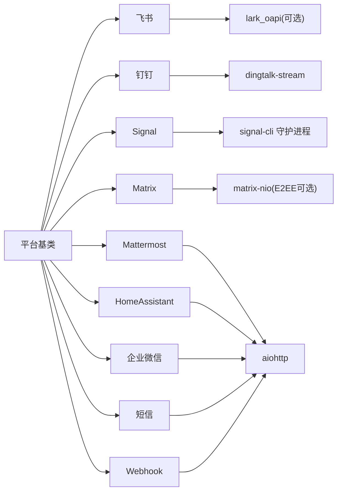

图表来源
- [feishu.py:52-83](file://gateway/platforms/feishu.py#L52-L83)
- [dingtalk.py:28-42](file://gateway/platforms/dingtalk.py#L28-L42)
- [signal.py:27-40](file://gateway/platforms/signal.py#L27-L40)
- [matrix.py:97-117](file://gateway/platforms/matrix.py#L97-L117)
- [mattermost.py:63-69](file://gateway/platforms/mattermost.py#L63-L69)
- [homeassistant.py:24-30](file://gateway/platforms/homeassistant.py#L24-L30)
- [wecom.py:47-60](file://gateway/platforms/wecom.py#L47-L60)
- [sms.py:55-60](file://gateway/platforms/sms.py#L55-L60)
- [webhook.py:36-43](file://gateway/platforms/webhook.py#L36-L43)

章节来源
- [feishu.py:52-83](file://gateway/platforms/feishu.py#L52-L83)
- [dingtalk.py:28-42](file://gateway/platforms/dingtalk.py#L28-L42)
- [signal.py:27-40](file://gateway/platforms/signal.py#L27-L40)
- [matrix.py:97-117](file://gateway/platforms/matrix.py#L97-L117)
- [mattermost.py:63-69](file://gateway/platforms/mattermost.py#L63-L69)
- [homeassistant.py:24-30](file://gateway/platforms/homeassistant.py#L24-L30)
- [wecom.py:47-60](file://gateway/platforms/wecom.py#L47-L60)
- [sms.py:55-60](file://gateway/platforms/sms.py#L55-L60)
- [webhook.py:36-43](file://gateway/platforms/webhook.py#L36-L43)

## 性能考虑
- 连接与重连
  - 钉钉、Mattermost、WeCom、HomeAssistant、Signal、Matrix 均具备断线重连与退避策略。
- 批处理与去重
  - 飞书、WeCom、Signal、Matrix、Mattermost 提供去重窗口与缓存；飞书支持文本/媒体批处理窗口。
- 媒体与带宽
  - Signal/WeCom/Mattermost 对媒体大小有限制；Matrix 支持本地/远程媒体上传。
- CPU 与内存
  - 去重队列、媒体缓存、事件回调处理；合理配置 TTL 与容量以控制内存占用。
- 延迟与吞吐
  - Webhook 采用 202 异步处理；Matrix/Signal/Webhook 支持 SSE/WS 实时性较好；SMS 分片发送可能增加往返次数。

## 故障排除指南
- 飞书
  - 现象：无法连接/接收消息
  - 排查：确认 lark_oapi 可用、App ID/Secret、域名、验证 Token；检查 Webhook 主机/端口/路径；查看速率限制与异常追踪日志。
- 钉钉
  - 现象：连接失败/无回复
  - 排查：确保 dingtalk-stream/httpx 已安装且 CLIENT_ID/CLIENT_SECRET 正确；检查会话 Webhook 是否可用。
- Telegram 网络层
  - 现象：api.telegram.org 不可达
  - 排查：启用 DNS-over-HTTPS 回退；检查代理配置；确认回退 IP 合法。
- Webhook
  - 现象：签名无效/被拒绝
  - 排查：确认路由 secret；检查事件头/负载解析；查看幂等与速率限制。
- Signal
  - 现象：重复消息/无法监听
  - 排查：账号锁冲突；检查 group allowlist；确认 signal-cli 守护进程健康。
- Matrix
  - 现象：加密消息失败/设备状态异常
  - 排查：E2EE 依赖齐全；稳定 device_id；导入/导出 Megolm 密钥；未验证设备重试。
- Mattermost
  - 现象：WS 认证失败/消息不显示
  - 排查：Bearer Token 正确；@mention 规则；文件下载鉴权头。
- HomeAssistant
  - 现象：事件未触发/过滤过多
  - 排查：watch_domains/watch_entities/watch_all；冷却时间；事件类型订阅。
- 企业微信
  - 现象：消息丢失/回复错配
  - 排查：去重窗口；回复 req_id 关联；媒体上传/下载；策略白名单。
- 短信
  - 现象：发送失败/号码不匹配
  - 排查：Twilio 凭据；E.164 号码；Webhook 端口；允许用户列表。

章节来源
- [feishu.py:155-170](file://gateway/platforms/feishu.py#L155-L170)
- [dingtalk.py:96-128](file://gateway/platforms/dingtalk.py#L96-L128)
- [telegram_network.py:161-229](file://gateway/platforms/telegram_network.py#L161-L229)
- [webhook.py:305-315](file://gateway/platforms/webhook.py#L305-L315)
- [signal.py:204-225](file://gateway/platforms/signal.py#L204-L225)
- [matrix.py:312-340](file://gateway/platforms/matrix.py#L312-L340)
- [mattermost.py:522-530](file://gateway/platforms/mattermost.py#L522-L530)
- [homeassistant.py:121-129](file://gateway/platforms/homeassistant.py#L121-L129)
- [wecom.py:191-196](file://gateway/platforms/wecom.py#L191-L196)
- [sms.py:97-100](file://gateway/platforms/sms.py#L97-L100)

## 结论
上述平台适配器在统一的基类之上提供了丰富的消息收发与媒体处理能力，并针对不同平台的特性（实时长连接、Webhook、企业安全策略、E2EE 等）进行了专门优化。部署时应重点关注依赖安装、认证配置与网络可达性；运行中关注去重、批处理与媒体大小限制；遇到问题时结合平台特有的日志与重连机制快速定位。

## 附录

### 平台功能对比表（摘要）
- 认证方式
  - 飞书：App ID/Secret、验证 Token、可选 lark_oapi
  - 钉钉：CLIENT_ID/CLIENT_SECRET
  - Signal：HTTP URL + 账号
  - Matrix：Access Token 或 用户ID+密码（可选 E2EE）
  - Mattermost：Bearer Token
  - HomeAssistant：长期访问令牌
  - 企业微信：Bot ID + Secret + WS
  - 短信：Twilio Account SID + Auth Token + From Number
  - Webhook：每路由 HMAC 秘钥
- 消息格式与能力
  - 文本、富文本、图片、音频、视频、文件、命令、线程回复、编辑、媒体上传
- 部署注意
  - 依赖安装、端口占用、代理与网络可达性、E2EE 密钥持久化、策略白名单
- 性能与资源
  - 去重窗口、批处理、媒体大小限制、重连退避、事件冷却