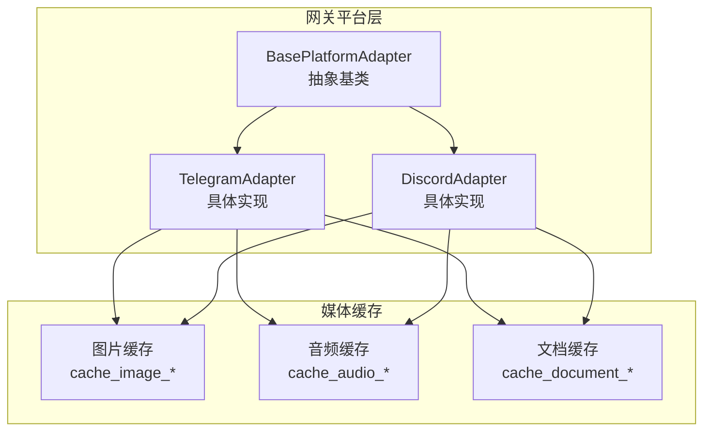
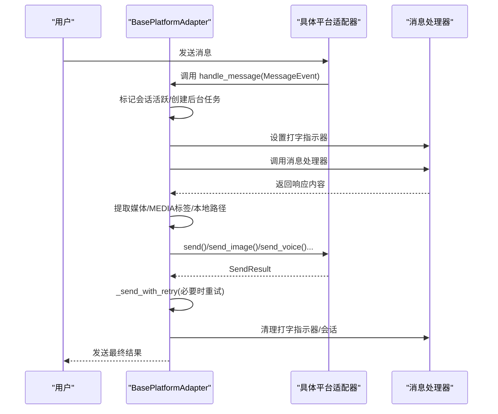
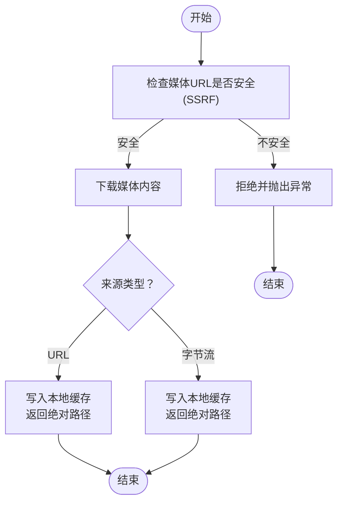
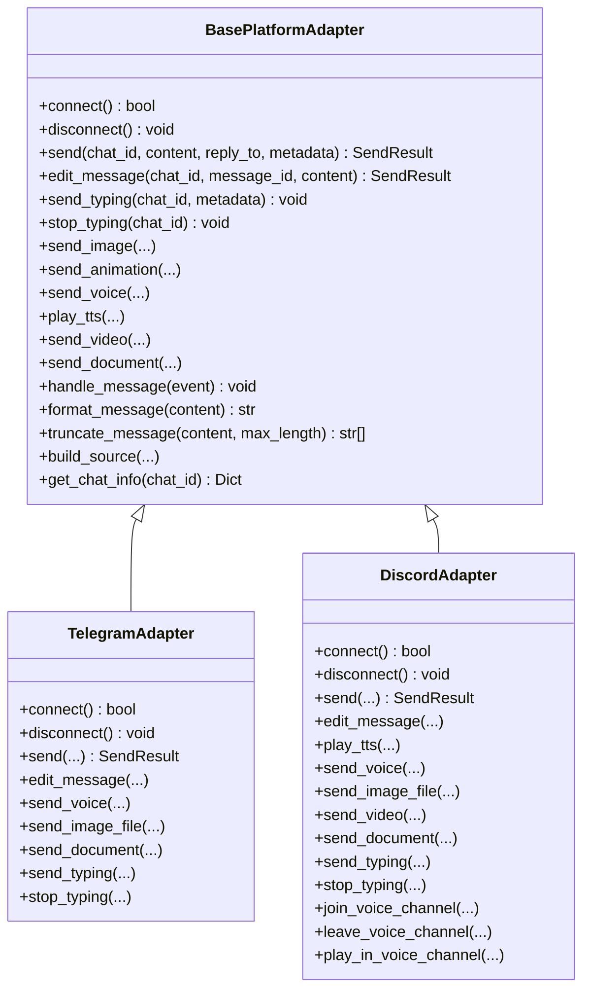

# 基础平台适配器

<cite>
**本文引用的文件**
- [gateway/platforms/base.py](file://gateway/platforms/base.py)
- [gateway/platforms/telegram.py](file://gateway/platforms/telegram.py)
- [gateway/platforms/discord.py](file://gateway/platforms/discord.py)
</cite>

## 目录
1. [简介](#简介)
2. [项目结构](#项目结构)
3. [核心组件](#核心组件)
4. [架构总览](#架构总览)
5. [详细组件分析](#详细组件分析)
6. [依赖分析](#依赖分析)
7. [性能考虑](#性能考虑)
8. [故障排查指南](#故障排查指南)
9. [结论](#结论)
10. [附录：实现示例与最佳实践](#附录实现示例与最佳实践)

## 简介
本文件为 Hermes Agent 的“基础平台适配器”提供完整的 API 参考与设计说明。目标是帮助开发者理解 BasePlatformAdapter 抽象基类的职责边界、接口规范、生命周期管理、消息处理机制、媒体缓存策略、错误处理与重连策略，以及通用能力（如打字指示器、消息编辑、语音回复等）。同时给出在 Telegram、Discord 等具体平台上的实现要点与最佳实践。

## 项目结构
- 基类与通用能力位于 gateway/platforms/base.py
- 具体平台适配器位于 gateway/platforms/*.py
- 本文重点围绕 base.py 中的 BasePlatformAdapter 与相关工具函数、数据结构展开

图表来源
- [gateway/platforms/base.py](file://gateway/platforms/base.py)
- [gateway/platforms/telegram.py](file://gateway/platforms/telegram.py)
- [gateway/platforms/discord.py](file://gateway/platforms/discord.py)

章节来源
- [gateway/platforms/base.py](file://gateway/platforms/base.py)

## 核心组件
- 抽象基类 BasePlatformAdapter：定义统一的连接、断开、发送、消息处理、媒体发送、生命周期钩子等接口
- 数据结构
  - MessageEvent：标准化的消息事件载体
  - SendResult：发送结果对象
  - MessageType：消息类型枚举
- 媒体缓存工具：图片、音频、文档的本地缓存与清理
- 错误处理与重连策略：致命错误标记、可重试错误识别、自动重试与降级回退
- 通用能力：打字指示器、消息编辑、语音播放、线程/话题支持、人类节奏延迟等

章节来源
- [gateway/platforms/base.py](file://gateway/platforms/base.py)

## 架构总览
BasePlatformAdapter 将“平台无关”的消息处理流程与“平台特定”的发送/接收逻辑解耦：
- handle_message：统一入口，负责会话跟踪、并发控制、中断信号、后台任务生命周期
- _process_message_background：实际处理流程，包含文本提取、媒体解析、TTS 自动语音、分块发送、人类节奏延迟等
- _send_with_retry：统一的发送重试与降级回退（Markdown 失败回退到纯文本）
- 各平台适配器（如 Telegram、Discord）仅需实现 connect/disconnect/send 等最小接口，并按需覆盖格式化、媒体发送、打字指示等

图表来源
- [gateway/platforms/base.py](file://gateway/platforms/base.py)

## 详细组件分析

### 抽象基类 BasePlatformAdapter
- 角色定位
  - 定义平台无关的消息处理生命周期与通用能力
  - 提供统一的发送重试、媒体解析、人类节奏、打字指示器等机制
- 关键属性
  - config、platform：配置与平台标识
  - _message_handler：消息处理器回调
  - _running、_fatal_error_*：连接状态与致命错误标记
  - _active_sessions、_pending_messages：会话并发与消息队列
  - _background_tasks：后台任务集合（用于关闭时取消）
  - _auto_tts_disabled_chats、_typing_paused：TTS 与打字指示器控制
- 关键方法
  - connect/disconnect：连接/断开平台
  - send：发送消息（抽象），edit_message、send_typing、stop_typing、send_image/animation/video/document/voice/play_tts 等均为可选覆盖
  - handle_message：统一入口，启动后台任务，支持中断与队列
  - _process_message_background：实际处理流程（文本、媒体、TTS、人类节奏、重试）
  - _send_with_retry：网络错误自动重试与格式化失败降级
  - 生命周期钩子：on_processing_start/on_processing_complete
  - 工具方法：format_message、truncate_message、extract_images/extract_media/extract_local_files、pause/resume_typing_for_chat、cancel_background_tasks、has_pending_interrupt/get_pending_message、build_source、get_chat_info 等

章节来源
- [gateway/platforms/base.py](file://gateway/platforms/base.py)

### 接口规范与生命周期

- 连接与断开
  - connect：建立与平台的连接，注册事件监听；成功后调用 _mark_connected，失败则通过 _set_fatal_error 标记致命错误
  - disconnect：停止轮询/Webhook、释放锁、清理内部状态
- 消息处理
  - set_message_handler：设置消息处理器回调
  - handle_message：快速返回，创建后台任务；对同一会话支持中断与消息队列合并（如 Telegram 的相册批处理）
  - _process_message_background：完整处理链路（提取媒体、TTS、分块发送、人类节奏、钩子回调）
- 发送接口
  - send(chat_id, content, reply_to=None, metadata=None) -> SendResult：抽象方法，子类必须实现
  - 可选覆盖：edit_message、send_typing/stop_typing、send_image/animation/video/document/voice/play_tts、format_message/truncate_message 等

章节来源
- [gateway/platforms/base.py](file://gateway/platforms/base.py)

### 数据结构与类型

- MessageEvent
  - 字段：text、message_type、source、raw_message、message_id、media_urls、media_types、reply_to_message_id、reply_to_text、auto_skill、timestamp
  - 方法：is_command、get_command、get_command_args
- SendResult
  - 字段：success、message_id、error、raw_response、retryable
- MessageType
  - 枚举：TEXT、LOCATION、PHOTO、VIDEO、AUDIO、VOICE、DOCUMENT、STICKER、COMMAND

章节来源
- [gateway/platforms/base.py](file://gateway/platforms/base.py)

### 媒体处理机制与缓存

- 图片缓存
  - 缓存目录：{HERMES_HOME}/cache/images/
  - 工具：cache_image_from_bytes、cache_image_from_url（带 SSRF 校验与指数退避重试）、cleanup_image_cache（按时间清理）
- 音频缓存
  - 缓存目录：{HERMES_HOME}/cache/audio/
  - 工具：cache_audio_from_bytes、cache_audio_from_url（同上）、cleanup_audio_cache
- 文档缓存
  - 缓存目录：{HERMES_HOME}/cache/documents/
  - 支持类型：pdf、md、txt、zip、docx、xlsx、pptx
  - 工具：cache_document_from_bytes（路径穿越保护）、cleanup_document_cache
- 平台侧媒体发送
  - Telegram：send_voice/send_image_file/send_document；send_image 会优先走原生附件（URL 下载到本地缓存）
  - Discord：send_voice（尝试原生语音消息，失败回退文件附件）；send_image_file/send_video/send_document；send_image 会先校验 URL 安全性再下载为附件

图表来源
- [gateway/platforms/base.py](file://gateway/platforms/base.py)

章节来源
- [gateway/platforms/base.py](file://gateway/platforms/base.py)

### 错误处理与重连策略

- 致命错误标记
  - _set_fatal_error(code, message, retryable)：标记连接失败为致命错误，更新运行状态与状态文件
  - has_fatal_error/fatal_error_message/fatal_error_code/fatal_error_retryable：查询致命错误信息
  - set_fatal_error_handler：注册致命错误回调
- 可重试错误识别
  - _RETRYABLE_ERROR_PATTERNS：连接类错误关键字（如 connectionerror、network、broken pipe 等）
  - _is_retryable_error/_is_timeout_error：判断是否可重试或超时错误
- 发送重试与降级
  - _send_with_retry：对网络错误进行指数退避重试；非网络/格式化错误时尝试纯文本回退
  - Telegram/Discord 在 send 中对 BadRequest/TimedOut 等进行细粒度处理（如 thread not found、message_to_be_replied_not_found 的回退）
- 平台特定重连
  - Telegram：Polling 网络错误与冲突重连，指数退避，超过最大次数标记 retryable-fatal
  - Discord：交互式反应反馈（👀/✅/❌），on_processing_start/on_processing_complete 生命周期钩子

章节来源
- [gateway/platforms/base.py](file://gateway/platforms/base.py)
- [gateway/platforms/telegram.py](file://gateway/platforms/telegram.py)
- [gateway/platforms/discord.py](file://gateway/platforms/discord.py)

### 通用功能

- 打字指示器
  - send_typing/stop_typing：平台可选实现；Base 默认空实现
  - Telegram：每 2 秒刷新一次；Discord：持久化 typing 循环（DM 不可靠时）
  - pause_typing_for_chat/resume_typing_for_chat：暂停/恢复打字指示器（用于审批等待等场景）
- 消息编辑
  - edit_message：默认返回不支持；Telegram/Discord 实现了各自编辑逻辑
- 语音回复
  - play_tts：默认回退到 send_voice；Discord 在语音频道内可直接播放
- 人类节奏延迟
  - _get_human_delay：根据环境变量随机延迟，模拟人类回复节奏
- 线程/话题支持
  - build_source：构建 SessionSource（含 thread_id、chat_topic 等）
  - 各平台在 metadata 中传递 thread_id，影响回复与媒体发送行为

章节来源
- [gateway/platforms/base.py](file://gateway/platforms/base.py)
- [gateway/platforms/telegram.py](file://gateway/platforms/telegram.py)
- [gateway/platforms/discord.py](file://gateway/platforms/discord.py)

## 依赖分析

图表来源
- [gateway/platforms/base.py](file://gateway/platforms/base.py)
- [gateway/platforms/telegram.py](file://gateway/platforms/telegram.py)
- [gateway/platforms/discord.py](file://gateway/platforms/discord.py)

章节来源
- [gateway/platforms/base.py](file://gateway/platforms/base.py)
- [gateway/platforms/telegram.py](file://gateway/platforms/telegram.py)
- [gateway/platforms/discord.py](file://gateway/platforms/discord.py)

## 性能考虑
- 异步与并发
  - handle_message 快速返回并创建后台任务，避免阻塞新消息；使用 asyncio.Event 实现会话级中断
  - _background_tasks 集合用于在网关关闭时批量取消
- 媒体处理
  - 图片/音频/文档缓存减少重复下载与网络抖动影响
  - Telegram/Discord 对媒体发送采用原生附件以提升渲染体验与兼容性
- 发送重试
  - _send_with_retry 使用指数退避，降低平台限流与瞬时错误的影响
- 人类节奏
  - _get_human_delay 控制文本与媒体之间的发送间隔，改善用户体验

[本节为通用指导，无需列出具体文件来源]

## 故障排查指南
- 致命错误
  - 检查 fatal_error_code/message/retryable；必要时触发 _notify_fatal_error 回调
  - Telegram：Polling 冲突/网络错误达到上限会标记 retryable-fatal
- 发送失败
  - 若 SendResult.retryable 或错误字符串匹配可重试模式，则自动重试
  - 非网络错误（如格式化问题）会尝试纯文本回退
- 平台特定问题
  - Telegram：thread not found、reply target deleted 等错误会自动回退（移除 thread_id 或 reply_to）
  - Discord：交互式反应（👀/✅/❌）用于反馈处理进度；语音通道播放失败回退到文件附件

章节来源
- [gateway/platforms/base.py](file://gateway/platforms/base.py)
- [gateway/platforms/telegram.py](file://gateway/platforms/telegram.py)
- [gateway/platforms/discord.py](file://gateway/platforms/discord.py)

## 结论
BasePlatformAdapter 通过抽象统一的接口与生命周期管理，屏蔽各平台差异，提供一致的消息处理体验。结合媒体缓存、发送重试、人类节奏与打字指示器等通用能力，开发者只需专注于平台特定的 connect/disconnect/send 实现，即可快速接入新的平台适配器。

[本节为总结性内容，无需列出具体文件来源]

## 附录：实现示例与最佳实践

- 继承与实现步骤（概要）
  - 继承 BasePlatformAdapter，实现 connect/disconnect/send
  - 如需编辑消息、打字指示器、媒体发送能力，按需覆盖对应方法
  - 在 connect 成功后调用 _mark_connected；失败调用 _set_fatal_error
  - 在 send 中区分网络错误与永久错误，合理设置 SendResult.retryable
  - 使用 extract_images/extract_media/extract_local_files 解析响应中的媒体指令
  - 使用 truncate_message/format_message 控制消息长度与格式
  - 使用 cache_image_from_url/cache_audio_from_url/cache_document_from_bytes 缓存媒体
  - 使用 _send_with_retry 统一处理重试与降级

- 示例参考路径（请在相应文件中查看具体实现细节）
  - TelegramAdapter.connect/send/edit_message/send_voice/send_image_file/send_document
    - [gateway/platforms/telegram.py](file://gateway/platforms/telegram.py)
  - DiscordAdapter.connect/send/edit_message/play_tts/send_voice/send_image_file/send_video/send_document/send_typing/stop_typing
    - [gateway/platforms/discord.py](file://gateway/platforms/discord.py)
  - BasePlatformAdapter.handle_message/_process_message_background/_send_with_retry
    - [gateway/platforms/base.py](file://gateway/platforms/base.py)

[本节为指引性内容，已在上述位置标注具体文件路径]