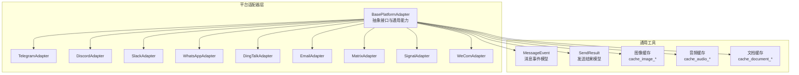
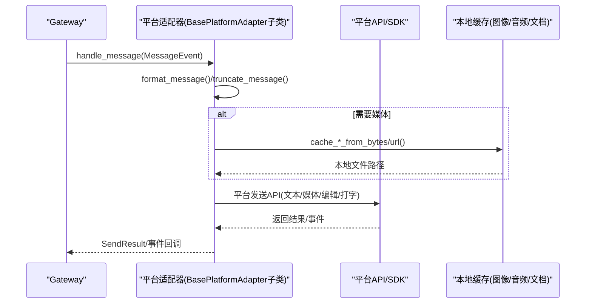
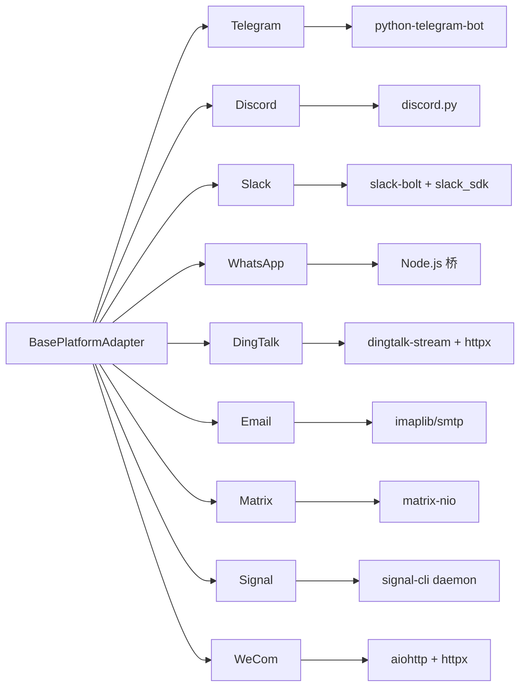

# 平台适配器

<cite>
**本文引用的文件**
- [gateway/platforms/base.py](file://gateway/platforms/base.py)
- [gateway/platforms/__init__.py](file://gateway/platforms/__init__.py)
- [gateway/platforms/telegram.py](file://gateway/platforms/telegram.py)
- [gateway/platforms/discord.py](file://gateway/platforms/discord.py)
- [gateway/platforms/slack.py](file://gateway/platforms/slack.py)
- [gateway/platforms/whatsapp.py](file://gateway/platforms/whatsapp.py)
- [gateway/platforms/telegram_network.py](file://gateway/platforms/telegram_network.py)
- [gateway/platforms/dingtalk.py](file://gateway/platforms/dingtalk.py)
- [gateway/platforms/email.py](file://gateway/platforms/email.py)
- [gateway/platforms/matrix.py](file://gateway/platforms/matrix.py)
- [gateway/platforms/signal.py](file://gateway/platforms/signal.py)
- [gateway/platforms/wecom.py](file://gateway/platforms/wecom.py)
</cite>

## 目录
1. [简介](#简介)
2. [项目结构](#项目结构)
3. [核心组件](#核心组件)
4. [架构总览](#架构总览)
5. [详细组件分析](#详细组件分析)
6. [依赖分析](#依赖分析)
7. [性能考虑](#性能考虑)
8. [故障排查指南](#故障排查指南)
9. [结论](#结论)
10. [附录](#附录)

## 简介
本文件为 Hermes Agent 的平台适配器系统提供详细的 API 参考与使用指南。平台适配器负责在不同即时通讯与协作平台之间桥接消息收发、媒体处理、认证授权与生命周期管理。本文围绕以下目标展开：
- 明确 BasePlatformAdapter 基类的接口规范：连接、断开、发送、接收、编辑、打字指示、媒体发送等。
- 记录各平台适配器（Telegram、Discord、Slack、WhatsApp、DingTalk、Email、Matrix、Signal、WeCom）的具体实现差异与配置要点。
- 说明平台特定的消息格式、媒体处理策略（图片、音频、视频、文档）、用户认证与权限控制。
- 提供生命周期管理、错误处理与重连策略的实践建议。
- 给出新增平台适配器的开发指南与最佳实践。

## 项目结构
平台适配器集中于 gateway/platforms 目录，采用“基类 + 多平台适配器”的分层设计：
- 基类与通用模型：gateway/platforms/base.py 定义了统一的抽象接口、消息事件模型、发送结果模型、媒体缓存工具与通用格式化/截断逻辑。
- 平台适配器：每个平台一个模块，继承自 BasePlatformAdapter，并实现平台特有的连接、消息解析、发送与媒体处理逻辑。
- 平台导出：gateway/platforms/__init__.py 暴露公共 API，便于上层调用。

图表来源
- [gateway/platforms/base.py:470-800](file://gateway/platforms/base.py#L470-L800)
- [gateway/platforms/telegram.py:111-120](file://gateway/platforms/telegram.py#L111-L120)
- [gateway/platforms/discord.py:409-421](file://gateway/platforms/discord.py#L409-L421)
- [gateway/platforms/slack.py:53-67](file://gateway/platforms/slack.py#L53-L67)
- [gateway/platforms/whatsapp.py:103-121](file://gateway/platforms/whatsapp.py#L103-L121)
- [gateway/platforms/dingtalk.py:68-74](file://gateway/platforms/dingtalk.py#L68-L74)
- [gateway/platforms/email.py:217-221](file://gateway/platforms/email.py#L217-L221)
- [gateway/platforms/matrix.py:120-121](file://gateway/platforms/matrix.py#L120-L121)
- [gateway/platforms/signal.py:151-154](file://gateway/platforms/signal.py#L151-L154)
- [gateway/platforms/wecom.py:142-145](file://gateway/platforms/wecom.py#L142-L145)

章节来源
- [gateway/platforms/__init__.py:1-18](file://gateway/platforms/__init__.py#L1-L18)
- [gateway/platforms/base.py:470-800](file://gateway/platforms/base.py#L470-L800)

## 核心组件
本节聚焦 BasePlatformAdapter 抽象接口与通用数据模型，帮助理解所有平台适配器的共同契约与扩展点。

- 连接与断开
  - connect() -> bool：建立到平台的连接，返回是否成功。
  - disconnect() -> None：断开连接并清理资源。
  - is_connected 属性：检查当前运行状态。
  - set_message_handler(handler)：设置消息处理器回调。
  - set_session_store(store)：可选设置会话存储，用于线程/会话判定。

- 发送与编辑
  - send(chat_id, content, reply_to=None, metadata=None) -> SendResult：发送文本消息。
  - edit_message(chat_id, message_id, content) -> SendResult：编辑已发送消息（默认不支持时返回失败）。
  - send_typing(chat_id, metadata=None) -> None：显示打字指示（部分平台不支持）。
  - stop_typing(chat_id) -> None：停止持久打字指示（如平台有后台循环）。

- 媒体发送
  - send_image(chat_id, image_url, caption=None, reply_to=None, metadata=None) -> SendResult：发送图片（URL 或本地路径）。
  - send_animation(chat_id, animation_url, caption=None, reply_to=None, metadata=None) -> SendResult：发送动图（如平台支持原生动图）。
  - send_voice(chat_id, audio_path, caption=None, reply_to=None, **kwargs) -> SendResult：发送语音（平台原生或文本提示）。
  - play_tts(chat_id, audio_path, **kwargs) -> SendResult：播放自动 TTS（部分平台支持隐藏播放）。
  - send_video(chat_id, video_path, caption=None, reply_to=None, **kwargs) -> SendResult：发送视频。
  - send_document(chat_id, file_path, caption=None, file_name=None, reply_to=None, **kwargs) -> SendResult：发送文档。

- 消息与媒体提取
  - extract_images(content) -> (urls, cleaned)：从响应中提取图片链接并清理标签。
  - 内置媒体缓存工具：cache_image_from_bytes/url、cache_audio_from_bytes/url、cache_document_from_bytes。

- 错误与状态
  - has_fatal_error、fatal_error_message、fatal_error_code、fatal_error_retryable：致命错误状态与重试标记。
  - set_fatal_error(code, message, retryable)：上报致命错误并写入运行状态。
  - _mark_connected/_mark_disconnected：更新运行状态。

- 通用格式化与截断
  - format_message(content)：将标准 Markdown 转换为平台特定格式（如 Slack mrkdwn、Telegram MDV2）。
  - truncate_message(content, max_len)：按平台长度限制拆分消息块。

章节来源
- [gateway/platforms/base.py:470-800](file://gateway/platforms/base.py#L470-L800)
- [gateway/platforms/base.py:367-444](file://gateway/platforms/base.py#L367-L444)
- [gateway/platforms/base.py:85-191](file://gateway/platforms/base.py#L85-L191)
- [gateway/platforms/base.py:201-364](file://gateway/platforms/base.py#L201-L364)

## 架构总览
下图展示了平台适配器的通用调用流程：上层通过 Gateway 将消息事件标准化为 MessageEvent，再由各平台适配器执行平台特定的发送/接收逻辑；媒体通过本地缓存工具落地后交由平台 API 或富文本渲染。

图表来源
- [gateway/platforms/base.py:470-800](file://gateway/platforms/base.py#L470-L800)
- [gateway/platforms/base.py:85-191](file://gateway/platforms/base.py#L85-L191)
- [gateway/platforms/base.py:201-364](file://gateway/platforms/base.py#L201-L364)

## 详细组件分析

### Telegram 适配器
- 连接模式
  - 默认长轮询（polling），也可启用 Webhook（需设置 TELEGRAM_WEBHOOK_URL、端口、密钥）。
  - 支持 Telegram Fallback Transport（DNS-over-HTTPS 自动发现备用 IP，保持 Host/TLS SNI 不变）。
- 消息与命令
  - 文本、位置、图片、视频、音频、语音、文档、贴纸、命令（/xxx）。
  - 支持论坛主题（DM Topic）自动创建与持久化。
- 打字与回复
  - send_typing/stop_typing 支持。
  - reply_to_mode 控制是否在多段回复中仅对首段使用回复引用。
- 媒体处理
  - send_image/send_animation/send_voice/send_video 均支持，未命中时回退为文本。
- 错误与重连
  - 网络错误与冲突（另一个轮询实例）分别处理，具备指数退避与最大重试次数。
- 配置要点
  - TELEGRAM_WEBHOOK_URL、TELEGRAM_WEBHOOK_PORT、TELEGRAM_WEBHOOK_SECRET。
  - TELEGRAM_TOKEN（作用域锁防止重复实例）。
  - HERMES_TELEGRAM_MEDIA_BATCH_DELAY_SECONDS、HERMES_TELEGRAM_TEXT_BATCH_DELAY_SECONDS。

章节来源
- [gateway/platforms/telegram.py:469-690](file://gateway/platforms/telegram.py#L469-L690)
- [gateway/platforms/telegram.py:691-728](file://gateway/platforms/telegram.py#L691-L728)
- [gateway/platforms/telegram.py:750-800](file://gateway/platforms/telegram.py#L750-L800)
- [gateway/platforms/telegram_network.py:55-122](file://gateway/platforms/telegram_network.py#L55-L122)

### Discord 适配器
- 连接与事件
  - 使用 discord.py，支持消息内容、私聊/群组、线程、按钮审批、反应反馈。
  - 机器人意图：message_content、dm_messages、guild_messages、members（当允许列表含用户名时）、voice_states。
- 媒体与语音
  - VoiceReceiver 实现语音包解密、Opus 解码、静音检测与 PCM 转 WAV（供 Whisper）。
  - send_image_file/send_voice/send_video/send_document 通过 files_upload_v2。
- 安全与去重
  - 去重缓存（SEEN_TTL/SEEN_MAX）避免重启后重复处理。
  - 允许用户白名单（DISCORD_ALLOWED_USERS）与 @提及过滤（DISCORD_IGNORE_NO_MENTION）。
- 配置要点
  - DISCORD_APP_TOKEN（作用域锁）、DISCORD_BOT_TOKEN。
  - DISCORD_ALLOWED_USERS、DISCORD_ALLOW_BOTS、DISCORD_REACTIONS。

章节来源
- [gateway/platforms/discord.py:409-706](file://gateway/platforms/discord.py#L409-L706)
- [gateway/platforms/discord.py:707-756](file://gateway/platforms/discord.py#L707-L756)
- [gateway/platforms/discord.py:750-800](file://gateway/platforms/discord.py#L750-L800)

### Slack 适配器
- 连接与多工作区
  - Socket Mode + APP TOKEN，支持多工作区（SLACK_BOT_TOKEN 列表 + slack_tokens.json）。
- 消息与线程
  - format_message 将标准 Markdown 转换为 mrkdwn；支持 thread_ts 与 reply_broadcast。
  - 去重缓存（SEEN_TTL/SEEN_MAX）与 bot_message_ts 缓存以支持线程自动回复。
- 媒体与权限
  - send_image/send_voice/send_video/send_document 通过 files_upload_v2。
  - 支持 reactions 添加/移除。
- 配置要点
  - SLACK_APP_TOKEN、SLACK_BOT_TOKEN（可逗号分隔）。
  - gateway.slack.reply_broadcast、assistant:write 权限用于线程状态指示。

章节来源
- [gateway/platforms/slack.py:99-212](file://gateway/platforms/slack.py#L99-L212)
- [gateway/platforms/slack.py:214-330](file://gateway/platforms/slack.py#L214-L330)
- [gateway/platforms/slack.py:331-411](file://gateway/platforms/slack.py#L331-L411)
- [gateway/platforms/slack.py:412-593](file://gateway/platforms/slack.py#L412-L593)

### WhatsApp 适配器（桥接模式）
- 连接与桥接
  - 通过 Node.js 桥（whatsapp-web.js/Baileys/Business API）启动 HTTP 服务，Python 侧通过 /health、/send、/edit、/send-media、/typing、/chat 接口通信。
  - 支持会话锁（作用域锁）防止重复实例。
- 消息与媒体
  - send/edit 支持；send_image_file/send_video/send_document 通过 /send-media。
  - reply_prefix、mention_patterns、free_response_chats 等配置影响消息处理。
- 配置要点
  - bridge_script、bridge_port、session_path。
  - WHATSAPP_MODE、WHATSAPP_REPLY_PREFIX、WHATSAPP_REQUIRE_MENTION、WHATSAPP_FREE_RESPONSE_CHATS、WHATSAPP_MENTION_PATTERNS。

章节来源
- [gateway/platforms/whatsapp.py:274-479](file://gateway/platforms/whatsapp.py#L274-L479)
- [gateway/platforms/whatsapp.py:507-560](file://gateway/platforms/whatsapp.py#L507-L560)
- [gateway/platforms/whatsapp.py:562-733](file://gateway/platforms/whatsapp.py#L562-L733)
- [gateway/platforms/whatsapp.py:735-777](file://gateway/platforms/whatsapp.py#L735-L777)

### DingTalk 适配器（Stream 模式）
- 连接与去重
  - 使用 dingtalk-stream SDK 与 WebSocket，基于 session_webhook 回复。
  - 去重窗口（DEDUP_WINDOW_SECONDS/DEDUP_MAX_SIZE）与重连退避（RECONNECT_BACKOFF）。
- 发送
  - 通过 session_webhook 发送 markdown 消息。
- 配置要点
  - DINGTALK_CLIENT_ID、DINGTALK_CLIENT_SECRET。
  - extra.client_id/client_secret。

章节来源
- [gateway/platforms/dingtalk.py:96-171](file://gateway/platforms/dingtalk.py#L96-L171)
- [gateway/platforms/dingtalk.py:172-244](file://gateway/platforms/dingtalk.py#L172-L244)
- [gateway/platforms/dingtalk.py:266-309](file://gateway/platforms/dingtalk.py#L266-L309)

### Email 适配器
- 连接与轮询
  - IMAP 接收（SSL）、SMTP 发送（TLS），轮询间隔可配置。
  - 自动跳过 no-reply/自动化邮件（NOREPLY_PATTERNS、AUTOMATED_HEADERS）。
- 媒体与附件
  - 支持内联图片与附件下载至本地缓存，按类型映射为照片/文档。
- 配置要点
  - EMAIL_IMAP_HOST/PORT、EMAIL_SMTP_HOST/PORT、EMAIL_ADDRESS、EMAIL_PASSWORD、EMAIL_POLL_INTERVAL。
  - platforms.email.skip_attachments。

章节来源
- [gateway/platforms/email.py:268-314](file://gateway/platforms/email.py#L268-L314)
- [gateway/platforms/email.py:316-459](file://gateway/platforms/email.py#L316-L459)
- [gateway/platforms/email.py:461-621](file://gateway/platforms/email.py#L461-L621)

### Matrix 适配器
- 连接与 E2EE
  - matrix-nio 客户端，支持 E2EE（需要安装带 e2e 的依赖）。
  - 设备 ID 与密钥导出/导入，确保跨重启加密一致性。
- 媒体与线程
  - send_image_file/send_document/send_voice/send_video 上传并发送为 m.image/m.file/m.audio/m.video。
  - 支持 thread 与 reply_to。
- 配置要点
  - MATRIX_HOMESERVER、MATRIX_ACCESS_TOKEN/MATRIX_USER_ID/MATRIX_PASSWORD、MATRIX_ENCRYPTION、MATRIX_DEVICE_ID、MATRIX_ALLOWED_USERS、MATRIX_HOME_ROOM、MATRIX_REACTIONS、MATRIX_REQUIRE_MENTION、MATRIX_FREE_RESPONSE_ROOMS、MATRIX_AUTO_THREAD。

章节来源
- [gateway/platforms/matrix.py:192-391](file://gateway/platforms/matrix.py#L192-L391)
- [gateway/platforms/matrix.py:422-578](file://gateway/platforms/matrix.py#L422-L578)
- [gateway/platforms/matrix.py:580-762](file://gateway/platforms/matrix.py#L580-L762)

### Signal 适配器
- 连接与 SSE
  - signal-cli daemon HTTP 模式，SSE 流式接收事件，JSON-RPC 2.0 发送消息与动作。
  - 健康监控与自动重连，typing 指示周期刷新。
- 媒体与安全
  - 附件大小限制（100MB），自动识别扩展名与 MIME 类型，支持图片/音频/文档。
  - 电话号码日志脱敏。
- 配置要点
  - SIGNAL_HTTP_URL、SIGNAL_ACCOUNT、SIGNAL_GROUP_ALLOWED_USERS（支持 "*"）。

章节来源
- [gateway/platforms/signal.py:197-281](file://gateway/platforms/signal.py#L197-L281)
- [gateway/platforms/signal.py:397-547](file://gateway/platforms/signal.py#L397-L547)
- [gateway/platforms/signal.py:626-800](file://gateway/platforms/signal.py#L626-L800)

### WeCom 适配器
- 连接与协议
  - WebSocket（aiohttp）+ HTTPX，应用级命令（aibot_*）。
  - 心跳与自动重连，请求/响应相关性通过 req_id 管理。
- 媒体与权限
  - 支持 image/video/voice/file 上传与发送；支持 AES 解密（如适用）。
  - DM/群组策略（open/allowlist/disabled）与分组细粒度 allowlist。
- 配置要点
  - WECOM_BOT_ID、WECOM_SECRET、WECOM_WEBSOCKET_URL、WECOM_DM_POLICY、WECOM_GROUP_POLICY、WECOM_ALLOW_FROM、WECOM_GROUP_ALLOW_FROM、groups.*。

章节来源
- [gateway/platforms/wecom.py:179-244](file://gateway/platforms/wecom.py#L179-L244)
- [gateway/platforms/wecom.py:305-396](file://gateway/platforms/wecom.py#L305-L396)
- [gateway/platforms/wecom.py:462-761](file://gateway/platforms/wecom.py#L462-L761)
- [gateway/platforms/wecom.py:772-800](file://gateway/platforms/wecom.py#L772-L800)

## 依赖分析
- 基类依赖
  - 平台配置与会话源：Platform、PlatformConfig、SessionSource、build_session_key。
  - 日志、时间、路径、正则、UUID、异步任务与并发控制。
- 平台库
  - Telegram：python-telegram-bot（消息、命令、回调、Webhook）。
  - Discord：discord.py（Bot、Slash 命令、Reaction、Voice）。
  - Slack：slack-bolt + slack_sdk（Socket Mode、WebClient、mrkdwn）。
  - WhatsApp：Node.js 桥（whatsapp-web.js/Baileys/Business API）。
  - DingTalk：dingtalk-stream + httpx。
  - Email：imaplib/smtp（IMAP/SMTP）、email（解析）、ssl。
  - Matrix：matrix-nio（E2EE 可选）。
  - Signal：signal-cli daemon（HTTP + SSE + JSON-RPC）。
  - WeCom：aiohttp + httpx（WebSocket + HTTP）。

图表来源
- [gateway/platforms/telegram.py:19-47](file://gateway/platforms/telegram.py#L19-L47)
- [gateway/platforms/discord.py:29-41](file://gateway/platforms/discord.py#L29-L41)
- [gateway/platforms/slack.py:19-42](file://gateway/platforms/slack.py#L19-L42)
- [gateway/platforms/whatsapp.py:84-81](file://gateway/platforms/whatsapp.py#L84-L81)
- [gateway/platforms/dingtalk.py:28-41](file://gateway/platforms/dingtalk.py#L28-L41)
- [gateway/platforms/email.py:18-43](file://gateway/platforms/email.py#L18-L43)
- [gateway/platforms/matrix.py:24-44](file://gateway/platforms/matrix.py#L24-L44)
- [gateway/platforms/signal.py:27-39](file://gateway/platforms/signal.py#L27-L39)
- [gateway/platforms/wecom.py:47-59](file://gateway/platforms/wecom.py#L47-L59)

## 性能考虑
- 消息拆分与长度限制
  - 各平台存在消息长度上限（Telegram 4096、Discord 2000、Slack 39000、Matrix 4000、Signal 8000、WeCom 4000、Email 50000），需使用 truncate_message 拆分。
- 媒体传输
  - 图片/音频/文档优先下载到本地缓存，减少平台 URL 临时性与网络抖动影响。
  - 大文件上传需关注平台限制（Signal 100MB、WeCom 文件/语音/图片限制）。
- 并发与去重
  - 去重窗口与最大条目数控制内存增长（Slack/DingTalk/Matrix/WeCom）。
  - 异步任务集合与取消（disconnect 时）避免僵尸任务。
- 网络与重连
  - Telegram Fallback Transport 与 DNS-over-HTTPS 自动发现备用 IP。
  - Slack/DingTalk/WeCom/Matrix 均提供指数退避与心跳维持。

## 故障排查指南
- 致命错误与运行状态
  - set_fatal_error 会写入运行状态（平台状态、错误码、错误信息），可通过 fatal_error_* 查询。
  - _notify_fatal_error 触发外部错误处理器（如重启 Gateway）。
- 常见问题定位
  - Telegram：轮询冲突（另一个实例）、网络中断（自动重连）、Webhook 未生效。
  - Discord：缺少消息内容意图、服务器成员意图、机器人被其他实例占用。
  - Slack：缺少 app token 锁、多工作区 token 不匹配、assistant:write 权限缺失导致线程状态不可见。
  - WhatsApp：Node.js 未安装、桥进程退出、会话锁被占用。
  - DingTalk：HTTP 健康检查失败、SSE 长时间无活动触发强制重连。
  - Email：IMAP/SMTP 凭据错误、自动邮件过滤导致消息被忽略。
  - Matrix：E2EE 依赖缺失、access token 未绑定设备 ID 导致加密失败。
  - Signal：daemon 未运行、账户重复监听、附件超限。
  - WeCom：WebSocket 认证失败、上传分片/大小限制、AES 解密异常。

章节来源
- [gateway/platforms/base.py:545-568](file://gateway/platforms/base.py#L545-L568)
- [gateway/platforms/telegram.py:189-255](file://gateway/platforms/telegram.py#L189-L255)
- [gateway/platforms/discord.py:496-504](file://gateway/platforms/discord.py#L496-L504)
- [gateway/platforms/slack.py:136-145](file://gateway/platforms/slack.py#L136-L145)
- [gateway/platforms/whatsapp.py:292-312](file://gateway/platforms/whatsapp.py#L292-L312)
- [gateway/platforms/dingtalk.py:228-236](file://gateway/platforms/dingtalk.py#L228-L236)
- [gateway/platforms/email.py:268-297](file://gateway/platforms/email.py#L268-L297)
- [gateway/platforms/matrix.py:312-339](file://gateway/platforms/matrix.py#L312-L339)
- [gateway/platforms/signal.py:204-224](file://gateway/platforms/signal.py#L204-L224)
- [gateway/platforms/wecom.py:186-195](file://gateway/platforms/wecom.py#L186-L195)

## 结论
平台适配器体系通过统一的 BasePlatformAdapter 抽象，屏蔽各平台差异，提供一致的发送/接收、媒体处理与生命周期管理能力。针对不同平台的特性（轮询/Webhook、Socket Mode、HTTP+WebSocket、Daemon 模式等），适配器实现了差异化实现与稳健的错误处理与重连策略。遵循本文的接口规范、配置要点与最佳实践，可快速集成新平台并稳定运行。

## 附录

### 新平台适配器开发指南
- 继承关系
  - 继承 BasePlatformAdapter，实现 connect()/disconnect()/send()/edit_message()/send_typing()/send_image()/send_voice()/send_video()/send_document() 等。
- 必要步骤
  - 在 __init__ 中保存 PlatformConfig 与 Platform，初始化内部状态（如客户端、任务、锁）。
  - 在 connect 中完成认证与事件注册，必要时使用 set_message_handler 注册消息处理回调。
  - 在 disconnect 中清理资源（关闭连接、取消任务、释放锁）。
  - send_* 方法中调用平台 API，返回 SendResult；媒体发送优先使用本地缓存路径。
  - 如平台支持线程/回复引用，使用 metadata 中的 thread_id/thread_ts 控制。
- 错误与重连
  - 对瞬时网络错误设置 retryable=True，基类会自动重试；对永久性错误使用 set_fatal_error 并返回失败。
  - 若平台需要心跳/保活，可在后台任务中实现。
- 配置与环境变量
  - 通过 config.extra 与环境变量组合配置；必要时进行作用域锁（如 token/session）以避免重复实例。
- 最佳实践
  - 使用 truncate_message 与 format_message 保证消息合规。
  - 建立去重窗口与最大条目数，避免内存膨胀。
  - 对媒体下载增加 SSRF 校验与大小限制。

章节来源
- [gateway/platforms/base.py:470-800](file://gateway/platforms/base.py#L470-L800)
- [gateway/platforms/base.py:545-568](file://gateway/platforms/base.py#L545-L568)