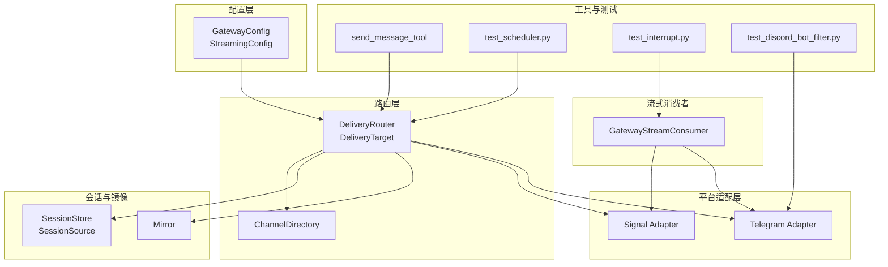
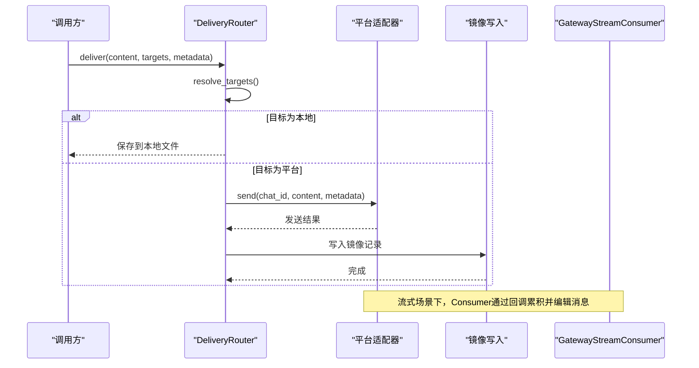
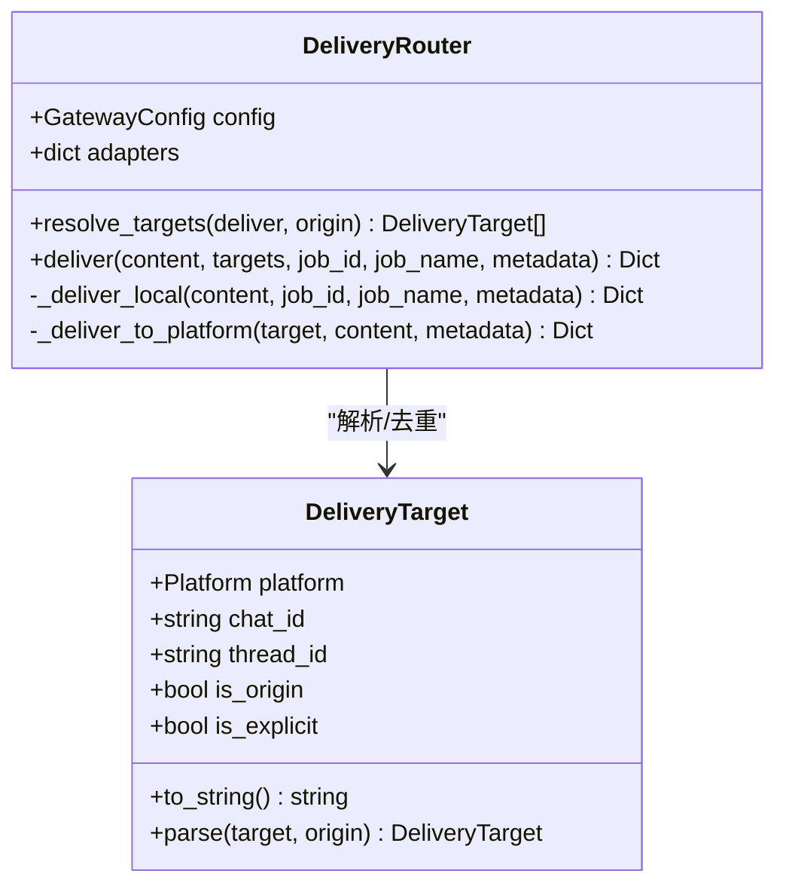
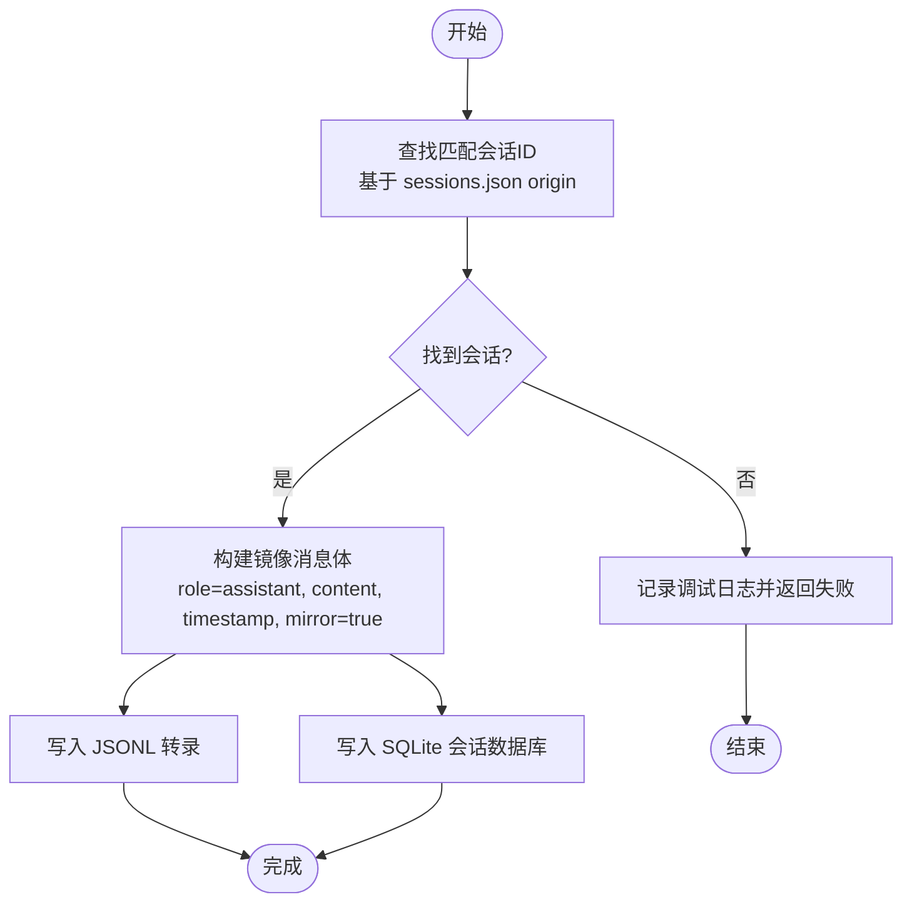
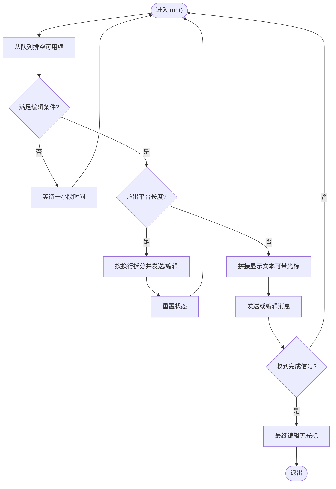
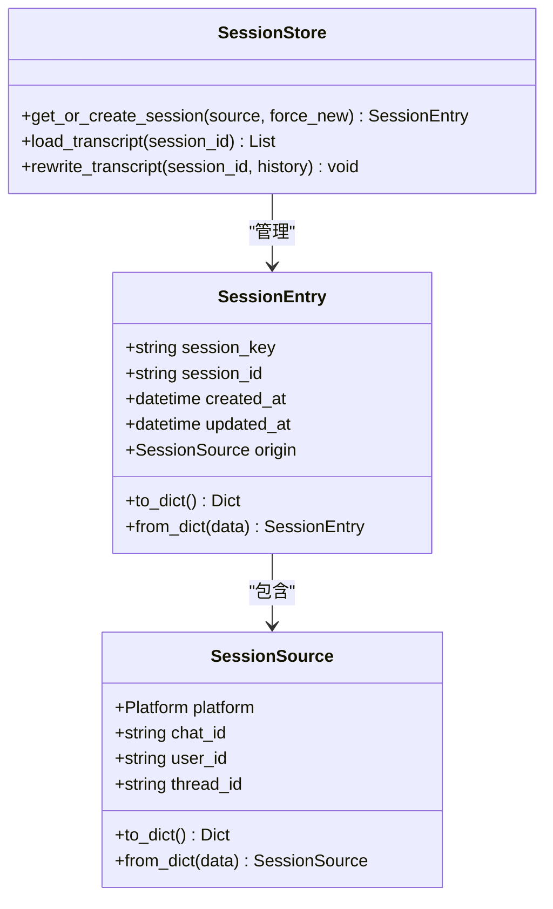
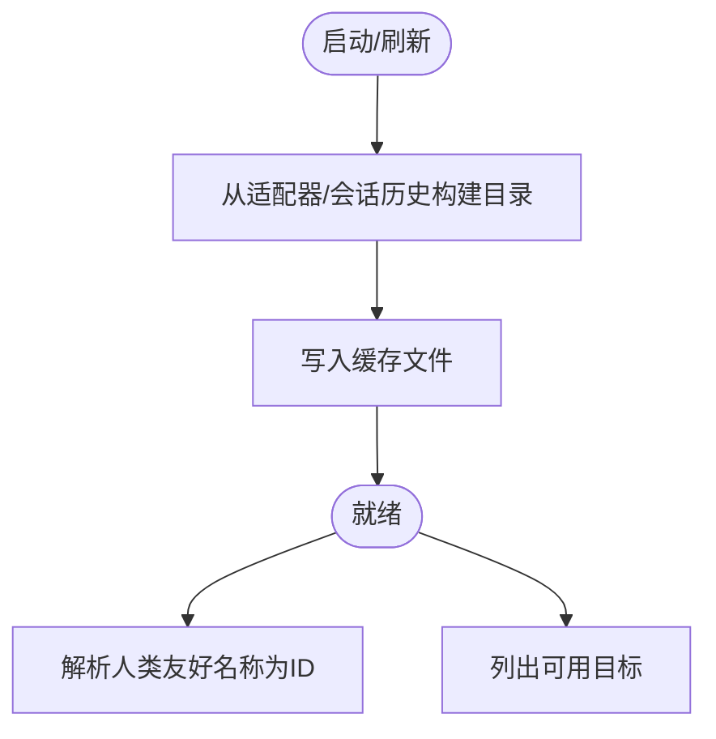
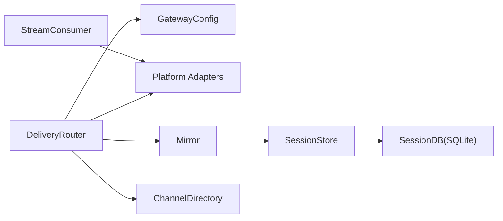
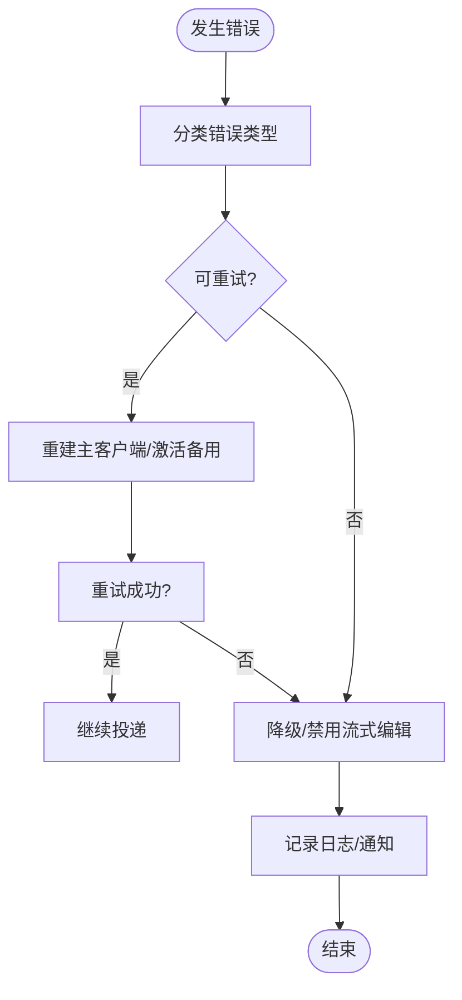

# 消息投递

<cite>
**本文引用的文件**
- [gateway/delivery.py](file://gateway/delivery.py)
- [gateway/mirror.py](file://gateway/mirror.py)
- [gateway/stream_consumer.py](file://gateway/stream_consumer.py)
- [gateway/config.py](file://gateway/config.py)
- [gateway/session.py](file://gateway/session.py)
- [gateway/channel_directory.py](file://gateway/channel_directory.py)
- [gateway/platforms/telegram.py](file://gateway/platforms/telegram.py)
- [gateway/platforms/signal.py](file://gateway/platforms/signal.py)
- [agent/credential_pool.py](file://agent/credential_pool.py)
- [run_agent.py](file://run_agent.py)
- [tests/gateway/test_scheduler.py](file://tests/gateway/test_scheduler.py)
- [tests/tools/test_interrupt.py](file://tests/tools/test_interrupt.py)
- [tests/gateway/test_discord_bot_filter.py](file://tests/gateway/test_discord_bot_filter.py)
</cite>

## 目录
1. [简介](#简介)
2. [项目结构](#项目结构)
3. [核心组件](#核心组件)
4. [架构总览](#架构总览)
5. [详细组件分析](#详细组件分析)
6. [依赖分析](#依赖分析)
7. [性能考量](#性能考量)
8. [故障排查指南](#故障排查指南)
9. [结论](#结论)
10. [附录](#附录)

## 简介
本文件为 Hermes Agent 的消息投递系统提供详细的 API 参考与实现解析，覆盖以下主题：
- 消息队列机制、消息优先级与投递确认流程
- 消息镜像（会话镜像）、多平台消息同步与冲突解决策略
- 流式消息处理、实时消息推送与消息缓冲机制
- 消息重试机制、失败处理与消息去重功能
- 消息格式标准化、内容过滤与安全检查
- 消息投递性能优化、批量处理与并发控制
- 消息监控、日志记录与调试工具
- 消息投递配置、服务质量保证与故障恢复策略

## 项目结构
消息投递系统主要由以下模块构成：
- 配置层：平台配置、会话重置策略、流式传输参数等
- 路由层：目标解析与路由决策
- 平台适配层：各平台发送/编辑/回复能力
- 会话与镜像：会话上下文、历史与镜像写入
- 流式消费者：增量文本的缓冲、节流与编辑
- 工具与测试：发送工具、调度器测试、中断合并测试等



**图表来源**
- [gateway/config.py:218-401](file://gateway/config.py#L218-L401)
- [gateway/delivery.py:107-318](file://gateway/delivery.py#L107-L318)
- [gateway/channel_directory.py:60-94](file://gateway/channel_directory.py#L60-L94)
- [gateway/mirror.py:25-64](file://gateway/mirror.py#L25-L64)
- [gateway/session.py:73-146](file://gateway/session.py#L73-L146)
- [gateway/stream_consumer.py:44-260](file://gateway/stream_consumer.py#L44-L260)
- [tests/gateway/test_scheduler.py:48-116](file://tests/gateway/test_scheduler.py#L48-L116)
- [tests/tools/test_interrupt.py:115-156](file://tests/tools/test_interrupt.py#L115-L156)
- [tests/gateway/test_discord_bot_filter.py:69-98](file://tests/gateway/test_discord_bot_filter.py#L69-L98)

**章节来源**
- [gateway/config.py:218-401](file://gateway/config.py#L218-L401)
- [gateway/delivery.py:107-318](file://gateway/delivery.py#L107-L318)
- [gateway/channel_directory.py:60-94](file://gateway/channel_directory.py#L60-L94)
- [gateway/mirror.py:25-64](file://gateway/mirror.py#L25-L64)
- [gateway/session.py:73-146](file://gateway/session.py#L73-L146)
- [gateway/stream_consumer.py:44-260](file://gateway/stream_consumer.py#L44-L260)

## 核心组件
- 配置管理：集中管理平台连接、会话重置策略、流式传输参数与默认家渠道
- 路由器与目标：解析“origin/local/平台/平台:chat_id”等目标字符串，去重并分发到适配器
- 会话与镜像：维护会话上下文、生成会话键、在发送后写入镜像记录以支持跨平台同步
- 流式消费者：接收增量文本，按阈值与时间间隔进行缓冲与编辑，支持工具边界分割
- 平台适配：Telegram/Signal 等适配器负责实际发送与编辑；错误时进行降级或重试

**章节来源**
- [gateway/config.py:48-66](file://gateway/config.py#L48-L66)
- [gateway/delivery.py:28-105](file://gateway/delivery.py#L28-L105)
- [gateway/mirror.py:25-64](file://gateway/mirror.py#L25-L64)
- [gateway/stream_consumer.py:44-99](file://gateway/stream_consumer.py#L44-L99)

## 架构总览
消息从产生到投递的关键路径如下：
- 输入：内容、目标列表、元数据（可选）
- 解析：将“origin/local/平台/平台:chat_id”解析为具体目标
- 分发：本地落盘或调用平台适配器发送
- 编辑：流式消费者按策略逐步编辑消息
- 同步：镜像写入会话，便于跨平台感知



**图表来源**
- [gateway/delivery.py:174-214](file://gateway/delivery.py#L174-L214)
- [gateway/mirror.py:25-64](file://gateway/mirror.py#L25-L64)
- [gateway/stream_consumer.py:100-174](file://gateway/stream_consumer.py#L100-L174)

## 详细组件分析

### 组件A：消息路由与投递（DeliveryRouter/DeliveryTarget）
- 目标解析
  - 支持字符串或数组形式的目标规范
  - “origin”：回源到消息来源；“local”：仅本地保存；“平台”：使用家渠道；“平台:chat_id”或“平台:chat_id:thread_id”：显式目标
  - 去重：基于平台、chat_id、thread_id
  - 家渠道：若未指定 chat_id，从配置中获取平台家渠道
- 投递执行
  - 本地：写 Markdown 文档，包含作业名、时间戳、元数据与正文
  - 平台：调用适配器 send，并在必要时截断超长输出
- 元数据传递
  - 将 thread_id 等信息透传给适配器



**图表来源**
- [gateway/delivery.py:28-105](file://gateway/delivery.py#L28-L105)
- [gateway/delivery.py:127-173](file://gateway/delivery.py#L127-L173)
- [gateway/delivery.py:174-300](file://gateway/delivery.py#L174-L300)

**章节来源**
- [gateway/delivery.py:127-173](file://gateway/delivery.py#L127-L173)
- [gateway/delivery.py:174-300](file://gateway/delivery.py#L174-L300)

### 组件B：消息镜像与多平台同步（Session Mirroring）
- 功能概述
  - 在向某平台发送消息后，向该会话的 JSONL 与 SQLite 中追加一条镜像消息，标记为“来自某来源”的镜像
  - 通过 sessions.json 中的 origin 字段匹配平台+chat_id（含 thread_id），定位最新会话
- 错误处理
  - 所有异常被吞掉，不造成发送失败
- 同步策略
  - 使接收端 Agent 能感知“已发送”的上下文，提升跨平台一致性



**图表来源**
- [gateway/mirror.py:25-64](file://gateway/mirror.py#L25-L64)
- [gateway/mirror.py:66-104](file://gateway/mirror.py#L66-L104)
- [gateway/mirror.py:107-133](file://gateway/mirror.py#L107-L133)

**章节来源**
- [gateway/mirror.py:25-64](file://gateway/mirror.py#L25-L64)
- [gateway/mirror.py:66-104](file://gateway/mirror.py#L66-L104)
- [gateway/mirror.py:107-133](file://gateway/mirror.py#L107-L133)

### 组件C：流式消息处理与实时推送（GatewayStreamConsumer）
- 设计要点
  - 使用 asyncio 任务与线程安全队列，将同步回调的增量文本排队
  - 采用“编辑传输”（editMessageText）策略，普遍适用于 Telegram、Discord、Slack
  - 支持工具边界信号，将当前消息终结并在其下方开启新消息
- 缓冲与节流
  - 基于时间间隔与字符阈值决定是否编辑
  - 超过平台长度限制时进行合理拆分
- 显示清理
  - 在展示前清理媒体指令与内部标记，避免用户看到原始占位符
- 失败降级
  - 编辑失败时禁用流式编辑，改走最终一次性发送



**图表来源**
- [gateway/stream_consumer.py:100-174](file://gateway/stream_consumer.py#L100-L174)
- [gateway/stream_consumer.py:210-260](file://gateway/stream_consumer.py#L210-L260)

**章节来源**
- [gateway/stream_consumer.py:44-99](file://gateway/stream_consumer.py#L44-L99)
- [gateway/stream_consumer.py:100-174](file://gateway/stream_consumer.py#L100-L174)
- [gateway/stream_consumer.py:210-260](file://gateway/stream_consumer.py#L210-L260)

### 组件D：平台适配与错误处理（Telegram/Signal）
- Telegram
  - 对特定错误进行重试或降级（如线程不存在、回复消息不存在）
- Signal
  - 自身消息过滤、故事消息过滤、组消息白名单/黑名单策略

```mermaid
sequenceDiagram
participant Router as "DeliveryRouter"
participant TG as "Telegram Adapter"
participant API as "Telegram API"
Router->>TG : send(chat_id, content, metadata)
TG->>API : sendMessage(...)
API-->>TG : 成功/失败
alt 失败
TG->>TG : 判断错误类型
opt 线程不存在
TG->>API : 再次发送移除 thread_id
opt 回复消息不存在
TG->>API : 再次发送移除 reply_to
end
end
TG-->>Router : 结果
```

**图表来源**
- [gateway/platforms/telegram.py:835-856](file://gateway/platforms/telegram.py#L835-L856)

**章节来源**
- [gateway/platforms/telegram.py:835-856](file://gateway/platforms/telegram.py#L835-L856)
- [gateway/platforms/signal.py:429-461](file://gateway/platforms/signal.py#L429-L461)

### 组件E：会话管理与上下文注入（SessionStore/SessionSource）
- 会话键规则
  - DM：包含 chat_id 与 thread_id；无 chat_id 时可回退到 thread_id
  - 群组/频道：chat_id/thread_id 及可选 user_id/user_id_alt
  - 默认共享线程会话，可通过配置启用“每用户隔离”
- 上下文提示
  - 动态构建系统提示，包含来源平台、家渠道、可投递选项等
  - 可选 PII 脱敏（在不依赖提及 ID 的平台上）



**图表来源**
- [gateway/session.py:73-146](file://gateway/session.py#L73-L146)
- [gateway/session.py:343-442](file://gateway/session.py#L343-L442)
- [gateway/session.py:444-501](file://gateway/session.py#L444-L501)

**章节来源**
- [gateway/session.py:73-146](file://gateway/session.py#L73-L146)
- [gateway/session.py:444-501](file://gateway/session.py#L444-L501)
- [gateway/session.py:202-341](file://gateway/session.py#L202-L341)

### 组件F：通道目录与人类友好名称解析（ChannelDirectory）
- 作用
  - 缓存各平台可达的频道/联系人列表，支持人类友好名称解析
  - 用于 send_message 工具列出目标与解析“平台:名称”
- 构建策略
  - Discord/Slack：直接枚举；其他平台（Telegram/WhatsApp/Signal/Email/SMS）从会话历史提取



**图表来源**
- [gateway/channel_directory.py:60-94](file://gateway/channel_directory.py#L60-L94)
- [gateway/channel_directory.py:178-226](file://gateway/channel_directory.py#L178-L226)

**章节来源**
- [gateway/channel_directory.py:60-94](file://gateway/channel_directory.py#L60-L94)
- [gateway/channel_directory.py:178-226](file://gateway/channel_directory.py#L178-L226)

## 依赖分析
- 组件耦合
  - DeliveryRouter 依赖 GatewayConfig 与适配器字典，耦合度低，扩展新平台只需新增适配器
  - StreamConsumer 与平台适配器解耦，通过统一接口 send/edit
  - Mirror 与 SessionStore 解耦，仅依赖 sessions.json 与 SQLite
- 外部依赖
  - 平台 SDK（Discord/Slack/Web API）与 HTTP 接口
  - hermes_state.SessionDB（SQLite 会话存储）
- 循环依赖
  - 未见循环依赖迹象



**图表来源**
- [gateway/delivery.py:115-125](file://gateway/delivery.py#L115-L125)
- [gateway/mirror.py:117-132](file://gateway/mirror.py#L117-L132)
- [gateway/session.py:521-528](file://gateway/session.py#L521-L528)

**章节来源**
- [gateway/delivery.py:115-125](file://gateway/delivery.py#L115-L125)
- [gateway/mirror.py:117-132](file://gateway/mirror.py#L117-L132)
- [gateway/session.py:521-528](file://gateway/session.py#L521-L528)

## 性能考量
- 流式传输
  - edit_interval 与 buffer_threshold 控制编辑频率与触发阈值
  - cursor 提升交互体验但需计入平台长度限制
- 缓冲与拆分
  - 超长文本按换行拆分，避免单条消息越界
- 并发与队列
  - 线程安全队列 + asyncio 任务，避免阻塞主线程
- 本地落盘
  - 超长输出先截断并在本地保存完整版本，减少平台侧压力

**章节来源**
- [gateway/config.py:187-215](file://gateway/config.py#L187-L215)
- [gateway/stream_consumer.py:100-174](file://gateway/stream_consumer.py#L100-L174)
- [gateway/delivery.py:286-294](file://gateway/delivery.py#L286-L294)

## 故障排查指南
- 重试与降级
  - 平台错误时尝试重建主客户端连接或激活备用提供者
  - Telegram 编辑失败时禁用流式编辑，改为一次性发送
- 错误上下文归一化
  - 解析“retry after”“reset at”等字段，统一错误上下文
- 过滤与安全
  - Signal 自身消息与故事消息过滤；Discord 机器人消息过滤策略可配置
- 调试与日志
  - 流式消费者捕获异常并记录错误；镜像写入失败仅记录调试日志
- 中断与合并
  - 多个中断消息在队列中合并为单一响应，避免重复与碎片化



**图表来源**
- [run_agent.py:8272-8293](file://run_agent.py#L8272-L8293)
- [gateway/platforms/telegram.py:835-856](file://gateway/platforms/telegram.py#L835-L856)
- [agent/credential_pool.py:228-261](file://agent/credential_pool.py#L228-L261)
- [tests/tools/test_interrupt.py:115-156](file://tests/tools/test_interrupt.py#L115-L156)

**章节来源**
- [run_agent.py:8272-8293](file://run_agent.py#L8272-L8293)
- [agent/credential_pool.py:228-261](file://agent/credential_pool.py#L228-L261)
- [gateway/platforms/telegram.py:835-856](file://gateway/platforms/telegram.py#L835-L856)
- [tests/tools/test_interrupt.py:115-156](file://tests/tools/test_interrupt.py#L115-L156)

## 结论
Hermes Agent 的消息投递系统通过清晰的配置、路由与适配层，结合会话镜像与流式编辑，实现了跨平台的一致性与高可用。系统在错误处理、内容过滤与性能优化方面具备完善的策略，适合在多平台、高并发与复杂业务场景下稳定运行。

## 附录

### API 参考：消息投递 API
- 路由与投递
  - 方法：resolve_targets、deliver
  - 参数：deliver（字符串或数组）、origin（SessionSource）、content、job_id、job_name、metadata
  - 返回：每个目标的投递结果（成功/失败、结果对象或错误信息）
- 本地落盘
  - 方法：_deliver_local
  - 输出：Markdown 文件路径与时间戳
- 平台投递
  - 方法：_deliver_to_platform
  - 行为：截断超长输出、透传 thread_id、调用适配器 send

**章节来源**
- [gateway/delivery.py:127-173](file://gateway/delivery.py#L127-L173)
- [gateway/delivery.py:174-300](file://gateway/delivery.py#L174-L300)

### 配置参考：消息投递配置
- GatewayConfig
  - platforms：平台配置字典
  - default_reset_policy/reset_by_type/reset_by_platform：会话重置策略
  - streaming：流式传输配置（enabled、transport、edit_interval、buffer_threshold、cursor）
  - always_log_local：是否总是本地落盘
- StreamingConfig
  - edit_interval：编辑间隔（秒）
  - buffer_threshold：缓冲阈值（字符）
  - cursor：光标样式
- PlatformConfig
  - enabled、token/api_key、home_channel、reply_to_mode、extra

**章节来源**
- [gateway/config.py:218-401](file://gateway/config.py#L218-L401)
- [gateway/config.py:187-215](file://gateway/config.py#L187-L215)
- [gateway/config.py:140-184](file://gateway/config.py#L140-L184)

### 测试与验证
- 调度器目标解析测试：验证 origin、显式目标、人类友好名称解析
- 中断消息合并测试：验证多个中断消息合并与追加逻辑
- 机器人消息过滤测试：验证 Discord 平台对 bot 消息的不同过滤策略

**章节来源**
- [tests/gateway/test_scheduler.py:48-116](file://tests/gateway/test_scheduler.py#L48-L116)
- [tests/tools/test_interrupt.py:115-156](file://tests/tools/test_interrupt.py#L115-L156)
- [tests/gateway/test_discord_bot_filter.py:69-98](file://tests/gateway/test_discord_bot_filter.py#L69-L98)