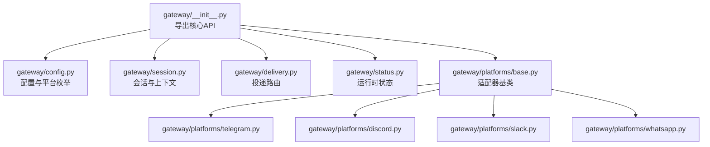
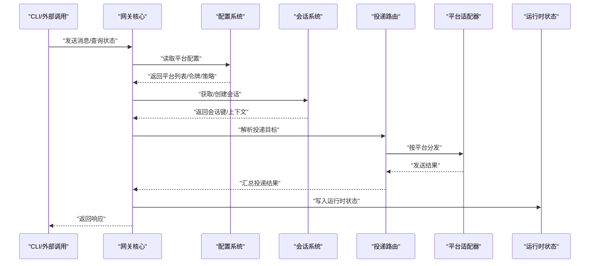
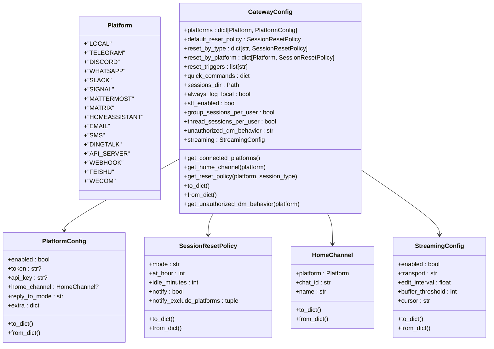
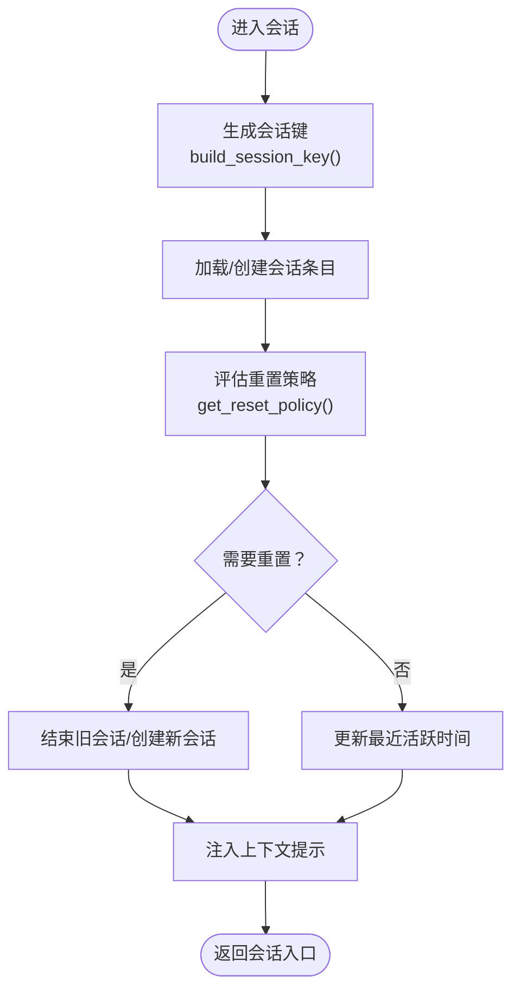
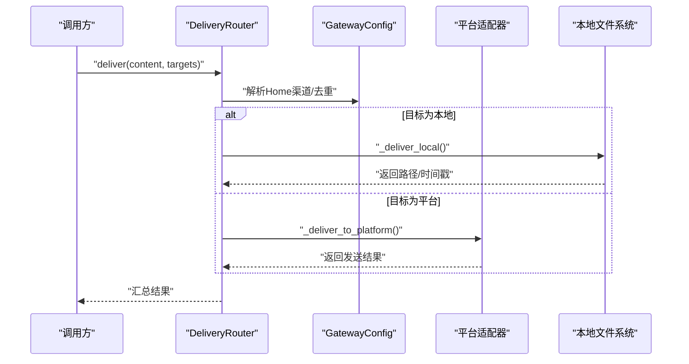
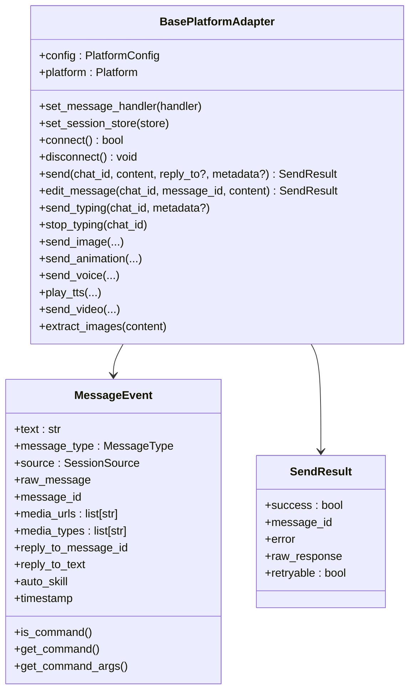
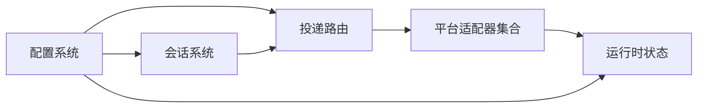

# 网关API接口

<cite>
**本文档引用的文件**
- [gateway/__init__.py](file://gateway/__init__.py)
- [gateway/config.py](file://gateway/config.py)
- [gateway/session.py](file://gateway/session.py)
- [gateway/status.py](file://gateway/status.py)
- [gateway/delivery.py](file://gateway/delivery.py)
- [gateway/platforms/base.py](file://gateway/platforms/base.py)
- [gateway/platforms/telegram.py](file://gateway/platforms/telegram.py)
- [gateway/platforms/discord.py](file://gateway/platforms/discord.py)
- [gateway/platforms/slack.py](file://gateway/platforms/slack.py)
- [gateway/platforms/whatsapp.py](file://gateway/platforms/whatsapp.py)
</cite>

## 目录
1. [简介](#简介)
2. [项目结构](#项目结构)
3. [核心组件](#核心组件)
4. [架构总览](#架构总览)
5. [详细组件分析](#详细组件分析)
6. [依赖关系分析](#依赖关系分析)
7. [性能考虑](#性能考虑)
8. [故障排除指南](#故障排除指南)
9. [结论](#结论)
10. [附录](#附录)

## 简介
本文件为 Hermes Agent 消息网关系统的全面 API 参考文档，覆盖多平台适配器（Telegram、Discord、Slack、WhatsApp 等）的接口规范，会话管理、消息传递、权限控制、运行时配置与状态管理、错误处理策略，以及扩展开发指南与部署建议。目标是帮助开发者快速理解并正确集成与扩展网关能力。

## 项目结构
网关模块位于 `gateway/` 目录，核心由以下部分组成：
- 配置管理：加载与合并环境变量、配置文件与平台特定设置
- 会话管理：跨平台会话键生成、上下文注入、重置策略
- 发送路由：按目标解析投递到平台或本地文件
- 平台适配器：统一抽象基类与各平台具体实现
- 运行时状态：进程 PID 文件、健康状态、锁管理

**图表来源**
- [gateway/__init__.py:1-36](file://gateway/__init__.py#L1-L36)
- [gateway/config.py:1-958](file://gateway/config.py#L1-L958)
- [gateway/session.py:1-1082](file://gateway/session.py#L1-L1082)
- [gateway/delivery.py:1-318](file://gateway/delivery.py#L1-L318)
- [gateway/status.py:1-392](file://gateway/status.py#L1-L392)
- [gateway/platforms/base.py:1-1697](file://gateway/platforms/base.py#L1-L1697)
- [gateway/platforms/telegram.py:1-2719](file://gateway/platforms/telegram.py#L1-L2719)
- [gateway/platforms/discord.py:1-2828](file://gateway/platforms/discord.py#L1-L2828)
- [gateway/platforms/slack.py:1-1362](file://gateway/platforms/slack.py#L1-L1362)
- [gateway/platforms/whatsapp.py:1-941](file://gateway/platforms/whatsapp.py#L1-L941)

**章节来源**
- [gateway/__init__.py:1-36](file://gateway/__init__.py#L1-L36)

## 核心组件
- 配置系统：集中管理平台开关、令牌、Home 渠道、会话重置策略、流式传输、STT 等
- 会话系统：构建会话键、持久化存储、自动重置、上下文注入
- 投递系统：解析目标字符串、去重、平台适配器分发、本地落盘
- 平台适配器：统一抽象、消息事件模型、发送/编辑/媒体上传、类型化错误
- 运行时状态：PID 文件、健康状态 JSON、机器级锁，保障多实例安全

**章节来源**
- [gateway/config.py:1-958](file://gateway/config.py#L1-L958)
- [gateway/session.py:1-1082](file://gateway/session.py#L1-L1082)
- [gateway/delivery.py:1-318](file://gateway/delivery.py#L1-L318)
- [gateway/platforms/base.py:1-1697](file://gateway/platforms/base.py#L1-L1697)
- [gateway/status.py:1-392](file://gateway/status.py#L1-L392)

## 架构总览
网关通过统一的适配器基类对接不同平台，使用配置驱动的连接与行为；会话系统贯穿消息生命周期，投递系统负责最终交付；运行时状态模块确保进程健康与资源互斥。

**图表来源**
- [gateway/config.py:415-662](file://gateway/config.py#L415-L662)
- [gateway/session.py:692-800](file://gateway/session.py#L692-L800)
- [gateway/delivery.py:174-214](file://gateway/delivery.py#L174-L214)
- [gateway/status.py:187-226](file://gateway/status.py#L187-L226)

## 详细组件分析

### 配置系统 API
- 平台枚举：支持本地、Telegram、Discord、WhatsApp、Slack、Signal、Mattermost、Matrix、HomeAssistant、Email、SMS、DingTalk、API Server、Webhook、Feishu、WeCom
- 配置数据结构：
  - HomeChannel：平台默认投递渠道（平台、聊天ID、名称）
  - SessionResetPolicy：重置模式（每日/空闲/两者/不重置）、边界时间、通知策略
  - PlatformConfig：平台启用状态、令牌/API Key、HomeChannel、回复线程模式、额外配置
  - StreamingConfig：实时流式传输开关、编辑间隔、缓冲阈值、光标字符
  - GatewayConfig：主配置对象，聚合上述结构，并提供解析连接平台、获取重置策略、序列化/反序列化
- 加载优先级：环境变量 > 用户配置文件 > 历史兼容文件 > 内置默认
- 环境变量覆盖：各平台令牌、Home 渠道、回复模式、功能开关等
- 安全与校验：无效 at_hour/idle_minutes 警告、空令牌日志提示、未知平台忽略

**图表来源**
- [gateway/config.py:48-401](file://gateway/config.py#L48-L401)

**章节来源**
- [gateway/config.py:1-958](file://gateway/config.py#L1-L958)

### 会话管理 API
- 会话源（SessionSource）：描述消息来源（平台、聊天ID/名称、类型、用户ID/名称、线程ID、话题等），用于路由与上下文注入
- 会话上下文（SessionContext）：包含来源、已连接平台、Home 渠道、会话元信息，动态构建系统提示
- 会话条目（SessionEntry）：持久化存储（JSON/SQLite），跟踪令牌用量、成本估算、内存刷新标记等
- 会话键生成规则：DM/群组/频道/主题线程的隔离策略，支持按用户/线程维度隔离
- 会话存储：SQLite（优先）+ JSONL 回退，带并发锁与原子写入
- 自动重置：基于空闲分钟数与每日边界时间，支持“活动”检测与通知

**图表来源**
- [gateway/session.py:444-500](file://gateway/session.py#L444-L500)
- [gateway/session.py:692-759](file://gateway/session.py#L692-L759)
- [gateway/config.py:299-318](file://gateway/config.py#L299-L318)

**章节来源**
- [gateway/session.py:1-1082](file://gateway/session.py#L1-L1082)
- [gateway/config.py:257-318](file://gateway/config.py#L257-L318)

### 投递路由 API
- 目标解析（DeliveryTarget）：支持 "origin"、"local"、"平台"、"平台:聊天ID"、"平台:聊天ID:线程ID"
- 路由器（DeliveryRouter）：解析目标、解析 Home 渠道、去重、本地落盘、平台适配器分发
- 结果汇总：每个目标返回成功/失败与结果详情
- 平台输出截断：超长内容保存完整版并返回截断摘要

**图表来源**
- [gateway/delivery.py:174-214](file://gateway/delivery.py#L174-L214)
- [gateway/delivery.py:271-300](file://gateway/delivery.py#L271-L300)

**章节来源**
- [gateway/delivery.py:1-318](file://gateway/delivery.py#L1-L318)

### 平台适配器基类 API
- 统一抽象：连接/断开、发送/编辑、图片/视频/语音/文档上传、打字指示、类型化错误
- 消息事件（MessageEvent）：文本、类型、来源、原始消息、媒体URL列表、回复上下文、自动技能绑定、时间戳
- 发送结果（SendResult）：成功标志、消息ID、错误信息、原始响应、可重试标记
- 缓存工具：图片/音频/文档本地缓存、清理策略、SSRF 安全检查
- 错误模式：连接错误可重试，超时等非幂等场景谨慎处理

**图表来源**
- [gateway/platforms/base.py:470-800](file://gateway/platforms/base.py#L470-L800)

**章节来源**
- [gateway/platforms/base.py:1-1697](file://gateway/platforms/base.py#L1-L1697)

### Telegram 平台适配器 API
- 连接模式：轮询/Webhook，支持回退 IP、错误重连、冲突处理
- DM 主题：论坛主题映射与持久化
- 文本/媒体/命令处理：批量聚合、MarkdownV2 转义、长度限制
- 回复线程策略：off/first/all
- 错误处理：网络错误指数退避、轮询冲突重试、致命错误上报

**章节来源**
- [gateway/platforms/telegram.py:1-2719](file://gateway/platforms/telegram.py#L1-L2719)

### Discord 平台适配器 API
- 连接：Socket Mode + Bot Token，意图配置，用户名解析
- 消息过滤：系统消息、@提及过滤、机器人消息策略
- 线程与反应：自动线程归档、反应反馈、去重缓存
- 语音：OPUS 解码、DAVE E2EE、静音检测、PCM→WAV 转换
- 发送：Markdown 处理、分片发送、引用回复

**章节来源**
- [gateway/platforms/discord.py:1-2828](file://gateway/platforms/discord.py#L1-L2828)

### Slack 平台适配器 API
- 连接：Socket Mode + App Token，多工作区支持
- 消息处理：去重、线程 TS 解析、自动回复线程
- 发送：mrkdwn 转换、分片发送、编辑、打字状态（assistant threads）
- 附件：图片/音频/视频/文档上传
- 用户名解析：显示名缓存

**章节来源**
- [gateway/platforms/slack.py:1-1362](file://gateway/platforms/slack.py#L1-L1362)

### WhatsApp 平台适配器 API
- 连接：Node.js 桥接进程（whatsapp-web.js/Baileys/Business API），HTTP 通信
- 会话锁：防止重复会话占用
- 消息过滤：群聊自由响应、@提及/回复机器人、正则模式匹配
- 发送：文本/编辑/媒体（图片/视频/文档），打字指示
- 健康检查：HTTP /health 探活、QR/登录日志保留

**章节来源**
- [gateway/platforms/whatsapp.py:1-941](file://gateway/platforms/whatsapp.py#L1-L941)

### 权限控制与运行时状态
- 运行时状态：PID 文件、健康 JSON、更新时间、平台状态字段
- 作用域锁：按平台令牌/会话路径进行机器级互斥，避免重复实例竞争
- 进程检测：读取 PID、验证启动时间、进程存在性

**章节来源**
- [gateway/status.py:1-392](file://gateway/status.py#L1-L392)

## 依赖关系分析
- 组件内聚：适配器基类与平台实现强内聚，配置与会话相对独立
- 组件耦合：投递路由依赖适配器字典；会话系统依赖配置；状态模块被适配器与运行时调用
- 外部依赖：各平台库（如 telegram.py、discord.py、slack-bolt、Node.js 生态）
- 循环依赖：未发现循环导入

**图表来源**
- [gateway/config.py:415-662](file://gateway/config.py#L415-L662)
- [gateway/session.py:692-759](file://gateway/session.py#L692-L759)
- [gateway/delivery.py:174-214](file://gateway/delivery.py#L174-L214)
- [gateway/status.py:187-226](file://gateway/status.py#L187-L226)

**章节来源**
- [gateway/config.py:1-958](file://gateway/config.py#L1-L958)
- [gateway/session.py:1-1082](file://gateway/session.py#L1-L1082)
- [gateway/delivery.py:1-318](file://gateway/delivery.py#L1-L318)
- [gateway/status.py:1-392](file://gateway/status.py#L1-L392)

## 性能考虑
- 会话存储：SQLite 优先，JSONL 回退；原子写入与临时文件减少损坏风险
- 缓存策略：图片/音频/文档本地缓存，定期清理过期文件
- 投递优化：目标去重、平台适配器并发发送、超长内容截断与完整版落盘
- 重置策略：合理设置空闲分钟数与每日边界，平衡上下文连续性与资源占用
- 平台连接：轮询/Webhook 选择、网络错误指数退避、冲突重试上限

## 故障排除指南
- 连接失败
  - Telegram：检查依赖安装、令牌有效性、回退 IP、轮询冲突与网络错误重试
  - Discord：检查依赖、意图配置、用户名解析、OPUS 加载
  - Slack：检查 Socket Mode 令牌、App Token、多工作区映射
  - WhatsApp：检查 Node.js、桥接脚本、端口占用、会话锁
- 运行时状态
  - 使用 PID 文件与健康 JSON 定位进程状态，必要时释放作用域锁
- 会话异常
  - 检查重置策略、会话键生成规则、SQLite 可用性
- 投递失败
  - 检查目标解析、Home 渠道配置、平台适配器返回的错误信息

**章节来源**
- [gateway/platforms/telegram.py:167-310](file://gateway/platforms/telegram.py#L167-L310)
- [gateway/platforms/discord.py:459-705](file://gateway/platforms/discord.py#L459-L705)
- [gateway/platforms/slack.py:99-232](file://gateway/platforms/slack.py#L99-L232)
- [gateway/platforms/whatsapp.py:274-560](file://gateway/platforms/whatsapp.py#L274-L560)
- [gateway/status.py:352-391](file://gateway/status.py#L352-L391)

## 结论
本文档提供了 Hermes Agent 网关系统的完整 API 参考与扩展指南。通过统一的适配器抽象、灵活的配置体系、健壮的会话与投递机制，以及完善的运行时状态与错误处理，网关能够稳定地支撑多平台消息交互与任务调度。建议在生产环境中结合负载均衡与高可用部署策略，配合严格的权限控制与监控告警，确保服务的可靠性与安全性。

## 附录

### 扩展开发指南：新增平台适配器
- 继承基类：实现 connect/disconnect/send/edit_message 等方法
- 消息事件：构造 MessageEvent，填充文本、类型、来源、媒体列表
- 发送结果：返回 SendResult，必要时设置 retryable
- 配置集成：在 GatewayConfig 中注册平台枚举与默认行为
- 测试与验证：编写单元测试与端到端测试，覆盖连接、发送、媒体、错误场景

**章节来源**
- [gateway/platforms/base.py:470-800](file://gateway/platforms/base.py#L470-L800)
- [gateway/config.py:48-66](file://gateway/config.py#L48-L66)

### 部署与高可用建议
- 负载均衡：多实例部署时使用作用域锁避免令牌/会话冲突
- 健康检查：利用运行时状态 JSON 提供健康探针
- 日志与审计：保留桥接日志（如 WhatsApp）、平台日志，便于排障
- 安全加固：严格 SSRF 检查、令牌最小权限、环境变量与配置文件分离

**章节来源**
- [gateway/status.py:187-226](file://gateway/status.py#L187-L226)
- [gateway/platforms/whatsapp.py:370-479](file://gateway/platforms/whatsapp.py#L370-L479)