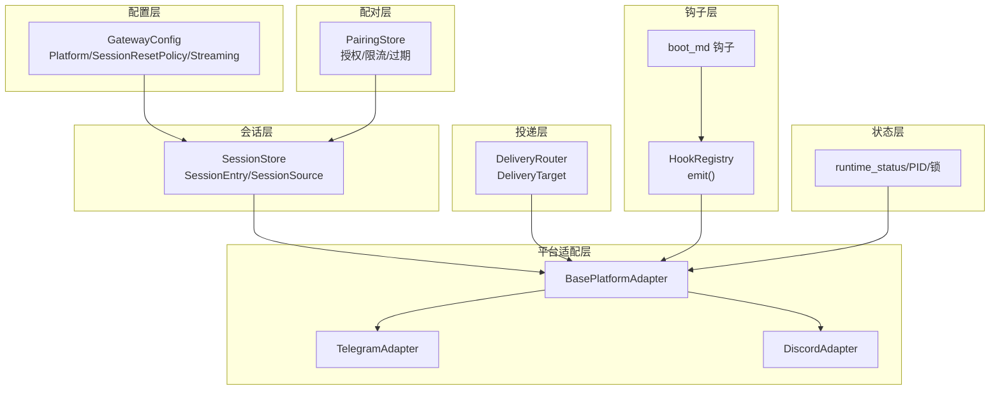
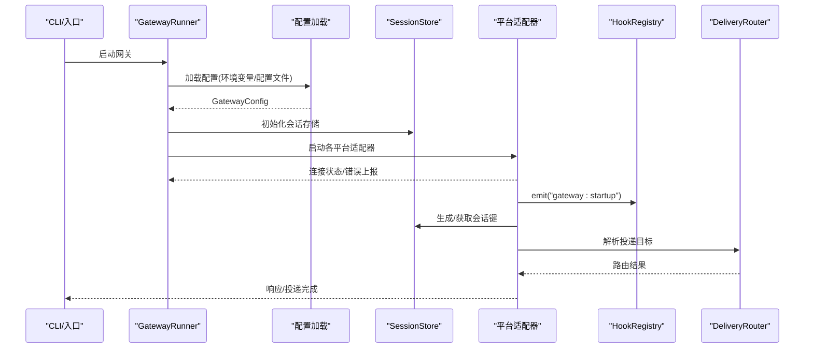
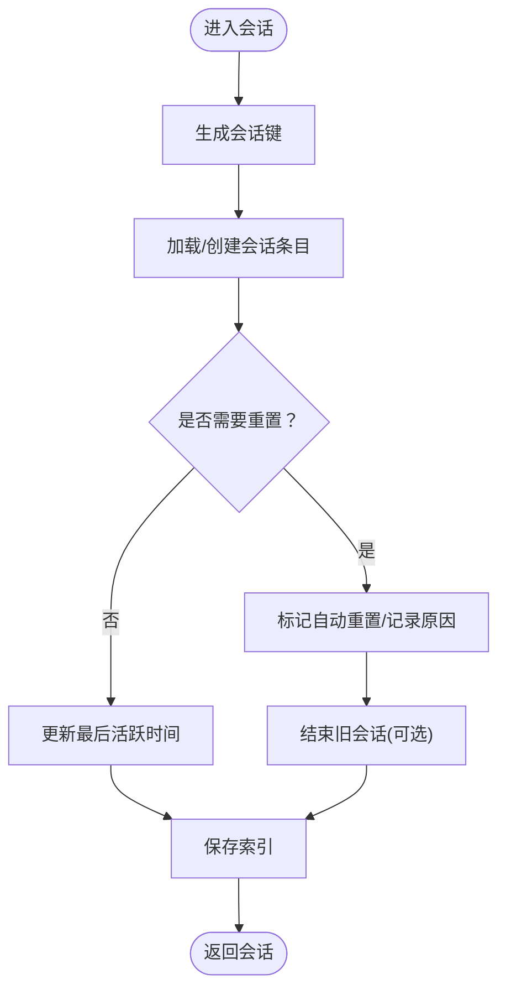
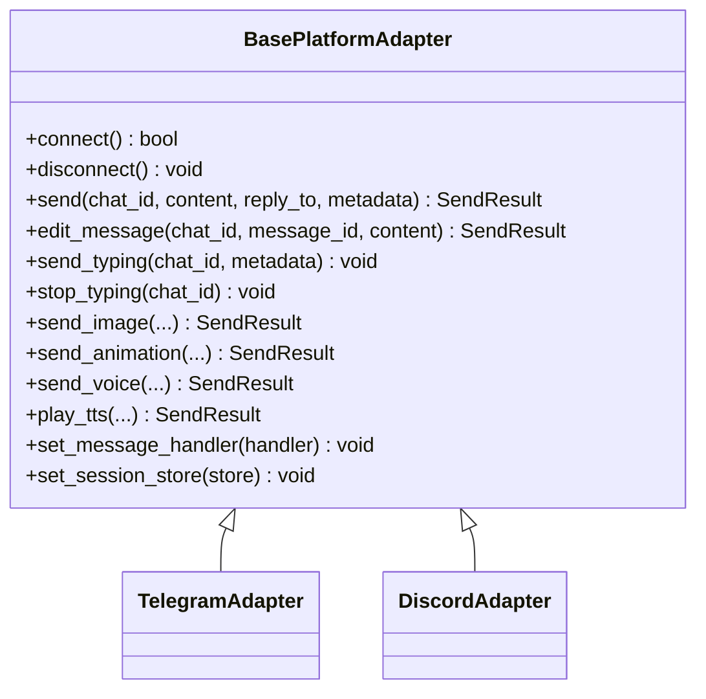
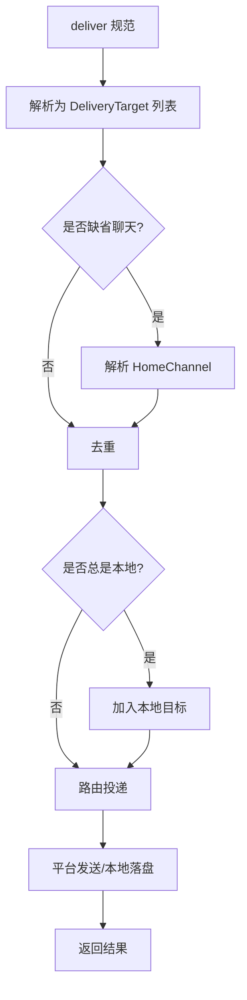
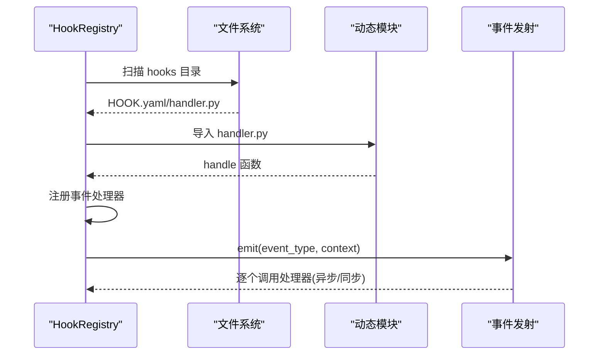
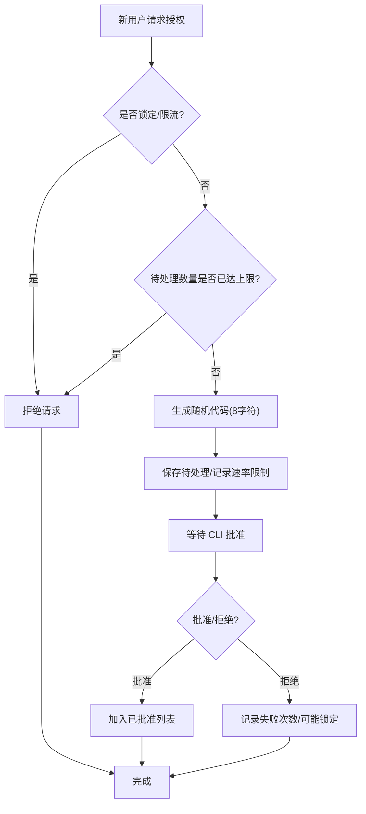
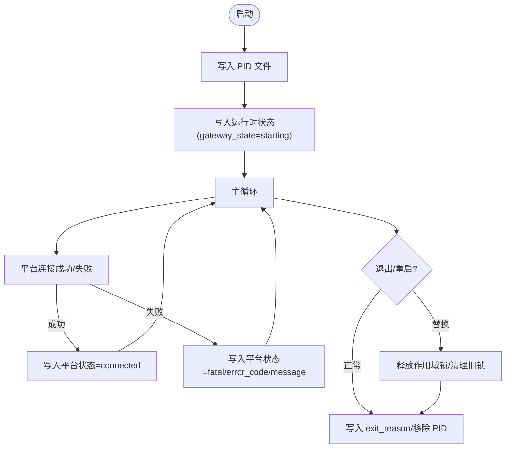
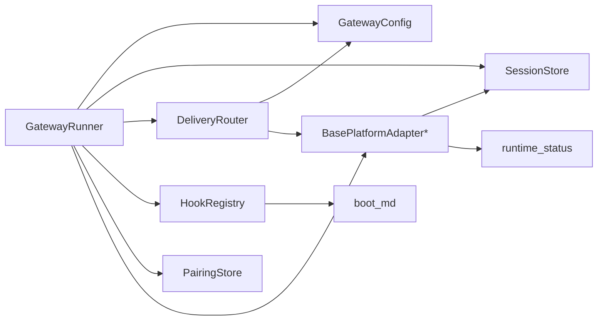

# 网关运行时

<cite>
**本文引用的文件**
- [gateway/__init__.py](file://gateway/__init__.py)
- [gateway/run.py](file://gateway/run.py)
- [gateway/config.py](file://gateway/config.py)
- [gateway/session.py](file://gateway/session.py)
- [gateway/delivery.py](file://gateway/delivery.py)
- [gateway/hooks.py](file://gateway/hooks.py)
- [gateway/pairing.py](file://gateway/pairing.py)
- [gateway/status.py](file://gateway/status.py)
- [gateway/platforms/base.py](file://gateway/platforms/base.py)
- [gateway/platforms/telegram.py](file://gateway/platforms/telegram.py)
- [gateway/platforms/discord.py](file://gateway/platforms/discord.py)
- [gateway/builtin_hooks/boot_md.py](file://gateway/builtin_hooks/boot_md.py)
</cite>

## 目录
1. [简介](#简介)
2. [项目结构](#项目结构)
3. [核心组件](#核心组件)
4. [架构总览](#架构总览)
5. [详细组件分析](#详细组件分析)
6. [依赖分析](#依赖分析)
7. [性能考虑](#性能考虑)
8. [故障排查指南](#故障排查指南)
9. [结论](#结论)
10. [附录：配置与环境变量](#附录配置与环境变量)

## 简介
本文件为 Hermes Agent 网关运行时系统的全面 API 参考与实践指南。内容覆盖网关启动、配置加载与运行时管理流程；网关配置项、环境变量与配置文件格式；网关钩子系统、事件监听与扩展机制；网关配对功能、设备绑定与认证流程；网关健康检查、状态监控与故障检测机制；网关重启、优雅关闭与资源清理策略；网关性能调优、内存管理与并发控制；以及网关日志记录、调试模式与故障排除工具。

## 项目结构
网关运行时位于 gateway 子模块，围绕“配置—会话—平台适配—投递—钩子—配对—状态”形成闭环。核心模块职责如下：
- 配置层：定义平台、会话重置策略、流式输出等配置模型，并负责从多源加载与合并配置。
- 会话层：生成会话键、维护会话元数据、评估自动重置策略、持久化对话历史。
- 平台适配层：抽象统一的消息收发接口，各平台（如 Telegram、Discord）实现具体协议对接。
- 投递层：解析目标（origin/local/平台:聊天），路由到平台或本地文件。
- 钩子层：事件驱动的扩展系统，支持内置与用户自定义钩子。
- 配对层：基于代码的用户授权与访问控制，保障 DM 安全。
- 状态层：PID 文件与运行时状态文件，用于健康检查与锁冲突避免。

图示来源
- [gateway/config.py:218-401](file://gateway/config.py#L218-L401)
- [gateway/session.py:503-800](file://gateway/session.py#L503-L800)
- [gateway/platforms/base.py:470-800](file://gateway/platforms/base.py#L470-L800)
- [gateway/platforms/telegram.py:111-200](file://gateway/platforms/telegram.py#L111-L200)
- [gateway/platforms/discord.py:111-200](file://gateway/platforms/discord.py#L111-L200)
- [gateway/delivery.py:107-318](file://gateway/delivery.py#L107-L318)
- [gateway/hooks.py:34-171](file://gateway/hooks.py#L34-L171)
- [gateway/builtin_hooks/boot_md.py:69-88](file://gateway/builtin_hooks/boot_md.py#L69-L88)
- [gateway/pairing.py:75-310](file://gateway/pairing.py#L75-L310)
- [gateway/status.py:28-392](file://gateway/status.py#L28-L392)

章节来源
- [gateway/__init__.py:12-35](file://gateway/__init__.py#L12-L35)
- [gateway/run.py:461-571](file://gateway/run.py#L461-L571)

## 核心组件
- 配置模型与加载
  - 平台枚举、HomeChannel、会话重置策略、平台配置、流式配置、主配置对象与加载函数。
  - 加载优先级：环境变量 > config.yaml > legacy gateway.json > 内置默认值；并进行校验与告警。
- 会话管理
  - 会话键生成规则、会话条目持久化、自动重置策略（空闲/每日）、SQLite 元数据库与回退方案。
- 平台适配
  - 统一消息事件、发送结果、媒体缓存、打字指示、编辑消息、语音播放等抽象接口。
- 投递路由
  - 解析目标字符串、解析 home channel、去重、本地落盘与平台投递。
- 钩子系统
  - 发现与加载用户钩子目录、内置钩子注册、异步事件发射、错误隔离。
- 配对系统
  - 一次性授权码、过期与限流、锁定策略、原子写入与权限保护。
- 运行时状态
  - PID 文件、运行时状态 JSON、作用域锁、进程存活探测与替换策略。

章节来源
- [gateway/config.py:48-401](file://gateway/config.py#L48-L401)
- [gateway/session.py:503-800](file://gateway/session.py#L503-L800)
- [gateway/platforms/base.py:367-800](file://gateway/platforms/base.py#L367-L800)
- [gateway/delivery.py:107-318](file://gateway/delivery.py#L107-L318)
- [gateway/hooks.py:34-171](file://gateway/hooks.py#L34-L171)
- [gateway/pairing.py:75-310](file://gateway/pairing.py#L75-L310)
- [gateway/status.py:28-392](file://gateway/status.py#L28-L392)

## 架构总览
下图展示从启动到消息处理的关键路径：配置加载、会话生成、平台适配、钩子触发、投递与状态更新。

图示来源
- [gateway/run.py:461-571](file://gateway/run.py#L461-L571)
- [gateway/config.py:415-662](file://gateway/config.py#L415-L662)
- [gateway/session.py:692-771](file://gateway/session.py#L692-L771)
- [gateway/platforms/base.py:524-568](file://gateway/platforms/base.py#L524-L568)
- [gateway/hooks.py:138-171](file://gateway/hooks.py#L138-L171)
- [gateway/delivery.py:127-172](file://gateway/delivery.py#L127-L172)

## 详细组件分析

### 配置系统（GatewayConfig）
- 支持平台：本地、Telegram、Discord、WhatsApp、Slack、Signal、Mattermost、Matrix、HomeAssistant、Email、SMS、钉钉、API Server、Webhook、飞书、企业微信。
- 会话重置策略：按“每日/空闲/两者/不自动重置”组合，支持通知与排除平台。
- 流式输出：可配置传输方式、编辑间隔、缓冲阈值与光标。
- 配置来源与优先级：环境变量 > config.yaml > legacy gateway.json > 内置默认值；并进行字段校验与告警。
- 关键字段与行为
  - 平台启用与凭据：token/api_key、home_channel、reply_to_mode。
  - 未授权 DM 行为：pair 或 ignore。
  - 会话隔离：按用户分组、线程内是否按用户隔离。
  - STT 开关：是否自动转录语音消息。
  - 本地日志：是否总是保存到本地文件。
  - 快捷命令：以斜杠开头的命令绕过代理循环。
  - 会话目录：sessions_dir。
  - 流式配置：streaming。

章节来源
- [gateway/config.py:48-401](file://gateway/config.py#L48-L401)
- [gateway/config.py:415-662](file://gateway/config.py#L415-L662)

### 会话系统（SessionStore/SessionEntry/SessionSource）
- 会话键生成：基于平台、聊天类型、聊天标识、线程标识、用户标识（可选）构建确定性键。
- 自动重置策略：根据空闲分钟数与每日边界小时判断是否需要重置；活跃后台进程的会话不会被重置。
- 会话元数据：创建时间、更新时间、输入/输出/缓存令牌计数、成本估算、是否已自动重置、是否已刷新记忆等。
- SQLite 持久化：优先使用 SessionDB；不可用时回退至 JSONL 文件。
- 种子线程上下文：当 DM 线程首次出现时，复制父 DM 的历史以保持上下文连续。

图示来源
- [gateway/session.py:444-500](file://gateway/session.py#L444-L500)
- [gateway/session.py:588-668](file://gateway/session.py#L588-L668)
- [gateway/session.py:692-771](file://gateway/session.py#L692-L771)

章节来源
- [gateway/session.py:503-800](file://gateway/session.py#L503-L800)

### 平台适配器（BasePlatformAdapter）
- 统一接口：连接/断开、发送/编辑消息、打字指示、图片/动画/视频/语音发送、媒体缓存（图片/音频/文档）。
- 错误与重试：致命错误标记、可重试错误模式识别、平台状态写入运行时状态文件。
- 会话与任务：活动会话跟踪、后台任务集合、中断支持、待处理消息队列。
- Telegram/Discord 示例特性
  - Telegram：MarkdownV2 转义、媒体批处理、主题线程映射、投票/审批状态机。
  - Discord：语音接收器（DAVE E2EE 解密）、静音检测、线程归档时长、网络错误重连策略。

图示来源
- [gateway/platforms/base.py:470-800](file://gateway/platforms/base.py#L470-L800)
- [gateway/platforms/telegram.py:111-200](file://gateway/platforms/telegram.py#L111-L200)
- [gateway/platforms/discord.py:111-200](file://gateway/platforms/discord.py#L111-L200)

章节来源
- [gateway/platforms/base.py:367-800](file://gateway/platforms/base.py#L367-L800)
- [gateway/platforms/telegram.py:111-200](file://gateway/platforms/telegram.py#L111-L200)
- [gateway/platforms/discord.py:111-200](file://gateway/platforms/discord.py#L111-L200)

### 投递系统（DeliveryRouter/DeliveryTarget）
- 目标解析：origin、local、平台名、平台:聊天、平台:聊天:线程。
- home channel 解析：若未指定聊天，使用配置中的 HomeChannel。
- 去重与本地落盘：始终包含本地输出（可配置）。
- 平台投递：超长输出截断并保存完整版，补充提示信息。

图示来源
- [gateway/delivery.py:127-172](file://gateway/delivery.py#L127-L172)
- [gateway/delivery.py:174-318](file://gateway/delivery.py#L174-L318)

章节来源
- [gateway/delivery.py:107-318](file://gateway/delivery.py#L107-L318)

### 钩子系统（HookRegistry）
- 发现与加载：扫描 ~/.hermes/hooks/*/HOOK.yaml 与 handler.py，动态导入并注册处理器。
- 内置钩子：启动即注册 boot-md 钩子，读取 BOOT.md 并在后台线程执行。
- 事件类型：gateway:startup、session:start/end/reset、agent:start/step/end、command:* 等。
- 错误隔离：捕获钩子异常但不阻断主流程。

图示来源
- [gateway/hooks.py:69-137](file://gateway/hooks.py#L69-L137)
- [gateway/hooks.py:138-171](file://gateway/hooks.py#L138-L171)
- [gateway/builtin_hooks/boot_md.py:69-88](file://gateway/builtin_hooks/boot_md.py#L69-L88)

章节来源
- [gateway/hooks.py:34-171](file://gateway/hooks.py#L34-L171)
- [gateway/builtin_hooks/boot_md.py:1-88](file://gateway/builtin_hooks/boot_md.py#L1-L88)

### 配对系统（PairingStore）
- 授权流程：未知用户请求授权 → 生成一次性代码 → CLI 批准 → 添加到已批准列表。
- 安全与限流：8 字符代码（无歧义字母）、1 小时过期、每平台最多 3 个待处理、用户 10 分钟一次请求、失败 5 次锁定 1 小时。
- 数据持久化：原子写入、文件权限 0600、速率限制与锁定状态持久化。

图示来源
- [gateway/pairing.py:150-218](file://gateway/pairing.py#L150-L218)
- [gateway/pairing.py:250-284](file://gateway/pairing.py#L250-L284)

章节来源
- [gateway/pairing.py:75-310](file://gateway/pairing.py#L75-L310)

### 运行时状态与健康检查（runtime_status/PID/锁）
- PID 文件：记录进程 PID、启动时间、命令行参数，用于进程存在性与身份校验。
- 运行时状态：gateway_state、exit_reason、各平台状态与错误码、更新时间。
- 作用域锁：防止同一外部身份在同一机器上重复占用（如相同 Telegram 令牌），支持替换策略。
- 健康检查：通过 PID 文件与进程状态判定网关是否运行。

图示来源
- [gateway/status.py:187-221](file://gateway/status.py#L187-L221)
- [gateway/status.py:237-350](file://gateway/status.py#L237-L350)
- [gateway/platforms/base.py:524-568](file://gateway/platforms/base.py#L524-L568)

章节来源
- [gateway/status.py:28-392](file://gateway/status.py#L28-L392)
- [gateway/platforms/base.py:524-568](file://gateway/platforms/base.py#L524-L568)

## 依赖分析
- 组件耦合
  - GatewayRunner 依赖配置、会话存储、投递路由器、钩子注册表、配对存储与平台适配器实例。
  - 平台适配器依赖会话存储（查询活动会话）、运行时状态（上报连接状态）。
  - 投递路由器依赖配置（home channel）与适配器字典。
  - 钩子系统独立于平台适配器，仅通过事件类型解耦。
- 外部依赖
  - 平台库：python-telegram-bot、discord.py 等（按需可用）。
  - 工具库：httpx、hermes_state（SQLite 会话数据库）、dotenv、yaml 等。

图示来源
- [gateway/run.py:461-571](file://gateway/run.py#L461-L571)
- [gateway/delivery.py:107-172](file://gateway/delivery.py#L107-L172)
- [gateway/hooks.py:69-137](file://gateway/hooks.py#L69-L137)
- [gateway/status.py:187-221](file://gateway/status.py#L187-L221)

章节来源
- [gateway/run.py:461-571](file://gateway/run.py#L461-L571)
- [gateway/delivery.py:107-172](file://gateway/delivery.py#L107-L172)
- [gateway/hooks.py:34-171](file://gateway/hooks.py#L34-L171)

## 性能考虑
- 会话缓存与前缀缓存
  - 会话级 AIAgent 缓存避免每次消息重建系统提示，减少令牌与成本消耗。
- 并发与任务管理
  - 平台适配器内部使用后台任务集合，优雅关闭时取消任务，避免僵尸任务。
  - 会话键粒度控制上下文大小，避免过度共享导致缓存失效。
- I/O 优化
  - 本地媒体缓存（图片/音频/文档）减少平台 URL 过期带来的重复下载。
  - 投递超长输出截断并保存完整版，降低平台限流风险。
- 配置优化建议
  - 合理设置会话重置策略，平衡上下文新鲜度与成本。
  - 使用流式输出时调整编辑间隔与缓冲阈值，兼顾实时性与平台限制。

[本节为通用指导，无需特定文件引用]

## 故障排查指南
- 启动与连接
  - 检查 PID 文件是否存在且进程存活；查看运行时状态文件中平台状态与错误码。
  - 若平台报错，确认凭据是否正确、网络是否可达、是否触发了可重试错误模式。
- 配置问题
  - 核对 config.yaml 语法与字段类型；关注加载警告；必要时回退到 .env。
  - 确认平台启用标志与 token/api_key 是否匹配。
- 会话与上下文
  - 检查会话键生成规则是否符合预期（用户隔离/线程隔离）。
  - 若上下文丢失，确认自动重置策略与内存刷新逻辑。
- 投递失败
  - 检查目标解析是否正确（origin/local/平台:聊天）；确认 home channel 是否配置。
  - 对超长输出，确认本地保存路径与提示信息是否正确。
- 钩子异常
  - 查看钩子加载日志与事件发射日志；钩子异常不应阻断主流程。
- 配对失败
  - 检查待处理数量上限、速率限制与锁定状态；确认代码是否过期。

章节来源
- [gateway/status.py:352-392](file://gateway/status.py#L352-L392)
- [gateway/config.py:613-662](file://gateway/config.py#L613-L662)
- [gateway/delivery.py:286-318](file://gateway/delivery.py#L286-L318)
- [gateway/hooks.py:138-171](file://gateway/hooks.py#L138-L171)
- [gateway/pairing.py:250-310](file://gateway/pairing.py#L250-L310)

## 结论
Hermes Agent 网关运行时通过清晰的配置、会话、适配、投递、钩子、配对与状态管理，实现了跨平台消息集成的高可用与可扩展性。遵循本文档的启动流程、配置规范、扩展机制与排障步骤，可稳定地部署与运维网关服务。

[本节为总结，无需特定文件引用]

## 附录：配置与环境变量

### 配置文件与加载顺序
- 优先级：环境变量 > config.yaml > legacy gateway.json > 内置默认值。
- config.yaml 主要键位（示例）
  - session_reset：默认重置策略、按类型/平台覆盖。
  - quick_commands：快捷命令映射。
  - stt：语音转写开关。
  - group_sessions_per_user、thread_sessions_per_user：会话隔离策略。
  - streaming：流式输出配置。
  - unauthorized_dm_behavior：未授权 DM 行为。
  - platforms.*：各平台配置块（token/api_key、home_channel、extra 等）。
- legacy gateway.json：作为基础层，config.yaml 同名键覆盖之。

章节来源
- [gateway/config.py:415-662](file://gateway/config.py#L415-L662)

### 环境变量（部分）
- 平台凭据
  - TELEGRAM_BOT_TOKEN、DISCORD_BOT_TOKEN、SLACK_BOT_TOKEN、MATTERMOST_TOKEN、MATRIX_ACCESS_TOKEN、SIGNAL_HTTP_URL/SIGNAL_ACCOUNT、WHATSAPP_ENABLED、TWILIO_ACCOUNT_SID 等。
- 平台行为
  - TELEGRAM_REPLY_TO_MODE、TELEGRAM_HOME_CHANNEL、TELEGRAM_HOME_CHANNEL_NAME、TELEGRAM_MENTION_PATTERNS、TELEGRAM_FREE_RESPONSE_CHATS、TELEGRAM_FALLBACK_IPS。
  - DISCORD_REQUIRE_MENTION、DISCORD_FREE_RESPONSE_CHANNELS、DISCORD_AUTO_THREAD、DISCORD_REACTIONS、DISCORD_IGNORED_CHANNELS、DISCORD_NO_THREAD_CHANNELS。
  - SLACK_HOME_CHANNEL、SLACK_HOME_CHANNEL_NAME。
  - SIGNAL_HOME_CHANNEL、SIGNAL_HOME_CHANNEL_NAME、SIGNAL_IGNORE_STORIES。
  - MATTERMOST_URL、MATTERMOST_HOME_CHANNEL、MATTERMOST_HOME_CHANNEL_NAME、MATRIX_HOMESERVER、MATRIX_USER_ID、MATRIX_PASSWORD、MATRIX_ENCRYPTION、MATRIX_DEVICE_ID。
  - WHATSAPP_*（桥接认证）。
  - SMS_*（Twilio）。
- 运行时与安全
  - HERMES_QUIET、HERMES_EXEC_ASK、HERMES_MAX_ITERATIONS、HERMES_AGENT_TIMEOUT、HERMES_TIMEZONE、HERMES_REDACT_SECRETS。
- 辅助与桥接
  - TERMINAL_* 系列（后端、工作目录、超时、生命周期、容器镜像、环境变量、CPU/内存/磁盘、持久卷、沙箱目录、持久 Shell 等）。
  - AUXILIARY_*（vision/web_extract/approval 的 provider/model/base_url/api_key）。
  - MESSAGING_CWD（消息平台工作目录）。

章节来源
- [gateway/run.py:82-226](file://gateway/run.py#L82-L226)
- [gateway/config.py:665-800](file://gateway/config.py#L665-L800)

### 钩子开发要点
- 目录结构：~/.hermes/hooks/<name>/HOOK.yaml 与 handler.py。
- HOOK.yaml 至少包含 name 与 events；handler.py 提供 handle(event_type, context)。
- 事件类型：gateway:startup、session:start/end/reset、agent:start/step/end、command:*。
- 注意：钩子异常被捕获并记录，不影响主流程。

章节来源
- [gateway/hooks.py:69-137](file://gateway/hooks.py#L69-L137)
- [gateway/builtin_hooks/boot_md.py:69-88](file://gateway/builtin_hooks/boot_md.py#L69-L88)

### 配对与安全
- 一次性代码：8 字符（无歧义字母）、1 小时过期。
- 限流与锁定：每用户 10 分钟一次请求、最多 3 个待处理、失败 5 次锁定 1 小时。
- 数据文件权限：0600；原子写入；文件名包含哈希以避免冲突。

章节来源
- [gateway/pairing.py:33-46](file://gateway/pairing.py#L33-L46)
- [gateway/pairing.py:150-218](file://gateway/pairing.py#L150-L218)
- [gateway/pairing.py:250-310](file://gateway/pairing.py#L250-L310)