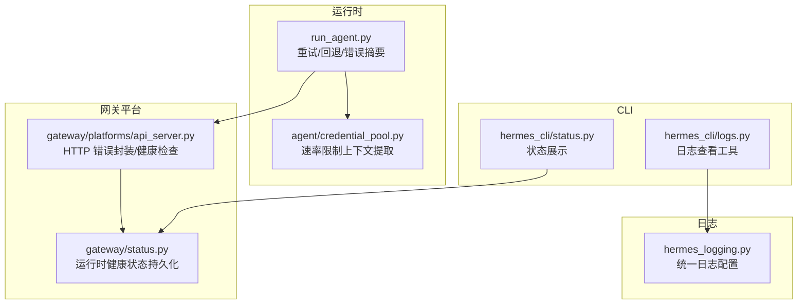
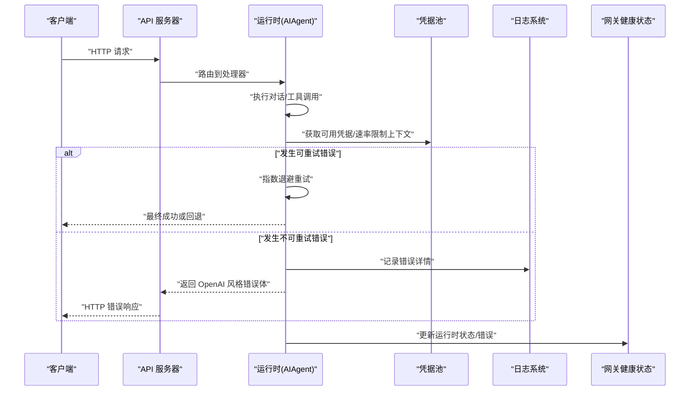
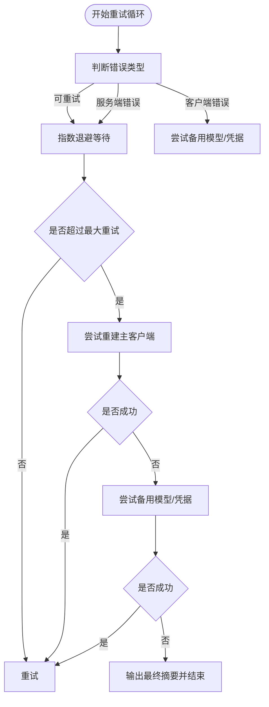
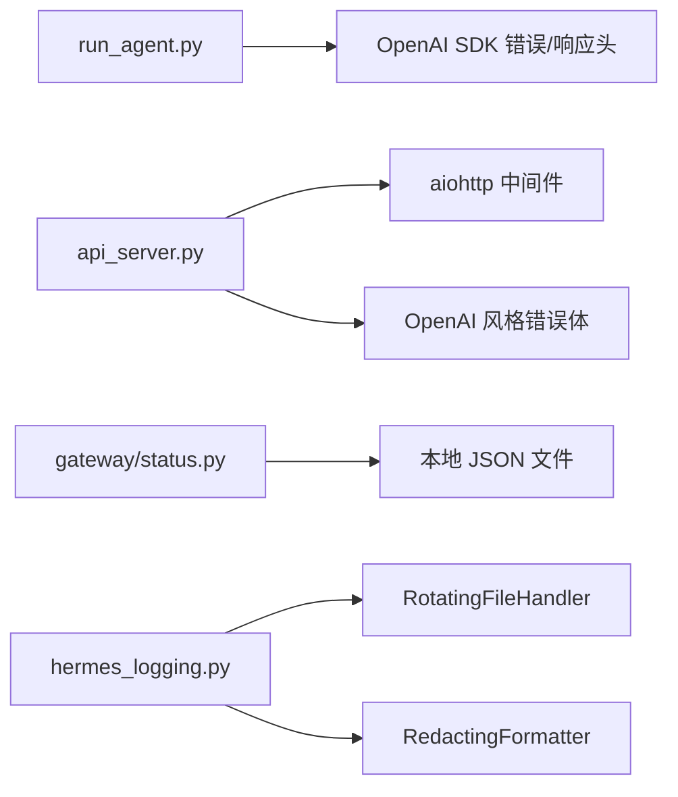

# 错误码和异常处理

<cite>
**本文引用的文件**
- [run_agent.py](file://run_agent.py)
- [api_server.py](file://gateway/platforms/api_server.py)
- [status.py](file://gateway/status.py)
- [hermes_logging.py](file://hermes_logging.py)
- [logs.py](file://hermes_cli/logs.py)
- [status.py](file://hermes_cli/status.py)
- [credential_pool.py](file://agent/credential_pool.py)
- [test_run_agent.py](file://tests/run_agent/test_run_agent.py)
- [test_gateway_runtime_health.py](file://tests/hermes_cli/test_gateway_runtime_health.py)
</cite>

## 目录
1. [简介](#简介)
2. [项目结构](#项目结构)
3. [核心组件](#核心组件)
4. [架构总览](#架构总览)
5. [详细组件分析](#详细组件分析)
6. [依赖分析](#依赖分析)
7. [性能考虑](#性能考虑)
8. [故障排查指南](#故障排查指南)
9. [结论](#结论)
10. [附录](#附录)

## 简介
本文件为 Hermes Agent 的错误码与异常处理参考文档，覆盖以下范围：
- API 接口返回的错误码（HTTP 状态码、业务错误、系统级错误）
- 异常分类、错误消息格式与调试信息
- 常见错误场景的诊断与修复建议
- API 调用失败时的重试机制与退避策略
- 系统健康检查接口与状态报告格式
- 日志记录规范与错误追踪方法
- 组件间错误传播机制与异常处理最佳实践

## 项目结构
围绕错误处理与异常管理的关键模块如下：
- 运行时重试与回退：run_agent.py
- API 服务器与错误响应：gateway/platforms/api_server.py
- 网关运行时健康状态：gateway/status.py
- 日志系统：hermes_logging.py、hermes_cli/logs.py
- CLI 状态命令：hermes_cli/status.py
- 凭据池与速率限制上下文提取：agent/credential_pool.py
- 测试验证：tests/run_agent/test_run_agent.py、tests/hermes_cli/test_gateway_runtime_health.py

图表来源
- [run_agent.py](file://run_agent.py)
- [api_server.py](file://gateway/platforms/api_server.py)
- [status.py](file://gateway/status.py)
- [hermes_logging.py](file://hermes_logging.py)
- [logs.py](file://hermes_cli/logs.py)
- [status.py](file://hermes_cli/status.py)
- [credential_pool.py](file://agent/credential_pool.py)

章节来源
- [run_agent.py](file://run_agent.py)
- [api_server.py](file://gateway/platforms/api_server.py)
- [status.py](file://gateway/status.py)
- [hermes_logging.py](file://hermes_logging.py)
- [logs.py](file://hermes_cli/logs.py)
- [status.py](file://hermes_cli/status.py)
- [credential_pool.py](file://agent/credential_pool.py)

## 核心组件
- 运行时重试与回退（run_agent.py）：实现指数退避、最大重试次数、客户端错误与服务端错误区分、速率限制检测与恢复、备用模型链路切换等。
- API 服务器（gateway/platforms/api_server.py）：提供 /health、/v1/* 等端点；统一使用 OpenAI 风格错误体；对请求体大小、鉴权、并发进行限制与保护。
- 网关运行时健康状态（gateway/status.py）：持久化网关运行态、退出原因、各平台状态与错误信息，供 CLI 查询。
- 日志系统（hermes_logging.py、hermes_cli/logs.py）：统一日志格式、轮转、脱敏、级别过滤与实时查看。
- CLI 状态命令（hermes_cli/status.py）：汇总环境、密钥、平台配置、网关服务状态等。
- 凭据池与速率限制上下文（agent/credential_pool.py）：从错误响应中解析速率限制重置时间、错误原因与消息。

章节来源
- [run_agent.py](file://run_agent.py)
- [api_server.py](file://gateway/platforms/api_server.py)
- [status.py](file://gateway/status.py)
- [hermes_logging.py](file://hermes_logging.py)
- [logs.py](file://hermes_cli/logs.py)
- [status.py](file://hermes_cli/status.py)
- [credential_pool.py](file://agent/credential_pool.py)

## 架构总览
下图展示错误处理在系统中的关键交互路径：客户端请求经 API 服务器进入，运行时层负责重试与回退，错误信息通过统一日志与健康状态持久化，CLI 提供状态与日志查看能力。

图表来源
- [api_server.py](file://gateway/platforms/api_server.py)
- [run_agent.py](file://run_agent.py)
- [credential_pool.py](file://agent/credential_pool.py)
- [status.py](file://gateway/status.py)
- [hermes_logging.py](file://hermes_logging.py)

## 详细组件分析

### API 服务器错误与健康检查
- 错误响应格式：统一采用 OpenAI 风格错误体，包含 message、type、param、code 等字段。
- 常见 HTTP 状态码：
  - 400：请求体无效、缺少必要字段、参数不合法
  - 401：API Key 无效
  - 403：跨域不允许（CORS）
  - 404：资源不存在（如响应/作业）
  - 413：请求体过大
  - 429：并发过多（runs）
  - 500：内部服务器错误
  - 501：功能未实现（cron 模块不可用）
- 健康检查：/health 返回 {"status": "ok", "platform": "hermes-agent"}

章节来源
- [api_server.py](file://gateway/platforms/api_server.py)

### 运行时重试与回退策略
- 可重试状态码：413、429、529
- 客户端错误判定：4xx 非重试码、通用 400（特定 OAuth 场景）、认证/鉴权/模型相关错误等
- 回退策略：
  - 先尝试备用模型/凭据
  - 若仍失败，重建主客户端连接（一次）
  - 达到最大重试后，输出最终摘要并终止
- 退避策略：指数退避，上限 60 秒；若带 Retry-After 或速率限制头，则据此计算等待时间；Cap 至 120 秒
- SSE 连接断开：捕获网络错误并中断代理任务

图表来源
- [run_agent.py](file://run_agent.py)

章节来源
- [run_agent.py](file://run_agent.py)
- [test_run_agent.py](file://tests/run_agent/test_run_agent.py)

### 速率限制上下文提取
- 从错误对象 body、headers 中提取 reason、message、reset_at
- 支持 Retry-After、X-RateLimit-Reset、响应体中的 reset_at、resets_at、retry_until
- 从错误消息中解析 quotaResetDelay/ms/s 等提示，推导重置时间
- 归一化后的上下文包含 reason、message、reset_at

章节来源
- [credential_pool.py](file://agent/credential_pool.py)

### 网关运行时健康状态
- 持久化文件：gateway_state.json，包含 gateway_state、exit_reason、platforms、updated_at 等
- 平台状态：每个平台独立记录 state、error_code、error_message、updated_at
- CLI 展示：_runtime_health_lines 读取并格式化输出，包含致命平台与启动原因

章节来源
- [status.py](file://gateway/status.py)
- [test_gateway_runtime_health.py](file://tests/hermes_cli/test_gateway_runtime_health.py)

### 日志记录与查看
- 统一日志：
  - agent.log：INFO+ 主活动日志
  - errors.log：WARNING+ 快速排障日志
  - 脱敏格式化器，避免敏感信息落盘
- CLI 日志查看：
  - 支持 tail/follow、级别过滤、会话过滤、相对时间范围
  - 支持 agent/errors/gateway 三类日志

章节来源
- [hermes_logging.py](file://hermes_logging.py)
- [logs.py](file://hermes_cli/logs.py)

### CLI 状态命令
- 展示环境、模型/提供商、API Key/OAuth、终端后端、消息平台、网关服务状态、计划任务等
- 深度检查：连通性测试（如 OpenRouter）、端口占用检测

章节来源
- [status.py](file://hermes_cli/status.py)

## 依赖分析
- 运行时重试依赖 OpenAI SDK 错误类型与响应头（Retry-After、X-RateLimit-Reset），以及 SSE 连接语义
- API 服务器依赖 aiohttp，提供中间件（CORS、请求体大小限制、安全头）
- 网关健康状态依赖本地 JSON 文件与进程元数据
- 日志系统依赖 RotatingFileHandler 与 RedactingFormatter

图表来源
- [run_agent.py](file://run_agent.py)
- [api_server.py](file://gateway/platforms/api_server.py)
- [status.py](file://gateway/status.py)
- [hermes_logging.py](file://hermes_logging.py)

章节来源
- [run_agent.py](file://run_agent.py)
- [api_server.py](file://gateway/platforms/api_server.py)
- [status.py](file://gateway/status.py)
- [hermes_logging.py](file://hermes_logging.py)

## 性能考虑
- 重试退避上限与 Cap：避免雪崩效应，控制最大等待时间
- SSE 断线快速中断：及时取消后台任务，减少无效调用
- 日志轮转与脱敏：降低磁盘 IO 与泄露风险
- 并发限制：/v1/runs 最大并发数防止资源耗尽

## 故障排查指南
- 常见错误与定位
  - 400/422：请求体/参数校验失败，检查必填字段与格式
  - 401：API Key 无效，确认密钥配置与权限
  - 404：资源不存在，确认 ID/路径正确
  - 413：请求体过大，调整内容长度或分片
  - 429/529：速率限制或服务过载，等待 reset_at 或降低并发
  - 500：内部错误，查看 agent.log 与 errors.log
  - 501：功能未实现，确认 cron 模块可用
- 重试与回退
  - 观察重试日志与等待提示，确认是否达到最大重试
  - 若为速率限制，优先等待 reset_at 或切换备用模型/凭据
- 健康状态
  - 使用 hermes status 查看网关服务状态与致命平台
  - 读取 gateway_state.json 获取最近一次启动问题与平台错误
- 日志查看
  - hermes logs -f 实时跟踪；--level/--session/--since 精准过滤
  - errors.log 快速定位警告/错误

章节来源
- [api_server.py](file://gateway/platforms/api_server.py)
- [run_agent.py](file://run_agent.py)
- [status.py](file://gateway/status.py)
- [logs.py](file://hermes_cli/logs.py)
- [status.py](file://hermes_cli/status.py)

## 结论
Hermes Agent 在 API 层采用统一的 OpenAI 风格错误体，在运行时层实现了稳健的重试与回退策略，并通过网关健康状态与日志系统提供完善的可观测性。遵循本文档的错误码与异常处理规范，可有效提升系统的稳定性与可维护性。

## 附录

### API 错误码与消息格式
- HTTP 状态码
  - 400：请求无效/参数缺失
  - 401：API Key 无效
  - 403：CORS 不允许
  - 404：资源不存在
  - 413：请求体过大
  - 429：并发过多/速率限制
  - 500：内部服务器错误
  - 501：功能未实现
- 错误体字段
  - message：错误描述
  - type：错误类型
  - param：参数名
  - code：业务错误码

章节来源
- [api_server.py](file://gateway/platforms/api_server.py)

### 运行时重试与回退要点
- 可重试：413、429、529
- 客户端错误：4xx 非重试码、通用 400（OAuth）、认证/鉴权/模型相关
- 退避：指数退避，上限 60 秒；支持 Retry-After 与速率限制头
- 最终兜底：备用模型/凭据、重建主客户端、输出最终摘要

章节来源
- [run_agent.py](file://run_agent.py)
- [test_run_agent.py](file://tests/run_agent/test_run_agent.py)

### 网关健康状态格式
- 字段：gateway_state、exit_reason、platforms（含 state、error_code、error_message）、updated_at
- 用途：CLI 展示与诊断

章节来源
- [status.py](file://gateway/status.py)
- [test_gateway_runtime_health.py](file://tests/hermes_cli/test_gateway_runtime_health.py)

### 日志记录规范
- 输出文件：agent.log（INFO+）、errors.log（WARNING+）
- 轮转：按大小与备份数控制
- 脱敏：RedactingFormatter 自动脱敏
- CLI：hermes logs 支持级别/会话/时间过滤与实时跟踪

章节来源
- [hermes_logging.py](file://hermes_logging.py)
- [logs.py](file://hermes_cli/logs.py)