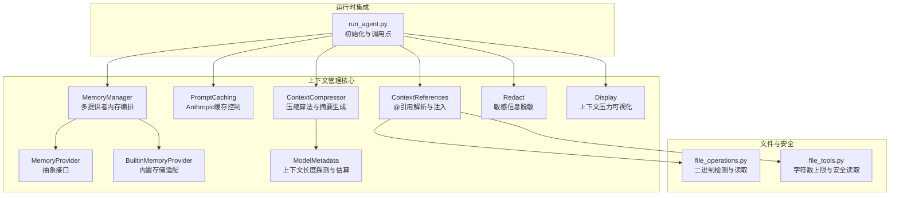
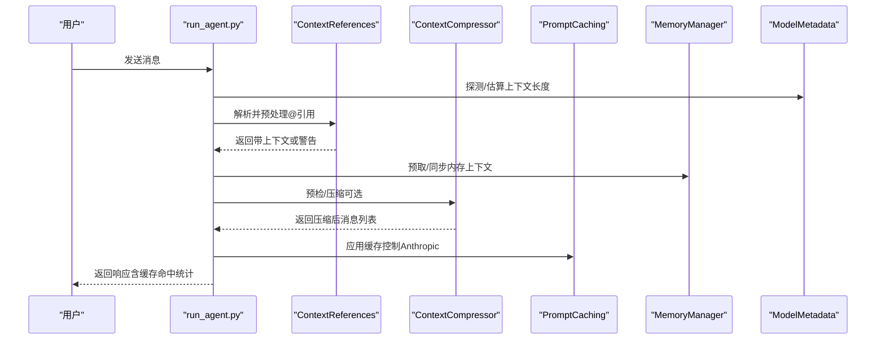
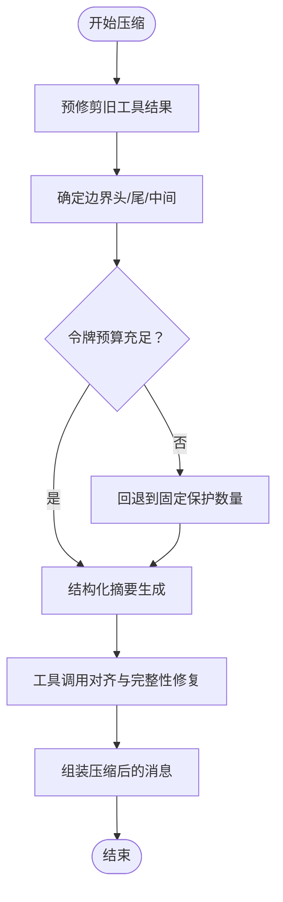
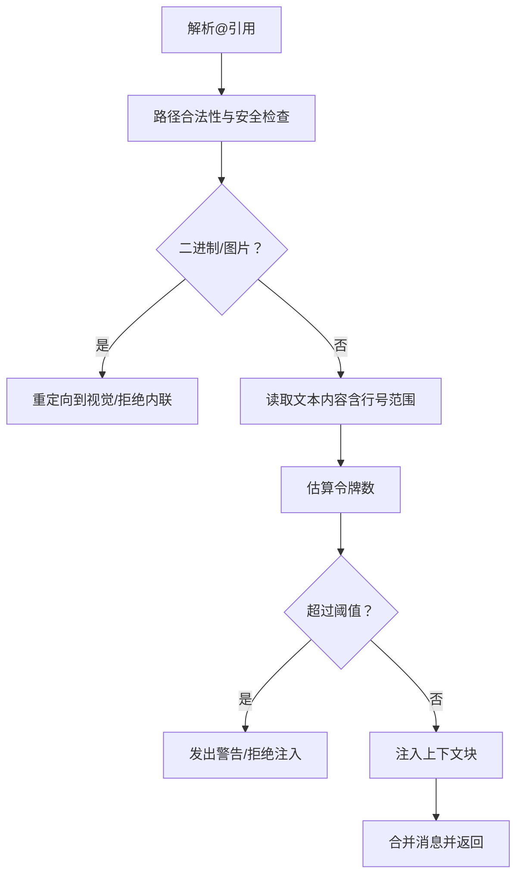
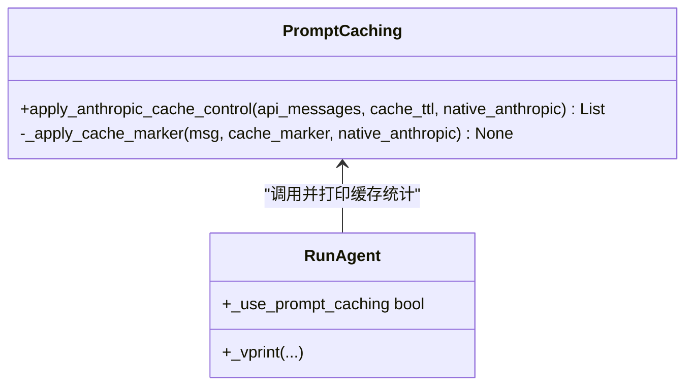
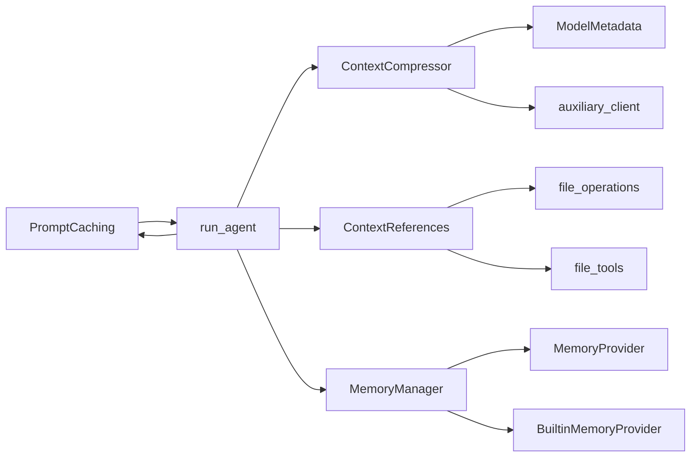

# 上下文文件管理

<cite>
**本文档引用的文件**
- [agent/context_compressor.py](file://agent/context_compressor.py)
- [agent/context_references.py](file://agent/context_references.py)
- [agent/prompt_caching.py](file://agent/prompt_caching.py)
- [agent/model_metadata.py](file://agent/model_metadata.py)
- [agent/memory_manager.py](file://agent/memory_manager.py)
- [agent/memory_provider.py](file://agent/memory_provider.py)
- [agent/builtin_memory_provider.py](file://agent/builtin_memory_provider.py)
- [agent/redact.py](file://agent/redact.py)
- [agent/display.py](file://agent/display.py)
- [run_agent.py](file://run_agent.py)
- [website/docs/developer-guide/context-compression-and-caching.md](file://website/docs/developer-guide/context-compression-and-caching.md)
- [auxiliary_client.py](file://agent/auxiliary_client.py)
- [file_operations.py](file://tools/file_operations.py)
- [file_tools.py](file://tools/file_tools.py)
- [test_file_read_guards.py](file://tests/tools/test_file_read_guards.py)
- [test_file_operations.py](file://tests/tools/test_file_operations.py)
- [test_long_context_tier_429.py](file://tests/run_agent/test_long_context_tier_429.py)
- [memory_setup.py](file://hermes_cli/memory_setup.py)
</cite>

## 目录
1. [简介](#简介)
2. [项目结构](#项目结构)
3. [核心组件](#核心组件)
4. [架构总览](#架构总览)
5. [详细组件分析](#详细组件分析)
6. [依赖关系分析](#依赖关系分析)
7. [性能考量](#性能考量)
8. [故障排查指南](#故障排查指南)
9. [结论](#结论)
10. [附录](#附录)

## 简介
本文件面向Hermes Agent的上下文文件管理能力，系统化阐述以下主题：
- 上下文压缩算法：信息筛选、冗余去除与重要性评估
- 上下文引用机制：在对话中引用与链接相关文档
- 提示缓存系统：缓存策略、失效机制与命中率优化
- 配置选项、性能调优与存储优化
- 大文件处理、编码转换与格式兼容性
- 上下文完整性保证与隐私保护措施

## 项目结构
围绕上下文文件管理的关键模块分布如下：
- 压缩与缓存：agent/context_compressor.py、agent/prompt_caching.py、agent/model_metadata.py
- 引用解析：agent/context_references.py
- 内存集成：agent/memory_manager.py、agent/memory_provider.py、agent/builtin_memory_provider.py
- 隐私与显示：agent/redact.py、agent/display.py
- 运行时集成：run_agent.py
- 文档与配置：website/docs/developer-guide/context-compression-and-caching.md
- 文件工具与安全限制：tools/file_operations.py、tools/file_tools.py、tests/tools/test_file_read_guards.py、tests/tools/test_file_operations.py
- 测试与验证：tests/run_agent/test_long_context_tier_429.py、hermes_cli/memory_setup.py

**图表来源**
- [agent/context_compressor.py:53-697](file://agent/context_compressor.py#L53-L697)
- [agent/prompt_caching.py:15-73](file://agent/prompt_caching.py#L15-L73)
- [agent/memory_manager.py:72-368](file://agent/memory_manager.py#L72-L368)
- [agent/memory_provider.py:42-232](file://agent/memory_provider.py#L42-L232)
- [agent/builtin_memory_provider.py:24-115](file://agent/builtin_memory_provider.py#L24-L115)
- [agent/context_references.py:61-206](file://agent/context_references.py#L61-L206)
- [agent/model_metadata.py:778-800](file://agent/model_metadata.py#L778-L800)
- [agent/redact.py:113-182](file://agent/redact.py#L113-L182)
- [agent/display.py:1005-1025](file://agent/display.py#L1005-L1025)
- [run_agent.py:1164-1190](file://run_agent.py#L1164-L1190)
- [tools/file_operations.py:492-527](file://tools/file_operations.py#L492-L527)
- [tools/file_tools.py:337-360](file://tools/file_tools.py#L337-L360)

**章节来源**
- [run_agent.py:1164-1190](file://run_agent.py#L1164-L1190)
- [website/docs/developer-guide/context-compression-and-caching.md:1-322](file://website/docs/developer-guide/context-compression-and-caching.md#L1-L322)

## 核心组件
- 上下文压缩器（ContextCompressor）：基于令牌预算的尾部保护、工具结果预修剪、结构化摘要生成与迭代更新、工具调用对齐与完整性修复。
- 上下文引用处理器（ContextReferences）：解析@file:/@folder:/@git:/@diff:/@staged:/@url:等引用，执行路径校验、二进制过滤、软硬阈值限制与上下文注入。
- 提示缓存（PromptCaching）：针对Anthropic的system_and_3缓存策略，注入cache_control标记以复用前缀。
- 模型元数据（ModelMetadata）：上下文长度探测、默认回退、端点查询与持久化缓存。
- 内存管理（MemoryManager/MemoryProvider/BuiltinMemoryProvider）：多提供者注册与生命周期管理，压缩前提取洞察。
- 隐私与显示（Redact/Display）：日志与输出脱敏、上下文压力可视化。

**章节来源**
- [agent/context_compressor.py:53-697](file://agent/context_compressor.py#L53-L697)
- [agent/context_references.py:61-206](file://agent/context_references.py#L61-L206)
- [agent/prompt_caching.py:15-73](file://agent/prompt_caching.py#L15-L73)
- [agent/model_metadata.py:778-800](file://agent/model_metadata.py#L778-L800)
- [agent/memory_manager.py:72-368](file://agent/memory_manager.py#L72-L368)
- [agent/memory_provider.py:42-232](file://agent/memory_provider.py#L42-L232)
- [agent/builtin_memory_provider.py:24-115](file://agent/builtin_memory_provider.py#L24-L115)
- [agent/redact.py:113-182](file://agent/redact.py#L113-L182)
- [agent/display.py:1005-1025](file://agent/display.py#L1005-L1025)

## 架构总览
Hermes在运行期通过run_agent.py集成上述组件：初始化模型元数据、构建压缩器与缓存策略，处理上下文引用，注入内存上下文，执行压缩与缓存，最后进行隐私脱敏与状态展示。

**图表来源**
- [run_agent.py:1164-1190](file://run_agent.py#L1164-L1190)
- [agent/context_references.py:135-206](file://agent/context_references.py#L135-L206)
- [agent/context_compressor.py:565-697](file://agent/context_compressor.py#L565-L697)
- [agent/prompt_caching.py:41-73](file://agent/prompt_caching.py#L41-L73)
- [agent/memory_manager.py:172-214](file://agent/memory_manager.py#L172-L214)
- [agent/model_metadata.py:778-800](file://agent/model_metadata.py#L778-L800)

## 详细组件分析

### 上下文压缩算法
- 信息筛选与冗余去除
  - 工具结果预修剪：移除超过阈值的旧工具输出，保留占位符，避免重复传输大量冗余内容。
  - 尾部保护：按令牌预算从末尾向前累加，确保最近消息不被压缩；若预算保护的消息过少则回退到固定数量保护。
  - 边界对齐：避免拆分tool_call与tool_result组，必要时调整起止边界以保持完整性。
- 重要性评估与摘要生成
  - 结构化模板：Goal、Progress（Done/In Progress/Blocked）、Key Decisions、Relevant Files、Next Steps、Critical Context。
  - 预算分配：摘要令牌预算与压缩内容成比例，最小与最大值受模型上下文窗口约束。
  - 迭代更新：利用上次摘要增量更新，保留跨多次压缩的连续信息。
- 完整性保证与错误处理
  - 工具对齐清理：移除孤儿结果、为缺失结果注入桩结果，确保API不会收到不匹配的call_id。
  - 失败冷却：摘要生成失败进入冷却期，避免频繁重试造成资源浪费。
- 性能与可观测性
  - 预检估算：在实际调用前使用粗略估算判断是否需要压缩，降低API开销。
  - 使用统计：记录最后一次提示/补全/总令牌用量，便于诊断与优化。

**图表来源**
- [agent/context_compressor.py:565-697](file://agent/context_compressor.py#L565-L697)
- [agent/context_compressor.py:155-186](file://agent/context_compressor.py#L155-L186)
- [agent/context_compressor.py:510-560](file://agent/context_compressor.py#L510-L560)
- [agent/context_compressor.py:253-390](file://agent/context_compressor.py#L253-L390)
- [agent/context_compressor.py:412-471](file://agent/context_compressor.py#L412-L471)

**章节来源**
- [agent/context_compressor.py:53-697](file://agent/context_compressor.py#L53-L697)
- [website/docs/developer-guide/context-compression-and-caching.md:82-175](file://website/docs/developer-guide/context-compression-and-caching.md#L82-L175)

### 上下文引用机制
- 引用语法与解析
  - 支持@file:path[:line-range]、@folder:path、@git:n、@diff、@staged、@url:https:// 等。
  - 解析后提取原始片段、类型、目标路径及行号范围。
- 路径与安全控制
  - 绝对/相对路径解析，受限工作区根目录，默认禁止超出当前工作目录。
  - 敏感路径与文件白名单拦截（如.ssh/.aws/.kube等），防止泄露凭证。
  - 二进制文件拒绝内联，图片自动重定向至视觉分析工具。
- 注入与阈值
  - 计算注入令牌数，超过软阈值给出警告，超过硬阈值拒绝注入。
  - 注入时在消息中追加“附加上下文”区块，同时保留原始消息并可附加警告。
- 编码与格式
  - 文本文件按UTF-8读取；根据扩展名推断语言用于代码围栏高亮。
  - 目录列出采用可见条目遍历，限制最大条目数并标注元信息。

**图表来源**
- [agent/context_references.py:61-106](file://agent/context_references.py#L61-L106)
- [agent/context_references.py:135-206](file://agent/context_references.py#L135-L206)
- [agent/context_references.py:239-264](file://agent/context_references.py#L239-L264)
- [agent/context_references.py:266-281](file://agent/context_references.py#L266-L281)
- [agent/context_references.py:283-306](file://agent/context_references.py#L283-L306)
- [agent/context_references.py:332-343](file://agent/context_references.py#L332-L343)
- [agent/context_references.py:391-399](file://agent/context_references.py#L391-L399)
- [tools/file_operations.py:492-527](file://tools/file_operations.py#L492-L527)
- [tools/file_tools.py:337-360](file://tools/file_tools.py#L337-L360)

**章节来源**
- [agent/context_references.py:61-206](file://agent/context_references.py#L61-L206)
- [tools/file_operations.py:492-527](file://tools/file_operations.py#L492-L527)
- [tools/file_tools.py:337-360](file://tools/file_tools.py#L337-L360)
- [test_file_read_guards.py:108-135](file://tests/tools/test_file_read_guards.py#L108-L135)
- [test_file_operations.py:204-226](file://tests/tools/test_file_operations.py#L204-L226)

### 提示缓存系统（Anthropic）
- 策略与实现
  - system_and_3：系统提示+最近3条非系统消息作为缓存断点，最多4个断点。
  - 深拷贝消息并注入cache_control标记，支持字符串与列表两种内容形态。
- 失效与交互
  - 断点要求前缀完全匹配，插入/删除中间消息会破坏后续缓存。
  - 压缩后压缩区域缓存失效，但系统提示缓存存活，滚动窗口1-2轮内恢复。
- TTL与启用条件
  - 默认5分钟，长会话可设为1小时；仅当模型为Claude且提供方支持cache_control时启用。
- 命中率优化
  - 保持系统提示稳定不变；避免在压缩后立即改变消息顺序；合理设置TTL。

**图表来源**
- [agent/prompt_caching.py:15-73](file://agent/prompt_caching.py#L15-L73)
- [run_agent.py:7767-7784](file://run_agent.py#L7767-L7784)

**章节来源**
- [agent/prompt_caching.py:15-73](file://agent/prompt_caching.py#L15-L73)
- [website/docs/developer-guide/context-compression-and-caching.md:242-322](file://website/docs/developer-guide/context-compression-and-caching.md#L242-L322)
- [run_agent.py:7767-7784](file://run_agent.py#L7767-L7784)

### 模型元数据与上下文长度探测
- 探测顺序与缓存
  - 显式配置覆盖 → 持久化缓存 → 自定义端点元数据 → 本地服务器查询 → Anthropic /v1/models → OpenRouter → Nous后缀匹配 → 模型库默认 → 回退默认。
- 上下文长度回退与保存
  - 多级探测失败时采用回退策略；成功后持久化到HERMES_HOME下的缓存文件。
- 运行期应用
  - 压缩器与运行时均依赖该能力，确保阈值与预算计算准确。

**章节来源**
- [agent/model_metadata.py:778-800](file://agent/model_metadata.py#L778-L800)
- [agent/model_metadata.py:517-557](file://agent/model_metadata.py#L517-L557)
- [agent/context_compressor.py:88-94](file://agent/context_compressor.py#L88-L94)

### 内存管理与上下文整合
- 多提供者编排
  - 内置提供者始终激活；最多一个外部提供者；失败不影响其他提供者。
  - 提供系统提示块、预取、同步、工具schema路由与生命周期钩子。
- 压缩前洞察提取
  - on_pre_compress钩子允许提供者将即将被压缩的历史提炼为摘要输入，提升压缩质量。
- 初始化与配置
  - hermes_cli/memory_setup.py提供交互式安装与配置向导，支持插件依赖安装与后置设置。

**章节来源**
- [agent/memory_manager.py:72-368](file://agent/memory_manager.py#L72-L368)
- [agent/memory_provider.py:42-232](file://agent/memory_provider.py#L42-L232)
- [agent/builtin_memory_provider.py:24-115](file://agent/builtin_memory_provider.py#L24-L115)
- [hermes_cli/memory_setup.py:292-331](file://hermes_cli/memory_setup.py#L292-L331)

### 隐私保护与上下文压力可视化
- 日志与输出脱敏
  - 基于正则的密钥、令牌、数据库连接串、私钥块等识别与掩码；支持环境变量赋值与JSON字段识别。
- 上下文压力显示
  - CLI以进度条与百分比展示接近压缩阈值的状态，帮助用户感知上下文压力。

**章节来源**
- [agent/redact.py:113-182](file://agent/redact.py#L113-L182)
- [agent/display.py:1005-1025](file://agent/display.py#L1005-L1025)

## 依赖关系分析
- 组件耦合
  - ContextCompressor依赖ModelMetadata进行上下文长度探测，依赖auxiliary_client进行摘要LLM调用。
  - ContextReferences依赖tools.file_operations与tools.file_tools进行文件读取与安全限制。
  - PromptCaching独立于具体模型提供商，仅依赖消息格式约定。
  - MemoryManager解耦各提供者，通过抽象接口统一调度。
- 外部依赖
  - OpenRouter模型元数据API、Anthropic /v1/models、本地服务器探测（Ollama/LM Studio/vLLM/llama.cpp）。
  - 文件系统与进程调用（git、rg、head等）。

**图表来源**
- [agent/context_compressor.py:20-24](file://agent/context_compressor.py#L20-L24)
- [auxiliary_client.py:674-674](file://agent/auxiliary_client.py#L674-L674)
- [agent/context_references.py:320-330](file://agent/context_references.py#L320-L330)
- [agent/prompt_caching.py:41-73](file://agent/prompt_caching.py#L41-L73)
- [agent/memory_manager.py:72-131](file://agent/memory_manager.py#L72-L131)
- [run_agent.py:1164-1190](file://run_agent.py#L1164-L1190)

**章节来源**
- [agent/context_compressor.py:20-24](file://agent/context_compressor.py#L20-L24)
- [agent/context_references.py:320-330](file://agent/context_references.py#L320-L330)
- [agent/memory_manager.py:72-131](file://agent/memory_manager.py#L72-L131)
- [run_agent.py:1164-1190](file://run_agent.py#L1164-L1190)

## 性能考量
- 压缩阈值与预算
  - threshold（默认0.50）决定触发时机；target_ratio（默认0.20）控制尾部保护预算；protect_last_n（默认20）确保最少尾部消息。
  - 对于超大上下文模型，摘要预算按内容规模缩放，上限受模型上下文窗口与常量上限共同约束。
- 预检与估算
  - 预飞行估算避免不必要的API调用；压缩后再次估算以量化节省效果。
- 缓存命中优化
  - Anthropic缓存断点数量有限，需保持系统提示稳定、避免中间插入消息；TTL根据会话时长选择。
- 文件读取安全
  - 字符数上限与二进制检测双重保障，避免大文件与二进制内容进入上下文。

**章节来源**
- [website/docs/developer-guide/context-compression-and-caching.md:50-80](file://website/docs/developer-guide/context-compression-and-caching.md#L50-L80)
- [agent/context_compressor.py:136-139](file://agent/context_compressor.py#L136-L139)
- [agent/context_compressor.py:191-201](file://agent/context_compressor.py#L191-L201)
- [tools/file_tools.py:350-360](file://tools/file_tools.py#L350-L360)
- [tools/file_operations.py:500-527](file://tools/file_operations.py#L500-L527)

## 故障排查指南
- 压缩未触发或过度
  - 检查threshold与context_length是否符合预期；确认预检估算与实际令牌差异。
  - 参考测试用例验证阈值与预算行为。
- 摘要失败与冷却
  - 摘要生成异常会进入冷却期，避免反复重试；检查摘要模型配置与网络可用性。
- 缓存未命中
  - 检查消息顺序是否发生插入/删除；确认系统提示是否变更；核对TTL设置。
- 引用注入被拒
  - 查看软/硬阈值警告；确认路径是否在允许范围内；检查是否为二进制/敏感文件。
- 上下文压力持续告警
  - 评估对话密度与工具输出体量；考虑增大尾部保护或减少工具结果大小。

**章节来源**
- [tests/run_agent/test_long_context_tier_429.py:116-147](file://tests/run_agent/test_long_context_tier_429.py#L116-L147)
- [agent/context_compressor.py:264-390](file://agent/context_compressor.py#L264-L390)
- [agent/prompt_caching.py:41-73](file://agent/prompt_caching.py#L41-L73)
- [agent/context_references.py:170-190](file://agent/context_references.py#L170-L190)
- [agent/display.py:1005-1025](file://agent/display.py#L1005-L1025)

## 结论
Hermes的上下文文件管理通过“压缩+缓存+引用+内存+隐私”的协同设计，在保证上下文完整性与安全性的同时，显著降低了令牌成本与运行时开销。建议在生产环境中结合模型上下文长度、会话特征与工具输出体量，合理配置阈值、预算与TTL，并配合内存提供者的洞察提取与引用注入的安全策略，获得最佳的稳定性与性能表现。

## 附录
- 配置要点
  - compression.enabled/threshold/target_ratio/protect_last_n/summary_model
  - model.cache_ttl（Anthropic）
- 关键参数参考
  - 200K上下文模型默认阈值100K、尾部预算20K、最大摘要10K
- 相关实现位置
  - 压缩：agent/context_compressor.py
  - 引用：agent/context_references.py
  - 缓存：agent/prompt_caching.py
  - 元数据：agent/model_metadata.py
  - 内存：agent/memory_manager.py、agent/memory_provider.py、agent/builtin_memory_provider.py
  - 隐私：agent/redact.py
  - 运行时：run_agent.py

**章节来源**
- [website/docs/developer-guide/context-compression-and-caching.md:50-80](file://website/docs/developer-guide/context-compression-and-caching.md#L50-L80)
- [run_agent.py:1164-1190](file://run_agent.py#L1164-L1190)