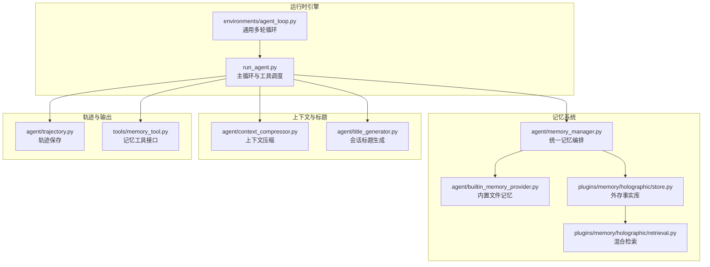
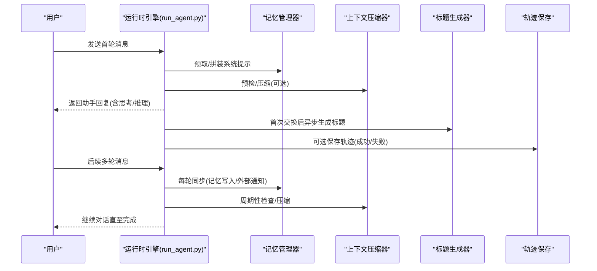
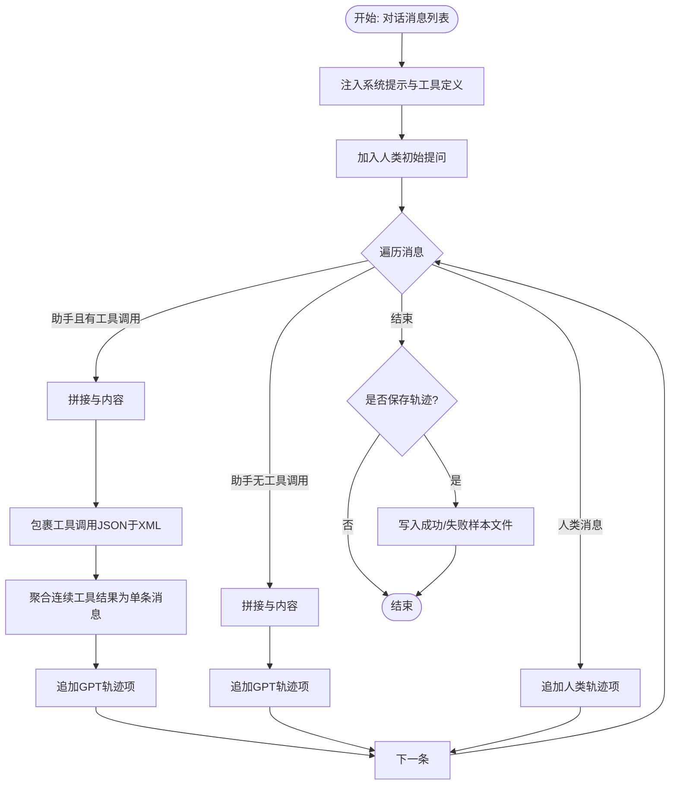
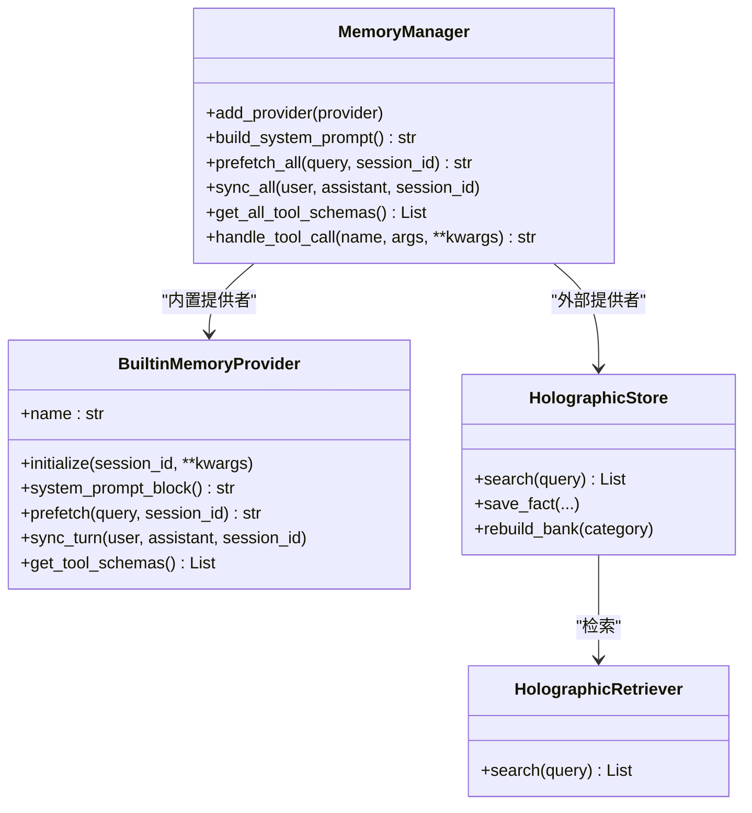
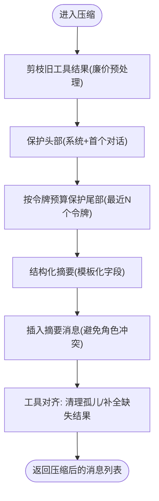
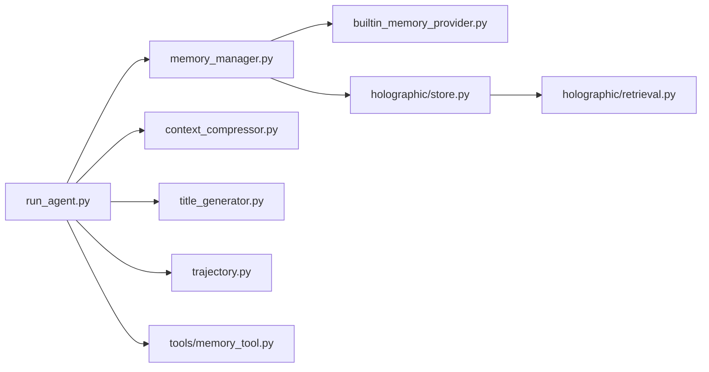

# 代理学习循环

<cite>
**本文引用的文件**
- [run_agent.py](file://run_agent.py)
- [agent/trajectory.py](file://agent/trajectory.py)
- [agent/title_generator.py](file://agent/title_generator.py)
- [agent/context_compressor.py](file://agent/context_compressor.py)
- [agent/memory_manager.py](file://agent/memory_manager.py)
- [agent/builtin_memory_provider.py](file://agent/builtin_memory_provider.py)
- [environments/agent_loop.py](file://environments/agent_loop.py)
- [tools/memory_tool.py](file://tools/memory_tool.py)
- [plugins/memory/holographic/store.py](file://plugins/memory/holographic/store.py)
- [plugins/memory/holographic/retrieval.py](file://plugins/memory/holographic/retrieval.py)
- [website/docs/developer-guide/trajectory-format.md](file://website/docs/developer-guide/trajectory-format.md)
</cite>

## 目录
1. [引言](#引言)
2. [项目结构](#项目结构)
3. [核心组件](#核心组件)
4. [架构总览](#架构总览)
5. [详细组件分析](#详细组件分析)
6. [依赖分析](#依赖分析)
7. [性能考量](#性能考量)
8. [故障排除指南](#故障排除指南)
9. [结论](#结论)
10. [附录](#附录)

## 引言
本文件系统性阐述 Hermes Agent 的“代理学习循环”，围绕以下目标展开：经验收集（轨迹）、技能创建（基于对话回顾与工具调用）、记忆巩固（内置与外部记忆提供者）、知识提取（标题自动生成、上下文压缩与轨迹保存）。文档同时覆盖轨迹记录机制（对话历史的存储、压缩与检索）、标题生成器的作用与实现、学习循环的配置选项、性能优化建议以及常见问题排查，并给出可操作的使用案例。

## 项目结构
学习循环横跨运行时引擎、记忆系统、上下文压缩、标题生成与轨迹保存等多个模块，形成闭环：对话在运行时引擎中推进，记忆系统提供长期与短期记忆，上下文压缩保障长会话稳定性，标题生成器提升会话可读性，轨迹保存用于后续训练与复盘。

图示来源
- [run_agent.py](file://run_agent.py)
- [environments/agent_loop.py](file://environments/agent_loop.py)
- [agent/memory_manager.py](file://agent/memory_manager.py)
- [agent/builtin_memory_provider.py](file://agent/builtin_memory_provider.py)
- [agent/context_compressor.py](file://agent/context_compressor.py)
- [agent/title_generator.py](file://agent/title_generator.py)
- [agent/trajectory.py](file://agent/trajectory.py)
- [tools/memory_tool.py](file://tools/memory_tool.py)
- [plugins/memory/holographic/store.py](file://plugins/memory/holographic/store.py)
- [plugins/memory/holographic/retrieval.py](file://plugins/memory/holographic/retrieval.py)

章节来源
- [run_agent.py](file://run_agent.py)
- [environments/agent_loop.py](file://environments/agent_loop.py)
- [agent/memory_manager.py](file://agent/memory_manager.py)
- [agent/builtin_memory_provider.py](file://agent/builtin_memory_provider.py)
- [agent/context_compressor.py](file://agent/context_compressor.py)
- [agent/title_generator.py](file://agent/title_generator.py)
- [agent/trajectory.py](file://agent/trajectory.py)
- [tools/memory_tool.py](file://tools/memory_tool.py)
- [plugins/memory/holographic/store.py](file://plugins/memory/holographic/store.py)
- [plugins/memory/holographic/retrieval.py](file://plugins/memory/holographic/retrieval.py)

## 核心组件
- 运行时引擎与工具循环：负责多轮对话推进、工具解析与执行、错误处理与状态记录。
- 记忆管理器：统一编排内置与外部记忆提供者，提供系统提示拼装、预取、同步与工具路由。
- 上下文压缩器：在接近模型上下文阈值时进行“剪枝-保护尾部-结构化摘要-迭代更新”的压缩流程。
- 标题生成器：异步生成会话标题，避免首响应延迟，提升会话可读性。
- 轨迹保存：将对话转换为训练友好的轨迹格式并持久化，支持成功与失败样本分离。

章节来源
- [run_agent.py](file://run_agent.py)
- [environments/agent_loop.py](file://environments/agent_loop.py)
- [agent/memory_manager.py](file://agent/memory_manager.py)
- [agent/context_compressor.py](file://agent/context_compressor.py)
- [agent/title_generator.py](file://agent/title_generator.py)
- [agent/trajectory.py](file://agent/trajectory.py)

## 架构总览
学习循环以“对话推进—记忆检索—上下文压缩—标题生成—轨迹保存”为主线，贯穿“经验收集—技能创建—记忆巩固—知识提取”。

图示来源
- [run_agent.py](file://run_agent.py)
- [agent/memory_manager.py](file://agent/memory_manager.py)
- [agent/context_compressor.py](file://agent/context_compressor.py)
- [agent/title_generator.py](file://agent/title_generator.py)
- [agent/trajectory.py](file://agent/trajectory.py)

## 详细组件分析

### 组件A：经验收集与轨迹记录
- 轨迹格式转换：将内部消息格式转换为训练友好的轨迹格式，确保每轮 GPT 输出包含<think>块与工具调用/结果的 XML 包裹，便于后续训练与评估。
- 轨迹保存：根据完成状态分别写入成功或失败样本文件，支持 CLI 与批处理场景。
- 轨迹控制：通过配置项控制是否保存轨迹，CLI 提供开关，批处理默认保存。

图示来源
- [run_agent.py](file://run_agent.py)
- [agent/trajectory.py](file://agent/trajectory.py)

章节来源
- [run_agent.py](file://run_agent.py)
- [agent/trajectory.py](file://agent/trajectory.py)
- [website/docs/developer-guide/trajectory-format.md](file://website/docs/developer-guide/trajectory-format.md)

### 组件B：技能创建与记忆巩固
- 技能回顾提示：在对话结束后触发“技能回顾”提示，引导模型识别可复用方法并创建/更新技能。
- 内置记忆提供者：始终注册，负责 MEMORY.md 与 USER.md 的系统提示注入与工具拦截（不参与标准工具注册）。
- 外部记忆提供者：由 MemoryManager 编排，支持系统提示拼装、预取、同步与工具路由；失败不影响其他提供者。
- 记忆工具接口：提供 add/replace/remove 等动作，指导模型何时保存用户画像、环境事实与经验教训。

图示来源
- [agent/memory_manager.py](file://agent/memory_manager.py)
- [agent/builtin_memory_provider.py](file://agent/builtin_memory_provider.py)
- [plugins/memory/holographic/store.py](file://plugins/memory/holographic/store.py)
- [plugins/memory/holographic/retrieval.py](file://plugins/memory/holographic/retrieval.py)

章节来源
- [run_agent.py](file://run_agent.py)
- [agent/memory_manager.py](file://agent/memory_manager.py)
- [agent/builtin_memory_provider.py](file://agent/builtin_memory_provider.py)
- [tools/memory_tool.py](file://tools/memory_tool.py)
- [plugins/memory/holographic/store.py](file://plugins/memory/holographic/store.py)
- [plugins/memory/holographic/retrieval.py](file://plugins/memory/holographic/retrieval.py)

### 组件C：上下文压缩与知识提取
- 压缩策略：先剪枝旧工具结果、保护头部与尾部、结构化摘要、迭代更新摘要，降低上下文占用并保持任务连贯性。
- 工具对齐：修复被压缩导致的工具调用/结果配对孤儿问题，保证 API 输入合法。
- 标题生成：在首次用户-助手交换后异步生成标题，避免影响首响应延迟；仅在必要时生成，防止重复。

图示来源
- [agent/context_compressor.py](file://agent/context_compressor.py)
- [agent/title_generator.py](file://agent/title_generator.py)

章节来源
- [agent/context_compressor.py](file://agent/context_compressor.py)
- [agent/title_generator.py](file://agent/title_generator.py)

### 组件D：通用多轮循环（可复用）
- 支持标准 OpenAI 规范的工具调用，兼容多种服务器类型（OpenAI/VLLM/SGLang/OpenRouter/ManagedServer）。
- 提供线程池执行同步工具调用，避免事件循环死锁；支持最大轮次限制、推理内容抽取、工具错误记录等。

章节来源
- [environments/agent_loop.py](file://environments/agent_loop.py)

## 依赖分析
- 运行时引擎依赖记忆管理器构建系统提示、预取与同步；依赖上下文压缩器进行长会话稳定；依赖轨迹保存与标题生成器增强可解释性与可复用性。
- 记忆管理器依赖内置与外部提供者，外部提供者通过工具 schema 路由到具体实现。
- 上下文压缩器依赖辅助模型进行结构化摘要，依赖工具对齐逻辑保证 API 合法性。
- 标题生成器依赖辅助 LLM 客户端，采用轻量模型异步生成，避免阻塞主线程。

图示来源
- [run_agent.py](file://run_agent.py)
- [agent/memory_manager.py](file://agent/memory_manager.py)
- [agent/context_compressor.py](file://agent/context_compressor.py)
- [agent/title_generator.py](file://agent/title_generator.py)
- [agent/trajectory.py](file://agent/trajectory.py)
- [agent/builtin_memory_provider.py](file://agent/builtin_memory_provider.py)
- [tools/memory_tool.py](file://tools/memory_tool.py)
- [plugins/memory/holographic/store.py](file://plugins/memory/holographic/store.py)
- [plugins/memory/holographic/retrieval.py](file://plugins/memory/holographic/retrieval.py)

## 性能考量
- 上下文压缩
  - 预剪枝工具结果减少大体积中间结果对摘要模型的压力。
  - 尾部保护采用“令牌预算”而非固定消息数，适配不同上下文窗口大小。
  - 结构化摘要模板与迭代更新减少信息丢失，提高后续任务一致性。
- 标题生成
  - 使用最便宜/最快的辅助模型，异步执行，避免首响应延迟。
  - 对超长输入截断，限制请求规模。
- 轨迹保存
  - 成功/失败样本分离，便于后续筛选高质量样本。
  - 仅在启用时写入，避免磁盘 IO 开销。
- 多轮循环
  - 线程池大小可配置，避免工具执行阻塞；对慢工具与队列长度进行日志告警，便于诊断。

章节来源
- [agent/context_compressor.py](file://agent/context_compressor.py)
- [agent/title_generator.py](file://agent/title_generator.py)
- [agent/trajectory.py](file://agent/trajectory.py)
- [environments/agent_loop.py](file://environments/agent_loop.py)

## 故障排除指南
- 上下文压缩失败
  - 现象：摘要模型不可用或生成失败，进入冷却时间。
  - 处理：等待冷却时间结束；检查辅助模型可用性与配置；确认网络与鉴权。
- 工具调用/结果配对异常
  - 现象：API 报错“缺少对应工具调用/结果”。
  - 处理：压缩器已内置对齐逻辑，若仍出现，检查消息边界与工具调用 ID 是否一致。
- 标题生成失败
  - 现象：异步生成失败或未设置标题。
  - 处理：检查会话数据库可写、辅助 LLM 客户端可用；确认会话 ID 有效。
- 轨迹保存失败
  - 现象：写入文件异常或权限不足。
  - 处理：检查文件路径与权限；确认磁盘空间；查看日志警告。
- 多轮循环卡顿
  - 现象：工具执行耗时过长或线程池饱和。
  - 处理：增大工具线程池大小；优化工具实现；关注日志中的慢工具告警。

章节来源
- [agent/context_compressor.py](file://agent/context_compressor.py)
- [agent/title_generator.py](file://agent/title_generator.py)
- [agent/trajectory.py](file://agent/trajectory.py)
- [environments/agent_loop.py](file://environments/agent_loop.py)

## 结论
Hermes Agent 的学习循环通过“经验收集—技能创建—记忆巩固—知识提取”的闭环，结合上下文压缩、标题生成与轨迹保存，显著提升了长会话稳定性与可复用性。合理配置与监控可进一步优化性能与可靠性。

## 附录

### 学习循环配置选项（节选）
- 轨迹保存
  - 配置项：agent.save_trajectories（默认关闭）
  - CLI：--save-trajectories
  - 行为：启用后在每轮结束保存轨迹，批处理默认保存
- 上下文压缩
  - 关键参数：阈值百分比、保护头部数量、保护尾部令牌预算、摘要目标比例、摘要模型覆盖
- 标题生成
  - 模型：使用辅助 LLM 客户端（最便宜/最快）
  - 异步：后台线程生成，避免首响应延迟
- 多轮循环
  - 线程池大小：可配置，避免工具执行阻塞
  - 最大轮次：防止无限循环

章节来源
- [website/docs/developer-guide/trajectory-format.md](file://website/docs/developer-guide/trajectory-format.md)
- [agent/context_compressor.py](file://agent/context_compressor.py)
- [agent/title_generator.py](file://agent/title_generator.py)
- [environments/agent_loop.py](file://environments/agent_loop.py)

### 实际使用案例
- 案例1：长链路开发任务
  - 场景：多轮调试、多次工具调用、大量中间结果。
  - 处理：开启上下文压缩，系统自动剪枝旧工具结果并生成摘要；完成后保存轨迹，用于后续复盘与微调。
- 案例2：用户画像与偏好记忆
  - 场景：用户反复强调风格、偏好与期望。
  - 处理：运行时引擎触发“技能回顾”提示，模型识别可复用方法并创建技能；同时通过记忆工具保存用户画像与环境事实。
- 案例3：多平台会话管理
  - 场景：跨平台会话需要快速定位主题。
  - 处理：首次交换后异步生成标题，提升会话检索效率；同时启用轨迹保存，便于后续分析。

章节来源
- [run_agent.py](file://run_agent.py)
- [tools/memory_tool.py](file://tools/memory_tool.py)
- [agent/title_generator.py](file://agent/title_generator.py)
- [agent/trajectory.py](file://agent/trajectory.py)