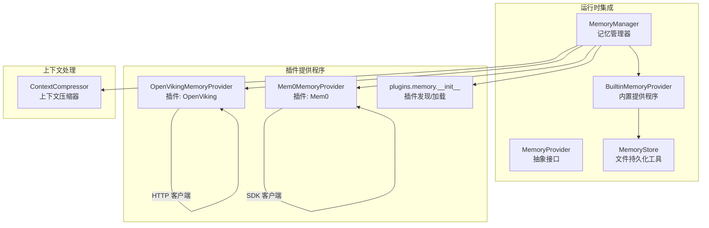
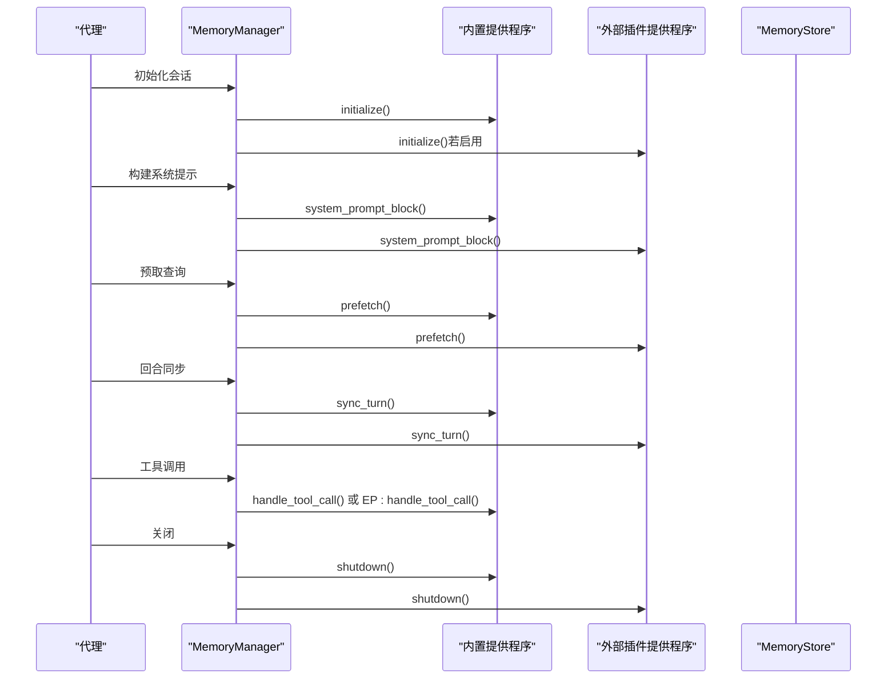
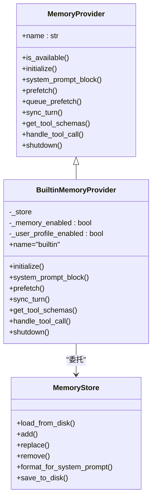
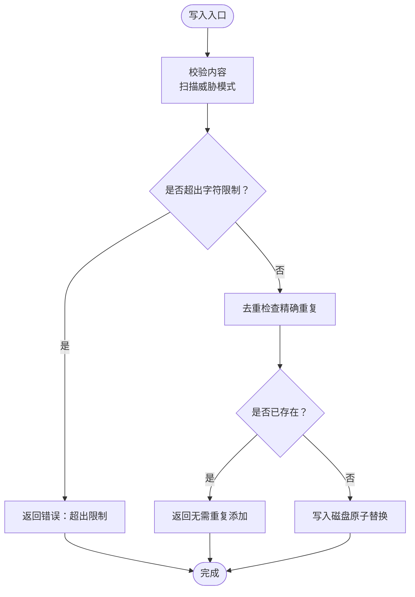
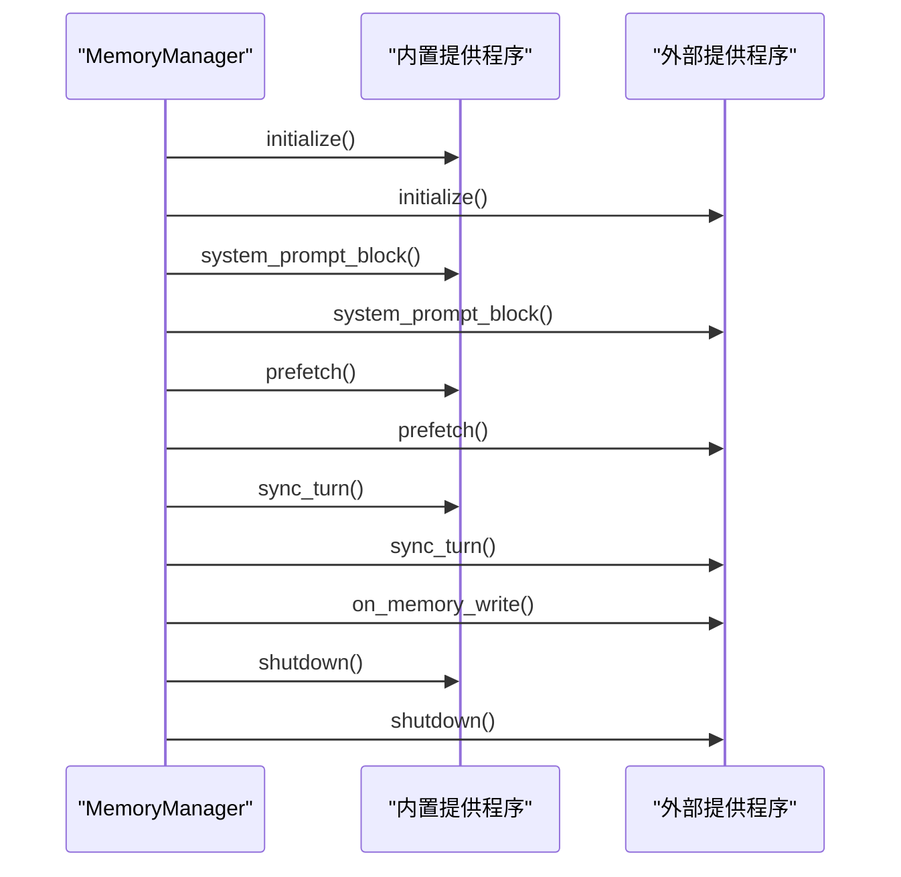
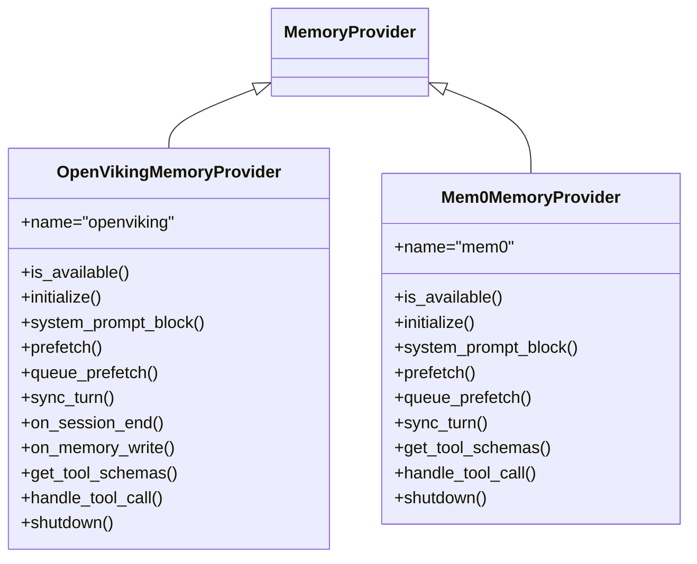
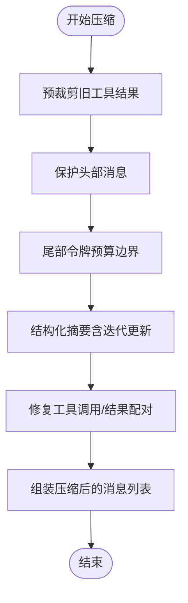
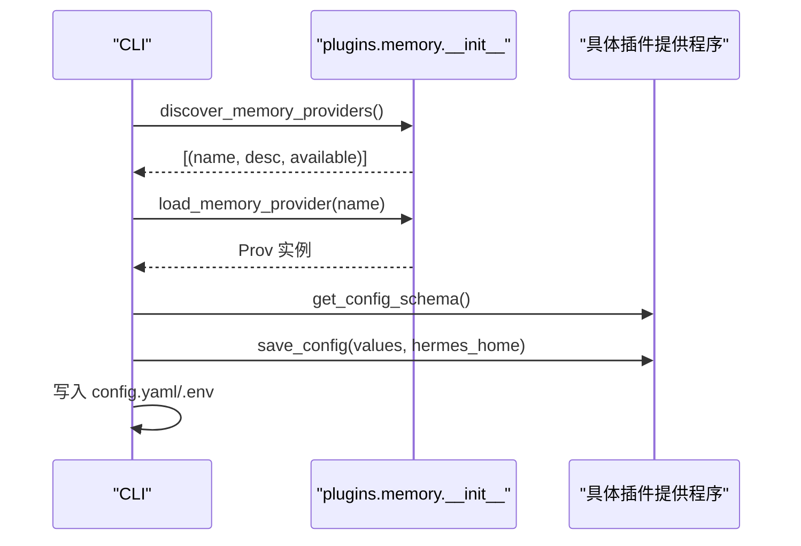
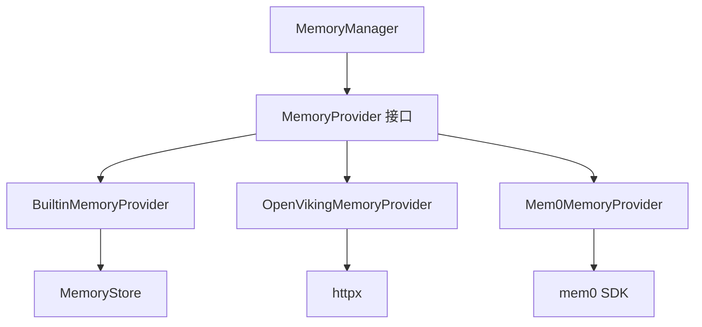

# 内存管理

<cite>
**本文引用的文件**
- [memory_manager.py](file://agent/memory_manager.py)
- [memory_provider.py](file://agent/memory_provider.py)
- [builtin_memory_provider.py](file://agent/builtin_memory_provider.py)
- [memory_tool.py](file://tools/memory_tool.py)
- [context_compressor.py](file://agent/context_compressor.py)
- [memory_setup.py](file://hermes_cli/memory_setup.py)
- [plugins_memory_init.py](file://plugins/memory/__init__.py)
- [openviking_init.py](file://plugins/memory/openviking/__init__.py)
- [mem0_init.py](file://plugins/memory/mem0/__init__.py)
- [test_memory_provider.py](file://tests/agent/test_memory_provider.py)
</cite>

## 目录
1. [简介](#简介)
2. [项目结构](#项目结构)
3. [核心组件](#核心组件)
4. [架构总览](#架构总览)
5. [详细组件分析](#详细组件分析)
6. [依赖分析](#依赖分析)
7. [性能考虑](#性能考虑)
8. [故障排除指南](#故障排除指南)
9. [结论](#结论)
10. [附录](#附录)

## 简介
本文件系统性阐述 Hermes Agent 的内存管理系统，覆盖以下主题：
- 持久化记忆的工作原理：存储格式、检索与更新机制
- 内置内存提供程序与插件内存提供程序的差异与选型标准
- 用户画像构建、记忆压缩与去重机制
- 内存容量管理策略、性能优化与存储监控
- 内存安全机制、数据备份与恢复方案
- 内存调试工具与故障排除方法

## 项目结构
内存管理由“管理器 + 提供程序接口 + 内置提供程序 + 插件提供程序 + 工具与压缩器”构成，形成可插拔的记忆后端体系。

图示来源
- [memory_manager.py:72-368](file://agent/memory_manager.py#L72-L368)
- [memory_provider.py:42-232](file://agent/memory_provider.py#L42-L232)
- [builtin_memory_provider.py:24-115](file://agent/builtin_memory_provider.py#L24-L115)
- [memory_tool.py:100-561](file://tools/memory_tool.py#L100-L561)
- [plugins_memory_init.py:32-318](file://plugins/memory/__init__.py#L32-L318)
- [openviking_init.py:252-633](file://plugins/memory/openviking/__init__.py#L252-L633)
- [mem0_init.py:119-374](file://plugins/memory/mem0/__init__.py#L119-L374)
- [context_compressor.py:53-697](file://agent/context_compressor.py#L53-L697)

章节来源
- [memory_manager.py:1-368](file://agent/memory_manager.py#L1-L368)
- [memory_provider.py:1-232](file://agent/memory_provider.py#L1-L232)
- [builtin_memory_provider.py:1-115](file://agent/builtin_memory_provider.py#L1-L115)
- [memory_tool.py:1-561](file://tools/memory_tool.py#L1-L561)
- [plugins_memory_init.py:1-318](file://plugins/memory/__init__.py#L1-L318)
- [openviking_init.py:1-633](file://plugins/memory/openviking/__init__.py#L1-L633)
- [mem0_init.py:1-374](file://plugins/memory/mem0/__init__.py#L1-L374)
- [context_compressor.py:1-697](file://agent/context_compressor.py#L1-L697)

## 核心组件
- MemoryManager：统一编排内置与最多一个外部插件提供程序，负责系统提示拼接、预取、同步、工具路由、生命周期钩子与关闭流程。
- MemoryProvider：插件化记忆提供程序的抽象接口，定义可用性检查、初始化、系统提示块、预取、回合同步、工具模式、工具调用、关闭等生命周期钩子。
- BuiltinMemoryProvider：内置文件持久化提供程序，基于 MEMORY.md 与 USER.md，不暴露工具（由代理层拦截），支持系统提示冻结快照。
- MemoryStore：文件级持久化存储，提供添加、替换、删除、去重、字符限制、原子写入、内容扫描与注入系统提示的渲染块。
- 插件提供程序：如 OpenVikingMemoryProvider、Mem0MemoryProvider，提供语义搜索、会话提交、自动提取、工具调用等能力。
- ContextCompressor：长对话上下文压缩器，保护头尾消息，对中间消息进行结构化摘要，迭代更新摘要并修复工具调用/结果配对。

章节来源
- [memory_manager.py:72-368](file://agent/memory_manager.py#L72-L368)
- [memory_provider.py:42-232](file://agent/memory_provider.py#L42-L232)
- [builtin_memory_provider.py:24-115](file://agent/builtin_memory_provider.py#L24-L115)
- [memory_tool.py:100-561](file://tools/memory_tool.py#L100-L561)
- [context_compressor.py:53-697](file://agent/context_compressor.py#L53-L697)

## 架构总览
内存管理采用“内置优先 + 外部插件可选”的双轨架构。内置提供程序始终激活，外部插件提供程序最多一个，二者通过 MemoryManager 统一调度。

图示来源
- [memory_manager.py:151-368](file://agent/memory_manager.py#L151-L368)
- [memory_provider.py:60-141](file://agent/memory_provider.py#L60-L141)
- [builtin_memory_provider.py:51-100](file://agent/builtin_memory_provider.py#L51-L100)
- [memory_tool.py:439-478](file://tools/memory_tool.py#L439-L478)

## 详细组件分析

### 内置内存提供程序（BuiltinMemoryProvider）
- 角色与职责
  - 始终激活，不可禁用；封装 MemoryStore，暴露系统提示冻结快照，不参与工具注册（由代理层拦截）。
- 存储与系统提示
  - 从 MEMORY.md 与 USER.md 加载条目，去重后生成冻结快照，用于系统提示注入，保证会话前缀缓存稳定。
- 生命周期
  - initialize() 调用 MemoryStore.load_from_disk()；system_prompt_block() 返回冻结块；prefetch()/sync_turn() 不做自动处理，写入通过 MemoryStore 执行。

图示来源
- [memory_provider.py:42-232](file://agent/memory_provider.py#L42-L232)
- [builtin_memory_provider.py:24-115](file://agent/builtin_memory_provider.py#L24-L115)
- [memory_tool.py:100-437](file://tools/memory_tool.py#L100-L437)

章节来源
- [builtin_memory_provider.py:24-115](file://agent/builtin_memory_provider.py#L24-L115)
- [memory_tool.py:100-437](file://tools/memory_tool.py#L100-L437)

### 文件持久化工具（MemoryStore）
- 存储格式与约束
  - 文件：MEMORY.md（个人笔记）、USER.md（用户画像）
  - 分隔符：使用“§”分隔多行条目，避免误切包含“§”的内容
  - 字符限制：分别维护 memory_char_limit 与 user_char_limit，超过则拒绝新增或提示替换
- 去重与一致性
  - 加载时去重（保持首次出现顺序）
  - 写入前扫描潜在注入/窃取模式，阻断危险内容
- 原子写入与并发安全
  - 使用临时文件 + 原子替换，避免截断竞态
  - 读取时不加锁，写入时加专用 .lock 文件确保互斥
- 系统提示渲染
  - format_for_system_prompt() 返回冻结块，包含使用率指示与分隔线，注入到系统提示中

图示来源
- [memory_tool.py:198-241](file://tools/memory_tool.py#L198-L241)
- [memory_tool.py:243-299](file://tools/memory_tool.py#L243-L299)
- [memory_tool.py:301-333](file://tools/memory_tool.py#L301-L333)
- [memory_tool.py:408-437](file://tools/memory_tool.py#L408-L437)

章节来源
- [memory_tool.py:100-561](file://tools/memory_tool.py#L100-L561)

### 记忆管理器（MemoryManager）
- 注册与路由
  - add_provider()：内置提供程序总是允许；最多允许一个外部提供程序，冲突时拒绝并告警
  - 工具路由：根据工具名映射到对应提供程序，避免名称冲突（先注册者优先）
- 生命周期与容错
  - build_system_prompt()/prefetch_all()/queue_prefetch_all()/sync_all() 对每个提供程序逐一调用，异常不影响其他提供程序
  - on_memory_write()：内置写入事件镜像到外部提供程序（跳过内置自身）
  - initialize_all() 自动注入 hermes_home，shutdown_all() 逆序关闭
- 上下文围栏
  - sanitize_context()/build_memory_context_block()：在注入前清理围栏标签，防止模型将召回上下文误认为用户输入

图示来源
- [memory_manager.py:86-131](file://agent/memory_manager.py#L86-L131)
- [memory_manager.py:151-214](file://agent/memory_manager.py#L151-L214)
- [memory_manager.py:309-337](file://agent/memory_manager.py#L309-L337)
- [memory_manager.py:339-368](file://agent/memory_manager.py#L339-L368)

章节来源
- [memory_manager.py:72-368](file://agent/memory_manager.py#L72-L368)

### 插件内存提供程序（示例：OpenViking、Mem0）
- OpenVikingMemoryProvider
  - 通过 HTTP 客户端访问 OpenViking 服务，支持搜索、阅读、浏览、记忆记录与资源入库
  - 预取与同步：后台线程执行，保护最后 N 条消息，会话结束触发 commit 进行自动提取
  - on_memory_write() 将内置写入作为会话消息镜像，便于后续提取
- Mem0MemoryProvider
  - 基于 Mem0 平台 API，支持检索、结论存储、用户画像概览
  - 带有断路器（连续失败触发冷却），避免对下游服务造成压力
  - 支持 rerank 与 top_k 控制召回质量与数量

图示来源
- [memory_provider.py:42-232](file://agent/memory_provider.py#L42-L232)
- [openviking_init.py:252-633](file://plugins/memory/openviking/__init__.py#L252-L633)
- [mem0_init.py:119-374](file://plugins/memory/mem0/__init__.py#L119-L374)

章节来源
- [openviking_init.py:252-633](file://plugins/memory/openviking/__init__.py#L252-L633)
- [mem0_init.py:119-374](file://plugins/memory/mem0/__init__.py#L119-L374)

### 上下文压缩器（ContextCompressor）
- 目标与策略
  - 在接近模型上下文窗口阈值时进行压缩，保护头部与尾部消息，对中间消息进行结构化摘要
  - 采用“工具输出裁剪 + 令牌预算尾保护 + 结构化摘要 + 迭代更新摘要”的组合策略
- 关键步骤
  - 预裁剪旧工具结果（降低 LLM 负担）
  - 令牌预算尾保护（按比例分配，避免截断工具调用组）
  - 结构化摘要（目标比例、上限令牌数、冷却时间）
  - 工具调用/结果配对修复（避免 API 报错）
- 状态与可观测性
  - 跟踪最后一次提示/补全/总令牌用量，提供压缩统计信息

图示来源
- [context_compressor.py:155-697](file://agent/context_compressor.py#L155-L697)

章节来源
- [context_compressor.py:53-697](file://agent/context_compressor.py#L53-L697)

### 内存插件发现与配置（plugins.memory 与 CLI）
- 插件发现
  - discover_memory_providers() 扫描 plugins/memory/<name>/，读取 plugin.yaml 获取描述，轻量检查可用性
  - load_memory_provider(name) 动态导入插件模块并实例化提供程序
- CLI 配置向导
  - hermes memory setup/status：交互式选择插件、安装依赖、填写配置、写入 config.yaml 与 .env
  - 支持 post_setup 钩子与 save_config/schema 定义，简化外部服务接入

图示来源
- [plugins_memory_init.py:32-318](file://plugins/memory/__init__.py#L32-L318)
- [memory_setup.py:291-423](file://hermes_cli/memory_setup.py#L291-L423)

章节来源
- [plugins_memory_init.py:1-318](file://plugins/memory/__init__.py#L1-L318)
- [memory_setup.py:1-524](file://hermes_cli/memory_setup.py#L1-L524)

## 依赖分析
- 组件耦合
  - MemoryManager 与 MemoryProvider：通过接口解耦，支持多提供程序并行
  - BuiltinMemoryProvider 与 MemoryStore：强内聚，前者仅作适配与系统提示冻结
  - 插件提供程序与外部服务：通过 HTTP/SDK 客户端访问，具备断路器与线程安全
- 外部依赖
  - 插件 OpenViking：httpx
  - 插件 Mem0：mem0 SDK
  - CLI：curses（可降级）、uv（依赖安装）

图示来源
- [memory_manager.py:72-368](file://agent/memory_manager.py#L72-L368)
- [memory_provider.py:42-232](file://agent/memory_provider.py#L42-L232)
- [builtin_memory_provider.py:24-115](file://agent/builtin_memory_provider.py#L24-L115)
- [memory_tool.py:100-561](file://tools/memory_tool.py#L100-L561)
- [openviking_init.py:70-128](file://plugins/memory/openviking/__init__.py#L70-L128)
- [mem0_init.py:168-179](file://plugins/memory/mem0/__init__.py#L168-L179)

章节来源
- [memory_manager.py:72-368](file://agent/memory_manager.py#L72-L368)
- [memory_provider.py:42-232](file://agent/memory_provider.py#L42-L232)
- [openviking_init.py:70-128](file://plugins/memory/openviking/__init__.py#L70-L128)
- [mem0_init.py:168-179](file://plugins/memory/mem0/__init__.py#L168-L179)

## 性能考虑
- 预取与异步
  - 插件提供程序普遍采用后台线程执行预取与同步，避免阻塞主流程
  - MemoryManager 对每个提供程序的调用均为非致命异常，提升鲁棒性
- 去重与限额
  - 内置存储在加载与写入时均进行去重，减少冗余；字符限制避免越界
- 上下文压缩
  - 先裁剪工具输出，再令牌预算尾保护，最后结构化摘要；迭代更新摘要保留关键信息
- I/O 与并发
  - MemoryStore 使用原子替换与专用锁文件，避免竞态；读取路径无锁，写入路径最小化锁持有时间

[本节为通用指导，无需特定文件引用]

## 故障排除指南
- 插件冲突
  - 现象：尝试注册第二个外部提供程序被拒绝
  - 处理：确认 memory.provider 配置，仅保留一个外部提供程序
- 工具调用失败
  - 现象：handle_tool_call 返回错误
  - 处理：检查提供程序是否正确注册、工具名是否冲突、提供程序是否可用
- 写入失败或越界
  - 现象：add/rename 返回超出限制或重复
  - 处理：先 remove/rename 释放额度，或缩短内容
- 断路器触发（Mem0）
  - 现象：多次失败后暂停 API 调用
  - 处理：等待冷却时间或修复网络/凭据
- 上下文压缩失败
  - 现象：摘要模型不可用导致丢弃中间消息
  - 处理：检查摘要模型配置与可用性，或放宽阈值

章节来源
- [memory_manager.py:86-131](file://agent/memory_manager.py#L86-L131)
- [memory_manager.py:243-262](file://agent/memory_manager.py#L243-L262)
- [memory_tool.py:198-241](file://tools/memory_tool.py#L198-L241)
- [mem0_init.py:180-202](file://plugins/memory/mem0/__init__.py#L180-L202)
- [context_compressor.py:374-390](file://agent/context_compressor.py#L374-L390)

## 结论
Hermes Agent 的内存管理以“内置优先 + 可插拔外部提供程序”为核心设计，结合文件持久化、插件化检索与结构化摘要，实现了跨会话的稳定记忆与高效上下文管理。通过严格的错误隔离、并发安全与安全扫描，系统在易用性与可靠性之间取得平衡。建议在生产环境优先使用内置存储作为基座，按需引入外部插件以增强检索与提取能力，并配合上下文压缩与容量管理策略保障性能。

[本节为总结，无需特定文件引用]

## 附录

### 内置与插件提供程序对比与选型
- 内置（BuiltinMemoryProvider）
  - 优点：零外部依赖、稳定可靠、系统提示冻结快照、与代理层深度集成
  - 适用：基础记忆、用户画像、无需外部检索的场景
- OpenViking
  - 优点：语义搜索、层级上下文、会话提交自动提取、资源入库
  - 适用：需要大规模知识库检索与自动记忆提取的场景
- Mem0
  - 优点：平台化 API、检索重排、结论存储、断路器保护
  - 适用：强调检索精度与结论固化、需要平台化管理的场景

章节来源
- [builtin_memory_provider.py:24-115](file://agent/builtin_memory_provider.py#L24-L115)
- [openviking_init.py:252-633](file://plugins/memory/openviking/__init__.py#L252-L633)
- [mem0_init.py:119-374](file://plugins/memory/mem0/__init__.py#L119-L374)

### 用户画像构建与去重机制
- 用户画像（USER.md）
  - 由用户偏好、沟通风格、习惯等事实组成，通过内置存储的“user”目标进行增删改查
  - 系统提示冻结快照确保会话期间画像稳定，避免前缀缓存失效
- 去重策略
  - 加载与写入均去重（保留首次出现顺序），避免重复条目占用空间
  - 替换操作要求唯一匹配，避免歧义

章节来源
- [memory_tool.py:119-136](file://tools/memory_tool.py#L119-L136)
- [memory_tool.py:216-219](file://tools/memory_tool.py#L216-L219)
- [memory_tool.py:328-333](file://tools/memory_tool.py#L328-L333)

### 内存容量管理与监控
- 字符限制
  - memory_char_limit 与 user_char_limit 严格控制条目总量，超限写入被拒绝
- 使用率显示
  - 系统提示块包含当前使用百分比与字符计数，便于直观监控
- 压缩与清理
  - ContextCompressor 在接近阈值时进行压缩，释放上下文空间
  - 删除与替换操作可用于主动清理冗余条目

章节来源
- [memory_tool.py:335-384](file://tools/memory_tool.py#L335-L384)
- [context_compressor.py:131-149](file://agent/context_compressor.py#L131-L149)

### 安全机制与备份恢复
- 安全扫描
  - 写入前扫描潜在注入/窃取模式，阻断危险内容
- 原子写入
  - 临时文件 + 原子替换，避免截断竞态；读取始终可见完整文件
- 备份与恢复
  - 建议定期备份 MEMORY.md 与 USER.md；发生异常时可回滚至最近一次原子写入

章节来源
- [memory_tool.py:85-98](file://tools/memory_tool.py#L85-L98)
- [memory_tool.py:408-437](file://tools/memory_tool.py#L408-L437)

### 调试工具与测试参考
- 单元测试覆盖
  - MemoryProvider 抽象与 MemoryManager 行为验证、工具路由、生命周期钩子、错误隔离
- CLI 配置向导
  - 交互式选择与配置插件，自动安装依赖并写入配置

章节来源
- [test_memory_provider.py:117-387](file://tests/agent/test_memory_provider.py#L117-L387)
- [memory_setup.py:291-423](file://hermes_cli/memory_setup.py#L291-L423)