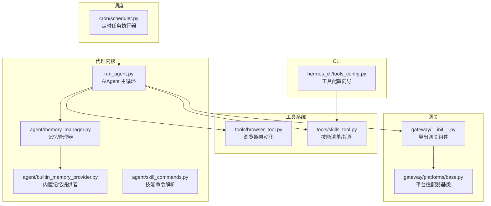
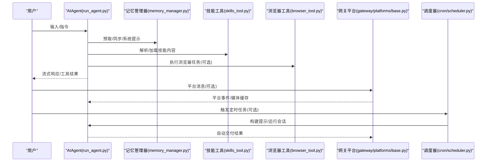
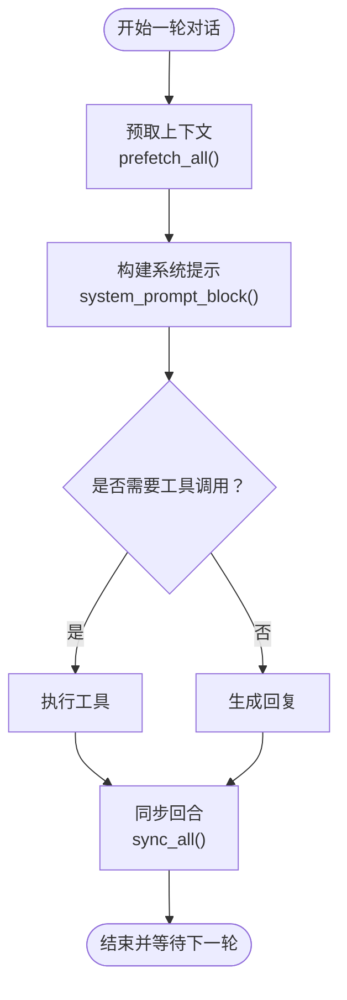
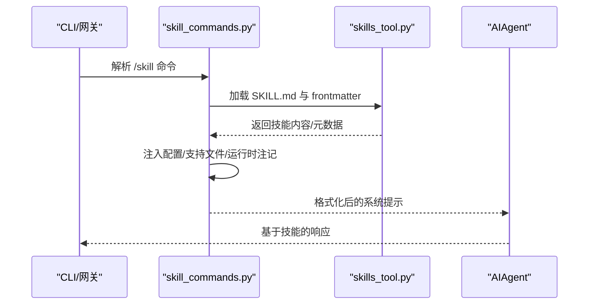
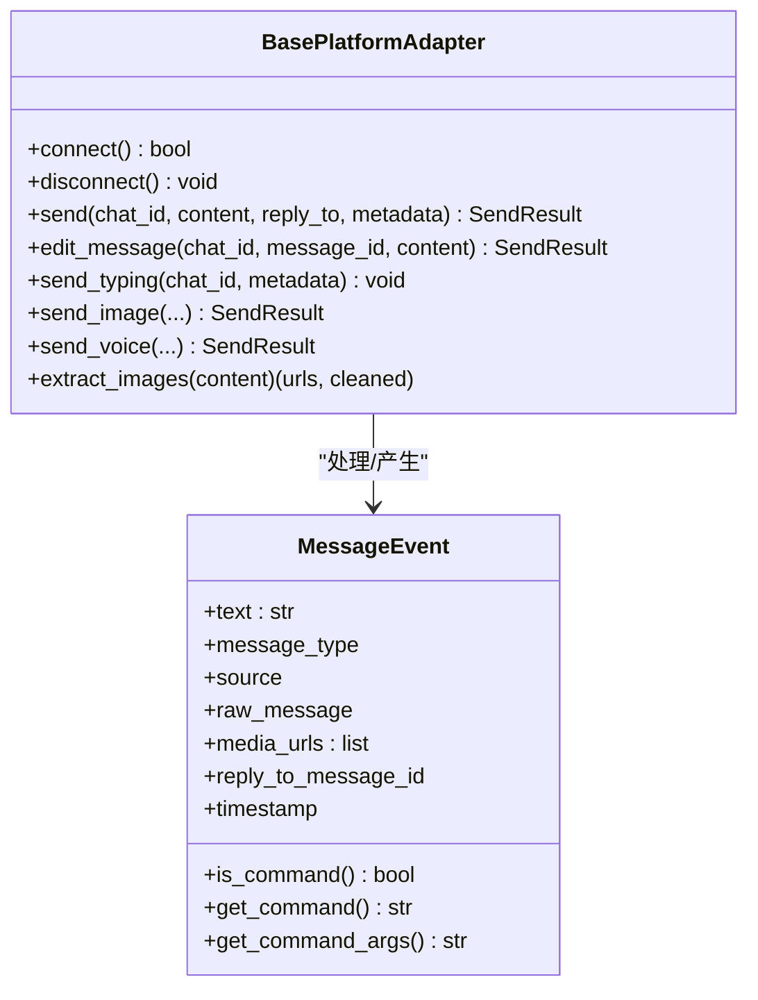
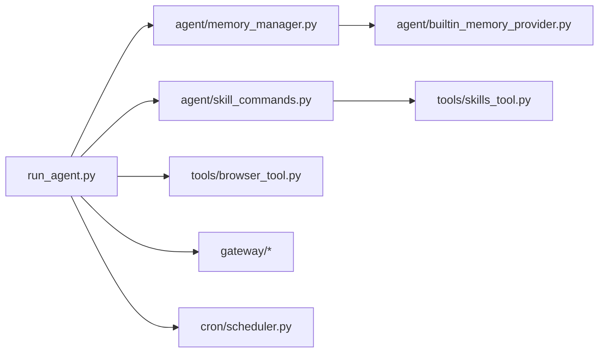

# 功能特性

<cite>
**本文引用的文件**
- [README.md](file://README.md)
- [run_agent.py](file://run_agent.py)
- [agent/memory_manager.py](file://agent/memory_manager.py)
- [agent/builtin_memory_provider.py](file://agent/builtin_memory_provider.py)
- [agent/skill_commands.py](file://agent/skill_commands.py)
- [tools/skills_tool.py](file://tools/skills_tool.py)
- [tools/browser_tool.py](file://tools/browser_tool.py)
- [gateway/__init__.py](file://gateway/__init__.py)
- [gateway/platforms/base.py](file://gateway/platforms/base.py)
- [cron/scheduler.py](file://cron/scheduler.py)
- [hermes_cli/tools_config.py](file://hermes_cli/tools_config.py)
</cite>

## 目录
1. [简介](#简介)
2. [项目结构](#项目结构)
3. [核心组件](#核心组件)
4. [架构总览](#架构总览)
5. [详细组件分析](#详细组件分析)
6. [依赖关系分析](#依赖关系分析)
7. [性能考量](#性能考量)
8. [故障排查指南](#故障排查指南)
9. [结论](#结论)
10. [附录](#附录)

## 简介
本文件面向使用者与开发者，系统性阐述 Hermes Agent 的功能特性与实现要点，重点覆盖以下方面：
- 代理学习循环：经验收集、技能创建、记忆巩固与检索增强
- 工具调用系统：40+工具的分类、能力与配置
- 技能系统：技能创建、加载、运行时注入与共享
- 内存管理：持久化记忆、用户画像与最佳实践
- 消息网关：多平台适配、权限与消息传递
- 调度系统：定时任务、自动交付与上下文文件管理
- 实际使用案例与配置示例（以路径与参考为主）

## 项目结构
Hermes Agent 采用模块化分层组织：
- agent/：代理内核、记忆、提示构建、模型路由、上下文压缩等
- tools/：工具集与工具后端（浏览器、终端、文件、图像生成、语音、MCP、技能等）
- gateway/：多平台消息网关与会话管理
- cron/：定时任务调度与自动交付
- hermes_cli/：命令行工具与配置入口
- optional-skills/ 与 skills/：可选与内置技能生态

图表来源
- [run_agent.py:1-200](file://run_agent.py#L1-L200)
- [agent/memory_manager.py:72-368](file://agent/memory_manager.py#L72-L368)
- [agent/builtin_memory_provider.py:24-115](file://agent/builtin_memory_provider.py#L24-L115)
- [agent/skill_commands.py:1-369](file://agent/skill_commands.py#L1-L369)
- [tools/browser_tool.py:1-800](file://tools/browser_tool.py#L1-L800)
- [tools/skills_tool.py:1-200](file://tools/skills_tool.py#L1-L200)
- [gateway/__init__.py:12-35](file://gateway/__init__.py#L12-L35)
- [gateway/platforms/base.py:470-800](file://gateway/platforms/base.py#L470-L800)
- [cron/scheduler.py:1-800](file://cron/scheduler.py#L1-L800)
- [hermes_cli/tools_config.py:64-138](file://hermes_cli/tools_config.py#L64-L138)

章节来源
- [README.md:14-26](file://README.md#L14-L26)
- [run_agent.py:1-200](file://run_agent.py#L1-L200)
- [gateway/__init__.py:12-35](file://gateway/__init__.py#L12-L35)

## 核心组件
- 代理主循环与工具调用：AIAgent 负责对话轮次、工具选择与执行、流式输出与中断处理
- 记忆管理：MemoryManager 统一编排内置与外部记忆提供者，支持预取、同步与工具路由
- 技能系统：skills_tool 提供技能清单与视图；skill_commands 支持 / 命令触发与运行时注入
- 浏览器工具：browser_tool 提供统一的本地/云浏览器后端、会话隔离与清理
- 网关平台：base.py 定义平台适配器接口与通用媒体缓存逻辑
- 调度系统：scheduler 执行定时任务、自动交付到任意平台
- 工具配置：tools_config 提供工具集与提供商的交互式配置

章节来源
- [run_agent.py:108-200](file://run_agent.py#L108-L200)
- [agent/memory_manager.py:72-368](file://agent/memory_manager.py#L72-L368)
- [agent/skill_commands.py:200-369](file://agent/skill_commands.py#L200-L369)
- [tools/browser_tool.py:500-656](file://tools/browser_tool.py#L500-L656)
- [gateway/platforms/base.py:470-800](file://gateway/platforms/base.py#L470-L800)
- [cron/scheduler.py:512-800](file://cron/scheduler.py#L512-L800)
- [hermes_cli/tools_config.py:64-138](file://hermes_cli/tools_config.py#L64-L138)

## 架构总览
下图展示从用户输入到工具执行、记忆检索与平台交付的关键流程。

图表来源
- [run_agent.py:108-200](file://run_agent.py#L108-L200)
- [agent/memory_manager.py:172-214](file://agent/memory_manager.py#L172-L214)
- [agent/skill_commands.py:291-327](file://agent/skill_commands.py#L291-L327)
- [tools/browser_tool.py:690-744](file://tools/browser_tool.py#L690-L744)
- [gateway/platforms/base.py:380-434](file://gateway/platforms/base.py#L380-L434)
- [cron/scheduler.py:512-783](file://cron/scheduler.py#L512-L783)

## 详细组件分析

### 代理学习循环与记忆巩固
- 经验收集：每轮对话结束后，通过 sync_all 将用户与助手消息写入各记忆提供者
- 记忆检索：prefetch_all 合并各提供者的上下文；build_memory_context_block 以围栏包裹避免模型误判为用户输入
- 内置记忆：BuiltinMemoryProvider 读取 MEMORY.md 与 USER.md，作为系统提示注入，保证提示缓存稳定
- 外部记忆：MemoryManager 仅允许一个非内置提供者注册，冲突时拒绝并告警

图表来源
- [agent/memory_manager.py:172-214](file://agent/memory_manager.py#L172-L214)
- [agent/builtin_memory_provider.py:56-76](file://agent/builtin_memory_provider.py#L56-L76)

章节来源
- [agent/memory_manager.py:72-368](file://agent/memory_manager.py#L72-L368)
- [agent/builtin_memory_provider.py:24-115](file://agent/builtin_memory_provider.py#L24-L115)

### 技能系统设计与运行
- 技能发现与命令映射：scan_skill_commands 扫描 SKILL.md，生成 / 命令键；resolve_skill_command_key 支持连字符/下划线互换
- 运行时注入：build_skill_invocation_message 将技能内容与配置注入到系统提示中，支持“支持文件”列表与运行时注记
- 预加载技能：build_preloaded_skills_prompt 支持 CLI 会话级预加载，返回缺失标识便于回退
- 技能目录结构：tools/skills_tool.py 定义了标准目录与 YAML frontmatter 字段，兼容 agentskills.io

图表来源
- [agent/skill_commands.py:200-369](file://agent/skill_commands.py#L200-L369)
- [tools/skills_tool.py:1-200](file://tools/skills_tool.py#L1-L200)

章节来源
- [agent/skill_commands.py:1-369](file://agent/skill_commands.py#L1-L369)
- [tools/skills_tool.py:1-200](file://tools/skills_tool.py#L1-L200)

### 工具调用系统（40+工具概览与配置）
- 工具集分类：hermes_cli/tools_config.py 中定义了 web、browser、terminal、file、code_execution、vision、image_gen、moa、tts、skills、todo、memory、session_search、clarify、delegation、cronjob、rl、homeassistant 等工具集
- 平台适配：不同平台默认工具集不同，通过 PLATFORMS 映射与默认值区分
- 配置流程：启用工具集后，按 TOOL_CATEGORIES 为需要密钥的工具提供提供商选择与环境变量注入
- 典型工具：browser_tool 提供统一的导航、快照、点击、输入、滚动、后退、按键、关闭、图片提取、视觉分析、控制台输出等工具与 schema

章节来源
- [hermes_cli/tools_config.py:64-138](file://hermes_cli/tools_config.py#L64-L138)
- [hermes_cli/tools_config.py:146-200](file://hermes_cli/tools_config.py#L146-L200)
- [tools/browser_tool.py:500-656](file://tools/browser_tool.py#L500-L656)

### 消息网关与多平台支持
- 平台适配器基类：BasePlatformAdapter 定义连接、发送、编辑、打字指示、媒体发送等抽象；提供消息类型枚举与事件结构
- 媒体缓存：图像/音频/文档缓存目录与清理策略，避免平台 URL 过期导致的资源失效
- 会话与状态：会话上下文构建、重置策略、运行状态写入；支持致命错误标记与通知
- 交付路由：DeliveryRouter/DeliveryTarget 在网关中用于将输出投递到指定平台或原通道

图表来源
- [gateway/platforms/base.py:367-434](file://gateway/platforms/base.py#L367-L434)
- [gateway/platforms/base.py:470-800](file://gateway/platforms/base.py#L470-L800)

章节来源
- [gateway/platforms/base.py:1-800](file://gateway/platforms/base.py#L1-L800)
- [gateway/__init__.py:12-35](file://gateway/__init__.py#L12-L35)

### 调度系统与自动交付
- 任务执行：scheduler.run_job 构建提示、加载技能、注入环境变量、解析推理与预填充消息、选择运行时提供者、执行会话并在超时时机中断
- 自动交付：resolve_delivery_target 解析目标平台/聊天 ID/线程 ID；优先使用运行中的适配器进行加密交付（如 E2EE），否则回退到独立发送
- 结果保存：脚本输出与最终响应保存为审计文档，支持静默标记抑制交付

章节来源
- [cron/scheduler.py:512-800](file://cron/scheduler.py#L512-L800)

### 上下文文件管理与委托并行化
- 上下文文件：build_context_files_prompt 与 run_agent 的上下文文件集成，确保每次对话前注入项目上下文
- 委托并行化：delegation 工具集与子代理执行，结合迭代预算与活动监控，避免长时间无进展的任务

章节来源
- [run_agent.py:78-104](file://run_agent.py#L78-L104)

## 依赖关系分析
- run_agent 依赖 agent/*（记忆、提示、压缩、显示、轨迹）、tools/*（工具定义与执行）、gateway/*（会话与平台）
- MemoryManager 依赖 MemoryProvider 接口，内置提供者始终在前，外部提供者最多一个
- skills_tool 与 skill_commands 协作，前者负责技能文件读取，后者负责命令解析与注入
- browser_tool 与 browser_providers.* 解耦，支持本地与云后端切换
- scheduler 与 gateway 并行存在，既可独立运行也可由网关驱动

图表来源
- [run_agent.py:62-104](file://run_agent.py#L62-L104)
- [agent/memory_manager.py:72-131](file://agent/memory_manager.py#L72-L131)
- [agent/skill_commands.py:45-79](file://agent/skill_commands.py#L45-L79)
- [tools/browser_tool.py:74-93](file://tools/browser_tool.py#L74-L93)
- [cron/scheduler.py:50-51](file://cron/scheduler.py#L50-L51)

章节来源
- [run_agent.py:62-104](file://run_agent.py#L62-L104)
- [agent/memory_manager.py:72-131](file://agent/memory_manager.py#L72-L131)
- [agent/skill_commands.py:45-79](file://agent/skill_commands.py#L45-L79)
- [tools/browser_tool.py:74-93](file://tools/browser_tool.py#L74-L93)
- [cron/scheduler.py:50-51](file://cron/scheduler.py#L50-L51)

## 性能考量
- 上下文压缩与令牌估算：ContextCompressor 与模型元数据工具在长上下文场景降低开销
- 工具调用节流：浏览器会话按任务 ID 隔离，空闲超时自动清理，减少资源占用
- 代理预算与活动监控：迭代预算与活动超时防止长时间卡顿，提升整体吞吐
- 缓存与预取：记忆预取与媒体缓存减少重复网络请求

## 故障排查指南
- 记忆提供者冲突：当尝试注册第二个外部记忆提供者时会被拒绝并记录警告，检查配置项以选择单一外部提供者
- 工具执行失败：查看工具返回的错误字符串与日志；对浏览器工具，确认本地/云后端可用与会话未过期
- 网关连接问题：Fatal 错误码与消息可通过平台适配器的状态写入定位；检查平台凭据与网络可达性
- 调度任务超时：若任务长时间无活动，将触发超时中断；适当提高 HERMES_CRON_TIMEOUT 或优化任务内部活动频率

章节来源
- [agent/memory_manager.py:95-108](file://agent/memory_manager.py#L95-L108)
- [gateway/platforms/base.py:545-560](file://gateway/platforms/base.py#L545-L560)
- [cron/scheduler.py:710-738](file://cron/scheduler.py#L710-L738)

## 结论
Hermes Agent 通过模块化的代理内核、统一的记忆管理、可扩展的工具体系与多平台网关，实现了跨平台、可学习、可调度的智能体系统。其技能系统与调度能力进一步增强了长期任务与自动化交付的可行性。建议在生产环境中结合上下文压缩、活动监控与媒体缓存策略，持续优化长上下文与多模态工作负载的性能与稳定性。

## 附录
- 快速开始与命令参考：参见项目自述文件中的“快速安装”“Getting Started”“CLI vs Messaging Quick Reference”
- 文档与迁移：参见项目自述文件中的“文档”“迁移自 OpenClaw”

章节来源
- [README.md:30-82](file://README.md#L30-L82)
- [README.md:85-135](file://README.md#L85-L135)